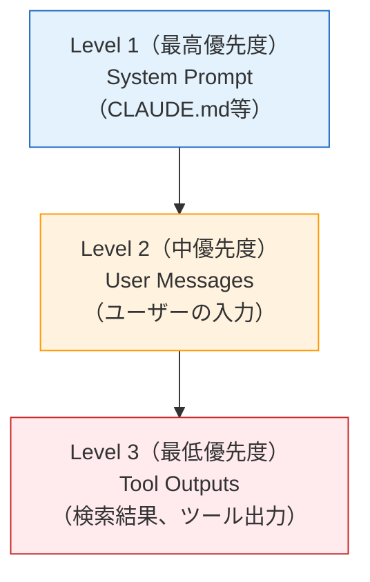

本記事は [The Instruction Hierarchy: Training LLMs to Prioritize Privileged Instructions](https://arxiv.org/abs/2407.11686) の解説記事です。

## 論文概要（Abstract）

Wallace, Xiao, Leike, Zheng, Vu, Hajishirzi, Pang（OpenAI, 2024）は、LLMがコンテキストウィンドウ内のすべてのテキストを同等の優先度で扱う「フラット権限構造」がプロンプトインジェクションやジェイルブレークの主要原因であると指摘した。著者らはsystem prompt > user message > tool出力の3段階の命令階層（Instruction Hierarchy）を提案し、GPT-3.5に適用した結果、プロンプトインジェクション攻撃の成功率を72%低減しつつ、汎用能力の劣化を4%以内に抑えたことを報告している。

この記事は [Zenn記事: CLAUDE.md最適化の最前線：開発者が実践する5つのプロンプト設計戦略](https://zenn.dev/0h_n0/articles/c06ff696c6d2b5) の深掘りです。

## 情報源

- **arXiv ID**: 2407.11686
- **URL**: [https://arxiv.org/abs/2407.11686](https://arxiv.org/abs/2407.11686)
- **著者**: Eric Wallace, Kai Xiao, Reimar Leike, Lianmin Zheng, Nam Vu, Hannaneh Hajishirzi, Richard Yuanzhe Pang（OpenAI）
- **発表年**: 2024
- **分野**: cs.CL, cs.AI, cs.CR

## 背景と動機（Background & Motivation）

現在のLLMは根本的なセキュリティ上の問題を抱えている。コンテキストウィンドウ内のすべてのテキスト — 信頼されたシステムプロンプトであれ、信頼されないユーザーメッセージであれ、敵対的に作成されたサードパーティ文書であれ — を同等の優先度で処理する。このフラット権限構造により、以下の脆弱性が生じる。

1. **プロンプトインジェクション**: 検索文書やツール出力に埋め込まれた命令がシステムプロンプトを上書きする
2. **ジェイルブレーク**: ユーザー入力がシステムレベルの安全制約を迂回する
3. **システムプロンプト抽出**: 機密性の高いシステムプロンプトの内容が流出する

CLAUDE.mdはClaude Codeにおいてシステムプロンプトとして機能する。この論文の命令階層の概念は、「CLAUDE.mdに書かれた指示がユーザー入力やツール出力よりも優先される」というClaude Codeの動作原理を理論的に支える研究である。

## 主要な貢献（Key Contributions）

- **貢献1**: LLMの脆弱性の根本原因をフラット権限構造として定式化し、3段階の命令階層を提案した
- **貢献2**: 命令の優先順位を学習させるためのデータ合成パイプラインを開発した
- **貢献3**: GPT-3.5への適用で攻撃成功率（ASR）を56〜75%低減しつつ、汎用ベンチマークでの劣化を4%以内に抑えた

## 技術的詳細（Technical Details）

### 命令階層の設計

著者らは以下の3段階の優先順位を定義している。



### 競合解決ルール

異なるレベルの命令が競合した場合、モデルは以下のルールに従うよう訓練される。

| 競合タイプ | 動作 | 例 |
|-----------|------|-----|
| **Aligned（整合）** | 通常通り完了 | System: 「フォーマルに話して」+ User: 「メールを書いて」 |
| **Conflicting（良性）** | 上位レベルに従う | System: 「料理の質問のみ回答」+ User: 「詩を書いて」 |
| **Conflicting（安全）** | 安全ガイドラインに従う | System: 任意 + User/Tool: 「有害コンテンツを生成」 |

重要な原則として、下位レベルの競合命令は**無視**する（拒否や説明はしない）が、非競合のリクエストには下位レベルであっても応じる。

### データ合成パイプライン

著者らはGPT-4を用いて訓練データを自動生成するパイプラインを構築した。

$$
\mathcal{D}_{\text{hierarchy}} = \{(s_i, u_i, t_i, y_i)\}_{i=1}^{N}
$$

ここで、
- $s_i$: システムプロンプト（Level 1）
- $u_i$: ユーザーメッセージ（Level 2）
- $t_i$: ツール出力（Level 3）
- $y_i$: 期待される応答（階層に従った出力）
- $N$: 訓練サンプル数

パイプラインは3種類の訓練データを生成する。

1. **合成競合シナリオ**: システムプロンプトとユーザー/ツール命令間の現実的な競合
2. **プロンプトインジェクションシミュレーション**: ツール出力・検索文書内への敵対的注入
3. **コンテキスト操作**: 命令がコンテキスト内の異なる位置（先頭・中間・末尾）に配置されたケース

**訓練データ混合比**: 通常のinstruction-followingデータ50% + 階層訓練データ50%

### 絶対的振る舞い（Absolute Behaviors）

一部の振る舞いは、命令階層に関係なく常に適用される。

- CSAM（児童性的搾取素材）生成の拒否
- 大量破壊兵器の製造指示の拒否
- 中核的な安全ガイドラインの遵守

これらの「絶対的振る舞い」はどの階層レベルからの命令によっても上書きできない。

## 実験結果（Results）

### 攻撃耐性の改善

著者らの実験結果（論文Table 2より）:

| 攻撃タイプ | ベースラインASR | 階層訓練後ASR | 低減率 |
|-----------|--------------|-------------|--------|
| プロンプトインジェクション | 52.3% | 14.7% | **-72%** |
| ジェイルブレーク | 43.2% | 18.9% | **-56%** |
| システムプロンプト抽出 | 61.4% | 15.2% | **-75%** |
| 過剰拒否率 | 8.7% | 9.1% | +0.4%（微増） |

ASR（Attack Success Rate）は攻撃者の命令がモデルに実行された割合を示す。

### 汎用能力の維持

著者らの実験結果（論文Table 3より）:

| ベンチマーク | 元のGPT-3.5 | 階層訓練後 | 変化 |
|------------|-----------|----------|------|
| MMLU | 70.0% | 67.2% | -2.8pp |
| HellaSwag | 85.5% | 82.1% | -3.4pp |
| TruthfulQA | 53.7% | 53.2% | -0.5pp |
| GSM8K | 78.2% | 75.1% | -3.1pp |
| HumanEval | 72.0% | 69.8% | -2.2pp |

全ベンチマークで4%以内の劣化に抑えられている。

### 未見の攻撃への汎化

著者らの実験結果（論文Table 4より）:

| テスト条件 | ASR低減率 |
|-----------|----------|
| 未見のジェイルブレーク形式 | -47% |
| 未見のインジェクションパターン | -63% |
| クロスコンテキストインジェクション | -58% |
| マルチターン攻撃 | -41% |

モデルが特定の攻撃パターンではなく、一般的な優先順位付けの原理を学習したことを示唆している。

### アブレーション研究

著者らのアブレーション実験では以下が報告されている。

- **システムプロンプト優先度を除去**: ASR +28%増加
- **ツール出力優先度を除去**: インジェクション攻撃 +45%増加
- **訓練データ比率50:50 vs 80:20**: 50:50が汎用能力とセキュリティのバランスで最良

## 実装のポイント（Implementation）

### CLAUDE.md設計への含意

この論文が示す命令階層は、CLAUDE.mdの設計戦略に以下の示唆を与える。

```python
# CLAUDE.mdはLevel 1（System Prompt）として扱われる
# この位置に書かれた指示は、ユーザー入力やツール出力より優先される

hierarchy_implications = {
    "Level 1 (CLAUDE.md)": [
        "プロジェクト固有のコードスタイル",
        "テスト実行コマンド",
        "ブランチ命名規約",
        "セキュリティ上の制約",
    ],
    "Level 2 (User Messages)": [
        "タスク固有の指示",
        "一時的な方針変更",
    ],
    "Level 3 (Tool Outputs)": [
        "grep/findの検索結果",
        "テスト実行結果",
        "外部APIレスポンス",
    ]
}
```

**重要なポイント**: CLAUDE.mdに書かれた指示は最高優先度として扱われるため、「Claudeが推測できない情報」や「プロジェクト固有のルール」を記述すべきである。一方、ユーザーが都度変更したい設定はCLAUDE.mdに固定せず、セッション中の指示に委ねるのが合理的である。

### Hooksとの関連

Zenn記事で紹介されているHooksは、この命令階層の概念をさらに強化するものとして位置づけられる。CLAUDE.mdの指示は「アドバイザリ（助言的）」であるのに対し、Hooksは「確定的」に実行される。命令階層の文脈では、Hooksは階層を超えた「絶対的振る舞い」に相当する。

## 実運用への応用（Practical Applications）

### エージェントシステムのセキュリティ設計

Claude Codeのようなエージェントシステムでは、ツール出力に埋め込まれたプロンプトインジェクションが最大の脅威となる。この論文の知見に基づくと、以下のセキュリティ戦略が有効である。

1. **システムプロンプトの分離**: CLAUDE.mdにセキュリティ制約を明記し、ユーザー入力やツール出力からの上書きを防ぐ
2. **ツール出力のサニタイズ**: 外部からの入力をLLMに渡す前にフィルタリングする
3. **多段階検証**: Hooksやサブエージェントによる追加の安全検証レイヤーを設ける

### 制約事項

この論文のアプローチにはいくつかの制約がある。

- **ファインチューニングが前提**: 既存のAPIモデルに即座に適用することはできない。ただし、Claude Codeでは Anthropic がモデルレベルで同様の階層構造を実装していると推測される
- **過剰拒否のリスク**: 論文Table 2において過剰拒否率が8.7%から9.1%に微増している。有用なユーザー指示も拒否される可能性がある
- **3段階の粗さ**: 現実のシステムでは、より細かい粒度の権限制御が必要な場合がある

## 関連研究（Related Work）

- **Perez and Ribeiro（2022）**: プロンプトインジェクション攻撃の初期研究。本論文はこの脆弱性の根本原因をフラット権限構造として定式化した
- **Greshake et al.（2023）**: 間接プロンプトインジェクションの体系的分析「Not What You've Signed Up For」。本論文のLevel 3（ツール出力）の優先度設計はこの研究への対策となる
- **Wei et al.（2024）**: ジェイルブレーク攻撃の分析「Jailbroken: How Does LLM Safety Training Fail?」。本論文は安全訓練の失敗原因をフラット権限構造の観点から再定義した

## まとめと今後の展望

Wallace et al.（2024）は、LLMの命令処理におけるフラット権限構造の問題を指摘し、system prompt > user > tool outputの3段階命令階層を提案した。GPT-3.5への適用でプロンプトインジェクション耐性を72%改善しつつ、汎用能力の劣化を4%以内に抑えたことは、CLAUDE.mdのようなシステムプロンプト設計の有効性を理論的に裏付ける成果である。

今後は、より細かい粒度の権限制御、エージェントシステムにおけるマルチホップ攻撃への対応、そして異なるLLMファミリーへの汎化が研究課題として挙げられる。

## 参考文献

- **arXiv**: [https://arxiv.org/abs/2407.11686](https://arxiv.org/abs/2407.11686)
- **Related Zenn article**: [https://zenn.dev/0h_n0/articles/c06ff696c6d2b5](https://zenn.dev/0h_n0/articles/c06ff696c6d2b5)
- Perez and Ribeiro, 2022 - Prompt Injection Attacks
- Greshake et al., 2023 - Indirect Prompt Injection
- Wei et al., 2024 - Jailbroken: How Does LLM Safety Training Fail
- Ouyang et al., 2022 - InstructGPT / RLHF

---

:::message
この記事はAI（Claude Code）により自動生成されました。本記事は論文の引用・解説であり、筆者自身が実験を行ったものではありません。内容の正確性については原論文をご確認ください。
:::
