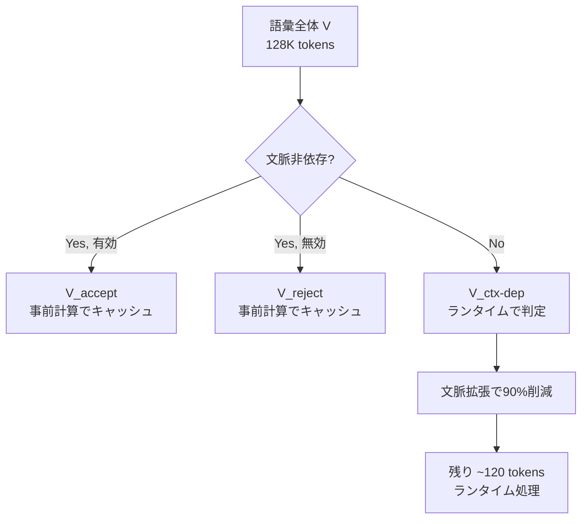
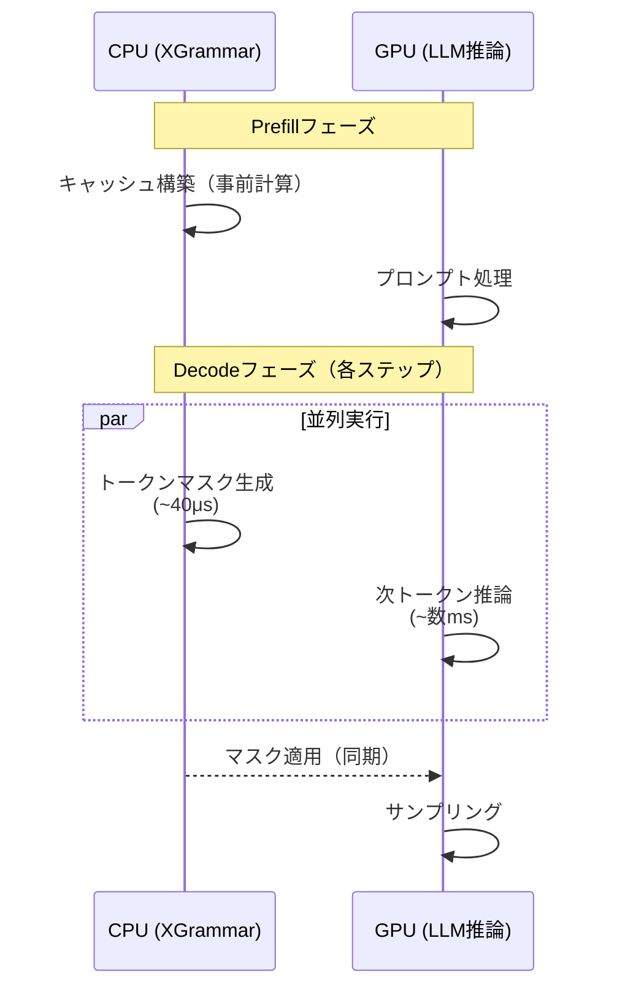

本記事は [XGrammar: Flexible and Efficient Structured Generation Engine for Large Language Models](https://arxiv.org/abs/2411.15100) の解説記事です。

## 論文概要（Abstract）

LLMの構造化出力を文脈自由文法（CFG）で制約する手法は柔軟性が高いが、トークンごとの文法検証に計算コストがかかる問題があった。著者らは、語彙全体を「文脈非依存トークン」と「文脈依存トークン」に分割し、前者のトークンマスクを事前計算・キャッシュすることでランタイムオーバーヘッドをほぼゼロに抑える**XGrammar**を提案している。MLSys 2025に採択された本論文では、Outlines比で最大100倍の高速化と、エンドツーエンドで制約なし推論に対しオーバーヘッド5%未満を達成したと報告されている。

この記事は [Zenn記事: Guidance 0.3×llguidance実践ガイド：vLLM/SGLang連携で本番運用](https://zenn.dev/0h_n0/articles/98fc937127592e) の深掘りです。

## 情報源

- **arXiv ID**: 2411.15100
- **URL**: [https://arxiv.org/abs/2411.15100](https://arxiv.org/abs/2411.15100)
- **著者**: Yixin Dong, Charlie F. Ruan, Yaxing Cai, Ruihang Lai, Ziyi Xu, Yilong Zhao, Tianqi Chen
- **発表年**: 2024（MLSys 2025採択）
- **分野**: cs.CL, cs.AI, cs.PL

## 背景と動機（Background & Motivation）

LLMにJSON SchemaやSQL等の構造化出力を生成させるには、各デコードステップで「現在の文法状態に基づき有効なトークン集合（トークンマスク）を計算する」必要がある。既存手法（Outlines、Llamacpp等）は以下の課題を抱えていた。

- **Outlines**: 正規表現をFSMにコンパイルし事前計算するが、JSON Schemaの全体をFSMで表現するとコンパイル時間が秒〜分オーダーに増大する
- **Llamacpp**: ランタイムで全128Kトークンを逐次チェックするため、トークンあたり数msのオーバーヘッドが発生する

著者らは「語彙の大部分は文法の現在位置に依存せず事前に有効/無効を判定できる」という観察に基づき、語彙分割とキャッシュの手法を提案した。

## 主要な貢献（Key Contributions）

- **貢献1**: 語彙を文脈非依存/文脈依存トークンに分割するアルゴリズムの提案。JSON文法では128Kトークン中99%以上が文脈非依存と報告されている
- **貢献2**: 文脈拡張（Context Expansion）により文脈依存トークンをさらに90%削減する最適化手法
- **貢献3**: 永続実行スタック（Persistent Execution Stack）によるCFGパーサーの高速化
- **貢献4**: LLM推論エンジンとのCo-Design（CPU文法処理とGPU推論の並列実行）

## 技術的詳細（Technical Details）

### 語彙分割アルゴリズム

XGrammarの中核は、トークナイザーの語彙 $V$ を以下の3カテゴリに分割する手法にある。

$$
V = V_{\text{accept}} \cup V_{\text{reject}} \cup V_{\text{ctx-dep}}
$$

ここで、
- $V_{\text{accept}}$: 現在の文法状態に関係なく常に有効なトークンの集合
- $V_{\text{reject}}$: 現在の文法状態に関係なく常に無効なトークンの集合
- $V_{\text{ctx-dep}}$: 文法スタック全体の状態に依存して有効/無効が決まるトークンの集合



分類の基準は、CFGパーサーのスタック操作の種類に基づく。

1. **ルール展開（Push）**: スタックに新ノードを追加 → スタックトップのみで判定可能 → 文脈非依存
2. **ルール内進行（Update）**: スタックトップのノードを更新 → スタックトップのみで判定可能 → 文脈非依存
3. **ルール完了（Pop）**: スタックからノードをポップし親ルールに戻る → スタック全体の参照が必要 → 文脈依存

著者らの実験によると、Llama-3.1の128Kトークン語彙でJSON文法を適用した場合、文脈依存トークンは1,134個（全体の0.9%）のみであったと報告されている。

### 文脈拡張（Context Expansion）

文脈依存トークンをさらに削減するため、著者らは「拡張サフィックス」の概念を導入している。

あるルール $R$ が完了した後に親ルールで続く可能性のある文字列（拡張サフィックス）を静的に解析し、文脈依存トークンのうち「いかなる拡張サフィックスとも接頭辞一致しない」トークンを事前に棄却する。

この最適化により、文脈依存トークンは1,134個から約120個に削減される（約90%削減、論文Section 3.2より）。

### 適応型トークンマスクキャッシュ

事前計算したトークンマスクの格納方法を、トークン分布パターンに応じて適応的に選択する。

- **受理優勢**（大半のトークンが有効）: 棄却トークン + 文脈依存トークンのリストのみ保持
- **棄却優勢**（大半のトークンが無効）: 受理トークン + 文脈依存トークンのリストのみ保持
- **均衡**（稀）: 語彙サイズのビットセットに圧縮

JSON文法の場合、この最適化でメモリ使用量が160MBから0.46MB（0.2%）に削減されたと報告されている（論文Section 3.1より）。

### 永続実行スタック

CFGのEarleyパーサーでは、デコードステップごとにスタック状態が変化する。著者らは複数の並列マッチングスタックを単一のツリー構造にマージする「永続実行スタック」を設計した。

- 各スタックはルートからの経路として表現
- 隣接するタイムステップ間のメモリ冗長性を排除
- ロールバックが定数時間で可能（スライディングヒストリーウィンドウ）
- プレフィックス再利用により文字チェックを70%削減

### LLM推論エンジンとのCo-Design



CPUでのマスク生成（約40μs）がGPUでのLLM推論（数ms）より高速なため、マスク生成がボトルネックにならないと著者らは主張している。

## 実装のポイント（Implementation）

```python
# XGrammarの基本的な使用パターン
import xgrammar
from pydantic import BaseModel

class OutputSchema(BaseModel):
    """構造化出力スキーマ定義"""
    name: str
    category: str
    score: float

# 1. 文法コンパイル（初回のみ、キャッシュされる）
grammar = xgrammar.Grammar.from_json_schema(
    OutputSchema.model_json_schema()
)

# 2. マッチャー生成
matcher = xgrammar.GrammarMatcher(grammar, tokenizer)

# 3. 推論ループ内でトークンマスク取得
token_mask = matcher.get_next_token_mask()
# → logitsに適用してサンプリング
```

**vLLMでの有効化**（Zenn記事のv0.12.0以降のAPIに対応）:

```bash
vllm serve meta-llama/Llama-3.1-8B-Instruct \
    --structured-outputs-config.backend xgrammar
```

**注意点**:
- XGrammarのキャッシュは同一スキーマの繰り返しリクエストで効果を発揮する。動的スキーマ（リクエストごとに異なるスキーマ）では、llguidanceの遅延コンパイルが有利になるケースがある（SqueezeBitsベンチマークより）
- JSONSchemaBench（arXiv:2501.10868）の評価では、XGrammarは過小制約（スキーマ違反を見逃す）が38件と他フレームワークより多いことが報告されている

## Production Deployment Guide

### AWS実装パターン（コスト最適化重視）

XGrammarを用いた構造化出力推論サーバーのAWS構成を示す。

**トラフィック量別の推奨構成**:

| 規模 | 月間リクエスト | 推奨構成 | 月額コスト | 主要サービス |
|------|--------------|---------|-----------|------------|
| **Small** | ~3,000 (100/日) | Serverless | $50-150 | Lambda + Bedrock + DynamoDB |
| **Medium** | ~30,000 (1,000/日) | Hybrid | $300-800 | ECS Fargate + ElastiCache |
| **Large** | 300,000+ (10,000/日) | Container | $2,000-5,000 | EKS + Karpenter + GPU Spot |

**Large構成の詳細** (月額$2,000-5,000):
- **EKS**: コントロールプレーン ($72/月)
- **EC2 GPU Spot**: g5.xlarge × 2-4台、XGrammarのCo-Designでスループット最大化 (平均$800/月)
- **Karpenter**: Spot自動スケーリング（追加コストなし）
- **ElastiCache Redis**: スキーマコンパイルキャッシュ共有 ($50/月)
- **S3**: モデルアーティファクト格納 ($20/月)

**コスト削減テクニック**:
- XGrammarのキャッシュを活用し、同一スキーマの再コンパイルを回避
- Spot Instances使用で最大90%削減（Karpenter自動管理）
- 繰り返しスキーマワークロードではXGrammar、動的スキーマではllguidanceをルーティング

**コスト試算の注意事項**:
上記は2026年2月時点のAWS ap-northeast-1（東京）リージョン料金に基づく概算値です。最新料金は[AWS料金計算ツール](https://calculator.aws/)で確認してください。

### Terraformインフラコード

**Large構成 (Container): EKS + Karpenter + Spot Instances**

```hcl
module "eks" {
  source  = "terraform-aws-modules/eks/aws"
  version = "~> 20.0"

  cluster_name    = "xgrammar-inference"
  cluster_version = "1.31"
  vpc_id          = module.vpc.vpc_id
  subnet_ids      = module.vpc.private_subnets

  cluster_endpoint_public_access = true
  enable_cluster_creator_admin_permissions = true
}

resource "kubectl_manifest" "karpenter_provisioner" {
  yaml_body = <<-YAML
    apiVersion: karpenter.sh/v1alpha5
    kind: Provisioner
    metadata:
      name: gpu-spot-provisioner
    spec:
      requirements:
        - key: karpenter.sh/capacity-type
          operator: In
          values: ["spot"]
        - key: node.kubernetes.io/instance-type
          operator: In
          values: ["g5.xlarge", "g5.2xlarge"]
      limits:
        resources:
          cpu: "32"
          memory: "128Gi"
          nvidia.com/gpu: "4"
      ttlSecondsAfterEmpty: 60
  YAML
}

resource "aws_budgets_budget" "inference_monthly" {
  name         = "xgrammar-monthly-budget"
  budget_type  = "COST"
  limit_amount = "5000"
  limit_unit   = "USD"
  time_unit    = "MONTHLY"

  notification {
    comparison_operator        = "GREATER_THAN"
    threshold                  = 80
    threshold_type             = "PERCENTAGE"
    notification_type          = "ACTUAL"
    subscriber_email_addresses = ["ops@example.com"]
  }
}
```

### 運用・監視設定

```python
import boto3

cloudwatch = boto3.client('cloudwatch')

# XGrammarキャッシュヒット率監視
cloudwatch.put_metric_alarm(
    AlarmName='xgrammar-cache-miss-rate',
    ComparisonOperator='GreaterThanThreshold',
    EvaluationPeriods=2,
    MetricName='CacheMissRate',
    Namespace='XGrammar/Inference',
    Period=300,
    Statistic='Average',
    Threshold=0.5,
    AlarmDescription='キャッシュミス率50%超過（動的スキーマワークロードの可能性）'
)
```

### コスト最適化チェックリスト

- [ ] ワークロード分析: 固定スキーマ→XGrammar、動的スキーマ→llguidance
- [ ] GPU Spot Instances: Karpenterで自動管理（最大90%削減）
- [ ] スキーマキャッシュ共有: ElastiCacheで複数ワーカー間でキャッシュ共有
- [ ] バッチサイズ最適化: XGrammar Co-Designが有効なバッチサイズ1-16で運用
- [ ] AWS Budgets: 月額$5,000上限設定
- [ ] CloudWatch: キャッシュヒット率・推論レイテンシ・スキーマコンパイル時間の監視

## 実験結果（Results）

### 文法エンジン単体の性能（論文Figure 9より）

著者らが報告したマスク生成速度の比較:

| 手法 | JSON Schema マスク生成時間 | JSON CFG マスク生成時間 |
|------|------------------------|----------------------|
| XGrammar | ~40μs/token | ~40μs/token |
| Outlines | 数ms/token | 数十ms/token |
| Llamacpp | 数ms/token | 数ms/token |

XGrammarはJSON Schema制約で3倍、完全なCFG JSON仕様では100倍以上の高速化を達成したと報告されている。

### エンドツーエンド性能（論文Table 1より）

Llama-3.1-8Bでの構造化出力生成のTPOT（Time Per Output Token）:

| バッチサイズ | 制約なし | XGrammar | オーバーヘッド |
|------------|---------|----------|------------|
| 1 | 6.2ms | 6.3ms | +1.6% |
| 4 | 7.1ms | 7.3ms | +2.8% |
| 16 | 9.0ms | 9.2ms | +2.2% |

オーバーヘッドは全バッチサイズで5%未満であり、Co-Designによるパイプライン化が効果的に機能していることが示されている。

### クロスプラットフォーム性能（論文Figure 11より）

- MacBook Pro M3 Max + Llama-3.1-8B: 制約なしとほぼ同等のレイテンシ
- iPhone 14 Pro Max + Qwen-2.5-0.5B: モバイルデバイスでも実用的な速度

## 実運用への応用（Practical Applications）

Zenn記事ではllguidanceとXGrammarの使い分けが論じられている。本論文の知見に基づくと、以下の判断基準が導出できる。

**XGrammarが適するワークロード**:
- 同一スキーマを繰り返し使用するAPIサーバー（チャットボット、データ抽出パイプライン等）
- バッチ処理でスキーマが固定されている場合
- モバイル/エッジデバイスでのオフライン推論

**llguidanceが適するワークロード**:
- リクエストごとにスキーマが異なるマルチテナント環境
- 複雑な再帰的スキーマ（XGrammarの過小制約リスクを回避）
- スキーマの正確性がビジネスクリティカルな場合（JSONSchemaBenchで過小制約1件 vs 38件）

## 関連研究（Related Work）

- **Outlines (arXiv:2407.19056)**: FSMベースの制約生成。XGrammarは正規表現コンパイルではなくCFGの語彙分割により大幅に高速化
- **Guidance/llguidance**: Earleyパーサーベースで動的スキーマに強い。XGrammarとは「キャッシュ vs 遅延コンパイル」のトレードオフ関係
- **Grammar-Aligned Decoding (arXiv:2406.06608)**: 制約付きデコーディングの確率歪み問題を指摘。XGrammarはこの問題に対する明示的な解決策を持たない

## まとめと今後の展望

XGrammarは、語彙分割とキャッシュという巧みな最適化により、構造化出力のランタイムオーバーヘッドをほぼゼロに抑えた点で工学的に優れた成果である。一方、JSONSchemaBench（arXiv:2501.10868）で報告された過小制約の問題（38件）や、動的スキーマ環境でのキャッシュ非効率は実務上の考慮事項となる。Zenn記事で推奨されているようにワークロード特性に応じてXGrammarとllguidanceを使い分けることが、現時点での現実的な運用戦略といえる。

## 参考文献

- **arXiv**: [https://arxiv.org/abs/2411.15100](https://arxiv.org/abs/2411.15100)
- **Code**: [https://github.com/mlc-ai/xgrammar](https://github.com/mlc-ai/xgrammar) (Apache 2.0)
- **Related Zenn article**: [https://zenn.dev/0h_n0/articles/98fc937127592e](https://zenn.dev/0h_n0/articles/98fc937127592e)

---

:::message
この記事はAI（Claude Code）により自動生成されました。内容の正確性については論文の記載に基づいていますが、最新の情報は公式リポジトリおよびarXiv論文をご確認ください。
:::
