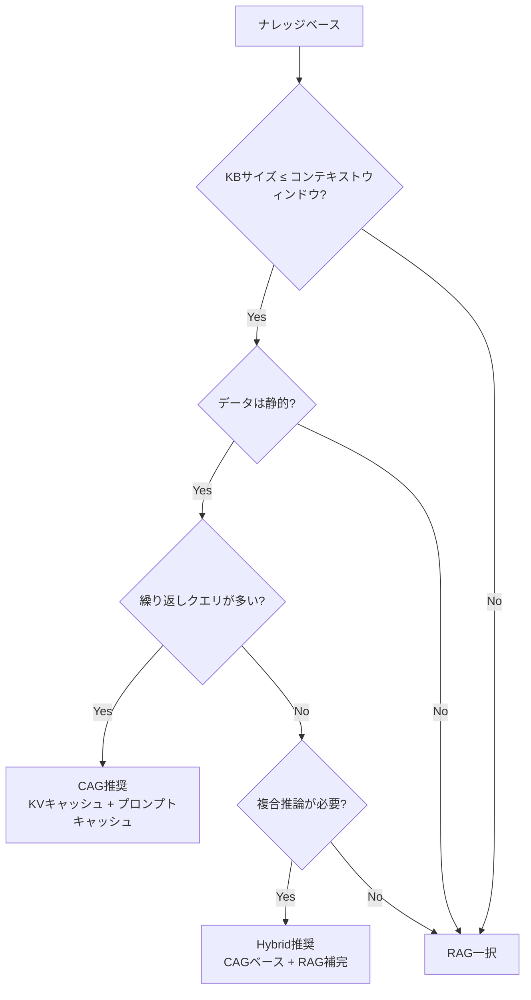

本記事は [arXiv:2501.00353 "Don't Do RAG: When Cache-Augmented Generation is Better Than Retrieval-Augmented Generation"](https://arxiv.org/abs/2501.00353) の解説記事です。

## 論文概要（Abstract）

Retrieval-Augmented Generation（RAG）はLLMに外部知識を接続する標準的アプローチとして広く採用されている。しかし、ロングコンテキストLLMの急速な進展を背景に、著者らはCache-Augmented Generation（CAG）という新しいパラダイムを提案している。CAGは、ナレッジベース全体をLLMのコンテキストウィンドウに事前投入し、KV（Key-Value）キャッシュとして保持する手法である。著者らは、SQuADおよびHotpotQAベンチマークでCAGがRAGを精度・レイテンシの両面で上回ることを実証し、コンテキスト長・モデル能力・ナレッジベースサイズに関するトレードオフを分析している。

この記事は [Zenn記事: Claude Sonnet 4.6の1Mコンテキストで構築するエージェント型RAGとレイテンシ最適化](https://zenn.dev/0h_n0/articles/47425e25dcdf30) の深掘りです。

## 情報源

- **arXiv ID**: 2501.00353
- **URL**: [https://arxiv.org/abs/2501.00353](https://arxiv.org/abs/2501.00353)
- **著者**: Brian J Chan, Chao-Ting Chen, Jui-Hung Cheng, Hen-Hsen Huang（Academia Sinica, Taiwan）
- **発表年**: 2025
- **分野**: cs.AI, cs.CL

## 背景と動機（Background & Motivation）

RAGは外部知識をLLMに接続する手法として2020年にLewisらによって提案されて以来、業界標準の位置づけを得ている。しかし、RAGパイプラインには以下の固有の制約がある：

1. **検索レイテンシ**: 各クエリごとにベクトル検索が必要で、応答時間に加算される
2. **検索失敗**: 関連文書が取得されない、または無関係な文書が混入するリスク
3. **システム複雑性**: ベクトルDB・エンベディングモデル・チャンキング戦略など多数のコンポーネントが必要

一方、GPT-4（128Kトークン）、Gemini 1.5 Pro（1Mトークン）、Claude Sonnet 4.6（1Mトークン）など、コンテキストウィンドウの急速な拡大により、ナレッジベース全体をコンテキストに投入する選択肢が現実的になっている。この背景がCAG提案の動機である。

## 主要な貢献（Key Contributions）

- **貢献1**: CAGの形式的フレームワークの定義—KVキャッシュの事前計算・保存・再利用による検索フリーQAパイプライン
- **貢献2**: SQuADおよびHotpotQAにおけるCAG vs RAGの実証的比較—CAGが精度（EM, F1）とレイテンシの両方で優位
- **貢献3**: コンテキスト長・ナレッジベースサイズ・モデル能力に基づくCAG/RAGの使い分け基準の分析

## 技術的詳細（Technical Details）

### CAGプロトコル

CAGは3ステップで構成される。

**ステップ1—プリロード（オフライン）**: ナレッジベース $KB = \{d_1, d_2, \ldots, d_N\}$ の全文書を連結し、KVキャッシュを事前計算する。

$$
C_{KB} = \text{KV}(d_1 \oplus d_2 \oplus \cdots \oplus d_N)
$$

ここで、
- $d_i$: $i$番目の文書
- $\oplus$: テキスト連結演算子
- $\text{KV}(\cdot)$: Transformer各層のKey・Value行列を計算する関数
- $C_{KB}$: ナレッジベース全体のKVキャッシュ

具体的には、Transformerの各層 $l$ （$l = 1, \ldots, L$）において、Key行列 $K_l$ とValue行列 $V_l$ が計算・保存される。

**ステップ2—推論（オンライン）**: ユーザークエリ $q$ に対し、保存済みの $C_{KB}$ をロードし、$q$ のトークンだけ追加計算して回答を生成する。

$$
a = f(q \mid C_{KB})
$$

ここで $f(\cdot)$ はLLMの生成関数を表す。

**ステップ3—キャッシュリセット**: 回答生成後、生成されたトークンのKVキャッシュを切り捨て、$C_{KB}$ の状態に戻す。これにより、前回のクエリ・回答による汚染なく、次のクエリに再利用可能となる。

### KVキャッシュの数学的基盤

Transformerのattentionは以下の式で計算される。

$$
\text{Attention}(Q, K, V) = \text{softmax}\left(\frac{QK^T}{\sqrt{d_k}}\right)V
$$

ここで、
- $Q$: Query行列（形状: `(batch_size, seq_len, d_k)`）
- $K$: Key行列
- $V$: Value行列
- $d_k$: Keyの次元数（スケーリング係数）

RoPE（Rotary Position Embedding）を使用するモデルでは、位置 $i$ のKey・Queryベクトルは回転行列 $R(i)$ を適用して計算される。

$$
k_i = R(i) \cdot W_K \cdot e_i, \quad q_i = R(i) \cdot W_Q \cdot e_i
$$

位置 $i$ と $j$ 間のattentionスコアは以下のように相対位置 $(i-j)$ のみに依存する。

$$
a_{i,j} = e_i^T W_Q^T R(i-j) W_K e_j
$$

この性質により、**モジュール内のトークンが同一の絶対位置を占める限り**、KVキャッシュは正確に再利用できる。これがCAGの数学的正当性の基盤である。

### CAG vs RAGの特性比較

著者らは論文Table 1において、以下の比較を示している。

| 特性 | RAG | CAG |
|------|-----|-----|
| ナレッジベースサイズ | 任意（スケール可能） | コンテキストウィンドウが上限 |
| 検索レイテンシ | あり（毎クエリ） | なし（オフラインでキャッシュ済み） |
| 検索失敗 | 発生しうる | 原理的に排除 |
| システム複雑性 | 高い（ベクトルDB・埋め込みモデル・検索器） | 低い（LLM + KVキャッシュのみ） |
| 初回計算コスト | 低い（インデクシング） | 高い（全KB符号化） |
| KB更新コスト | 文書単位の再エンベディング | 全体の再符号化 |



## 実装のポイント（Implementation）

著者らの実験はLLaMA 3.1 8B Instructで実施されている。実装上の重要なポイントは以下の通り。

**KVキャッシュのメモリ要件**: 128Kトークンのコンテキストに対し、LLaMA 3.1 8BのKVキャッシュは約16GBのGPUメモリを必要とする。計算式は以下の通り。

$$
\text{Storage}(m) = 2 \times L \times H \times d_h \times n_m \times \text{sizeof(dtype)}
$$

ここで $L$ はTransformerの層数、$H$ はattentionヘッド数、$d_h$ はヘッドあたりの次元数、$n_m$ はトークン数である。

**RAGベースラインの構成**: `text-embedding-ada-002` + FAISS、チャンクサイズ512トークン、オーバーラップ50トークン、top-k = 3 or 5。

**キャッシュリセットの実装**: 回答生成後にKVキャッシュを $C_{KB}$ の状態にトランケートする処理が必要。これにより、前回の質問・回答ペアのコンテキスト汚染を防止する。

```python
def cag_inference(
    model,
    kv_cache: tuple[torch.Tensor, ...],
    query_tokens: torch.Tensor,
    kb_length: int,
) -> str:
    """CAG推論: キャッシュ済みKBに対してクエリを実行

    Args:
        model: LLMモデル
        kv_cache: 事前計算済みKVキャッシュ (layer, 2, batch, heads, seq, dim)
        query_tokens: クエリのトークンID
        kb_length: ナレッジベースのトークン数（リセット位置）

    Returns:
        生成されたテキスト回答
    """
    # クエリトークンのみ追加計算（KBは計算スキップ）
    output = model.generate(
        input_ids=query_tokens,
        past_key_values=kv_cache,
        max_new_tokens=512,
    )
    answer = tokenizer.decode(output[0])

    # キャッシュリセット: KB部分のみ保持
    for layer_cache in kv_cache:
        layer_cache[0] = layer_cache[0][:, :, :kb_length, :]  # Key
        layer_cache[1] = layer_cache[1][:, :, :kb_length, :]  # Value

    return answer
```

## 実験結果（Results）

### QA精度（論文Table 2, 3より）

著者らはSQuADとHotpotQAの2つのベンチマークでCAGとRAGを比較している。

| データセット | 手法 | Exact Match (%) | F1 Score (%) |
|-------------|------|----------------|-------------|
| SQuAD | RAG (k=3) | 52.3 | 66.8 |
| SQuAD | RAG (k=5) | 55.1 | 68.4 |
| SQuAD | **CAG** | **62.7** | **74.5** |
| HotpotQA | RAG (k=3) | 28.4 | 40.2 |
| HotpotQA | RAG (k=5) | 31.6 | 44.7 |
| HotpotQA | **CAG** | **41.3** | **54.8** |

SQuADではCAGがRAG（k=5）に対してEM +7.6ポイント、F1 +6.1ポイント向上している。HotpotQAではEM +9.7ポイント、F1 +10.1ポイントと、マルチホップQAでの改善幅がより大きい。著者らは、これはRAGの検索失敗がマルチホップ設定で複合的に蓄積するためと分析している。

### レイテンシ（論文Table 4より）

| 手法 | 1クエリあたりのレイテンシ (秒) |
|------|---------------------------|
| RAG (k=3) | 2.47 |
| RAG (k=5) | 2.83 |
| CAG（キャッシュヒット） | **0.93** |
| CAG（初回、キャッシュミス） | 18.4 |

キャッシュヒット時のCAGはRAG（k=3）と比較して約2.65倍高速である。ただし、初回のKB全体の符号化に18.4秒を要する点に注意が必要である。この初回コストは後続の全クエリで償却される。測定はNVIDIA A100 80GB GPU単体で実施されている。

### ナレッジベースサイズの影響

著者らは、Wikipediaパッセージ数（10, 50, 100, 200, 500件）を変化させた実験も実施している。RAGはKBサイズ増加に伴い性能が漸減する（無関係なパッセージがノイズとなる）のに対し、CAGはコンテキストウィンドウ内であれば安定した性能を維持している。500パッセージ（約64Kトークン）でもCAGがRAGを上回る結果が報告されている。

## 実運用への応用（Practical Applications）

この論文の知見は、Zenn記事で解説しているClaude Sonnet 4.6の1Mコンテキスト活用に直結する。

**CAGが適するユースケース**:
- 社内FAQシステム（数百〜数千件のQA、静的コンテンツ）
- 製品マニュアル検索（更新頻度が低い技術文書）
- 法務文書レビュー（契約書セット全体をコンテキストに投入）

**Claude Sonnet 4.6との組み合わせ**: 1Mトークンのコンテキストウィンドウにより、約3,000〜5,000件のWikipedia記事相当をCAGで処理可能である。Anthropicのプロンプトキャッシュ機能と組み合わせることで、キャッシュRead時の入力トークン料金が基本料金の10%まで低減され、繰り返しクエリのコスト効率が大幅に向上する。

**ハイブリッドアーキテクチャ**: 著者らは、コンテキストウィンドウ付近のKBに対しては、コア文書群をCAGで処理し、周辺文書やリアルタイム更新分をRAGで補完するハイブリッド方式を推奨している。これはZenn記事のCAG/RAGハイブリッドアーキテクチャの設計方針と一致する。

## CAGの制約と注意点

著者ら自身が論文Section 6.2で指摘している制約を整理する。

1. **コンテキストウィンドウの上限**: KBが1Mトークンを超える場合、CAGは適用不可である
2. **KVキャッシュのメモリ消費**: 128Kトークン・8Bモデルで約16GBのGPUメモリが必要
3. **KB更新コスト**: KBの変更時に全体の再符号化が必要で、頻繁に更新されるデータソースには不向き
4. **Lost-in-the-Middle問題**: ロングコンテキストLLMはコンテキスト中央の情報への注意が低下する傾向があり（Liu et al., 2023）、CAGの精度に影響しうる

## 関連研究（Related Work）

- **RAG** (Lewis et al., 2020, NeurIPS): Dense Passage Retrieval + Seq2Seqによる初代RAG。CAGはこの検索ステップを排除する位置づけ
- **Lost in the Middle** (Liu et al., 2023, TACL): ロングコンテキストLLMのattention分散問題を実証。CAGの精度に影響する基礎的知見
- **Infini-attention** (Munkhdalai et al., 2024, arXiv:2404.19553): 圧縮メモリによる無限長コンテキスト処理。CAGとは補完的なアプローチ
- **SGLang** (Zheng et al., 2023, arXiv:2312.07104): RadixAttentionによるKVキャッシュ共有。Prompt Cacheと同様にCAGの実装基盤となりうる

## まとめと今後の展望

CAGは、ナレッジベースがコンテキストウィンドウに収まる場合に、RAGに対して精度（SQuAD EM +7.6pt, HotpotQA EM +9.7pt）とレイテンシ（2.65倍高速）の両面で優位性を持つパラダイムである。Claude Sonnet 4.6の1Mコンテキストウィンドウとプロンプトキャッシュ機能の組み合わせにより、この論文が提案するCAGは実用的な選択肢として機能する。ただし、KB更新頻度・メモリ制約・Lost-in-the-Middle問題を考慮した上で、CAG/RAG/Hybridの選択をワークロード特性に応じて行うことが重要である。

## 参考文献

- **arXiv**: [https://arxiv.org/abs/2501.00353](https://arxiv.org/abs/2501.00353)
- **Related Zenn article**: [https://zenn.dev/0h_n0/articles/47425e25dcdf30](https://zenn.dev/0h_n0/articles/47425e25dcdf30)
- Lewis, P., et al. (2020). Retrieval-Augmented Generation for Knowledge-Intensive NLP Tasks. *NeurIPS 2020*.
- Liu, N. F., et al. (2023). Lost in the Middle: How Language Models Use Long Contexts. *TACL 2023*.
- Reid, M., et al. (2024). Gemini 1.5: Unlocking multimodal understanding across millions of tokens. *arXiv:2403.05530*.

---

:::message
この記事はAI（Claude Code）により自動生成されました。論文の主張は著者らの報告に基づいており、本記事の筆者が独自に実験を行ったものではありません。
:::
