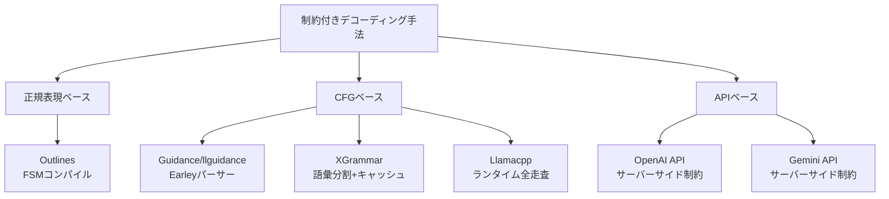

本記事は [JSONSchemaBench: A Rigorous Benchmark of Structured Outputs for Language Models](https://arxiv.org/abs/2501.10868) の解説記事です。

## 論文概要（Abstract）

LLMの構造化出力（Structured Output）は、JSONやコード等の決められた形式でモデル出力を制約する技術であり、エージェントアプリケーションやAPIレスポンス生成で不可欠な要素となっている。しかし、制約付きデコーディングフレームワーク間の性能差を体系的に評価するベンチマークが存在しなかった。本論文では、10K個の実世界JSON Schemaから構成される**JSONSchemaBench**を提案し、**効率（Efficiency）**・**カバレッジ（Coverage）**・**品質（Quality）**の3軸で6つの主要フレームワークを定量比較している。

この記事は [Zenn記事: Guidance 0.3×llguidance実践ガイド：vLLM/SGLang連携で本番運用](https://zenn.dev/0h_n0/articles/98fc937127592e) の深掘りです。

## 情報源

- **arXiv ID**: 2501.10868
- **URL**: [https://arxiv.org/abs/2501.10868](https://arxiv.org/abs/2501.10868)
- **著者**: Saibo Geng, Hudson Cooper, Michał Moskal, Samuel Jenkins, Julian Berman, Nathan Ranchin, Robert West, Eric Horvitz, Harsha Nori
- **発表年**: 2025
- **分野**: cs.CL, cs.AI

## 背景と動機（Background & Motivation）

LLMに構造化出力を生成させるアプローチは大きく2つに分かれる。1つはOpenAI APIのように**プロンプトベース**で出力形式を指示する方法、もう1つはGuidance/llguidanceやOutlines、XGrammarのように**制約付きデコーディング（Constrained Decoding）**でトークンレベルで出力を制約する方法である。

後者は原理的に文法準拠を保証できるが、フレームワークごとにJSON Schemaのサポート範囲・コンパイル速度・生成品質が大きく異なる。にもかかわらず、これらを統一的に比較するベンチマークが存在せず、実務でのフレームワーク選定は断片的な情報に基づいていた。著者らはこの問題を解決するため、JSONSchemaBenchを提案した。

## 主要な貢献（Key Contributions）

- **貢献1**: 10K個の実世界JSON Schemaを10カテゴリの複雑度に分類したベンチマークデータセットの構築
- **貢献2**: 効率・カバレッジ・品質の3軸からなる評価フレームワークの設計
- **貢献3**: 6つの主要フレームワーク（Guidance/llguidance、Outlines、XGrammar、Llamacpp、OpenAI、Gemini）の定量比較とJSON Schema Test Suiteでの機能カバレッジ分析

## 技術的詳細（Technical Details）

### ベンチマークデータセット構成

著者らは、実世界のJSON Schemaを以下の10ソースから収集・整理した（論文Table 1より）。

| データセット | スキーマ数 | 複雑度カテゴリ |
|-------------|----------|--------------|
| GitHub-Trivial | 444 | 最小制約 |
| GlaiveAI-2K | 1,707 | 関数シグネチャ |
| GitHub-Easy | 1,943 | 単純制約 |
| GitHub-Medium | 1,976 | 中程度のネスト |
| GitHub-Hard | 1,240 | 複雑な階層構造 |
| Kubernetes | 1,064 | コンテナオーケストレーション |
| Snowplow | 403 | イベント駆動分析 |
| JSON Schema Store | 492 | 業界標準 |
| Washington Post | 125 | コンテンツ管理 |
| GitHub-Ultra | 164 | 極限複雑度 |

合計約9,558スキーマで構成され、`type`、`properties`、`required`、`items`、`enum`、`pattern`（正規表現）、`$ref`（参照）、`anyOf`/`oneOf`（条件分岐）など多様なJSON Schemaキーワードをカバーしている。

### 評価軸の設計

著者らは3つの評価軸を定義した。

**1. 効率（Efficiency）**

制約付きデコーディングのオーバーヘッドを3つのメトリクスで測定する。

- **Grammar Compilation Time（GCT）**: JSON Schemaを内部文法表現にコンパイルする時間
- **Time to First Token（TTFT）**: 最初のトークンが生成されるまでの時間
- **Time Per Output Token（TPOT）**: 出力トークンあたりの生成時間

**2. カバレッジ（Coverage）**

フレームワークがJSON Schemaのどの機能をどこまで正しくサポートしているかを3段階で測定する。

- **Declared Coverage**: フレームワークがコンパイルエラーなしで受理するスキーマの割合
- **Empirical Coverage**: 実際に生成した出力がスキーマに準拠する割合
- **Compliance Rate**: Empirical / Declared比。1に近いほど「宣言通り正しく制約できている」

**3. 品質（Quality）**

構造化出力の強制がLLMの推論精度に与える影響を、Last Letter Concatenation、Shuffle Objects、GSM8K等の下流タスクで測定する。

### フレームワーク比較の技術的背景

各フレームワークの制約手法は以下のように分類される。



- **Outlines**: JSON Schemaを正規表現に変換し、有限状態機械（FSM）にコンパイル。トークナイザーとFSM状態遷移の事前アラインメントにより各ステップO(1)でトークンマスクを生成
- **Guidance/llguidance**: Earleyアルゴリズムベースのパーサーと正規表現微分ベースのレキサーを組み合わせたCFGパーサー。JSON Schemaを直接文脈自由文法として解析
- **XGrammar**: 語彙を「文脈非依存トークン」と「文脈依存トークン」に分割し、前者のマスクを事前計算・キャッシュ
- **Llamacpp**: ランタイムで全トークンの有効性をチェック

## 実験結果（Results）

### 効率メトリクス（論文Table 2より、Llama-3.1-8B使用）

著者らが報告した効率メトリクスの比較を以下に示す。

| フレームワーク | GCT（秒） | TPOT（ms） |
|--------------|-----------|-----------|
| Guidance/llguidance | 0.00-0.01 | 6.37-9.47 |
| Llamacpp | 0.05-0.06 | 27.22-29.98 |
| XGrammar | 0.12-0.30 | — |
| Outlines | 3.48-8.05 | 30.33-46.57 |
| LM-only（制約なし） | — | 15.32-16.68 |

Guidance/llguidanceはGCTがほぼゼロで、TPOTも制約なしベースラインより高速（6.37ms vs 15.32ms）であると報告されている。著者らはこれをトークンヒーリング等の最適化によるものと分析している。

### カバレッジ（論文Table 4より、Llama-3.2-1B使用）

各データセットにおけるDeclared Coverage → Empirical Coverageの推移を示す。

**GlaiveAI-2K（関数シグネチャ、比較的単純）**:
- Guidance: 98% → 96%（Compliance Rate: 0.98）
- Outlines: 99% → 95%（Compliance Rate: 0.96）
- OpenAI: 89% → 89%（Compliance Rate: 1.00）

**GitHub-Hard（複雑な階層構造）**:
- Guidance: 60% → 41%（Compliance Rate: 0.68）
- Outlines: 47% → 3%（Compliance Rate: 0.06）
- OpenAI: 9% → 9%（Compliance Rate: 1.00）

**JSON Schema Store（業界標準、最も複雑）**:
- Guidance: 35% → 30%（Compliance Rate: 0.86）
- Outlines: 38% → 9%（Compliance Rate: 0.24）
- Llamacpp: 54% → 38%（Compliance Rate: 0.70）

複雑度が上がるほどフレームワーク間の差が顕著になる。特にOutlinesはGitHub-HardでのCompliance Rateが0.06と、宣言したサポートの大部分で実際には正しいJSON出力を生成できていないことが示されている。

### JSON Schema Test Suite結果（論文Table 5-6より）

43カテゴリのテストスイートにおける完全カバレッジ達成数:

| フレームワーク | 完全カバレッジカテゴリ数 |
|--------------|---------------------|
| Guidance | 13 |
| Llamacpp | 1 |
| XGrammar | 1 |
| Outlines | 0 |

失敗モードの分類（論文Table 6より）:

| 失敗タイプ | Outlines | Llamacpp | XGrammar | Guidance |
|-----------|----------|----------|----------|----------|
| コンパイルエラー | 42 | 37 | 3 | 25 |
| 過剰制約（有効な出力を拒否） | 16 | 18 | 5 | 7 |
| 過小制約（無効な出力を許可） | 8 | 7 | 38 | 1 |

XGrammarはコンパイルエラーが最少（3件）だが、過小制約が38件と突出して多い。これは、XGrammarがスキーマを受理するものの一部の制約を無視して無効な出力を通してしまうケースがあることを示している。一方、Guidanceは過小制約が1件のみであり、制約の正確性で優位にある。

### 品質評価（論文Table 8より）

構造化出力の強制が下流タスク精度に与える影響:

| タスク | LM-only | XGrammar | Llamacpp | Outlines | Guidance |
|-------|---------|----------|----------|----------|----------|
| Last Letter | 50.7% | 51.2% | 52.0% | 53.3% | 54.0% |
| Shuffle Objects | 52.6% | 52.7% | 52.6% | 53.0% | 55.9% |
| GSM8K | 80.1% | 83.7% | 82.4% | 81.6% | 83.8% |

制約付きデコーディングは精度を低下させるどころか、最大3.7ポイント向上させたと報告されている。特にGuidance/llguidanceはすべてのタスクで最高精度を達成している。

## 実装のポイント（Implementation）

JSONSchemaBenchを用いた評価を実務に活かす際の要点を整理する。

```python
from pydantic import BaseModel, Field
from typing import Optional

# BAD: 過度にネストしたスキーマ（カバレッジ低下リスク）
class DeeplyNestedSchema(BaseModel):
    level1: dict  # anyOf/oneOfの多用はカバレッジ低下の要因

# GOOD: フラットで明示的なスキーマ（高カバレッジ）
class FlatSchema(BaseModel):
    """JSONSchemaBenchの知見に基づく推奨設計"""
    name: str = Field(max_length=100)
    category: str = Field(pattern=r"^(tech|idea|news)$")
    score: float = Field(ge=0.0, le=1.0)
    tags: list[str] = Field(min_length=1, max_length=5)
```

**フレームワーク選定の判断基準（論文の知見に基づく）**:

1. **スキーマ複雑度が低い場合**（GlaiveAI-2K相当）: どのフレームワークでもカバレッジ90%以上。コンパイル速度でGuidance/llguidanceが有利
2. **スキーマ複雑度が高い場合**（GitHub-Hard以上）: Guidanceが最も安定。Outlinesは大幅にカバレッジが低下する
3. **制約の正確性が重要な場合**: Guidanceの過小制約率1件は他を圧倒。XGrammarは38件の過小制約に注意
4. **レイテンシ重視の場合**: Guidanceのコンパイル時間0.01秒以下とTPOT 6-9msは全フレームワーク中最速

## Production Deployment Guide

### AWS実装パターン（コスト最適化重視）

JSONSchemaBenchの知見を踏まえた構造化出力APIの本番構成を示す。

**トラフィック量別の推奨構成**:

| 規模 | 月間リクエスト | 推奨構成 | 月額コスト | 主要サービス |
|------|--------------|---------|-----------|------------|
| **Small** | ~3,000 (100/日) | Serverless | $50-150 | Lambda + Bedrock + DynamoDB |
| **Medium** | ~30,000 (1,000/日) | Hybrid | $300-800 | Lambda + ECS Fargate + ElastiCache |
| **Large** | 300,000+ (10,000/日) | Container | $2,000-5,000 | EKS + Karpenter + EC2 Spot |

**Small構成の詳細** (月額$50-150):
- **Lambda**: 1GB RAM, 60秒タイムアウト ($20/月)
- **Bedrock**: Claude 3.5 Haiku, Prompt Caching有効 ($80/月)
- **DynamoDB**: On-Demand、スキーマキャッシュ用 ($10/月)
- **CloudWatch**: 基本監視 ($5/月)
- **API Gateway**: REST API ($5/月)

**コスト削減テクニック**:
- Bedrock Batch APIで非リアルタイム処理を50%削減
- Prompt Cachingでシステムプロンプト固定部分を30-90%削減
- スキーマコンパイル結果のDynamoDBキャッシュで再コンパイル回避

**コスト試算の注意事項**:
上記は2026年2月時点のAWS ap-northeast-1（東京）リージョン料金に基づく概算値です。実際のコストはトラフィックパターン、リージョン、バースト使用量により変動します。最新料金は[AWS料金計算ツール](https://calculator.aws/)で確認してください。

### Terraformインフラコード

**Small構成 (Serverless): Lambda + Bedrock + DynamoDB**

```hcl
module "vpc" {
  source  = "terraform-aws-modules/vpc/aws"
  version = "~> 5.0"

  name = "structured-output-vpc"
  cidr = "10.0.0.0/16"
  azs  = ["ap-northeast-1a", "ap-northeast-1c"]
  private_subnets = ["10.0.1.0/24", "10.0.2.0/24"]

  enable_nat_gateway   = false
  enable_dns_hostnames = true
}

resource "aws_iam_role" "lambda_bedrock" {
  name = "lambda-structured-output-role"

  assume_role_policy = jsonencode({
    Version = "2012-10-17"
    Statement = [{
      Action    = "sts:AssumeRole"
      Effect    = "Allow"
      Principal = { Service = "lambda.amazonaws.com" }
    }]
  })
}

resource "aws_iam_role_policy" "bedrock_invoke" {
  role = aws_iam_role.lambda_bedrock.id
  policy = jsonencode({
    Version = "2012-10-17"
    Statement = [{
      Effect   = "Allow"
      Action   = ["bedrock:InvokeModel", "bedrock:InvokeModelWithResponseStream"]
      Resource = "arn:aws:bedrock:ap-northeast-1::foundation-model/anthropic.claude-3-5-haiku*"
    }]
  })
}

resource "aws_lambda_function" "structured_output" {
  filename      = "lambda.zip"
  function_name = "structured-output-handler"
  role          = aws_iam_role.lambda_bedrock.arn
  handler       = "index.handler"
  runtime       = "python3.12"
  timeout       = 60
  memory_size   = 1024

  environment {
    variables = {
      BEDROCK_MODEL_ID    = "anthropic.claude-3-5-haiku-20241022-v1:0"
      DYNAMODB_TABLE      = aws_dynamodb_table.schema_cache.name
      ENABLE_PROMPT_CACHE = "true"
    }
  }
}

resource "aws_dynamodb_table" "schema_cache" {
  name         = "schema-compilation-cache"
  billing_mode = "PAY_PER_REQUEST"
  hash_key     = "schema_hash"

  attribute {
    name = "schema_hash"
    type = "S"
  }

  ttl {
    attribute_name = "expire_at"
    enabled        = true
  }
}
```

### 運用・監視設定

```python
import boto3

cloudwatch = boto3.client('cloudwatch')

# スキーマコンパイルエラー率監視
cloudwatch.put_metric_alarm(
    AlarmName='schema-compilation-failure-rate',
    ComparisonOperator='GreaterThanThreshold',
    EvaluationPeriods=1,
    MetricName='CompilationFailures',
    Namespace='StructuredOutput',
    Period=3600,
    Statistic='Sum',
    Threshold=10,
    AlarmDescription='スキーマコンパイル失敗が1時間に10件超過'
)
```

### コスト最適化チェックリスト

- [ ] ~100 req/日 → Lambda + Bedrock (Serverless) - $50-150/月
- [ ] ~1000 req/日 → ECS Fargate + Bedrock (Hybrid) - $300-800/月
- [ ] 10000+ req/日 → EKS + Spot Instances (Container) - $2,000-5,000/月
- [ ] Bedrock Batch API: 50%割引（非リアルタイム処理）
- [ ] Prompt Caching: 30-90%削減
- [ ] スキーマコンパイル結果キャッシュ（DynamoDB TTL付き）
- [ ] Lambda メモリサイズ最適化（CloudWatch Insights分析）
- [ ] AWS Budgets: 月額予算設定（80%で警告）

## 実運用への応用（Practical Applications）

JSONSchemaBenchの知見は、Zenn記事で紹介されているGuidance 0.3 + llguidanceの本番運用に直接活用できる。

**スキーマ設計の指針**: 論文Table 4の結果から、GitHub-Hard以上の複雑度のスキーマではフレームワーク間の差が顕著になる。本番環境ではスキーマのネスト深度を2-3レベルに抑え、`anyOf`/`oneOf`の使用を最小限にすることで、どのフレームワークでも高いカバレッジを維持できる。

**バックエンド選定**: Zenn記事ではllguidanceとXGrammarの使い分けを論じているが、JSONSchemaBenchの過小制約率（XGrammar: 38件、Guidance: 1件）は重要な判断材料となる。出力の正確性が求められるワークロードではllguidanceが適している。

**品質担保**: 論文Table 8で示された通り、制約付きデコーディングは推論精度を向上させる傾向にある。構造化出力のレイテンシオーバーヘッドを懸念して制約なし生成に留まるのは、品質面でも機会損失となり得る。

## 関連研究（Related Work）

- **XGrammar (arXiv:2411.15100)**: 語彙分割による高速トークンマスク計算。JSONSchemaBenchではコンパイルエラーは少ないが過小制約率が高い
- **Outlines (arXiv:2407.19056)**: FSMベースの制約生成。複雑スキーマでコンパイル時間が急増（最大8秒）する課題が報告されている
- **Grammar-Aligned Decoding (arXiv:2406.06608)**: 制約付きデコーディングの確率歪み問題を理論的に分析。JSONSchemaBenchとは補完的な評価視点を提供

## まとめと今後の展望

JSONSchemaBenchは、構造化出力フレームワークの選定に必要な定量的根拠を初めて体系的に提供した研究である。著者らは、Guidance/llguidanceが効率・カバレッジ・品質の3軸すべてで高い水準を達成していると報告しているが、同時に複雑なスキーマ（GitHub-Hard/Ultra）ではどのフレームワークもカバレッジが大幅に低下する課題を明らかにしている。今後、JSON Schemaの`$ref`や`anyOf`等の高度な機能への対応が各フレームワークの差別化ポイントとなると考えられる。

## 参考文献

- **arXiv**: [https://arxiv.org/abs/2501.10868](https://arxiv.org/abs/2501.10868)
- **Code/Dataset**: [https://github.com/guidance-ai/jsonschemabench](https://github.com/guidance-ai/jsonschemabench)
- **Related Zenn article**: [https://zenn.dev/0h_n0/articles/98fc937127592e](https://zenn.dev/0h_n0/articles/98fc937127592e)

---

:::message
この記事はAI（Claude Code）により自動生成されました。内容の正確性については論文の記載に基づいていますが、最新の情報は公式リポジトリおよびarXiv論文をご確認ください。
:::
