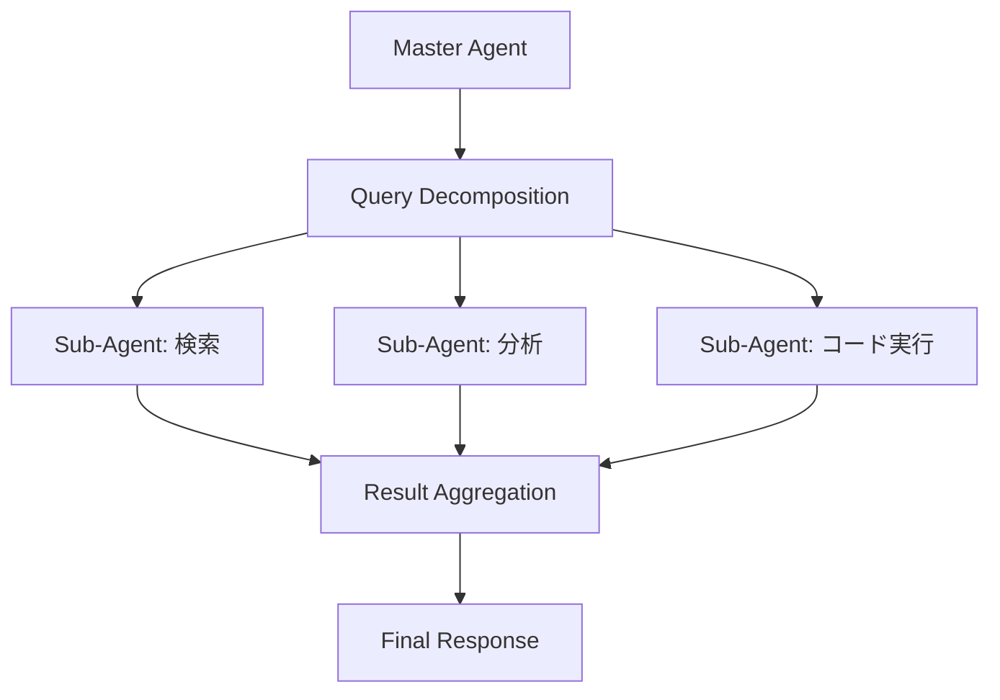
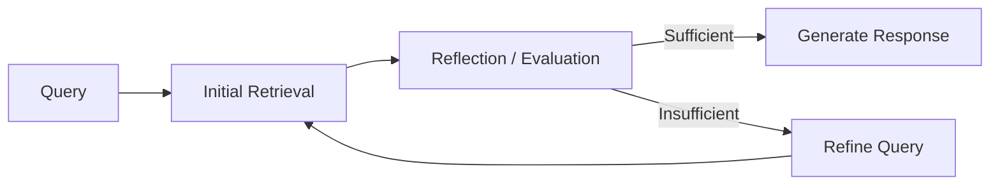

## 論文概要（Abstract）

本論文は、従来の静的・単一ターン型RAG（Retrieval-Augmented Generation）の限界を超え、自律エージェントが動的意思決定・多段階推論・適応的検索を行う「Agentic RAG」を包括的にサーベイした研究である。著者らは、Naive RAG → Advanced RAG → Modular RAG → Agentic RAGという進化の系譜を整理し、単一エージェント/マルチエージェントアーキテクチャ、ルーティングメカニズム、クエリ計画、ツール使用、メモリシステム、自己反省パターンを体系的に解説している。医療・金融・法律・科学研究・マルチモーダルへの応用も網羅し、標準ベンチマーク整備と解釈可能性向上を今後の課題として提示している。

この記事は [Zenn記事: Claude Sonnet 4.6の1Mコンテキストで構築するエージェント型RAGとレイテンシ最適化](https://zenn.dev/0h_n0/articles/47425e25dcdf30) の深掘りです。

## 情報源

- **arXiv ID**: 2501.15372
- **URL**: [https://arxiv.org/abs/2501.15372](https://arxiv.org/abs/2501.15372)
- **著者**: Aditi Singh, Abul Ehtesham, Saket Kumar, Tala Talaei Khoei
- **発表年**: 2025
- **分野**: cs.IR, cs.AI, cs.CL, cs.LG, cs.MA

## 背景と動機（Background & Motivation）

LLMは知識のカットオフ、ハルシネーション、動的な情報アクセス不能という根本的な制約を持つ。従来のRAGはこれらの制約を外部知識ベースからの検索で補完するアプローチとして導入されたが、著者らは従来RAGの3つの構造的限界を指摘している。

第一に、固定パイプラインによる**検索の硬直性**。中間結果に基づいて検索戦略を動的に適応させることができない。第二に、**多段階推論の困難さ**。複数のドキュメントにまたがる情報統合を必要とするタスクでは、単一パスの検索では不十分である。第三に、**単一ターン制約**。マルチターン対話や長期タスクの文脈を維持する機構が欠如している。

Agentic RAGはこれらの制約に対し、自律エージェントの計画・実行・反省・改善のサイクルを導入することで根本的な解決を図るアプローチである。

## 主要な貢献（Key Contributions）

- **RAGパラダイムの体系的分類**: Naive → Advanced → Modular → Agentic の進化段階を自律性・適応性・推論能力の観点で整理
- **アーキテクチャパターンの網羅的分析**: 単一エージェント（ReAct / Plan-and-Execute / Self-Ask）とマルチエージェント（Hierarchical / Collaborative / Federated）の6パターンを比較
- **技術コンポーネントの詳細解説**: ルーティング、クエリ計画、ツール使用、メモリシステム、自己反省の5つのコア技術を体系化
- **ドメイン別応用の整理**: 医療・金融・法律・科学研究・マルチモーダルの5ドメインにおけるAgentic RAGの適用事例を分類

## 技術的詳細（Technical Details）

### RAGパラダイムの進化（Table 1より）

著者らはRAGの進化を4段階に分類している。

| Feature | Naive RAG | Advanced RAG | Modular RAG | Agentic RAG |
|:--|:--|:--|:--|:--|
| Retrieval | Single-pass | Enhanced indexing | Modular retrieval | Dynamic, adaptive |
| Reasoning | None | Limited | Modular | Multi-step |
| Context | Single-turn | Single-turn | Multi-turn | Multi-turn, multi-domain |
| Adaptability | Low | Moderate | High | Very High |
| Tools | None | Basic | Modular | Extensive |
| Autonomy | None | Low | Moderate | High |

Advanced RAGは階層的インデキシング、ハイブリッド検索（BM25 + Dense Embedding）、クエリ書き換え、コンテキスト圧縮といった技術で検索品質を向上させる。Modular RAGはRetrieval / Reasoning / Memory / Toolの各モジュールをプラグアンドプレイで組み替え可能にした。Agentic RAGはさらに動的意思決定・自己反省・ツール統合を加え、最も高い自律性を実現する。

### Single-Agent Agentic RAGの実装パターン

著者らは単一エージェント型のAgentic RAGについて、3つの主要な実装パターンを分類している。

#### 1. ReAct（Reasoning + Acting）

Yao et al. (2022) が提案したパターンで、推論トレース（"think" ステップ）とアクション実行（"act" ステップ）を交互に実行する。

```
Thought: ユーザーのクエリは複数の情報源からの統合が必要
Action: search("RAG latency optimization techniques")
Observation: [検索結果]
Thought: 検索結果は部分的。キャッシュ戦略も調べる必要がある
Action: search("KV cache precomputation LLM")
Observation: [検索結果]
Thought: 十分な情報が集まった。回答を生成する
Action: generate_response(context=[...])
```

このパターンの特徴は、各ステップで取得した情報を評価し、次のアクションを動的に決定できる点にある。単一ドメインの順次推論に適している。

#### 2. Plan-and-Execute

複雑タスクを事前にサブタスクに分解し、計画を立ててから順次実行するパターン。構造化された階層的タスクに有効で、実行順序が重要な場面で力を発揮する。

#### 3. Self-Ask

自己生成した後続質問で検索をガイドするパターン。「この質問に答えるには、まず〇〇を知る必要がある」という形でサブクエリを自動生成し、段階的に情報を収集する。多段階推論における一貫性を向上させる。

### Multi-Agent Agentic RAGのアーキテクチャ

著者らはマルチエージェント型のAgentic RAGについて、3つのアーキテクチャパターンを分類している（Table 2より）。

| Aspect | Single-Agent RAG | Multi-Agent RAG |
|:--|:--|:--|
| Architecture | Centralized | Distributed |
| Complexity | Low | High |
| Task Suitability | Single-domain, sequential | Multi-domain, parallel |
| Scalability | Limited | High |
| Coordination | N/A | Required |
| Fault Tolerance | Low | High (redundancy) |
| Use Cases | Q&A, simple reasoning | Complex research, multi-domain tasks |

#### 1. Hierarchical Multi-Agent Systems

マスターエージェントがタスクを分解し、専門サブエージェントに委任する。各サブエージェントの結果をマスターが集約して最終回答を生成する。



#### 2. Collaborative Multi-Agent Systems

複数エージェントが並列でタスクの異なる側面を処理し、共有メモリまたはコンテキストウィンドウで情報を共有する。多様な専門知識が必要な場面で有効である。

#### 3. Federated Multi-Agent Systems

エージェントが分散データソースで独立動作し、生データを共有せずに結果のみを統合する。プライバシー要件が厳しい医療・金融分野に適している。

### ルーティングメカニズム

著者らはクエリを適切な検索戦略・エージェント・データソースに振り分けるルーティングについて、4種類を分類している。

| ルーティング種別 | 手法 | 適用場面 |
|:--|:--|:--|
| Query-Based | クエリの意味内容・構造で分類（factual / analytical / comparative） | 汎用 |
| Metadata-Based | ドキュメントタイプ・日付・ソースでフィルタ | 構造化ナレッジベース |
| Semantic | 埋め込みベースの類似度マッチング | 非構造化データ |
| Hybrid | 複数戦略の組み合わせ | 異種データソース混在 |

著者らによると、ルーターは軽量分類器またはLLMベースの推論モジュールとして実装され、LlamaIndexのRouterQueryEngineがフレームワークとして提供されている。

Zenn記事で提案されているエージェント型ルーティング（クエリ特性に基づいてCAG/RAGを切り替える機構）は、このHybrid Routingに該当する。

### 自己反省と反復検索パターン

著者らは自己反省（Self-Reflection）をAgentic RAGの核心的能力として位置づけ、4つのパターンを紹介している。

#### SELF-RAG（Asai et al., 2023）

特別な「reflection tokens」を生成して取得情報の品質を動的に評価する。以下の3つのメトリクスで判断を行う。

- **Relevance Score**: 取得ドキュメントとクエリの意味的類似度
- **Faithfulness Score**: 生成応答が取得情報を正確に反映しているか
- **Completeness Score**: 取得情報がクエリに対して十分か

#### CRAG（Corrective RAG）

軽量評価器で取得ドキュメント品質を評価し、品質が不十分と判断した場合にWeb検索をフォールバックとしてトリガーする。

#### Reflexion（Shinn et al., 2023）

口頭的自己反省（verbal self-reflection）により過去のミスから学習するパターン。エージェントが自身の過去アクションに対するフィードバックを言語的に生成し、戦略を漸進的に改善する。

#### Chain-of-Thought（CoT）Reasoning

Wei et al. (2022) が提案したステップバイステップ推論を検索・生成プロセスに統合する手法。多段階推論の一貫性と精度を向上させる。

**反復検索のフロー**:



### メモリシステム

著者らは4種類のメモリタイプを分類している。

| タイプ | 保存場所 | 用途 | 具体例 |
|:--|:--|:--|:--|
| Short-Term Memory | コンテキストウィンドウ内 | マルチターン対話の一貫性 | 直近の対話履歴 |
| Long-Term Memory | 外部DB・ベクトルストア | セッション横断の永続化 | ユーザー嗜好、過去の回答 |
| Episodic Memory | 体験ストア | 過去体験からの学習 | 成功/失敗した検索パターン |
| Semantic Memory | 知識グラフ・埋め込み | 構造化知識の検索・推論 | エンティティ関係、概念体系 |

Zenn記事で言及されているプロンプトキャッシュ（Anthropicの5分/1時間TTLキャッシュ）は、このメモリシステムの文脈ではShort-Term Memoryの一種と位置づけられる。KVキャッシュの事前計算は、推論時のメモリ再利用として効率的なShort-Term Memory実装と解釈できる。

## 実装のポイント（Implementation）

### アーキテクチャ選択の判断基準

著者らのTable 2に基づく、Single-Agent vs Multi-Agent の選択基準を実装視点で整理する。

```python
from enum import Enum
from dataclasses import dataclass


class AgentArchitecture(Enum):
    """Agentic RAGアーキテクチャ種別"""
    SINGLE_REACT = "single_react"
    SINGLE_PLAN_EXECUTE = "single_plan_execute"
    MULTI_HIERARCHICAL = "multi_hierarchical"
    MULTI_COLLABORATIVE = "multi_collaborative"
    MULTI_FEDERATED = "multi_federated"


@dataclass
class TaskRequirements:
    """タスク要件の定義"""
    num_domains: int
    requires_parallel: bool
    privacy_sensitive: bool
    task_complexity: str  # "simple" | "moderate" | "complex"


def select_architecture(requirements: TaskRequirements) -> AgentArchitecture:
    """タスク要件に基づくアーキテクチャ選択

    Singh et al. (2025) Table 2の知見に基づく判定ロジック。

    Args:
        requirements: タスク要件

    Returns:
        推奨アーキテクチャ
    """
    # プライバシー要件が厳しい場合はFederated
    if requirements.privacy_sensitive:
        return AgentArchitecture.MULTI_FEDERATED

    # 単一ドメインかつシンプルなタスク
    if requirements.num_domains == 1 and requirements.task_complexity == "simple":
        return AgentArchitecture.SINGLE_REACT

    # 単一ドメインだが複雑なタスク
    if requirements.num_domains == 1 and requirements.task_complexity != "simple":
        return AgentArchitecture.SINGLE_PLAN_EXECUTE

    # 複数ドメインで並列処理が必要
    if requirements.requires_parallel:
        return AgentArchitecture.MULTI_COLLABORATIVE

    # 複数ドメインで階層的な調整が必要
    return AgentArchitecture.MULTI_HIERARCHICAL
```

### ルーティング実装のポイント

著者らが分類した4種類のルーティングのうち、Hybrid Routingが最も実用的である。実装では以下の点に注意が必要である。

1. **ルーター分類器の軽量化**: ルーティング自体がボトルネックにならないよう、小規模な分類モデル（例: DistilBERT）またはルールベースの分岐を使用する
2. **フォールバック設計**: Semantic Routingが低信頼度の場合にMetadata-Based Routingへフォールバックする二段階構成
3. **ルーティングのキャッシュ**: 同一パターンのクエリに対するルーティング結果をキャッシュし、レイテンシを削減する

### 自己反省パターンの選択

SELF-RAG、CRAG、Reflexionの3パターンは互いに排他的ではなく、組み合わせて使用できる。著者らの分類に基づく選択基準は以下の通り。

- **SELF-RAG**: 検索品質の即座の判断が必要な場面。リアルタイム応答が求められるシステムに適している
- **CRAG**: 検索結果が不十分な場合のフォールバック機構として。Web検索へのエスカレーションが許容される場面
- **Reflexion**: 長期的なパフォーマンス改善が目標の場面。バッチ処理や反復的なタスクに適している

## 実験結果（Results）

本論文はサーベイ論文であり、著者ら自身による独自の実験結果は含まれていない。ただし、引用された個別研究のベンチマーク結果を以下に整理する。

**主要ベンチマーク一覧**（論文Section 7より）:

| ベンチマーク | 対象タスク | 特徴 |
|:--|:--|:--|
| TriviaQA | オープンドメインQA | 大規模、事実ベース |
| HotpotQA | Multi-hop QA | 複数ドキュメントの推論が必要 |
| Natural Questions | 実クエリQA | Google検索の実クエリベース |
| BEIR | ゼロショット情報検索 | 異種タスクの統合ベンチマーク |
| FRAMES | RAGのFaithfulness評価 | 忠実度・事実性に特化 |
| MTEB | 埋め込みモデル評価 | 多タスク・多ドメイン |

著者らは現行ベンチマークの限界として、(1) 単一ターン中心でAgentic RAGの反復的性質を捉えていない、(2) マルチエージェント協調の評価が不十分、(3) 倫理評価の標準化がない、の3点を指摘している。

## 実運用への応用（Practical Applications）

### Zenn記事との対応関係

Zenn記事「Claude Sonnet 4.6の1Mコンテキストで構築するエージェント型RAGとレイテンシ最適化」で提案されているアーキテクチャは、本サーベイの分類に照らすと以下のように位置づけられる。

1. **CAG/RAGハイブリッド**: Modular RAGとAgentic RAGの中間に位置する設計。CAG（全文キャッシュ）とRAG（チャンク検索）を動的に切り替える機構はAgentic RAGのルーティングメカニズムに該当する

2. **エージェント型ルーティング**: 本サーベイのHybrid Routing（Query-Based + Semantic Routing）に対応。クエリの特性を分析し、CAG/RAGを自動選択する

3. **プロンプトキャッシュ**: KVキャッシュの事前計算と再利用は、本サーベイのShort-Term Memoryの効率的な実装と位置づけられる。Anthropicの5分/1時間TTLキャッシュは、セッション内のメモリ永続化メカニズムとして機能する

4. **レイテンシ最適化**: 本サーベイのSection 6.1で指摘されている「反復検索のレイテンシ」課題に対し、Zenn記事ではプロンプトキャッシュによるTTFT削減とストリーミングによる体感レイテンシ削減で対応している

### ドメイン別の推奨アーキテクチャ

著者らのSection 5に基づく各ドメインの推奨構成。

| ドメイン | 推奨アーキテクチャ | 理由 |
|:--|:--|:--|
| Healthcare | Multi-Agent (Hierarchical) | ガイドライン・患者記録・薬剤情報の3エージェント構成 |
| Finance | Multi-Agent (Collaborative) | リアルタイム市場データ + 規制文書の並列処理 |
| Legal | Single-Agent (Plan-and-Execute) | 判例の順次参照・論理構成 |
| Scientific Research | Multi-Agent (Hierarchical) | 文献検索・分析・仮説生成の階層的タスク |
| Multimodal | Multi-Agent (Collaborative) | テキスト・画像・音声の並列処理 |

## 関連研究（Related Work）

- **SELF-RAG (Asai et al., 2023, arXiv:2310.11511)**: Agentic RAGの自己反省メカニズムの原型。Reflection tokensによる取得情報の動的品質評価を提案
- **ReAct (Yao et al., 2022, arXiv:2210.03629)**: Reasoning + Actingの交互実行パターン。Single-Agent Agentic RAGの基本実装パターンとして広く採用
- **Reflexion (Shinn et al., 2023, arXiv:2303.11366)**: 口頭的自己反省による長期学習。Agentic RAGにおけるエピソードメモリと組み合わせた改善サイクルの基盤
- **CAG (2501.00353)**: KVキャッシュの事前計算で検索レイテンシを排除するアプローチ。本サーベイの枠組みではModular RAGに分類されるが、ルーティングと組み合わせることでAgentic RAGの一部として機能する

## まとめと今後の展望

本サーベイはAgentic RAGの全体像を4段階の進化（Naive → Advanced → Modular → Agentic）として体系的に整理した重要な研究である。著者らの結論は以下の3点に集約される。

1. **アーキテクチャ選択はタスク依存**: 単一ドメイン・順次タスクにはSingle-Agent、複数ドメイン・並列タスクにはMulti-Agentが適する
2. **自己反省が品質の鍵**: SELF-RAG、CRAG、Reflexionなどの自己反省パターンが、検索品質と応答精度の向上に不可欠
3. **標準ベンチマークの欠如**: 現行のベンチマーク（TriviaQA、HotpotQA等）はAgentic RAGの反復的・マルチエージェント的特性を十分に評価できない

今後の研究方向として、マルチターン・マルチドメイン対応の標準ベンチマーク整備、エージェント推論の解釈可能性向上、軽量エージェントアーキテクチャによるリソース最適化が必要であると著者らは指摘している。

## 参考文献

- **arXiv**: [https://arxiv.org/abs/2501.15372](https://arxiv.org/abs/2501.15372)
- **SELF-RAG**: [https://arxiv.org/abs/2310.11511](https://arxiv.org/abs/2310.11511)
- **ReAct**: [https://arxiv.org/abs/2210.03629](https://arxiv.org/abs/2210.03629)
- **Reflexion**: [https://arxiv.org/abs/2303.11366](https://arxiv.org/abs/2303.11366)
- **Related Zenn article**: [https://zenn.dev/0h_n0/articles/47425e25dcdf30](https://zenn.dev/0h_n0/articles/47425e25dcdf30)
