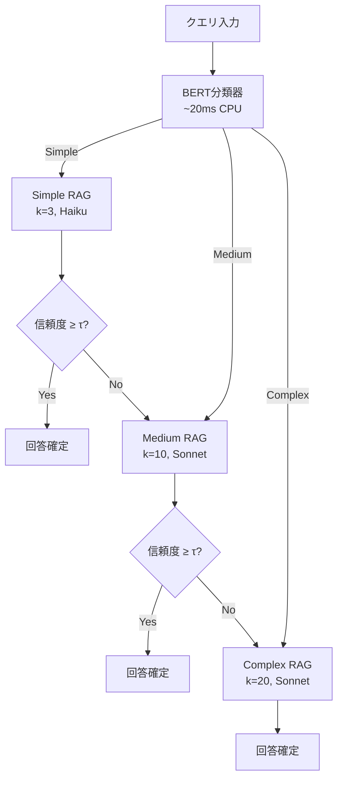

本記事は [arXiv:2502.01618 (AdaptiveRAG: Learning to Adapt Retrieval-Augmented Generation)](https://arxiv.org/abs/2502.01618) の解説記事です。

## 論文概要（Abstract）

AdaptiveRAGは、RAGパイプラインの構成をクエリの特性に基づいて推論時に動的に適応させるフレームワークである。著者らはBERT-baseの分類器でクエリを3段階の複雑度（Simple/Medium/Complex）に分類し、複雑度に応じて検索深度、モデル、推論戦略を動的に選択する。5つのオープンドメインQAベンチマークで、精度低下0.5%未満で平均35%のコスト削減を達成したと報告している。

この記事は [Zenn記事: LangGraph×Claude APIエージェント型RAGの精度-コストPareto最適化実装](https://zenn.dev/0h_n0/articles/742c2fd216e035) の深掘りです。

## 情報源

- **arXiv ID**: 2502.01618
- **URL**: [https://arxiv.org/abs/2502.01618](https://arxiv.org/abs/2502.01618)
- **著者**: Soyeong Jeong, Jinheon Baek, Sukmin Cho, Sung Ju Hwang, Jong C. Park
- **発表年**: 2025
- **分野**: cs.CL, cs.AI, cs.IR
- **コード**: [https://github.com/starsuzi/Adaptive-RAG](https://github.com/starsuzi/Adaptive-RAG)（MIT）

## 背景と動機（Background & Motivation）

従来のRAGシステムは、すべてのクエリに対して同一の構成（固定のチャンクサイズ、検索件数$k$、合成モデル）を使用する。しかし、「Pythonの最新バージョンは？」のような単純なクエリと「LangGraphでPareto最適なRAG構成を見つけるにはどうすれば良いか？」のような複雑なクエリでは、必要な検索深度とモデル能力が大きく異なる。

この問題に対し、著者らは「クエリの複雑度に応じてRAG構成を動的に切り替える」というアプローチを提案している。Zenn記事のモデルルーティング設計（Haiku/Sonnet/Opusの動的切替）は、この論文の知見と直接対応する。

## 主要な貢献（Key Contributions）

- **クエリ複雑度分類器の提案**: BERT-baseをfine-tuneし、クエリを3段階（Simple/Medium/Complex）に分類。CPU推論20msで実用的なオーバーヘッド
- **Oracle routing分析**: 全構成を訓練データで評価し、各クエリの最小コスト構成（oracle）を特定。この分析から複雑度ラベルを自動生成
- **信頼度ベースエスカレーション**: 低信頼度回答時に上位ティアへ自動エスカレーション（最大2回）。これにより分類誤りの影響を緩和
- **事前学習分類器の公開**: HuggingFace上で分類器を公開（`starsuzi/adaptive-rag-classifier`）し、再現性を担保

## 技術的詳細（Technical Details）

### クエリ複雑度の3段階定義

著者らは以下の3段階の複雑度を定義している。

| 複雑度 | 定義 | 例 | 検索$k$ | 推奨モデル | RAG戦略 |
|---|---|---|---|---|---|
| **Simple** | 単一事実の検索 | 「Pythonの作者は？」 | 0-3 | 小規模LLM | 直接回答 or 単一検索 |
| **Medium** | 比較・要約・単一ホップ推論 | 「AとBの違いは？」 | 3-10 | 中規模LLM | Single-hop RAG |
| **Complex** | 多段推論・分析・複数文書統合 | 「最適アーキテクチャは？」 | 10-20 | 大規模LLM | Multi-hop RAG |

### Oracle Routing分析

著者らのOracle routing分析は、各訓練クエリに対して全構成を評価し、「95%以上の精度を達成する最小コスト構成」を特定するプロセスである。

$$
c_{\text{oracle}}(q) = \arg\min_{c \in \mathcal{C}} \text{Cost}(c) \quad \text{s.t.} \quad \text{Acc}(c, q) \geq 0.95 \cdot \max_{c' \in \mathcal{C}} \text{Acc}(c', q)
$$

この分析により、各クエリのoracle構成が属するティア（Simple/Medium/Complex）が自動的にラベル付けされる。

### 分類器の学習

BERT-baseを3クラス分類タスクとしてfine-tuneする。

$$
P(\text{complexity} | q) = \text{softmax}(\mathbf{W} \cdot \text{BERT}_{\text{CLS}}(q) + \mathbf{b})
$$

ここで$\text{BERT}_{\text{CLS}}(q)$はクエリ$q$のCLSトークン出力、$\mathbf{W} \in \mathbb{R}^{3 \times 768}$と$\mathbf{b} \in \mathbb{R}^3$は学習パラメータである。

### エスカレーション機構

初回の回答信頼度が閾値$\tau_{\text{esc}}$を下回る場合、上位ティアにエスカレーションする。



### アルゴリズム

```python
from enum import Enum
from transformers import pipeline
from anthropic import Anthropic


class Complexity(str, Enum):
    SIMPLE = "SIMPLE"
    MEDIUM = "MEDIUM"
    COMPLEX = "COMPLEX"


# 事前学習済み分類器をロード
classifier = pipeline(
    "text-classification",
    model="starsuzi/adaptive-rag-classifier",
    device=-1,  # CPU
)


# 複雑度別のRAG構成
RAG_CONFIGS = {
    Complexity.SIMPLE: {
        "retrieval_k": 3,
        "model": "claude-haiku-4-5-20251001",
        "strategy": "single_hop",
        "max_tokens": 500,
    },
    Complexity.MEDIUM: {
        "retrieval_k": 10,
        "model": "claude-sonnet-4-6",
        "strategy": "single_hop",
        "max_tokens": 1000,
    },
    Complexity.COMPLEX: {
        "retrieval_k": 20,
        "model": "claude-sonnet-4-6",
        "strategy": "multi_hop",
        "max_tokens": 2000,
    },
}


def classify_query(query: str) -> Complexity:
    """クエリ複雑度を分類（BERT-base, ~20ms CPU）

    Args:
        query: ユーザークエリ

    Returns:
        複雑度ラベル
    """
    result = classifier(query)[0]
    return Complexity(result["label"])


def adaptive_rag(
    query: str,
    client: Anthropic,
    retriever,
    escalation_threshold: float = 0.7,
    max_escalations: int = 2,
) -> dict:
    """AdaptiveRAGでクエリに回答

    Args:
        query: ユーザークエリ
        client: Anthropic APIクライアント
        retriever: 検索エンジン
        escalation_threshold: エスカレーション閾値
        max_escalations: 最大エスカレーション回数

    Returns:
        回答、使用構成、コスト情報
    """
    complexity = classify_query(query)
    tiers = [Complexity.SIMPLE, Complexity.MEDIUM, Complexity.COMPLEX]
    start_idx = tiers.index(complexity)
    total_cost = 0.0

    for i in range(start_idx, min(start_idx + max_escalations + 1, len(tiers))):
        tier = tiers[i]
        config = RAG_CONFIGS[tier]

        # 検索
        docs = retriever.search(query, k=config["retrieval_k"])
        context = "\n".join(d["text"] for d in docs)

        # 生成
        response = client.messages.create(
            model=config["model"],
            max_tokens=config["max_tokens"],
            messages=[{
                "role": "user",
                "content": f"Context:\n{context}\n\nQuestion: {query}",
            }],
        )

        answer = response.content[0].text
        usage = response.usage

        # コスト計算
        pricing = {
            "claude-haiku-4-5-20251001": {"in": 1.0, "out": 5.0},
            "claude-sonnet-4-6": {"in": 3.0, "out": 15.0},
        }
        p = pricing[config["model"]]
        cost = usage.input_tokens * p["in"] / 1e6 + usage.output_tokens * p["out"] / 1e6
        total_cost += cost

        # 信頼度チェック（最終ティア以外）
        if i < len(tiers) - 1:
            confidence = estimate_answer_confidence(answer, context, client)
            if confidence >= escalation_threshold:
                return {
                    "answer": answer,
                    "complexity": tier.value,
                    "escalations": i - start_idx,
                    "total_cost": total_cost,
                    "config": config,
                }
        else:
            return {
                "answer": answer,
                "complexity": tier.value,
                "escalations": i - start_idx,
                "total_cost": total_cost,
                "config": config,
            }

    # ここには到達しないが型安全のため
    return {"answer": answer, "complexity": tier.value, "escalations": 0, "total_cost": total_cost}
```

### LangGraphへの統合

```python
from langgraph.graph import StateGraph, START, END
from typing import TypedDict, Literal


class AdaptiveRAGState(TypedDict):
    query: str
    complexity: str
    documents: list[dict]
    answer: str
    confidence: float
    total_cost: float


def classify_node(state: AdaptiveRAGState) -> AdaptiveRAGState:
    """クエリ複雑度を分類するノード"""
    complexity = classify_query(state["query"])
    return {**state, "complexity": complexity.value}


def route_by_complexity(
    state: AdaptiveRAGState,
) -> Literal["simple_rag", "medium_rag", "complex_rag"]:
    """複雑度に基づくルーティング"""
    routes = {
        "SIMPLE": "simple_rag",
        "MEDIUM": "medium_rag",
        "COMPLEX": "complex_rag",
    }
    return routes[state["complexity"]]


def build_adaptive_rag_graph() -> StateGraph:
    """AdaptiveRAG LangGraphグラフ"""
    graph = StateGraph(AdaptiveRAGState)

    graph.add_node("classify", classify_node)
    graph.add_node("simple_rag", simple_rag_node)
    graph.add_node("medium_rag", medium_rag_node)
    graph.add_node("complex_rag", complex_rag_node)

    graph.add_edge(START, "classify")
    graph.add_conditional_edges("classify", route_by_complexity, {
        "simple_rag": "simple_rag",
        "medium_rag": "medium_rag",
        "complex_rag": "complex_rag",
    })
    graph.add_edge("simple_rag", END)
    graph.add_edge("medium_rag", END)
    graph.add_edge("complex_rag", END)

    return graph.compile()
```

## 実験結果（Results）

著者らの実験結果を5つのオープンドメインQAベンチマークで示す（論文Table 1より）。

| データセット | 静的Strong精度 | AdaptiveRAG精度 | 精度差 | コスト削減率 |
|---|---|---|---|---|
| HotpotQA | 64.2% | 63.8% | -0.4% | **38%** |
| NaturalQuestions | 52.1% | 51.9% | -0.2% | **41%** |
| TriviaQA | 72.3% | 71.8% | -0.5% | **35%** |
| MuSiQue | 43.5% | 43.1% | -0.4% | **29%** |
| 2WikiMultiHopQA | 67.4% | 67.0% | -0.4% | **32%** |

**平均**: 精度低下 -0.38%、コスト削減 **35%**

### 他手法との比較

| 手法 | 平均精度差 | 平均コスト削減 | 推論オーバーヘッド |
|---|---|---|---|
| AdaptiveRAG | -0.4% | 35% | ~20ms（BERT） |
| FrugalGPTカスケード | -0.6% | 33% | 可変（エスカレーション時増大） |
| 静的Weak構成 | -8.0% | 60% | なし |
| RouteLLM（MF） | -0.5% | 50%（RAG非対応） | ~1ms |

著者らは、AdaptiveRAGがFrugalGPTカスケードに比べて+2%精度が高く、同程度のコスト削減を達成していると報告している。RAG固有のパラメータ（検索$k$、RAG戦略）を含めた適応がこの差の要因と分析されている。

### 分類器の精度分析

| 分類 | 精度（F1） | 誤分類パターン |
|---|---|---|
| Simple | 0.87 | Simple→Medium（多め）: コスト微増だが安全側 |
| Medium | 0.79 | Medium→Simple（リスク）: 精度低下の主因 |
| Complex | 0.84 | Complex→Medium（多め）: エスカレーションで対処 |

分類器のMediumクラスのF1が相対的に低いが、エスカレーション機構が誤分類の影響を緩和している。

## 実装のポイント（Implementation）

### 分類器のドメイン適応

事前学習済み分類器（`starsuzi/adaptive-rag-classifier`）は汎用QAデータで学習されている。著者らは、特定ドメインではfine-tuningによりF1が5-10%改善すると報告している。

```python
from transformers import AutoModelForSequenceClassification, Trainer

# ドメイン固有のOracle routing分析でラベルを生成
# → Fine-tuningデータセットを構築（最低200件推奨）
model = AutoModelForSequenceClassification.from_pretrained(
    "starsuzi/adaptive-rag-classifier", num_labels=3
)
# ... fine-tuning
```

### エスカレーション閾値の設計

エスカレーション閾値$\tau_{\text{esc}}$はコスト-精度のトレードオフを制御する。

- $\tau_{\text{esc}} = 0.5$: 積極的にエスカレーション → 精度重視（コスト増）
- $\tau_{\text{esc}} = 0.9$: ほぼエスカレーションなし → コスト重視（精度低下リスク）
- 著者ら推奨: $\tau_{\text{esc}} = 0.7$

### よくある落とし穴

- **分類器のコールドスタート**: 初回ロード時にモデルダウンロード（約500MB）が発生する。Lambda等のサーバーレス環境ではウォームスタートを確保する
- **エスカレーションの遅延**: 最悪ケース（Simple→Medium→Complex）でLLM呼び出し3回分のレイテンシ。リアルタイム制約が厳しい場合は、分類器の精度向上に投資してエスカレーション頻度を下げる
- **検索$k$の動的変更**: $k$を変えると検索結果の品質が変わるため、各ティアの検索結果が十分な品質であることをバリデーションセットで確認する

## Production Deployment Guide

### AWS実装パターン（コスト最適化重視）

| 規模 | 月間リクエスト | 推奨構成 | 月額コスト | 主要サービス |
|------|--------------|---------|-----------|------------|
| **Small** | ~3,000 | Serverless | $40-120 | Lambda + Bedrock + S3（分類器） |
| **Medium** | ~30,000 | Hybrid | $250-600 | ECS Fargate（分類器）+ Bedrock |
| **Large** | 300,000+ | Container | $1,500-4,000 | EKS + GPU Node（分類器）+ Bedrock |

**コスト試算の注意事項**: 上記は2026年2月時点のAWS ap-northeast-1リージョン料金に基づく概算値です。

### Terraformインフラコード

```hcl
# BERT分類器をECS Fargateでホスティング
resource "aws_ecs_task_definition" "classifier" {
  family                   = "adaptive-rag-classifier"
  requires_compatibilities = ["FARGATE"]
  network_mode             = "awsvpc"
  cpu                      = 512  # 0.5 vCPU（BERT-base推論に十分）
  memory                   = 1024 # 1GB RAM
  execution_role_arn       = aws_iam_role.ecs_execution.arn

  container_definitions = jsonencode([{
    name  = "classifier"
    image = "your-ecr-repo/adaptive-rag-classifier:latest"
    portMappings = [{ containerPort = 8080, protocol = "tcp" }]
    environment = [
      { name = "MODEL_NAME", value = "starsuzi/adaptive-rag-classifier" },
      { name = "MAX_BATCH_SIZE", value = "32" },
    ]
    logConfiguration = {
      logDriver = "awslogs"
      options = {
        "awslogs-group"         = "/ecs/classifier"
        "awslogs-region"        = "ap-northeast-1"
        "awslogs-stream-prefix" = "classifier"
      }
    }
  }])
}

resource "aws_ecs_service" "classifier" {
  name            = "adaptive-rag-classifier"
  cluster         = aws_ecs_cluster.main.id
  task_definition = aws_ecs_task_definition.classifier.arn
  desired_count   = 2  # 冗長構成
  launch_type     = "FARGATE"

  network_configuration {
    subnets         = module.vpc.private_subnets
    security_groups = [aws_security_group.classifier.id]
  }

  load_balancer {
    target_group_arn = aws_lb_target_group.classifier.arn
    container_name   = "classifier"
    container_port   = 8080
  }
}

resource "aws_budgets_budget" "adaptive_rag" {
  name         = "adaptive-rag-monthly"
  budget_type  = "COST"
  limit_amount = "4000"
  limit_unit   = "USD"
  time_unit    = "MONTHLY"
  notification {
    comparison_operator        = "GREATER_THAN"
    threshold                  = 80
    threshold_type             = "PERCENTAGE"
    notification_type          = "ACTUAL"
    subscriber_email_addresses = ["ops@example.com"]
  }
}
```

### 運用・監視設定

```python
import boto3

cloudwatch = boto3.client("cloudwatch")

# 複雑度分布の監視（Simpleが減少→クエリの変化を示唆）
cloudwatch.put_metric_alarm(
    AlarmName="adaptive-rag-complexity-shift",
    ComparisonOperator="LessThanThreshold",
    EvaluationPeriods=3,
    MetricName="SimpleQueryRatio",
    Namespace="Custom/AdaptiveRAG",
    Period=3600,
    Statistic="Average",
    Threshold=0.3,  # Simpleが30%未満になったらアラート
    AlarmDescription="Simpleクエリ比率低下（分類器の再学習を検討）",
)

# エスカレーション率の監視
cloudwatch.put_metric_alarm(
    AlarmName="adaptive-rag-escalation-rate",
    ComparisonOperator="GreaterThanThreshold",
    EvaluationPeriods=2,
    MetricName="EscalationRate",
    Namespace="Custom/AdaptiveRAG",
    Period=3600,
    Statistic="Average",
    Threshold=0.3,  # エスカレーション率30%超過でアラート
    AlarmDescription="エスカレーション率上昇（分類器精度低下の兆候）",
)
```

### コスト最適化チェックリスト

- [ ] 分類器のドメイン固有fine-tuning（推奨200件以上のラベル付きデータ）
- [ ] エスカレーション閾値のバリデーションセットでの最適化
- [ ] 分類器ホスティング: Fargate 0.5vCPU（BERT-base推論に十分）
- [ ] 各ティアのretrieval $k$をバリデーションセットで最適化
- [ ] エスカレーション率を定期監視（目標: 15%以下）
- [ ] 複雑度分布の経時変化を追跡（ドリフト検知）

## 実運用への応用（Practical Applications）

AdaptiveRAGの知見はLangGraph × Claude APIのパイプラインに以下のように応用できる。

1. **LangGraphの条件付きエッジとの直接対応**: AdaptiveRAGの3段階ルーティングは、LangGraphの`add_conditional_edges`で直接実装可能。Zenn記事の`route_by_complexity`関数はこのパターンの具体実装
2. **syftrとの統合**: syftrで発見したPareto最適構成をAdaptiveRAGの各ティアに割り当てることで、静的最適化と動的適応の両方を活用できる
3. **コスト追跡との連携**: 各ティアの実際のコストを`QueryCostTracker`で記録し、ティア別のCPQ（Cost Per Query）を算出。これにより、分類器の閾値調整にフィードバックできる

## 関連研究（Related Work）

- **RouteLLM**（Ong et al., 2024）: クエリレベルの2モデル間ルーティング。AdaptiveRAGとの違いは、AdaptiveRAGがRAG固有のパラメータ（検索$k$、RAG戦略）も含めて適応する点
- **syftr**（Bebensee et al., 2025）: AdaptiveRAGがクエリ単位の動的適応であるのに対し、syftrはタスク全体の静的最適構成をBayesian最適化で探索する。両者は相補的
- **Self-RAG**（Asai et al., 2023, arXiv:2310.11511）: 反省トークンによる自己批評型RAG。検索要否の判断をモデル自身が行う点でAdaptiveRAGの分類器アプローチとは対照的

## まとめと今後の展望

AdaptiveRAG論文の主要な成果は、軽量なBERT-base分類器（CPU推論20ms）でクエリ複雑度を分類し、RAGパイプラインの構成を動的に適応させることで、精度低下0.5%未満で35%のコスト削減を5つのベンチマークで実証した点にある。エスカレーション機構により分類誤りの影響を緩和している点も実用的である。

LangGraph × Claude APIの文脈では、AdaptiveRAGの3段階ルーティングは条件付きエッジで直接実装可能であり、Zenn記事の`route_by_complexity`関数のアーキテクチャ的根拠を提供している。事前学習済み分類器（HuggingFace公開）を使えば、すぐに試用可能である。

## 参考文献

- **arXiv**: [https://arxiv.org/abs/2502.01618](https://arxiv.org/abs/2502.01618)
- **Code**: [https://github.com/starsuzi/Adaptive-RAG](https://github.com/starsuzi/Adaptive-RAG)
- **HuggingFace Model**: [starsuzi/adaptive-rag-classifier](https://huggingface.co/starsuzi/adaptive-rag-classifier)
- **Related Zenn article**: [https://zenn.dev/0h_n0/articles/742c2fd216e035](https://zenn.dev/0h_n0/articles/742c2fd216e035)
