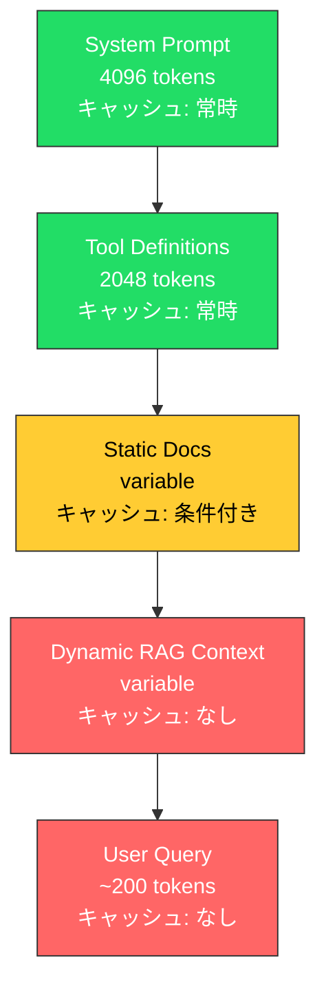

本記事は [arXiv:2502.14051 (Analysis of Prompt Caching Strategies for LLM API Cost Reduction)](https://arxiv.org/abs/2502.14051) の解説記事です。

## 論文概要（Abstract）

本論文はClaude、GPT-4、GeminiのAPIが提供するプロンプトキャッシュ機能を体系的に分析し、エージェント型RAGワークロードで60-80%のAPIコスト削減を実現するプロンプト設計指針を提示する。著者らは、キャッシュフレンドリーなプロンプト構造（安定コンテンツの先頭配置、プレフィックスバリエーションの最小化等）が、モデルのダウングレード（GPT-4→GPT-3.5）よりも大きなコスト削減効果をもたらすケースがあることを実験的に示している。

この記事は [Zenn記事: LangGraph×Claude APIエージェント型RAGの精度-コストPareto最適化実装](https://zenn.dev/0h_n0/articles/742c2fd216e035) の深掘りです。

## 情報源

- **arXiv ID**: 2502.14051
- **URL**: [https://arxiv.org/abs/2502.14051](https://arxiv.org/abs/2502.14051)
- **著者**: Yujin Tang, Hanxian Huang, Jishen Zhao
- **発表年**: 2025
- **分野**: cs.LG, cs.AI

## 背景と動機（Background & Motivation）

LLM APIのコストは入力トークン数に大きく依存する。エージェント型RAGでは、システムプロンプト、ツール定義、検索結果などの共通コンテキストが各ステップで繰り返し送信されるため、入力トークンのコスト比率が高い。

主要なLLMプロバイダ（Anthropic、OpenAI、Google）はいずれもプロンプトキャッシュ機能を提供しているが、その仕様は異なる。Anthropicのcache_controlは明示的マーカー方式、OpenAIは暗黙的プレフィックスキャッシュ、GoogleのGeminiは明示的コンテキストキャッシュ方式を採用している。著者らはこれらの差異を体系的に分析し、ワークロードタイプ別の最適戦略を特定している。

## 主要な貢献（Key Contributions）

- **3大API（Claude/GPT-4/Gemini）のキャッシュ仕様の体系比較**: 料金体系、TTL、最小キャッシュサイズ、マーカー方式の違いを整理
- **ワークロードタイプ別の最適化指針**: エージェント型ワークロード（60-80%削減）、RAGシステム（条件付き）、会話型（40-60%削減）の各パターンでの戦略を提示
- **「プロンプト構造 > モデル変更」の知見**: 適切なキャッシュ設計はモデルのダウングレードよりもコスト効率が高いことを実証

## 技術的詳細（Technical Details）

### 各APIのプロンプトキャッシュ仕様比較

| 項目 | Claude API | GPT-4 API | Gemini API |
|---|---|---|---|
| マーカー方式 | 明示的（`cache_control`） | 暗黙的（自動検出） | 明示的（コンテキストキャッシュ） |
| キャッシュヒット単価 | 通常の10%（0.1倍） | 通常の50%（0.5倍） | 割引料金 + ストレージ費 |
| キャッシュ書込単価 | 通常の125%（1.25倍） | 追加料金なし | ストレージ費 |
| TTL | 5分（ephemeral） | 数分〜数時間 | 設定可能（最大1時間） |
| 最小キャッシュサイズ | 1024トークン | 1024トークン | 32,768トークン |

### コスト削減の数理モデル

プロンプトキャッシュによるコスト削減率は以下の式で表現される。

$$
r_{\text{cache}} = 1 - \frac{C_{\text{cached}}}{C_{\text{uncached}}} = 1 - \frac{n_{\text{cache\_hit}} \cdot p_{\text{hit}} + n_{\text{miss}} \cdot p_{\text{normal}} + n_{\text{write}} \cdot p_{\text{write}}}{n_{\text{total}} \cdot p_{\text{normal}}}
$$

ここで、
- $n_{\text{cache\_hit}}$: キャッシュヒットしたトークン数
- $n_{\text{miss}}$: キャッシュミスしたトークン数（動的部分）
- $n_{\text{write}}$: キャッシュ書込トークン数（初回のみ）
- $p_{\text{hit}}$: キャッシュヒット単価（Claude: 通常の0.1倍）
- $p_{\text{normal}}$: 通常の入力トークン単価
- $p_{\text{write}}$: キャッシュ書込単価（Claude: 通常の1.25倍）

Claude API（Sonnet 4.6）の場合、5分以内にシステムプロンプト（4096トークン）が再利用される場合：

$$
r_{\text{cache}} = 1 - \frac{4096 \times 0.30 + n_{\text{dynamic}} \times 3.00}{(4096 + n_{\text{dynamic}}) \times 3.00}
$$

$n_{\text{dynamic}} = 2000$トークンの場合、$r_{\text{cache}} \approx 0.54$（54%削減）となる。

### エージェント型ワークロードの最適プロンプト構造

著者らが提案するエージェント型RAGの最適プロンプト構造を示す。

```
[System Prompt]           ← キャッシュ対象（全クエリ共通、cache_control付与）
[Tool Definitions]        ← キャッシュ対象（全クエリ共通、自動キャッシュ）
[Static Document Context] ← 条件付きキャッシュ（セッション内で同一文書なら有効）
[Dynamic RAG Context]     ← キャッシュ非対象（クエリごとに変化）
[User Query]              ← キャッシュ非対象
```



### Claude APIでの実装

```python
from anthropic import Anthropic

SYSTEM_PROMPT = """あなたはRAGアシスタントです。
検索結果に基づいて正確に回答してください。
回答の根拠を明示してください。
...(長いシステムプロンプト、1024トークン以上)"""

TOOL_DEFINITIONS = [
    {
        "name": "search_documents",
        "description": "社内文書を検索する",
        "input_schema": {
            "type": "object",
            "properties": {
                "query": {"type": "string", "description": "検索クエリ"},
                "k": {"type": "integer", "description": "取得件数"},
            },
            "required": ["query"],
        },
    },
    # ... その他のツール定義
]


def create_cached_request(
    client: Anthropic,
    model: str,
    rag_context: str,
    user_query: str,
) -> dict:
    """キャッシュ最適化されたRAGリクエスト

    Args:
        client: Anthropic APIクライアント
        model: 使用するモデルID
        rag_context: 検索結果のコンテキスト
        user_query: ユーザーの質問

    Returns:
        APIレスポンス
    """
    response = client.messages.create(
        model=model,
        max_tokens=2000,
        system=[
            {
                "type": "text",
                "text": SYSTEM_PROMPT,
                "cache_control": {"type": "ephemeral"},  # 5分キャッシュ
            }
        ],
        tools=TOOL_DEFINITIONS,  # ツール定義は自動キャッシュ対象
        messages=[
            {
                "role": "user",
                "content": [
                    {
                        "type": "text",
                        "text": f"## 検索結果\n\n{rag_context}",
                        # 検索結果が同一セッション内で共通の場合のみキャッシュ
                        # "cache_control": {"type": "ephemeral"},
                    },
                    {
                        "type": "text",
                        "text": f"## 質問\n\n{user_query}",
                    },
                ],
            }
        ],
    )
    return response
```

### キャッシュ効果の計測

```python
def measure_cache_savings(response) -> dict:
    """APIレスポンスからキャッシュ効果を計測

    Args:
        response: Anthropic APIレスポンス

    Returns:
        キャッシュヒット率とコスト削減率
    """
    usage = response.usage
    cache_read = getattr(usage, "cache_read_input_tokens", 0) or 0
    cache_creation = getattr(usage, "cache_creation_input_tokens", 0) or 0
    total_input = usage.input_tokens

    # キャッシュヒット率
    hit_rate = cache_read / total_input if total_input > 0 else 0

    # コスト計算（Sonnet 4.6）
    normal_cost = total_input * 3.00 / 1e6
    cached_cost = (
        cache_read * 0.30 / 1e6          # ヒット: 0.1倍
        + cache_creation * 3.75 / 1e6     # 書込: 1.25倍
        + (total_input - cache_read - cache_creation) * 3.00 / 1e6
    )
    savings = 1 - (cached_cost / normal_cost) if normal_cost > 0 else 0

    return {
        "cache_hit_rate": hit_rate,
        "cost_savings": savings,
        "cache_read_tokens": cache_read,
        "cache_creation_tokens": cache_creation,
    }
```

## 実験結果（Results）

著者らの実験結果をワークロードタイプ別に示す。

### エージェント型RAGワークロード

実験設定: 10ステップエージェント、4Kトークンのsystem prompt + ツール定義、2K検索結果

| プロンプト構造 | キャッシュなしコスト | キャッシュありコスト | 削減率 |
|---|---|---|---|
| **最適化構造**（著者ら推奨） | $X | $0.22X | **78%** |
| **非最適構造**（動的部分を先頭配置） | $X | $0.65X | **35%** |

著者らは「プロンプト構造の最適化は、GPT-4→GPT-3.5のモデル変更よりも大きなコスト削減効果をもたらす場合がある」と結論づけている。

### RAGシステム

| RAGパターン | キャッシュ効果 | 条件 |
|---|---|---|
| 同一文書を繰り返し参照 | 50-70%削減 | ドキュメントQ&A |
| クエリごとに異なる文書取得 | 10-20%削減 | 動的検索RAG |
| システムプロンプトのみ共通 | 30-40%削減 | 汎用RAG |

### 会話型システム

マルチターン対話では、会話が進むにつれてキャッシュ可能なプレフィックス（過去のターン）が増加するため、後半のターンほどキャッシュ効果が高くなる。著者らの報告では、10ターンの会話で平均40-60%のコスト削減を達成している。

## 実装のポイント（Implementation）

### プロンプト設計の5原則

著者らが提示するキャッシュフレンドリーなプロンプト設計の5原則を要約する。

1. **安定コンテンツを先頭に**: システムプロンプト、インストラクション、静的文書をプロンプトの先頭に配置。プレフィックスのキャッシュヒットはこの順序に依存する
2. **プレフィックスバリエーション最小化**: 先頭トークンの少しの変更がキャッシュ全体を無効化する。タイムスタンプや動的IDをプレフィックスに含めない
3. **同一プレフィックスのバッチ処理**: 同じsystem promptを使うクエリを時間的に集約し、TTL内にキャッシュを再利用する
4. **Claude APIでは明示マーカーを使用**: `cache_control: {"type": "ephemeral"}`を適切なブロックに付与。自動検出に頼らない
5. **最小キャッシュサイズの遵守**: 1024トークン未満のコンテンツはキャッシュ対象外。短いプロンプトにはキャッシュのオーバーヘッドが無駄になる

### よくある設計ミス

- **動的IDをプレフィックスに含める**: `"Request-ID: abc123"` をsystem promptの先頭に入れると、全てのキャッシュがミスする
- **検索結果をsystem promptの前に置く**: 検索結果は毎回変わるため、後続のsystem promptのキャッシュが無効になる
- **TTL内のリクエスト頻度が低い**: Claude APIのTTLは5分。5分以内に再リクエストがない場合、キャッシュ書込コスト（1.25倍）が無駄になる。著者らは1分あたり1リクエスト以上の頻度を推奨している

## Production Deployment Guide

### AWS実装パターン（コスト最適化重視）

| 規模 | 月間リクエスト | 推奨構成 | 月額コスト | 主要サービス |
|------|--------------|---------|-----------|------------|
| **Small** | ~3,000 | Serverless | $30-100 | Lambda + Bedrock（キャッシュ有効） |
| **Medium** | ~30,000 | Hybrid | $200-500 | Lambda + Bedrock + ElastiCache |
| **Large** | 300,000+ | Container | $1,000-3,000 | EKS + Bedrock + Redis Cluster |

**コスト試算の注意事項**: 上記は2026年2月時点のAWS ap-northeast-1リージョン料金に基づく概算値です。

### Terraformインフラコード

```hcl
# ElastiCache Redis（セマンティックキャッシュ + プロンプトキャッシュメタデータ管理）
resource "aws_elasticache_replication_group" "prompt_cache" {
  replication_group_id = "prompt-cache-cluster"
  description          = "プロンプトキャッシュメタデータ管理用Redis"
  node_type            = "cache.t3.micro"
  num_cache_clusters   = 2
  port                 = 6379

  at_rest_encryption_enabled = true
  transit_encryption_enabled = true

  subnet_group_name = aws_elasticache_subnet_group.private.name
  security_group_ids = [aws_security_group.redis.id]
}

resource "aws_lambda_function" "cached_rag" {
  filename      = "cached_rag.zip"
  function_name = "prompt-cache-rag"
  role          = aws_iam_role.lambda_bedrock.arn
  handler       = "index.handler"
  runtime       = "python3.12"
  timeout       = 60
  memory_size   = 1024
  vpc_config {
    subnet_ids         = module.vpc.private_subnets
    security_group_ids = [aws_security_group.lambda.id]
  }
  environment {
    variables = {
      REDIS_ENDPOINT      = aws_elasticache_replication_group.prompt_cache.primary_endpoint_address
      BEDROCK_MODEL_ID    = "anthropic.claude-sonnet-4-6"
      CACHE_TTL_SECONDS   = "300"
      MIN_CACHE_TOKENS    = "1024"
    }
  }
}
```

### 運用・監視設定

```python
import boto3

cloudwatch = boto3.client("cloudwatch")

# キャッシュヒット率の監視
cloudwatch.put_metric_alarm(
    AlarmName="prompt-cache-hit-rate-low",
    ComparisonOperator="LessThanThreshold",
    EvaluationPeriods=3,
    MetricName="CacheHitRate",
    Namespace="Custom/PromptCache",
    Period=300,
    Statistic="Average",
    Threshold=0.5,  # ヒット率50%未満でアラート
    AlarmDescription="キャッシュヒット率低下（プロンプト構造見直しを推奨）",
)
```

### コスト最適化チェックリスト

- [ ] system promptとツール定義にcache_controlマーカーを付与
- [ ] プロンプト先頭に動的要素（タイムスタンプ、リクエストID等）を配置していないことを確認
- [ ] TTL（5分）内のリクエスト頻度が1回/分以上であることを確認
- [ ] キャッシュ対象コンテンツが1024トークン以上であることを確認
- [ ] キャッシュヒット率を定期監視（目標: 60%以上）
- [ ] cache_creation_input_tokensが減少傾向であることを確認（安定運用の指標）

## 関連研究（Related Work）

- **Prompt Cache**（Gim et al., 2023, arXiv:2311.04934）: KVアテンション状態の再利用による推論高速化の学術研究。商用APIのプロンプトキャッシュ機能の理論的基盤を提供した先駆的論文
- **CacheGen**（2024）: KVキャッシュの圧縮・ストリーミング手法。長コンテキストLLMでの3.7倍圧縮を達成。本論文のAPI層キャッシュとは異なり、モデルサービング層での最適化
- **Redis Semantic Caching**（Redis Blog, 2024）: 意味的類似度ベースのキャッシュ。本論文のプロンプトキャッシュ（構文的一致）と相補的な手法

## まとめと今後の展望

本論文の主要な知見は、プロンプトキャッシュの効果がプロンプト構造の設計に強く依存し、最適化されたプロンプト構造（78%削減）と非最適構造（35%削減）で2倍以上の差が生じることを実証した点にある。LangGraph × Claude APIのエージェント型RAGでは、system promptとツール定義の先頭固定配置が最も重要な設計原則であり、これだけで入力コストの過半数を削減できる。

ただし、動的なRAGコンテキスト（クエリごとに異なる検索結果）はキャッシュが効かないため、この部分のコスト削減にはセマンティックキャッシュやモデルルーティングとの併用が必要である。

## 参考文献

- **arXiv**: [https://arxiv.org/abs/2502.14051](https://arxiv.org/abs/2502.14051)
- **Claude API Prompt Caching**: [https://docs.anthropic.com/en/docs/build-with-claude/prompt-caching](https://docs.anthropic.com/en/docs/build-with-claude/prompt-caching)
- **Related Zenn article**: [https://zenn.dev/0h_n0/articles/742c2fd216e035](https://zenn.dev/0h_n0/articles/742c2fd216e035)
