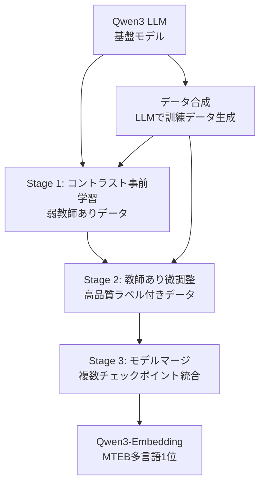

本記事は [Qwen3 Embedding: Advancing Text Embedding and Reranking Through Foundation Models（arxiv:2506.05176）](https://arxiv.org/abs/2506.05176) および [Qwen公式ブログ](https://qwenlm.github.io/blog/qwen3-embedding/) の解説記事です。

## 論文概要（Abstract）

Qwen3-Embeddingシリーズは、Qwen3基盤モデル上に構築されたテキスト埋め込みおよびリランキングモデルファミリーである。Alibaba Cloud Qwenチームは、0.6B・4B・8Bの3つのサイズバリアントを提供し、8Bモデルが2025年6月時点でMTEB多言語リーダーボードにおいてスコア70.58で1位を記録したと報告している。学習には3段階パイプライン（弱教師ありコントラスト事前学習→教師あり微調整→モデルマージ）が採用されており、100以上の言語とプログラミング言語をサポートする。instruction-aware埋め込みにより、タスク固有の指示に応じて埋め込み空間を適応させる機能を備えている。

この記事は [Zenn記事: 自社データで実践するEmbeddingモデル精度評価パイプライン構築](https://zenn.dev/0h_n0/articles/db325cb1cb2e24) の深掘りです。

## 情報源

- **arXiv ID**: 2506.05176
- **URL**: [https://arxiv.org/abs/2506.05176](https://arxiv.org/abs/2506.05176)
- **著者**: Alibaba Cloud Qwen Team
- **発表年**: 2025
- **分野**: cs.CL, cs.IR

## 背景と動機（Background & Motivation）

大規模言語モデル（LLM）の基盤モデルをテキスト埋め込みに転用する手法は、E5（Wang et al., 2024）やGTE（Li et al., 2023）など複数の研究で有効性が示されてきた。しかし、多言語対応・長文脈対応・instruction-following能力を同時に高いレベルで達成するモデルは限られていた。

Qwen3-Embeddingは、Qwen3 LLMの多言語能力（100+言語）と長文脈能力（32Kトークン）を活用し、テキスト埋め込みタスクに特化した学習を行うことで、上記の課題を同時に解決している。特に、LLMを埋め込みモデルの学習データ生成にも活用する「自己ループ型」のデータ生成パイプラインが特徴的である。

## 主要な貢献（Key Contributions）

著者らは以下の3つの貢献を主張している。

- **貢献1: 3段階学習パイプライン** — 弱教師ありコントラスト事前学習、教師あり微調整、モデルマージの3段階により、多言語・多タスクで高品質な埋め込みを実現
- **貢献2: LLMによる学習データ合成** — Qwen3 LLMを学習データの合成にも活用し、多言語・多ドメインにわたる高品質かつ多様な訓練データを自動生成
- **貢献3: 複数サイズバリアント** — 0.6B、4B、8Bの3サイズを提供し、精度とコストのトレードオフに応じた選択を可能に

## 技術的詳細（Technical Details）

### 3段階学習パイプライン



### Stage 1: 弱教師ありコントラスト事前学習

大量の弱教師ありデータ（Webクロール、並行コーパス等）を用いてコントラスト学習を行う。

$$
\mathcal{L}_{\text{stage1}} = -\frac{1}{B} \sum_{i=1}^{B} \log \frac{\exp(\text{sim}(\mathbf{q}_i, \mathbf{d}_i^+) / \tau)}{\sum_{j=1}^{B} \exp(\text{sim}(\mathbf{q}_i, \mathbf{d}_j) / \tau)}
$$

ここで、
- $B$: バッチサイズ
- $\mathbf{q}_i$: $i$番目のクエリの埋め込み
- $\mathbf{d}_i^+$: $i$番目のクエリに対応する正例文書の埋め込み
- $\mathbf{d}_j$: バッチ内の$j$番目の文書の埋め込み（in-batch negatives）
- $\tau$: 温度パラメータ
- $\text{sim}(\cdot, \cdot)$: コサイン類似度

この段階では、データの網羅性と多様性を重視し、品質よりも量を優先する。Qwen3 LLMを用いて多言語・多ドメインの擬似的な正例ペアを大量生成し、訓練データを拡充している。

### Stage 2: 教師あり微調整

高品質なラベル付きデータを用いて、Hard Negative Mining付きのコントラスト学習を行う。

$$
\mathcal{L}_{\text{stage2}} = -\frac{1}{B} \sum_{i=1}^{B} \log \frac{\exp(\text{sim}(\mathbf{q}_i, \mathbf{d}_i^+) / \tau)}{\exp(\text{sim}(\mathbf{q}_i, \mathbf{d}_i^+) / \tau) + \sum_{k=1}^{K} \exp(\text{sim}(\mathbf{q}_i, \mathbf{d}_{i,k}^-) / \tau)}
$$

ここで、
- $\mathbf{d}_{i,k}^-$: クエリ$i$に対する$k$番目のHard Negative文書
- $K$: Hard Negativesの数

Stage 1とStage 2の違いは負例の選択方法にある。Stage 1ではin-batch negativesのみを使用するが、Stage 2ではマイニングされたHard Negativesを明示的に含める。これにより、類似だが不正解な文書に対する弁別能力が向上する。

### Stage 3: モデルマージ

複数の学習チェックポイントやタスク特化モデルの重みを統合する。Qwen公式ブログでは「merging strategy」と述べられており、PLaMo-Embedding-1Bで使用されたTIES-Mergingと類似のアプローチと推察される。

$$
\theta_{\text{final}} = \text{Merge}(\theta_{\text{ckpt}_1}, \theta_{\text{ckpt}_2}, ..., \theta_{\text{ckpt}_M})
$$

マージにより、個々のチェックポイントでは特定タスクに過学習するリスクを軽減し、汎化性能を維持している。

### Instruction-Aware埋め込み

Qwen3-Embeddingの特徴的な機能として、タスク固有の指示（instruction）に応じて埋め込み空間を適応させるinstruction-aware埋め込みがある。

```python
from sentence_transformers import SentenceTransformer

model = SentenceTransformer("Qwen/Qwen3-Embedding-8B", trust_remote_code=True)

# 指示付きクエリ
query_with_instruction = (
    "Instruct: 関連するドキュメントを検索してください\n"
    "Query: Embeddingモデルの評価方法"
)

# 指示なし文書
document = "MTEBは8つのタスクで埋め込みモデルを評価するベンチマークです。"

query_emb = model.encode(query_with_instruction)
doc_emb = model.encode(document)
```

**注意**: クエリには `Instruct:` プレフィックスと `Query:` プレフィックスを付与する。文書側には指示を付与しない。Zenn記事の `compare_models.py` の `query_prompt` パラメータに対応する。

### モデルサイズと性能のトレードオフ

Qwen公式ブログの報告に基づく各サイズの比較を以下に示す。

| モデル | パラメータ | 最大トークン | 次元数 | MTEB多言語スコア |
|--------|----------|-----------|--------|---------------|
| Qwen3-Embedding-0.6B | 0.6B | 32,000 | 1024-4096 | — |
| Qwen3-Embedding-4B | 4B | 32,000 | 1024-4096 | — |
| Qwen3-Embedding-8B | 8B | 32,000 | 1024-4096 | 70.58（1位） |

MTEB多言語リーダーボードのスコア70.58は2025年6月5日時点でのQwen公式ブログによる報告値である。

### LLMによる訓練データ合成

Qwen3-Embeddingの学習パイプラインにおける独自の特徴は、Qwen3 LLMが訓練データの生成にも利用されている点である。

```python
def generate_synthetic_training_pair(
    document: str,
    language: str,
    client: Any,
) -> dict[str, str]:
    """LLMを用いた訓練ペア（クエリ+正例）の合成

    Args:
        document: 正例となる文書テキスト
        language: 対象言語コード
        client: LLM APIクライアント
    """
    prompt = (
        f"Given the following document in {language}, generate a search "
        f"query that would retrieve this document. Include both keyword-style "
        f"and natural language queries.\n\n"
        f"Document: {document[:2000]}\n\n"
        f"Generate 3 diverse queries:"
    )

    response = client.chat.completions.create(
        model="qwen3-72b",
        messages=[{"role": "user", "content": prompt}],
        max_tokens=300,
    )

    queries = response.choices[0].message.content.strip().split("\n")
    return {
        "document": document,
        "queries": [q.strip() for q in queries if q.strip()],
        "language": language,
    }
```

この手法はZenn記事の「方法2: LLMを使った合成クエリ生成」と同じアプローチであり、大規模な訓練データの構築に有効である。Qwen3チームはこの手法を100以上の言語に対して実行し、多言語対応の訓練データを自動生成している。

## 実装のポイント（Implementation）

### sentence-transformersでの使用

```python
from sentence_transformers import SentenceTransformer

# 8Bモデルのロード（GPU必須: A100 40GB推奨）
model = SentenceTransformer(
    "Qwen/Qwen3-Embedding-8B",
    trust_remote_code=True,
    model_kwargs={"torch_dtype": "float16"},
)

# sentence-transformers InformationRetrievalEvaluatorとの統合
from sentence_transformers.evaluation import InformationRetrievalEvaluator

evaluator = InformationRetrievalEvaluator(
    queries=queries,
    corpus=corpus,
    relevant_docs=relevant_docs,
    ndcg_at_k=[5, 10],
    mrr_at_k=[10],
    query_prompt="Instruct: 関連するドキュメントを検索してください\nQuery: ",
    name="qwen3_embedding_8b",
)
results = evaluator(model)
```

### ハマりポイント

- **GPUメモリ**: 8Bモデルはfloat16で約16GB、float32で約32GBのVRAMが必要。A100 40GB以上を推奨
- **query_prompt**: `Instruct:` と `Query:` のフォーマットを厳密に守ること。フォーマットが異なると精度が低下する
- **0.6Bモデル**: GPU制約がある場合、0.6Bモデルでも多くのタスクで実用的な精度が得られる
- **LoRA対応**: Qwen3-EmbeddingはLoRAファインチューニングに対応しており、カスタムドメインへの適応が比較的容易

## Production Deployment Guide

### AWS実装パターン（コスト最適化重視）

Qwen3-Embeddingは Apache 2.0ライセンスのため自前推論が可能である。

**トラフィック量別の推奨構成**:

| 規模 | 月間リクエスト | 推奨モデル | 推奨構成 | 月額コスト |
|------|-------------|----------|---------|-----------|
| **Small** | ~3,000 | 0.6B | Lambda (CPU) | $50-150 |
| **Medium** | ~30,000 | 4B | ECS Fargate (GPU) | $500-1,200 |
| **Large** | 300,000+ | 8B | EKS + GPU Spot | $2,000-5,000 |

**モデルサイズ選択ガイド**: 0.6BモデルはCPU推論が可能（レイテンシ300-800ms）。4B/8Bモデルは GPU推論が必須だが、より高い精度が得られる。Zenn記事の評価パイプラインを使用して、自社データ上で0.6Bと8Bの精度差を実測し、コスト対効果を判断することが推奨される。

**コスト試算の注意事項**:
- 上記は2026年2月時点のAWS ap-northeast-1（東京）リージョン料金に基づく概算値です
- Qwen3-EmbeddingはApache 2.0ライセンスのためAPI料金不要（自前推論）
- 最新料金は [AWS料金計算ツール](https://calculator.aws/) で確認してください

### Terraformインフラコード

**Small構成（Serverless）: Lambda + 0.6Bモデル**

```hcl
resource "aws_lambda_function" "qwen_embedding" {
  filename      = "qwen_lambda.zip"
  function_name = "qwen3-embedding-handler"
  role          = aws_iam_role.qwen_lambda.arn
  handler       = "handler.embed"
  runtime       = "python3.12"
  timeout       = 120
  memory_size   = 4096
  architectures = ["arm64"]

  environment {
    variables = {
      MODEL_NAME      = "Qwen/Qwen3-Embedding-0.6B"
      QUERY_PROMPT    = "Instruct: 関連するドキュメントを検索してください\\nQuery: "
      MAX_SEQ_LEN     = "8192"
    }
  }
}

resource "aws_cloudwatch_metric_alarm" "qwen_latency" {
  alarm_name          = "qwen-embedding-latency"
  comparison_operator = "GreaterThanThreshold"
  evaluation_periods  = 3
  metric_name         = "Duration"
  namespace           = "AWS/Lambda"
  period              = 300
  statistic           = "p99"
  threshold           = 10000
  alarm_description   = "Qwen3推論レイテンシP99が10秒超過"

  dimensions = {
    FunctionName = aws_lambda_function.qwen_embedding.function_name
  }
}
```

**Large構成（Container）: EKS + GPU Spot + 8Bモデル**

```hcl
module "eks" {
  source          = "terraform-aws-modules/eks/aws"
  version         = "~> 20.0"
  cluster_name    = "qwen-embedding-cluster"
  cluster_version = "1.31"
  vpc_id          = module.vpc.vpc_id
  subnet_ids      = module.vpc.private_subnets
  cluster_endpoint_public_access = true
  enable_cluster_creator_admin_permissions = true
}

resource "kubectl_manifest" "karpenter_gpu" {
  yaml_body = <<-YAML
    apiVersion: karpenter.sh/v1alpha5
    kind: Provisioner
    metadata:
      name: qwen-gpu-spot
    spec:
      requirements:
        - key: karpenter.sh/capacity-type
          operator: In
          values: ["spot"]
        - key: node.kubernetes.io/instance-type
          operator: In
          values: ["g5.xlarge", "g5.2xlarge"]
      limits:
        resources:
          nvidia.com/gpu: "4"
      ttlSecondsAfterEmpty: 60
  YAML
}
```

### セキュリティベストプラクティス

- **モデルアーティファクト**: S3 KMS暗号化、バージョニング有効化
- **Lambda/EKS**: VPC配置、最小権限IAMロール
- **暗号化**: 推論結果キャッシュもKMS暗号化
- **監査**: CloudTrail有効化

### コスト最適化チェックリスト

- [ ] モデルサイズ選定: 0.6B（CPU, $50/月）vs 8B（GPU, $2,000/月）を自社データで比較
- [ ] Apache 2.0ライセンスのためAPI料金不要
- [ ] GPU Spot Instances活用で最大90%削減
- [ ] 推論結果キャッシュ（ElastiCache/DynamoDB）
- [ ] 0.6BモデルならLambda ARM64でGPU不要
- [ ] AWS Budgets: 月額予算設定

## 実験結果（Results）

### MTEB多言語リーダーボード

Qwen公式ブログの報告によると、Qwen3-Embedding-8Bは2025年6月5日時点でMTEB多言語リーダーボードにおいてスコア70.58で1位を記録した。

### タスク別スコア

Qwen公式ブログの報告に基づく主要タスクのスコアを以下に示す。

| タスク | Qwen3-Embedding-8B | 備考 |
|--------|-------------------|------|
| CMTEB-R（中国語検索） | 75.94 | 中国語検索で高精度 |
| MTEB-Code（コード検索） | 81.22 | プログラミング言語対応 |
| MTEB多言語総合 | 70.58 | 100+言語の平均 |

**リランキングモデルとの比較**: Qwen3-Reranker-8Bも同時に公開されており、Jina、GTE、BGEの各リランキングモデルを上回る性能が報告されている。

## 実運用への応用（Practical Applications）

Zenn記事の評価パイプラインにQwen3-Embeddingを組み込む際のポイントを以下に示す。

**sentence-transformersとの統合**: Qwen3-Embeddingはsentence-transformers互換であり、Zenn記事の `evaluate_single_model` 関数にそのまま組み込める。`query_prompt` パラメータに `Instruct:` プレフィックスを設定するだけでinstruction-aware埋め込みが有効になる。

**多言語RAGでの活用**: 100以上の言語をサポートするため、日英混在ドキュメントの検索や、多言語FAQシステムでの利用に適している。Zenn記事で紹介したPLaMo-Embedding-1B（日本語特化）との比較評価を行い、自社データでの適性を判断することが推奨される。

**LoRAファインチューニング**: 自社ドメインへの適応にはLoRAファインチューニングが有効である。Zenn記事のFine-tuning前後の比較設計に基づいて、テストデータでの精度改善を計測できる。

## 関連研究（Related Work）

- **E5（Wang et al., 2024, arXiv:2401.00368）**: LLMをテキスト埋め込みに転用する先駆的研究。Qwen3-Embeddingの3段階学習パイプラインに影響を与えた
- **GTE-Qwen2（Li et al., 2023）**: Qwen2ベースの埋め込みモデル。Qwen3-Embeddingの前身
- **PLaMo-Embedding-1B（PFN, 2025）**: 日本語特化の1Bモデル。LLM2Vec変換とTIES-Mergingを採用

## まとめと今後の展望

Qwen3-Embeddingは、3段階学習パイプラインとLLMによるデータ合成により、100+言語に対応した高品質なテキスト埋め込みを実現した。8BモデルのMTEB多言語1位という結果は、大規模モデルの多言語能力の優位性を裏付けている。一方、0.6Bモデルの存在はコスト制約のある環境での選択肢を提供しており、実務ではZenn記事の評価パイプラインを使って自社データ上でサイズ別の精度差を実測し、最適なモデルを選定することが推奨される。Apache 2.0ライセンスでの公開により、自前推論・LoRAファインチューニングが自由に行える点も実務上の大きな利点である。

## 参考文献

- **arXiv**: [https://arxiv.org/abs/2506.05176](https://arxiv.org/abs/2506.05176)
- **Qwen Blog**: [https://qwenlm.github.io/blog/qwen3-embedding/](https://qwenlm.github.io/blog/qwen3-embedding/)
- **Hugging Face**: [https://huggingface.co/Qwen/Qwen3-Embedding-8B](https://huggingface.co/Qwen/Qwen3-Embedding-8B)
- **GitHub**: [https://github.com/QwenLM/Qwen3-Embedding](https://github.com/QwenLM/Qwen3-Embedding)
- **Related Zenn article**: [https://zenn.dev/0h_n0/articles/db325cb1cb2e24](https://zenn.dev/0h_n0/articles/db325cb1cb2e24)
