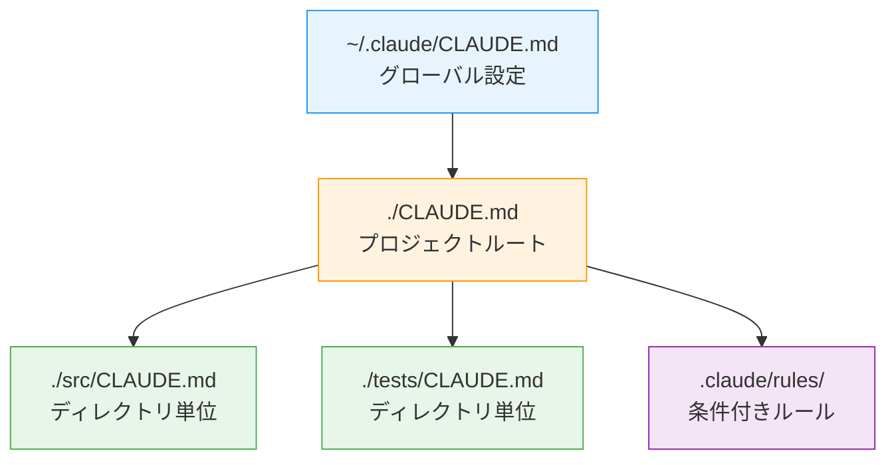
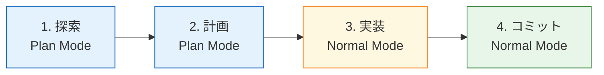

本記事は [Claude Code: Best practices for agentic coding](https://www.anthropic.com/engineering/claude-code-best-practices)（Anthropic Engineering Blog）の解説記事です。

## ブログ概要（Summary）

AnthropicのエンジニアリングチームであるBoris Chernyらが公開した本ブログは、Claude Codeを使ったエージェント型コーディングのベストプラクティスを体系化したものである。CLAUDE.mdの設計、検証ループの構築、Plan Modeの活用、worktree並列実行、Hooks・Skills・MCPの統合という5つの柱で構成されている。Anthropic内部のチームが実際にClaude Codeを使用した経験に基づいており、特にCLAUDE.mdの最適サイズ（約2.5kトークン、60〜80行）やworktree並列実行による生産性向上パターンが報告されている。

この記事は [Zenn記事: CLAUDE.md最適化の最前線：開発者が実践する5つのプロンプト設計戦略](https://zenn.dev/0h_n0/articles/c06ff696c6d2b5) の深掘りです。

## 情報源

- **種別**: 企業テックブログ
- **URL**: [https://www.anthropic.com/engineering/claude-code-best-practices](https://www.anthropic.com/engineering/claude-code-best-practices)
- **組織**: Anthropic Engineering
- **執筆者**: Boris Cherny（Claude Code開発者）他
- **発表日**: 2025〜2026年

## 技術的背景（Technical Background）

Claude Codeは、ターミナルネイティブのAIコーディングアシスタントとして、2025年初頭に公開された。コードベースの読み取り、ファイル編集、コマンド実行、開発ツールとの統合を行うエージェント型ツールである。2026年2月時点で50万人以上のアクティブ開発者が利用しているとAnthropicは報告している。

このブログの背景にある技術的課題は以下の3点である。

1. **コンテキストウィンドウの有限性**: LLMの注意予算（attention budget）は有限であり、不要な情報でコンテキストを埋めると応答品質が低下する。Liu et al.（2023）の「Lost in the Middle」研究が示すように、コンテキスト内の位置によって情報の活用効率が変化する

2. **命令追従の不完全性**: HumanLayer社の分析によると、フロンティアLLMが確実に従える命令数は約150〜200個程度とされている。Claude Codeのシステムプロンプトが既に約50個の命令を消費しているため、CLAUDE.mdに割り当て可能な命令数には制約がある

3. **検証なきコード生成のリスク**: 検証手段なしにコード生成を行うと、「もっともらしく見えるがエッジケースを処理しない実装」が生成されるリスクがある。Anthropicはこれを「trust-then-verify gap」と呼んでいる

## 実装アーキテクチャ（Architecture）

### CLAUDE.md設計のアーキテクチャ

Claude Codeは会話開始時に自動的にCLAUDE.mdをコンテキストに読み込む。このファイルは3つのスコープレベルで配置可能である。



- **ホームディレクトリ（`~/.claude/CLAUDE.md`）**: 全プロジェクト共通の個人設定。言語・エディタの好み、コミットメッセージスタイル等
- **プロジェクトルート（`./CLAUDE.md`）**: Git管理してチーム共有。テスト実行コマンド、ブランチ規約、コードスタイル等
- **子ディレクトリ**: 該当ディレクトリで作業時にのみ読み込まれる。フロントエンド固有の規約やテスト固有の設定等
- **`.claude/rules/`**: モジュール式のルールファイル。コンテキストに応じた条件付き読み込み

### 検証ループアーキテクチャ

Anthropicは検証手段の提供を「最もレバレッジの高い単一の行動」と位置づけている。


検証手段は4種類に分類される。

| 検証パターン | 対象 | 例 |
|------------|------|-----|
| テストスイート | バックエンド・ライブラリ | 「テストを書いて実行し、全パスするまで修正して」 |
| Bashコマンド | インフラ・スクリプト | 「curlでAPIを叩いて期待する応答を確認して」 |
| ブラウザテスト | フロントエンド | 「ページのスクリーンショットを撮って元と比較して」 |
| 型チェック | TypeScript | 「typecheckを実行して型エラーがないことを確認」 |

### Plan Mode → 実装の2段階ワークフロー



Boris Chernyは「計画が重要なのは、アプローチに不確実性がある場合、変更が複数ファイルにまたがる場合、または変更対象のコードに不慣れな場合」と述べている。小さなタスク（タイポ修正、ログ追加等）では計画を省略して直接実行するほうが効率的とされている。

### Hooks・Skills・MCPの統合

CLAUDE.mdの指示は「アドバイザリ（助言的）」であるのに対し、Hooksは「確定的」に実行される。

| 自動化手段 | 動作特性 | 用途 |
|-----------|---------|------|
| **CLAUDE.md** | アドバイザリ（無視されうる） | コードスタイル、ブランチ規約 |
| **Hooks** | 確定的（必ず実行される） | フォーマッター実行、lint |
| **Skills** | 手動トリガー（`/`コマンド） | 複合ワークフロー |
| **MCP** | 外部ツール統合 | Slack、BigQuery、Figma等 |

## パフォーマンス最適化（Performance）

### CLAUDE.md最適化のメトリクス

各組織が報告しているCLAUDE.md最適化の効果:

| 報告元 | 指標 | Before | After | 改善率 |
|--------|------|--------|-------|--------|
| Arize AI | コンテキスト使用量 | 4,500トークン（300行） | 1,800トークン（60行） | 60%削減 |
| Arize AI | リポジトリ特化の精度 | ベースライン | +10.87% | （汎用ルール+5.19%との差） |
| Boris Cherny | コード品質 | ベースライン | 2〜3倍向上 | 検証ループ導入効果 |
| SFEIR Institute | ハルシネーション | ベースライン | 40%削減 | 3層構造の導入効果 |

ただし、これらの数値はそれぞれの評価環境・プロジェクトに依存するため、一般化には注意が必要である。

### worktree並列実行

Boris Chernyは3〜5本のworktreeを同時起動し、並列でClaudeセッションを実行することを「最大の生産性向上策」と述べている。

```bash
# worktreeの作成と並列セッション
git worktree add ../worktrees/feature-auth -b feature/auth
git worktree add ../worktrees/fix-perf -b fix/performance
git worktree add ../worktrees/refactor-db -b refactor/database

# 各worktreeで別々のClaudeセッション
# Tab 1: cd ../worktrees/feature-auth && claude
# Tab 2: cd ../worktrees/fix-perf && claude
# Tab 3: cd ../worktrees/refactor-db && claude
```

Boris Chernyの報告によると、並列セッションの10〜20%は途中で方針が合わなくなり破棄される。これは正常な運用であり、失敗コストとして許容される。

### コンテキスト管理のアンチパターン

Anthropicが公式に指摘する5つのアンチパターン:

| アンチパターン | 対処法 |
|-------------|--------|
| キッチンシンク・セッション | タスク間で `/clear` 実行 |
| 繰り返し修正 | 2回修正で改善なければ `/clear` して再プロンプト |
| 過剰なCLAUDE.md | 60行以下に圧縮、Hooksに変換 |
| trust-then-verifyギャップ | 検証手段を常に提供 |
| 無限探索 | 調査範囲を限定、サブエージェントに委譲 |

## 運用での学び（Production Lessons）

### 書くべきこと vs 書かないこと

Anthropic公式ドキュメントに基づく判断基準:

**含めるべき内容**:
- Claudeが推測できないBashコマンド
- デフォルトと異なるコードスタイル
- テスト実行方法・テストランナー
- ブランチ命名・PR規約
- プロジェクト固有のアーキテクチャ決定
- 非自明な動作・よくあるハマりポイント

**除外すべき内容**:
- コードを読めばわかること
- 言語の標準規約
- 詳細なAPIドキュメント（リンクで代替）
- 頻繁に変更される情報
- 「クリーンなコードを書く」等の自明な指示

判断の基準はシンプルで、各行について「この行を削除したらClaudeがミスをするか？」と自問し、答えがNoなら削除する。

### ポインタパターン

CLAUDE.mdにコードスニペットや詳細ドキュメントを直接記述すると内容が陳腐化するリスクがある。代わりにファイルパスへの参照（ポインタ）を使う。

```markdown
# CLAUDE.md でのポインタ活用
プロジェクト概要は @README.md を参照。
利用可能なnpmコマンドは @package.json を参照。
API設計規約: @docs/api-conventions.md
```

### Writer/Reviewerパターン

並列セッションを活かした品質向上パターンとして、実装と検証を別セッションに分離する方法がある。

| セッションA（Writer） | セッションB（Reviewer） |
|------|------|
| 「APIにレート制限を実装して」 | — |
| — | 「レート制限実装をレビューして。エッジケース、レースコンディションを確認」 |
| フィードバックに対応 | — |

Claudeは自身が書いたコードに対してバイアスを持つ可能性があるため、別コンテキストからのレビューで客観性が向上する。

## 学術研究との関連（Academic Connection）

このブログの実践的知見は、以下の学術研究と関連している。

- **Lost in the Middle（Liu et al., 2023）**: CLAUDE.mdの重要指示を先頭と末尾に配置すべきという推奨は、LLMが中間情報を見落としやすいという実証研究と整合する
- **The Instruction Hierarchy（Wallace et al., 2024）**: CLAUDE.mdがsystem promptとして最高優先度で扱われる仕組みは、命令階層の研究で理論的に支持されている
- **Principled Instructions（Bsharat et al., 2024）**: 「肯定的指示を使う」「対象読者を明記する」等の原則は、このブログの推奨事項と一致する

## まとめと実践への示唆

Anthropicエンジニアリングチームが公開したClaude Codeベストプラクティスは、学術研究の知見と実務経験を統合した実用的なガイドラインである。CLAUDE.mdの60行以下への最適化、検証ループの導入、worktree並列実行、Hooks/Skills/MCPの使い分けという4つの柱が、Claude Codeを効果的に活用するための基盤となっている。

このブログの知見は特定のプロジェクトやチーム規模に依存する部分があるため、自身のワークフローで効果を計測しながら段階的に導入することが推奨される。

## 参考文献

- **Blog URL**: [https://www.anthropic.com/engineering/claude-code-best-practices](https://www.anthropic.com/engineering/claude-code-best-practices)
- **Related Papers**: Liu et al., 2023 - Lost in the Middle ([https://arxiv.org/abs/2407.01178](https://arxiv.org/abs/2407.01178))
- **Related Papers**: Wallace et al., 2024 - The Instruction Hierarchy ([https://arxiv.org/abs/2407.11686](https://arxiv.org/abs/2407.11686))
- **Related Zenn article**: [https://zenn.dev/0h_n0/articles/c06ff696c6d2b5](https://zenn.dev/0h_n0/articles/c06ff696c6d2b5)

---

:::message
この記事はAI（Claude Code）により自動生成されました。本記事はAnthropic公式ブログの引用・解説であり、筆者自身が実験を行ったものではありません。最新の情報はAnthropic公式ドキュメントをご確認ください。
:::
