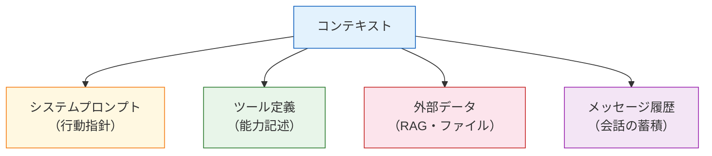
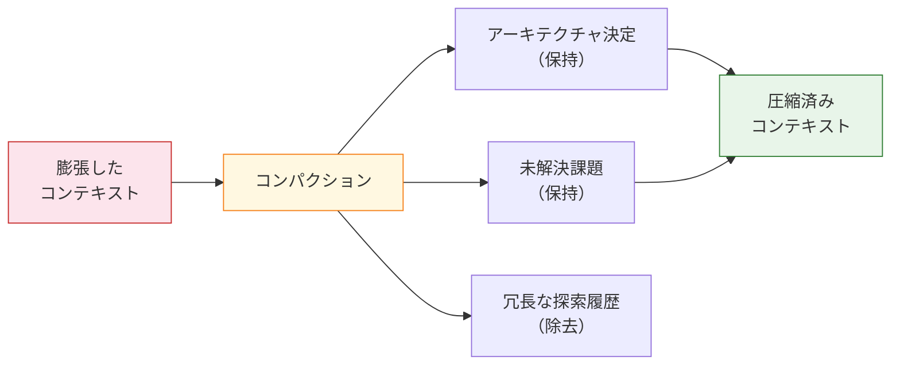
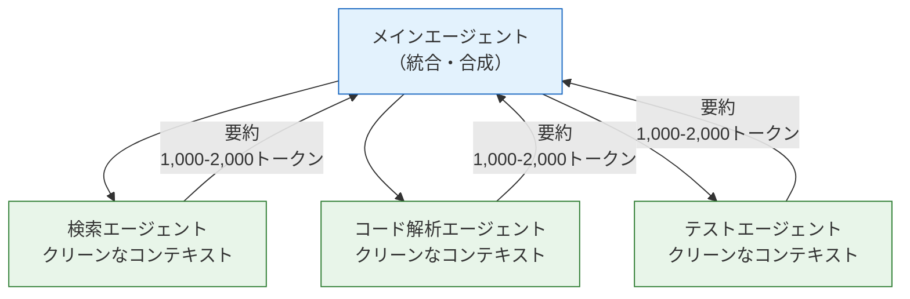

本記事は [Effective Context Engineering for AI Agents](https://www.anthropic.com/engineering/effective-context-engineering-for-ai-agents)（Anthropic Engineering Blog、2025年9月29日）の解説記事です。

## ブログ概要（Summary）

Anthropic Applied AIチームのPrithvi Rajasekaranらが公開した本ブログは、AIエージェントにおけるコンテキストエンジニアリングの体系的戦略を解説したものである。従来のプロンプトエンジニアリングが「効果的な指示の書き方」に焦点を当てていたのに対し、コンテキストエンジニアリングは「LLM推論時に最適なトークン集合をキュレーションし維持する戦略の総体」と定義されている。システムプロンプト、ツール定義、外部データ、メッセージ履歴の4要素を複数の推論ターンにわたって管理する手法を、Write・Select・Compress・Isolateの4パターンで整理している。

この記事は [Zenn記事: CLAUDE.md最適化の最前線：開発者が実践する5つのプロンプト設計戦略](https://zenn.dev/0h_n0/articles/c06ff696c6d2b5) の深掘りです。

## 情報源

- **種別**: 企業テックブログ
- **URL**: [https://www.anthropic.com/engineering/effective-context-engineering-for-ai-agents](https://www.anthropic.com/engineering/effective-context-engineering-for-ai-agents)
- **組織**: Anthropic Applied AI Team
- **執筆者**: Prithvi Rajasekaran, Ethan Dixon, Carly Ryan, Jeremy Hadfield
- **発表日**: 2025年9月29日

## 技術的背景（Technical Background）

### プロンプトエンジニアリングからコンテキストエンジニアリングへ

AIエージェントの進化に伴い、単発のプロンプト最適化では不十分になりつつある。Anthropicは以下の区別を明確にしている。

| 概念 | 焦点 | 対象スコープ |
|------|------|-------------|
| プロンプトエンジニアリング | 効果的な指示の書き方 | 単一ターン |
| コンテキストエンジニアリング | 最適なトークン集合のキュレーション | 複数ターン・エージェント全体 |

著者らは、LLMが「コンテキスト腐敗（context rot）」と呼ぶ現象を経験すると報告している。これはトークン数が増加するにつれて応答品質が低下する現象であり、Transformerアーキテクチャにおける $O(n^2)$ のペアワイズ注意計算に起因する「注意予算（attention budget）」の制約から生じる。

### コンテキストの4要素



この4要素すべてがコンテキストウィンドウのトークンを消費し、相互に注意予算を奪い合う関係にある。

## 実装アーキテクチャ（Architecture）

### コンテキストエンジニアリングの4戦略

Anthropicは効果的なコンテキスト管理を4つの戦略パターンに分類している。


#### 1. Write（書き出す）：外部メモリへの永続化

エージェントがコンテキストウィンドウの外に情報を書き出す戦略である。`NOTES.md`のような永続ファイルにアーキテクチャ決定や未解決課題を記録することで、長時間のタスクでもコンテキストを消費せずに情報を保持できる。

著者らは、Claude Codeがポケモンをプレイした実験を例に挙げている。数千ステップにわたる操作で正確な集計を維持するために、エージェントが構造化されたノートを外部ファイルに書き出す方式が採用された。

#### 2. Select（選択する）：Just-In-Time情報取得

コンテキストに事前ロードするのではなく、必要な時点で動的にデータを取得する戦略である。

```python
# Just-In-Timeパターンの概念
class JustInTimeAgent:
    def __init__(self):
        # 軽量な識別子のみ保持
        self.file_registry: dict[str, str] = {}  # name -> path

    def process_query(self, query: str) -> str:
        """必要時にのみファイル内容を取得"""
        relevant_paths = self._identify_relevant(query)
        # コンテキストに全ファイルを事前ロードしない
        for path in relevant_paths:
            content = self._load_on_demand(path)
            # 取得した内容で推論
```

Claude Codeはこのパターンを実践しており、ファイルパスやURLなどの軽量識別子を保持し、Bashコマンドやツールを通じて動的にデータを取得する。人間の認知における「外部記憶の参照」に類似したアプローチとされている。

著者らは「プログレッシブ・ディスクロージャ（progressive disclosure）」も紹介している。ファイルサイズは複雑度を、命名規則は目的を、タイムスタンプは関連性を示唆するメタ情報として、段階的にコンテキストを発見していく手法である。

#### 3. Compress（圧縮する）：コンパクション

コンテキストウィンドウが肥大化した際に、要約・リセットを行う戦略である。



コンパクションの実装では、再現率（すべての関連情報を捕捉する）と適合率（不要な情報を除去する）のバランスが重要とされている。ツール出力のクリアリングは、最も軽量なコンパクション手法として紹介されている。

#### 4. Isolate（隔離する）：サブエージェントアーキテクチャ

特化型のサブエージェントにタスクを委譲し、クリーンなコンテキストウィンドウで処理させる戦略である。



各サブエージェントは1,000〜2,000トークンの凝縮された要約をメインエージェントに返す。これにより、詳細な探索と合成を分離できる。

### 効果的なシステムプロンプト設計

著者らは、システムプロンプトの最適な「高度（altitude）」を見つけることの重要性を述べている。

| レベル | 特徴 | リスク |
|--------|------|--------|
| 過度に具体的 | 条件分岐をすべて列挙 | 脆弱性（想定外ケースに対応不能） |
| 過度に曖昧 | 「適切に対応して」 | 一貫性の欠如 |
| 最適な高度 | 具体的な行動シグナル＋柔軟性 | バランスが必要 |

### ツール定義の設計原則

Anthropicは以下の3原則を挙げている。

1. **自己完結性（Self-contained）**: ツール定義だけで使い方が理解できること
2. **非曖昧性（Unambiguous）**: 複数のツールの使い分けが明確であること
3. **トークン効率性（Token-efficient）**: 最小限の定義で最大の情報を伝えること

ツールセットが過剰に大きいと、エージェントが不適切なツールを選択し、コンテキストを浪費する誤用が発生する。

## パフォーマンス最適化（Performance）

### コンテキスト腐敗への対処

著者らが報告するコンテキスト腐敗の対処パターン:

| 手法 | コスト | 効果 | 適用場面 |
|------|--------|------|----------|
| ツール出力クリアリング | 低 | 中 | 各ツール呼び出し後 |
| 構造化ノートテイキング | 中 | 高 | 長時間タスク |
| コンパクション | 高 | 高 | コンテキスト上限接近時 |
| サブエージェント委譲 | 高 | 最高 | 複雑な並行タスク |

### 例示の設計

著者らは、例示（examples）の設計について「網羅的なエッジケースリストよりも、多様で標準的な例のほうが効果的」と述べている。少数の高品質な例が、大量の限界事例よりもエージェントの行動を適切に誘導するとされている。

### ハイブリッド検索戦略

一部のアプリケーションでは、事前計算された検索（速度重視）と自律的探索（動的コンテンツ対応）を組み合わせるハイブリッド戦略が有効とされている。

$$
\text{Context Quality} \propto \frac{\text{Signal (relevant tokens)}}{\text{Total tokens in context}}
$$

この比率を最大化することが、コンテキストエンジニアリングの本質的な目標である。

## 運用での学び（Production Lessons）

### CLAUDE.mdとの関係

このブログの知見は、Claude Codeにおける`CLAUDE.md`の設計と直接的に関連する。

- **Write戦略** → CLAUDE.mdにプロジェクト固有の情報を永続化
- **Select戦略** → CLAUDE.mdにファイルパスへの参照（ポインタ）を記述し、詳細は動的取得
- **Compress戦略** → CLAUDE.mdを60行以下に圧縮し、注意予算を節約
- **Isolate戦略** → Claude Codeのサブエージェント機能やworktree並列実行

### 核心原理

著者らは、コンテキストエンジニアリングの指導原理を以下のように要約している。

> 「望む結果の尤度を最大化する、最小かつ高シグナルなトークン集合を見つけよ」

これはコンパクション、トークン効率的なツール設計、自律的環境探索のいずれを通じても追求される共通の目標である。

### 実装推奨事項

著者らが報告する実装の推奨事項:

1. **最小限のプロンプトから開始**: 最強のモデルでテストし、必要に応じて追加
2. **明確なツール定義**: 曖昧な判断ポイントを排除
3. **メモリツールの活用**: セッション間の知識蓄積を可能にする
4. **コンテキストを有限リソースとして扱う**: 収穫逓減を意識した設計

## 学術研究との関連（Academic Connection）

このブログの知見は、以下の学術研究と関連している。

- **Lost in the Middle（Liu et al., 2023）**: コンテキスト内の位置によって情報活用効率が変化するという実証研究は、コンテキスト腐敗の理論的基盤を提供している。コンパクション戦略の必要性を裏付ける
- **Principled Instructions（Bsharat et al., 2024）**: 26の体系的プロンプト設計原則は、システムプロンプトの「最適な高度」を見つけるための具体的なガイドラインとして活用できる
- **The Instruction Hierarchy（Wallace et al., 2024）**: システムプロンプト > ユーザー入力 > ツール出力という命令優先度の階層は、コンテキストの4要素間の優先順位を理論的に説明する

## まとめと実践への示唆

Anthropic Applied AIチームが提唱するコンテキストエンジニアリングは、プロンプトエンジニアリングの自然な進化形として位置づけられる。Write・Select・Compress・Isolateの4戦略は、エージェントが長時間・複雑なタスクを処理する際のコンテキスト管理の体系的フレームワークを提供している。

「最小かつ高シグナルなトークン集合」という指導原理は、CLAUDE.mdの設計からサブエージェントアーキテクチャまで、あらゆるレベルのコンテキスト管理に適用可能である。コンテキスト腐敗は避けられない制約であるが、4戦略の適切な組み合わせにより管理可能とされている。

## 参考文献

- **Blog URL**: [https://www.anthropic.com/engineering/effective-context-engineering-for-ai-agents](https://www.anthropic.com/engineering/effective-context-engineering-for-ai-agents)
- **Related Papers**: Liu et al., 2023 - Lost in the Middle ([https://arxiv.org/abs/2407.01178](https://arxiv.org/abs/2407.01178))
- **Related Papers**: Bsharat et al., 2024 - Principled Instructions ([https://arxiv.org/abs/2402.14658](https://arxiv.org/abs/2402.14658))
- **Related Papers**: Wallace et al., 2024 - The Instruction Hierarchy ([https://arxiv.org/abs/2407.11686](https://arxiv.org/abs/2407.11686))
- **Related Zenn article**: [https://zenn.dev/0h_n0/articles/c06ff696c6d2b5](https://zenn.dev/0h_n0/articles/c06ff696c6d2b5)

---

:::message
この記事はAI（Claude Code）により自動生成されました。本記事はAnthropic公式ブログの引用・解説であり、筆者自身が実験を行ったものではありません。最新の情報はAnthropic公式ドキュメントをご確認ください。
:::
