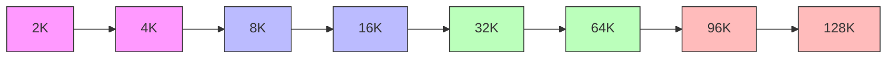

## ブログ概要（Summary）

Databricks Mosaic Researchは、20のLLMを対象にコンテキスト長2,000〜2,000,000トークンの範囲でRAG性能を系統的に評価した大規模ベンチマーク研究を発表した（arXiv: 2411.03538）。著者ら（Quinn Leng, Jacob Portes, Sam Havens, Matei Zaharia, Michael Carbin）は、「コンテキスト長の拡大がRAG性能を一様に向上させるわけではない」ことを実証し、モデルごとの性能劣化閾値・障害パターン・コスト効率を詳細に分析している。

この記事は [Zenn記事: Claude Sonnet 4.6の1Mコンテキストで構築するエージェント型RAGとレイテンシ最適化](https://zenn.dev/0h_n0/articles/47425e25dcdf30) の深掘りです。

## 情報源

- **種別**: 企業テックブログ / Research Paper
- **URL**: [https://www.databricks.com/blog/long-context-rag-performance-llms](https://www.databricks.com/blog/long-context-rag-performance-llms)
- **arXiv**: [https://arxiv.org/abs/2411.03538](https://arxiv.org/abs/2411.03538)
- **組織**: Databricks Mosaic Research
- **発表日**: 2024年11月

## 技術的背景（Technical Background）

LLMのコンテキストウィンドウは急速に拡大している。GPT-4oの128K、Claude 3.5 Sonnetの200K、Gemini 1.5 Proの2Mなど、数十万〜数百万トークンの処理が可能になった。この拡大に伴い、「RAGの検索ステップは不要になるのか？」「コンテキストを長くすれば性能は向上し続けるのか？」という根本的な問いが浮上している。

著者らはこの問いに対し、3つのデータセット・20モデル・8段階のコンテキスト長で体系的な実験を行い、定量的な回答を提供している。既存研究（RULER、Needle in a Haystack等）が合成的なタスクを評価しているのに対し、本研究は実際のRAGパイプラインにおける「検索→生成」の実運用シナリオを評価対象としている点が特徴である。

## 実験手法（Methodology）

### データセット構成

| データセット | クエリ数 | ドキュメント数 | 平均トークン/doc | 特性 |
|:--|:--|:--|:--|:--|
| Databricks DocsQA | 139 | 7,563 | 2,856 | 製品ドキュメント（実務的） |
| FinanceBench | 150 | 53,399 | 811 | 財務報告書（専門領域） |
| Natural Questions (NQ) | 534 | 7,369 | 11,354 | Google実クエリ（学術的） |

### 検索・生成パイプライン

著者らが採用した実験設定は以下の通りである。

- **Embeddings**: OpenAI text-embedding-3-large
- **チャンクサイズ**: 512トークン（ストライド256トークン）
- **ベクトルストア**: FAISS（IndexFlatL2）
- **生成パラメータ**: Temperature 0.0、最大出力1024トークン
- **評価**: GPT-4oによるLLM-as-a-judge（人間との一致率88.1% ± 5.5%、Cohen's κ = 0.64 ± 0.13）

### コンテキスト長の設定

2K / 4K / 8K / 16K / 32K / 64K / 96K / 128Kの8段階（Geminiのみ256K / 512K / 1M / 1.5M / 2Mの追加評価）。各コンテキスト長で取得されるチャンク数は以下の通りである。

| コンテキスト長 | チャンク数 | DocsQA Recall | FinanceBench Recall | NQ Recall |
|:--|:--|:--|:--|:--|
| 2K | 1 | 0.547 | 0.097 | 0.845 |
| 4K | 5 | 0.856 | 0.287 | 0.992 |
| 8K | 13 | 0.906 | 0.493 | 1.0 |
| 16K | 29 | 0.957 | 0.603 | 1.0 |
| 32K | 61 | 0.978 | 0.764 | 1.0 |
| 64K | 125 | 0.986 | 0.856 | 1.0 |
| 128K | 253 | 0.993 | 0.916 | 1.0 |

著者らの報告によると、NQは8Kでほぼ完全なRecallに達するのに対し、FinanceBenchは128Kでも0.916に留まる。データセットの特性によってRecallの飽和点が大きく異なることが示されている。

### 評価対象モデル（20モデル）

**商用モデル**: o1-preview, o1-mini, GPT-4o, GPT-4o-mini, GPT-4-turbo, GPT-4, GPT-3.5-turbo, Claude 3.5 Sonnet, Claude 3 Opus, Claude 3 Sonnet, Claude 3 Haiku, Gemini 1.5 Pro, Gemini 1.5 Flash

**オープンソースモデル**: LLaMA 3.1 405B/70B/8B, LLaMA 3 70B, Qwen 2 72B, Mixtral-8x7B, DBRX

## 実験結果（Performance Results）

### 全データセット平均の性能比較

著者らが報告した全データセット平均のAnswer Correctnessスコア（0-1スケール）を以下に示す（論文Table S3より）。

| Model | Avg | 2K | 4K | 8K | 16K | 32K | 64K | 96K | 128K |
|:--|:--|:--|:--|:--|:--|:--|:--|:--|:--|
| o1-preview | 0.763 | 0.582 | 0.747 | 0.772 | 0.787 | 0.799 | 0.831 | 0.824 | 0.763 |
| o1-mini | 0.731 | 0.566 | 0.728 | 0.754 | 0.772 | 0.777 | 0.769 | 0.778 | 0.704 |
| GPT-4o | 0.709 | 0.467 | 0.671 | 0.721 | 0.752 | 0.759 | 0.769 | 0.769 | 0.767 |
| Claude 3.5 Sonnet | 0.695 | 0.506 | 0.684 | 0.723 | 0.718 | 0.748 | 0.741 | 0.732 | 0.706 |
| Claude 3 Opus | 0.686 | 0.463 | 0.652 | 0.702 | 0.716 | 0.725 | 0.755 | 0.732 | 0.741 |
| Qwen 2 72B | 0.637 | 0.469 | 0.628 | 0.669 | 0.672 | 0.682 | 0.683 | 0.648 | 0.645 |
| Gemini 1.5 Pro | 0.584 | 0.368 | 0.510 | 0.550 | 0.580 | 0.595 | 0.634 | 0.636 | 0.622 |
| LLaMA 3.1 405B | 0.550 | 0.445 | 0.591 | 0.615 | 0.623 | 0.594 | 0.587 | 0.516 | 0.426 |
| GPT-4-turbo | 0.588 | 0.465 | 0.600 | 0.634 | 0.641 | 0.623 | 0.623 | 0.562 | 0.560 |
| Claude 3 Sonnet | 0.569 | 0.432 | 0.587 | 0.662 | 0.668 | 0.631 | 0.525 | 0.559 | 0.485 |
| Mixtral-8x7B | 0.469 | 0.414 | 0.518 | 0.506 | 0.488 | 0.417 | — | — | — |
| DBRX | 0.447 | 0.438 | 0.539 | 0.528 | 0.477 | 0.255 | — | — | — |

### 性能劣化の閾値パターン

著者らの分析に基づく、各モデルの性能劣化開始点を整理する。



**64K以上で安定維持（Top Tier）**:
- o1-preview, o1-mini: 64K付近でピーク到達後も比較的安定
- GPT-4o: 64Kから128Kまでほぼ横ばい（0.769→0.767）
- Claude 3.5 Sonnet: 32Kでピーク（0.748）、128Kで0.706に微減
- Claude 3 Opus: 64Kでピーク（0.755）、128Kでも0.741を維持

**32K-64Kで劣化開始（Mid Tier）**:
- Qwen 2 72B: 64K後に劣化（0.683→0.645）
- GPT-4-turbo: 16Kでピーク（0.641）、以降は漸減
- Claude 3 Sonnet: 16Kでピーク（0.668）、64Kで0.525まで急落

**32K以下で劣化（Low Tier）**:
- LLaMA 3.1 405B: 16Kでピーク（0.623）、128Kで0.426まで大幅劣化
- Mixtral-8x7B: 4Kでピーク（0.518）、32Kで0.417。64K以上は評価不能
- DBRX: 4Kでピーク（0.539）、32Kで0.255まで崩壊

### Gemini 1.5の超長文コンテキスト（2Mトークンまで）

著者らはGemini 1.5 Pro/Flashのみ2Mトークンまでの拡張評価を行っている（論文Table S4より）。

| Model | 128K | 256K | 512K | 1024K | 1500K | 2000K |
|:--|:--|:--|:--|:--|:--|:--|
| Gemini 1.5 Pro | 0.622 | 0.633 | 0.615 | 0.627 | 0.619 | 0.609 |
| Gemini 1.5 Flash | — | 0.522 | 0.504 | 0.514 | 0.521 | 0.528 |

著者らによると、Gemini 1.5モデルは128K以上の超長文コンテキストでも性能が安定している。ただし、128K以下のスコアではGPT-4oやClaude 3.5 Sonnetに劣る点に注意が必要である。

### モデル別の障害パターン

著者らは各モデルの障害パターンを詳細に分析している。

| Model | 障害パターン | 説明 |
|:--|:--|:--|
| Claude 3 Sonnet | 著作権懸念による回答拒否 | コンテキスト長増加に伴い、著作権への配慮から回答を拒否するケースが増加 |
| Gemini 1.5 Pro | セーフティフィルタ | 長文コンテキスト提出時にコンテンツフィルタがブロック。ブロックされない場合は0.85超の精度 |
| Mixtral-8x7B | 反復・ランダム生成 | 長コンテキストで繰り返しやランダムなテキストを生成 |
| DBRX | 指示追従失敗 | 16K以上で質問に回答する代わりに要約を生成 |
| LLaMA 3.1 405B | 漸進的精度低下 | 32K以降で一貫して精度が低下。64Kで著しい劣化 |

## コスト分析

著者らは2024年10月時点のAPI料金に基づくコスト分析も提供している（論文Table S13より）。

| Model | 128Kクエリ単価 | 備考 |
|:--|:--|:--|
| GPT-4o | $0.32/query | バランス型 |
| Claude 3.5 Sonnet | $0.384/query | 高性能・やや高コスト |
| Gemini 1.5 Pro | $0.16/query | 低コスト・超長文対応 |
| o1-preview | $1.92/query | 最高性能・高コスト |

Gemini 1.5 Proの2Mトークンクエリでは$5.00/queryとなる。著者らはコスト効率の観点から、短いコンテキスト（8K-32K）で十分なRecallが得られるデータセットでは、従来のRAG（少数チャンク検索）がコスト効率で優れると指摘している。

## パフォーマンス最適化（Performance）

### コンテキスト長の最適化戦略

著者らの実験結果から導出される最適化戦略を整理する。

```python
from dataclasses import dataclass


@dataclass
class RAGConfig:
    """RAGパイプラインの設定"""
    model: str
    max_context: int
    cost_per_token: float


def optimal_context_length(
    config: RAGConfig,
    dataset_recall_saturation: int,
) -> int:
    """最適なコンテキスト長を決定

    Databricksの実験結果に基づき、モデルの性能劣化閾値と
    データセットのRecall飽和点のうち、小さい方を採用する。

    Args:
        config: RAGパイプライン設定
        dataset_recall_saturation: Recallが飽和するコンテキスト長

    Returns:
        推奨コンテキスト長（トークン数）
    """
    # モデル別の性能劣化閾値（論文Table S3より）
    model_thresholds: dict[str, int] = {
        "gpt-4o": 128_000,       # 128Kまで安定
        "claude-3.5-sonnet": 96_000,  # 96K付近でピーク
        "claude-3-opus": 128_000,     # 128Kまで安定
        "o1-preview": 96_000,         # 96K付近でピーク
        "gemini-1.5-pro": 2_000_000,  # 2Mまで安定
        "llama-3.1-405b": 16_000,     # 16Kでピーク
        "qwen-2-72b": 64_000,         # 64K付近でピーク
    }

    model_threshold = model_thresholds.get(config.model, 32_000)
    return min(model_threshold, dataset_recall_saturation, config.max_context)
```

### Recallの飽和点とコスト効率

著者らのデータから、NQデータセットでは8Kで十分なRecallが得られるため、128Kまでコンテキストを拡大してもRecallの向上分は微小である。一方、FinanceBenchでは128Kでもまだ0.916であり、さらなるコンテキスト拡大が理論的には有効である。

## 運用での学び（Production Lessons）

### モデル選択の判断基準

著者らの実験結果から、以下の判断基準が導出される。

1. **性能優先**: o1-preview（Avg: 0.763）が最高性能だが、コスト6倍（$1.92 vs $0.32）
2. **バランス型**: GPT-4o（Avg: 0.709）またはClaude 3.5 Sonnet（Avg: 0.695）
3. **超長文対応**: Gemini 1.5 Pro（2Mまで安定、$0.16/query at 128K）
4. **オープンソース**: Qwen 2 72B（Avg: 0.637、64Kまで安定）

### 障害パターンへの対策

著者らが報告した障害パターンに対して、実運用では以下の対策が考えられる。

- **回答拒否（Claude系）**: コンテキスト内のコンテンツに著作権関連の記述が含まれる場合、事前にフィルタリングするか、システムプロンプトで回答を促す
- **セーフティフィルタ（Gemini）**: コンテンツの事前スクリーニングとリトライ機構の実装
- **指示追従失敗（小規模モデル）**: コンテキスト長の上限を性能劣化閾値以下に制限する

## 学術研究との関連（Academic Connection）

本研究は以下の学術研究と関連している。

- **Lost in the Middle (Liu et al., 2023)**: 長コンテキストの中間位置での性能低下を報告。本研究はRAGパイプラインの文脈でこの現象を再確認している
- **LaRA (ICML 2025)**: RAG vs LC-LLMの系統的比較。本研究と相補的であり、LaRAはタスクタイプ別の分析、本研究はコンテキスト長別の分析に焦点
- **RULER (Hsieh et al., 2024)**: 合成タスクでの長コンテキスト評価。本研究は実際のRAGパイプラインでの評価であり、より実用的な知見を提供

### Zenn記事との関連

Zenn記事「Claude Sonnet 4.6の1Mコンテキストで構築するエージェント型RAGとレイテンシ最適化」で提案されているアーキテクチャにおいて、本研究は以下の設計判断の根拠となる。

1. **Claude Sonnet選択の妥当性**: Claude 3.5 Sonnetは128Kまで安定（0.706）であり、Avg 0.695はGPT-4o（0.709）に迫る。コスト差を考慮すると合理的な選択

2. **1Mコンテキスト活用の展望**: 本研究の評価対象にはClaude Sonnet 4.6は含まれていないが、Gemini 1.5 Proの2Mまでの安定性（0.609-0.633）は、1Mコンテキスト活用が技術的に実現可能であることを示唆している

3. **CAG/RAGハイブリッドの根拠**: Recallの飽和点がデータセットにより大きく異なる（NQ: 8Kで飽和 vs FinanceBench: 128Kでも未飽和）ことから、データ特性に応じてCAG（全文）とRAG（チャンク検索）を切り替えるハイブリッド戦略が合理的

4. **プロンプトキャッシュの必要性**: 128Kクエリで$0.384/queryのコストを考慮すると、プロンプトキャッシュによるコスト削減（90%割引）は実運用上不可欠

5. **レイテンシ最適化の重要性**: コンテキスト長の拡大はTTFTの増加を伴う。Zenn記事で提案されているストリーミング・非同期実行・キャッシュの組み合わせは、本研究が示すコンテキスト長拡大のコストを緩和する実用的なアプローチ

## まとめと実践への示唆

Databricks Mosaic Researchの本研究は、Long Context RAGの性能がモデル・データセット・コンテキスト長の3要素に複雑に依存することを大規模実験で実証した重要な研究である。著者らの結論は以下の3点に集約される。

1. **コンテキスト長の拡大は万能薬ではない**: 20モデル中、128Kまで安定して性能を維持できるのはGPT-4o、Claude 3.5 Sonnet、Claude 3 Opus、o1系の少数のSoTAモデルのみ
2. **モデルごとに異なる障害パターン**: 性能低下の原因は単純な精度低下だけでなく、回答拒否・セーフティフィルタ・指示追従失敗など多様であり、モデルごとの対策が必要
3. **コスト効率の考慮が不可欠**: 128Kクエリのコストは2Kクエリの64倍。Recallの飽和点を見極めた適切なコンテキスト長設定が実運用の鍵

## 参考文献

- **Blog URL**: [https://www.databricks.com/blog/long-context-rag-performance-llms](https://www.databricks.com/blog/long-context-rag-performance-llms)
- **arXiv**: [https://arxiv.org/abs/2411.03538](https://arxiv.org/abs/2411.03538)
- **Related Zenn article**: [https://zenn.dev/0h_n0/articles/47425e25dcdf30](https://zenn.dev/0h_n0/articles/47425e25dcdf30)
