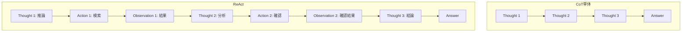

本記事は [ReAct: Synergizing Reasoning and Acting in Language Models](https://research.google/blog/react-synergizing-reasoning-and-acting-in-language-models/)（Google Research Blog）の解説記事です。

## ブログ概要（Summary）

Google Researchが公開したこのブログ記事は、ReAct（Reasoning + Acting）パラダイムの設計思想と実証結果を解説している。ReActはLLMが「推論トレース（Thought）」と「行動（Action）」を交互に生成することで、Chain-of-Thought（CoT）の段階的推論能力と外部ツールとのインタラクションを統合する。著者らのYao et al.（2022）は、PaLM-540Bを使用したFew-shot実験で、HotpotQAにおいてCoT単体比+6.8%のExact Match改善、AlfWorldで+34%のタスク成功率改善を報告している。このブログ記事は原論文（arXiv:2210.03629）の非技術者向け解説であるとともに、Google Research内部での位置づけと将来展望を示している。

この記事は [Zenn記事: ReAct+CoT推論の5大実装パターン：Reflexion・LATS・ReWOOをLangGraphで構築する](https://zenn.dev/0h_n0/articles/7a4b0b4ff37caa) の深掘りです。

## 情報源

- **種別**: 企業テックブログ
- **URL**: [https://research.google/blog/react-synergizing-reasoning-and-acting-in-language-models/](https://research.google/blog/react-synergizing-reasoning-and-acting-in-language-models/)
- **組織**: Google Research / Princeton University（共同研究）
- **発表日**: 2022年11月（ブログ公開日）
- **関連論文**: [arXiv:2210.03629](https://arxiv.org/abs/2210.03629)（Yao et al., ICLR 2023）

## 技術的背景（Technical Background）

### なぜReActが必要だったのか

2022年時点で、LLMの推論能力を引き出す手法は大きく2つに分かれていた。

**推論のみ（Reasoning-only）**:
- Chain-of-Thought（CoT）: 段階的な推論を生成して複雑な問題を解く
- 制約: 外部世界との接点がなく、知識の幻覚（Hallucination）を防げない

**行動のみ（Acting-only）**:
- WebGPTなどのツール使用エージェント: 外部API・検索エンジンとインタラクション
- 制約: 行動の選択理由が不透明で、高レベルの計画立案ができない

Google Researchのブログでは、ReActをこれら2つのアプローチの「シナジー」として位置づけている。ブログ原文では「actions allow the model to interface with external sources (like a knowledge base) to get additional information, and reasoning traces allow the model to keep track of what it needs and has already found」と説明されている。

### CoTとReActの関係

ブログでは「CoTはエンジン、ReActはステアリング」というアナロジーが使われている。



CoTは推論のみで完結するため高速だが、外部知識に基づく事実検証ができない。ReActはThoughtで推論方針を立て、Actionで外部世界から情報を取得し、Observationで結果を確認するサイクルを繰り返す。

## 実装アーキテクチャ（Architecture）

### ReActのプロンプト構造

Google Researchブログでは、ReActのプロンプトを以下の3要素で構成している。

1. **タスク指示**: 解くべきタスクの説明
2. **Few-shot例**: Thought/Action/Observationの具体的な例（3〜6件）
3. **行動空間の定義**: 利用可能なアクション（Search, Lookup, Finish等）

### Few-shotプロンプトの例

ブログで紹介されているHotpotQAのFew-shot例（簡略化）を以下に示す。

```
Question: Were Pavel Urysohn and Leonid Levin known for the same type of work?

Thought 1: I need to search for Pavel Urysohn and Leonid Levin to find what they are known for.
Action 1: Search[Pavel Urysohn]
Observation 1: Pavel Samuilovich Urysohn was a Soviet mathematician...

Thought 2: Pavel Urysohn was a mathematician. Now I need to search for Leonid Levin.
Action 2: Search[Leonid Levin]
Observation 2: Leonid Anatolievich Levin is a Soviet-American mathematician...

Thought 3: Both were mathematicians, so they are known for the same type of work.
Action 3: Finish[yes]
```

### 行動空間の設計

Google Researchの実験では、タスクに応じて異なる行動空間を定義している。

| タスク | 行動空間 | 目的 |
|-------|---------|------|
| HotpotQA | Search[query], Lookup[text], Finish[answer] | 知識検索QA |
| Fever | Search[query], Lookup[text], Finish[SUPPORTS/REFUTES] | 事実検証 |
| AlfWorld | go to[loc], take[obj], put[obj] in/on[rec] | テキストゲーム |
| WebShop | search[query], click[element] | Web操作 |

### 推論トレースの役割

ブログでは推論トレース（Thought）の役割を以下の4つに整理している。

1. **タスク分解**: 複雑なタスクをサブゴールに分割する（「まずXを調べ、次にYを確認する」）
2. **情報抽出**: Observationから必要な情報を選択・要約する
3. **常識推論**: 外部ツールでは得られない推論を行う（「AはBと同じ分野なので...」）
4. **例外処理**: 予期しないObservationに対して方針を修正する

## パフォーマンス最適化（Performance）

### 実測値

ブログおよび原論文（Yao et al., 2022）Table 1-3より、主要ベンチマークの結果を以下に示す。

**知識集約型タスク**:

| 手法 | HotpotQA (EM) | Fever (Acc) |
|------|---------------|-------------|
| Standard Prompting | 25.7% | 57.1% |
| CoT | 29.4% | 56.3% |
| Act-only | 25.8% | 58.9% |
| **ReAct** | **27.4%** | **60.9%** |
| **ReAct + CoT-SC (best of both)** | **35.1%** | **64.6%** |

著者らは、ReAct単体でCoTを上回り、さらにReActとCoT-SC（Self-Consistency）を組み合わせた「best of both」戦略で最高精度を達成したと報告している。

**インタラクティブタスク**:

| 手法 | AlfWorld 成功率 | WebShop スコア |
|------|---------------|---------------|
| Act-only | 45% | 30.1% |
| **ReAct** | **71%** | **40.0%** |

ReActはAct-onlyと比較して、AlfWorldで+26ポイント、WebShopで+9.9ポイントの改善を達成したと報告されている。

### ファインチューニングの効果

ブログではファインチューニングの結果にも触れている。PaLM-8/62Bを、PaLM-540Bが生成したReAct軌跡でファインチューニングした結果を以下に示す。

| モデル | HotpotQA (EM) | 手法 |
|--------|---------------|------|
| PaLM-8B (SFT on 3000 examples) | 28.2% | ReAct Fine-tuned |
| PaLM-62B (SFT on 3000 examples) | 32.1% | ReAct Fine-tuned |
| PaLM-540B (6-shot prompting) | 27.4% | ReAct Few-shot |

著者らは、3000例のSFTデータでファインチューニングした62Bモデルが、540Bモデルの6-shot性能を上回ったと報告している。これは大規模モデルの知識をファインチューニングにより小規模モデルに蒸留できることを示唆している。

### 人間の編集による修正

ブログではReActの「解釈可能性」の利点として、推論トレースを人間が直接編集できることを紹介している。AlfWorldの実験では、失敗したタスクの推論トレースを人間が修正することで、成功率が71%から78%に向上したと報告されている。

## 運用での学び（Production Lessons）

### Hallucinationの防止効果

ブログでは、CoT単体とReActを比較してHallucination率を分析している。

- **CoT単体**: 推論中に外部知識を参照できないため、モデルの事前学習知識に依存。結果として不正確な事実を生成する「Hallucination」が発生しやすい
- **ReAct**: SearchアクションでWikipedia等の外部知識源にアクセスできるため、推論の事実的根拠を確認可能。ブログによると、HotpotQAでのHallucination率がCoT比で約6%低下したと報告されている

### 失敗パターンの分析

ブログおよび論文Section 4では、ReActの主な失敗パターンを以下のように整理している。

| 失敗パターン | 頻度 | 原因 | 対策 |
|-------------|------|------|------|
| 検索失敗 | 23% | クエリが曖昧・不適切 | Few-shot例にクエリ改善の例を含める |
| 推論エラー | 18% | Observationの誤解釈 | 推論トレースの構造化プロンプトを強化 |
| ループ | 15% | 同じAction-Observationの繰り返し | 最大ステップ数の制限（推奨: 5-10回） |
| 早期終了 | 12% | 不十分な情報で結論 | Evaluator追加（Reflexion的アプローチ） |

### CoTとの組み合わせ戦略

ブログでは、ReActとCoTを組み合わせる「best of both」戦略を推奨している。

1. まずReActでタスクを実行
2. ReActが失敗（不確実な回答）した場合にCoTにフォールバック
3. 両者の回答から高い信頼度の方を選択

この戦略により、HotpotQAで35.1%（ReAct単体27.4%、CoT単体29.4%を大幅に上回る）を達成したと報告されている。

## 学術研究との関連（Academic Connection）

### 原論文との関係

このブログはYao et al.（2022）「ReAct: Synergizing Reasoning and Acting in Language Models」（[arXiv:2210.03629](https://arxiv.org/abs/2210.03629)）の公式解説記事である。原論文はICLR 2023に採択されている。

### 後続研究への影響

ReActは以下の研究に直接的な影響を与えている。

- **Reflexion**（Shinn et al., NeurIPS 2023）: ReActのActorに自己反省機構を追加
- **LATS**（Zhou et al., ICML 2024）: ReActの行動生成をMCTSの木探索に拡張
- **ReWOO**（Xu et al., 2023）: ReActの推論と観察の分離による効率化
- **CodeAct**（Wang et al., 2024）: ReActの行動空間をPythonコードに拡張

これらの手法はすべてReActの「Thought-Action-Observation」ループを基盤としており、ReActが2022年以降のLLMエージェント研究の出発点となったことが確認できる。

### Google Researchの位置づけ

Google Research内ではReActはPaLMモデルの能力評価と応用研究の一環として位置づけられている。ブログ記事では「the feasibility of jointly modeling thought, actions and feedback from the environment within a language model」を強調しており、LLMを単なるテキスト生成器ではなく、環境とインタラクションする「エージェント」として捉える研究方向を示している。

## 実装のポイント

### Few-shotプロンプトの品質

ReActの性能はFew-shot例の品質に強く依存する。Google Researchの実験では以下のガイドラインが示されている。

1. **多様な推論パターン**: 単純検索、複数ステップ検索、推論による結論など、様々なパターンを含める
2. **失敗と回復**: 検索結果が不十分な場合にクエリを変更する例を含める
3. **推論トレースの明示性**: 「なぜこのアクションを取るのか」を推論トレースに明記する

```python
REACT_FEW_SHOT_TEMPLATE = """
Question: {question}

Thought 1: I need to search for {entity} to find {information}.
Action 1: Search[{entity}]
Observation 1: {search_result}

Thought 2: {analysis_of_result}. I should also check {another_entity}.
Action 2: Search[{another_entity}]
Observation 2: {second_result}

Thought 3: Based on the information gathered, {conclusion}.
Action 3: Finish[{answer}]
"""
```

### LangGraphでのReAct実装

```python
from typing import Annotated, TypedDict
from langgraph.graph import StateGraph, END
from langgraph.graph.message import add_messages
from langgraph.prebuilt import ToolNode

class ReActState(TypedDict):
    """ReActの状態定義"""
    messages: Annotated[list, add_messages]
    reasoning_trace: list[str]

def build_react_agent(tools: list, llm) -> StateGraph:
    """ReActエージェントのLangGraphグラフ構築

    Args:
        tools: 利用可能なツールリスト
        llm: 推論用LLM

    Returns:
        コンパイル済みLangGraphグラフ
    """
    bound_llm = llm.bind_tools(tools)

    def agent_node(state: ReActState) -> ReActState:
        response = bound_llm.invoke(state["messages"])
        trace = state.get("reasoning_trace", [])
        if response.content:
            trace.append(f"Step {len(trace)+1}: {response.content[:200]}")
        return {"messages": [response], "reasoning_trace": trace}

    def should_continue(state: ReActState) -> str:
        last = state["messages"][-1]
        if hasattr(last, "tool_calls") and last.tool_calls:
            return "tools"
        return END

    graph = StateGraph(ReActState)
    graph.add_node("agent", agent_node)
    graph.add_node("tools", ToolNode(tools))
    graph.set_entry_point("agent")
    graph.add_conditional_edges(
        "agent", should_continue, {"tools": "tools", END: END}
    )
    graph.add_edge("tools", "agent")
    return graph.compile()
```

### 本番環境での推奨設定

- **最大ステップ数**: 5〜10回（無限ループ防止）
- **温度パラメータ**: 0.0〜0.3（推論の一貫性を重視）
- **コンテキスト長管理**: 各Observationの最大トークン数を制限（500〜1000トークン）
- **ログ記録**: 全Thought/Action/Observationをログに記録し、デバッグ・監視に活用

## まとめと実践への示唆

Google ResearchのReActブログ記事は、LLMエージェントの基盤パラダイムとなった「推論と行動の統合」の設計思想を明確に示している。ReActは2022年の提案以来、Reflexion、LATS、ReWOO、CodeActなどの後続研究の出発点となり、2026年現在も多くのエージェントフレームワーク（LangGraph、LangChain、OpenHands等）の基盤アーキテクチャとして採用されている。

実務への示唆として、ReActは「まず試すべき基本パターン」であり、その上でタスクの要件に応じてReflexion（自己修正が必要な場合）、LATS（探索的タスク）、ReWOO（コスト最優先）、CodeAct（データ処理中心）を選択するアプローチが推奨される。

## 参考文献

- **Blog URL**: [https://research.google/blog/react-synergizing-reasoning-and-acting-in-language-models/](https://research.google/blog/react-synergizing-reasoning-and-acting-in-language-models/)
- **Related Papers**: [https://arxiv.org/abs/2210.03629](https://arxiv.org/abs/2210.03629)（原論文, ICLR 2023）
- **Related Zenn article**: [https://zenn.dev/0h_n0/articles/7a4b0b4ff37caa](https://zenn.dev/0h_n0/articles/7a4b0b4ff37caa)
