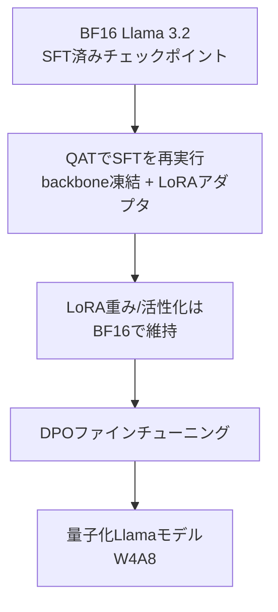
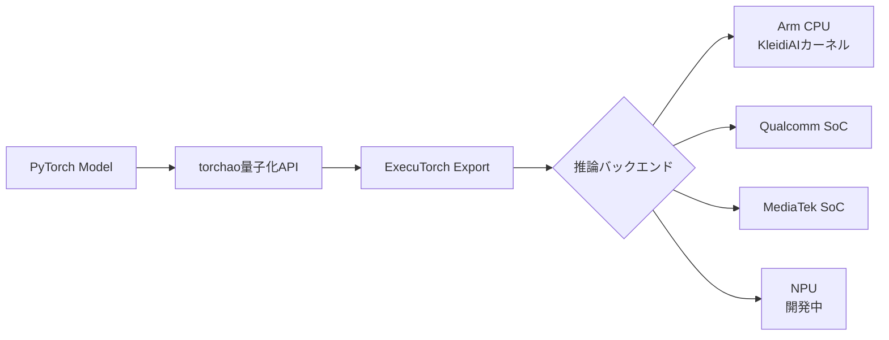

本記事は [Meta AI Blog: Introducing quantized Llama models](https://ai.meta.com/blog/meta-llama-quantized-lightweight-models/) の解説記事です。

## ブログ概要（Summary）

2024年10月、Meta AIはLlama 3.2 1Bおよび3Bモデルの公式量子化版をリリースした。重み4bit（グループサイズ32）＋活性化8bit動的量子化のスキームにより、モデルサイズを**56%削減**、メモリ使用量を**41%削減**、デコードレイテンシを**2.5倍高速化**している。量子化手法としてQuantization-Aware Training（QAT）with LoRAと、Post-Training Quantizationの**SpinQuant**の2種類を提供している。

この記事は [Zenn記事: Ollama 0.17でオンプレLLM推論環境を構築する実践ガイド](https://zenn.dev/0h_n0/articles/96b758789bcc95) の深掘りです。Zenn記事ではOllamaで`ollama pull llama3.1:8b-instruct-q4_K_M`のようにLlamaモデルをダウンロードする手順が紹介されていますが、本記事ではMeta公式の量子化戦略とその技術的背景を解説します。

## 情報源

- **種別**: 企業テックブログ
- **URL**: [https://ai.meta.com/blog/meta-llama-quantized-lightweight-models/](https://ai.meta.com/blog/meta-llama-quantized-lightweight-models/)
- **組織**: Meta AI
- **発表日**: 2024年10月24日

## 技術的背景（Technical Background）

### なぜ公式量子化モデルが必要か

LLMの量子化はコミュニティ主導で多くの手法（GGML, GPTQ, AWQ等）が開発されてきた。しかし、各手法はモデルアーキテクチャとの整合性が保証されておらず、量子化時の精度低下がモデル提供者の品質基準を満たさない場合がある。

Meta AIが公式量子化モデルを提供する動機：
- **品質保証**: 安全性テストとベンチマークをMeta社内で検証済み
- **モバイル最適化**: ExecuTorch + Arm CPUに最適化されたカーネル
- **再現性**: 公開されたスキームに従えば同等の品質が得られる

### 量子化スキームの詳細

Meta AIが採用した量子化スキーム（ブログ記載の仕様）：

**Transformer線形層**:
- 重み: 4bit groupwiseグループ量子化（グループサイズ32）
- 活性化: 8bit per-token動的量子化

**分類層**:
- 重み: 8bit per-channel量子化
- 活性化: 8bit per-token動的量子化

**Embedding層**:
- 8bit per-channel量子化

数式で表すと、グループ量子化の場合：

$$
w_q^{(g)} = \text{round}\left(\frac{w^{(g)} - z^{(g)}}{s^{(g)}}\right), \quad s^{(g)} = \frac{w^{(g)}_{\max} - w^{(g)}_{\min}}{2^4 - 1}
$$

ここで$g$はグループインデックス（32要素ごと）、$s^{(g)}$と$z^{(g)}$はグループごとのスケールとゼロポイントである。

## 2つの量子化手法

### 手法1: QAT with LoRA

**Quantization-Aware Training (QAT)** は、量子化のシミュレーションをトレーニングループに組み込むことで、量子化後の精度低下を最小化する手法である。

Meta AIの実装プロセス（ブログ記載）：



1. BF16のLlama 3.2モデル（Supervised Fine-Tuning済み）を出発点とする
2. **backbone（本体）を凍結**し、LoRAアダプタをTransformerブロックに追加
3. QATを有効にした状態でSFTを再実行（torchao APIを使用）
4. LoRAの重みと活性化はBF16で維持し、量子化誤差の伝播を抑制
5. 最終段階でDirect Preference Optimization（DPO）を実行

**QATの利点**: 量子化誤差をトレーニング中に学習で補償できるため、Post-Training Quantizationより高精度

**QATの制約**: トレーニングデータとGPU計算資源が必要

### 手法2: SpinQuant

**SpinQuant** はPost-Training Quantization（PTQ）手法であり、トレーニングデータセットへのアクセスが不要である点が特徴的である。

SpinQuantの仕組み（ブログ記載）：

1. **回転行列による外れ値の平滑化**: 重みと活性化に回転行列（Rotation Matrix）を適用し、チャネル間の外れ値を分散させる
2. **WikiTextデータセットをキャリブレーションに使用**: 回転行列の最適化にのみデータが必要（モデルの再トレーニングは不要）
3. **Range Setting**: 量子化レンジを最適化
4. **Generative PTQ**: 生成タスクに特化したPTQ手法を適用

**SpinQuantの利点**:
- トレーニングデータセットが不要（キャリブレーションデータのみ）
- 計算コストが低い
- 移植性が高い

**SpinQuantの制約**:
- QATに比べて精度がやや劣る

## パフォーマンス指標

### モデルサイズとメモリ

ブログで報告されている数値（Android OnePlus 12での測定）：

| 指標 | BF16ベースライン | 量子化モデル | 改善率 |
|------|----------------|------------|--------|
| モデルサイズ | 100% | 44% | **56%削減** |
| メモリ使用量 | 100% | 59% | **41%削減** |

### 推論速度

Arm CPUバックエンド（ExecuTorch）での測定結果：

| 指標 | 改善率 |
|------|--------|
| デコードレイテンシ | **2.5倍高速化**（平均） |
| プリフィルレイテンシ | **4.2倍高速化**（平均） |
| 総合速度向上 | **2-4倍** |

Time-to-first-tokenは64トークンのプロンプトで測定されている。

### 検証デバイス

- **OnePlus 12**: 1Bおよび3Bモデルの主要ベンチマークデバイス
- **Samsung S24+**: 1Bおよび3B動作確認済み
- **Samsung S22**: 1Bモデル動作確認済み
- **iOS**: 精度は同等だが、パフォーマンスベンチマークは未評価

## 実装アーキテクチャ（Architecture）

### ExecuTorchフレームワーク

Meta AIは量子化Llamaモデルの推論基盤として**ExecuTorch**を採用している。ExecuTorchはPyTorchの推論フレームワークであり、エッジデバイス向けに設計されている。



**KleidiAIカーネル**: Arm CPUに最適化されたマイクロカーネルライブラリ。4bit重み×8bit活性化のGEMM（行列積）を効率的に実行する。

### torchao量子化API

量子化の実装にはPyTorchの`torchao`（Torch Acceleration for Operations）ライブラリが使用されている：

```python
# 概念的な量子化コード（torchao API）
import torchao

# QATの場合
model = torchao.quantize(
    model,
    weight_dtype=torch.int4,
    weight_group_size=32,
    activation_dtype=torch.int8,
    activation_scheme="per_token_dynamic",
)

# QATトレーニングループ（LoRAアダプタ付き）
for batch in dataloader:
    output = model(batch)
    loss = compute_loss(output, labels)
    loss.backward()  # 量子化シミュレーション込みの勾配計算
    optimizer.step()
```

## Ollamaとの関連

### Ollamaによる量子化Llamaモデルの利用

ブログ記事ではOllamaがMeta AIの主要パートナーとして言及されている。Ollamaで利用可能な量子化Llamaモデルは、Meta公式の量子化スキームとは異なるGGML/GGUF形式で提供されている：

| 項目 | Meta公式量子化 | Ollama（GGUF） |
|------|--------------|---------------|
| 量子化形式 | torchao W4A8 | GGML Q4_K_M等 |
| ターゲット | ExecuTorch (Mobile) | llama.cpp (Desktop/Server) |
| 活性化量子化 | 8bit動的量子化 | なし（FP16/FP32） |
| 主な用途 | モバイルアプリ | サーバー/デスクトップ推論 |
| セットアップ | ExecuTorch SDK | `ollama pull`コマンド |

Zenn記事で紹介されているOllamaのモデルダウンロード：

```bash
# OllamaでのLlamaモデル取得（GGUF形式）
ollama pull llama3.1:8b-instruct-q4_K_M
```

このモデルはMeta公式の量子化とは別の経路（llama.cppコミュニティによるGGUF変換）で生成されたものだが、基盤となるモデルは同じLlama 3.xアーキテクチャである。

### モデル選定への示唆

Zenn記事のモデル選定フローチャートと対応させると：

- **1B/3B（Meta公式量子化）**: モバイルデバイスでの推論に最適。ExecuTorch経由
- **7B-8B（Q4_K_M）**: Ollamaでのサーバー推論に最適。RTX 4060 Ti (16GB)で動作
- **14B以上**: Ollamaでより大きなGPUが必要。Meta公式量子化は現状未提供

## パフォーマンス最適化（Performance）

### グループサイズの選択

Meta AIがグループサイズ32を選択した理由（ブログの記載に基づく分析）：

| グループサイズ | 精度 | オーバーヘッド | 速度 |
|-------------|------|------------|------|
| 16 | 最高 | 大きい | やや遅い |
| **32** | **高い** | **バランス** | **バランス** |
| 64 | 中程度 | 小さい | 速い |
| 128 | 低い | 最小 | 最速 |

グループサイズ32は、Arm CPUのSIMDレジスタ幅（128bit NEON）と整合性が良く、4bit×32要素 = 128bitで1レジスタに収まる。

### プリフィル vs デコードの速度差

プリフィルが4.2倍と大きく高速化されている理由は、プリフィルフェーズが計算バウンド（行列積の並列化で恩恵が大きい）であるのに対し、デコードフェーズはメモリ帯域バウンド（1トークンずつの逐次処理）であるためである。

## 学術研究との関連（Academic Connection）

### SpinQuantの学術的背景

SpinQuantは直交変換（回転行列）を用いてweight/activation分布を平滑化する手法であり、以下の学術研究に基づいている：

- **QuIP/QuIP#**: 直交行列を用いた非一様量子化。SpinQuantはこの系譜にある
- **SmoothQuant**: 活性化の外れ値を重みに「移す」手法。SpinQuantは回転行列で同様の効果を実現

### QATとLoRAの組み合わせ

QATとLoRAの組み合わせ（QLoRA系のアプローチ）は、量子化モデルのファインチューニングにおける効率的な手法として知られている。Meta AIの実装では、backboneを凍結しLoRAアダプタのみをBF16で学習することで、量子化誤差の伝播を最小化している。

## まとめと実践への示唆

Meta AIの公式量子化Llamaモデルは、モバイルデバイスでのLLM推論を現実的にした技術である。W4A8量子化スキーム（重み4bit + 活性化8bit）により、1Bおよび3Bモデルがスマートフォンで実用的な速度で動作する。

Ollamaユーザーにとっての直接的な示唆は、Llama 3.xファミリーがMeta AI自身によって量子化の品質保証がなされている点である。Ollamaで使われるGGUF形式はMeta公式とは異なる経路だが、4bit量子化が実用レベルの品質を維持できることはMeta AIの研究でも裏付けられている。

## 参考文献

- **Blog URL**: [https://ai.meta.com/blog/meta-llama-quantized-lightweight-models/](https://ai.meta.com/blog/meta-llama-quantized-lightweight-models/)
- **ExecuTorch**: [https://pytorch.org/executorch/](https://pytorch.org/executorch/)
- **SpinQuant**: [https://github.com/facebookresearch/SpinQuant](https://github.com/facebookresearch/SpinQuant)
- **Related Zenn article**: [https://zenn.dev/0h_n0/articles/96b758789bcc95](https://zenn.dev/0h_n0/articles/96b758789bcc95)

---

:::message
本記事は [Meta AI Blog](https://ai.meta.com/blog/meta-llama-quantized-lightweight-models/) の引用・解説記事であり、筆者自身が実験を行ったものではありません。数値はすべて原ブログからの引用です。
:::
