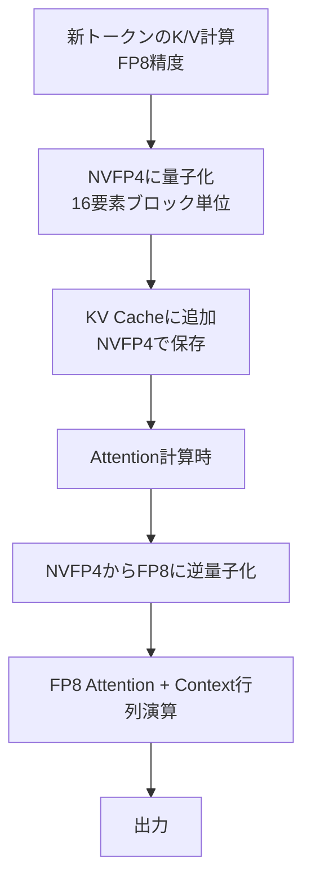
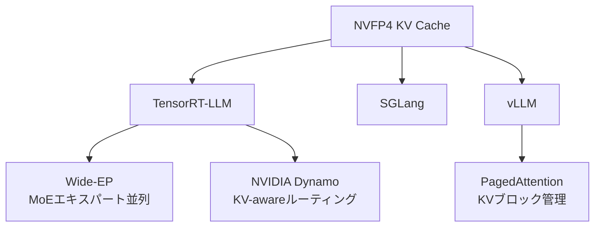

本記事は [NVIDIA Technical Blog: Optimizing Inference for Long Context and Large Batch Sizes with NVFP4 KV Cache](https://developer.nvidia.com/blog/optimizing-inference-for-long-context-and-large-batch-sizes-with-nvfp4-kv-cache/) の解説記事です。

## ブログ概要（Summary）

NVIDIAは、Blackwell GPU向けの4ビット浮動小数点フォーマット**NVFP4**をKV Cacheに適用し、LLM推論のメモリ効率と速度を大幅に改善する技術を発表した。FP8と比較してKV Cacheのメモリ使用量を**約50%削減**、コンテキスト長とバッチサイズを**2倍**に拡張可能とし、Time-to-First-Token（TTFT）を**最大3倍高速化**する。精度劣化はMMLU-PRO、MBPP、Ruler 64K等のベンチマークで**1%未満**と報告されている。

この記事は [Zenn記事: Ollama 0.17でオンプレLLM推論環境を構築する実践ガイド](https://zenn.dev/0h_n0/articles/96b758789bcc95) の深掘りです。Zenn記事ではOllamaのKV Cache量子化（`--kv-cache-type q8_0`）が紹介されていますが、本記事ではNVIDIA Blackwell GPUにおけるハードウェアネイティブなKV Cache量子化技術を解説します。

## 情報源

- **種別**: 企業テックブログ
- **URL**: [https://developer.nvidia.com/blog/optimizing-inference-for-long-context-and-large-batch-sizes-with-nvfp4-kv-cache/](https://developer.nvidia.com/blog/optimizing-inference-for-long-context-and-large-batch-sizes-with-nvfp4-kv-cache/)
- **組織**: NVIDIA
- **関連ブログ**: [Introducing NVFP4 for Efficient and Accurate Low-Precision Inference](https://developer.nvidia.com/blog/introducing-nvfp4-for-efficient-and-accurate-low-precision-inference/)

## 技術的背景（Technical Background）

### KV Cacheのメモリボトルネック

LLM推論において、KV Cacheはコンテキスト長とバッチサイズに比例してメモリを消費する。FP16でのKV Cacheメモリ量は以下で計算される：

$$
\text{KV\_mem} = 2 \times L \times n_h \times d_h \times s \times b \times \text{sizeof(dtype)}
$$

ここで$L$はTransformer層数、$n_h$はKVヘッド数、$d_h$はヘッド次元、$s$はシーケンス長、$b$はバッチサイズである。長コンテキスト（64K～128Kトークン）や大バッチでは、KV CacheがGPUメモリの大部分を占有し、スループットのボトルネックとなる。

### なぜ4ビット量子化が必要か

FP8 KV Cacheは既に広く利用されているが、さらなるメモリ削減が求められるユースケースがある：

- **長コンテキスト推論**: 128Kトークン以上のコンテキストでは、FP8でもメモリが不足する
- **大バッチ推論**: サービング時のスループット向上にはバッチサイズ拡大が必要
- **MoEモデル**: Qwen3-480Bのような大規模MoEモデルではエキスパート並列化のオーバーヘッドも加わる

## NVFP4フォーマットの技術詳細

### E2M1 + 2レベルスケーリング

NVFP4は**E2M1**（符号1bit、指数2bit、仮数1bit）のフォーマットを採用し、値の範囲は約$[-6, +6]$である。精度を維持するために**2レベルのスケーリング**構造を持つ（NVIDIA公式ブログの記載に基づく）：

$$
x \approx x_q \times s_{\text{block}} \times s_{\text{tensor}}
$$

- **Level 1（マイクロブロックスケール）**: 16要素ごとに**E4M3 FP8**スケールファクタを割り当て
- **Level 2（テンソルスケール）**: テンソル全体に**FP32 (E8M23)** スケールファクタを適用

### MXFP4との比較

NVIDIAの公式ブログによると、NVFP4はOCP標準のMXFP4と以下の点で異なる：

| 項目 | NVFP4 | MXFP4 (OCP) |
|------|-------|-------------|
| ブロックサイズ | 16要素 | 32要素 |
| スケールファクタ精度 | E4M3 FP8 | E8M0（2のべき乗のみ） |
| スケーリング方式 | 最小二乗誤差最適化 | 2のべき乗制約あり |
| 量子化誤差（MSE例） | 0.08 | 0.72 |

ブログの報告では、Llama 3.3 70BのMMLU精度でNVFP4がMXFP4より約**5ポイント高い精度**を達成している。この差は、E4M3スケールファクタが連続値を取れるため、ブロック内の値分布に適応できることに起因する。

## KV Cache量子化の実装アーキテクチャ

### 量子化・逆量子化フロー

ブログに記載されたKV Cache NVFP4の動作フロー：



**重要な点**: 現在のBlackwell実装では、NVFP4はストレージフォーマットとして機能し、Attention演算自体はFP8で実行される。これは「4ビットネイティブ演算」ではなく、メモリ帯域の削減が主な高速化要因である。

### TensorRT Model Optimizerによる実装

ブログで紹介されているTensorRT Model Optimizerを用いた量子化コード：

```python
import modelopt.torch.quantization as mtq

# FP8ベース設定にNVFP4 KV Cacheを追加
quant_cfg = mtq.FP8_DEFAULT_CFG
quant_cfg["quant_cfg"].update(mtq.NVFP4_KV_CFG["quant_cfg"])

# キャリブレーション用フォワードループ
def forward_loop(model):
    for data in calib_set:
        model(data)

# Post-Training Quantization実行
model = mtq.quantize(model, quant_cfg, forward_loop)

# オプション: QATでさらなる精度向上
train(model, train_loader, optimizer, scheduler, ...)
```

既存のFP8量子化パイプラインに対して、設定の変更のみでNVFP4 KV Cacheを追加できる設計となっている。

## パフォーマンス指標（Performance）

### メモリ削減効果

NVIDIAのブログで報告されている数値：

| 比較対象 | メモリ削減率 |
|---------|------------|
| FP16比 | **3.5倍削減** |
| FP8比 | **約1.8倍削減（約50%削減）** |

### 推論速度

| 指標 | 改善率 |
|------|--------|
| Time-to-First-Token (TTFT) | **最大3倍高速化** |
| キャッシュヒット率 | **最大20%向上** |
| コンテキスト長上限 | **2倍拡張** |
| バッチサイズ上限 | **2倍拡張** |

### 精度ベンチマーク

Qwen3-Coder-480B-A35Bでの測定結果（ブログ記載）：

| ベンチマーク | FP16 | FP8 | NVFP4 | 精度劣化 |
|------------|------|-----|-------|---------|
| LiveCodeBench | ~58% | ~58% | ~58% | ~0% |
| MMLU-PRO | 78.2% | 78.1% | 77.4% | -0.8% |
| MBPP | 80.8% | 79.7% | 79.9% | -0.9% |
| Ruler 64K | 95.6% | 95.5% | 94.6% | -1.0% |

全ベンチマークで1%未満の精度劣化に収まっている。

## Ollamaとの関連

### KV Cache量子化の比較

Zenn記事ではOllama 0.17のKV Cache量子化（`--kv-cache-type q8_0`）が紹介されている。NVIDIAのNVFP4 KV Cacheとの対比：

| 項目 | Ollama q8_0 | NVIDIA NVFP4 |
|------|-------------|-------------|
| ビット幅 | 8bit整数 | 4bit浮動小数点 |
| フォーマット | GGML q8_0 | E2M1 + FP8スケール |
| ターゲット | CPU/一般GPU | Blackwell GPU |
| メモリ削減（FP16比） | 約50% | 約71%（3.5倍） |
| ハードウェア要件 | 汎用 | Blackwell Tensor Core |
| 精度劣化 | 軽微 | <1% |

Ollamaの`q8_0`は汎用的で即座に利用可能であり、NVIDIAのNVFP4はBlackwell GPU専用だがより積極的なメモリ削減を実現する。両者は異なるユースケースをターゲットとしている。

### 実運用への示唆

Zenn記事のモデル選定と対応させると：

- **Ollama（q8_0 KV Cache）**: RTX 4060 Ti等のコンシューマGPUで長コンテキスト推論を可能にする。即座に利用可能
- **NVFP4 KV Cache**: データセンターのBlackwell GPU（B200/GB200）で、480Bクラスの超大規模モデルの長コンテキスト推論を可能にする
- **共通の原理**: KV Cacheの低精度量子化により、メモリ帯域ボトルネックを緩和する

## パフォーマンス最適化（Performance）

### エコシステム統合

ブログによると、NVFP4 KV CacheはNVIDIAの推論エコシステム全体で利用可能である：



**Wide Expert Parallelism（Wide-EP）**: TensorRT-LLMにおけるMoEモデルのエキスパート並列化手法。NVFP4 KV Cacheと組み合わせることで、Qwen3-480BのようなMoEモデルのメモリ効率を最大化する。

**NVIDIA Dynamo**: KV-awareルーティングとオフロード機能を持つ推論フレームワーク。NVFP4 KV Cacheのキャッシュヒット率向上（最大20%）はDynamoのルーティング最適化との相乗効果がある。

### Blackwell GPUのハードウェアサポート

NVIDIAのブログによると、NVFP4は第5世代Tensor Coreでネイティブサポートされている。FP16比で**最大50倍のエネルギー効率改善**が報告されている。

## 学術研究との関連（Academic Connection）

### KV Cache量子化研究の流れ

NVFP4 KV Cacheは、学術研究で示されたKV Cache量子化の有効性をハードウェアレベルで実装したものと位置づけられる：

- **KVQuant（NeurIPS 2024）**: Per-Channel Key量子化、Pre-RoPE量子化、NUKVQuant等の学術手法が4bit KV Cacheの実用性を実証
- **PagedAttention（SOSP 2023）**: vLLMのメモリ管理はNVFP4 KV Cacheと直交する技術であり、組み合わせが可能
- **KIVI（2024）**: Key 2bit + Value 4bitの非対称量子化。NVFP4の4bit均一量子化とは異なるアプローチ

NVFP4のE2M1 + FP8スケーリングは、学術研究で指摘されたKV Cacheの「チャネル間の外れ値問題」に対して、きめ細かいブロックスケーリング（16要素）で対処している。

## まとめと実践への示唆

NVIDIAのNVFP4 KV Cacheは、ハードウェアとソフトウェアの協調設計により、LLM推論のKV Cacheメモリ問題に対する実用的な解決策を提供している。E2M1フォーマットと2レベルスケーリングにより、FP8比50%のメモリ削減を1%未満の精度劣化で実現する。

Ollamaユーザーにとっての示唆は、KV Cache量子化が学術研究からハードウェア実装まで広く有効性が確認された技術であるという点である。Ollama 0.17の`q8_0` KV Cacheは同じ原理に基づく即座に利用可能な実装であり、将来的にはNVFP4のようなより積極的な量子化も一般的になることが予想される。

## 参考文献

- **Blog URL**: [https://developer.nvidia.com/blog/optimizing-inference-for-long-context-and-large-batch-sizes-with-nvfp4-kv-cache/](https://developer.nvidia.com/blog/optimizing-inference-for-long-context-and-large-batch-sizes-with-nvfp4-kv-cache/)
- **NVFP4 Introduction**: [https://developer.nvidia.com/blog/introducing-nvfp4-for-efficient-and-accurate-low-precision-inference/](https://developer.nvidia.com/blog/introducing-nvfp4-for-efficient-and-accurate-low-precision-inference/)
- **Related Zenn article**: [https://zenn.dev/0h_n0/articles/96b758789bcc95](https://zenn.dev/0h_n0/articles/96b758789bcc95)

---

:::message
本記事は [NVIDIA Technical Blog](https://developer.nvidia.com/blog/optimizing-inference-for-long-context-and-large-batch-sizes-with-nvfp4-kv-cache/) の引用・解説記事であり、筆者自身が実験を行ったものではありません。数値はすべて原ブログからの引用です。
:::
