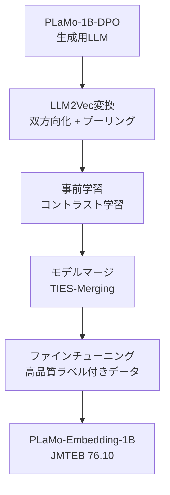

本記事は [Preferred Networks Tech Blog: テキスト埋め込みモデルPLaMo-Embedding-1Bの開発](https://tech.preferred.jp/ja/blog/plamo-embedding-1b/) および [Hugging Face Model Card: pfnet/plamo-embedding-1b](https://huggingface.co/pfnet/plamo-embedding-1b) の解説記事です。

## ブログ概要（Summary）

Preferred Networks（PFN）は、日本語テキスト埋め込みモデル**PLaMo-Embedding-1B**を開発し、Apache 2.0ライセンスで公開した。同モデルは1Bパラメータでありながら、JMTEB（Japanese Massive Text Embedding Benchmark）において総合スコア76.10を記録し、2025年4月時点で日本語テキスト埋め込みモデルとしてトップクラスの性能を達成したとPFNが報告している。特にRetrievalタスクで79.94、STSタスクで83.14という高いスコアを記録しており、OpenAIの text-embedding-3-large（JMTEB 74.05）を上回るとされる。開発にはLLM2Vec変換、事前学習、モデルマージ、ファインチューニングの4段階パイプラインが採用されている。

この記事は [Zenn記事: 自社データで実践するEmbeddingモデル精度評価パイプライン構築](https://zenn.dev/0h_n0/articles/db325cb1cb2e24) の深掘りです。

## 情報源

- **種別**: 企業テックブログ
- **URL**: [https://tech.preferred.jp/ja/blog/plamo-embedding-1b/](https://tech.preferred.jp/ja/blog/plamo-embedding-1b/)
- **組織**: Preferred Networks, Inc.
- **発表日**: 2025年4月（Hugging Faceでのモデル公開時期）
- **モデル**: [pfnet/plamo-embedding-1b](https://huggingface.co/pfnet/plamo-embedding-1b)

## 技術的背景（Technical Background）

日本語テキスト埋め込みモデルの選定において、JMTEBは標準的なベンチマークとして利用されている。しかしZenn記事でも指摘されているように、JMTEBのスコアが高いモデルが自社データで必ずしも最良とは限らない。それでもJMTEBは日本語での基礎的な埋め込み品質を示す重要な指標であり、PLaMo-Embedding-1Bがこの指標でトップクラスを達成した開発手法は、自社モデル構築の参考になる。

PLaMo-Embedding-1Bの技術的な基盤は以下の学術研究に基づいている。
- **LLM2Vec（BehnamGhader et al., 2024, arXiv:2404.05961）**: デコーダ専用LLMを双方向テキストエンコーダに変換する手法
- **TIES-Merging（Yadav et al., 2023）**: 異なるタスクで学習されたモデルの重みを効率的にマージする手法

## 実装アーキテクチャ（Architecture）

### 4段階学習パイプライン

PLaMo-Embedding-1Bの開発パイプラインは以下の4段階で構成されている。



### Stage 1: LLM2Vec変換

PLaMo-1B-DPO（対話用LLM）をテキスト埋め込みモデルに変換する。LLM2Vecは以下の2つの操作で構成される。

**1. Causal AttentionからBidirectional Attentionへの変換**

デコーダ専用LLMのCausal Attention Maskを除去し、双方向のAttentionを可能にする。

$$
\text{Attention}_{\text{causal}}(Q, K, V) = \text{softmax}\left(\frac{QK^T}{\sqrt{d_k}} + M_{\text{causal}}\right)V
$$

$$
\text{Attention}_{\text{bidirectional}}(Q, K, V) = \text{softmax}\left(\frac{QK^T}{\sqrt{d_k}}\right)V
$$

ここで、
- $Q, K, V$: Query, Key, Valueの各行列
- $d_k$: Key次元数
- $M_{\text{causal}}$: Causal Mask（下三角行列、上三角が$-\infty$）

Causal Maskを除去することで、各トークンが未来のトークンも含む全系列の情報を参照できるようになる。

**2. Weighted Mean Pooling**

双方向化されたトークン埋め込みから文レベルの埋め込みを生成する。

$$
\mathbf{e} = \frac{\sum_{i=1}^{L} w_i \cdot \mathbf{h}_i}{\sum_{i=1}^{L} w_i}
$$

ここで、
- $\mathbf{h}_i$: $i$番目のトークンの隠れ状態ベクトル
- $w_i$: トークン$i$の重み（位置ベース）
- $L$: 系列長
- $\mathbf{e}$: 文レベル埋め込み（2048次元）

### Stage 2: コントラスト事前学習

LLM2Vec変換後のモデルに対し、大量の弱教師ありデータでコントラスト学習を実施する。

$$
\mathcal{L}_{\text{pretrain}} = -\log \frac{\exp(\text{sim}(\mathbf{e}_q, \mathbf{e}_d^+) / \tau)}{\sum_{j=1}^{B} \exp(\text{sim}(\mathbf{e}_q, \mathbf{e}_{d_j}) / \tau)}
$$

ここで、
- $\mathbf{e}_q$: クエリの埋め込み
- $\mathbf{e}_d^+$: 正例文書の埋め込み
- $B$: バッチサイズ（in-batch negatives）
- $\tau$: 温度パラメータ

この段階ではin-batch negativesのみを使用し、Hard Negative Miningは行わない。大規模なバッチサイズ（数千〜数万）により十分な負例の多様性を確保する。

### Stage 3: モデルマージ（TIES-Merging）

複数のタスク（Retrieval、STS、Classification等）でそれぞれ学習されたモデルの重みをTIES-Merging手法でマージする。

$$
\theta_{\text{merged}} = \theta_{\text{base}} + \sum_{t=1}^{T} \alpha_t \cdot \text{TIES}(\theta_t - \theta_{\text{base}})
$$

ここで、
- $\theta_{\text{base}}$: Stage 2終了時のベースモデルの重み
- $\theta_t$: タスク$t$でファインチューニングされたモデルの重み
- $\alpha_t$: タスク$t$のマージ係数
- $\text{TIES}(\cdot)$: Trim, Elect Sign, Disjoint Merge操作

TIES-Mergingの利点は、タスク間で矛盾する重み更新を自動的に解消する点にある。単純な線形マージ（$\theta_{\text{merged}} = \frac{1}{T}\sum_t \theta_t$）と比較して、タスク間の干渉（Task Interference）を軽減できる。

### Stage 4: ファインチューニング

マージ後のモデルに対し、高品質なラベル付きデータで最終ファインチューニングを実施する。Hard Negative Miningを導入し、検索精度の最終的な改善を行う。

### 使用方法

```python
import torch
import torch.nn.functional as F
from transformers import AutoModel, AutoTokenizer

tokenizer = AutoTokenizer.from_pretrained(
    "pfnet/plamo-embedding-1b", trust_remote_code=True
)
model = AutoModel.from_pretrained(
    "pfnet/plamo-embedding-1b", trust_remote_code=True
)
device = "cuda" if torch.cuda.is_available() else "cpu"
model = model.to(device)

# クエリと文書で異なるエンコードメソッドを使用
query = "Embeddingモデルの評価方法は？"
documents = [
    "JMTEBはテキスト埋め込みの日本語ベンチマークです。",
    "今日の天気は晴れです。"
]

with torch.inference_mode():
    query_emb = model.encode_query(query, tokenizer)
    doc_embs = model.encode_document(documents, tokenizer)

similarities = F.cosine_similarity(query_emb, doc_embs)
print(similarities)  # tensor([0.88, 0.55])
```

**注意**: `encode_query` と `encode_document` を区別して使用することが推奨されている。検索タスクではクエリに `encode_query` を、文書に `encode_document` を使用する。非検索タスク（STS、Classification等）ではすべて `encode_document` を使用する。

## Production Deployment Guide

### AWS実装パターン（コスト最適化重視）

PLaMo-Embedding-1Bは1Bパラメータであり、Apache 2.0ライセンスのため自前推論が可能である。

**トラフィック量別の推奨構成**:

| 規模 | 月間リクエスト | 推奨構成 | 月額コスト | 主要サービス |
|------|--------------|---------|-----------|------------|
| **Small** | ~3,000（100/日） | Serverless | $30-100 | Lambda + S3（CPUでも推論可能） |
| **Medium** | ~30,000（1,000/日） | Hybrid | $200-500 | ECS Fargate + ElastiCache |
| **Large** | 300,000+（10,000/日） | Container | $800-2,000 | EKS + GPU Spot |

**Small構成のコスト優位性**: PLaMo-Embedding-1Bは1Bパラメータのため、CPU推論でもレイテンシ200-500ms程度で動作する。GPUが不要であるため、Lambda（ARM64 Graviton3）での推論が可能であり、Voyage APIやOpenAI API使用時と比較してAPI課金が不要である。

**コスト試算の注意事項**:
- 上記は2026年2月時点のAWS ap-northeast-1（東京）リージョン料金に基づく概算値です
- PLaMo-Embedding-1BはApache 2.0ライセンスのためAPI料金不要（自前推論）
- 最新料金は [AWS料金計算ツール](https://calculator.aws/) で確認してください

### Terraformインフラコード

**Small構成（Serverless）: Lambda + S3**

```hcl
resource "aws_s3_bucket" "model_artifacts" {
  bucket = "plamo-embedding-model"
}

resource "aws_lambda_function" "plamo_embedding" {
  filename      = "plamo_lambda.zip"
  function_name = "plamo-embedding-handler"
  role          = aws_iam_role.plamo_lambda.arn
  handler       = "handler.embed"
  runtime       = "python3.12"
  timeout       = 120
  memory_size   = 4096
  architectures = ["arm64"]

  environment {
    variables = {
      MODEL_BUCKET = aws_s3_bucket.model_artifacts.id
      MODEL_NAME   = "pfnet/plamo-embedding-1b"
      MAX_SEQ_LEN  = "1024"
    }
  }
}

resource "aws_iam_role" "plamo_lambda" {
  name = "plamo-embedding-lambda-role"
  assume_role_policy = jsonencode({
    Version = "2012-10-17"
    Statement = [{
      Action    = "sts:AssumeRole"
      Effect    = "Allow"
      Principal = { Service = "lambda.amazonaws.com" }
    }]
  })
}

resource "aws_cloudwatch_metric_alarm" "plamo_latency" {
  alarm_name          = "plamo-embedding-latency"
  comparison_operator = "GreaterThanThreshold"
  evaluation_periods  = 3
  metric_name         = "Duration"
  namespace           = "AWS/Lambda"
  period              = 300
  statistic           = "p99"
  threshold           = 5000
  alarm_description   = "PLaMo推論レイテンシP99が5秒超過"

  dimensions = {
    FunctionName = aws_lambda_function.plamo_embedding.function_name
  }
}
```

### セキュリティベストプラクティス

- **モデルアーティファクト**: S3 KMS暗号化で保存
- **Lambda**: VPC配置、最小権限IAMロール
- **ネットワーク**: プライベートサブネット内で推論、パブリックアクセス不要
- **監査**: CloudTrail有効化

### コスト最適化チェックリスト

- [ ] Apache 2.0ライセンスのためAPI料金不要（自前推論）
- [ ] CPU推論（Lambda ARM64）でGPU不要（Small〜Medium規模）
- [ ] 文脈長1024トークンで評価（訓練データと一致）
- [ ] 推論結果キャッシュ（ElastiCache/DynamoDB）で重複計算回避
- [ ] AWS Budgets: 月額予算設定
- [ ] Spot Instances: Large規模ではGPU Spot活用

## パフォーマンス最適化（Performance）

### JMTEBベンチマーク結果

Hugging Faceモデルカードの報告に基づくJMTEBスコアを以下に示す。

| モデル | 総合 | Retrieval | STS | Classification | Reranking | Clustering | PairClassification |
|--------|------|-----------|-----|---------------|-----------|------------|-------------------|
| **PLaMo-Embedding-1B** | **76.10** | **79.94** | **83.14** | 77.20 | 93.57 | 53.47 | 62.37 |
| Sarashina-Embedding-v1-1B | 75.50 | 77.61 | 82.71 | 78.37 | 93.74 | 53.86 | 62.00 |
| cl-nagoya/ruri-large-v2 | 74.55 | 76.34 | 83.17 | 77.18 | 93.21 | 52.14 | 62.27 |
| OpenAI/text-embedding-3-large | 74.05 | 74.48 | 82.52 | 77.58 | 93.58 | 53.32 | 62.35 |

（出典: Hugging Face Model Card pfnet/plamo-embedding-1b、評価時の文脈長1024トークン）

**分析**: PLaMo-Embedding-1BはRetrievalとSTSで他モデルを上回っている一方、Classificationでは Sarashina-Embedding-v1-1B に、Clusteringでも若干劣る。Zenn記事で紹介した `InformationRetrievalEvaluator` での自社データ評価により、自社ドメインでどのタスク特性が重要かを見極めることが推奨される。

### コスト効率

1Bパラメータモデルの利点は推論コストの低さにある。

| モデル | パラメータ数 | GPU推論要否 | API料金 |
|--------|-----------|-----------|---------|
| PLaMo-Embedding-1B | 1B | 不要（CPU可） | 無料（Apache 2.0） |
| Qwen3-Embedding-8B | 8B | 必要 | 無料（Apache 2.0） |
| Voyage 4-large | 非公開 | N/A（API） | 従量課金 |
| OpenAI text-embedding-3-large | 非公開 | N/A（API） | 従量課金 |

## 運用での学び（Production Lessons）

**文脈長の制限**: PLaMo-Embedding-1Bの最大文脈長は4096トークンだが、訓練データが1024トークンで構成されているため、**評価も1024トークンで行うことが推奨**される。長文書を処理する場合はチャンク分割が必要であり、Zenn記事で述べられているチャンク戦略の見直しが実運用では重要となる。

**encode_query vs encode_document**: Voyage 4と同様に、PLaMo-Embedding-1Bもクエリと文書で異なるエンコードメソッドを持つ。検索タスクでは必ず適切なメソッドを使用すること。

## 学術研究との関連（Academic Connection）

- **LLM2Vec（BehnamGhader et al., 2024, arXiv:2404.05961）**: デコーダ専用LLMを双方向テキストエンコーダに変換する手法。PLaMo-Embedding-1Bの基盤技術
- **TIES-Merging（Yadav et al., 2023, arXiv:2306.01708）**: タスク間干渉を軽減するモデルマージ手法。複数タスクの重みを効率的に統合
- **JMTEB（日本語MTEB）**: 日本語テキスト埋め込みの標準ベンチマーク。6タスク・複数データセットで構成

## まとめと実践への示唆

PLaMo-Embedding-1Bは、1Bパラメータという効率的なモデルサイズでJMTEBトップクラスの性能を達成した。LLM2Vec変換とTIES-Mergingの組み合わせは、既存のLLMをテキスト埋め込みモデルに転用する実践的なアプローチとして参考になる。Apache 2.0ライセンスでの公開により、自前推論環境でのAPI料金不要な運用が可能であり、特にコスト重視の日本語RAGシステムにおいて有力な選択肢となる。Zenn記事の評価パイプラインを使用して、自社データでのRetrievalスコアを実測し、8Bモデル（Qwen3-Embedding-8B等）とのコスト対精度のトレードオフを評価することが推奨される。

## 参考文献

- **Tech Blog**: [https://tech.preferred.jp/ja/blog/plamo-embedding-1b/](https://tech.preferred.jp/ja/blog/plamo-embedding-1b/)
- **Hugging Face**: [https://huggingface.co/pfnet/plamo-embedding-1b](https://huggingface.co/pfnet/plamo-embedding-1b)
- **LLM2Vec**: [arXiv:2404.05961](https://arxiv.org/abs/2404.05961)
- **TIES-Merging**: [arXiv:2306.01708](https://arxiv.org/abs/2306.01708)
- **Related Zenn article**: [https://zenn.dev/0h_n0/articles/db325cb1cb2e24](https://zenn.dev/0h_n0/articles/db325cb1cb2e24)
