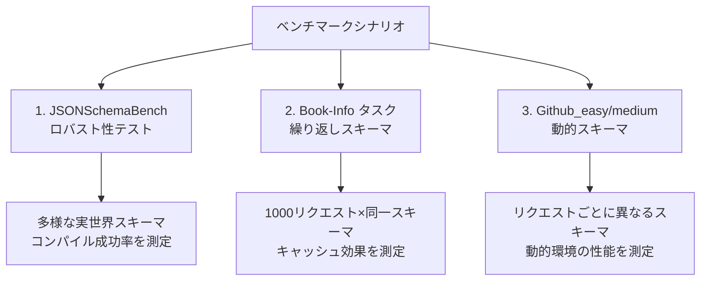
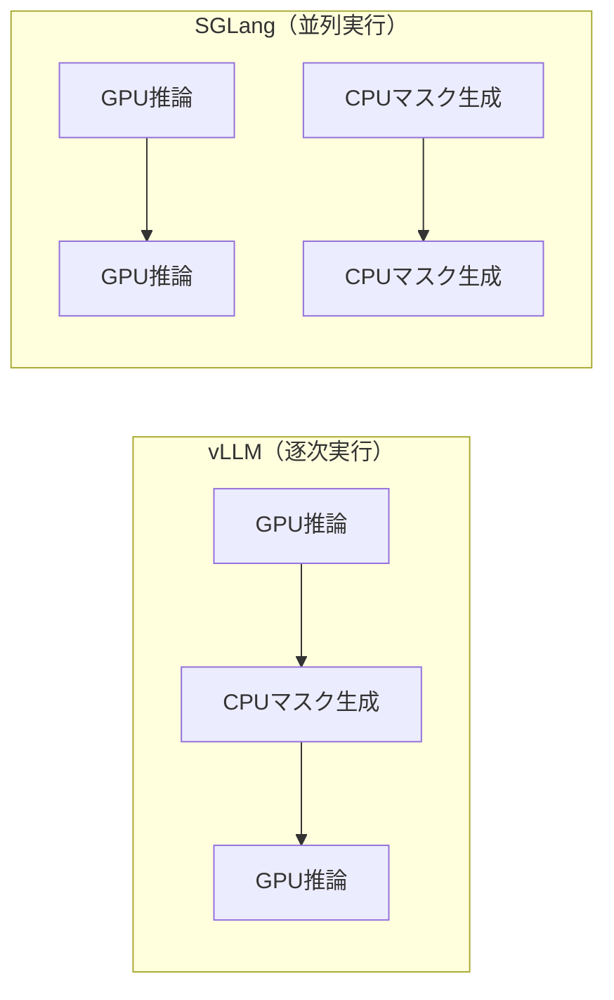

本記事は [Guided Decoding Performance on vLLM and SGLang (SqueezeBits Tech Blog)](https://blog.squeezebits.com/guided-decoding-performance-vllm-sglang) の解説記事です。

## ブログ概要（Summary）

SqueezeBitsは、LLM推論の最適化に特化した企業である。本ブログ記事では、構造化出力の2大文法バックエンド（**llguidance**と**XGrammar**）を、2大推論フレームワーク（**vLLM**と**SGLang**）上で体系的にベンチマークした結果を報告している。NVIDIA H100 80GB上でQwen3-8BおよびQwen3-32Bを用いた実験から、「フレームワークのアーキテクチャが文法バックエンドの選択以上に性能に影響する」という知見が示されている。

この記事は [Zenn記事: Guidance 0.3×llguidance実践ガイド：vLLM/SGLang連携で本番運用](https://zenn.dev/0h_n0/articles/98fc937127592e) の深掘りです。

## 情報源

- **種別**: 企業テックブログ
- **URL**: [https://blog.squeezebits.com/guided-decoding-performance-vllm-sglang](https://blog.squeezebits.com/guided-decoding-performance-vllm-sglang)
- **組織**: SqueezeBits（LLM推論最適化企業）
- **発表日**: 2025年

## 技術的背景（Technical Background）

構造化出力（Structured Output）は、LLMの出力をJSON Schema等の形式に制約する技術で、エージェントアプリケーションやAPI統合で不可欠である。この制約は「制約付きデコーディング（Guided Decoding）」とも呼ばれ、各デコードステップで有効なトークンのみを選択可能にするトークンマスクを生成する。

制約付きデコーディングには2つの主要な文法バックエンドがある。

- **XGrammar**: 語彙を文脈非依存/文脈依存トークンに分割し、前者を事前計算・キャッシュ。繰り返しスキーマで高速
- **llguidance**: Earleyパーサーベースの遅延コンパイル。新規スキーマへの適応が高速

これらのバックエンドは、vLLMとSGLangという2つの推論フレームワーク上で動作するが、フレームワークのアーキテクチャが構造化出力の性能に与える影響は十分に調査されていなかった。

## 実装アーキテクチャ（Architecture）

### ベンチマーク環境

SqueezeBitsが使用した実験環境は以下の通りである。

| 項目 | 仕様 |
|------|------|
| CPU | Intel Xeon Platinum 8480+ |
| GPU | NVIDIA H100 80GB |
| モデル | Qwen3-8B, Qwen3-32B (TP2) |
| vLLM | v0.10.0 |
| SGLang | v0.5.0rc0 |
| XGrammar | v0.1.21 |
| llguidance | v0.7.30 |

### テストシナリオの設計

SqueezeBitsは3種類のテストシナリオを設計した。



**1. JSONSchemaBench（ロバスト性テスト）**: 多様な実世界JSON Schemaでの文法コンパイル成功率を測定

**2. Book-Infoタスク（繰り返しスキーマ）**: 1,000リクエストすべてが同一の書籍メタデータスキーマを使用。キャッシュの効果を最大限に検証

**3. Github_easy/medium（動的スキーマ）**: JSONSchemaBenchから抽出した、リクエストごとに異なるスキーマを使用。実務で頻繁に発生するマルチテナント環境を模擬

### フレームワークアーキテクチャの違い

vLLMとSGLangの構造化出力処理の根本的な違いは、CPU文法処理とGPU推論の実行モデルにある。



- **vLLM**: GPU推論とCPU文法処理を逐次的に実行。文法処理がクリティカルパスに含まれるため、バッチサイズ増加時にスループットが低下する
- **SGLang**: CPU文法処理をGPU推論と並列に実行。文法処理の大部分がGPU推論の裏に隠れるため、オーバーヘッドが最小化される

## パフォーマンス最適化（Performance）

### 文法コンパイルのロバスト性

JSONSchemaBenchでの文法コンパイル結果をSqueezeBitsは以下のように報告している。

**llguidance**:
- タイムアウト: 0件（全スキーマでコンパイル完了）
- コンパイル失敗: XGrammarより多い（一部の複雑なスキーマ構造で）

**XGrammar**:
- タイムアウト: 複雑なスキーマで発生
- コンパイル成功率: 初期段階ではllguidanceより高いが、vLLM統合フィルタにより一部スキーマが除外される

### 繰り返しスキーマ（Book-Infoタスク）での性能

制約なし生成では正答率（スキーマ準拠率）が72%を超えなかったのに対し、両バックエンドとも制約付きで100%を達成した。

スループットについては、XGrammarがllguidanceを一貫して上回ったとSqueezeBitsは報告している。これはXGrammarの事前計算キャッシュが同一スキーマの繰り返しで効果を発揮するためである。

### 動的スキーマ（Github_easy/medium）での性能

**Github_easy結果**:
- 制約なし生成: スキーマ準拠率 90-94%
- 制約付き生成: 96-98.2%（4-8ポイント改善）
- llguidanceがXGrammarを上回った。キャッシュが効かない環境では遅延コンパイルの方が効率的

**Github_medium結果**:
- 制約なし生成: スキーマ準拠率 61.1%に低下
- 制約付き生成: 20-25ポイント改善
- llguidanceは安定したスループットを維持。XGrammarはCPUボトルネックによるスループットの不安定化（ストール）が観測された

### フレームワーク選択の影響

SqueezeBitsのベンチマークで最も重要な知見は、**フレームワークのアーキテクチャが文法バックエンドの選択以上に性能に影響する**という点である。

- SGLangはCPU-GPU並列処理により、構造化出力のスループットオーバーヘッドをベースラインに対しほぼゼロに抑えた
- vLLMはバッチサイズ8以上で顕著なスループット低下を示した。逐次的なCPU文法処理がクリティカルパスのボトルネックとなっている

## Production Deployment Guide

### AWS実装パターン（コスト最適化重視）

SqueezeBitsのベンチマーク知見に基づく推論サーバーのAWS構成を示す。

**トラフィック量別の推奨構成**:

| 規模 | 月間リクエスト | 推奨構成 | 月額コスト | 主要サービス |
|------|--------------|---------|-----------|------------|
| **Small** | ~3,000 (100/日) | Serverless | $50-150 | Lambda + Bedrock |
| **Medium** | ~30,000 (1,000/日) | Hybrid | $300-800 | ECS Fargate + SGLang |
| **Large** | 300,000+ (10,000/日) | Container | $2,000-5,000 | EKS + SGLang + GPU Spot |

**ベンチマーク知見に基づく構成選択**:
- SGLangのCPU-GPU並列アーキテクチャがスループットに優れるため、Medium以上ではSGLangを推奨
- 動的スキーマワークロード → llguidanceバックエンドを選択
- 固定スキーマワークロード → XGrammarバックエンドを選択

**コスト削減テクニック**:
- SGLangのRadixAttentionにより同一スキーマのKVキャッシュ再利用で推論コスト削減
- GPU Spot Instances使用で最大90%削減
- ワークロードに応じたバックエンド自動選択ロジック（固定→XGrammar、動的→llguidance）

**コスト試算の注意事項**:
上記は2026年2月時点のAWS ap-northeast-1（東京）リージョン料金に基づく概算値です。最新料金は[AWS料金計算ツール](https://calculator.aws/)で確認してください。

### Terraformインフラコード

**Medium構成: ECS Fargate + SGLang**

```hcl
module "vpc" {
  source  = "terraform-aws-modules/vpc/aws"
  version = "~> 5.0"

  name = "sglang-inference-vpc"
  cidr = "10.0.0.0/16"
  azs  = ["ap-northeast-1a", "ap-northeast-1c"]
  private_subnets = ["10.0.1.0/24", "10.0.2.0/24"]
  public_subnets  = ["10.0.101.0/24", "10.0.102.0/24"]

  enable_nat_gateway = true
  single_nat_gateway = true
}

resource "aws_ecs_task_definition" "sglang" {
  family                   = "sglang-inference"
  requires_compatibilities = ["FARGATE"]
  network_mode             = "awsvpc"
  cpu                      = 4096
  memory                   = 16384

  container_definitions = jsonencode([{
    name  = "sglang-server"
    image = "your-registry/sglang-server:latest"
    portMappings = [{
      containerPort = 30000
      protocol      = "tcp"
    }]
    environment = [
      { name = "MODEL_PATH", value = "Qwen/Qwen3-8B" },
      { name = "GRAMMAR_BACKEND", value = "llguidance" }
    ]
  }])
}

resource "aws_lb" "sglang" {
  name               = "sglang-alb"
  internal           = false
  load_balancer_type = "application"
  subnets            = module.vpc.public_subnets
}
```

### 運用・監視設定

```python
import boto3

cloudwatch = boto3.client('cloudwatch')

# 構造化出力スループット監視
cloudwatch.put_metric_alarm(
    AlarmName='structured-output-throughput-drop',
    ComparisonOperator='LessThanThreshold',
    EvaluationPeriods=2,
    MetricName='RequestsPerSecond',
    Namespace='SGLang/Inference',
    Period=300,
    Statistic='Average',
    Threshold=10,
    AlarmDescription='構造化出力スループットが10 req/s未満に低下'
)

# CPUボトルネック検知（XGrammarストール検知）
cloudwatch.put_metric_alarm(
    AlarmName='cpu-grammar-bottleneck',
    ComparisonOperator='GreaterThanThreshold',
    EvaluationPeriods=3,
    MetricName='CPUUtilization',
    Namespace='AWS/ECS',
    Period=60,
    Statistic='Average',
    Threshold=90,
    AlarmDescription='CPU使用率90%超過（文法処理ボトルネックの可能性）'
)
```

### コスト最適化チェックリスト

- [ ] フレームワーク選択: SGLang推奨（CPU-GPU並列でオーバーヘッド最小）
- [ ] バックエンド自動選択: 固定スキーマ→XGrammar、動的スキーマ→llguidance
- [ ] GPU Spot: Karpenter/Fargate Spotで最大90%削減
- [ ] RadixAttention活用: 同一プロンプトパターンのKVキャッシュ再利用
- [ ] バッチサイズ制御: vLLM使用時は8以下に制限（SqueezeBitsの知見）
- [ ] AWS Budgets: 月額上限設定
- [ ] CloudWatch: スループット・CPU使用率・レイテンシ監視

## 運用での学び（Production Lessons）

SqueezeBitsのベンチマークから得られる本番運用への示唆は以下の通りである。

**障害パターン: CPUボトルネックによるストール**
- XGrammarがGithub_mediumデータセットで不安定な性能を示した。CPUでの文法処理がGPU推論を上回る時間を要すると、パイプラインが停滞する
- 対策: SGLangの並列アーキテクチャを採用するか、vLLMではバッチサイズを制限する

**モニタリング戦略**
- スキーマコンパイル成功率: 動的スキーマ環境では特に重要。コンパイル失敗はフォールバック（制約なし生成）が必要
- スキーマ準拠率: 制約なし生成のGithub_medium準拠率61.1%は、制約付きデコーディングの価値を示す定量的根拠

**キャッシュ戦略の設計**
- XGrammarのキャッシュは同一スキーマの繰り返しで有効だが、マルチテナント環境ではキャッシュミスが頻発する
- llguidanceの遅延コンパイルはキャッシュ非依存であり、動的環境での安定性に優れる

## 学術研究との関連（Academic Connection）

- **JSONSchemaBench (arXiv:2501.10868)**: SqueezeBitsのベンチマークデータセットの一部にJSONSchemaBenchが使用されている。JSONSchemaBenchのスキーマ分類（Easy/Medium/Hard）がベンチマーク設計の基盤
- **XGrammar (arXiv:2411.15100)**: 語彙分割+キャッシュの手法。SqueezeBitsの実験で繰り返しスキーマでの優位性を確認
- **SGLang (arXiv:2312.07104)**: RadixAttentionとCompressed FSMの論文。SqueezeBitsの実験でCPU-GPU並列アーキテクチャの優位性を実証

## まとめと実践への示唆

SqueezeBitsのベンチマークは、構造化出力の本番運用において「フレームワークのアーキテクチャ選択が最も重要」という実践的な知見を提供している。SGLangのCPU-GPU並列処理はvLLMの逐次処理に対して構造的な優位性を持ち、特にバッチサイズ8以上の本番ワークロードでは明確なスループット差が生じる。文法バックエンドの選択は「固定スキーマ→XGrammar」「動的スキーマ→llguidance」というワークロード特性に基づいた判断が推奨される。

## 参考文献

- **Blog URL**: [https://blog.squeezebits.com/guided-decoding-performance-vllm-sglang](https://blog.squeezebits.com/guided-decoding-performance-vllm-sglang)
- **Related Papers**: JSONSchemaBench [https://arxiv.org/abs/2501.10868](https://arxiv.org/abs/2501.10868)
- **Related Zenn article**: [https://zenn.dev/0h_n0/articles/98fc937127592e](https://zenn.dev/0h_n0/articles/98fc937127592e)

---

:::message
この記事はAI（Claude Code）により自動生成されました。内容の正確性についてはブログの記載に基づいていますが、最新の情報は公式ブログおよび各フレームワークのドキュメントをご確認ください。
:::
