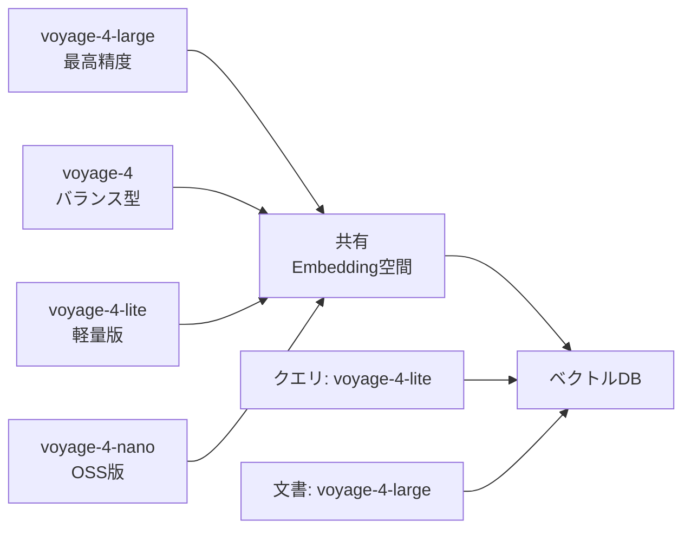

本記事は [Voyage AI Blog: The Voyage 4 model family: shared embedding space with MoE architecture](https://blog.voyageai.com/2026/01/15/voyage-4/) の解説記事です。

## ブログ概要（Summary）

Voyage AIは2026年1月にVoyage 4シリーズを発表した。同シリーズは**業界初の共有Embedding空間**を実現し、異なるサイズのモデル間で互換性のある埋め込みベクトルを生成できる。フラッグシップモデルのvoyage-4-largeはMixture-of-Experts（MoE）アーキテクチャを採用し、Voyage AIの報告によると同等品質の密なモデルと比較してサービングコストが40%低いとされる。RTEBの29データセットにおいてGemini Embedding 001、Cohere Embed v4、OpenAI v3 Largeを平均8〜14%上回る精度を記録したと報告されている。

この記事は [Zenn記事: 自社データで実践するEmbeddingモデル精度評価パイプライン構築](https://zenn.dev/0h_n0/articles/db325cb1cb2e24) の深掘りです。

## 情報源

- **種別**: 企業テックブログ
- **URL**: [https://blog.voyageai.com/2026/01/15/voyage-4/](https://blog.voyageai.com/2026/01/15/voyage-4/)
- **組織**: Voyage AI
- **発表日**: 2026年1月15日

## 技術的背景（Technical Background）

テキスト埋め込みモデルは、RAGシステムのセマンティック検索やベクトルデータベースの基盤として利用が拡大している。モデル選定においては精度・レイテンシ・コストのトレードオフが常に課題となる。特に大規模モデルは高精度だがコストが高く、小規模モデルはコスト効率が良いが精度が劣るという二律背反がある。

Voyage 4シリーズは、この課題に対してMoEアーキテクチャと共有Embedding空間という2つのアプローチで解決を試みている。MoEにより計算コストを抑えつつ高精度を実現し、共有Embedding空間によりモデルサイズを用途に応じて柔軟に選択可能としている。

学術的には以下の研究に基づく。
- **MoE（Shazeer et al., 2017）**: Mixture-of-Expertsによるスパース計算の基礎
- **Matryoshka Representation Learning（Kusupati et al., 2022, arXiv:2205.13147）**: 可変次元数での表現学習

## 実装アーキテクチャ（Architecture）

### MoE（Mixture-of-Experts）アーキテクチャ

voyage-4-largeは、Embeddingモデルとして初めてMoEアーキテクチャを本番採用した製品である。MoEの基本的な仕組みを以下に示す。

従来の密なモデル（Dense Model）では、入力トークンすべてに対してモデルの全パラメータが活性化する。MoEでは、ゲーティングネットワークが各入力に対して少数のエキスパートのみを選択的に活性化する。

$$
\text{MoE}(x) = \sum_{i=1}^{N} g_i(x) \cdot E_i(x)
$$

ここで、
- $x$: 入力ベクトル
- $N$: エキスパートの総数
- $E_i(x)$: $i$番目のエキスパートネットワークの出力
- $g_i(x)$: ゲーティング関数の出力（$i$番目のエキスパートの重み）

ゲーティング関数は通常、Top-K選択を行う。

$$
g(x) = \text{Top-K}(\text{softmax}(W_g \cdot x))
$$

ここで、$W_g$ はゲーティングネットワークの重み行列、Top-Kは上位K個のエキスパートのみを活性化する関数である。

**コスト効率の仕組み**: MoEモデルの総パラメータ数は密なモデルより大きいが、推論時に活性化するパラメータ数（Active Parameters）は少ない。Voyage AIの報告では、voyage-4-largeは同等品質の密なモデル比でサービングコストが40%低いとされる。これは、推論時に全エキスパートの一部のみが計算に使用されるためである。

### 共有Embedding空間

Voyage 4シリーズの最大の特徴は、4つのモデルバリアントが**互換性のある埋め込みベクトルを生成**する点にある。



**非対称検索（Asymmetric Retrieval）**: 文書の埋め込みにはvoyage-4-large（高精度）を使用し、クエリの埋め込みにはvoyage-4-lite（低コスト）を使用する、といった組み合わせが可能となる。文書埋め込みは事前計算してキャッシュ可能であるため高精度モデルのコストは初回のみで、クエリは低コストモデルでリアルタイム処理できる。

### Matryoshka表現学習と量子化

Voyage 4は**Matryoshka Representation Learning（MRL）**を採用し、単一モデルから複数の次元数（2048, 1024, 512, 256）で埋め込みベクトルを生成できる。

MRLの学習は、損失関数を複数の次元数で同時に最適化する。

$$
\mathcal{L}_{\text{MRL}} = \sum_{d \in \{256, 512, 1024, 2048\}} \lambda_d \cdot \mathcal{L}_{\text{contrastive}}(f_d(x))
$$

ここで、
- $f_d(x)$: 入力$x$の先頭$d$次元を切り出した埋め込み
- $\mathcal{L}_{\text{contrastive}}$: コントラスト損失（InfoNCEなど）
- $\lambda_d$: 次元数$d$に対する重み係数

さらに、量子化オプションとして以下をサポートしている。
- 32-bit floating point（高精度）
- Signed / Unsigned 8-bit integer（ストレージ4分の1）
- Binary precision（ストレージ32分の1）

### モデルバリアント比較

ブログの記載に基づくVoyage 4シリーズのモデル比較を以下に示す。

| モデル | アーキテクチャ | 最大トークン | 次元数 | 精度水準（ブログ記載） | 公開形態 |
|--------|------------|-----------|--------|---------------------|---------|
| **voyage-4-large** | MoE | 32,000 | 最大2048 | RTEBで1位 | API |
| **voyage-4** | Dense | 32,000 | 最大2048 | voyage-3-large相当 | API |
| **voyage-4-lite** | Dense | 32,000 | 最大2048 | voyage-3.5相当 | API |
| **voyage-4-nano** | Dense | 32,000 | 最大2048 | 開発用 | Apache 2.0（HuggingFace） |

### input_typeパラメータ

Zenn記事でも注意点として記載されているが、Voyage 4のAPIではクエリと文書を区別する `input_type` パラメータが重要である。

```python
import voyageai

client = voyageai.Client()

# クエリ埋め込み: input_type="query"
query_embs = client.embed(
    ["Embeddingモデルの評価方法は？"],
    model="voyage-4-large",
    input_type="query"
).embeddings

# 文書埋め込み: input_type="document"
doc_embs = client.embed(
    ["MTEBはテキスト埋め込みの標準ベンチマークです。"],
    model="voyage-4-large",
    input_type="document"
).embeddings
```

**注意**: `input_type` を省略するか、両方に同じ値を使用すると非対称検索の精度が低下する。ブログの報告では、`input_type` の適切な使用により検索精度が有意に改善するとされている。

## Production Deployment Guide

### AWS実装パターン（コスト最適化重視）

Voyage 4を用いたRAG検索パイプラインのAWS構成を示す。

**トラフィック量別の推奨構成**:

| 規模 | 月間リクエスト | 推奨構成 | 月額コスト | 主要サービス |
|------|--------------|---------|-----------|------------|
| **Small** | ~3,000（100/日） | Serverless | $80-200 | Lambda + Voyage API + DynamoDB |
| **Medium** | ~30,000（1,000/日） | Hybrid | $400-1,000 | ECS Fargate + Voyage API + ElastiCache |
| **Large** | 300,000+（10,000/日） | Container | $2,500-6,000 | EKS + voyage-4-nano自前推論 + S3 |

**Small構成の詳細**（月額$80-200）:
- **Lambda**: 1GB RAM、60秒タイムアウト（$20/月）
- **Voyage API**: 200M無料トークン + 従量課金（$50-120/月）
- **DynamoDB**: On-Demand埋め込みキャッシュ（$10/月）
- **API Gateway**: REST API（$5/月）

**コスト削減テクニック**:
- 共有Embedding空間を活用：文書はvoyage-4-large（高精度・初回のみ）、クエリはvoyage-4-lite（低コスト・リアルタイム）
- Matryoshka次元削減：512次元でも多くのタスクで十分な精度を維持（ストレージ50%削減）
- 量子化：int8でストレージ75%削減、Binary Precisionで97%削減
- DynamoDB TTLで埋め込みキャッシュの自動期限管理

**コスト試算の注意事項**:
- 上記は2026年2月時点のAWS ap-northeast-1（東京）リージョン料金に基づく概算値です
- Voyage API料金は [Voyage AI公式サイト](https://www.voyageai.com/) で最新情報を確認してください
- Large構成ではvoyage-4-nano（Apache 2.0）の自前推論でAPI料金を削減可能です

### Terraformインフラコード

**Small構成（Serverless）: Lambda + Voyage API + DynamoDB**

```hcl
resource "aws_secretsmanager_secret" "voyage_api_key" {
  name = "voyage-api-key"
}

resource "aws_iam_role" "voyage_lambda" {
  name = "voyage-embedding-lambda-role"
  assume_role_policy = jsonencode({
    Version = "2012-10-17"
    Statement = [{
      Action    = "sts:AssumeRole"
      Effect    = "Allow"
      Principal = { Service = "lambda.amazonaws.com" }
    }]
  })
}

resource "aws_iam_role_policy" "voyage_secrets" {
  role = aws_iam_role.voyage_lambda.id
  policy = jsonencode({
    Version = "2012-10-17"
    Statement = [{
      Effect   = "Allow"
      Action   = ["secretsmanager:GetSecretValue"]
      Resource = aws_secretsmanager_secret.voyage_api_key.arn
    }]
  })
}

resource "aws_lambda_function" "voyage_embedding" {
  filename      = "voyage_lambda.zip"
  function_name = "voyage-embedding-handler"
  role          = aws_iam_role.voyage_lambda.arn
  handler       = "handler.embed"
  runtime       = "python3.12"
  timeout       = 60
  memory_size   = 1024

  environment {
    variables = {
      VOYAGE_SECRET_ARN     = aws_secretsmanager_secret.voyage_api_key.arn
      QUERY_MODEL           = "voyage-4-lite"
      DOCUMENT_MODEL        = "voyage-4-large"
      EMBEDDING_DIMENSIONS  = "1024"
      CACHE_TABLE           = aws_dynamodb_table.embedding_cache.name
    }
  }
}

resource "aws_dynamodb_table" "embedding_cache" {
  name         = "voyage-embedding-cache"
  billing_mode = "PAY_PER_REQUEST"
  hash_key     = "text_hash"

  attribute {
    name = "text_hash"
    type = "S"
  }

  ttl {
    attribute_name = "expire_at"
    enabled        = true
  }
}
```

### セキュリティベストプラクティス

- **APIキー管理**: Voyage APIキーはSecrets Managerに保存、環境変数ハードコード禁止
- **ネットワーク**: Lambda VPC配置、NAT Gateway経由でVoyage APIにアクセス
- **暗号化**: DynamoDB保管時暗号化、S3 KMS暗号化を有効化
- **監査**: CloudTrail有効化、API呼び出しログの長期保存

### 運用・監視設定

```python
import boto3

cloudwatch = boto3.client('cloudwatch')
cloudwatch.put_metric_alarm(
    AlarmName='voyage-api-token-spike',
    ComparisonOperator='GreaterThanThreshold',
    EvaluationPeriods=1,
    MetricName='VoyageTokenUsage',
    Namespace='Embedding/VoyageAPI',
    Period=3600,
    Statistic='Sum',
    Threshold=1000000,
    AlarmDescription='Voyage APIトークン使用量が100万/時間超過'
)
```

### コスト最適化チェックリスト

- [ ] 共有Embedding空間活用: 文書=voyage-4-large、クエリ=voyage-4-lite
- [ ] Matryoshka次元削減: 512次元で十分か評価（ストレージ50%削減）
- [ ] 量子化: int8でストレージ75%削減
- [ ] DynamoDB TTLでキャッシュ自動管理
- [ ] Large規模ではvoyage-4-nano自前推論を検討（API料金$0）
- [ ] AWS Budgets: 月額予算設定
- [ ] Cost Anomaly Detection: 自動異常検知

## パフォーマンス最適化（Performance）

ブログの報告に基づくVoyage 4-largeのベンチマーク結果を以下に示す。

**RTEBベンチマーク（29データセット）**:

Voyage AIの報告によると、voyage-4-largeは29のRTEBデータセットにおいて以下のモデルを平均8〜14%上回る精度を記録した。
- Gemini Embedding 001（Google）
- Cohere Embed v4
- OpenAI text-embedding-3-large

**Matryoshka次元削減の精度影響**:

| 次元数 | ストレージ比 | 精度影響（ブログ記載の傾向） |
|--------|-----------|------------------------|
| 2048 | 100% | 最高精度（ベースライン） |
| 1024 | 50% | 微小な精度低下 |
| 512 | 25% | 軽微な精度低下 |
| 256 | 12.5% | 一定の精度低下あり |

## 運用での学び（Production Lessons）

**共有Embedding空間の活用戦略**: 既存のベクトルDBに格納済みの文書埋め込みを再計算せずに、クエリ側のモデルのみをアップグレードまたはダウングレードできる。モデル更新時のダウンタイムとコストを大幅に削減可能である。

**量子化とMatryoshkaの組み合わせ**: 1024次元 + int8量子化で、フル精度の2048次元比でストレージを87.5%削減しつつ、多くの検索タスクで実用的な精度を維持できる。検索精度とコストのバランスは、Zenn記事で紹介した評価パイプラインで自社データ上で実測することが推奨される。

## 学術研究との関連（Academic Connection）

- **MoE基礎（Shazeer et al., 2017）**: Outrageously Large Neural Networksにおけるスパースゲーティングの提案
- **Matryoshka Representation Learning（Kusupati et al., 2022, arXiv:2205.13147）**: 入れ子構造の表現学習。先頭$d$次元で有効な埋め込みを学習する手法
- **Switch Transformer（Fedus et al., 2022）**: MoEの効率的なルーティング手法。Voyage 4のゲーティング戦略の基礎

## まとめと実践への示唆

Voyage 4はMoEアーキテクチャと共有Embedding空間という2つの技術革新により、精度・コスト・柔軟性のトレードオフに新しい解決策を提示した。特に共有Embedding空間は、文書埋め込みの再計算なしにモデルの切り替えが可能であり、運用コスト削減に直結する。Zenn記事で紹介した評価パイプラインを使用して、自社データにおけるMatryoshka次元削減や量子化の精度影響を実測し、最適な構成を選定することが推奨される。

## 参考文献

- **Blog URL**: [https://blog.voyageai.com/2026/01/15/voyage-4/](https://blog.voyageai.com/2026/01/15/voyage-4/)
- **Matryoshka RL**: [arXiv:2205.13147](https://arxiv.org/abs/2205.13147)
- **Voyage AI公式**: [https://www.voyageai.com/](https://www.voyageai.com/)
- **Related Zenn article**: [https://zenn.dev/0h_n0/articles/db325cb1cb2e24](https://zenn.dev/0h_n0/articles/db325cb1cb2e24)
