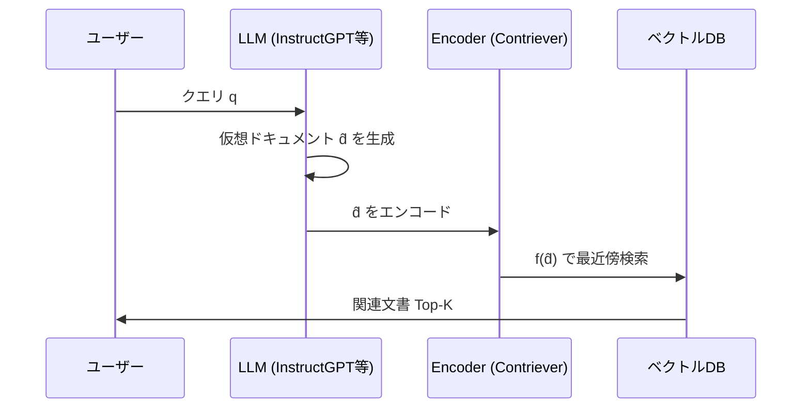

本記事は [Precise Zero-Shot Dense Retrieval without Relevance Labels (arXiv:2212.10496)](https://arxiv.org/abs/2212.10496) の解説記事です。

## 論文概要（Abstract）

HyDE（Hypothetical Document Embeddings）は、ユーザーのクエリからLLMで**仮想的な回答ドキュメント**を生成し、その仮想ドキュメントのEmbeddingをクエリベクトルとして使用するゼロショット密検索手法である。著者らは、ラベル付き学習データを一切使用せずに、ファインチューニング済みの検索モデルと同等以上の精度を達成したと報告している。BEIRベンチマーク11データセットの平均でnDCG@10 = 56.6（対Contriever: 48.2、+8.4ポイント）を達成し、ACL 2023で発表されている。

この記事は [Zenn記事: セマンティック検索精度を向上させる5つの実装テクニック](https://zenn.dev/0h_n0/articles/10d67026af2a27) の深掘りです。

## 情報源

- **arXiv ID**: 2212.10496
- **URL**: [https://arxiv.org/abs/2212.10496](https://arxiv.org/abs/2212.10496)
- **著者**: Luyu Gao, Xueguang Ma, Jimmy Lin, Jamie Callan（CMU, University of Waterloo）
- **発表年**: 2022（ACL 2023）
- **分野**: cs.CL, cs.IR

## 背景と動機（Background & Motivation）

密検索（Dense Retrieval）はDPR以降急速に発展したが、高い精度を得るには大量のラベル付きデータでファインチューニングする必要がある。MS MARCOのような大規模データセットで訓練されたモデルでも、ドメインが異なるデータ（法律、医療、科学等）では精度が大幅に低下する。これはクエリと文書の**分布ギャップ**が原因である。

クエリ（通常短い質問文）と文書（長い回答テキスト）は、同じトピックについて述べていても、使用される語彙や文体が大きく異なる。Bi-Encoderはこのギャップをクエリ-文書ペアの対比学習で埋めるが、ドメイン外では学習したギャップの埋め方が通用しない。

著者らは、**LLMが生成する仮想ドキュメントがこの分布ギャップを言語レベルで埋める**という洞察に基づいてHyDEを提案している。仮想ドキュメントは文書と同じスタイル・語彙で書かれるため、文書側Embeddingとの類似度が高くなる。

## 主要な貢献（Key Contributions）

- **貢献1**: ラベルなし（ゼロショット）でファインチューニング済みDense Retrieverと同等以上の精度を達成する手法の提案
- **貢献2**: LLMの言語生成能力を検索のクエリ側に活用するパラダイムの確立
- **貢献3**: BEIR、MS MARCO、TREC DLなど複数ベンチマークでの包括的な評価

## 技術的詳細（Technical Details）

### HyDEのパイプライン

HyDEは以下の4段階で動作する。



1. **クエリ入力**: ユーザーがクエリ $q$ を入力
2. **仮想ドキュメント生成**: LLMがクエリに対する仮想的な回答ドキュメント $\hat{d}$ を生成
3. **エンコード**: Unsupervised Dense Encoder $f(\cdot)$（例: Contriever）で $\hat{d}$ をベクトル化
4. **検索**: $f(\hat{d})$ をクエリベクトルとしてkNN検索を実行

### 数学的定式化

HyDEの検索スコアは以下のように定式化される。

$$
\text{Score}(q, d) = \text{sim}\left(f(\hat{d}), f(d)\right)
$$

ここで、
- $q$: ユーザーのクエリ
- $\hat{d} = \text{LLM}(q)$: LLMが生成した仮想ドキュメント
- $f(\cdot)$: Dense Encoder（Contriever等）
- $d$: コーパス内の実文書
- $\text{sim}(\cdot, \cdot)$: 類似度関数（コサイン類似度またはInner Product）

著者らは、複数（$N$個）の仮想ドキュメントを生成して平均化する手法も提案している。

$$
\mathbf{v}_q = \frac{1}{N} \sum_{n=1}^{N} f(\hat{d}_n)
$$

ここで $\hat{d}_n$ は $n$ 番目の仮想ドキュメントであり、複数の仮想ドキュメントの平均Embeddingを使うことで、単一ドキュメントのバイアスを軽減できる。著者らは$N=5$が精度とコストのバランスが良好であると報告している。

### なぜHyDEが機能するのか

著者らは、HyDEが機能する理由を以下のように説明している。

1. **分布ギャップの解消**: 仮想ドキュメントは文書と同じスタイルで書かれるため、Embedding空間で文書側の分布に近い位置にマッピングされる
2. **Unsupervised Encoderの活用**: Contrieverのようなunsupervisedエンコーダは、「似た文書同士が近い」という性質を持つ。HyDEはこの性質を利用し、仮想ドキュメント（疑似文書）と実文書の類似度を計算する
3. **事実性は不要**: 仮想ドキュメントに含まれる事実が正確である必要はない。重要なのは、仮想ドキュメントが正しい文書の「近傍」にマッピングされることである

### プロンプト設計

著者らは、タスクに応じた指示プロンプトを使用している。

```
Please write a passage to answer the question.
Question: {query}
Passage:
```

この簡潔なプロンプトでInstructGPT（text-davinci-003）を使用し、約150-300トークンの仮想ドキュメントを生成している。

### アルゴリズム

```python
import numpy as np
from sentence_transformers import SentenceTransformer


class HyDERetriever:
    """HyDE (Hypothetical Document Embeddings) Retriever

    LLMで仮想ドキュメントを生成し、そのEmbeddingで検索する
    ゼロショット密検索手法。

    Args:
        encoder_name: Dense Encoderモデル名
        llm_client: LLM APIクライアント
        num_hypotheses: 生成する仮想ドキュメント数
    """

    def __init__(
        self,
        encoder_name: str = "facebook/contriever-msmarco",
        llm_client: object = None,
        num_hypotheses: int = 5,
    ):
        self.encoder = SentenceTransformer(encoder_name)
        self.llm_client = llm_client
        self.num_hypotheses = num_hypotheses

    def generate_hypothetical_documents(
        self,
        query: str,
    ) -> list[str]:
        """クエリから仮想ドキュメントを生成する。

        Args:
            query: ユーザーの検索クエリ

        Returns:
            仮想ドキュメントのリスト
        """
        prompt = (
            f"Please write a passage to answer the question.\n"
            f"Question: {query}\n"
            f"Passage:"
        )
        documents = []
        for _ in range(self.num_hypotheses):
            response = self.llm_client.generate(
                prompt=prompt,
                max_tokens=256,
                temperature=0.7,  # 多様性のためtemperatureを上げる
            )
            documents.append(response.text.strip())
        return documents

    def encode_query(self, query: str) -> np.ndarray:
        """HyDEでクエリをエンコードする。

        複数の仮想ドキュメントのEmbeddingを平均化して
        クエリベクトルとする。

        Args:
            query: ユーザーの検索クエリ

        Returns:
            正規化されたクエリベクトル (dim,)
        """
        hyp_docs = self.generate_hypothetical_documents(query)
        embeddings = self.encoder.encode(
            hyp_docs, normalize_embeddings=True
        )
        # 平均化
        avg_emb = np.mean(embeddings, axis=0)
        # L2正規化
        avg_emb = avg_emb / np.linalg.norm(avg_emb)
        return avg_emb

    def search(
        self,
        query: str,
        doc_index: np.ndarray,
        top_k: int = 10,
    ) -> np.ndarray:
        """HyDEで検索を実行する。

        Args:
            query: 検索クエリ
            doc_index: 文書Embeddingインデックス (num_docs, dim)
            top_k: 返却する上位件数

        Returns:
            上位K件の文書インデックス
        """
        q_emb = self.encode_query(query)
        scores = doc_index @ q_emb
        return np.argsort(scores)[::-1][:top_k]
```

## 実装のポイント（Implementation）

**LLMの選択**: 著者らはInstructGPT（text-davinci-003）を使用しているが、論文の実験ではLLMの規模が大きいほど精度が向上する傾向が見られる。実運用ではClaude 3.5 Haiku（低コスト）やGPT-4o-mini（高速）が候補になる。ただし、小規模LLM（1B-4B）では幻覚率が高くなる傾向があるため注意が必要である。

**仮想ドキュメント数**: 著者らは$N=1$でも有効だが、$N=5$で平均化すると精度が安定すると報告している。$N$を増やすとLLM呼び出しコストが比例して増加するため、コストと精度のトレードオフを考慮する必要がある。

**temperatureの設定**: 複数の仮想ドキュメントを生成する場合、$\text{temperature} \geq 0.7$ を推奨する。低いtemperatureでは似たドキュメントが生成され、平均化の効果が薄れる。

**HyDEが不向きなケース**: 著者らの分析によると、以下のケースではHyDEの効果が限定的またはマイナスになる。
- **パーソナルな質問**（「私の注文履歴は？」）: LLMがユーザー固有の情報を生成できない
- **極めて短いクエリ**（単語1語）: 仮想ドキュメントの方向性が定まらない
- **高頻度ファクトクエリ**（「日本の首都は？」）: そもそもBM25で十分な精度が出る

**レイテンシへの影響**: LLM呼び出しが追加されるため、クエリレイテンシが増加する。著者らの実験では、Contriever単体比でレイテンシが43-60%増加すると報告されている。リアルタイム性が求められるアプリケーションでは、仮想ドキュメントの事前キャッシュや非同期生成を検討する必要がある。

## Production Deployment Guide

### AWS実装パターン（コスト最適化重視）

HyDEはLLM呼び出しが追加されるため、LLMコストが支配的になる。

**トラフィック量別の推奨構成**:

| 規模 | 月間リクエスト | 推奨構成 | 月額コスト | 主要サービス |
|------|--------------|---------|-----------|------------|
| **Small** | ~3,000 (100/日) | Serverless | $80-200 | Lambda + Bedrock + OpenSearch Serverless |
| **Medium** | ~30,000 (1,000/日) | Hybrid | $400-1,000 | Lambda + Bedrock Batch + ECS |
| **Large** | 300,000+ (10,000/日) | Container | $3,000-8,000 | EKS + Bedrock + OpenSearch |

**Small構成の詳細** (月額$80-200):
- **Lambda**: クエリ処理・HyDEパイプライン ($20/月)
- **Bedrock (Claude 3.5 Haiku)**: 仮想ドキュメント生成、$0.25/MTok ($80/月、5doc×256tok×100/日)
- **OpenSearch Serverless**: ベクトル検索 ($50/月)
- **Prompt Caching**: 同一システムプロンプトのキャッシュで30-90%削減

**Large構成の詳細** (月額$3,000-8,000):
- **EKS**: コントロールプレーン ($72/月)
- **Bedrock (Claude 3.5 Sonnet)**: 高品質仮想ドキュメント生成 ($2,000-4,000/月)
- **OpenSearch Service**: 3ノードクラスタ ($1,000/月)
- **ElastiCache**: 仮想ドキュメントキャッシュ（同一クエリの再利用）($50/月)

**コスト削減テクニック（HyDE特有）**:
- Prompt Cachingで仮想ドキュメント生成コスト30-90%削減
- 同一クエリパターンの仮想ドキュメントをElastiCacheにキャッシュ
- 非リアルタイム検索はBedrock Batch API（50%割引）を活用
- Claude 3.5 Haiku使用で、Claude 3.5 Sonnet比コスト1/12

**コスト試算の注意事項**:
- 上記は2026年2月時点のAWS ap-northeast-1（東京）リージョン料金に基づく概算値です
- Bedrockのトークン料金はモデル・プロンプトキャッシュ利用状況により変動します
- 最新料金は [AWS料金計算ツール](https://calculator.aws/) で確認してください

### Terraformインフラコード

**Small構成 (Serverless): Lambda + Bedrock + OpenSearch Serverless**

```hcl
# --- IAMロール ---
resource "aws_iam_role" "hyde_lambda" {
  name = "hyde-lambda-role"

  assume_role_policy = jsonencode({
    Version = "2012-10-17"
    Statement = [{
      Action    = "sts:AssumeRole"
      Effect    = "Allow"
      Principal = { Service = "lambda.amazonaws.com" }
    }]
  })
}

resource "aws_iam_role_policy" "bedrock_invoke" {
  role = aws_iam_role.hyde_lambda.id

  policy = jsonencode({
    Version = "2012-10-17"
    Statement = [{
      Effect   = "Allow"
      Action   = [
        "bedrock:InvokeModel",
        "bedrock:InvokeModelWithResponseStream"
      ]
      Resource = "arn:aws:bedrock:ap-northeast-1::foundation-model/anthropic.claude-3-5-haiku*"
    }]
  })
}

# --- Lambda関数 ---
resource "aws_lambda_function" "hyde_search" {
  filename      = "lambda.zip"
  function_name = "hyde-retriever"
  role          = aws_iam_role.hyde_lambda.arn
  handler       = "index.handler"
  runtime       = "python3.12"
  timeout       = 60  # LLM呼び出しがあるため長めに設定
  memory_size   = 1024

  environment {
    variables = {
      BEDROCK_MODEL_ID      = "anthropic.claude-3-5-haiku-20241022-v1:0"
      NUM_HYPOTHESES         = "3"  # コスト削減: 5→3に削減
      OPENSEARCH_ENDPOINT    = aws_opensearchserverless_collection.vectors.collection_endpoint
      ENABLE_PROMPT_CACHE    = "true"
    }
  }
}

# --- DynamoDB (仮想ドキュメントキャッシュ) ---
resource "aws_dynamodb_table" "hyde_cache" {
  name         = "hyde-doc-cache"
  billing_mode = "PAY_PER_REQUEST"
  hash_key     = "query_hash"

  attribute {
    name = "query_hash"
    type = "S"
  }

  ttl {
    attribute_name = "expire_at"
    enabled        = true
  }
}
```

### 運用・監視設定

**CloudWatch Logs Insights クエリ**:

```sql
-- HyDEパイプラインのレイテンシ内訳
fields @timestamp, llm_latency_ms, encode_latency_ms, search_latency_ms
| stats avg(llm_latency_ms) as avg_llm,
        avg(encode_latency_ms) as avg_encode,
        avg(search_latency_ms) as avg_search,
        avg(llm_latency_ms + encode_latency_ms + search_latency_ms) as avg_total
  by bin(5m)

-- Bedrockトークン使用量（コスト監視）
fields @timestamp, input_tokens, output_tokens
| stats sum(input_tokens) as total_input,
        sum(output_tokens) as total_output
  by bin(1h)
| filter total_output > 50000
```

**CloudWatch アラーム**:

```python
import boto3

cloudwatch = boto3.client('cloudwatch')

# HyDE LLM呼び出しレイテンシ監視
cloudwatch.put_metric_alarm(
    AlarmName='hyde-llm-latency-high',
    ComparisonOperator='GreaterThanThreshold',
    EvaluationPeriods=2,
    MetricName='LLMLatency',
    Namespace='HyDE/Search',
    Period=300,
    Statistic='p95',
    Threshold=3000,  # LLM呼び出しP95が3秒超過
    AlarmDescription='HyDE仮想ドキュメント生成のレイテンシ異常'
)
```

### コスト最適化チェックリスト

- [ ] ~100 req/日 → Lambda + Bedrock Haiku - $80-200/月
- [ ] ~1000 req/日 → Lambda + Bedrock Batch - $400-1,000/月
- [ ] 10000+ req/日 → EKS + Bedrock Sonnet - $3,000-8,000/月
- [ ] 仮想ドキュメント数を5→3に削減（コスト40%削減、精度低下は軽微）
- [ ] Prompt Caching有効化（30-90%削減）
- [ ] 同一クエリの仮想ドキュメントキャッシュ（DynamoDB/ElastiCache）
- [ ] 非リアルタイム: Bedrock Batch API（50%割引）
- [ ] モデル選択: Haiku ($0.25/MTok) vs Sonnet ($3/MTok)
- [ ] AWS Budgets: Bedrockコストの月額上限設定
- [ ] CloudWatch: トークン使用量スパイク検知
- [ ] Cost Anomaly Detection有効化
- [ ] 日次コストレポート送信
- [ ] Lambda Reserved Concurrencyで同時実行制限（コスト暴走防止）
- [ ] DynamoDBのTTL設定（キャッシュ有効期限）
- [ ] タグ戦略: 環境・プロジェクト別
- [ ] 開発環境: Haiku + Prompt Cache + num_hypotheses=1
- [ ] temperatureパラメータの最適化（精度vsキャッシュヒット率）
- [ ] ストリーミングレスポンスの活用（TTFB短縮）
- [ ] バッチクエリの並列処理（Lambda並行実行）
- [ ] オフピーク時のBatch API自動切り替え

## 実験結果（Results）

### BEIRベンチマーク（論文Table 1より）

著者らが報告しているBEIR 11データセット平均のnDCG@10は以下のとおりである。

| モデル | nDCG@10 (平均) | ラベル使用 |
|-------|---------------|----------|
| BM25 | 43.0 | 不要 |
| Contriever | 48.2 | 不要（unsupervised） |
| Contriever-ft (MS MARCO) | 52.3 | MS MARCO |
| **HyDE (InstructGPT + Contriever)** | **56.6** | **不要（ゼロショット）** |
| DPR (MS MARCO) | 38.0 | MS MARCO |

HyDEはラベルなしにもかかわらず、MS MARCOでファインチューニングされたContriever-ftを4.3ポイント上回っている。

### MS MARCO / TREC DL（論文Table 2より）

| モデル | MS MARCO nDCG@10 | TREC DL 2019 nDCG@10 |
|-------|-----------------|---------------------|
| Contriever | 48.2 | 73.4 |
| **HyDE** | **52.5** | **76.7** |
| BM25 + CE | 52.1 | 75.2 |

MS MARCOにおいてもHyDEはContriever単体から+4.3ポイント改善しており、BM25 + Cross-Encoderの組み合わせと同等の精度を達成している。

### 仮想ドキュメント数の影響（論文Table 5より）

| 仮想ドキュメント数 ($N$) | nDCG@10 (BEIR平均) |
|----------------------|-------------------|
| 1 | 54.8 |
| 3 | 55.9 |
| 5 | 56.6 |
| 8 | 56.7 |

$N=5$ で精度がほぼ飽和しており、$N=8$ ではわずか+0.1ポイントの改善にとどまる。著者らは$N=5$を推奨値としている。

## 実運用への応用（Practical Applications）

HyDEは以下のシナリオで有効である。

**新ドメインへのゼロショット適用**: 法律、医療、科学など、ラベル付きデータの取得が困難なドメインでの検索。ファインチューニングなしで即座に高精度の検索が可能になる。

**RAGパイプラインの検索品質向上**: 既存のRAGパイプラインのRetriever段階にHyDEを追加することで、特に短いクエリやあいまいなクエリでの検索精度が改善される。既存のベクトルインデックスをそのまま利用できるため、インデックスの再構築が不要である。

**関連手法HyPEとの比較**: HyDE の発展形として、HyPE（Hypothetical Prompt Embeddings）が提案されている。HyPEはインデックス時に各文書に対して仮想的な質問を事前生成し、クエリ-質問の類似度で検索する手法である。Vake et al. (2025)によると、HyPEは特定のデータセットでPrecisionが最大42ポイント向上したと報告されている。HyDEとHyPEの大きな違いは、コストがクエリ時（HyDE）かインデックス時（HyPE）かという点である。

## 関連研究（Related Work）

- **Contriever (Izacard et al., 2022)**: HyDEで使用されるUnsupervised Dense Encoder。自己教師あり対比学習で訓練され、ラベルなしで有効なEmbeddingを生成する
- **InPars (Bonifacio et al., 2022)**: LLMで疑似クエリを生成し、検索モデルのファインチューニングデータとして使用する手法。HyDEとは異なり、ファインチューニングが必要
- **Query2Doc (Wang et al., 2023)**: HyDEと類似のアイデアだが、仮想ドキュメントをクエリに連結してBM25検索に使用する。Dense Retrievalではなくスパース検索に適用している点が異なる

## まとめと今後の展望

HyDEは、LLMの言語生成能力を活用してクエリ-文書間の分布ギャップを解消するゼロショット密検索手法である。著者らは、ラベルなしでBEIR平均nDCG@10 = 56.6を達成し、ファインチューニング済みモデルを上回ったと報告している。

実務への示唆として、HyDEはRAGパイプラインの検索品質向上に直接適用可能であり、特に新規ドメインやラベル不足のシナリオで有効である。LLM呼び出しコストは課題であるが、Prompt Cachingやキャッシュ戦略で対処可能である。

今後の研究方向としては、HyPE（インデックス時の仮想質問生成）やHyDEとCross-Encoder Rerankingの組み合わせが注目されている。

## 参考文献

- **arXiv**: [https://arxiv.org/abs/2212.10496](https://arxiv.org/abs/2212.10496)
- **Code**: [https://github.com/texttron/hyde](https://github.com/texttron/hyde)
- **ACL 2023 Proceedings**: [https://aclanthology.org/2023.acl-long.99/](https://aclanthology.org/2023.acl-long.99/)
- **Related Zenn article**: [https://zenn.dev/0h_n0/articles/10d67026af2a27](https://zenn.dev/0h_n0/articles/10d67026af2a27)
