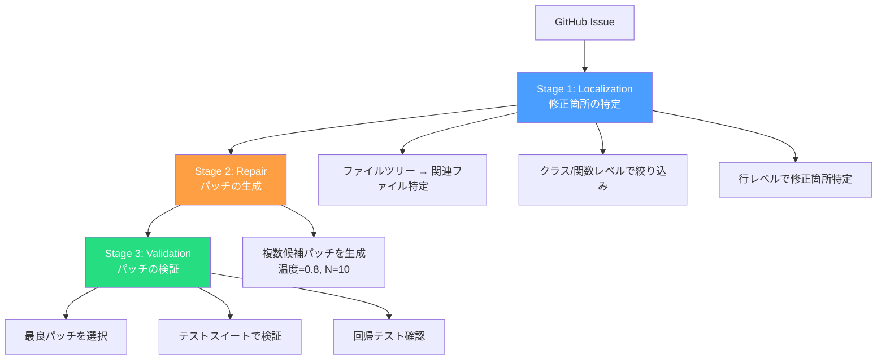

本記事は [Agentless: Demystifying LLM-based Software Engineering Agents](https://arxiv.org/abs/2406.12843)（Xia et al., 2024）の解説記事です。

## 論文概要（Abstract）

Agentlessは、複雑なエージェント構造（ツール使用、動的計画、マルチエージェント）を一切使用せず、「定位（Localization）→ 修復（Repair）→ パッチ検証（Validation）」の3段階シンプルパイプラインでGitHub Issueの自動解決を行う手法である。著者らは、SWE-bench Liteにおいて27.33%の解決率を1 Issue あたり平均$0.34のコストで達成し、発表時点で公開手法の中で最高性能を記録したと報告している。この結果は、複雑なエージェントフレームワークが必ずしも必要ではなく、シンプルなパイプラインでも同等以上の性能を達成できることを示唆している。

この記事は [Zenn記事: Claude Codeコマンド完全ガイド：3モード×30+コマンドで開発効率を最大化する](https://zenn.dev/0h_n0/articles/63cf472bad8ea7) の深掘りです。

## 情報源

- **arXiv ID**: 2406.12843
- **URL**: [https://arxiv.org/abs/2406.12843](https://arxiv.org/abs/2406.12843)
- **著者**: Chunqiu Steven Xia, Yinlin Deng, Soren Dunn, Lingming Zhang（University of Illinois Urbana-Champaign）
- **発表年**: 2024
- **分野**: cs.SE, cs.AI

## 背景と動機（Background & Motivation）

2024年、LLMベースのソフトウェアエンジニアリングエージェントが急速に発展した。SWE-agent、Devin、AutoCodeRover等のシステムは、LLMにツールを持たせて動的に計画・実行するアプローチを採用している。しかし、これらのエージェントベースのアプローチには以下の課題がある。

1. **複雑さ**: ツール使用、メモリ管理、エラー回復等の複雑な設計が必要
2. **コスト**: エージェントの試行錯誤により、APIコールが増大しコストが嵩む
3. **再現性**: エージェントの動的な振る舞いにより、同一入力でも結果が大きく変動する
4. **デバッグの困難さ**: エージェントの意思決定過程が不透明

著者らは、これらの課題に対する「よりシンプルなベースライン」として、エージェント構造を排除したパイプラインを提案している。この設計思想は、Claude Codeの権限モード設計とも関連する。Plan Modeでは「読み取り専用」で探索し、Normal Modeで実行するという段階的なアプローチが、Agentlessの3段階パイプラインと構造的に類似している。

## 主要な貢献（Key Contributions）

- **貢献1**: エージェント構造不要の軽量パイプライン「Agentless」を提案。定位→修復→検証の3段階で構成される
- **貢献2**: SWE-bench Liteで27.33%の解決率を達成（発表時点の公開手法中最高）。コストは1 Issueあたり平均$0.34
- **貢献3**: エージェントベースの手法との系統的な比較分析を実施。複雑さとコストのトレードオフを明確にした
- **貢献4**: Apache 2.0ライセンスでオープンソース公開（[OpenAutoCoder/Agentless](https://github.com/OpenAutoCoder/Agentless)）

## 技術的詳細（Technical Details）

### 3段階パイプライン

Agentlessのアーキテクチャは以下の3段階で構成される。



### Stage 1: Localization（定位）

定位は、リポジトリ全体から修正すべきコードの位置を特定するプロセスである。著者らは階層的な絞り込みを行う。

**Step 1-1: ファイルレベルの特定**

リポジトリのファイルツリーをテキスト表現に変換し、LLMに関連ファイルを選択させる。

```python
def localize_files(
    issue: str,
    file_tree: str,
    model: str = "gpt-4o",
    top_k: int = 5,
) -> list[str]:
    """Issue に関連するファイルをファイルツリーから特定

    Args:
        issue: GitHub Issueのテキスト
        file_tree: リポジトリのディレクトリ構造
        model: 使用するLLMモデル
        top_k: 返すファイル数の上限

    Returns:
        関連ファイルパスのリスト
    """
    prompt = f"""Given this issue:
{issue}

And this repository structure:
{file_tree}

List the top {top_k} files most likely to need modification."""

    response = call_llm(model=model, prompt=prompt)
    return parse_file_paths(response)
```

**Step 1-2: クラス/関数レベルの絞り込み**

特定されたファイルの中から、クラスや関数のシグネチャ（名前、引数、Docstring）をLLMに提示し、修正対象を絞り込む。ファイル全体を送るのではなく、構造情報のみを送ることで文脈窓を効率的に使用する。

**Step 1-3: 行レベルの特定**

最終的に、修正すべき行の範囲を特定する。この段階では対象関数のコード全体をLLMに提示する。

### Stage 2: Repair（修復）

特定された修正箇所に対して、diff形式のパッチを生成する。著者らは以下の設計選択を報告している。

**サンプリング戦略**: 温度$T=0.8$で$N=10$個の候補パッチを生成する。

$$
p_{\text{patch}_i} = \text{LLM}(\text{issue}, \text{context}, \text{location}; T=0.8)
$$

ここで$i \in \{1, 2, \ldots, 10\}$である。温度$T=0.8$は、多様性と品質のバランスを取るための経験的な値として著者らが報告している。

**diff形式の採用**: パッチは統一diff形式で生成される。コード全体を再生成するのではなく、変更部分のみを出力させることで、生成コストを削減し精度を向上させている。

### Stage 3: Validation（検証）

生成された複数の候補パッチをテストスイートで検証し、最良のパッチを選択する。

```python
def validate_patches(
    patches: list[str],
    repo_path: str,
    test_suite: list[str],
) -> str:
    """候補パッチをテストで検証し最良を選択

    Args:
        patches: 候補パッチのリスト（diff形式）
        repo_path: リポジトリのパス
        test_suite: テストコマンドのリスト

    Returns:
        最良パッチのdiff
    """
    results = []
    for patch in patches:
        apply_patch(repo_path, patch)
        test_pass = run_tests(repo_path, test_suite)
        results.append((patch, test_pass))
        revert_patch(repo_path, patch)

    # テストを通過するパッチの中から
    # 最小のdiff（変更量が少ない）を選択
    passing = [(p, r) for p, r in results if r]
    if passing:
        return min(passing, key=lambda x: len(x[0]))
    return None  # テストを通過するパッチなし
```

**選択基準**: テストを通過するパッチが複数ある場合、著者らは「最小変更」原則を採用している。変更量が最も少ないパッチを選択することで、意図しない副作用を最小化する。

## 実装のポイント（Implementation）

**実行環境**: Agentlessは通常のPython環境で動作し、Docker等のサンドボックスは必須ではない。ただし、テスト実行時のセキュリティのため、隔離環境での実行が推奨される。

**コスト構造**: 論文Table 4より、1 Issueあたりの平均コストは以下の通りである。
- 定位: 約$0.15（ファイルツリー解析 + 3段階の絞り込み）
- 修復: 約$0.15（10個の候補パッチ生成）
- 検証: 約$0.04（テスト実行、LLMコスト不要）
- **合計**: 約$0.34/Issue

これはSWE-agent（$0.5〜$2/Issue）と比較して1/3〜1/6のコストである。

**処理時間**: 1 Issueあたり平均4.5分。定位に2分、修復に2分、検証に0.5分の配分である。

**再現性**: エージェントベースの手法と異なり、Agentlessは決定論的なパイプラインであるため（サンプリング温度を固定した場合）、同一入力に対して一貫した結果を返す。

## 実験結果（Results）

### SWE-bench Lite での比較（論文Table 1より）

| 手法 | 解決率 | コスト/Issue | エージェント型 |
|------|--------|-------------|---------------|
| **Agentless（GPT-4o）** | **27.33%** | **$0.34** | No |
| SWE-agent（GPT-4o） | 12.5% | $0.5-$2 | Yes |
| AutoCodeRover | 22.0% | 非公開 | Yes |
| Aider | 18.8% | 非公開 | Yes |
| RAG + Claude 3 | 10.3% | 非公開 | No |

著者らは、Agentlessがエージェントベースの手法を上回る性能をより低コストで達成したことを強調している。

### エラー分析（論文Section 5.3より）

著者らは、Agentlessが解決できなかったIssueを分析し、以下の失敗パターンを報告している。

| 失敗パターン | 割合 | 説明 |
|-------------|------|------|
| 定位失敗 | 40% | 修正すべきファイル/関数を特定できない |
| 修復失敗 | 35% | 正しい場所を特定したが、正しいパッチを生成できない |
| 検証限界 | 15% | テストが不十分でバグのあるパッチが通過 |
| 複数ファイル | 10% | 複数ファイルにまたがる変更が必要 |

特に「複数ファイルにまたがる変更」はAgentlessの構造的な制約であり、エージェントベースの手法が有利な領域である。

## 実運用への応用（Practical Applications）

### Claude Codeとの設計思想の比較

Agentlessの「シンプルさ」とClaude Codeの「多機能性」は対照的であるが、いくつかの共通する設計原則がある。

**階層的な探索**: Agentlessのファイル→クラス→行の階層的定位は、Claude Codeの`Glob`→`Grep`→`Read`ツールの使い分けと類似している。Zenn記事で紹介されている通り、Claude Codeは「ファイル検索にはGlob」「内容検索にはGrep」「ファイル読み取りにはRead」という段階的なアプローチを採用している。

**パッチの最小化**: Agentlessの「最小変更」原則は、Claude Codeの`Edit`ツールが「差分のみを送信する」設計と同じ思想に基づいている。不要な変更を避けることで、副作用のリスクを最小化している。

**テスト駆動の検証**: Agentlessがテストスイートでパッチを検証するアプローチは、Claude Codeのワークフローにおける「実装→テスト実行→修正」サイクルと対応する。

### 適用場面の使い分け

| シナリオ | 推奨ツール | 理由 |
|---------|-----------|------|
| 単一ファイルのバグ修正 | Agentless | 低コスト、高再現性 |
| 複数ファイルのリファクタリング | Claude Code | エージェント型の柔軟性が必要 |
| 新機能実装 | Claude Code | 探索→計画→実装のフルサイクル |
| 自動化パイプライン | Agentless | 決定論的な動作、低コスト |
| 対話的なデバッグ | Claude Code | Plan Mode + Normal Modeの切替 |

## 関連研究（Related Work）

- **SWE-agent（Yang et al., 2024）**: ACI（Agent-Computer Interface）設計に基づくエージェント型アプローチ。Agentlessとは対照的に、エージェントにツールを持たせて動的に問題を解く。本記事シリーズで別途解説
- **MASAI（Jimenez et al., 2024）**: モジュール型のエージェントアーキテクチャ。planner、retriever、editor、verifierの4つの専門サブエージェントに分割。SWE-bench Liteで28.33%を達成。Agentlessとは設計思想が対極にあるが、性能は拮抗している
- **AutoCodeRover（Zhang et al., 2024）**: AST（抽象構文木）解析を活用した構造的探索により、コード修正の精度を向上させるアプローチ。Agentlessの定位段階と共通する「構造情報の活用」という発想を持つ

## まとめと今後の展望

Agentlessは、「エージェントは本当に必要か」という根本的な問いを投げかけた研究である。SWE-bench Liteで27.33%の解決率を$0.34/Issueという低コストで達成し、複雑なエージェント構造が必ずしも優位ではないことを示した。

ただし、著者らも認めている通り、Agentlessには構造的な限界がある。複数ファイルにまたがる変更、新機能の実装、対話的なデバッグなど、柔軟な探索と判断が必要な場面ではエージェントベースのアプローチが有利である。

Claude Codeの文脈では、Agentlessの知見は「シンプルなタスクにはシンプルなアプローチで十分」という教訓として有用である。Plan Modeでの事前探索と`-p`モードでのパイプライン実行を組み合わせることで、Agentless的な「段階的パイプライン」をClaude Code上で再現できる。

論文の発表後、SWE-benchのスコアは急速に向上しており（2026年2月時点でSWE-bench Verifiedのトップは45%超）、Agentlessの後継研究やハイブリッドアプローチ（Agentless + エージェント）が活発に研究されている。

## 参考文献

- **arXiv**: [https://arxiv.org/abs/2406.12843](https://arxiv.org/abs/2406.12843)
- **Code**: [https://github.com/OpenAutoCoder/Agentless](https://github.com/OpenAutoCoder/Agentless)
- **Related Zenn article**: [https://zenn.dev/0h_n0/articles/63cf472bad8ea7](https://zenn.dev/0h_n0/articles/63cf472bad8ea7)

---

:::message
この記事はAI（Claude Code）により自動生成されました。内容の正確性については論文原文で検証していますが、最新のスコアについてはSWE-benchリーダーボードもご確認ください。
:::
