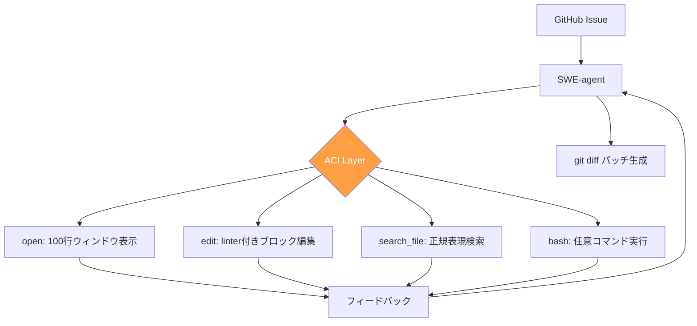

本記事は [SWE-agent: Agent-Computer Interfaces Enable Automated Software Engineering](https://arxiv.org/abs/2406.14898)（Yang et al., 2024）の解説記事です。

## 論文概要（Abstract）

SWE-agentは、LLMエージェントがコンピュータと対話するための専用インターフェース「Agent-Computer Interface（ACI）」を設計・評価した研究である。著者らは、人間向けのCLI/GUIをそのままLLMに使わせるのではなく、LLMの認知特性（トークン制約、文脈窓、テキスト処理能力）に最適化されたインターフェースを構築することで、ソフトウェアエンジニアリングタスクの自動化性能が大幅に向上すると主張している。SWE-bench Liteにおいて12.5%の解決率を達成し、発表時点の公開エージェント中で最高性能を記録した。

この記事は [Zenn記事: Claude Codeコマンド完全ガイド：3モード×30+コマンドで開発効率を最大化する](https://zenn.dev/0h_n0/articles/63cf472bad8ea7) の深掘りです。

## 情報源

- **arXiv ID**: 2406.14898
- **URL**: [https://arxiv.org/abs/2406.14898](https://arxiv.org/abs/2406.14898)
- **著者**: John Yang, Carlos E. Jimenez, Alexander Wettig, Kilian Lieret, Shunyu Yao, Karthik Narasimhan, Ofir Press（Princeton University, Stanford University）
- **発表年**: 2024
- **分野**: cs.SE, cs.AI, cs.CL

## 背景と動機（Background & Motivation）

ソフトウェアエンジニアリングにおけるLLMエージェントの活用が急速に進む中、多くのシステムは既存のターミナル（bash）をそのままエージェントに使わせていた。しかし、bashの出力は人間向けに設計されており、LLMにとっては冗長すぎる情報や、文脈窓を圧迫する大量のテキストが問題となっていた。

人間がコンピュータを操作するためのインターフェースはHCI（Human-Computer Interface）として長年研究されてきたが、LLMエージェント向けのインターフェース設計は体系化されていなかった。著者らは、HCIの知見をLMに適応させた「ACI」という新概念を提唱し、インターフェース設計がエージェント性能に与える影響を定量的に示すことで、この分野の研究基盤を確立することを目指している。

この問題設定はClaude Codeのようなターミナルベースのコーディングツールと直接関連する。Claude Codeが採用している「ファイルビューア」「編集コマンド」「権限モード」といった設計要素は、まさにACIの具体的な実装例と言える。

## 主要な貢献（Key Contributions）

- **貢献1**: LMエージェント専用のインターフェース設計理論「ACI（Agent-Computer Interface）」を体系化。HCIとの明確な区別を確立した
- **貢献2**: SWE-agentシステムをオープンソースで開発・公開（[princeton-nlp/SWE-agent](https://github.com/princeton-nlp/SWE-agent)）。カスタムACIを通じてLMがファイル操作・コード編集・テスト実行を行う実用的なシステムを提供
- **貢献3**: ACI設計の各要素が性能にどう寄与するかをアブレーション研究で定量的に示した。特にlinter付き編集コマンドと文脈ウィンドウ管理が重要であることを明らかにした
- **貢献4**: SWE-bench Liteで12.5%の解決率を達成（発表時点の公開エージェント中最高）

## 技術的詳細（Technical Details）

### ACI設計の4原則

著者らは、効果的なACIを設計するための4つの原則を提示している。

**1. アクション空間の最適化**: コマンドをコンパクトに保ち、1アクションで意味のある操作を完結させる。bashの`cat`コマンドはファイル全体を出力するため文脈窓を圧迫するが、SWE-agentの`open`コマンドは100行ウィンドウで表示する。

**2. フィードバックの明確化**: エージェントが実行結果を即座に確認できるよう、出力を構造化する。特に`edit`コマンド実行後のlinter（flake8）による即時フィードバックが重要である。

**3. ガードレールの実装**: エラーを起こしにくい設計にする。例えば、`edit`コマンドで構文エラーが発生した場合は自動的に変更を取り消し、エラーメッセージを返す。

**4. 文脈窓の効率化**: 長大な出力を避け、状態を簡潔に表現する。ファイル全体ではなく「ウィンドウ」単位で表示し、必要に応じてスクロールする設計を採用している。



### カスタムツール群

SWE-agentは以下のカスタムツールをACI上に実装している。

| ツール | 機能 | 設計上の工夫 |
|--------|------|-------------|
| `open` | ファイルを開く | 100行ずつ表示（文脈窓節約） |
| `scroll_up/down` | ファイル内スクロール | ウィンドウ単位の移動 |
| `search_file` | ファイル内検索 | 正規表現対応、マッチ行周辺を表示 |
| `search_dir` | ディレクトリ検索 | ファイル名・内容の横断検索 |
| `find_file` | ファイル探索 | glob対応 |
| `edit` | ブロック編集 | lint自動実行付き（構文エラー即フィードバック） |
| `create` | ファイル作成 | — |
| `submit` | パッチ提出 | git diffで最終成果物生成 |

### アルゴリズム

SWE-agentの実行フローは以下の擬似コードで表現できる。

```python
from dataclasses import dataclass
from typing import Optional


@dataclass
class ACIState:
    """ACI の状態管理"""
    current_file: Optional[str] = None
    window_start: int = 0
    window_size: int = 100


def swe_agent_loop(
    issue: str,
    repo_path: str,
    model: str = "gpt-4o",
    max_steps: int = 50,
) -> str:
    """SWE-agentのメインループ

    Args:
        issue: GitHub Issueのテキスト
        repo_path: リポジトリのパス
        model: 使用するLLMモデル
        max_steps: 最大ステップ数

    Returns:
        生成されたgit diffパッチ
    """
    state = ACIState()
    history: list[dict] = []

    # システムプロンプト: ACI ツールの説明 + 問題文
    system_prompt = build_system_prompt(issue, available_tools)

    for step in range(max_steps):
        # LLM に現在の状態を送信し、次のアクションを取得
        action = call_llm(
            model=model,
            system=system_prompt,
            history=history,
        )

        if action.tool == "submit":
            # パッチを生成して返す
            return generate_git_diff(repo_path)

        # ACI を通じてアクションを実行
        observation = execute_aci_action(action, state, repo_path)

        # edit コマンドの場合、linter を自動実行
        if action.tool == "edit":
            lint_result = run_linter(state.current_file)
            if lint_result.has_errors:
                # 構文エラーがあれば変更を取り消し
                revert_edit(state.current_file)
                observation += f"\n[Linter Error] {lint_result.message}"

        history.append({"action": action, "observation": observation})

    return generate_git_diff(repo_path)  # 最大ステップ到達時
```

**重要な設計決定**: `edit`コマンドは行範囲と新コンテンツを受け取り、実行後にlinter（flake8）を自動実行する。構文エラーがあれば即座に変更を取り消し、エラーメッセージをフィードバックする。この設計により、エージェントが壊れたコードを残したまま作業を続けることを防いでいる。

## 実装のポイント（Implementation）

著者らのリポジトリ（[princeton-nlp/SWE-agent](https://github.com/princeton-nlp/SWE-agent)）によると、以下の実装上の注意点がある。

**実行環境**: Docker コンテナ内でエージェントが動作する。GitHub Issueとリポジトリをコンテナにロードし、LMがACI経由でbash操作・ファイル編集・テスト実行を繰り返す。

**コスト**: 論文のTable 3より、GPT-4o使用時に1 Issue あたり平均$0.5〜$2のAPI費用が発生する。1 Issue の処理に平均5〜20分を要する。

**文脈窓管理**: ファイルビューアのウィンドウサイズ（デフォルト100行）は、モデルの文脈窓サイズに応じて調整可能。著者らは100行がGPT-4oの128Kトークン文脈窓に対して良好なバランスであると報告している。

**linter統合**: `edit`コマンドにflake8を統合することで、エージェントが構文エラーを含むパッチを生成するケースを大幅に削減している。著者らのアブレーション研究（論文Section 4.2）では、linter統合の有無で解決率に約2〜3%の差が出ることが示されている。

## Production Deployment Guide

### AWS実装パターン（コスト最適化重視）

SWE-agentのようなLLMコーディングエージェントをAWS上で運用する場合のトラフィック量別推奨構成を示す。以下のコスト試算は2026年2月時点のAWS ap-northeast-1（東京）リージョン料金に基づく概算値であり、実際のコストはトラフィックパターンやバースト使用量により変動する。最新料金は[AWS料金計算ツール](https://calculator.aws/)で確認されたい。

| 規模 | 月間リクエスト | 推奨構成 | 月額コスト | 主要サービス |
|------|--------------|---------|-----------|------------|
| **Small** | ~3,000（100/日） | Serverless | $50-150 | Lambda + Bedrock + DynamoDB |
| **Medium** | ~30,000（1,000/日） | Hybrid | $300-800 | Lambda + ECS Fargate + ElastiCache |
| **Large** | 300,000+（10,000/日） | Container | $2,000-5,000 | EKS + Karpenter + EC2 Spot |

**Small構成の詳細**（月額$50-150）:
- **Lambda**: 1GB RAM, 60秒タイムアウト（$20/月）
- **Bedrock**: Claude 3.5 Haiku, Prompt Caching有効（$80/月）
- **DynamoDB**: On-Demand（$10/月）
- **CloudWatch**: 基本監視（$5/月）
- **API Gateway**: REST API（$5/月）

**コスト削減テクニック**:
- Spot Instances使用で最大90%削減（EKS + Karpenter）
- Bedrock Batch API使用で50%削減（非リアルタイム処理）
- Prompt Caching有効化で30-90%削減

### Terraformインフラコード

**Small構成（Serverless）: Lambda + Bedrock + DynamoDB**

```hcl
module "vpc" {
  source  = "terraform-aws-modules/vpc/aws"
  version = "~> 5.0"

  name = "swe-agent-vpc"
  cidr = "10.0.0.0/16"
  azs  = ["ap-northeast-1a", "ap-northeast-1c"]
  private_subnets = ["10.0.1.0/24", "10.0.2.0/24"]

  enable_nat_gateway   = false
  enable_dns_hostnames = true
}

resource "aws_iam_role" "lambda_bedrock" {
  name = "swe-agent-lambda-role"

  assume_role_policy = jsonencode({
    Version = "2012-10-17"
    Statement = [{
      Action = "sts:AssumeRole"
      Effect = "Allow"
      Principal = { Service = "lambda.amazonaws.com" }
    }]
  })
}

resource "aws_iam_role_policy" "bedrock_invoke" {
  role = aws_iam_role.lambda_bedrock.id
  policy = jsonencode({
    Version = "2012-10-17"
    Statement = [{
      Effect   = "Allow"
      Action   = ["bedrock:InvokeModel", "bedrock:InvokeModelWithResponseStream"]
      Resource = "arn:aws:bedrock:ap-northeast-1::foundation-model/anthropic.claude-3-5-haiku*"
    }]
  })
}

resource "aws_lambda_function" "swe_agent" {
  filename      = "lambda.zip"
  function_name = "swe-agent-handler"
  role          = aws_iam_role.lambda_bedrock.arn
  handler       = "index.handler"
  runtime       = "python3.12"
  timeout       = 60
  memory_size   = 1024

  environment {
    variables = {
      BEDROCK_MODEL_ID    = "anthropic.claude-3-5-haiku-20241022-v1:0"
      DYNAMODB_TABLE      = aws_dynamodb_table.cache.name
      ENABLE_PROMPT_CACHE = "true"
    }
  }
}

resource "aws_dynamodb_table" "cache" {
  name         = "swe-agent-cache"
  billing_mode = "PAY_PER_REQUEST"
  hash_key     = "prompt_hash"

  attribute {
    name = "prompt_hash"
    type = "S"
  }

  ttl {
    attribute_name = "expire_at"
    enabled        = true
  }
}
```

### セキュリティベストプラクティス

- **IAMロール**: 最小権限の原則（PoLP）に従い、Bedrock InvokeModelのみ許可
- **ネットワーク**: Lambda はVPC内配置、パブリックサブネット不使用
- **シークレット管理**: AWS Secrets Manager使用、環境変数へのハードコード禁止
- **暗号化**: S3/DynamoDB/EBS 全て KMS暗号化
- **監査**: CloudTrail全リージョン有効化

### 運用・監視設定

```python
import boto3

cloudwatch = boto3.client('cloudwatch')

# Bedrock トークン使用量アラート
cloudwatch.put_metric_alarm(
    AlarmName='swe-agent-token-spike',
    ComparisonOperator='GreaterThanThreshold',
    EvaluationPeriods=1,
    MetricName='TokenUsage',
    Namespace='AWS/Bedrock',
    Period=3600,
    Statistic='Sum',
    Threshold=500000,
    AlarmDescription='Bedrockトークン使用量異常（コスト急増）'
)
```

### コスト最適化チェックリスト

- [ ] ~100 req/日 → Lambda + Bedrock（Serverless）— $50-150/月
- [ ] ~1000 req/日 → ECS Fargate + Bedrock（Hybrid）— $300-800/月
- [ ] 10000+ req/日 → EKS + Spot Instances（Container）— $2,000-5,000/月
- [ ] Spot Instances優先（最大90%削減）
- [ ] Bedrock Batch API使用（50%削減）
- [ ] Prompt Caching有効化（30-90%削減）
- [ ] Lambda メモリサイズ最適化
- [ ] AWS Budgets 月額予算設定
- [ ] CloudWatch アラーム設定
- [ ] 日次コストレポート自動送信

## 実験結果（Results）

### ACI設計要素のアブレーション（論文Section 4.2より）

| 設定 | SWE-bench Lite 解決率 |
|------|----------------------|
| Baseline（raw bash のみ） | 約3-5% |
| + file viewer（100行ウィンドウ） | 向上 |
| + edit command（linter付き） | 大幅向上 |
| + context management | さらに向上 |
| SWE-agent full（GPT-4o） | **12.5%** |

### モデル別比較（論文Table 2より）

| モデル | SWE-bench Lite 解決率 |
|--------|----------------------|
| GPT-4o + SWE-agent | 12.5% |
| Claude 3 Opus + SWE-agent | 10.7% |
| GPT-4 Turbo + SWE-agent | 約11% |

著者らは、ACI設計の中でも「linter付きeditコマンド」と「100行ウィンドウ表示」の2要素が最も大きな性能改善に寄与していると報告している。raw bashのみのベースラインと比較して、これらの設計要素の追加により解決率が約3倍に向上した。

## 実運用への応用（Practical Applications）

SWE-agentのACI設計思想は、Claude Codeを含む現代のAIコーディングツールに広く影響を与えている。

**Claude Codeとの関連**: Zenn記事で紹介されているClaude Codeの設計要素（Edit/Read/Grep/Globツール、Plan Mode、文脈管理の`/compact`コマンド）は、SWE-agentが提唱したACI原則の実装例と見なすことができる。

- **ファイルビューア**: Claude Codeの`Read`ツールは行番号付きで表示し、`offset`/`limit`で表示範囲を制御する。SWE-agentの100行ウィンドウと同じ設計思想である
- **linter付きedit**: Claude Codeの`Edit`ツールは、変更の一意性チェックや差分表示を通じてエラーフィードバックを提供する
- **権限モード**: Claude CodeのPlan Mode（読み取り専用）は、SWE-agentのガードレール原則をユーザーレベルで実現したものと言える

**スケーリング課題**: 1 Issueあたり$0.5-$2のコストは、大量のIssueを自動処理する場合に累積する。Bedrock Batch APIやPrompt Cachingの活用が実運用では不可欠である。

## 関連研究（Related Work）

- **Devin（Cognition）**: 2024年に発表された商用AIソフトウェアエンジニア。独自のIDE・ブラウザ・ターミナルを統合したエージェント環境を提供するが、クローズドソースであるためACI設計の詳細は公開されていない
- **Agentless（Xia et al., 2024）**: エージェント構造を排除し、定位→修復→検証の3段階パイプラインでSWE-benchを解くアプローチ。ACIの複雑さを回避する代替戦略として対照的な位置づけにある（本記事シリーズで別途解説）
- **OpenDevin（Wang et al., 2024）**: オープンソースのAIソフトウェア開発プラットフォーム。SWE-agentのACI概念を参考にしつつ、マルチエージェント協調やWebブラウジングなど機能を拡張している

## まとめと今後の展望

SWE-agentは、LLMエージェント向けのインターフェース設計（ACI）を体系化し、「インターフェースの質がエージェント性能を決定する」という重要な知見を示した。linter付き編集コマンドと文脈ウィンドウ管理という2つの設計要素が性能向上に最も寄与するという発見は、Claude Codeを含む後続ツールの設計に影響を与えている。

今後の研究方向として、著者らはマルチモーダルACI（画面キャプチャ＋テキスト）やマルチエージェント協調でのACI設計を挙げている。SWE-benchのスコアは発表後も急速に向上しており（2026年2月時点でSWE-bench Verifiedのトップは45%超）、ACI設計の進化が継続的に性能改善に貢献することが見込まれる。

## 参考文献

- **arXiv**: [https://arxiv.org/abs/2406.14898](https://arxiv.org/abs/2406.14898)
- **Code**: [https://github.com/princeton-nlp/SWE-agent](https://github.com/princeton-nlp/SWE-agent)
- **Related Zenn article**: [https://zenn.dev/0h_n0/articles/63cf472bad8ea7](https://zenn.dev/0h_n0/articles/63cf472bad8ea7)

---

:::message
この記事はAI（Claude Code）により自動生成されました。内容の正確性については論文原文で検証していますが、最新の情報については公式リポジトリもご確認ください。
:::
