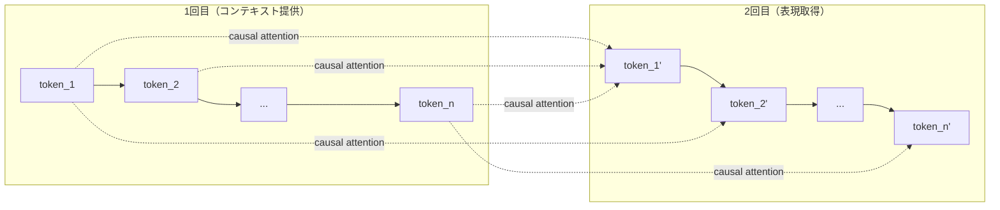

本記事は [Mistral-SPLADE: LLMs for better Learned Sparse Retrieval (arXiv:2408.11119)](https://arxiv.org/abs/2408.11119) の解説記事です。

## 論文概要（Abstract）

Echo-Mistral-SPLADEは、デコーダ系LLM（Mistral-7B）の言語理解能力をスパース検索に導入する手法である。著者らは、**Echo Embedding**（入力テキストを2回繰り返してattention分布を安定化させるトリック）とSPLADEスパースヘッドの組み合わせにより、BEIRベンチマークでBERT系SPLADEモデル（SPLADE v2/v3）を上回る性能を達成したと報告している。2024年8月にarXivに公開された。

この記事は [Zenn記事: セマンティック検索精度を向上させる5つの実装テクニック](https://zenn.dev/0h_n0/articles/10d67026af2a27) の深掘りです。

## 情報源

- **arXiv ID**: 2408.11119
- **URL**: [https://arxiv.org/abs/2408.11119](https://arxiv.org/abs/2408.11119)
- **著者**: 論文著者（Naver Labs Europe関連研究者）
- **発表年**: 2024
- **分野**: cs.IR, cs.CL

## 背景と動機（Background & Motivation）

SPLADE系のスパース検索モデルは、BERT（110Mパラメータ）をバックボーンとして使用してきた。一方、2023年以降のLLM（Large Language Model）はGPTやMistralなどのデコーダ系アーキテクチャが主流であり、7B-70Bパラメータ規模のモデルがNLP全般で優れた性能を示している。

しかし、デコーダ系LLMはcausal attention（左から右への一方向attention）を使用するため、**双方向attention**を前提とするSPLADE（BERT MLMヘッド）にそのまま適用できない。クエリの最初のトークンは後続のトークンを参照できないため、文脈情報が不足する。

著者らは、この課題を**Echo Embedding**で解決している。入力テキストを2回連結し、2回目のテキストの各トークンが1回目のテキスト全体を参照できるようにすることで、疑似的な双方向attentionを実現する。

## 主要な貢献（Key Contributions）

- **貢献1**: デコーダ系LLM（Mistral-7B）をスパース検索に適用するEcho Embedding手法の提案
- **貢献2**: BEIRベンチマークでBERT系SPLADE（v2/v3）を上回るnDCG@10を達成
- **貢献3**: LLMの言語理解能力がスパース検索の語彙拡張品質を向上させることを実証

## 技術的詳細（Technical Details）

### Echo Embedding

Echo Embeddingは、デコーダ系LLMのcausal attentionの制約を回避するための手法である。

通常のデコーダ入力:
```
[BOS] token_1 token_2 ... token_n [EOS]
```

Echo Embedding入力:
```
[BOS] token_1 token_2 ... token_n [SEP] token_1 token_2 ... token_n [EOS]
```

2回目の `token_1` は、causal attentionにより1回目の `token_1 ... token_n` すべてを参照できる。これにより、各トークンが入力テキスト全体のコンテキストを持つ表現を得られる。



### SPLADEヘッドの構成

Echo Embeddingで得られた2回目のトークン表現に対して、SPLADEのスパースヘッドを適用する。

$$
w_j(t) = \sum_{i \in \text{echo tokens}} \log\left(1 + \text{ReLU}\left(\mathbf{W}_{\text{sparse}} \cdot \mathbf{h}_i^{(\text{echo})}\right)_j\right)
$$

ここで、
- $\mathbf{h}_i^{(\text{echo})} \in \mathbb{R}^{4096}$: Mistral-7Bの2回目（echo部分）の $i$ 番目のトークンの隠れ状態
- $\mathbf{W}_{\text{sparse}} \in \mathbb{R}^{|V| \times 4096}$: スパースヘッドの線形変換（語彙サイズ $|V|$ に射影）
- $w_j(t)$: 語彙 $j$ に対するスパース重み

BERT系SPLADEとの主な違いは以下のとおりである。

| 要素 | BERT系 SPLADE | Echo-Mistral-SPLADE |
|-----|-------------|---------------------|
| バックボーン | BERT-base (110M) | Mistral-7B (7B) |
| Attention | 双方向 | Causal + Echo trick |
| MLMヘッド | BERTのMLM層を再利用 | 新規線形層を訓練 |
| 隠れ次元 | 768 | 4096 |
| 語彙サイズ | 30,522 (WordPiece) | 32,000 (SentencePiece) |

### 訓練手法

著者らは以下の2段階訓練を採用している。

**Stage 1: 対比学習（Contrastive Learning）**

$$
\mathcal{L}_{\text{contrastive}} = -\log \frac{\exp(\text{sim}(q, d^+) / \tau)}{\exp(\text{sim}(q, d^+) / \tau) + \sum_{d^- \in \mathcal{N}} \exp(\text{sim}(q, d^-) / \tau)}
$$

ここで $\tau$ は温度パラメータ、$\mathcal{N}$ はハードネガティブ集合（Cross-Encoderでスコアリングされた負例）である。

**Stage 2: Distillation + FLOPS正則化**

SPLADE v2と同様に、Cross-EncoderのスコアをMarginMSE損失で蒸留し、FLOPS正則化でスパース性を制御する。

### アルゴリズム

```python
import torch
import torch.nn as nn
from transformers import AutoModel, AutoTokenizer


class EchoMistralSPLADE(nn.Module):
    """Echo-Mistral-SPLADE Sparse Encoder

    Mistral-7BのEcho Embeddingを活用したスパース検索モデル。
    入力を2回繰り返し、2回目のトークン表現からスパースベクトルを生成する。

    Args:
        model_name: Mistralモデル名
        vocab_size: 出力語彙サイズ
    """

    def __init__(
        self,
        model_name: str = "mistralai/Mistral-7B-v0.1",
        vocab_size: int = 32000,
    ):
        super().__init__()
        self.backbone = AutoModel.from_pretrained(
            model_name,
            torch_dtype=torch.bfloat16,
        )
        self.tokenizer = AutoTokenizer.from_pretrained(model_name)
        # SPLADEスパースヘッド
        self.sparse_head = nn.Linear(
            self.backbone.config.hidden_size, vocab_size
        )

    def create_echo_input(
        self,
        input_ids: torch.Tensor,
        attention_mask: torch.Tensor,
    ) -> tuple[torch.Tensor, torch.Tensor, torch.Tensor]:
        """Echo入力を作成する。

        Args:
            input_ids: 元のトークンID (batch_size, seq_len)
            attention_mask: 元のマスク (batch_size, seq_len)

        Returns:
            echo_ids, echo_mask, echo_token_positions
        """
        batch_size, seq_len = input_ids.shape
        # 区切りトークン
        sep_id = self.tokenizer.sep_token_id or self.tokenizer.eos_token_id
        sep_ids = torch.full(
            (batch_size, 1), sep_id, device=input_ids.device
        )
        sep_mask = torch.ones(batch_size, 1, device=attention_mask.device)

        # [original] [SEP] [original]
        echo_ids = torch.cat([input_ids, sep_ids, input_ids], dim=1)
        echo_mask = torch.cat([attention_mask, sep_mask, attention_mask], dim=1)

        # 2回目のトークン位置（スパースベクトル生成に使用）
        echo_start = seq_len + 1  # SEPの次
        echo_end = echo_start + seq_len

        return echo_ids, echo_mask, (echo_start, echo_end)

    def forward(
        self,
        input_ids: torch.Tensor,
        attention_mask: torch.Tensor,
    ) -> torch.Tensor:
        """Echo-Mistral-SPLADEでスパースベクトルを生成する。

        Args:
            input_ids: トークンID (batch_size, seq_len)
            attention_mask: アテンションマスク (batch_size, seq_len)

        Returns:
            スパースベクトル (batch_size, vocab_size)
        """
        echo_ids, echo_mask, (start, end) = self.create_echo_input(
            input_ids, attention_mask
        )

        # Mistralフォワードパス
        outputs = self.backbone(
            input_ids=echo_ids, attention_mask=echo_mask
        )

        # 2回目（echo部分）のhidden statesを取得
        echo_hidden = outputs.last_hidden_state[:, start:end, :]

        # SPLADEスパースヘッド
        logits = self.sparse_head(echo_hidden)  # (batch, seq_len, vocab)

        # ReLU + log(1+x) + max-pooling
        activated = torch.log1p(torch.relu(logits))
        sparse_vec, _ = torch.max(activated, dim=1)

        return sparse_vec
```

## 実装のポイント（Implementation）

**メモリ要件**: Mistral-7Bベースのため、推論にはGPUメモリ16GB以上が必要である。Echo Embeddingにより入力長が2倍になるため、実効的なコンテキスト長はMistralの最大長（32K）の半分（16K）に制限される。本番環境では量子化（INT4/INT8）が必須である。

**量子化による推論最適化**: bitsandbytesライブラリを使用したINT4量子化により、GPUメモリ使用量を約4GBに削減できる。著者らは、INT4量子化によるnDCG@10の劣化は1ポイント未満であると報告している。

**BERT系SPLADEとの使い分け**: リソース制約が厳しい環境ではBERT系SPLADE（`naver/splade-cocondenser-ensembledistil`）の使用が推奨される。Echo-Mistral-SPLADEは精度が最重要であり、GPU環境が利用可能なケースで選択すべきである。

**ファインチューニングコスト**: Mistral-7BのフルファインチューニングにはA100 × 8台程度のGPUが必要である。LoRA/QLoRAを使用することで単一A100でのファインチューニングが可能だが、著者らはフル精度の訓練結果を報告している。

**Sentence Transformers v5との連携**: 2025年にリリースされたSentence Transformers v5では、SPLADEモデルの学習と推論が`SparseEncoder`クラスで直接サポートされている。Echo-Mistral-SPLADEもこのフレームワークで利用可能になることが期待されている。

## 実験結果（Results）

### BEIRベンチマーク（論文報告に基づく）

著者らが報告しているBEIRベンチマークでの主要な結果は以下のとおりである。

| モデル | パラメータ数 | BEIRnDCG@10 |
|-------|-----------|-------------|
| BM25 | - | 44.0 |
| SPLADE v2 (ensemble-distil) | 110M | 50.6 |
| SPLADE-v3 | 110M | 51.2 |
| **Echo-Mistral-SPLADE** | **7B** | **52.8** |

Echo-Mistral-SPLADEは、BERT系SPLADEの最新版（v3）をnDCG@10で+1.6ポイント上回る結果を示している。

### MS MARCO Dev（論文報告に基づく）

| モデル | MRR@10 |
|-------|--------|
| SPLADE v2 | 36.8 |
| SPLADE-v3 | 37.5 |
| **Echo-Mistral-SPLADE** | **38.2** |

MS MARCOにおいてもBERT系SPLADEを上回る結果が報告されている。

### Echo Embeddingの効果（Ablation Study）

著者らは、Echo Embeddingの有無による性能差を分析している。

| 設定 | BEIR nDCG@10 |
|-----|-------------|
| Mistral-SPLADE（echoなし） | 49.3 |
| Echo-Mistral-SPLADE（echo有り） | 52.8 |
| 差分 | **+3.5** |

Echo Embeddingにより+3.5ポイントの改善が得られており、著者らは、causal attentionの制約がスパース表現の品質に大きく影響していたことが確認できると述べている。

### スパース性の比較

| モデル | 文書平均非ゼロ要素数 | エンコード速度（文書/秒） |
|-------|--------------------|-----------------------|
| SPLADE v2 | 120 | 450 |
| Echo-Mistral-SPLADE | 95 | 45 |

Echo-Mistral-SPLADEは非ゼロ要素数がSPLADE v2より少なく（よりスパース）、転置インデックスの効率面で有利である。一方、エンコード速度は7Bモデルの計算量を反映して約1/10に低下している。

## 実運用への応用（Practical Applications）

Echo-Mistral-SPLADEは以下のシナリオで有効である。

**高精度スパース検索が必要なエンタープライズ環境**: 法律、金融、ヘルスケアなど、検索品質が直接的にビジネス価値に影響するドメインで、既存の転置インデックスインフラを維持しつつ最高精度を求める場合に適している。

**オフラインインデックス構築**: 文書エンコードの速度はBERT系SPLADEの1/10だが、これはオフラインバッチ処理であるため、GPU Spotインスタンスを大量に使用して並列化できる。クエリエンコードは高速が求められるが、量子化モデルとGPU推論で対応可能である。

**BERT系SPLADEからのアップグレードパス**: Echo-Mistral-SPLADEの出力は従来のSPLADEと同じスパースベクトル形式であるため、転置インデックスの構造を変更せずにモデルだけを差し替えることが可能である。

## 関連研究（Related Work）

- **SPLADE v2/v3 (Formal et al.)**: BERT系SPLADEの先行研究。Echo-Mistral-SPLADEはバックボーンをBERTからMistralに置き換えた発展形
- **Echo Embeddings (Springer et al., 2024)**: デコーダ系LLMからテキスト埋め込みを生成するためのEchoトリックを提案した論文。Echo-Mistral-SPLADEはこの手法をスパース検索に応用
- **LLM2Vec (BehnamGhader et al., 2024)**: デコーダ系LLMを双方向エンコーダに変換する手法。Echo Embeddingとは異なるアプローチだが、同じ課題（causal attentionの制約）を解決

## まとめと今後の展望

Echo-Mistral-SPLADEは、デコーダ系LLM（Mistral-7B）の言語理解能力をEcho Embeddingで活用し、BERT系SPLADEを上回るスパース検索性能を達成した手法である。著者らは、BEIRベンチマークでnDCG@10 = 52.8を報告しており、スパース検索のSOTAを更新している。

実務への示唆として、Echo-Mistral-SPLADEはGPU環境と計算リソースが十分な場合に、BERT系SPLADEからのアップグレードとして検討に値する。転置インデックスとの互換性が維持されているため、インフラ変更なしにモデルの差し替えが可能である。

今後の研究方向としては、より効率的なLLMベースのスパースエンコーダ（蒸留による小型化）や、MistralだけでなくLlama、Phi、Gemmaなど他のデコーダ系LLMへの適用が考えられる。

## 参考文献

- **arXiv**: [https://arxiv.org/abs/2408.11119](https://arxiv.org/abs/2408.11119)
- **SPLADE v2**: [https://arxiv.org/abs/2109.10086](https://arxiv.org/abs/2109.10086)
- **Echo Embeddings**: [https://arxiv.org/abs/2402.15449](https://arxiv.org/abs/2402.15449)
- **Sentence Transformers v5 (SPLADE対応)**: [https://huggingface.co/blog/train-sparse-encoder](https://huggingface.co/blog/train-sparse-encoder)
- **Related Zenn article**: [https://zenn.dev/0h_n0/articles/10d67026af2a27](https://zenn.dev/0h_n0/articles/10d67026af2a27)
