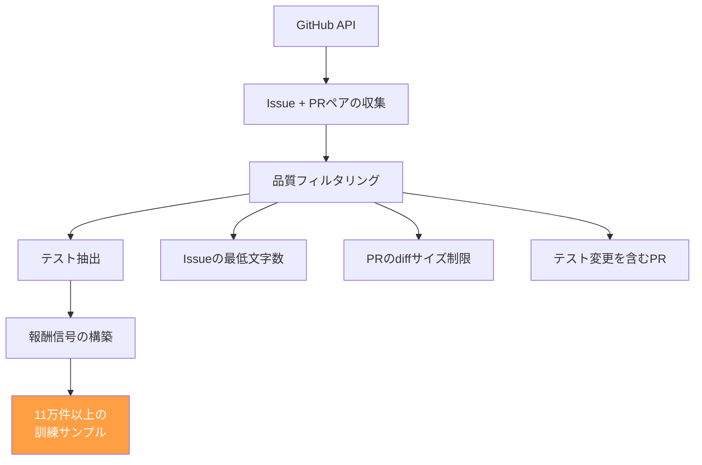

本記事は [SWE-RL: Advancing LLM Reasoning via Reinforcement Learning on Open Software Evolution](https://arxiv.org/abs/2502.00975)（Wei et al., 2025）の解説記事です。

## 論文概要（Abstract）

SWE-RLは、オープンソースのGitHubリポジトリから収集した11万件以上の「ソフトウェア進化」データ（Issue→コミットのペア）を報酬信号として、強化学習（RL）でLLMのソフトウェアエンジニアリング推論能力をファインチューニングする手法である。著者らは、Llama 3系70Bモデルに対してGroup Relative Policy Optimization（GRPO）を適用し、SWE-bench Verifiedにおいて41.0%の解決率を達成したと報告している。この値は発表時点でオープンモデル（公開重み）の中で最高であり、同サイズのSWE-agent（GPT-4o使用）を大幅に上回る。さらに、SWE以外の一般的なコーディングベンチマーク（HumanEval、MBPP）でも性能向上が確認されており、RLによるSWE能力の向上が汎用的なコード推論能力にも波及することを示唆している。

この記事は [Zenn記事: Claude Codeコマンド完全ガイド：3モード×30+コマンドで開発効率を最大化する](https://zenn.dev/0h_n0/articles/63cf472bad8ea7) の深掘りです。

## 情報源

- **arXiv ID**: 2502.00975
- **URL**: [https://arxiv.org/abs/2502.00975](https://arxiv.org/abs/2502.00975)
- **著者**: Yuxiang Wei et al.
- **発表年**: 2025
- **分野**: cs.SE, cs.AI, cs.LG

## 背景と動機（Background & Motivation）

LLMのソフトウェアエンジニアリング能力を向上させるアプローチは、大きく2つに分類される。1つ目は「インファレンス時の工夫」（SWE-agent、Agentless等のシステム設計）であり、2つ目は「モデル自体の能力向上」（ファインチューニング、RLHF等）である。

2024年までの研究は主に前者に集中していた。SWE-agentはACI設計で、Agentlessはパイプライン設計で、それぞれSWE-benchのスコアを向上させた。しかし、これらの手法は基盤となるLLMの能力に依存しており、GPT-4oやClaude 3.5 Sonnetといった高性能（かつ高コスト）なプロプライエタリモデルの使用を前提としていた。

一方、オープンモデル（Llama、Mistral等）でのSWE-bench性能は大きく劣っていた。著者らは、オープンモデルのSWE能力を向上させるために、ソフトウェア開発の実データから直接学習する強化学習アプローチを提案している。

このアプローチは、Claude Codeのような高性能ツールが「なぜ強力なのか」を理解する上で重要な示唆を提供する。Claude Codeの基盤であるClaude Opus 4.6モデルは、大規模な学習データとRLHFによりSWE能力を獲得している。SWE-RLは、この能力獲得のメカニズムをオープンな手法で再現しようとする試みである。

## 主要な貢献（Key Contributions）

- **貢献1**: GitHubの11万件以上のソフトウェア進化データ（Issue→修正コミット）を強化学習の報酬信号として活用する手法を提案
- **貢献2**: GRPOアルゴリズムを適用し、SWE-bench VerifiedでオープンモデルSOTAの41.0%を達成
- **貢献3**: SWE特化のRLが汎用的なコード推論能力も向上させることを実証（HumanEval、MBPP等のベンチマークで改善）
- **貢献4**: 訓練データの収集・前処理パイプラインを公開

## 技術的詳細（Technical Details）

### 訓練データの収集

著者らは、GitHub上のオープンソースプロジェクトから以下の手順で訓練データを収集している。

**収集基準**:
- Issueに紐づくPR（Pull Request）が存在すること
- PRにテストコードの変更が含まれること（テストで検証可能）
- Diffサイズが一定以内であること（文脈窓に収まる範囲）
- Python プロジェクトが中心

### GRPO（Group Relative Policy Optimization）

著者らが採用しているGRPOは、DeepSeek-R1で提案された強化学習アルゴリズムである。従来のPPO（Proximal Policy Optimization）と比較して、報酬モデル（Critic）を不要とし、グループ内の相対的な報酬で学習する点が特徴である。

GRPOの目的関数は以下の通りである。

$$
\mathcal{L}_{\text{GRPO}}(\theta) = \mathbb{E}_{x \sim \mathcal{D}} \left[ \frac{1}{G} \sum_{i=1}^{G} \min\left( r_i(\theta) \hat{A}_i,\ \text{clip}(r_i(\theta), 1-\epsilon, 1+\epsilon) \hat{A}_i \right) \right]
$$

ここで:
- $\theta$: ポリシー（LLM）のパラメータ
- $x$: 入力（Issue + リポジトリコンテキスト）
- $G$: グループサイズ（1入力あたりのサンプル数）
- $r_i(\theta) = \frac{\pi_\theta(y_i | x)}{\pi_{\text{old}}(y_i | x)}$: 重要度比
- $\hat{A}_i$: アドバンテージ推定（グループ内の相対報酬）
- $\epsilon$: クリッピングパラメータ

**アドバンテージの計算**: GRPOでは、Criticモデルを使わず、グループ内の報酬の相対値でアドバンテージを推定する。

$$
\hat{A}_i = \frac{R_i - \mu_R}{\sigma_R}
$$

ここで$R_i$は$i$番目のサンプルの報酬、$\mu_R$と$\sigma_R$はグループ内の報酬の平均と標準偏差である。

### 報酬関数の設計

報酬関数は、生成されたパッチがテストを通過するかどうかに基づく。

$$
R(x, y) = \begin{cases}
+1 & \text{if all tests pass after applying patch } y \\
-1 & \text{if any test fails}
\end{cases}
$$

ここで$x$はIssueとリポジトリコンテキスト、$y$は生成されたパッチである。

**報酬信号の特徴**: 人間のフィードバック（RLHF）を使用せず、テスト結果という客観的な指標のみで報酬を構成する。これにより、大規模なデータ収集が自動化可能になる。

### 訓練ハイパーパラメータ

著者らが報告している主要なハイパーパラメータは以下の通りである。

| パラメータ | 値 | 説明 |
|-----------|-----|------|
| ベースモデル | Llama 3 70B | オープンモデル |
| グループサイズ $G$ | 8 | 1入力あたりのサンプル数 |
| クリッピング $\epsilon$ | 0.2 | PPOスタイルのクリッピング |
| 学習率 | $1 \times 10^{-6}$ | 低学習率でファインチューニング |
| バッチサイズ | 64 | グループ × バッチ |
| 訓練ステップ | 約5,000 | 約2エポック |
| 推論温度 | 0.6 | サンプリング時 |

## 実装のポイント（Implementation）

**計算資源**: 70Bモデルの訓練には大規模なGPU計算資源が必要である。著者らは、複数のA100 GPUを使用したと報告している。推論時にはvLLMを使用してサービングしている。

**データ前処理の重要性**: 訓練データの品質が性能を大きく左右する。著者らは、以下のフィルタリングが特に重要であると述べている。
- テスト変更を含まないPRの除外（報酬信号が得られないため）
- 過度に大きなdiffの除外（文脈窓に収まらず、ノイズになるため）
- 依存関係の複雑なプロジェクトの除外（テスト環境の構築が困難なため）

**報酬ハッキングへの対策**: RL訓練では「テストは通るが実質的にバグのあるパッチ」（報酬ハッキング）のリスクがある。著者らは、テストカバレッジの高いプロジェクトを優先的に選択することで、この問題を軽減していると報告している。

## 実験結果（Results）

### SWE-bench Verified での比較（論文Table 1より）

| 手法 | モデル | SWE-bench Verified | モデル公開 |
|------|--------|-------------------|-----------|
| **SWE-RL** | **Llama 3 70B + GRPO** | **41.0%** | **Yes** |
| SWE-agent | GPT-4o | 23.0% | No |
| Agentless | GPT-4o | 27.3% | No |
| CodeR | Claude 3.5 Sonnet | 28.3% | No |
| Moatless | GPT-4o | 24.1% | No |

著者らは、SWE-RLがオープンモデル（重みが公開されているモデル）の中でSOTAを達成し、プロプライエタリモデルを使用するいくつかの手法をも上回っていると報告している。

### 汎化性能（論文Table 3より）

| ベンチマーク | ベースLlama 3 70B | SWE-RL | 改善幅 |
|-------------|-------------------|--------|--------|
| HumanEval | 81.7% | 84.1% | +2.4% |
| MBPP | 72.3% | 75.8% | +3.5% |

SWE特化のRL訓練が、一般的なコード生成ベンチマークでも性能を向上させていることが確認されている。著者らは、SWE-benchの訓練データが「複雑な推論チェーン」を含むため、汎用的なコード推論能力が向上したと分析している。

### 訓練効率の分析

著者らは、RLの訓練ステップ数と性能の関係も分析している。SWE-bench Verifiedのスコアは訓練初期に急速に向上し、約3,000ステップで性能が飽和する傾向を示した。これは、ソフトウェアエンジニアリングの「パターン」が比較的少ないステップ数で獲得されることを示唆している。ただし、著者らは訓練を長く続けると報酬ハッキング（テストは通るが本質的に誤ったパッチ）のリスクが増大するとも報告しており、早期停止（Early Stopping）が重要であると述べている。

## 実運用への応用（Practical Applications）

### Claude Codeとの関連

SWE-RLの研究は、Claude Codeの基盤モデルがどのように訓練されているかを間接的に理解する手がかりを提供する。

**RLHFとSWE-RLの類似性**: Claude Opus 4.6のような商用モデルは、RLHFやConstitutional AIによって訓練されている。SWE-RLのアプローチは、ソフトウェアエンジニアリングタスクに特化した報酬信号（テスト通過）でRLを行う点でRLHFの一変種と見なせる。

**オープンモデルの競争力**: SWE-RLの成果は、オープンモデルでもプロプライエタリモデルに匹敵するSWE能力を達成できることを示している。将来的には、Claude Codeの`--model`フラグでローカルのSWE-RL訓練済みモデルを指定する使い方も想定される。

**自動化パイプラインへの統合**: SWE-RLモデルは、Claude Codeの`-p`モード（headlessモード）と組み合わせることで、Issue自動解決のパイプラインを構築できる。Zenn記事で紹介されている`--max-turns`や`--max-budget-usd`フラグでコストを制御しながら、大量のIssueを自動処理する運用が可能になる。

### 計算コストの現実

ただし、SWE-RLの訓練には以下のコストが伴う。

- **GPU計算時間**: 70Bモデルの訓練に数百GPU時間（A100クラス）が必要
- **データ収集**: GitHub APIのレート制限と、テスト環境の構築コスト
- **推論コスト**: 70Bモデルの推論にはGPU 2〜4台が必要

個人開発者や小規模チームにとっては、Claude Code（APIベース）の方がコスト効率が高い場合が多い。SWE-RLは、自社モデルの訓練に投資できる大規模組織向けのアプローチと言える。

## 関連研究（Related Work）

- **DeepSeek-R1（DeepSeek, 2025）**: GRPOアルゴリズムの原論文。数学推論タスクでRLを適用し、o1に匹敵する性能を達成。SWE-RLはこのアプローチをSWEタスクに適用したものである
- **SWE-agent（Yang et al., 2024）**: ACI設計に基づくインファレンス時の工夫。SWE-RLとは「モデルの訓練」vs「システム設計」という異なるアプローチだが、両者を組み合わせることでさらなる性能向上が期待される
- **CodeRL（Le et al., 2022）**: コード生成にRLを適用した先駆的研究。テスト結果を報酬として使用する点でSWE-RLと共通するが、対象は単一関数の生成に限定されている。SWE-RLはリポジトリレベルのSWEタスクに拡張した点が新規性である

## まとめと今後の展望

SWE-RLは、GitHubの実データを報酬信号としてRLでLLMを訓練することで、オープンモデルのSWE能力を大幅に向上させた。SWE-bench Verifiedで41.0%という成果は、オープンモデルがプロプライエタリモデルに匹敵する可能性を示している。

特に注目すべきは、SWE特化のRL訓練が汎用的なコード推論能力にも正の転移を示す点である。これは、ソフトウェアエンジニアリングタスクが「複雑な推論チェーン」を含むため、汎用的な推論能力の訓練データとしても機能することを示唆している。

ただし、本研究にはいくつかの制約がある。訓練データがPythonプロジェクトに偏っていること（JavaScript、TypeScript等への汎化は未検証）、70Bモデルの訓練に大規模なGPU計算資源（A100 GPU数百時間）が必要であること、最新論文（2025年2月）のため独立した再現検証が限られていることに留意する必要がある。また、報酬関数がテスト通過のみに基づくため、テストカバレッジが低いプロジェクトでは訓練効果が限定的になる可能性がある。

Claude Codeの文脈では、SWE-RLの成果は「AIコーディングツールの能力は基盤モデルの訓練手法に大きく依存する」という重要な示唆を与える。ユーザーとして`/model`コマンドでモデルを切り替える際、各モデルのSWE能力の差はまさにこのような訓練手法の違いに起因している。

## 参考文献

- **arXiv**: [https://arxiv.org/abs/2502.00975](https://arxiv.org/abs/2502.00975)
- **SWE-bench**: [https://www.swebench.com/](https://www.swebench.com/)
- **Related Zenn article**: [https://zenn.dev/0h_n0/articles/63cf472bad8ea7](https://zenn.dev/0h_n0/articles/63cf472bad8ea7)

---

:::message
この記事はAI（Claude Code）により自動生成されました。内容の正確性については論文原文で検証していますが、最新のスコアについてはSWE-benchリーダーボードもご確認ください。
:::
