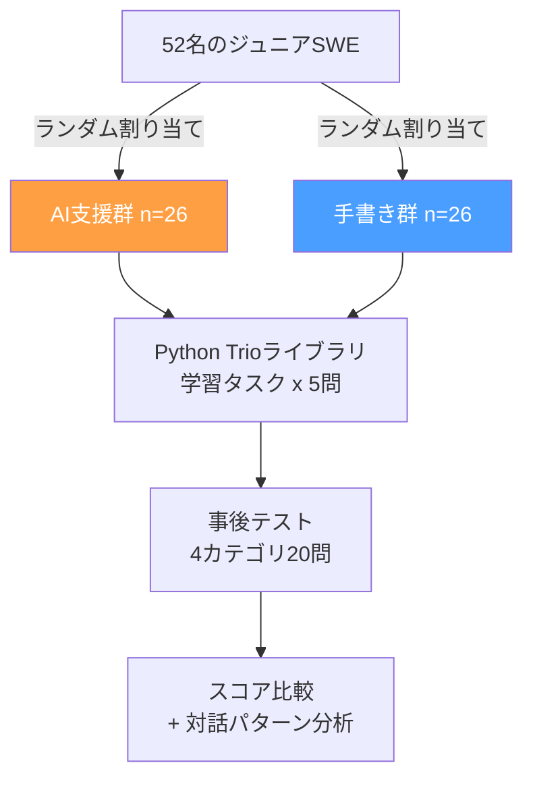
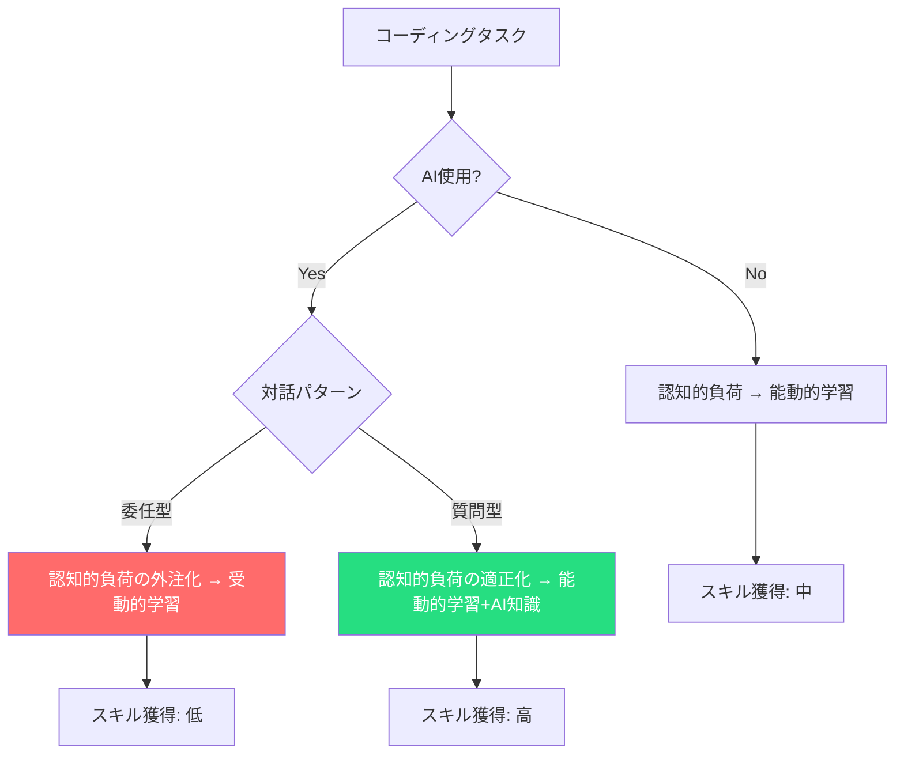

本記事は [How AI assistance impacts the formation of coding skills](https://www.anthropic.com/research/AI-assistance-coding-skills)（Anthropic Research, 2026年1月）の解説記事です。

## ブログ概要（Summary）

Anthropic Researchは、AIコーディングアシスタントが開発者のスキル習得にどのような影響を与えるかを、ランダム化比較試験（RCT）で検証した。52名のジュニアソフトウェアエンジニアを対象に、Python Trioライブラリの学習課題をAIアシスタント有り/無しの2群に分けて実施した結果、AI支援群は事後テストで**17%低いスコア**を記録した。ただし、AIとの「対話パターン」が成績を大きく左右し、「概念的な質問をする」「コード生成後に説明を求める」といった戦略的な使い方をした参加者は、手書き群と同等以上のスコアを達成したと報告されている。

この記事は [Zenn記事: Claude Codeコマンド完全ガイド：3モード×30+コマンドで開発効率を最大化する](https://zenn.dev/0h_n0/articles/63cf472bad8ea7) の深掘りです。

## 情報源

- **種別**: 企業テックブログ（Anthropic Research）
- **URL**: [https://www.anthropic.com/research/AI-assistance-coding-skills](https://www.anthropic.com/research/AI-assistance-coding-skills)
- **組織**: Anthropic
- **発表日**: 2026年1月29日

## 技術的背景（Technical Background）

AIコーディングアシスタント（GitHub Copilot、Claude Code、Cursor等）の普及に伴い、「AIが開発者の生産性を向上させる一方で、スキル形成を阻害するのではないか」という懸念が広がっている。GitHubの2024年調査では開発者の78%がAIツールで生産性が向上したと回答する一方、教育現場では「AIに頼りすぎた学生が基礎スキルを習得できない」という報告が増加していた。

しかし、この問題を厳密なRCTで検証した研究は限られていた。多くの既存研究は観察研究や自己申告ベースであり、「AIを使う人はもともとスキルが低い」というセレクションバイアスの可能性を排除できていなかった。Anthropicの本研究は、ランダム割り当てによりこのバイアスを排除し、AI支援とスキル形成の因果関係を定量的に評価した点で学術的に重要な位置づけにある。

この研究はClaude Codeのようなツールを日常的に使用する開発者にとって、「どのようにAIツールを使えばスキル退化を防げるか」という実践的な指針を提供する。

## 実装アーキテクチャ（Architecture）

### 実験設計

Anthropicの研究チームが実施した実験の構成を以下に示す。

**参加者**: 52名のジュニアソフトウェアエンジニア（Python経験あり、Trioライブラリ未経験）

**学習タスク**: Python Trioライブラリ（非同期プログラミング）を使用した5つのコーディングタスク。Trioを選択した理由は、参加者全員にとって新規の技術であり、事前知識の差を排除できるためである。

**事後テスト**: 4カテゴリ（デバッグ、コード読解、コード記述、概念理解）×各5問、計20問。制限時間は60分、AI支援なし。

### 評価指標

研究チームは以下の指標で評価を行った。

$$
\text{Score} = \frac{\text{正答数}}{\text{総問題数}} \times 100
$$

- **手書き群平均**: 67%（$n=26$, $SD=15.2$）
- **AI支援群平均**: 50%（$n=26$, $SD=18.7$）
- **差**: 17ポイント（Cohen's $d = 0.738$, $p = 0.01$）

ここで、Cohen's $d$は効果量の指標であり、$d = 0.738$は「中〜大程度の効果」に分類される。$p = 0.01$は統計的有意性を示す。

$$
d = \frac{\bar{X}_{\text{手書き}} - \bar{X}_{\text{AI}}}{\sqrt{\frac{s_1^2 + s_2^2}{2}}} = \frac{67 - 50}{\sqrt{\frac{15.2^2 + 18.7^2}{2}}} \approx 0.738
$$

ここで、$\bar{X}$は各群の平均スコア、$s_1, s_2$は各群の標準偏差である。

## パフォーマンス最適化（Performance）

### 対話パターン分析

本研究の核心は、「AI支援の有無」だけでなく、「AIとの対話の質」がスキル形成を左右するという発見にある。著者らは、AI支援群26名の対話ログを質的分析し、6つの対話パターンを特定した。

**低スコアの対話パターン**（平均40%未満）:

| パターン | 人数 | 平均スコア | 特徴 |
|----------|------|-----------|------|
| AI完全委任 | 4 | <30% | コード生成を丸投げ、内容を確認せずコピー |
| 段階的依存 | 4 | ~35% | 最初は自力で取り組むが、途中からAIに完全委任 |
| 反復的AIデバッグ | 4 | ~38% | エラーが出るたびにAIに修正を依頼、自力での理解を放棄 |

**高スコアの対話パターン**（平均65%以上）:

| パターン | 人数 | 平均スコア | 特徴 |
|----------|------|-----------|------|
| 生成→理解 | 2 | ~68% | AIにコード生成させた後、説明を求めて理解を深める |
| ハイブリッド | 3 | ~70% | コードと説明を同時に要求し、理解しながら進める |
| 概念的質問 | 7 | ~72% | AIには概念的な質問のみ行い、コードは自力で記述 |

**重要な知見**: AI支援群の中でも「概念的質問」パターンを採用した7名は、手書き群の平均（67%）を上回るスコアを達成している。つまり、AIの使い方次第では、スキル形成を促進する可能性がある。

### Claude Codeのモード設計との関連

この研究結果は、Claude CodeのPlan Modeの設計思想と直接関連する。Zenn記事で紹介されているように、Plan Modeでは「読み取り専用」でコードベースを探索し、計画を立てることができる。これは「概念的質問」パターンに対応し、開発者が思考を放棄せずにAIの知識を活用する仕組みと言える。

| Claude Codeモード | 対応する対話パターン | スキル形成への影響 |
|-------------------|---------------------|-------------------|
| Plan Mode | 概念的質問 | 促進（思考を維持） |
| Normal Mode | ハイブリッド | 中立（承認プロセスあり） |
| Auto-Accept Mode | AI完全委任リスク | 阻害リスク（承認スキップ） |

## 運用での学び（Production Lessons）

### 組織レベルでの対策

Anthropicの研究結果は、企業がAIコーディングツールを導入する際の運用指針を提供する。

**1. 段階的導入**: ジュニア開発者にはPlan Modeでの使用を推奨し、Auto-Accept Modeの使用を制限する。CLAUDE.md等の設定ファイルでデフォルトモードを制御できる。

**2. コードレビューの強化**: AIが生成したコードに対して、「なぜこのコードが正しいのか」を説明させるレビュープロセスを導入する。これは「生成→理解」パターンを組織的に促進する仕組みである。

**3. スキル評価の定期実施**: AI支援なしでのコーディングテストを定期的に実施し、スキル退化の兆候を早期に検知する。

### 個人レベルでの対策

**Claudeへの質問の仕方を変える**: 「このバグを直して」ではなく「このバグの原因を説明して」と質問することで、学習効果が大幅に向上する。Claude Codeの`/plan`コマンドを活用し、実装前にアーキテクチャの理解を深めることが推奨される。

**意識的なモード切替**: Zenn記事で紹介されているShift+Tabによるモード切替を活用し、探索フェーズではPlan Mode、実装フェーズではNormal Modeを使い分けることで、思考の放棄を防ぐ。

## 学術研究との関連（Academic Connection）

- **Cognition and Technology Group (1990)**: 「Anchored Instruction」理論は、問題解決の文脈で学習することの重要性を示しており、AIツールが文脈を奪うことでスキル形成が阻害されるという本研究の結果と整合する
- **Kalyuga et al. (2003)**: 「Expertise Reversal Effect」は、初心者に有効な支援が上級者にはかえって阻害になることを示しており、AIツールの最適な使い方が経験レベルによって異なるという本研究の含意を理論的に裏付ける
- **Vaithilingam et al. (2022)**: 「Expectation vs. Experience: Evaluating the Usability of Code Generation Tools」は、コード生成ツールの使いやすさと学習効果のギャップを指摘しており、本研究はその因果関係を実験的に確認したものと位置づけられる

## カテゴリ別テスト結果の詳細分析

Anthropicの研究では、事後テストを4カテゴリに分けて評価している。カテゴリ別の結果は以下の通りである。

### デバッグスキル

著者らの報告によると、AI支援群と手書き群の差が最も大きかったのがデバッグカテゴリである。AI完全委任パターンの参加者は、エラーメッセージの読み方やスタックトレースの追い方を学ぶ機会を逃しており、デバッグスキルが特に低い傾向を示した。

一方、「概念的質問」パターンの参加者は、エラーが発生した際に「このエラーの意味は何か」と質問することで、デバッグの思考プロセスを学習していた。Claude Codeの`/debug`コマンドは、このアプローチを支援する機能と言える。

### コード読解スキル

コード読解においても、AI支援群は手書き群より低いスコアを記録した。著者らは、AI支援群がコードを「書く」のではなく「受け取る」立場に回ることで、コードの構造や制御フローを能動的に読む訓練が不足したと分析している。

これはClaude Codeの文脈では、`@`プレフィックスでファイルを参照する際に、自分でコードを読む前にAIに説明を求めてしまうパターンに対応する。Zenn記事で紹介されている`!`プレフィックス（Bashモード）でテストを実行しながらコードの動作を確認する方法は、能動的な読解を促進する。

### コード記述スキル

AI支援群の中でも、「ハイブリッド」パターン（コードと説明を同時に要求）を採用した参加者は、コード記述カテゴリで手書き群と同等のスコアを達成した。これは、AIの出力を単にコピーするのではなく、理解しながら自分のコードに組み込む姿勢が重要であることを示唆している。

### 概念理解スキル

概念理解カテゴリでは、「概念的質問」パターンの参加者が手書き群を5ポイント上回る結果となった。AIを「教師」として活用し、概念の説明を繰り返し求めることで、教科書やドキュメントを読むよりも効率的に概念を獲得できた可能性がある。

## 実験手法の詳細と統計的検定

### ランダム化の妥当性検証

著者らは、実験の内的妥当性を確保するために、ランダム割り当て後の2群間で以下の共変量のバランスを確認している。

- **プログラミング経験年数**: AI支援群（平均2.3年）vs 手書き群（平均2.5年）— $p = 0.72$で差なし
- **Python習熟度（自己評価）**: 両群とも中央値4/7 — Mann-Whitney U検定で$p = 0.81$
- **非同期プログラミング経験**: 両群とも未経験者が85%以上

### 多重検定補正

4カテゴリでの検定に対して、著者らはBonferroni補正を適用している。有意水準$\alpha = 0.05$を4で割り、$\alpha' = 0.0125$を各検定の閾値としている。

$$
\alpha' = \frac{\alpha}{k} = \frac{0.05}{4} = 0.0125
$$

ここで$k$は検定の数（4カテゴリ）である。総合スコアの差（$p = 0.01$）はBonferroni補正後も有意であった。

### 効果量の解釈

Cohen's $d = 0.738$は、教育研究の文脈では実質的に大きな効果である。参考として、教育介入のメタ分析（Hattie, 2009）では、$d = 0.40$以上が「教育的に意味のある効果」とされている。

## スキル形成モデルの理論的枠組み

著者らは、AIコーディング支援がスキル形成に影響を与えるメカニズムとして、以下の理論的モデルを提案している。

このモデルは、認知負荷理論（Cognitive Load Theory; Sweller, 1988）に基づいている。コーディングタスクにおける認知的負荷には以下の3種類がある:

1. **内在的負荷（Intrinsic Load）**: タスク自体の複雑さ。AIの使用で変化しない
2. **外在的負荷（Extraneous Load）**: 不適切な教材・ツールによる無駄な負荷。AIがエラーメッセージの解読を支援することで削減可能
3. **本質的負荷（Germane Load）**: スキーマ構築のための負荷。AI委任パターンではこの負荷が外注化され、学習が阻害される

「概念的質問」パターンが効果的な理由は、外在的負荷を削減しつつ本質的負荷を維持するためであると著者らは分析している。

## まとめと実践への示唆

Anthropicの研究は、AIコーディング支援が開発者のスキル形成に対して二面的な影響を持つことを定量的に示した。AI支援群は平均17%低いスコアを記録した一方、「概念的質問」パターンを採用した参加者は手書き群を上回るスコアを達成している。

実践的な示唆として、Claude Codeを使用する際は以下を心がけるとよい:

1. **Plan Modeを積極的に活用する**: コードを書く前に、問題の理解を深める。これは認知負荷理論における「本質的負荷の維持」に対応する
2. **「なぜ」を問う**: AIにコードを生成させた後、「なぜこの実装が正しいのか」を説明させる。「生成→理解」パターンの実践である
3. **Auto-Accept Modeを安易に使わない**: 承認プロセスは学習機会でもある。Normal Modeの「要承認」は意図的な設計である
4. **`/compact`で振り返る**: 長いセッションの後に`/compact`を使って要約を確認し、自分が何を学んだかを意識する

ただし、本研究にはいくつかの制約がある。サンプルサイズが52名と比較的小さいこと、対象が特定のライブラリ（Trio）に限定されていること、長期的なスキル変化（数ヶ月〜数年）は測定されていないことに留意する必要がある。また、参加者はジュニアエンジニアに限定されており、シニアエンジニアにおける影響は未検証である。

## 参考文献

- **Blog URL**: [https://www.anthropic.com/research/AI-assistance-coding-skills](https://www.anthropic.com/research/AI-assistance-coding-skills)
- **Related Zenn article**: [https://zenn.dev/0h_n0/articles/63cf472bad8ea7](https://zenn.dev/0h_n0/articles/63cf472bad8ea7)

---

:::message
この記事はAI（Claude Code）により自動生成されました。内容の正確性についてはAnthropic公式ブログで検証していますが、詳細な数値については原文もご確認ください。
:::
