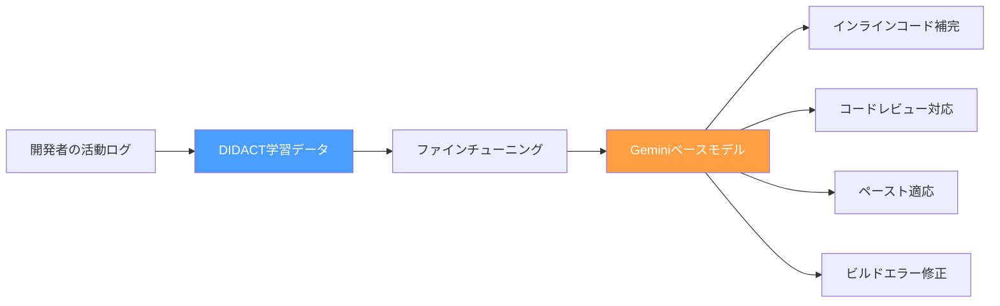
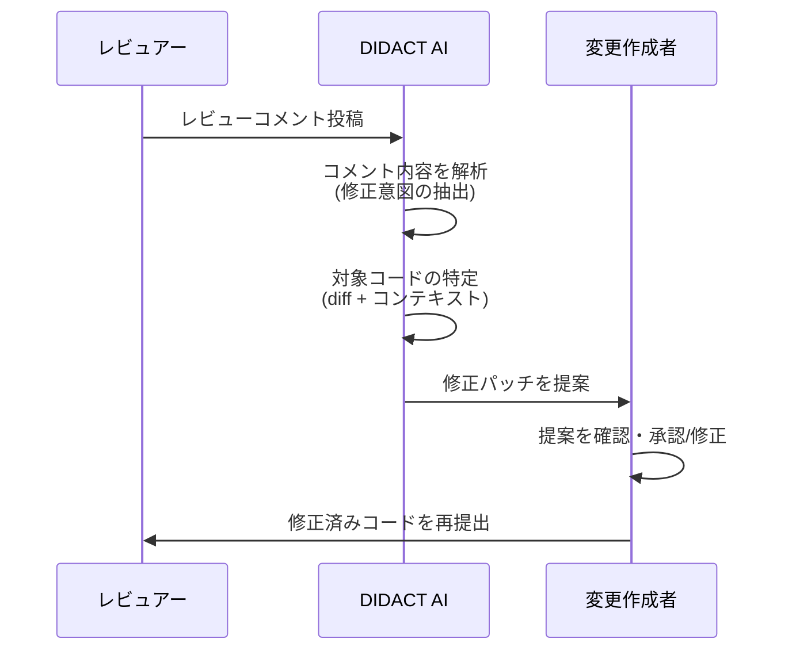

本記事は [AI in software engineering at Google: Progress and the path ahead](https://research.google/blog/ai-in-software-engineering-at-google-progress-and-the-path-ahead/)（Satish Chandra & Maxim Tabachnyk, Google Research, 2024年6月）の解説記事です。

## ブログ概要（Summary）

Googleのソフトウェアエンジニアリング部門は、MLベースのコード補完機能を大規模に展開し、エンジニアによる受け入れ率37%、「コード文字の50%以上がAI支援で完成される」という成果を報告している。さらに、コードレビューコメントの8%以上がAI支援で対応され、ペーストコードの自動適応やビルドエラーの修正予測など、コーディング以外の開発プロセスにもAIの適用を拡大している。これらの成果は「DIDACT」と呼ばれる手法に基づいており、ソフトウェア開発活動の豊富な高品質ログ（コード編集履歴、ビルド結果、コードレビューコメント）をファインチューニングに活用している。

この記事は [Zenn記事: Claude Codeコマンド完全ガイド：3モード×30+コマンドで開発効率を最大化する](https://zenn.dev/0h_n0/articles/63cf472bad8ea7) の深掘りです。

## 情報源

- **種別**: 企業テックブログ（Google Research）
- **URL**: [https://research.google/blog/ai-in-software-engineering-at-google-progress-and-the-path-ahead/](https://research.google/blog/ai-in-software-engineering-at-google-progress-and-the-path-ahead/)
- **組織**: Google Research（Principal Engineer: Satish Chandra, Senior Staff SWE: Maxim Tabachnyk）
- **発表日**: 2024年6月6日

## 技術的背景（Technical Background）

Googleのソフトウェアエンジニアリング組織は、数万人のエンジニアが数十億行のコードを管理する世界最大級の開発環境を運用している。この規模の開発環境にAIツールを導入する場合、学術研究やスタートアップとは異なる課題が生じる。

まず、コードベースの規模と複雑さが桁違いである。Google内部のモノリポジトリ（monorepo）には数十億行のコードが存在し、1つのファイルの変更が数百のサービスに影響を与える可能性がある。次に、品質基準が厳格である。すべてのコード変更はコードレビューを経る必要があり、テストカバレッジの要件も高い。最後に、プライバシーとセキュリティの制約がある。内部コードを外部APIに送信できないため、モデルの内部ホスティングが必須である。

この背景は、Claude Codeのような外部AIツールとは対照的である。Claude Codeはクラウド上のAPIを呼び出すため、コードの送信に関するセキュリティポリシーが適用される。一方で、Googleのアプローチは「モデルを内部にデプロイする」ことで、この制約を回避している。

## 実装アーキテクチャ（Architecture）

### DIDACT: 開発活動ログによるファインチューニング

GoogleのAIコーディングツールの中核を成す技術が「DIDACT（Dynamic Integrated Developer ACTivity）」である。著者らの報告によると、DIDACTは従来のコード生成モデル（コード→コードの対）ではなく、開発活動全体のログ（コード編集、ビルド結果、コードレビューコメント、テスト結果）をファインチューニングデータとして活用する。

**DIDACTの学習データ構成**:

| データソース | 内容 | 活用先 |
|-------------|------|--------|
| コード編集履歴 | 変更前→変更後のdiff、エディタ操作ログ | インライン補完、コード変換 |
| ビルド結果 | ビルドエラーメッセージ、修正パッチ | ビルドエラー修正予測 |
| コードレビュー | レビューコメント＋対応パッチ | レビューコメント対応 |
| テスト結果 | テスト失敗ログ、修正diff | テスト修正提案 |

### 展開済みアプリケーション群

Googleは、DIDACTベースのモデルを以下の4つのアプリケーションとして展開している。

**1. インラインコード補完（受け入れ率37%）**

最も広く使われているアプリケーション。エンジニアがコードを書いている途中で、次の行やブロックを予測して提案する。著者らは、受け入れ率37%に達し、「コード文字の50%以上がAI支援で完成される」と報告している。

受け入れ率の定義は以下の通りである:

$$
\text{AcceptanceRate} = \frac{\text{受け入れた提案数}}{\text{表示した提案数}} \times 100
$$

**2. コードレビューコメント対応（8%以上）**

コードレビューで指摘されたコメントに対して、修正パッチを自動生成する。著者らによると、レビューコメントの8%以上がAI支援で対応されている。

**3. ペーストコード適応（IDE内の約2%）**

Stack Overflowやドキュメントからコードをペーストした際、周囲のコンテキストに合わせて変数名やスタイルを自動調整する。

**4. ビルドエラー修正予測**

コンパイルエラーが発生した際、エラーメッセージと関連コードを分析して修正パッチを提案する。

### モデル改善の方法論

著者らは、モデル性能を継続的に改善するための3つの軸を報告している。

**モデルの大規模化**: より大きなファウンデーションモデル（Geminiシリーズ）を使用することで、コード理解と生成能力が向上する。

**使用ログによるチューニング**: 「受け入れ/拒否/修正」のログをフィードバックデータとして活用し、ユーザーの好みに適応させる。これは強化学習の報酬信号に相当する。

$$
r(s, a) = \begin{cases}
+1 & \text{if suggestion accepted} \\
-0.5 & \text{if suggestion rejected} \\
+0.5 & \text{if suggestion modified then accepted}
\end{cases}
$$

ここで$r(s, a)$は状態$s$（コードコンテキスト）でアクション$a$（提案）を取った場合の報酬である。

**コンテキスト拡充**: ファイル単体ではなく、インポートグラフ、変更履歴、関連テストファイルなど、より広いコンテキストをモデルに提供する。

## パフォーマンス最適化（Performance）

### 測定指標と成果

著者らが報告している主要な指標を以下にまとめる。

| 指標 | 値 | 備考 |
|------|-----|------|
| インライン補完受け入れ率 | 37% | 全表示提案に対する受け入れ割合 |
| AI支援によるコード文字比率 | 50%+ | 受け入れられた提案に含まれる文字数 |
| コードレビューAI対応率 | 8%+ | レビューコメントへのAI生成パッチ |
| 推論レイテンシ | 数百ms | IDE内でのリアルタイム補完 |

### レイテンシ最適化

リアルタイムのコード補完では、レイテンシが開発者体験を大きく左右する。著者らは、以下の最適化手法を適用していると報告している。

- **投機的デコード（Speculative Decoding）**: 小型のドラフトモデルで複数トークンを先読みし、大型モデルで検証する
- **プレフィックスキャッシング**: ファイルの先頭部分（インポート文等）のKVキャッシュを再利用する
- **適応的提案長**: ユーザーの入力速度に応じて、提案の長さ（1行 vs 複数行）を動的に調整する

## 運用での学び（Production Lessons）

### 評価指標の設計

著者らは、「受け入れ率」だけではAIツールの価値を十分に測れないと指摘している。重要なのは以下の3つの側面である。

**1. 生産性指標**: コード変更の速度（time-to-commit）、レビュー完了時間
**2. 品質指標**: バグ導入率、テストカバレッジ、セキュリティ脆弱性の検出率
**3. 満足度指標**: 開発者の主観的な満足度（NPS、定期アンケート）

Claude Codeの`/cost`コマンドや`/stats`コマンドは、個人レベルでの使用量可視化を提供するが、組織レベルでの品質指標の追跡は別途設計する必要がある。

### スケーリング課題

数万人のエンジニアにリアルタイムのコード補完を提供するためには、以下のインフラ課題が存在する。

- **GPU計算資源**: 推論用のGPUクラスタの確保とコスト管理
- **モデルの更新**: 新バージョンのモデルを無停止でデプロイする仕組み
- **A/Bテスト**: モデルの変更が生産性指標に与える影響を統計的に評価するフレームワーク

### セキュリティとプライバシー

Google内部でのモデルホスティングにより、コードの外部送信リスクは排除されている。しかし、モデル自体が学習データからコードを記憶し、意図せず出力する「メモリゼーション」リスクは残る。著者らは、出力フィルタリングとデータ除去（deduplication）で対処していると述べている。

## Claude Codeとの比較分析

GoogleのアプローチとClaude Codeの設計思想を比較すると、以下の相違点と共通点が浮かび上がる。

| 観点 | Google内部ツール | Claude Code |
|------|-----------------|-------------|
| **ホスティング** | 内部デプロイ（セキュリティ優先） | クラウドAPI（アクセス性優先） |
| **コンテキスト** | モノリポ全体のインデックス | ローカルリポジトリ + WebSearch |
| **フィードバックループ** | 受け入れ/拒否ログ → RL | ユーザー承認/拒否 → 権限モード |
| **カスタマイズ** | 社内ポリシーで制御 | CLAUDE.md / Skills / Hooks |
| **対象範囲** | コード補完〜レビュー対応 | 探索〜実装〜テスト〜Git操作 |

Zenn記事で紹介されているClaude Codeの`/compact`コマンド（コンテキスト圧縮）は、Googleのプレフィックスキャッシングと類似した課題（文脈窓の効率的活用）に対する異なるアプローチである。Googleはモデル側でキャッシュを管理するのに対し、Claude Codeはユーザーが明示的に圧縮を指示する設計を採用している。

## 開発プロセス統合の技術的詳細

### コードレビューAI対応のワークフロー

著者らが報告するコードレビューAI対応の技術的フローを以下に示す。

このワークフローでは、AIがレビューコメントの「意図」を理解する必要がある。例えば、「この変数名はわかりにくい」というコメントに対して、AIは変数のスコープと用途を分析し、より適切な名前を提案する。著者らによると、提案の品質は「コメントの具体性」に大きく依存し、具体的な改善方向を示すコメント（例: 「snake_caseに統一して」）では受け入れ率が高くなる。

### ペーストコード適応の実装

開発者がStack Overflowやドキュメントからコードをペーストする際、以下の自動適応が行われる。

1. **変数名の置換**: ペースト先のスコープ内の変数名に合わせて、ペーストコード内の変数名を自動変更
2. **スタイル統一**: インデント（タブ vs スペース）、命名規則（camelCase vs snake_case）を周囲のコードに合わせる
3. **インポート追加**: ペーストコードが使用するライブラリのimport文を自動追加

この機能はIDE操作の約2%で適用されていると著者らは報告している。割合は低いが、ペースト操作自体が頻度の低いイベントであるため、ペースト操作に対する適用率としては高い水準である。

### ビルドエラー修正予測の手法

ビルドエラー修正予測では、以下の入力からパッチを生成する。

$$
\text{patch} = f(\text{error\_msg}, \text{changed\_files}, \text{build\_config})
$$

ここで$f$はDIDACTでファインチューニングされたモデルである。入力にはエラーメッセージだけでなく、直近のコード変更（diff）とビルド設定（依存関係情報）が含まれる。著者らは、型エラーやインポートエラーなど構文的に明確なエラーでは修正精度が高い一方、論理エラーや実行時エラーの修正は困難であると報告している。

## 学術研究との関連（Academic Connection）

- **DIDACT (Fried et al., 2023)**: 本ブログの基盤となる手法。開発活動全体をシーケンスモデリングの対象とし、コード編集・ビルド・レビューの統一的な学習を実現している
- **Copilot研究 (Peng et al., 2023)**: GitHub Copilotの生産性影響を測定したRCT。タスク完了速度が55.8%向上したが、コード品質への影響は限定的であったと報告されている。Googleの大規模展開データはこの知見を補完する
- **AlphaCode (Li et al., 2022)**: 競技プログラミングでのコード生成に特化した研究。Googleの内部ツールとは異なり、単一ファイルの問題解決に焦点を当てている

## まとめと実践への示唆

GoogleのAIソフトウェアエンジニアリングへの取り組みは、大規模組織におけるAIコーディングツールの展開が「段階的かつ多面的」であることを示している。コード補完（受け入れ率37%）から始まり、レビュー対応、ペースト適応、ビルド修正と、開発プロセスの各段階にAIが浸透している。

特にDIDACTのアプローチ — 開発活動ログ全体をファインチューニングデータとして活用する — は、Claude CodeのSkills/Hooks/Memoryによるカスタマイズと思想が共通している。どちらも「ユーザーの行動パターンを学習して適応する」という方向性を持つ。

今後の展望として、著者らはエージェント型の大規模自動化（Issue解決、リファクタリング、テスト生成の自動化）を挙げている。Claude Codeの`--agents`フラグやAgent Teamsはまさにこの方向性の具体的実装であり、Googleの研究と呼応する形で進化していると言える。

## 参考文献

- **Blog URL**: [https://research.google/blog/ai-in-software-engineering-at-google-progress-and-the-path-ahead/](https://research.google/blog/ai-in-software-engineering-at-google-progress-and-the-path-ahead/)
- **ML-Enhanced Code Completion**: [https://research.google/blog/ml-enhanced-code-completion-improves-developer-productivity/](https://research.google/blog/ml-enhanced-code-completion-improves-developer-productivity/)
- **Related Zenn article**: [https://zenn.dev/0h_n0/articles/63cf472bad8ea7](https://zenn.dev/0h_n0/articles/63cf472bad8ea7)

---

:::message
この記事はAI（Claude Code）により自動生成されました。内容の正確性についてはGoogle Research公式ブログで検証していますが、詳細な数値については原文もご確認ください。
:::
