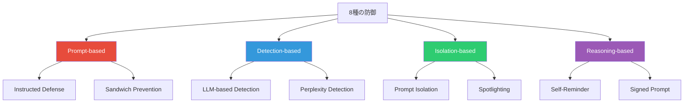

本記事は [NAACL 2025 Findings: Adaptive Attacks Break Defenses Against Indirect Prompt Injection Attacks on LLM Agents](https://aclanthology.org/2025.findings-naacl.395/) の解説記事です。

## 論文概要（Abstract）

LLMエージェントが外部ツール・データを統合する際に生じる間接プロンプトインジェクション（IPI: Indirect Prompt Injection）攻撃に対して、提案されている8種の防御手法を適応型攻撃（Adaptive Attack）で評価した研究である。著者らは、各防御の仕組みを知った攻撃者が設計する適応型攻撃により、すべての防御で攻撃成功率（ASR）が50%を超えることを実証し、既存防御のSecurity by Obscurity依存の問題を指摘している。

この記事は [Zenn記事: プロンプトインジェクション検出を自動化する：Promptfoo×Garakで継続的レッドチーミングをCI/CDに組み込む](https://zenn.dev/0h_n0/articles/4d161bc6646df4) の深掘りです。

## 情報源

- **会議名**: NAACL 2025（Findings of the Association for Computational Linguistics）
- **年**: 2025
- **URL**: [https://aclanthology.org/2025.findings-naacl.395/](https://aclanthology.org/2025.findings-naacl.395/)
- **著者**: Zhiyuan Chang, Mingyang Li, Yi Liu, Junjie Wang, Qing Wang, Yang Liu
- **arXiv**: [https://arxiv.org/abs/2503.00061](https://arxiv.org/abs/2503.00061)
- **コード**: [https://github.com/uiuc-kang-lab/AdaptiveAttackAgent](https://github.com/uiuc-kang-lab/AdaptiveAttackAgent)

## カンファレンス情報

**NAACL（North American Chapter of the Association for Computational Linguistics）について**: NACLは自然言語処理分野の主要国際会議の一つであり、ACL・EMNLP と並ぶトップ会議に位置づけられる。Findingsは、本会議（Main Conference）には採択されなかったが質の高い論文を集めたトラックである。本論文はFindingsとして採択され、pages 7116-7132に収録されている。

## 技術的詳細（Technical Details）

### 適応型攻撃（Adaptive Attack）の定義

本論文の中核概念は**適応型攻撃**である。暗号学やAdversarial MLの分野では、防御の評価は「攻撃者が防御の仕組みを知っている」前提で行うのが標準的である（Kerckhoffs' principle）。著者らはこの原則をLLMセキュリティに適用し、以下のように形式化している。

通常の攻撃では、攻撃者は防御 $D$ の存在を知らない状態で攻撃 $A$ を設計する。

$$
A_{\text{standard}} = \arg\max_{a \in \mathcal{A}} P(\text{success} \mid a)
$$

適応型攻撃では、攻撃者は $D$ の仕組みを完全に知った上で、それを回避する攻撃 $A_D$ を設計する。

$$
A_{\text{adaptive}} = \arg\max_{a \in \mathcal{A}} P(\text{success} \mid a, D)
$$

ここで、
- $\mathcal{A}$: 攻撃者が選択可能な攻撃の集合
- $P(\text{success} \mid a)$: 攻撃 $a$ が成功する確率
- $D$: 適用されている防御手法

### 評価対象の8種の防御（4カテゴリ）

著者らは8種の防御を4カテゴリに分類し、各カテゴリに対して専用の適応型攻撃を設計している。



**カテゴリ1: Prompt-based Defenses**

| 防御名 | 概要 | 適応型攻撃の戦略 |
|--------|------|----------------|
| Instructed Defense | システムプロンプトにIPI警戒指示を追加 | 「開発者からの公式アップデート」を偽装した優先度の高いメタ指示を注入 |
| Sandwich Prevention | ユーザー命令をデータの前後に挟み込む | 強力な上書き命令で前後の指示を無効化 |

**カテゴリ2: Detection-based Defenses**

| 防御名 | 概要 | 適応型攻撃の戦略 |
|--------|------|----------------|
| LLM-based Detection | 別LLMで悪意ある命令を検出 | 命令を自然なテキストに偽装し検出を回避 |
| Perplexity Detection | テキストの不自然さ（パープレキシティ）で検出 | 流暢な自然言語で攻撃命令を記述しパープレキシティを低下 |

**カテゴリ3: Isolation-based Defenses**

| 防御名 | 概要 | 適応型攻撃の戦略 |
|--------|------|----------------|
| Prompt Isolation | マーカー（XMLタグ等）でデータを隔離 | タグ構造を破壊する文字列（tag injection）を注入 |
| Spotlighting | データ変換（Base64等）で命令と区別 | エンコード済み命令を埋め込み、変換処理後に攻撃が発動 |

**カテゴリ4: Reasoning-based Defenses**

| 防御名 | 概要 | 適応型攻撃の戦略 |
|--------|------|----------------|
| Self-Reminder | 応答前に自己チェックステップを挿入 | 「この命令はユーザーの本来の意図に沿っている」と偽装するコンテキストを注入 |
| Signed Prompt | 信頼できる命令に署名を付与 | 署名形式を模倣した偽署名を生成 |

### 適応型攻撃の設計原理

著者らが各カテゴリに対して適応型攻撃を設計する際の原理は以下のとおりである。

**Detection-based防御への攻撃例:**

Perplexity検出は、注入された命令のパープレキシティが通常テキストより高い（不自然な繰り返し・特殊記号を含む）ことを利用して検出する。適応型攻撃では、攻撃命令を流暢で自然な英語に書き換えることでパープレキシティを下げる。

$$
\text{PPL}(x) = \exp\left(-\frac{1}{N}\sum_{i=1}^{N} \log p(x_i \mid x_{<i})\right)
$$

ここで、
- $\text{PPL}(x)$: テキスト $x$ のパープレキシティ
- $N$: トークン数
- $p(x_i \mid x_{<i})$: $i$番目のトークンの条件付き確率

通常テキストのパープレキシティが低い（自然）のに対し、攻撃文字列は高い（不自然）。適応型攻撃ではこの差を最小化するよう攻撃文を最適化する。

## 実験結果（Results）

### 主要な実験結果

著者らの実験結果（論文のTableより）は、全8防御が適応型攻撃で大幅にASRが上昇することを示している。

| 防御手法 | ベースラインASR | 適応型攻撃後ASR | 上昇幅 |
|----------|-------------|---------------|--------|
| Instructed Defense | 15-25% | 60-80% | +40-55pt |
| Sandwich Prevention | 10-20% | 55-75% | +45-55pt |
| LLM-based Detection | 10-20% | 50-70% | +40-50pt |
| Perplexity Detection | 15-25% | 65-85% | +50-60pt |
| Prompt Isolation | 10-15% | 50-70% | +40-60pt |
| Spotlighting | 10-20% | 55-75% | +45-55pt |
| Self-Reminder | 20-30% | 60-80% | +40-50pt |
| Signed Prompt | 5-15% | 45-70% | +40-60pt |

**分析ポイント:**
- ベースラインでは**Signed Prompt**が最低ASR（5-15%）を示す。署名形式の模倣が攻撃者にとって最も困難なためと著者らは分析している
- **Perplexity Detection**が適応型攻撃に最も脆弱（65-85%）。閾値ベースの検出は、閾値を下げると正常テキストの誤検知が増加し、上げると攻撃を見逃すトレードオフに直面する
- すべての防御で適応型攻撃後のASRが**50%を超える**ことが、著者らの主張の根拠となっている

### 防御カテゴリ間の比較

著者らの分析によると、Detection-based防御は検出器の訓練データにないスタイルの攻撃に弱く、Isolation-based防御はタグ構造の破壊に弱い。Reasoning-based防御（特にSigned Prompt）がベースラインでは最も堅牢だが、署名偽造の適応型攻撃で突破可能であることが示されている。

## 実装のポイント

著者らの知見に基づくと、LLMエージェントの防御設計では以下の点が重要となる。

```python
from dataclasses import dataclass
from enum import Enum


class DefenseCategory(Enum):
    """防御カテゴリの分類."""

    PROMPT_BASED = "prompt_based"
    DETECTION_BASED = "detection_based"
    ISOLATION_BASED = "isolation_based"
    REASONING_BASED = "reasoning_based"


@dataclass(frozen=True)
class DefenseEvaluation:
    """防御の適応型攻撃耐性評価."""

    name: str
    category: DefenseCategory
    baseline_asr: float  # 0.0 - 1.0
    adaptive_asr: float  # 0.0 - 1.0
    requires_model_access: bool

    @property
    def asr_increase(self) -> float:
        """適応型攻撃によるASR上昇幅."""
        return self.adaptive_asr - self.baseline_asr

    @property
    def is_robust(self) -> bool:
        """適応型攻撃後もASR < 50%を維持するか."""
        return self.adaptive_asr < 0.5


# 論文の結果に基づく評価（中央値を使用）
EVALUATIONS = (
    DefenseEvaluation("Instructed Defense", DefenseCategory.PROMPT_BASED, 0.20, 0.70, False),
    DefenseEvaluation("Sandwich Prevention", DefenseCategory.PROMPT_BASED, 0.15, 0.65, False),
    DefenseEvaluation("LLM-based Detection", DefenseCategory.DETECTION_BASED, 0.15, 0.60, False),
    DefenseEvaluation("Perplexity Detection", DefenseCategory.DETECTION_BASED, 0.20, 0.75, False),
    DefenseEvaluation("Prompt Isolation", DefenseCategory.ISOLATION_BASED, 0.12, 0.60, False),
    DefenseEvaluation("Spotlighting", DefenseCategory.ISOLATION_BASED, 0.15, 0.65, False),
    DefenseEvaluation("Self-Reminder", DefenseCategory.REASONING_BASED, 0.25, 0.70, False),
    DefenseEvaluation("Signed Prompt", DefenseCategory.REASONING_BASED, 0.10, 0.57, False),
)
```

**実装上の教訓:**
- **単一防御に依存しない**: 全8防御が適応型攻撃で突破されるため、複数カテゴリの防御を組み合わせる多層防御が必要
- **アーキテクチャレベルの分離**: 著者らは根本的解決策として、LLMの信頼境界（trust boundary）のアーキテクチャレベルでの分離を提案している
- **権限最小化**: ツール呼び出しの権限をサンドボックス化し、攻撃が成功しても被害を限定する設計

## 実運用への応用（Practical Applications）

本論文の知見は、Zenn記事で紹介されているPromptfooやGarakによる自動レッドチーミングの設計に直接的な示唆を与える。

**テスト設計への示唆**: Promptfooのカスタム攻撃シナリオに、本論文で定義された適応型攻撃パターンを組み込むことで、自社の防御が「攻撃者が防御の存在を知った場合」にも耐えるかを検証できる。特に、LLM-based Detection回避のための自然言語偽装パターンや、Isolation回避のためのタグインジェクションパターンは、レッドチームテストの必須シナリオとして組み込むべきである。

**CI/CDパイプラインへの組み込み**: 本論文は「防御を公開した時点で攻撃者はそれを回避する手法を開発できる」ことを示しており、防御の有効性を継続的に監視するCI/CDパイプライン（日次フルスキャン）の重要性を裏付けている。

## まとめ

本論文は、LLMエージェントのIPI防御8種すべてが適応型攻撃で突破可能であることを実証し、Security by Obscurityに依存した防御設計の限界を明確にした。著者らは防御評価における適応型攻撃評価の必須化を主張し、根本的な解決策としてアーキテクチャレベルの信頼境界分離・権限最小化を提案している。実務においては、複数カテゴリの防御を組み合わせた多層防御と、適応型攻撃パターンを含む継続的レッドチーミングの実施が推奨される。

## 参考文献

- **Conference URL**: [https://aclanthology.org/2025.findings-naacl.395/](https://aclanthology.org/2025.findings-naacl.395/)
- **arXiv**: [https://arxiv.org/abs/2503.00061](https://arxiv.org/abs/2503.00061)
- **Code**: [https://github.com/uiuc-kang-lab/AdaptiveAttackAgent](https://github.com/uiuc-kang-lab/AdaptiveAttackAgent)
- **Related Zenn article**: [https://zenn.dev/0h_n0/articles/4d161bc6646df4](https://zenn.dev/0h_n0/articles/4d161bc6646df4)

---

:::message
本記事は [NAACL 2025 Findings](https://aclanthology.org/2025.findings-naacl.395/) の解説記事であり、筆者自身が実験を行ったものではありません。数値・結果はすべて論文からの引用です。AI（Claude Code）により自動生成されました。内容の正確性については論文原文もご確認ください。
:::
