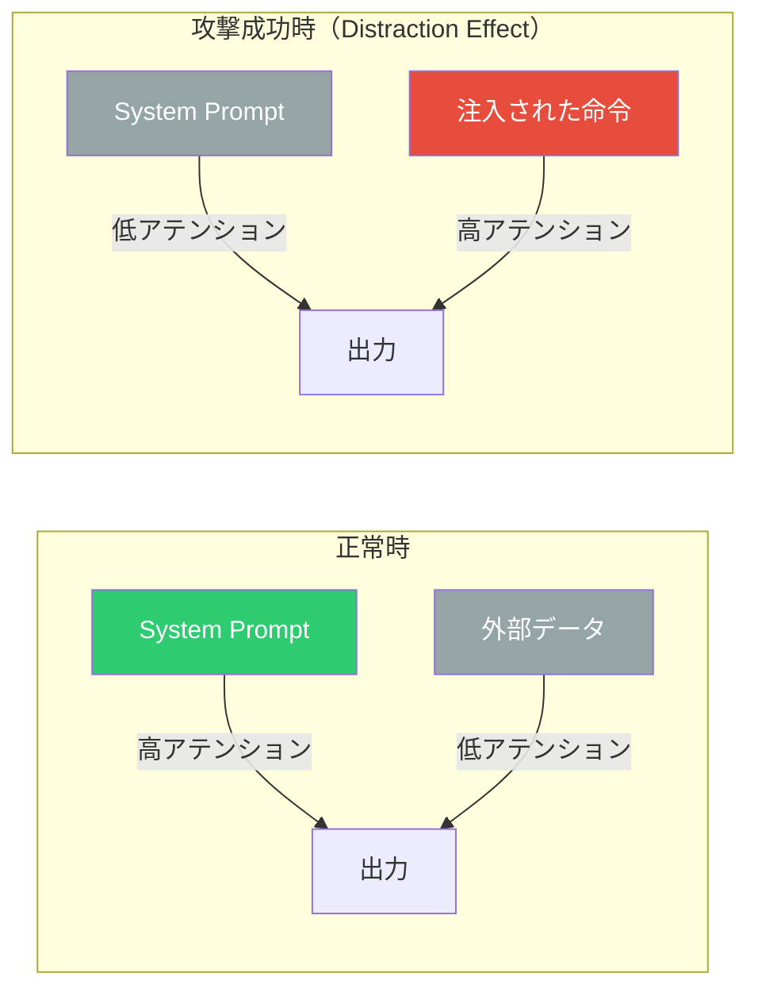

本記事は [NAACL 2025 Findings: Attention Tracker: Detecting Prompt Injection Attacks in LLMs](https://aclanthology.org/2025.findings-naacl.123/) の解説記事です。

## 論文概要（Abstract）

本論文は、LLMのアテンション機構を分析することでプロンプトインジェクション攻撃を検出するゼロショット手法「Attention Tracker」を提案している。著者らは「Distraction Effect（注意散漫効果）」という現象を発見・定式化した。これは、プロンプトインジェクション攻撃が成功する際に、特定のアテンションヘッドが本来のシステム命令から注入された悪意ある命令へとフォーカスを移す現象である。Attention Trackerはこのアテンションシフトを追跡することで、追加学習なしにAUROC 0.89-0.94の検出精度を達成すると著者らは報告している。

この記事は [Zenn記事: プロンプトインジェクション検出を自動化する：Promptfoo×Garakで継続的レッドチーミングをCI/CDに組み込む](https://zenn.dev/0h_n0/articles/4d161bc6646df4) の深掘りです。

## 情報源

- **会議名**: NAACL 2025（Findings of the Association for Computational Linguistics）
- **年**: 2025
- **URL**: [https://aclanthology.org/2025.findings-naacl.123/](https://aclanthology.org/2025.findings-naacl.123/)
- **著者**: Kuo-Han Hung, Ching-Yun Ko, Ambrish Rawat, I-Hsin Chung, Winston H. Hsu, Pin-Yu Chen
- **arXiv**: [https://arxiv.org/abs/2411.00348](https://arxiv.org/abs/2411.00348)
- **コード**: [https://github.com/khhung-906/Attention-Tracker](https://github.com/khhung-906/Attention-Tracker)

## カンファレンス情報

**NAACLについて**: NAACL（North American Chapter of the Association for Computational Linguistics）は自然言語処理のトップ会議の一つ。本論文はFindingsトラックとして採択されている。著者陣にはIBM Research（Pin-Yu Chen）や台湾大学（Winston H. Hsu）のメンバーが含まれ、LLMセキュリティとアテンション解析の両分野の知見が統合されている。

## 技術的詳細（Technical Details）

### Distraction Effect（注意散漫効果）の発見

本論文の中核的貢献は「Distraction Effect」の発見と定式化である。

**正常推論時のアテンション分布:**
通常のLLM推論では、デコーダーのアテンションヘッドはシステムプロンプト（$S$）とユーザー命令（$I$）の領域に高い重みを割り当てる。

$$
\alpha_{\text{normal}}(S) = \frac{\sum_{i \in S} a_i}{\sum_{j=1}^{N} a_j} \gg \alpha_{\text{normal}}(D)
$$

ここで、
- $a_i$: トークン $i$ に対するアテンション重み
- $S$: システムプロンプトのトークン位置集合
- $D$: データチャネル（外部コンテキスト）のトークン位置集合
- $N$: 入力トークン列の全長

**攻撃成功時のアテンション分布:**
プロンプトインジェクション攻撃が成功する際、アテンションが本来の命令から注入された命令 $I_a \subset D$ へと移る。

$$
\alpha_{\text{attack}}(S) \ll \alpha_{\text{attack}}(I_a)
$$

この**アテンション比率の逆転**がDistraction Effectである。



### Attention Trackerのアルゴリズム

Attention Trackerは以下の手順で動作する。

**ステップ1: アテンション重みの収集**

推論時に各トランスフォーマー層・各ヘッドのアテンション行列を取得する。

$$
\mathbf{A}^{(l,h)} \in \mathbb{R}^{N \times N}
$$

ここで $l$ は層インデックス、$h$ はヘッドインデックスである。

**ステップ2: System Prompt領域へのアテンション比率の算出**

最終数層（後半25%）のアテンションを用いて、出力トークン位置からSystem Prompt領域へのアテンション比率を計算する。

$$
r^{(l,h)} = \frac{\sum_{i \in S} \mathbf{A}^{(l,h)}_{[\text{last}, i]}}{\sum_{j=1}^{N} \mathbf{A}^{(l,h)}_{[\text{last}, j]}}
$$

ここで $\mathbf{A}^{(l,h)}_{[\text{last}, i]}$ は最終出力位置からトークン $i$ へのアテンション重みである。

**ステップ3: 閾値判定**

複数層・複数ヘッドの比率を集約し、閾値と比較する。

$$
\text{score} = \frac{1}{|L| \cdot |H|} \sum_{l \in L} \sum_{h \in H} r^{(l,h)}
$$

$$
\text{prediction} = \begin{cases} \text{benign} & \text{if score} \geq \tau \\ \text{injection} & \text{if score} < \tau \end{cases}
$$

ここで $\tau$ はモデル固有の検出閾値である。

### 実装コード

```python
import torch
from transformers import AutoModelForCausalLM, AutoTokenizer


def compute_attention_tracker_score(
    model: AutoModelForCausalLM,
    tokenizer: AutoTokenizer,
    input_text: str,
    system_prompt_end_pos: int,
    num_layers_to_use: int = 8,
) -> float:
    """Attention Trackerのスコアを計算する.

    Args:
        model: HuggingFace CausalLMモデル
        tokenizer: トークナイザー
        input_text: 入力テキスト（System Prompt + データを含む）
        system_prompt_end_pos: System Promptの終了トークン位置
        num_layers_to_use: 使用する後半層の数

    Returns:
        検出スコア（低いほど攻撃の可能性が高い）
    """
    inputs = tokenizer(input_text, return_tensors="pt")
    input_ids = inputs["input_ids"].to(model.device)

    with torch.no_grad():
        outputs = model(input_ids, output_attentions=True)

    # 後半層のアテンションを取得
    all_attentions = outputs.attentions
    num_layers = len(all_attentions)
    target_layers = all_attentions[num_layers - num_layers_to_use:]

    scores: list[float] = []
    for layer_attn in target_layers:
        # layer_attn: (batch=1, num_heads, seq_len, seq_len)
        # 最終トークン位置からSystem Prompt領域へのアテンション比率
        last_token_attn = layer_attn[0, :, -1, :]  # (num_heads, seq_len)

        sys_attn = last_token_attn[:, :system_prompt_end_pos].sum(dim=1)
        total_attn = last_token_attn.sum(dim=1)

        ratio = (sys_attn / total_attn).mean().item()
        scores.append(ratio)

    return sum(scores) / len(scores)
```

## 実験結果（Results）

### 主要な検出性能

論文の実験結果より、Attention Trackerは既存手法を大幅に上回る検出精度を示している。

| 指標 | Attention Tracker | PPL-based | NLI-based |
|------|------------------|-----------|-----------|
| AUROC（BIPIA） | **0.89 - 0.94** | 0.61 - 0.72 | 0.70 - 0.78 |
| TPR（FPR=5%時） | **0.82以上** | 0.40前後 | 0.55前後 |
| 追加学習 | **不要（ゼロショット）** | 不要 | 不要 |
| 推論オーバーヘッド | **< 5%増** | PPL計算 | NLIモデル追加推論 |

著者らによると、Llama-3-70Bでの検出精度が最高値に達し、モデルサイズと検出精度に正の相関が確認されている。AUROC改善幅は既存手法比で最大10.0ポイントと報告されている。

### モデル別の結果

| モデル | AUROC | 備考 |
|--------|-------|------|
| Llama-3-70B | 0.94 | 最高精度 |
| Llama-3-8B | 0.91 | 小規模でも高精度 |
| Mistral-7B | 0.89 | 最小モデルでも実用水準 |
| Vicuna-13B | 0.90 | 中規模で安定した性能 |

著者らは、小規模モデル（7-8Bパラメータ）でもAUROC 0.89以上を達成しており、エッジデプロイメントでも実用可能であると述べている。

### 既存手法との比較

**PPL-based Detection**: テキストのパープレキシティ（不自然さ）で検出する手法。自然な文体で書かれた攻撃テキストは低パープレキシティを示すため、検出が困難。

**NLI-based Detection**: 自然言語推論モデルでシステム命令と入力テキストの矛盾を検出する手法。暗黙的な攻撃命令に対して感度が低い。

**Attention Tracker**: 入力テキストの意味内容ではなく、モデルの内部的な注意配分パターンを分析するため、攻撃テキストの表面的な特徴に依存しない。これが高い検出精度の理由であると著者らは分析している。

## 実装のポイント

**依存関係:**
- PyTorch + HuggingFace Transformers（`transformers >= 4.38` 推奨、Llama-3対応のため）
- `output_attentions=True` が必須（メモリ使用量がシーケンス長の2乗で増加する点に注意）

**ハイパーパラメータの設定:**
- **使用層**: 後半25%の層が最も信頼性が高いと論文で報告されている（例: 32層モデルなら層24-32）
- **閾値 $\tau$**: モデルアーキテクチャ依存。Llama-3-8BとMistral-7Bで異なる最適値
- **ヘッド集約**: 全ヘッドの平均 vs 選択ヘッドでは、選択ヘッドが若干優位

**制約事項:**
- **Closed-sourceモデル非対応**: GPT-4やClaude等のAPIモデルはアテンション重みを外部に公開しないため、本手法は原理的に適用不可
- **長文コンテキストでの精度劣化**: 著者らによると、4Kトークンを超える入力ではアテンション分散が均等化し、AUROCが0.05-0.08低下する傾向がある
- **メモリ使用量**: `output_attentions=True` はシーケンス長の2乗に比例するメモリを消費するため、長いコンテキストでの本番運用ではメモリ最適化が必要

## 実運用への応用（Practical Applications）

Attention Trackerは、Zenn記事で紹介されているPromptfooやGarakとは異なるアプローチで防御層を追加する。

**相補的な防御アーキテクチャ:**
- **Promptfoo/Garak**: 攻撃パターンを事前に定義してテストする（既知の攻撃パターンDBに依存）
- **Attention Tracker**: モデルの内部状態を監視して未知の攻撃パターンも検出可能（ただしOSSモデル限定）

**実装パターン:**
OSSモデル（Llama-3、Mistral等）を自社サーバで運用しているRAGパイプラインでは、推論時にAttention Trackerをリアルタイム検出レイヤーとして組み込み、検出スコアが閾値を下回った場合にリクエストをブロックまたはフラグ付けする運用が考えられる。

**CI/CDとの統合:**
Garakのプローブでモデル層の脆弱性をスキャンし、Attention Trackerで本番環境のリアルタイム監視を行うことで、テスト時と運用時の両方でカバレッジを確保できる。

## 関連研究（Related Work）

- **BIPIA Benchmark（Microsoft Research）**: 間接プロンプトインジェクション攻撃の主要ベンチマーク。Attention Trackerの主評価データセットとして使用されている
- **AgentDojo（2408.11697）**: LLMエージェントに対するプロンプトインジェクション攻撃の動的評価環境。追加テストシナリオの確保に活用可能
- **PPL-based Detection**: パープレキシティベースの検出手法。Attention Trackerの比較対象としてAUROCで15-30ポイントの差が報告されている

## まとめと今後の展望

Attention Trackerは、LLMの内部アテンションパターンを活用した初のゼロショットプロンプトインジェクション検出手法であり、追加学習なしにAUROC 0.89-0.94の検出精度を達成している。Distraction Effectの発見は、LLMがプロンプトインジェクションに「騙される」メカニズムの理解に貢献しており、今後の防御手法設計の基盤となり得る。ただし、Closed-sourceモデルへの非対応、長文コンテキストでの精度劣化、適応型攻撃（アテンション回避型）への耐性が未評価という限界があり、これらは今後の課題である。

## 参考文献

- **Conference URL**: [https://aclanthology.org/2025.findings-naacl.123/](https://aclanthology.org/2025.findings-naacl.123/)
- **arXiv**: [https://arxiv.org/abs/2411.00348](https://arxiv.org/abs/2411.00348)
- **Code**: [https://github.com/khhung-906/Attention-Tracker](https://github.com/khhung-906/Attention-Tracker)
- **Related Zenn article**: [https://zenn.dev/0h_n0/articles/4d161bc6646df4](https://zenn.dev/0h_n0/articles/4d161bc6646df4)

---

:::message
本記事は [NAACL 2025 Findings](https://aclanthology.org/2025.findings-naacl.123/) の解説記事であり、筆者自身が実験を行ったものではありません。数値・結果はすべて論文からの引用です。AI（Claude Code）により自動生成されました。内容の正確性については論文原文もご確認ください。
:::
