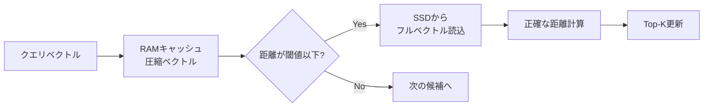

本記事は [NeurIPS 2019 "DiskANN: Fast Accurate Billion-point Nearest Neighbor Search on a Single Node"](https://papers.nips.cc/paper/9527-rand-nsg-fast-accurate-billion-point-nearest-neighbor-search-on-a-single-node) の解説記事です。

## 論文概要（Abstract）

DiskANNは、Microsoft Researchが開発したSSD最適化型の近似最近傍探索（ANN）システムである。著者ら（Subramanya, Devvrit, Kadekodi, Krishnaswamy, Simhadri）は、**64GB RAMと安価なSSD**を搭載した単一ワークステーションで**10億ベクトルの高精度検索**を実現するアーキテクチャを提案した。核となるのは**Vamanaグラフ**と呼ばれる新しいグラフベースインデックスで、既存手法（HNSW, NSG）よりもディスクI/Oに最適化された構造を持つ。SIFT1Bデータセット（10億ベクトル、128次元）において、**5,000+ QPS、3ms未満の平均レイテンシ、95%以上の1-recall@1**を報告している。

この記事は [Zenn記事: ベクトルDBインデックス戦略の実測比較：HNSW・IVF・DiskANNのチューニング実践](https://zenn.dev/0h_n0/articles/e1bcdc3fb9b21e) の深掘りです。

## 情報源

- **会議名**: NeurIPS（Neural Information Processing Systems）
- **年**: 2019
- **URL**: [https://papers.nips.cc/paper/9527](https://papers.nips.cc/paper/9527-rand-nsg-fast-accurate-billion-point-nearest-neighbor-search-on-a-single-node)
- **著者**: Suhas Jayaram Subramanya, Devvrit, Rohan Kadekodi, Ravishankar Krishnaswamy, Harsha Vardhan Simhadri（Microsoft Research India）
- **コード**: [https://github.com/microsoft/DiskANN](https://github.com/microsoft/DiskANN)

## カンファレンス情報

**NeurIPS**（旧称NIPS）は機械学習・人工知能分野の最高峰会議の一つであり、2019年の採択率は約21%（1,428/6,743件）であった。DiskANNは、大規模ベクトル検索の実用性を大きく前進させた論文として高い評価を受けた。発表以降、Microsoft BingやMicrosoft 365など大規模本番システムでの採用が報告されている。

## 技術的詳細（Technical Details）

### 課題設定：ANN検索の3要件

著者らは、大規模ANN検索が満たすべき3つの要件を定義している。

1. **高い再現率（High Recall）**: 95%以上の1-recall@k
2. **低レイテンシ（Low Latency）**: ミリ秒オーダーのクエリ応答
3. **高密度（High Density）**: 単一ノードで処理可能なベクトル数の最大化

論文執筆時点（2019年）では、これら3要件を同時に満たす手法は存在しなかった。HNSWは要件1・2を満たすが、全データをRAMに載せる必要があるため要件3で劣る。IVF系手法はメモリ効率に優れるが、10億規模で95%以上のrecallを達成するのが困難であった。

### Vamanaグラフアルゴリズム

DiskANNの核となるVamanaグラフは、**単一レイヤーのフラットグラフ**である。HNSWの多層構造とは対照的に、Vamanaは全ノードを1つのレイヤーに配置し、SSDアクセスパターンに最適化されたエッジ構造を持つ。

#### 構築アルゴリズム

Vamanaグラフの構築は以下の手順で行われる。

```python
def vamana_construction(
    dataset: list[list[float]],
    r: int,
    l: int,
    alpha: float,
) -> dict[int, list[int]]:
    """Vamanaグラフを構築する。

    Args:
        dataset: ベクトルデータセット（n個のd次元ベクトル）
        r: 各ノードの最大辺数（degree bound）
        l: 構築時の探索リストサイズ
        alpha: 枝刈りパラメータ（>= 1.0）

    Returns:
        graph: 隣接リスト表現のグラフ
    """
    n = len(dataset)
    # 全データの重心をメディオイド（medoid）として計算
    medoid = find_medoid(dataset)

    # ランダム初期グラフ（各ノードにr個のランダムエッジ）
    graph = initialize_random_graph(n, r)

    # ランダムな順序でノードを処理
    for node in random_permutation(range(n)):
        # メディオイドからGreedySearchを実行
        visited, candidates = greedy_search(graph, dataset, medoid, dataset[node], l)

        # RobustPruneでエッジを選択
        graph[node] = robust_prune(dataset, node, candidates, alpha, r)

        # 逆辺の追加（双方向グラフを維持）
        for neighbor in graph[node]:
            if len(graph[neighbor]) < r:
                graph[neighbor].append(node)
            else:
                graph[neighbor] = robust_prune(
                    dataset, neighbor, graph[neighbor] + [node], alpha, r
                )

    return graph
```

#### RobustPrune：多様性優先の枝刈り

Vamanaの性能を決定づける重要な要素が**RobustPrune**（ロバスト枝刈り）アルゴリズムである。

```python
def robust_prune(
    dataset: list[list[float]],
    node: int,
    candidates: list[int],
    alpha: float,
    r: int,
) -> list[int]:
    """多様性を考慮したエッジ枝刈りを行う。

    Args:
        node: 対象ノード
        candidates: 近傍候補リスト
        alpha: 枝刈りの強度パラメータ（>= 1.0）
        r: 最大エッジ数

    Returns:
        選択されたエッジのリスト
    """
    neighbors = []
    # 候補を距離でソート
    candidates = sorted(candidates, key=lambda c: dist(dataset[node], dataset[c]))

    for candidate in candidates:
        if len(neighbors) >= r:
            break
        # alphaによる枝刈り条件
        should_add = True
        for existing in neighbors:
            if alpha * dist(dataset[existing], dataset[candidate]) <= dist(dataset[node], dataset[candidate]):
                should_add = False
                break
        if should_add:
            neighbors.append(candidate)

    return neighbors
```

パラメータ $\alpha$ はエッジの多様性を制御する。$\alpha = 1.0$ の場合、既存の近傍よりも候補に近い近傍が既にあれば候補を棄却する（HNSWのヒューリスティックと同様）。$\alpha > 1.0$（著者らは $\alpha = 1.2$ を推奨）にすると、より多様な方向への辺を残し、グラフの探索半径を拡大する。

数式で表現すると、候補ノード $p'$ は以下の条件を満たす既存近傍 $p^*$ が存在する場合に棄却される。

$$
\alpha \cdot d(p^*, p') \leq d(p, p')
$$

ここで、$p$ は対象ノード、$d(\cdot, \cdot)$ は距離関数である。

#### Vamanaの設計原理

Vamanaが既存手法と異なる点は以下の3つである。

1. **メディオイドを起点とする構築**: データセットの重心に最も近い点（メディオイド）を探索のエントリポイントとする。これにより、任意のクエリからの最悪ケースのホップ数を最小化する
2. **2パス構築**: $\alpha = 1.0$ で初期グラフを構築後、$\alpha = 1.2$ で再構築する。第1パスで近距離の辺を確保し、第2パスで遠距離の辺を追加する
3. **探索半径の最小化**: HNSWの階層構造に比べ、Vamanaは各ノードからメディオイドまでのグラフ距離が短い。これがSSD上での探索時のランダムアクセス回数を削減する

### SSDインデックスの構造

DiskANNのSSD上のデータレイアウトは以下の構成である。

```
SSD上のレイアウト:
┌──────────────────────────────────────────┐
│ ノード0: [ベクトル(128次元)] [隣接ノードID(最大R個)] │
│ ノード1: [ベクトル(128次元)] [隣接ノードID(最大R個)] │
│ ...                                      │
│ ノードn: [ベクトル(128次元)] [隣接ノードID(最大R個)] │
└──────────────────────────────────────────┘
各ノードのデータは1つのSSDセクタ（4KB）に収まるよう配置
```



**RAM上のキャッシュ**: Product Quantization（PQ）で圧縮されたベクトルの全件をRAMに保持する。これにより、SSDアクセス前に粗い距離計算でフィルタリングが可能になる。

**SSD上のフルインデックス**: フルベクトルとVamanaグラフの隣接リストをSSDに格納する。NVMe SSDのランダム読み取り性能（IOPS 100K以上）を前提とした設計である。

### 探索アルゴリズム

```python
def diskann_search(
    pq_vectors: list,      # RAM上: PQ圧縮ベクトル
    ssd_index,             # SSD上: フルインデックス
    query: list[float],
    medoid: int,
    w: int,                # ビーム幅
    top_k: int = 10,
) -> list[int]:
    """DiskANNの探索を実行する。

    Args:
        pq_vectors: PQ圧縮ベクトル（RAM常駐）
        ssd_index: SSD上のフルインデックス
        query: クエリベクトル
        medoid: エントリポイント（メディオイド）
        w: ビーム幅（候補リストサイズ）
        top_k: 返す近傍数

    Returns:
        top_k個の近傍ノードIDリスト
    """
    candidates = PriorityQueue()
    candidates.push(medoid, pq_distance(query, pq_vectors[medoid]))
    visited = set()
    results = []

    while not candidates.empty():
        node, pq_dist = candidates.pop()
        if node in visited:
            continue
        visited.add(node)

        # SSDからフルベクトルと隣接リストを読み込み
        full_vector, neighbors = ssd_index.read(node)
        exact_dist = exact_distance(query, full_vector)
        results.append((node, exact_dist))

        # 隣接ノードをPQ距離で評価してキューに追加
        for neighbor in neighbors:
            if neighbor not in visited:
                approx_dist = pq_distance(query, pq_vectors[neighbor])
                candidates.push(neighbor, approx_dist)

    return sorted(results, key=lambda r: r[1])[:top_k]
```

## 実験結果（Results）

### SIFT1Bデータセット

論文の中核的な実験結果は10億ベクトルのSIFT1B（128次元、L2距離）で得られている。著者らが報告している主要な数値は以下のとおりである。

| 指標 | DiskANN | FAISS (IVFOADC+G+P) | HNSW |
|------|---------|---------------------|------|
| 1-recall@1 | **95%+** | ~50% | 95%+ |
| 平均レイテンシ | **< 3ms** | ~10ms | < 1ms |
| QPS（16コア） | **> 5,000** | ~1,000 | > 10,000 |
| RAM使用量 | **64GB** | 64GB | **~500GB** |
| ノードあたり密度 | **5-10x（HNSW比）** | 中 | ベースライン |

DiskANNは、HNSW同等のrecall（95%+）を**RAM使用量約1/8**で達成している。レイテンシではHNSW（全データRAM）に劣るが、コスト効率の観点で大幅に優位である。

### メモリ効率の分析

10億ベクトル（128次元、float32）の場合、HNSWでは全ベクトルとグラフ構造をRAMに保持する必要がある。

$$
\text{HNSW RAM} \approx n \times (d \times 4 + M_0 \times 4) = 10^9 \times (128 \times 4 + 32 \times 4) \approx 640\text{GB}
$$

DiskANNではPQ圧縮ベクトルのみをRAMに保持する。

$$
\text{DiskANN RAM} \approx n \times \text{PQ\_bytes} = 10^9 \times 64 \approx 64\text{GB}
$$

ここで $d$ は次元数、$M_0$ はHNSWのLayer 0辺数、PQ\_bytesはProduct Quantization後のバイト数（128次元を64バイトに圧縮）である。

### 他手法との比較

著者らはNSG（Navigating Spreading-out Graph）とも比較を行っている。NSGはインメモリ設定でHNSWと競合する性能を持つが、SSD上での運用には最適化されていない。DiskANNのVamanaグラフは、NSGと同様のフラット構造を持ちつつ、SSDアクセスパターンに最適化された点が差別化要素である。

## 実装のポイント（Implementation）

### パラメータ推奨値

| パラメータ | 推奨値 | 説明 |
|-----------|-------|------|
| $R$（最大辺数） | 64-128 | SSD上のセクタサイズに合わせて調整 |
| $L$（構築時探索リストサイズ） | 100-200 | 大きいほどグラフ品質が向上、構築時間増加 |
| $\alpha$（枝刈りパラメータ） | 1.2 | 1.0より大きくすることでエッジの多様性を確保 |
| $W$（検索時ビーム幅） | 10-100 | recall要件に応じて調整 |
| PQ圧縮率 | 64バイト | 128次元の場合 |

### NVMe SSD要件

DiskANNの性能はSSDのランダム読み取りIOPSに直結する。著者らは以下を推奨している。

- **IOPS**: 100,000以上（NVMe SSD前提）
- **読み取りレイテンシ**: 100μs以下
- **帯域幅**: 1GB/s以上（シーケンシャルリード）

SATA SSD（IOPS ~10,000）ではレイテンシが10倍以上に悪化するため、NVMe SSDが事実上必須である。

### 2パス構築の重要性

Vamanaの2パス構築（$\alpha=1.0$ → $\alpha=1.2$）は性能に大きく影響する。著者らの実験によると、第1パスのみ（$\alpha=1.0$）ではrecallが約5%低下する。第2パスで追加される遠距離辺がグラフの接続性を高め、局所最適に陥りにくい探索を可能にしている。

## 実運用への応用（Practical Applications）

### コスト効率の優位性

Zenn記事のコスト試算セクションとの関連で、DiskANNのコスト効率は際立つ。

10億ベクトル（768次元）を運用する場合のZenn記事のコスト比較（概算）は以下のとおりであった。

| 構成 | 月額概算（AWS） |
|------|-------------|
| HNSW（RAM全載せ） | $15,000-20,000 |
| HNSW + Scalar量子化 | $5,000-7,000 |
| DiskANN | **$2,000-3,000** |
| IVF_PQ | $2,500-3,500 |

DiskANNはHNSW比で**約70-85%のコスト削減**を実現する。RAM単価がNVMe SSDの約10倍であるため、大規模データでのTCO差は拡大する。

### 2025-2026年の展開

DiskANN発表後の展開として、著者らのチームとMicrosoftは以下の製品統合を進めている。

- **SQL Server 2025**: DiskANNがネイティブ実装（2025年パブリックプレビュー開始）
- **Azure Database for PostgreSQL**: DiskANNベクトルインデックスが利用可能（2024年プレビュー開始）
- **Azure Cosmos DB for NoSQL**: DiskANNベースのベクトルインデックスを統合

これらの統合により、既存のリレーショナルDB上でDiskANNの恩恵を受けることが可能になっている。

### 適用判断の指針

Zenn記事のフローチャートと対応させると、DiskANNは以下の条件で第一選択となる。

1. **データ規模が10億件以上**: RAMコストが支配的になる規模
2. **p99レイテンシ50ms以内で許容**: サブミリ秒は不要だが十分高速な応答が求められる場合
3. **コスト最適化が最優先**: NVMe SSDのTCOがRAMの約1/10であることを活用
4. **NVMe SSDが利用可能**: IOPS 100K以上のストレージが前提

## 関連研究（Related Work）

- **HNSW（Malkov & Yashunin, 2018）**: 多層グラフ構造によるインメモリANN。DiskANNはHNSWの高recall性能を維持しつつ、メモリ要件を大幅に削減する設計
- **NSG（Fu et al., VLDB 2019）**: フラットグラフベースのANN。Vamanaグラフはこの系統に属するが、SSD I/Oパターンに最適化された構築・探索アルゴリズムを持つ
- **FAISS IVF（Johnson et al., 2019）**: Metaが開発したIVF系手法。DiskANNは10億規模でFAISSのrecall（~50%）を大きく上回る（95%+）
- **SPANN（Chen et al., NeurIPS 2021）**: DiskANNの後継研究の一つ。IVFとグラフの融合で外部メモリ検索を最適化
- **SPFresh（SOSP 2023）**: DiskANNの動的更新問題に対処する後継研究。インクリメンタル更新を効率的に行う手法を提案

## まとめと今後の展望

DiskANN（NeurIPS 2019）は、10億規模のベクトル検索を単一ノード（64GB RAM + NVMe SSD）で高精度に実現した画期的なシステムである。Vamanaグラフによるフラットなグラフ構造、PQ圧縮ベクトルのRAMキャッシュ、SSD最適化されたデータレイアウトの組み合わせにより、HNSWと同等のrecall（95%+）をRAM使用量約1/8で達成している。

発表から6年以上経った2026年現在、DiskANNはSQL Server 2025やAzure Database for PostgreSQLへの統合が進み、Rust実装への書き換えも行われている。10億規模のベクトル検索においてコスト効率を重視する場合、DiskANNは引き続き有力な選択肢であり、NVMe SSD性能の向上と相まってその優位性は拡大傾向にある。

## 参考文献

- **Conference URL**: [https://papers.nips.cc/paper/9527](https://papers.nips.cc/paper/9527-rand-nsg-fast-accurate-billion-point-nearest-neighbor-search-on-a-single-node)
- **Microsoft Research**: [https://www.microsoft.com/en-us/research/project/project-akupara-approximate-nearest-neighbor-search-for-large-scale-semantic-search/](https://www.microsoft.com/en-us/research/project/project-akupara-approximate-nearest-neighbor-search-for-large-scale-semantic-search/)
- **Code**: [https://github.com/microsoft/DiskANN](https://github.com/microsoft/DiskANN)
- **DiskANN Overview**: [https://harsha-simhadri.org/diskann-overview.html](https://harsha-simhadri.org/diskann-overview.html)
- **Related Zenn article**: [https://zenn.dev/0h_n0/articles/e1bcdc3fb9b21e](https://zenn.dev/0h_n0/articles/e1bcdc3fb9b21e)

---

:::message
この記事はAI（Claude Code）により自動生成されました。内容の正確性については原論文および公式ドキュメントを基に検証していますが、実際の利用時は原論文もご確認ください。
:::
