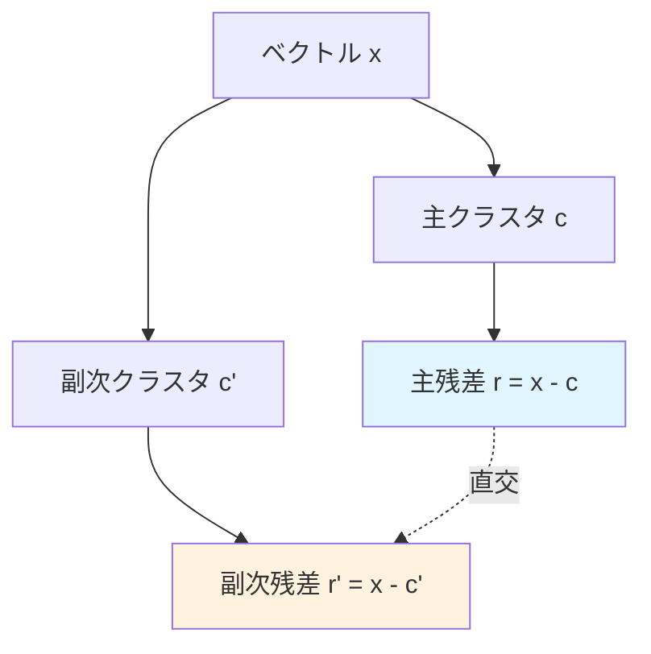

本記事は [Google Research Blog "SOAR: New algorithms for even faster vector search with ScaNN"](https://research.google/blog/soar-new-algorithms-for-even-faster-vector-search-with-scann/)（2024年4月10日公開）の解説記事です。対応する論文は [arXiv:2404.00774 "SOAR: Improved Indexing for Approximate Nearest Neighbor Search"](https://arxiv.org/abs/2404.00774)（NeurIPS 2023採択）である。

## ブログ概要（Summary）

SOAR（Spilling with Orthogonality-Amplified Residuals）は、Google Researchが開発したベクトル検索アルゴリズムであり、IVF（Inverted File）ベースの検索におけるクラスタリングの限界を数学的に解決する手法である。従来のIVFでは、各ベクトルを1つのクラスタにのみ割り当てるため、クエリベクトルと残差ベクトルが平行に近い場合に検索漏れが発生する。SOARは、各ベクトルを**複数のクラスタに冗長に割り当て**つつ、副次クラスタの残差が主クラスタの残差と**直交するよう最適化**する。この制御された冗長性により、ann-benchmarksのglove-100データセットで、比較ライブラリの**10倍以上のメモリと50倍以上のインデキシング時間**に匹敵するクエリ速度を達成すると報告されている。

この記事は [Zenn記事: ベクトルDBインデックス戦略の実測比較：HNSW・IVF・DiskANNのチューニング実践](https://zenn.dev/0h_n0/articles/e1bcdc3fb9b21e) の深掘りです。

## 情報源

- **種別**: 企業テックブログ
- **URL**: [https://research.google/blog/soar-new-algorithms-for-even-faster-vector-search-with-scann/](https://research.google/blog/soar-new-algorithms-for-even-faster-vector-search-with-scann/)
- **組織**: Google Research
- **著者**: Philip Sun, Ruiqi Guo（Software Engineers, Google Research）
- **発表日**: 2024年4月10日
- **論文**: arXiv:2404.00774（NeurIPS 2023採択）

## 技術的背景（Technical Background）

### IVFの検索漏れ問題

IVFベースの検索では、クエリベクトル $\mathbf{q}$ に最も近いクラスタセントロイドを特定し、そのクラスタ内のベクトルのみを探索する。しかし、この手法には構造的な欠陥がある。

ベクトル $\mathbf{x}$ がクラスタセントロイド $\mathbf{c}$ に割り当てられた場合、残差ベクトルは $\mathbf{r} = \mathbf{x} - \mathbf{c}$ である。クエリ $\mathbf{q}$ とベクトル $\mathbf{x}$ の内積は以下のように分解できる。

$$
\langle \mathbf{q}, \mathbf{x} \rangle = \langle \mathbf{q}, \mathbf{c} \rangle + \langle \mathbf{q}, \mathbf{r} \rangle
$$

IVFでは $\langle \mathbf{q}, \mathbf{c} \rangle$（クエリとセントロイドの内積）でクラスタを選択する。しかし、**$\mathbf{q}$ が $\mathbf{r}$ と平行に近い場合**、$\langle \mathbf{q}, \mathbf{r} \rangle$ の寄与が大きくなり、セントロイドとの内積 $\langle \mathbf{q}, \mathbf{c} \rangle$ だけでは正しいクラスタを選択できない。

具体的には、クエリ $\mathbf{q}$ と残差 $\mathbf{r}$ のなす角が小さい（ほぼ平行）場合、真の最近傍が属するクラスタのセントロイドとの内積が小さくなり、探索対象から漏れる可能性がある。

### 従来の対策：Spilling（スピリング）

この問題の従来の対策は**Spilling**（スピリング、またはマルチプローブ）である。各ベクトルを複数のクラスタに割り当て、検索時にnprobeクラスタを探索する。しかし、従来のSpillingは以下の課題を抱えていた。

1. **無制御な冗長性**: どのクラスタに割り当てるかの基準が距離のみであり、残差の方向を考慮しない
2. **メモリ増加**: 冗長割当てによりインデックスサイズが増加
3. **検索時間増加**: 探索するクラスタ数が増えることで検索コストも増加

## 実装アーキテクチャ（Architecture）

### SOARのアプローチ：直交性に基づく冗長性

SOARは「制御された冗長性」を導入する。各ベクトル $\mathbf{x}$ を**主クラスタ**と**副次クラスタ**に割り当てるが、副次クラスタは以下の条件を満たすように選択される。

**核心的なアイデア**: 副次クラスタのセントロイド $\mathbf{c}'$ は、副次残差 $\mathbf{r}' = \mathbf{x} - \mathbf{c}'$ が主残差 $\mathbf{r} = \mathbf{x} - \mathbf{c}$ と**直交する**（なるべく垂直になる）ように選ばれる。

$$
\mathbf{r} \perp \mathbf{r}' \quad \Leftrightarrow \quad \langle \mathbf{r}, \mathbf{r}' \rangle \approx 0
$$



**なぜ直交性が有効か**: クエリ $\mathbf{q}$ が主残差 $\mathbf{r}$ と平行に近い場合（= 主クラスタでの検索漏れリスクが高い場合）、$\mathbf{q}$ は副次残差 $\mathbf{r}'$ とほぼ直交する。これは、副次クラスタのセントロイド $\mathbf{c}'$ との内積 $\langle \mathbf{q}, \mathbf{c}' \rangle$ が比較的正確な距離推定を与えることを意味する。

数式で示すと、$\mathbf{q}$ が $\mathbf{r}$ にほぼ平行なら、

$$
\langle \mathbf{q}, \mathbf{r}' \rangle \approx 0 \quad (\text{直交性より})
$$

$$
\therefore \langle \mathbf{q}, \mathbf{x} \rangle = \langle \mathbf{q}, \mathbf{c}' \rangle + \langle \mathbf{q}, \mathbf{r}' \rangle \approx \langle \mathbf{q}, \mathbf{c}' \rangle
$$

つまり、副次クラスタではセントロイドとの内積が良い距離推定になる。

### SOARの損失関数

著者らは、副次クラスタ割当てを以下の損失関数の最小化として定式化している。

$$
\mathcal{L} = \sum_{i=1}^{n} \left( \lambda \| \mathbf{r}_i' \|^2 + (1 - \lambda) \frac{|\langle \mathbf{r}_i, \mathbf{r}_i' \rangle|^2}{\| \mathbf{r}_i \|^2 \| \mathbf{r}_i' \|^2} \right)
$$

ここで、
- $\mathbf{r}_i$ : ベクトル $i$ の主残差
- $\mathbf{r}_i'$ : ベクトル $i$ の副次残差
- $\lambda$ : 距離と直交性のトレードオフパラメータ

第1項 $\| \mathbf{r}_i' \|^2$ は副次残差のノルム（小さいほど量子化精度が高い）、第2項は主残差と副次残差のコサイン類似度の二乗（0に近いほど直交性が高い）である。$\lambda$ を調整することで、距離ベースの割当てと直交性ベースの割当てのバランスを制御する。

### ScaNNへの統合

SOARはGoogleのScaNN（Scalable Nearest Neighbors）ライブラリに統合されている。ScaNN自体は異方性ベクトル量子化（AVQ: Anisotropic Vector Quantization）を用いたANNライブラリであり、Google Cloud Vertex AI Vector SearchやAlloyDB ScaNN indexの基盤技術として利用されている。

```python
# ScaNN + SOARの使用例
import scann

# ScaNNインデックスの構築（SOARを含む設定）
searcher = (
    scann.scann_ops_pybind.builder(
        database_vectors,
        num_neighbors=10,
        distance_measure="dot_product"
    )
    .tree(
        num_leaves=2000,
        num_leaves_to_search=100,
        # SOARの冗長割当てを有効化
        training_sample_size=250000,
    )
    .score_ah(
        dimensions_per_block=2,
        anisotropic_quantization_threshold=0.2,
    )
    .reorder(200)  # リランキング候補数
    .build()
)

# 検索
neighbors, distances = searcher.search(query_vector, final_num_neighbors=10)
```

## パフォーマンス最適化（Performance）

### ann-benchmarksでの結果

ブログで報告されているann-benchmarks（glove-100データセット）での結果を以下にまとめる。

**ScaNN + SOARの優位性**:
- **クエリ速度/インデキシング速度のトレードオフ**: 比較ライブラリが同等のクエリ速度を達成するには、**10倍以上のメモリ**と**50倍以上のインデキシング時間**が必要とブログは述べている
- **メモリ効率**: SOARの冗長割当てによるインデックスサイズ増加は限定的（通常2倍未満）であり、それ以上のクエリ速度向上で補われる

### Big-ANN 2023 Competition

SOARを統合したScaNNは、NeurIPS Big-ANN Benchmarks 2023において以下のトラックで最高ランキングを獲得している。

1. **Out-of-Distribution（OOD）トラック**: クエリとデータベースの分布が異なるシナリオ
2. **Streaming トラック**: データの動的追加・削除があるシナリオ

これは、SOARの直交性ベースの冗長割当てが、分布の不一致に対してもロバストであることを示唆する。

### ハードウェアフレンドリーな設計

ブログでは、SOARが「ハードウェアフレンドリーなメモリアクセスパターン」を維持していることが強調されている。IVFのクラスタ単位でのデータアクセスは、シーケンシャルリードに近いパターンを持ち、CPU L2/L3キャッシュの効率的な活用が可能である。これはHNSWのランダムアクセスパターンと対照的であり、大規模データでのスループットに寄与する。

## 運用での学び（Production Lessons）

### Google Cloud製品との統合

SOARを含むScaNNは、以下のGoogle Cloudサービスで利用可能である。

1. **Vertex AI Vector Search**: フルマネージドベクトル検索サービス。ScaNNが基盤アルゴリズムとして使用されている
2. **AlloyDB ScaNN index**: PostgreSQL互換データベースAlloyDB上でScaNNインデックスを直接利用可能

AlloyDBのScaNNインデックスは、Zenn記事で解説されているpgvectorのHNSWインデックスと同じPostgreSQLエコシステム内の選択肢であり、特にGCP環境でのベクトル検索に有効である。

### Zenn記事との関連

Zenn記事ではIVFの課題として「データの追加・削除が頻繁なワークロードには不向き」と述べている。SOARのBig-ANN Streamingトラックでの高成績は、この課題に対するScaNNの取り組みを示している。また、IVFのnprobe設定（Zenn記事: `nprobe = nlist * 1-10%`）について、SOARの冗長割当てはnprobeの値を抑えつつ高いrecallを達成する効果がある。これは、検索時に探索するクラスタ数を減らしてもSOARの副次クラスタが検索漏れを補うためである。

### IVFの限界を超える設計思想

SOARの設計思想は「完全なクラスタリングは不可能」という前提に立ち、その限界を数学的に緩和するアプローチである。Zenn記事のIVFセクションで述べられている「フィルタ検索で2段階の絞り込みが可能」という特性と組み合わせることで、IVFベース検索のrecall-speedトレードオフを改善できる。

## 学術研究との関連（Academic Connection）

### ScaNNの学術的基盤

ScaNN自体はGuo et al. (2020) "Accelerating Large-Scale Inference with Anisotropic Vector Quantization"（ICML 2020）で提案された手法に基づく。異方性ベクトル量子化（AVQ）は、内積検索において量子化誤差の影響を方向に応じて重み付けする手法であり、従来のProduct Quantizationよりも高い精度を実現する。

### 関連研究

- **Multi-Probe LSH（Lv et al., 2007）**: ハッシュベース手法におけるマルチプローブの先行研究。SOARは類似のアイデアをIVFに適用
- **IMI（Inverted Multi-Index, Babenko & Lempitsky, 2012）**: 複数の量子化器を組み合わせたIVFの拡張。SOARとは直交する改善であり、組み合わせ可能
- **OPQ（Optimized Product Quantization, Ge et al., 2013）**: PQの部分空間分割を最適化する手法。SOARのクラスタ割当て最適化と相補的

## まとめと実践への示唆

SOARは、IVFベースのベクトル検索における構造的な検索漏れ問題を、直交性に基づく制御された冗長割当てで解決する手法である。主残差と副次残差の直交性を最適化することで、少ないnprobeで高いrecallを達成し、ann-benchmarksやBig-ANN 2023で優れた結果を示している。

Zenn記事で議論されているIVFインデックスのチューニング（nlist, nprobeの設定）において、SOARのアプローチは「nprobeを減らしてもrecallを維持する」方向の改善を提供する。ScaNNのPyPIパッケージ（`pip install scann`）やGoogle Cloud AlloyDBのScaNNインデックスを通じて利用可能であり、GCP環境でのベクトル検索を検討する際の有力な選択肢である。

## 参考文献

- **Blog URL**: [https://research.google/blog/soar-new-algorithms-for-even-faster-vector-search-with-scann/](https://research.google/blog/soar-new-algorithms-for-even-faster-vector-search-with-scann/)
- **arXiv**: [https://arxiv.org/abs/2404.00774](https://arxiv.org/abs/2404.00774)
- **ScaNN GitHub**: [https://github.com/google-research/google-research/tree/master/scann](https://github.com/google-research/google-research/tree/master/scann)
- **ScaNN原論文**: Guo et al., "Accelerating Large-Scale Inference with Anisotropic Vector Quantization," ICML, 2020
- **Vertex AI Vector Search**: [https://cloud.google.com/vertex-ai/docs/vector-search/overview](https://cloud.google.com/vertex-ai/docs/vector-search/overview)
- **Related Zenn article**: [https://zenn.dev/0h_n0/articles/e1bcdc3fb9b21e](https://zenn.dev/0h_n0/articles/e1bcdc3fb9b21e)

---

:::message
この記事はAI（Claude Code）により自動生成されました。内容の正確性については原ブログ記事および原論文を基に検証していますが、実際の利用時は公式ドキュメントもご確認ください。
:::
