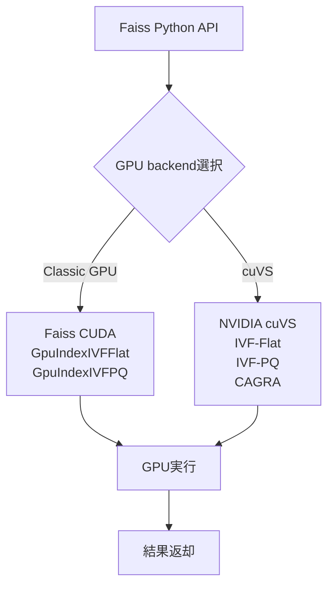

本記事は [Meta Engineering Blog "Accelerating GPU indexes in Faiss with NVIDIA cuVS"](https://engineering.fb.com/2025/05/08/data-infrastructure/accelerating-gpu-indexes-in-faiss-with-nvidia-cuvs/)（2025年5月8日公開）の解説記事です。

## ブログ概要（Summary）

MetaとNVIDIAの共同プロジェクトにより、Faiss v1.10.0にNVIDIA cuVS（CUDA Vector Search）ライブラリが統合された。IVFインデックスの構築速度が最大4.7倍、グラフベースインデックス（CAGRA）の構築速度がCPU HNSW比で最大12.3倍に向上し、検索レイテンシもIVF-PQで最大8.1倍の改善が報告されている。NVIDIA H100 GPUとIntel Xeon Platinum 8480CL CPUの比較ベンチマークに基づく結果である。

この記事は [Zenn記事: ベクトルDBインデックス戦略の実測比較：HNSW・IVF・DiskANNのチューニング実践](https://zenn.dev/0h_n0/articles/e1bcdc3fb9b21e) の深掘りです。

## 情報源

- **種別**: 企業テックブログ
- **URL**: [https://engineering.fb.com/2025/05/08/data-infrastructure/accelerating-gpu-indexes-in-faiss-with-nvidia-cuvs/](https://engineering.fb.com/2025/05/08/data-infrastructure/accelerating-gpu-indexes-in-faiss-with-nvidia-cuvs/)
- **組織**: Meta AI（Engineering at Meta） + NVIDIA
- **著者**: Junjie Qi, Gergely Szilvasy, Michael Norris, Vishal Gandhi
- **発表日**: 2025年5月8日

## 技術的背景（Technical Background）

### FaissとGPU最適化の歴史

Faissは2016年にMetaが公開したオープンソースのベクトル類似検索ライブラリであり、研究・本番環境の両方で広く利用されている。当初からGPU対応（GpuIndexFlat, GpuIndexIVFFlat, GpuIndexIVFPQ）を備えていたが、これらはMeta独自のCUDA実装であった。

2022年頃からNVIDIAがcuVS（旧RAFT/cuML）の開発を本格化し、ベクトル検索に特化したGPUカーネルを提供し始めた。3年間のMeta-NVIDIA共同開発を経て、Faiss 1.10.0でcuVSが正式統合された。

### cuVSが提供するアルゴリズム

cuVSは以下の3つのインデックスタイプをGPU最適化で提供している。

1. **cuVS IVF-Flat**: IVFの非圧縮版をGPU上で高速化
2. **cuVS IVF-PQ**: IVF + Product QuantizationのGPU実装
3. **CAGRA（CUDA ANN Graph）**: GPU専用設計のグラフベースインデックス。CPU上のHNSWに相当するが、GPUの並列性を最大活用した設計

## 実装アーキテクチャ（Architecture）

### テスト環境

ブログで報告されているベンチマークは以下の環境で実施されている。

| 項目 | GPU | CPU |
|------|-----|-----|
| ハードウェア | NVIDIA H100 | Intel Xeon Platinum 8480CL |
| ツール | cuVS-bench | Faiss CPU |
| データセット1 | Deep1Bサブセット: 1億ベクトル、96次元 | 同左 |
| データセット2 | テキスト埋め込み: 500万ベクトル、1536次元 | 同左 |

### Faiss 1.10.0の統合アーキテクチャ



Faiss 1.10.0では新しいcondaパッケージにより、Classic GPU実装とcuVS実装を**実行時に切り替え可能**になっている。APIの変更なくバックエンドを選択できるため、既存のFaissワークフローへの影響は最小限である。

## パフォーマンス最適化（Performance）

### インデックス構築時間の比較

ブログで報告されている95% recall@10での構築時間を以下に示す。

**1億ベクトル × 96次元（Deep1Bサブセット）**:

| インデックス | Classic GPU | cuVS | 高速化率 |
|---|---|---|---|
| IVF-Flat | 102.3秒 | **37.9秒** | **2.7x** |
| IVF-PQ | 167.2秒 | **72.7秒** | **2.3x** |
| CAGRA vs CPU HNSW | 3,318秒 (HNSW) | **518.5秒** | **6.4x** |

**500万ベクトル × 1536次元（テキスト埋め込み、text-embedding-ada-002相当）**:

| インデックス | Classic GPU / CPU HNSW | cuVS | 高速化率 |
|---|---|---|---|
| IVF-Flat | 24.3秒 | **15.2秒** | **1.6x** |
| IVF-PQ | 42.3秒 | **9.0秒** | **4.7x** |
| CAGRA vs CPU HNSW | 1,103秒 (HNSW) | **89.7秒** | **12.3x** |

CAGRA vs HNSWの比較が顕著であり、特に高次元（1536次元）ではGPUグラフ構築の優位性が**12.3倍**に達している。

### 検索レイテンシの比較

95% recall@10での検索レイテンシ（ミリ秒）を以下に示す。

**1億ベクトル × 96次元**:

| インデックス | Classic GPU | cuVS | 高速化率 |
|---|---|---|---|
| IVF-Flat | 0.74ms | **0.39ms** | **1.9x** |
| IVF-PQ | 0.49ms | **0.17ms** | **2.9x** |
| CAGRA | 0.55ms | **0.23ms** | **2.4x** |

**500万ベクトル × 1536次元**:

| インデックス | Classic GPU | cuVS | 高速化率 |
|---|---|---|---|
| IVF-Flat | 1.94ms | **1.14ms** | **1.7x** |
| IVF-PQ | 1.78ms | **0.22ms** | **8.1x** |
| CAGRA | 0.71ms | **0.15ms** | **4.7x** |

IVF-PQの高次元データでの検索レイテンシ改善が8.1倍と際立っている。これはcuVSのLUT（Look-Up Table）最適化とメモリ階層制御の効果と考えられる。

### 性能特性の分析

ブログの数値から読み取れる傾向は以下のとおりである。

1. **高次元データほどGPU高速化の恩恵が大きい**: 96次元→1536次元でIVF-PQの構築高速化が2.3x→4.7xに拡大
2. **グラフ構築がGPU最適化の最大恩恵を受ける**: CAGRAは6.4x-12.3xの高速化を達成
3. **検索時のPQ復号がGPU並列性と相性が良い**: IVF-PQの検索で最大8.1xの改善

## 運用での学び（Production Lessons）

### GPUインデックスの選択指針

ブログから読み取れるGPUインデックスの使い分けは以下のとおりである。

**IVF-Flat（cuVS）**: データ規模が比較的小さく（~1億件）、圧縮による精度低下を避けたい場合に適する。構築・検索ともにClassic GPU比で1.6-2.7x高速化。

**IVF-PQ（cuVS）**: 大規模データ（1億件以上）やメモリ制約がある場合に適する。Product Quantizationによる圧縮と合わせ、検索レイテンシで最大8.1xの改善を達成。

**CAGRA**: グラフベース検索をGPU上で実行したい場合の選択肢。CPU HNSWの12.3倍の構築速度を達成。なお、CAGRAで構築したグラフをCPU HNSW形式に変換することも可能であり、GPU構築→CPU検索のハイブリッド運用も選択肢となる。

### Faiss 1.10.0への移行

ブログによると、cuVSへの切り替えは以下のステップで行える。

```python
import faiss

# Classic GPU → cuVS切り替え（condaパッケージレベル）
# faiss-gpu-cuvs パッケージをインストールすれば自動的にcuVSバックエンドが有効

# IVF-PQインデックスの作成例（APIは変更なし）
nlist = 4096
m_pq = 64
quantizer = faiss.IndexFlatL2(dimension)
index = faiss.IndexIVFPQ(quantizer, dimension, nlist, m_pq, 8)

# GPU転送（Classic/cuVS共通API）
res = faiss.StandardGpuResources()
gpu_index = faiss.index_cpu_to_gpu(res, 0, index)

# 構築・検索は通常のFaiss APIと同一
gpu_index.train(training_vectors)
gpu_index.add(database_vectors)
distances, indices = gpu_index.search(query_vectors, k=10)
```

## 学術研究との関連（Academic Connection）

### Faissの学術的基盤

Faiss自体はMeta AIのJohnson, Douze, Jégou (2019) "Billion-scale similarity search with GPUs" に基づく。cuVS統合はこの研究の延長線上にあり、IVF系インデックスのGPU実装を最新のCUDAカーネルで置き換えるアプローチである。

### CAGRA vs HNSW

CAGRAはNVIDIAが開発したGPU専用グラフベースインデックスである。学術的にはHNSW（Malkov & Yashunin, 2018）と同じグラフ探索アプローチに属するが、GPU上のk-NNグラフ構築に特化した設計を持つ。CAGRAで構築したグラフをHNSW互換形式に変換可能であるため、「GPU構築 + CPU検索」のハイブリッド運用で構築時間を大幅に短縮できる。

### Zenn記事との関連

Zenn記事ではMilvus 2.6とcuVSの統合について言及し、Zilliz社の報告として「IVFインデックス構築が160倍高速化」と記載されている。Meta Engineeringブログの数値（IVF構築2.3-4.7x高速化、CAGRA構築6.4-12.3x高速化）は、Faiss単体でのcuVS効果であり、Milvus上のオーバーヘッドを含まない「素の」ライブラリ性能である点に注意が必要である。Milvusの「160倍」はデータ管理レイヤーのオーバーヘッドを含む比較である可能性がある。

## まとめと実践への示唆

MetaとNVIDIAの共同プロジェクトによるFaiss 1.10.0へのcuVS統合は、GPUベクトル検索の実用性を大きく前進させた。IVF系インデックスで最大8.1倍の検索レイテンシ改善、グラフベースインデックスで最大12.3倍の構築速度向上が報告されている。

ベクトルDB選定においては、GPU活用の可否が性能の大きな分岐点となる。Zenn記事で議論されているMilvusのGPU対応は、Faiss/cuVSを基盤技術として採用しており、本ブログの知見が直接適用可能である。特に、大規模データでのIVF-PQインデックスやHNSW構築の高速化が求められるユースケースでは、cuVS対応のGPU環境が推奨される。

## 参考文献

- **Blog URL**: [https://engineering.fb.com/2025/05/08/data-infrastructure/accelerating-gpu-indexes-in-faiss-with-nvidia-cuvs/](https://engineering.fb.com/2025/05/08/data-infrastructure/accelerating-gpu-indexes-in-faiss-with-nvidia-cuvs/)
- **Faiss GitHub**: [https://github.com/facebookresearch/faiss](https://github.com/facebookresearch/faiss)
- **NVIDIA cuVS**: [https://developer.nvidia.com/cuvs](https://developer.nvidia.com/cuvs)
- **Related Zenn article**: [https://zenn.dev/0h_n0/articles/e1bcdc3fb9b21e](https://zenn.dev/0h_n0/articles/e1bcdc3fb9b21e)
- **Faiss原論文**: Johnson, Douze, Jégou, "Billion-scale similarity search with GPUs," IEEE Trans. Big Data, 2019

---

:::message
この記事はAI（Claude Code）により自動生成されました。内容の正確性については原ブログ記事を基に検証していますが、実際の利用時は公式ドキュメントもご確認ください。
:::
