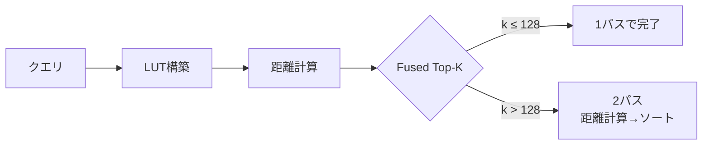

本記事は [NVIDIA Technical Blog "Accelerating Vector Search: NVIDIA cuVS IVF-PQ Part 1, Deep Dive"](https://developer.nvidia.com/blog/accelerating-vector-search-nvidia-cuvs-ivf-pq-deep-dive-part-1/) の解説記事です。

## ブログ概要（Summary）

NVIDIAのcuVS（CUDA Vector Search）ライブラリにおけるIVF-PQ（Inverted File Index with Product Quantization）の内部実装を詳細に解説した技術ブログである。IVF-PQは2段階の量子化（クラスタ割当 + 残差のProduct Quantization）により、ベクトルデータを大幅に圧縮しながら高速な近似検索を実現する手法である。ブログでは、GPU上でのLUT（Look-Up Table）構築、Fused Top-K Fine Search、メモリ階層最適化、カスタム精度型、Early Stoppingなどの最適化技法が紹介されている。10億レコードのDEEPデータセット（360GiB）をIVF-PQで54GiBに圧縮し、GPU上に格納可能にした事例が報告されている。

この記事は [Zenn記事: ベクトルDBインデックス戦略の実測比較：HNSW・IVF・DiskANNのチューニング実践](https://zenn.dev/0h_n0/articles/e1bcdc3fb9b21e) の深掘りです。

## 情報源

- **種別**: 企業テックブログ
- **URL**: [https://developer.nvidia.com/blog/accelerating-vector-search-nvidia-cuvs-ivf-pq-deep-dive-part-1/](https://developer.nvidia.com/blog/accelerating-vector-search-nvidia-cuvs-ivf-pq-deep-dive-part-1/)
- **組織**: NVIDIA
- **発表日**: 2024年

## 技術的背景（Technical Background）

### IVF-PQの2段階量子化

IVF-PQは、ベクトル検索における計算コストとメモリ使用量を削減する手法であり、2段階の量子化を組み合わせている。

**第1段階: IVF（Inverted File）**

データセットの全ベクトルをk-meansクラスタリングで $n_{\text{list}}$ 個のクラスタ（セル）に分割する。各ベクトルは最近接のクラスタセントロイドに割り当てられる。

$$
c_i = \arg\min_{c \in C} \| \mathbf{x} - c \|^2
$$

ここで、$\mathbf{x}$ は入力ベクトル、$C$ はクラスタセントロイドの集合、$c_i$ は $\mathbf{x}$ が割り当てられるクラスタである。

**第2段階: PQ（Product Quantization）**

各ベクトルとそのクラスタセントロイドとの残差ベクトルをProduct Quantizationで圧縮する。

$$
\mathbf{r} = \mathbf{x} - c_i
$$

残差 $\mathbf{r}$ を $m$ 個のサブベクトルに分割し、各サブベクトルを事前学習されたコードブックで量子化する。

$$
\mathbf{r} = [\mathbf{r}_1, \mathbf{r}_2, \ldots, \mathbf{r}_m]
$$

各サブベクトル $\mathbf{r}_j$ は $2^{b}$ 個のコードワードから最近接のものに割り当てられる（$b$ はビット数、通常8ビット）。

**圧縮率の計算**:

元のベクトルサイズが $d \times 4$ バイト（float32）の場合、PQ後のサイズは $m \times \lceil b/8 \rceil$ バイトとなる。

$$
\text{圧縮率} = \frac{d \times 4}{m \times \lceil b/8 \rceil}
$$

例: $d = 96$ 次元、$m = 24$、$b = 8$ の場合、圧縮率 = $384 / 24 = 16\text{x}$

### LUT（Look-Up Table）による高速距離計算

PQ圧縮されたベクトルとの距離計算は、LUTを事前構築することで効率化される。

クエリ $\mathbf{q}$ に対して、各サブスペース $j$ のコードワード集合 $\{c_{j,1}, \ldots, c_{j,2^b}\}$ との距離を事前計算する。

$$
\text{LUT}[j][k] = \| \mathbf{q}_j - c_{j,k} \|^2, \quad j = 1 \ldots m, \; k = 1 \ldots 2^b
$$

PQ圧縮ベクトルとの近似距離は、LUTの参照のみで計算できる。

$$
\hat{d}(\mathbf{q}, \mathbf{x}) = \sum_{j=1}^{m} \text{LUT}[j][\text{code}_j(\mathbf{x})]
$$

この計算はテーブル参照と加算のみであり、フルベクトルの距離計算（$O(d)$ の浮動小数点乗算・加算）と比較して大幅に高速である。

## 実装アーキテクチャ（Architecture）

### GPU最適化技法の詳細

ブログでは以下の5つのGPU最適化技法が紹介されている。

#### 1. Fused Top-K Fine Search

通常のIVF-PQ検索では、(1) 全候補ベクトルの距離計算、(2) Top-K選択、の2パスが必要である。cuVSのFused Top-K Fine Searchは、$k \leq 128$ の場合にこれらを**1パスに融合**する。距離計算と同時にTop-K候補を維持するため、メモリ帯域幅の使用量を削減する。



#### 2. メモリ階層最適化

LUTの配置をサイズに応じてGPUのメモリ階層で切り替える。

| LUTサイズ | 配置先 | レイテンシ | 条件 |
|-----------|-------|----------|------|
| 小 | Shared Memory | ~5ns | LUT全体がSM共有メモリに収まる場合 |
| 大 | Global Memory | ~200ns | 高次元・大コードブックの場合 |

Shared Memoryは容量制限があるが（H100で228KB/SM）、LUTが収まる場合はGlobal Memory比で約40倍高速にアクセスできる。

#### 3. ベクトル化データ転送

PQ圧縮データは**16バイトアライメントのチャンク**で格納され、ストライドパターンでグループ化される。これにより、GPUのメモリバス（H100で3.35TB/s HBM3帯域幅）を最大効率で利用する。

```python
# データレイアウトの概念
# 通常の配置: ベクトルごとに連続
# layout[vector_id] = [code_0, code_1, ..., code_m]

# cuVSの最適化配置: ストライドアクセスパターン
# layout[stride][subspace] = [code_vec0, code_vec1, ..., code_vec_stride]
# GPUのワープ（32スレッド）が同一サブスペースの異なるベクトルを
# コアレスドアクセスで読み取り可能
```

#### 4. カスタム8ビット浮動小数点型

LUTの格納にカスタム8ビット浮動小数点型を実装し、float32比でメモリ使用量を4分の1に削減している。算術演算は行わず（LUTはテーブル参照のみ）、格納精度のみを制御するため、計算精度への影響は最小限である。

#### 5. Early Stopping

距離計算の途中で部分和が現在のk番目近傍の距離を超えた場合、残りのサブスペースの計算を打ち切る。

```python
def pq_distance_with_early_stopping(
    lut: list[list[float]],
    codes: list[int],
    current_kth_distance: float,
) -> float | None:
    """Early Stoppingつきの距離計算。

    Args:
        lut: Look-Up Table（サブスペース×コードワード）
        codes: PQ圧縮コード列
        current_kth_distance: 現在のk番目近傍距離

    Returns:
        計算距離。early stopした場合はNone
    """
    partial_sum = 0.0
    for j, code in enumerate(codes):
        partial_sum += lut[j][code]
        # 部分和がk番目を超えたら打ち切り
        if partial_sum > current_kth_distance:
            return None  # この候補はTop-Kに入らない
    return partial_sum
```

## パフォーマンス最適化（Performance）

### 10億規模での圧縮効果

ブログで報告されている10億レコードのDEEPデータセットでの結果は以下のとおりである。

| 指標 | IVF-Flat | IVF-PQ |
|------|---------|--------|
| インデックスサイズ | 360 GiB | **54 GiB** |
| 圧縮率 | 1x | **~6.7x** |
| GPU格納可否 | H100 80GBに非対応 | **H100 80GBに格納可能** |

10億ベクトル × 96次元のデータが360GiBから54GiBに圧縮され、単一のH100 GPU（80GB HBM3）にインデックス全体が格納可能になっている。

### バッチサイズ別の性能特性

ブログによると、バッチサイズによって性能特性が変化する。

| バッチサイズ | IVF-PQ vs IVF-Flat | 備考 |
|------------|-------------------|------|
| 小（10クエリ） | 同等〜やや劣る | PQの復号オーバーヘッドが支配的 |
| 大（10Kクエリ） | **3-4x高速** | GPU並列性がPQのLUT参照を効率化 |

大バッチ処理ではIVF-PQがIVF-Flat比で3-4倍のQPS（Queries Per Second）を達成すると報告されている。これはLUT構築コストがバッチ内で償却されるためである。

### Refinement（リファインメント）

IVF-PQの距離計算は近似であるため、高recall要件ではリファインメント（元のフルベクトルによる再ランキング）が推奨される。ブログのPart 2ではリファインメント手法が詳述されており、IVF-Flat同等のrecallを維持しつつPQの速度メリットを享受できると述べられている。

Zenn記事のQdrantセクションで解説されている `rescore=True` + `oversampling=2.0` の設定は、このリファインメントの実践例に相当する。cuVSでも同様のパターンが有効であり、Top-Kの2-4倍の候補を取得してからフルベクトルで再ランキングすることでrecallを回復する。

## 運用での学び（Production Lessons）

### Milvus・Faissとの統合

ブログでは、cuVS IVF-PQがMilvus 2.3+およびFaiss 1.8+に統合済みであることが明記されている。Zenn記事で解説されているMilvus 2.6のGPU_IVF_PQインデックスは、cuVSの実装を直接利用している。

```python
# Milvus 2.6でcuVS IVF-PQを使用する例
# （Zenn記事のMilvusセクションのコードを補完）
from pymilvus import MilvusClient

client = MilvusClient(uri="http://localhost:19530")

# GPU_IVF_PQインデックスの作成
# 内部的にcuVSのIVF-PQ実装が使用される
index_params = client.prepare_index_params()
index_params.add_index(
    field_name="vector",
    index_type="GPU_IVF_PQ",
    metric_type="L2",
    params={
        "nlist": 4096,
        "m": 24,         # PQサブスペース数
        "nbits": 8,      # 各サブスペースのビット数
    },
)
```

### IVF-PQパラメータの選定指針

ブログから読み取れるパラメータ選定の指針は以下のとおりである。

| パラメータ | 推奨範囲 | 影響 |
|-----------|---------|------|
| `nlist` | $\sqrt{N}$ 〜 $4\sqrt{N}$ | クラスタ数。大きいほど精度向上・構築時間増加 |
| `m`（PQサブスペース数） | 次元数の約数 | 大きいほど精度向上・圧縮率低下 |
| `nbits` | 4 or 8 | 8がデフォルト。4で追加の2x圧縮（精度低下あり） |
| `nprobe` | `nlist`の1-10% | 検索時のクラスタ探索数。大きいほど精度向上 |

## 学術研究との関連（Academic Connection）

### Product Quantizationの学術的基盤

Product Quantization（PQ）は Jégou, Douze, Schmid (2011) "Product Quantization for Nearest Neighbor Search" で提案された手法であり、cuVSのIVF-PQ実装はこの手法のGPU最適化版である。

PQの理論的な距離近似誤差は以下のように特徴付けられる。

$$
\mathbb{E}[\| d(\mathbf{q}, \mathbf{x}) - \hat{d}(\mathbf{q}, \mathbf{x}) \|^2] \leq \sum_{j=1}^{m} \mathbb{E}[\| \mathbf{r}_j - \hat{\mathbf{r}}_j \|^2]
$$

ここで $\hat{\mathbf{r}}_j$ はサブベクトル $\mathbf{r}_j$ の量子化近似である。サブスペース数 $m$ を増やすと各サブスペースの次元が下がり、量子化誤差が減少する一方、コードブックサイズ（= LUTサイズ）が増加する。

### Zenn記事との関連

Zenn記事ではMilvusのIVF_PQについて「10億規模のディスクベース検索で有効」と記載している。cuVSのGPU実装により、従来ディスクベースでしか扱えなかった10億規模のIVF-PQが**GPU上でインメモリ処理可能**になる（54GiBに圧縮されたインデックスがH100の80GB HBMに収まる）。これは、Zenn記事のコスト比較表において「GPU_IVF_PQ」の選択肢を強化する根拠となる。

## まとめと実践への示唆

NVIDIA cuVSのIVF-PQ実装は、GPU固有の最適化技法（Fused Top-K、LUTメモリ階層制御、ベクトル化転送、カスタム精度型、Early Stopping）を組み合わせることで、CPU実装を大幅に上回る性能を実現している。10億ベクトルのデータセットを54GiBに圧縮し単一GPUに格納可能にした結果は、大規模ベクトル検索のアーキテクチャ選択に影響を与える。

Milvus 2.6やFaiss 1.10.0を介してcuVS IVF-PQを利用する場合、バッチサイズとリファインメント設定が性能の鍵となる。大バッチ処理（10K以上）ではIVF-Flat比3-4倍のQPSが期待でき、リファインメントの併用でrecallの低下を抑制できる。

## 参考文献

- **Blog URL**: [https://developer.nvidia.com/blog/accelerating-vector-search-nvidia-cuvs-ivf-pq-deep-dive-part-1/](https://developer.nvidia.com/blog/accelerating-vector-search-nvidia-cuvs-ivf-pq-deep-dive-part-1/)
- **NVIDIA cuVS**: [https://developer.nvidia.com/cuvs](https://developer.nvidia.com/cuvs)
- **PQ原論文**: Jégou, Douze, Schmid, "Product Quantization for Nearest Neighbor Search," IEEE TPAMI, 2011
- **Milvus Documentation**: [https://milvus.io/docs/gpu_index.md](https://milvus.io/docs/gpu_index.md)
- **Related Zenn article**: [https://zenn.dev/0h_n0/articles/e1bcdc3fb9b21e](https://zenn.dev/0h_n0/articles/e1bcdc3fb9b21e)

---

:::message
この記事はAI（Claude Code）により自動生成されました。内容の正確性については原ブログ記事を基に検証していますが、実際の利用時は公式ドキュメントもご確認ください。
:::
