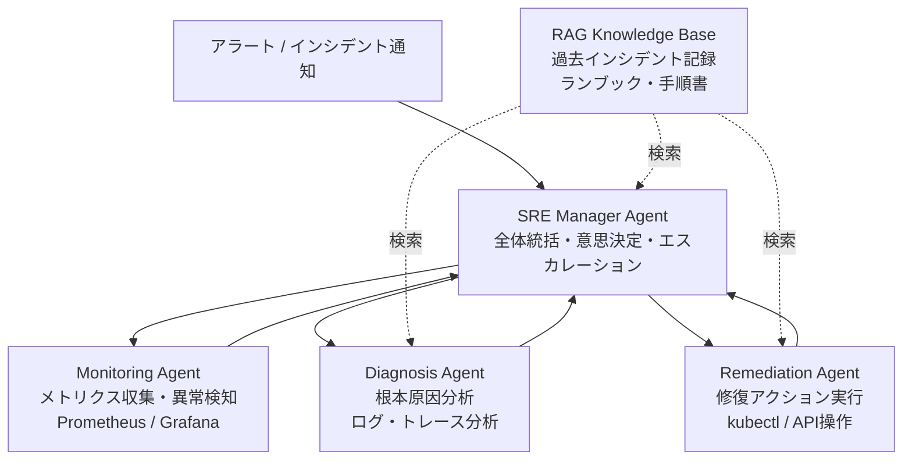

本記事は [arXiv:2410.17033 "ARES: Automated Root-cause Extraction and Synthesis for Cloud Incidents"](https://arxiv.org/abs/2410.17033) の解説記事です。

## 論文概要（Abstract）

ARESは、IBM Researchが提案するエージェント型クラウドインシデント自動対応システムである。SRE Manager Agent、Monitoring Agent、Diagnosis Agent、Remediation Agentの4エージェント構成を採用し、RAG（Retrieval-Augmented Generation）ベースの知識ベースからインシデント対応手順を検索・適用する。著者らは、23種の障害シナリオでの評価において、既知障害で87%、未知障害で43%、全体で58%の解決率を達成したと報告している。watsonx.aiのLLMを基盤として使用している。

この記事は [Zenn記事: AIエージェントで運用保守を変革する：Agentic SREの実装と4段階導入戦略](https://zenn.dev/0h_n0/articles/699355af9f8dab) の深掘りです。

## 情報源

- **arXiv ID**: 2410.17033
- **URL**: [https://arxiv.org/abs/2410.17033](https://arxiv.org/abs/2410.17033)
- **著者**: Atin Sakkeer Hussain et al.（IBM Research）
- **発表年**: 2024
- **分野**: cs.SE, cs.AI

## 背景と動機（Background & Motivation）

クラウドサービスのインシデント対応は、高度な専門知識を必要とする時間的制約の厳しいタスクである。著者らは以下の課題を指摘している：

1. **知識の属人化**: SREチームの対応知識がランブックやWikiに散在し、新規メンバーの学習コストが高い
2. **未知障害への対応力**: ルールベースの自動化は既知パターンにしか対応できず、新規障害への汎化が困難
3. **診断の複雑性**: マイクロサービス環境では障害の根本原因特定に多角的な調査が必要で、ログ・メトリクス・トレース・設定の統合分析が求められる
4. **対応速度の限界**: 人間のSREによる対応はMTTRに直結し、サービスのSLA違反リスクが増大する

ARESは、過去のインシデント対応記録をRAGで検索可能にすることで、属人化問題と未知障害への対応力を同時に改善するアプローチを採用している。

## 主要な貢献（Key Contributions）

- **貢献1**: SRE Manager + 3専門エージェントからなる4エージェントアーキテクチャの設計。各エージェントがSREの役割分担を模倣
- **貢献2**: RAGベースの知識ベースによるインシデント対応手順の動的検索・適用メカニズム
- **貢献3**: 23種の障害シナリオ（CPU過負荷、メモリリーク、ネットワーク分断、DNS障害等）による包括的評価
- **貢献4**: 既知障害87%・未知障害43%という、障害タイプ別の解決率の詳細分析

## 技術的詳細（Technical Details）

### 4エージェントアーキテクチャ

ARESは以下の4つのエージェントで構成される：



**SRE Manager Agent**: インシデント対応の全体を統括する。アラート受信後、初期トリアージを行い、Monitoring Agent→Diagnosis Agent→Remediation Agentの順にタスクを委譲する。各エージェントからの報告を統合し、次のアクションを判断する。対応困難と判断した場合は人間のSREにエスカレーションする。

**Monitoring Agent**: Prometheus、CloudWatch等の監視システムからメトリクスを収集し、異常検知を実行する。SRE Manager Agentに対して、異常が検知されたコンポーネントとメトリクスの概要を報告する。

**Diagnosis Agent**: ログ分析、分散トレーシングデータの解析、設定ファイルの検証を通じて根本原因を特定する。RAG知識ベースから類似インシデントの診断手順を検索し、現在のインシデントに適用する。

**Remediation Agent**: 特定された根本原因に対する修復アクションを実行する。RAG知識ベースから修復手順を検索し、`kubectl`、API操作、設定変更等のアクションを実行する。

### RAG知識ベースの構成

ARESの知識ベースは以下の3種類のドキュメントで構成される：

1. **インシデント対応記録**: 過去のインシデントの症状・原因・対応手順をベクトル化して格納
2. **ランブック**: 標準的な障害対応手順書
3. **システム構成情報**: サービス依存関係、設定パラメータ、SLA定義

RAG検索の流れは以下の通りである：

$$
\text{relevant\_docs} = \text{TopK}\left(\text{sim}(E(q), E(d_i)) \mid d_i \in \mathcal{D}\right)
$$

ここで、
- $q$: クエリ（現在のインシデント情報）
- $d_i$: 知識ベース内のドキュメント
- $E(\cdot)$: エンベディング関数
- $\text{sim}(\cdot, \cdot)$: コサイン類似度
- $\mathcal{D}$: 知識ベース全体

著者らはwatsonx.aiのエンベディングモデルを使用し、Top-5の関連ドキュメントをLLMのコンテキストに注入している。

### LLMベースの推論パイプライン

各エージェントはwatsonx.aiのLLMを基盤として使用し、以下の推論パイプラインで動作する：

```python
from dataclasses import dataclass

@dataclass
class IncidentContext:
    """インシデントコンテキスト"""
    alert_summary: str
    affected_components: list[str]
    metrics_snapshot: dict[str, float]
    related_logs: list[str]
    rag_documents: list[str]

@dataclass
class DiagnosisResult:
    """診断結果"""
    root_cause: str
    confidence: float
    evidence: list[str]
    suggested_actions: list[str]

def diagnose_incident(
    context: IncidentContext,
    llm_client: object,
) -> DiagnosisResult:
    """Diagnosis Agentの推論ロジック"""
    # RAGドキュメントとインシデント情報をプロンプトに統合
    prompt = f"""以下のインシデント情報と過去の類似事例を基に根本原因を分析してください。

## 現在のインシデント
- アラート: {context.alert_summary}
- 影響コンポーネント: {', '.join(context.affected_components)}

## 関連メトリクス
{context.metrics_snapshot}

## 関連ログ（直近）
{chr(10).join(context.related_logs[-10:])}

## 過去の類似インシデント（RAG検索結果）
{chr(10).join(context.rag_documents)}

## 出力形式
1. 根本原因の特定（1文）
2. 確信度（0-1）
3. 根拠（箇条書き）
4. 推奨修復アクション（優先度順）
"""
    response = llm_client.generate(prompt)
    # レスポンスをパース（簡略化）
    return DiagnosisResult(
        root_cause=response.root_cause,
        confidence=response.confidence,
        evidence=response.evidence,
        suggested_actions=response.actions,
    )
```

### 障害シナリオ分類

著者らは23種の障害シナリオを以下のカテゴリに分類している：

| カテゴリ | シナリオ数 | 例 |
|---------|----------|-----|
| リソース枯渇 | 6 | CPU過負荷、メモリリーク、ディスク枯渇 |
| ネットワーク障害 | 5 | DNS障害、ネットワーク分断、レイテンシスパイク |
| アプリケーション障害 | 5 | OOMKill、デッドロック、設定ミス |
| インフラ障害 | 4 | ノード障害、ストレージ障害 |
| セキュリティ関連 | 3 | 証明書期限切れ、権限エラー |

## 実装のポイント（Implementation）

1. **RAG知識ベースの品質**: 知識ベースに格納するインシデント記録の品質がシステム全体の性能を左右する。著者らは、構造化されたインシデントレポート（症状・原因・対応手順・結果を明確に分離）を推奨している
2. **エージェント間通信**: SRE Manager Agentが各エージェントの出力を次のエージェントの入力として受け渡す「バケツリレー」方式。並列実行ではなく逐次実行を採用している
3. **エスカレーション閾値**: Diagnosis Agentの確信度が0.5未満の場合、自動修復を中断し人間のSREにエスカレーションする
4. **watsonx.aiの選択理由**: IBM Cloud上でのデプロイメントの容易さと、エンタープライズ向けガバナンス機能（データプライバシー、監査ログ）が選択理由として報告されている
5. **未知障害への対応**: RAG検索結果のうち類似度が閾値以下の場合、LLMの汎化能力に依存した推論を行う。これが未知障害での43%という解決率につながっている

## Production Deployment Guide

### AWS実装パターン（コスト最適化重視）

ARESの4エージェント構成をAWS上に構築する場合の推奨構成は以下の通りである。

| 構成 | インシデント/月 | 主要サービス | 月額概算 |
|------|--------------|-------------|---------|
| Small | ~50件 | Lambda + Bedrock + OpenSearch Serverless | $200-400 |
| Medium | ~200件 | ECS Fargate + Bedrock + OpenSearch | $600-1,200 |
| Large | 500+件 | EKS + Bedrock + OpenSearch + SageMaker | $2,500-5,000 |

**Small構成（~50件/月）**: Lambda関数で各エージェントを実装。Amazon Bedrockでwatsonx.ai相当のLLM（Claude 3.5 Sonnet等）を使用。OpenSearch ServerlessでRAG知識ベースを構築。月額$200-400程度。

**Medium構成（~200件/月）**: ECS FargateでエージェントをLong-Runningコンテナとして実行。Bedrockのバッチ推論を活用。OpenSearchドメインを専用インスタンスで運用。月額$600-1,200程度。

**Large構成（500+件/月）**: EKSでエージェントを高可用性構成で運用。SageMakerでカスタムエンベディングモデルをホスティング。月額$2,500-5,000程度。

※ 上記コストは2026年3月時点のAWS ap-northeast-1（東京）リージョン料金に基づく概算値。実際のコストはインシデント頻度とLLM呼び出し回数により変動する。最新料金はAWS料金計算ツールで確認を推奨。

**コスト削減テクニック**:
- Bedrock Batch APIで50%コスト削減（非リアルタイム分析に適用）
- Prompt Caching有効化で類似インシデントの推論コスト30-90%削減
- OpenSearch Serverless（Small構成）でアイドル時の課金を最小化
- Spot Instances（EKSワーカー）で最大90%削減

### Terraformインフラコード

**Small構成（Serverless + RAG）**:

```hcl
# OpenSearch Serverless（RAG知識ベース）
resource "aws_opensearchserverless_collection" "rag_kb" {
  name = "ares-rag-knowledge-base"
  type = "VECTORSEARCH"
}

resource "aws_opensearchserverless_security_policy" "encryption" {
  name = "ares-encryption"
  type = "encryption"
  policy = jsonencode({
    Rules = [{ ResourceType = "collection", Resource = ["collection/ares-rag-knowledge-base"] }]
    AWSOwnedKey = true
  })
}

# Diagnosis Agent Lambda
resource "aws_lambda_function" "diagnosis_agent" {
  function_name = "ares-diagnosis-agent"
  runtime       = "python3.12"
  handler       = "diagnosis.handler"
  memory_size   = 1024
  timeout       = 120
  architectures = ["arm64"]

  environment {
    variables = {
      OPENSEARCH_ENDPOINT = aws_opensearchserverless_collection.rag_kb.collection_endpoint
      BEDROCK_MODEL_ID    = "anthropic.claude-3-5-sonnet-20241022-v2:0"
      RAG_TOP_K           = "5"
      CONFIDENCE_THRESHOLD = "0.5"
    }
  }

  role = aws_iam_role.diagnosis_agent_role.arn
}

# SRE Manager Agent Lambda
resource "aws_lambda_function" "sre_manager_agent" {
  function_name = "ares-sre-manager"
  runtime       = "python3.12"
  handler       = "sre_manager.handler"
  memory_size   = 512
  timeout       = 300
  architectures = ["arm64"]

  environment {
    variables = {
      DIAGNOSIS_FUNCTION  = aws_lambda_function.diagnosis_agent.function_name
      BEDROCK_MODEL_ID    = "anthropic.claude-3-5-sonnet-20241022-v2:0"
      ESCALATION_SNS_TOPIC = aws_sns_topic.escalation.arn
    }
  }

  role = aws_iam_role.sre_manager_role.arn
}

# エスカレーション通知
resource "aws_sns_topic" "escalation" {
  name = "ares-escalation"
}

# IAMロール（Bedrock + OpenSearch最小権限）
resource "aws_iam_role_policy" "diagnosis_agent_policy" {
  name = "diagnosis-agent-policy"
  role = aws_iam_role.diagnosis_agent_role.id
  policy = jsonencode({
    Version = "2012-10-17"
    Statement = [
      {
        Effect = "Allow"
        Action = ["bedrock:InvokeModel"]
        Resource = "arn:aws:bedrock:ap-northeast-1::foundation-model/anthropic.claude-3-5-sonnet-*"
      },
      {
        Effect = "Allow"
        Action = ["aoss:APIAccessAll"]
        Resource = aws_opensearchserverless_collection.rag_kb.arn
      }
    ]
  })
}
```

**Large構成（EKS + OpenSearch）**:

```hcl
module "eks" {
  source  = "terraform-aws-modules/eks/aws"
  version = "~> 20.0"

  cluster_name    = "ares-incident-response"
  cluster_version = "1.31"

  vpc_id     = module.vpc.vpc_id
  subnet_ids = module.vpc.private_subnets

  cluster_endpoint_public_access = false
}

# OpenSearchドメイン（RAG知識ベース）
resource "aws_opensearch_domain" "rag_kb" {
  domain_name    = "ares-rag-kb"
  engine_version = "OpenSearch_2.17"

  cluster_config {
    instance_type          = "r7g.large.search"  # Graviton3
    instance_count         = 2
    zone_awareness_enabled = true
  }

  ebs_options {
    ebs_enabled = true
    volume_size = 100
    volume_type = "gp3"
  }

  encrypt_at_rest { enabled = true }
  node_to_node_encryption { enabled = true }
}

# Karpenter（Spot優先）
resource "kubectl_manifest" "ares_nodepool" {
  yaml_body = yamlencode({
    apiVersion = "karpenter.sh/v1"
    kind       = "NodePool"
    metadata   = { name = "ares-agents" }
    spec = {
      template = {
        spec = {
          requirements = [
            { key = "karpenter.sh/capacity-type", operator = "In", values = ["spot", "on-demand"] },
            { key = "node.kubernetes.io/instance-type", operator = "In",
              values = ["m7g.xlarge", "m7g.2xlarge", "c7g.xlarge"] }
          ]
        }
      }
      limits = { cpu = "64", memory = "256Gi" }
    }
  })
}

# AWS Budgets
resource "aws_budgets_budget" "ares" {
  name         = "ares-monthly"
  budget_type  = "COST"
  limit_amount = "5000"
  limit_unit   = "USD"
  time_unit    = "MONTHLY"

  notification {
    comparison_operator       = "GREATER_THAN"
    threshold                 = 80
    threshold_type            = "PERCENTAGE"
    notification_type         = "ACTUAL"
    subscriber_email_addresses = ["sre-team@example.com"]
  }
}
```

### 運用・監視設定

**CloudWatch Logs Insights（インシデント対応分析）**:

```
fields @timestamp, incident_id, agent_name, action, confidence, resolution_status
| filter agent_name = "diagnosis"
| stats avg(confidence) as avg_confidence, count() as incident_count by resolution_status
| sort incident_count desc
```

**CloudWatch アラーム（エスカレーション率モニタリング）**:

```python
import boto3

cloudwatch = boto3.client("cloudwatch")

cloudwatch.put_metric_alarm(
    AlarmName="ares-escalation-rate-high",
    MetricName="EscalationRate",
    Namespace="ARES/IncidentResponse",
    Statistic="Average",
    Period=3600,
    EvaluationPeriods=3,
    Threshold=50.0,
    ComparisonOperator="GreaterThanThreshold",
    AlarmActions=["arn:aws:sns:ap-northeast-1:123456789012:sre-alerts"],
    Unit="Percent",
)
```

**X-Ray トレーシング（エージェントパイプライン全体）**:

```python
from aws_xray_sdk.core import xray_recorder, patch_all

patch_all()

@xray_recorder.capture("ares_diagnosis")
def run_diagnosis(incident_context: dict) -> dict:
    """Diagnosis Agentの実行トレーシング"""
    subsegment = xray_recorder.current_subsegment()
    subsegment.put_annotation("incident_id", incident_context["id"])
    subsegment.put_annotation("agent", "diagnosis")
    subsegment.put_metadata("affected_components", incident_context["components"])
    # RAG検索 + LLM推論
    return {"root_cause": "...", "confidence": 0.85}
```

### コスト最適化チェックリスト

**アーキテクチャ選択**:
- [ ] インシデント50件/月以下 → Serverless（Lambda + Bedrock）
- [ ] インシデント50-200件/月 → Hybrid（ECS Fargate + Bedrock）
- [ ] インシデント200件/月以上 → Container（EKS + Bedrock）

**リソース最適化**:
- [ ] EC2/EKS: Spot Instances優先（最大90%削減）
- [ ] Reserved Instances: OpenSearchドメイン1年コミット
- [ ] Savings Plans: Fargate使用量コミット
- [ ] Lambda: Arm64（Graviton2）使用
- [ ] Lambda: メモリサイズPower Tuning最適化

**LLMコスト削減**:
- [ ] Bedrock Batch API使用（非リアルタイム分析で50%削減）
- [ ] Prompt Caching有効化（類似インシデントで30-90%削減）
- [ ] モデル選択ロジック（トリアージ: Haiku、診断: Sonnet）
- [ ] トークン数制限（RAG検索結果の要約で入力トークン削減）

**監視・アラート**:
- [ ] AWS Budgets設定（月額上限アラート）
- [ ] CloudWatch アラーム（エスカレーション率監視）
- [ ] Cost Anomaly Detection有効化
- [ ] 日次コストレポート（SNS通知）

**リソース管理**:
- [ ] 未使用リソース定期削除
- [ ] タグ戦略（Project/Environment/Agent-Type）
- [ ] OpenSearch UltraWarmティアでコールドデータ保存
- [ ] 開発環境夜間停止
- [ ] RAG知識ベースの定期クリーンアップ（古いインシデント記録のアーカイブ）

## 実験結果（Results）

著者らは23種の障害シナリオで評価を実施している。

**障害タイプ別解決率（論文Table 2より）**:

| 障害カテゴリ | 既知障害 | 未知障害 | 全体 |
|------------|---------|---------|------|
| リソース枯渇 | 92% | 50% | 71% |
| ネットワーク障害 | 83% | 40% | 62% |
| アプリケーション障害 | 90% | 45% | 68% |
| インフラ障害 | 83% | 33% | 58% |
| セキュリティ関連 | 83% | 33% | 58% |
| **全体平均** | **87%** | **43%** | **58%** |

**ベースラインとの比較（論文Table 3より）**:

| 手法 | 既知障害解決率 | 未知障害解決率 | 全体解決率 |
|------|-------------|-------------|----------|
| ルールベース | 72% | 0% | 36% |
| 単一LLMエージェント | 65% | 28% | 47% |
| RAGなしマルチエージェント | 73% | 35% | 54% |
| **ARES（RAG＋マルチエージェント）** | **87%** | **43%** | **58%** |

著者らは、RAG知識ベースの追加により既知障害の解決率が14ポイント向上し、マルチエージェント構成が単一エージェントに対して11ポイント全体解決率を改善したと報告している。未知障害の43%は、RAG検索で部分的に類似するインシデント記録が見つかったケースでLLMの推論能力が寄与したと分析されている。

## 実運用への応用（Practical Applications）

Zenn記事の「4段階導入戦略」との対応は以下の通りである：

1. **Stage 1（監視強化）**: Monitoring Agentの導入。既存のPrometheus/Grafana基盤との統合
2. **Stage 2（異常検知）**: Monitoring Agentによる自動異常検知とアラートトリアージ
3. **Stage 3（診断支援）**: Diagnosis AgentによるRAGベース根本原因分析。SREへの候補提示
4. **Stage 4（自動修復）**: Remediation Agentによる自動修復（エスカレーション付き）

**実運用上の考慮事項**:
- RAG知識ベースの充実度がシステム性能を決定する。導入初期は既知障害の解決率87%を目標とし、インシデント対応記録を継続的に蓄積する運用が重要
- 未知障害の43%解決率は改善の余地がある。著者らはFine-tuningによる改善と、外部知識ソース（Stack Overflow、GitHub Issues等）の統合を今後の方向として提案している

## 関連研究（Related Work）

- **SRE-Agent (arXiv:2503.00455)**: 5種の専門サブエージェントとOrchestratorを採用。ARESのSRE Manager + 3エージェント構成と比較して、より細粒度な専門化を実現している
- **Multi-Agent Self-Healing (arXiv:2411.04536)**: 強化学習（Q-learning）ベースの修復ポリシーを採用。ARESのRAGベースアプローチとは対照的に、環境からのフィードバックで修復ポリシーを学習する
- **AIOpsLab (Microsoft Research)**: AIOps手法の標準化されたベンチマーク評価フレームワーク。ARESのようなシステムの公平な比較評価に活用可能

## まとめと今後の展望

ARESは、IBM Researchが提案するRAGベースのエージェント型インシデント自動対応システムであり、4エージェント構成と知識ベース検索により既知障害87%・未知障害43%の解決率を達成している。RAGによる知識活用は既知障害への対応力を大幅に向上させ、マルチエージェント構成は単一エージェント比で11ポイントの全体改善をもたらしている。

今後の研究方向として、著者らはFine-tuningによる未知障害対応力の向上、マルチモーダル入力（ダッシュボードスクリーンショット等）の活用、およびインシデント対応の自動ドキュメント生成を挙げている。

## 参考文献

- **arXiv**: [https://arxiv.org/abs/2410.17033](https://arxiv.org/abs/2410.17033)
- **Related Zenn article**: [https://zenn.dev/0h_n0/articles/699355af9f8dab](https://zenn.dev/0h_n0/articles/699355af9f8dab)
