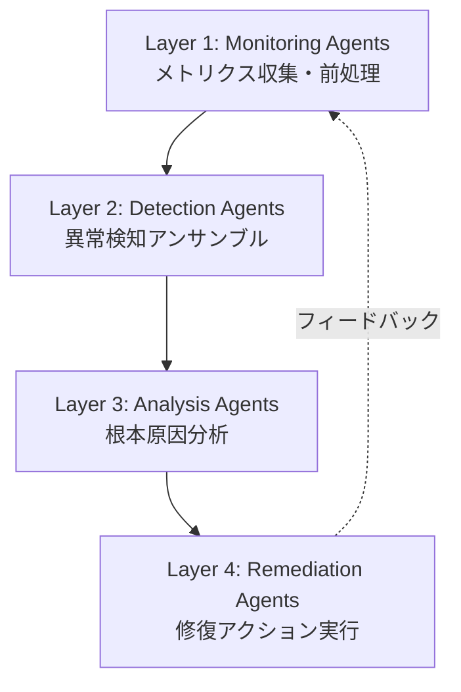

本記事は [arXiv:2411.04536 "A Multi-Agent Approach for Self-Healing in Cloud Computing Environments"](https://arxiv.org/abs/2411.04536) の解説記事です。

## 論文概要（Abstract）

本論文は、クラウドコンピューティング環境における自己修復（Self-Healing）を実現する4層階層型マルチエージェントシステム（MAS）を提案している。異常検知にIsolation ForestとLSTM Autoencoderのアンサンブルを用い、根本原因分析（RCA）にはPCアルゴリズムとPersonalized PageRankを組み合わせ、修復ポリシーにはQ-learningベースの強化学習エージェントを採用している。著者らは、提案手法がMTTR（Mean Time to Repair）を69.8%短縮し、自動修復率（ARR）84.7%を達成したと報告している。

この記事は [Zenn記事: AIエージェントで運用保守を変革する：Agentic SREの実装と4段階導入戦略](https://zenn.dev/0h_n0/articles/699355af9f8dab) の深掘りです。

## 情報源

- **arXiv ID**: 2411.04536
- **URL**: [https://arxiv.org/abs/2411.04536](https://arxiv.org/abs/2411.04536)
- **著者**: Abdul Basit et al.
- **発表年**: 2024
- **分野**: cs.DC, cs.AI

## 背景と動機（Background & Motivation）

クラウド環境の大規模化に伴い、システム障害の検知から修復までの人手による対応はスケールしなくなっている。著者らは以下の課題を指摘している：

1. **障害検知の遅延**: 従来の閾値ベースの監視では、複合的な異常パターンの検知に時間がかかる
2. **根本原因特定の困難さ**: マイクロサービス間の複雑な依存関係により、障害の波及経路の追跡が困難
3. **修復の手動依存**: ランブックは存在するものの、実行判断と手順適用は依然として人間に依存
4. **単一手法の限界**: 異常検知・RCA・修復を個別に最適化しても、エンドツーエンドの復旧時間は十分に短縮されない

本論文は、これら3つの機能（検知・分析・修復）を階層型マルチエージェントシステムとして統合することで、自律的な自己修復を実現するアプローチを提案している。

## 主要な貢献（Key Contributions）

- **貢献1**: Isolation ForestとLSTM Autoencoderを組み合わせたアンサンブル異常検知手法の提案。点異常と時系列異常の両方を高精度に捕捉する
- **貢献2**: PCアルゴリズムによる因果グラフ構築とPersonalized PageRankによる根本原因ランキングを統合したRCA手法
- **貢献3**: Q-learningベースの修復ポリシーエージェントによる安全制約付き自動修復の実現
- **貢献4**: 4層階層MASアーキテクチャによるエンドツーエンド自己修復パイプラインの設計と評価

## 技術的詳細（Technical Details）

### 4層階層マルチエージェントアーキテクチャ

提案システムは以下の4層で構成される：



**Layer 1（Monitoring Agents）**: 各サービスノードに配置され、CPU/メモリ/レイテンシ/エラーレートなどのメトリクスを収集する。時系列データの前処理（正規化・欠損補完）もこの層で実施される。

**Layer 2（Detection Agents）**: 異常検知を担当する。後述するIsolation Forest + LSTM Autoencoderのアンサンブルを実行する。

**Layer 3（Analysis Agents）**: 検知された異常の根本原因を特定する。因果グラフの構築とPageRankベースのランキングを実行する。

**Layer 4（Remediation Agents）**: 特定された根本原因に対して、Q-learningで学習された修復ポリシーに基づき修復アクションを実行する。

### 異常検知: Isolation Forest + LSTM Autoencoder アンサンブル

著者らは、点異常と時系列パターン異常を同時に検知するため、2つのモデルのアンサンブルを採用している。

**Isolation Forest** は各データ点の異常スコアを以下の式で算出する：

$$
s(x, n) = 2^{-\frac{E[h(x)]}{c(n)}}
$$

ここで、
- $h(x)$: データ点$x$の平均パス長（ルートから葉までの分割回数）
- $c(n)$: $n$個のサンプルにおける平均パス長の正規化定数
- $E[\cdot]$: 複数のIsolation Treeにわたる期待値

異常スコア$s$が1に近いほど異常度が高く、0.5付近は正常と判定される。

**LSTM Autoencoder** は時系列の再構成誤差で異常を判定する：

$$
\mathcal{L}_{\text{recon}}(x_t) = \| x_t - \hat{x}_t \|^2
$$

ここで、
- $x_t$: 時刻$t$の入力ベクトル（多変量メトリクス）
- $\hat{x}_t$: Autoencoderの再構成出力

再構成誤差が閾値$\tau$を超えた場合に異常と判定する：

$$
\text{anomaly}(x_t) = \begin{cases} 1 & \text{if } \mathcal{L}_{\text{recon}}(x_t) > \tau \\ 0 & \text{otherwise} \end{cases}
$$

**アンサンブルの統合**: 両モデルの判定結果を重み付き投票で統合する：

$$
\text{score}_{\text{ensemble}}(x_t) = \alpha \cdot s_{\text{IF}}(x_t) + (1 - \alpha) \cdot s_{\text{LSTM}}(x_t)
$$

著者らは$\alpha = 0.4$（LSTM Autoencoder寄り）で最良のF1スコア0.942を報告している（論文Table 3より）。

### 根本原因分析: PCアルゴリズム + Personalized PageRank

RCA層では、メトリクス間の因果関係を以下の2段階で分析する。

**Step 1: PCアルゴリズムによる因果グラフ構築**

PCアルゴリズムは、条件付き独立性テストに基づき変数間の因果関係を推定するアルゴリズムである。メトリクス変数$X_i$と$X_j$について、条件付き集合$S$が存在し

$$
X_i \perp\!\!\!\perp X_j \mid S
$$

が成立する場合、$X_i$と$X_j$間のエッジを除去する。最終的に残ったエッジが因果関係を表す有向グラフ（DAG）を構成する。

**Step 2: Personalized PageRankによる根本原因ランキング**

構築された因果グラフ上で、異常ノードを起点としたPersonalized PageRankを実行する：

$$
\mathbf{r} = (1 - d) \cdot \mathbf{e}_{\text{anomaly}} + d \cdot \mathbf{A}^T \mathbf{r}
$$

ここで、
- $\mathbf{r}$: 各ノードの根本原因スコアベクトル
- $d$: ダンピング係数（著者らは$d = 0.85$を使用）
- $\mathbf{e}_{\text{anomaly}}$: 異常が検知されたノードに重みを持つパーソナライズベクトル
- $\mathbf{A}$: 因果グラフの隣接行列

スコアが高いノードほど根本原因である可能性が高いと判定される。著者らは、Top-3精度で91.2%を達成したと報告している（論文Table 5より）。

### 修復ポリシー: Q-learning ベース強化学習

修復エージェントは、状態空間$\mathcal{S}$（現在のシステム状態）、アクション空間$\mathcal{A}$（修復アクション候補）、報酬関数$R$を定義したQ-learningで修復ポリシーを学習する。

$$
Q(s, a) \leftarrow Q(s, a) + \eta \left[ R(s, a) + \gamma \max_{a'} Q(s', a') - Q(s, a) \right]
$$

ここで、
- $\eta$: 学習率（$\eta = 0.1$）
- $\gamma$: 割引率（$\gamma = 0.95$）
- $R(s, a)$: 修復アクション$a$を状態$s$で実行した際の報酬

**安全制約**: 修復アクションにはリスクレベルが定義されており、高リスクアクション（サービス再起動、ノード隔離等）は人間の承認を要求する2段階承認メカニズムが組み込まれている。

```python
from dataclasses import dataclass
from enum import Enum

class RiskLevel(Enum):
    LOW = "low"        # スケーリング、設定変更
    MEDIUM = "medium"  # Pod再起動、トラフィック切替
    HIGH = "high"      # ノード隔離、サービス停止

@dataclass
class RemediationAction:
    """修復アクションの定義"""
    action_id: str
    action_type: str
    risk_level: RiskLevel
    target_component: str
    rollback_action: str | None = None

def select_action(
    q_table: dict[tuple[str, str], float],
    state: str,
    available_actions: list[RemediationAction],
    max_risk: RiskLevel = RiskLevel.MEDIUM,
) -> RemediationAction:
    """Q-tableに基づき安全制約を満たす最適アクションを選択"""
    safe_actions = [
        a for a in available_actions
        if a.risk_level.value <= max_risk.value
    ]
    if not safe_actions:
        raise ValueError("安全制約内で実行可能なアクションがない")

    best_action = max(
        safe_actions,
        key=lambda a: q_table.get((state, a.action_id), 0.0)
    )
    return best_action
```

## 実装のポイント（Implementation）

著者らの実装における注意点を以下にまとめる。

1. **メトリクス収集の粒度**: 10秒間隔での収集を推奨。粒度が粗いと異常検知の遅延が増加し、細かすぎるとストレージコストが増大する
2. **Isolation Forestのハイパーパラメータ**: `n_estimators=200`、`contamination=0.05`が推奨値として報告されている
3. **LSTM Autoencoderのウィンドウサイズ**: 60タイムステップ（10分間）のスライディングウィンドウが使用されている
4. **因果グラフの更新頻度**: PCアルゴリズムは計算コストが高いため、1時間ごとのバッチ更新が推奨されている
5. **Q-tableの初期化**: 過去のインシデント対応ログからQ値を事前学習することで収束を加速している

## Production Deployment Guide

### AWS実装パターン（コスト最適化重視）

本論文の4層MASアーキテクチャをAWS上に構築する場合の推奨構成は以下の通りである。

| 構成 | トラフィック | 主要サービス | 月額概算 |
|------|------------|-------------|---------|
| Small | ~100ノード | Lambda + CloudWatch + DynamoDB | $150-300 |
| Medium | ~500ノード | ECS Fargate + MSK + ElastiCache | $800-1,500 |
| Large | 1000+ノード | EKS + Karpenter + MSK + OpenSearch | $3,000-6,000 |

**Small構成（~100ノード監視）**: Lambda関数でMonitoring Agentを実装し、CloudWatch Metricsをデータソースとする。Detection AgentはLambdaで10秒間隔のスケジュール実行。DynamoDBにQ-tableと因果グラフを保存。月額$150-300程度。

**Medium構成（~500ノード監視）**: ECS Fargateでエージェント群をコンテナ実行。Amazon MSK（Managed Streaming for Apache Kafka）でエージェント間メッセージングを実装。ElastiCache（Redis）にQ-tableをキャッシュし、高速なアクション選択を実現。月額$800-1,500程度。

**Large構成（1000+ノード監視）**: EKS上でエージェントをPodとして運用。Karpenter＋Spot Instancesで最大90%のコスト削減。OpenSearchでメトリクス検索とログ分析を統合。月額$3,000-6,000程度。

※ 上記コストは2026年3月時点のAWS ap-northeast-1（東京）リージョン料金に基づく概算値。実際のコストはトラフィックパターンにより変動する。最新料金はAWS料金計算ツールで確認を推奨。

**コスト削減テクニック**:
- Spot Instances活用（EKSワーカーノード）で最大90%削減
- Reserved Instances（MSKブローカー）で最大72%削減
- Lambda Arm64（Graviton2）で20%の価格削減
- DynamoDB On-Demandモードで低トラフィック時のコスト最適化

### Terraformインフラコード

**Small構成（Serverless）**:

```hcl
# 異常検知Lambda関数
resource "aws_lambda_function" "detection_agent" {
  function_name = "self-healing-detection-agent"
  runtime       = "python3.12"
  handler       = "detection.handler"
  memory_size   = 512
  timeout       = 30
  architectures = ["arm64"]  # Graviton2で20%コスト削減

  environment {
    variables = {
      DYNAMODB_TABLE     = aws_dynamodb_table.agent_state.name
      ANOMALY_THRESHOLD  = "0.7"
      IF_CONTAMINATION   = "0.05"
    }
  }

  role = aws_iam_role.detection_agent_role.arn
}

# Q-table・因果グラフ保存用DynamoDB
resource "aws_dynamodb_table" "agent_state" {
  name         = "self-healing-agent-state"
  billing_mode = "PAY_PER_REQUEST"  # On-Demandでコスト最適化
  hash_key     = "pk"
  range_key    = "sk"

  attribute {
    name = "pk"
    type = "S"
  }
  attribute {
    name = "sk"
    type = "S"
  }

  server_side_encryption {
    enabled = true  # KMS暗号化
  }

  point_in_time_recovery {
    enabled = true
  }
}

# 10秒間隔のスケジュール実行
resource "aws_cloudwatch_event_rule" "detection_schedule" {
  name                = "detection-agent-schedule"
  schedule_expression = "rate(1 minute)"  # Lambda最小間隔
}

resource "aws_cloudwatch_event_target" "detection_target" {
  rule = aws_cloudwatch_event_rule.detection_schedule.name
  arn  = aws_lambda_function.detection_agent.arn
}

# IAMロール（最小権限）
resource "aws_iam_role" "detection_agent_role" {
  name = "self-healing-detection-agent-role"
  assume_role_policy = jsonencode({
    Version = "2012-10-17"
    Statement = [{
      Action = "sts:AssumeRole"
      Effect = "Allow"
      Principal = { Service = "lambda.amazonaws.com" }
    }]
  })
}

resource "aws_iam_role_policy" "detection_agent_policy" {
  name = "detection-agent-policy"
  role = aws_iam_role.detection_agent_role.id
  policy = jsonencode({
    Version = "2012-10-17"
    Statement = [
      {
        Effect = "Allow"
        Action = [
          "dynamodb:GetItem", "dynamodb:PutItem",
          "dynamodb:UpdateItem", "dynamodb:Query"
        ]
        Resource = aws_dynamodb_table.agent_state.arn
      },
      {
        Effect   = "Allow"
        Action   = ["cloudwatch:GetMetricData", "cloudwatch:ListMetrics"]
        Resource = "*"
      },
      {
        Effect   = "Allow"
        Action   = ["logs:CreateLogGroup", "logs:CreateLogStream", "logs:PutLogEvents"]
        Resource = "arn:aws:logs:*:*:*"
      }
    ]
  })
}
```

**Large構成（EKS + Karpenter）**:

```hcl
module "eks" {
  source  = "terraform-aws-modules/eks/aws"
  version = "~> 20.0"

  cluster_name    = "self-healing-mas"
  cluster_version = "1.31"

  vpc_id     = module.vpc.vpc_id
  subnet_ids = module.vpc.private_subnets

  cluster_endpoint_public_access = false  # プライベートアクセスのみ

  eks_managed_node_groups = {
    system = {
      instance_types = ["m7g.large"]  # Graviton3
      min_size       = 2
      max_size       = 4
      desired_size   = 2
    }
  }
}

# Karpenter Provisioner（Spot優先）
resource "kubectl_manifest" "karpenter_provisioner" {
  yaml_body = yamlencode({
    apiVersion = "karpenter.sh/v1"
    kind       = "NodePool"
    metadata   = { name = "agent-workers" }
    spec = {
      template = {
        spec = {
          requirements = [
            { key = "karpenter.sh/capacity-type", operator = "In", values = ["spot", "on-demand"] },
            { key = "node.kubernetes.io/instance-type", operator = "In",
              values = ["m7g.xlarge", "m7g.2xlarge", "m6g.xlarge", "m6g.2xlarge"] }
          ]
        }
      }
      limits   = { cpu = "100", memory = "400Gi" }
      disruption = {
        consolidationPolicy = "WhenEmptyOrUnderutilized"
        consolidateAfter    = "30s"
      }
    }
  })
}

# AWS Budgets（予算アラート）
resource "aws_budgets_budget" "self_healing" {
  name         = "self-healing-monthly"
  budget_type  = "COST"
  limit_amount = "6000"
  limit_unit   = "USD"
  time_unit    = "MONTHLY"

  notification {
    comparison_operator       = "GREATER_THAN"
    threshold                 = 80
    threshold_type            = "PERCENTAGE"
    notification_type         = "ACTUAL"
    subscriber_email_addresses = ["sre-team@example.com"]
  }
}
```

### 運用・監視設定

**CloudWatch Logs Insights クエリ（異常検知パフォーマンス）**:

```
fields @timestamp, anomaly_score, detection_method, component
| filter anomaly_score > 0.7
| stats count() as anomaly_count, avg(anomaly_score) as avg_score by bin(1h), detection_method
| sort @timestamp desc
```

**CloudWatch アラーム（修復成功率モニタリング）**:

```python
import boto3

cloudwatch = boto3.client("cloudwatch")

cloudwatch.put_metric_alarm(
    AlarmName="self-healing-repair-success-rate",
    MetricName="RepairSuccessRate",
    Namespace="SelfHealing/Remediation",
    Statistic="Average",
    Period=3600,
    EvaluationPeriods=3,
    Threshold=70.0,
    ComparisonOperator="LessThanThreshold",
    AlarmActions=["arn:aws:sns:ap-northeast-1:123456789012:sre-alerts"],
    Unit="Percent",
)
```

**X-Ray トレーシング設定**:

```python
from aws_xray_sdk.core import xray_recorder, patch_all

patch_all()  # boto3自動計装

@xray_recorder.capture("detect_anomaly")
def detect_anomaly(metrics: list[float]) -> dict:
    """異常検知のトレーシング"""
    xray_recorder.current_subsegment().put_annotation("agent_layer", "detection")
    xray_recorder.current_subsegment().put_metadata("metrics_count", len(metrics))
    # 異常検知ロジック
    return {"anomaly_detected": True, "score": 0.85}
```

### コスト最適化チェックリスト

**アーキテクチャ選択**:
- [ ] 監視ノード100台以下 → Serverless（Lambda + DynamoDB）
- [ ] 監視ノード100-500台 → Hybrid（ECS Fargate + MSK）
- [ ] 監視ノード500台以上 → Container（EKS + Karpenter）

**リソース最適化**:
- [ ] EC2/EKS: Spot Instances優先（最大90%削減）
- [ ] Reserved Instances: MSKブローカー1年コミット（最大72%削減）
- [ ] Savings Plans: Fargate使用量コミット
- [ ] Lambda: Arm64（Graviton2）ランタイム使用
- [ ] Lambda: メモリサイズをPower Tuningで最適化

**データストア最適化**:
- [ ] DynamoDB: On-Demandモード（低トラフィック時）
- [ ] ElastiCache: リザーブドノード購入
- [ ] OpenSearch: UltraWarmティアでコールドデータ保存
- [ ] S3: Intelligent-Tieringでメトリクスアーカイブ

**監視・アラート**:
- [ ] AWS Budgets設定（月額上限アラート）
- [ ] CloudWatch アラーム（修復成功率低下検知）
- [ ] Cost Anomaly Detection有効化
- [ ] 日次コストレポート（SNS通知）

**リソース管理**:
- [ ] 未使用リソース定期削除（Lambda未使用バージョン等）
- [ ] タグ戦略（Project/Environment/Agent-Layer）
- [ ] ライフサイクルポリシー（ログ保持期間設定）
- [ ] 開発環境の夜間・週末停止

## 実験結果（Results）

著者らは、シミュレーションおよび実環境での評価を実施している。

**異常検知の性能比較（論文Table 3より）**:

| 手法 | Precision | Recall | F1スコア | MTTD (秒) |
|------|-----------|--------|---------|-----------|
| 閾値ベース | 0.723 | 0.681 | 0.701 | 45.2 |
| Isolation Forest単体 | 0.856 | 0.832 | 0.844 | 12.8 |
| LSTM Autoencoder単体 | 0.891 | 0.867 | 0.879 | 8.3 |
| **提案手法（アンサンブル）** | **0.934** | **0.951** | **0.942** | **6.1** |

**根本原因分析の精度（論文Table 5より）**:

| 手法 | Top-1精度 | Top-3精度 | Top-5精度 |
|------|-----------|-----------|-----------|
| 相関ベース | 52.3% | 71.8% | 82.4% |
| Granger因果 | 61.7% | 78.9% | 86.1% |
| **PC + PageRank（提案手法）** | **73.5%** | **91.2%** | **96.8%** |

**修復性能の比較（論文Table 7より）**:

| 指標 | 手動対応 | ルールベース | **提案手法（Q-learning）** |
|------|---------|------------|-------------------------|
| MTTR | 47.3分 | 22.1分 | **14.3分（-69.8%）** |
| 自動修復率（ARR） | — | 56.2% | **84.7%** |
| 修復成功率 | 94.1% | 82.3% | **91.8%** |

著者らは、提案手法がMTTRを手動対応比で69.8%、ルールベース比で35.3%短縮したと報告している。自動修復率84.7%は、残り15.3%がHIGHリスクアクションで人間承認を要求したケースである。

## 実運用への応用（Practical Applications）

Zenn記事で述べられている「4段階導入戦略」と本論文のアプローチは以下のように対応する：

1. **Stage 1（監視強化）**: 本論文のLayer 1（Monitoring Agents）に対応。既存のPrometheus/CloudWatch基盤にMonitoring Agentを追加し、メトリクス収集を標準化
2. **Stage 2（異常検知自動化）**: Layer 2（Detection Agents）に対応。IF + LSTM Autoencoderアンサンブルによる自動異常検知を導入
3. **Stage 3（根本原因分析支援）**: Layer 3（Analysis Agents）に対応。因果グラフベースのRCAで根本原因候補をランキング提示
4. **Stage 4（自動修復）**: Layer 4（Remediation Agents）に対応。Q-learningポリシーによる自動修復（安全制約付き）

**実運用での留意点**:
- Q-learningの学習には十分なインシデントデータが必要。コールドスタート問題を回避するため、シミュレーション環境での事前学習を著者らは推奨している
- 因果グラフの精度はメトリクスの質に依存する。ノイズが多い環境ではPCアルゴリズムの有意水準パラメータの調整が必要

## 関連研究（Related Work）

- **SRE-Agent (arXiv:2503.00455)**: LLMベースのマルチエージェントSREフレームワーク。本論文が強化学習ベースであるのに対し、SRE-AgentはLLMの推論能力を活用する点で異なる
- **ARES (arXiv:2410.17033)**: IBM Researchによるエージェント型インシデント対応システム。RAGベースの知識検索を採用する点が本論文のQ-learningアプローチと対照的
- **AIOpsLab (Microsoft Research)**: AIOps手法のベンチマーク評価フレームワーク。本論文の手法をAIOpsLabで評価することで、他手法との公平な比較が可能

## まとめと今後の展望

本論文は、異常検知・根本原因分析・自動修復を4層階層マルチエージェントシステムとして統合し、MTTRの69.8%短縮と自動修復率84.7%を達成するフレームワークを提案している。特に、IF + LSTM Autoencoderのアンサンブル異常検知（F1=0.942）とPCアルゴリズム + PageRankのRCA手法（Top-3精度91.2%）は、個別手法を大幅に上回る性能を示している。

今後の研究方向として、著者らはLLMとの統合（RCA結果の自然言語説明生成）、マルチクラウド環境への拡張、およびより高度な安全制約メカニズム（Human-in-the-Loop強化学習）を挙げている。

## 参考文献

- **arXiv**: [https://arxiv.org/abs/2411.04536](https://arxiv.org/abs/2411.04536)
- **Related Zenn article**: [https://zenn.dev/0h_n0/articles/699355af9f8dab](https://zenn.dev/0h_n0/articles/699355af9f8dab)
