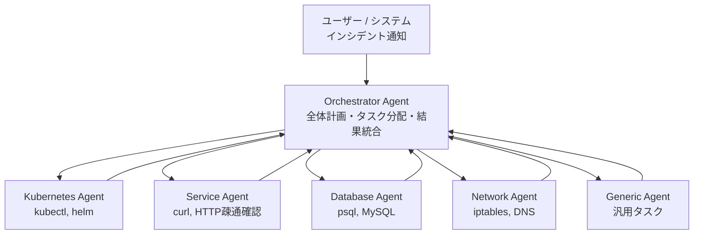

本記事は [arXiv:2503.00455 "SRE-Agent: A Multi-Agent Framework for Automating Site Reliability Engineering Tasks"](https://arxiv.org/abs/2503.00455) の解説記事です。

## 論文概要（Abstract）

SRE-Agentは、大規模言語モデル（LLM）を活用してSite Reliability Engineering（SRE）タスクを自動化するマルチエージェントフレームワークである。Orchestratorエージェントが専門サブエージェント（Kubernetes・Service・Database・Network・Generic）を統括し、複雑なインシデント対応を管理可能なサブタスクに分解する。著者らが構築したSRE-benchベンチマーク上の評価で、ReAct・OpenHands・単一エージェント手法を上回る成功率を達成したと報告されている。

この記事は [Zenn記事: AIエージェントで運用保守を変革する：Agentic SREの実装と4段階導入戦略](https://zenn.dev/0h_n0/articles/699355af9f8dab) の深掘りです。

## 情報源

- **arXiv ID**: 2503.00455
- **URL**: [https://arxiv.org/abs/2503.00455](https://arxiv.org/abs/2503.00455)
- **著者**: Shirin Fard, Rohan Sawant, Liming Zhu, Xiwei Xu
- **発表年**: 2025
- **分野**: cs.SE, cs.AI

## 背景と動機（Background & Motivation）

現代のクラウドネイティブシステムは複雑化が進み、SREエンジニアはKubernetesクラスタの障害診断、マイクロサービス間の依存関係トラブルシューティング、データベースパフォーマンス問題の解決、ネットワーク障害の根本原因分析など、高度に専門化されたタスクを日常的にこなす必要がある。

著者らは、従来のSRE自動化における4つの課題を指摘している：

1. **ツール空間の広大さ**: `kubectl`、`helm`、`psql`、`curl`、`iptables`等の多様なツールの組み合わせが必要
2. **長いアクション系列**: 単一インシデントの解決に数十ステップを要することがある
3. **ドメイン専門性**: Kubernetes、DB、ネットワーク各領域の深い知識が不可欠
4. **コンテキスト管理**: 長い診断プロセスでのコンテキスト維持が困難

従来のReActエージェントやOpenHandsのような汎用コード実行エージェントでは、SREドメインの専門性を十分にカバーできないことが実験で示されている。

## 主要な貢献（Key Contributions）

- **貢献1**: Orchestrator＋5種の専門サブエージェントからなるSRE特化マルチエージェントフレームワークの設計・実装
- **貢献2**: Kubernetes環境上のリアルなSREシナリオを評価するSRE-benchベンチマークの構築
- **貢献3**: 既存手法（ReAct、OpenHands、単一エージェント）との比較実験によるマルチエージェント構成の有効性の実証

## 技術的詳細（Technical Details）

### アーキテクチャ: Orchestrator＋専門サブエージェント

SRE-Agentは階層的なマルチエージェント構成を採用している。全体の構造は以下の通りである。



**Orchestrator Agentの役割**は以下の通りである：

1. ユーザーから受け取ったSREタスクを解析
2. タスクを専門サブエージェントに割り当てるサブタスクに分解
3. 各サブエージェントの実行結果を集約
4. 必要に応じて追加サブタスクを動的に生成（動的プランニング）
5. 最終的な修復アクションを決定・実行

**コンテキスト管理戦略**が重要な設計判断である。各サブエージェントは独立したコンテキストウィンドウを持ち、Orchestratorのコンテキストにはサブエージェント結果のサマリーのみが格納される。これにより、長い診断プロセスでも無関係な情報によるコンテキスト汚染を防いでいる。

### 専門サブエージェントの設計

各サブエージェントはドメイン特化のシステムプロンプトとツールセットを持つ：

| エージェント | ツール | 専門知識 |
|---|---|---|
| **Kubernetes Agent** | `kubectl get/describe/logs/exec`, `helm list/status` | Pod lifecycle, Resource limits, ConfigMap/Secret |
| **Service Agent** | `curl`, `wget`, HTTP疎通確認 | REST API, gRPC, サービスメッシュ |
| **Database Agent** | `psql`, `mysql`クライアント, クエリ実行 | クエリ最適化, インデックス, ロック問題 |
| **Network Agent** | `iptables`, `nslookup`, `dig`, `ping` | TCP/IP, DNS, Kubernetes NetworkPolicy |
| **Generic Agent** | 基本シェルコマンド | 上記に当てはまらない汎用タスク |

### アルゴリズム: タスク委譲と結果統合

Orchestratorは以下のツール呼び出しでサブエージェントにタスクを委譲する：

```python
from dataclasses import dataclass
from typing import Protocol


class SubAgent(Protocol):
    """専門サブエージェントの共通インターフェース"""

    def execute(self, task_description: str) -> str:
        """タスクを実行し、自然言語の結果サマリーを返す"""
        ...


@dataclass
class OrchestratorAgent:
    """Orchestratorエージェント: タスク分解と結果統合を担当

    論文ではClaude 3.5 Sonnetをベースモデルとして使用。
    function callingでサブエージェント委譲ツールを呼び出す。
    """

    specialists: dict[str, SubAgent]

    def handle_incident(self, incident_description: str) -> str:
        """インシデント対応のメインフロー

        Args:
            incident_description: インシデントの説明文

        Returns:
            修復結果のサマリー
        """
        # Step 1: タスクを分解（LLMが判断）
        subtasks = self._decompose(incident_description)

        # Step 2: 各サブタスクを適切な専門エージェントに委譲
        findings = {}
        for subtask in subtasks:
            agent_name = subtask["agent"]
            result = self.specialists[agent_name].execute(
                subtask["description"]
            )
            findings[agent_name] = result

        # Step 3: 結果を統合し、追加サブタスクの必要性を判断
        # （動的プランニング: 結果に基づき次のアクションを決定）
        synthesis = self._synthesize(findings)

        if synthesis.needs_more_investigation:
            # 追加調査が必要な場合、再帰的にサブタスクを生成
            additional = self._decompose(synthesis.next_query)
            # ... 繰り返し

        # Step 4: 最終修復アクションを実行
        return self._execute_remediation(synthesis)

    def _decompose(self, description: str) -> list[dict]:
        """LLMがタスクを分解し、委譲先を決定"""
        # LLMのfunction callingで実装
        # 利用可能なツール:
        # - delegate_to_kubernetes_agent(task)
        # - delegate_to_service_agent(task)
        # - delegate_to_database_agent(task)
        # - delegate_to_network_agent(task)
        # - delegate_to_generic_agent(task)
        ...

    def _synthesize(self, findings: dict) -> object:
        """各エージェントの結果を統合"""
        ...

    def _execute_remediation(self, synthesis: object) -> str:
        """最終修復アクションの実行"""
        ...
```

エージェント間の通信は同期的に行われ、サブエージェントの実行結果は自然言語テキストでOrchestratorに返される。この設計により、各エージェントが独立したコンテキストで動作し、Orchestratorは結果のサマリーのみを保持する。

## 実装のポイント（Implementation）

### ベースモデルの選択

論文では**Claude 3.5 Sonnet**（Anthropic）をベースモデルとして使用している。API経由のfunction calling（ツール呼び出し）を活用し、Orchestratorがサブエージェント委譲ツールを呼び出す設計である。

### 実装上の注意点

1. **プロンプト設計がボトルネック**: 各専門エージェントのシステムプロンプトの品質が性能に直結する。Kubernetesトラブルシューティングのベストプラクティスを含むプロンプトが必要
2. **最大ステップ数の設定**: 多すぎるとAPIコスト増加、少なすぎると未完了。タスクの複雑度に応じた調整が必要
3. **コスト考慮**: マルチエージェント構成は単一エージェントの数倍のAPIコストがかかる。Orchestrator＋複数サブエージェントの各呼び出しでトークンを消費する
4. **安全性**: 本番環境での不適切なコマンド実行リスクがある。dry-runモードや承認フローの実装が不可欠

### SRE-benchベンチマーク環境

評価環境は以下の構成である：

- **Kubernetesクラスタ**: minikubeまたはkindを使用
- **マイクロサービスアプリケーション**: 複数コンテナ構成の実アプリ
- **データベース**: PostgreSQL実インスタンス
- **ネットワーク**: iptables、Kubernetes NetworkPolicy

タスクカテゴリは4種類：Kubernetes障害、Microservices障害、Database障害、Network障害。各タスクは完全修復のみを成功とカウントする厳格な評価基準を採用している。

## Production Deployment Guide

### AWS実装パターン（コスト最適化重視）

SRE-AgentをAWS上でデプロイする場合のトラフィック量別推奨構成を以下に示す。

| 規模 | 月間インシデント | 推奨構成 | 月額コスト | 主要サービス |
|------|--------------|---------|-----------|------------|
| **Small** | ~100件 | Serverless | $150-400 | Lambda + Bedrock + DynamoDB |
| **Medium** | ~1,000件 | Hybrid | $800-2,000 | ECS Fargate + Bedrock + ElastiCache |
| **Large** | 5,000件+ | Container | $3,000-8,000 | EKS + Karpenter + EC2 Spot |

**コスト試算の注意事項**: 上記は2026年3月時点のAWS ap-northeast-1（東京）リージョン料金に基づく概算値です。実際のコストはインシデント頻度、LLM呼び出し回数、解決までのステップ数により変動します。最新料金は [AWS料金計算ツール](https://calculator.aws/) で確認してください。

**Small構成の詳細**（月額$150-400）:
- **Lambda**: Orchestratorエージェント実行、1GB RAM、120秒タイムアウト（$30/月）
- **Bedrock**: Claude 3.5 Sonnet（Orchestrator）+ Haiku（サブエージェント）、Prompt Caching有効（$200-300/月）
- **DynamoDB**: インシデント履歴・コンテキスト保存、On-Demand（$15/月）
- **Step Functions**: エージェント間オーケストレーション（$10/月）
- **CloudWatch**: 監視・ログ（$10/月）

**Medium構成の詳細**（月額$800-2,000）:
- **ECS Fargate**: 各エージェントを独立タスクとして実行、0.5vCPU/1GB RAM × 6タスク（$200/月）
- **Bedrock**: Claude 3.5 Sonnet、Batch API活用で50%割引（$400-1,200/月）
- **ElastiCache Redis**: エージェント状態・コンテキストキャッシュ、cache.t3.micro（$15/月）
- **ALB**: リクエストルーティング（$25/月）
- **CloudWatch + X-Ray**: 詳細監視・トレーシング（$30/月）

**コスト削減テクニック**:
- Bedrock Prompt Caching: システムプロンプトのキャッシュで30-90%削減
- Bedrock Batch API: 非リアルタイム分析で50%割引
- Haiku活用: 低リスクのサブエージェント（Service Agent等）にHaikuを使用し、SonnetはOrchestratorのみ
- Step Functionsの条件分岐: 不要なサブエージェント呼び出しをスキップ

### Terraformインフラコード

**Small構成（Serverless）: Lambda + Bedrock + DynamoDB**

```hcl
# --- VPC基盤 ---
module "vpc" {
  source  = "terraform-aws-modules/vpc/aws"
  version = "~> 5.0"

  name = "sre-agent-vpc"
  cidr = "10.0.0.0/16"
  azs  = ["ap-northeast-1a", "ap-northeast-1c"]
  private_subnets = ["10.0.1.0/24", "10.0.2.0/24"]

  enable_nat_gateway   = false
  enable_dns_hostnames = true
}

# --- IAMロール（最小権限） ---
resource "aws_iam_role" "sre_agent_lambda" {
  name = "sre-agent-lambda-role"

  assume_role_policy = jsonencode({
    Version = "2012-10-17"
    Statement = [{
      Action = "sts:AssumeRole"
      Effect = "Allow"
      Principal = { Service = "lambda.amazonaws.com" }
    }]
  })
}

resource "aws_iam_role_policy" "bedrock_invoke" {
  role = aws_iam_role.sre_agent_lambda.id
  policy = jsonencode({
    Version = "2012-10-17"
    Statement = [{
      Effect   = "Allow"
      Action   = ["bedrock:InvokeModel", "bedrock:InvokeModelWithResponseStream"]
      Resource = "arn:aws:bedrock:ap-northeast-1::foundation-model/anthropic.claude-*"
    }]
  })
}

# --- Lambda: Orchestrator Agent ---
resource "aws_lambda_function" "orchestrator" {
  filename      = "orchestrator.zip"
  function_name = "sre-agent-orchestrator"
  role          = aws_iam_role.sre_agent_lambda.arn
  handler       = "index.handler"
  runtime       = "python3.12"
  timeout       = 120
  memory_size   = 1024

  environment {
    variables = {
      BEDROCK_MODEL_ID = "anthropic.claude-3-5-sonnet-20241022-v2:0"
      DYNAMODB_TABLE   = aws_dynamodb_table.incidents.name
    }
  }
}

# --- DynamoDB: インシデント履歴 ---
resource "aws_dynamodb_table" "incidents" {
  name         = "sre-agent-incidents"
  billing_mode = "PAY_PER_REQUEST"
  hash_key     = "incident_id"

  attribute {
    name = "incident_id"
    type = "S"
  }

  ttl {
    attribute_name = "expire_at"
    enabled        = true
  }
}

# --- CloudWatch アラーム ---
resource "aws_cloudwatch_metric_alarm" "lambda_errors" {
  alarm_name          = "sre-agent-errors"
  comparison_operator = "GreaterThanThreshold"
  evaluation_periods  = 1
  metric_name         = "Errors"
  namespace           = "AWS/Lambda"
  period              = 300
  statistic           = "Sum"
  threshold           = 5
  alarm_description   = "SRE-Agentエラー率異常"

  dimensions = {
    FunctionName = aws_lambda_function.orchestrator.function_name
  }
}
```

**Large構成（Container）: EKS + Karpenter**

```hcl
module "eks" {
  source  = "terraform-aws-modules/eks/aws"
  version = "~> 20.0"

  cluster_name    = "sre-agent-cluster"
  cluster_version = "1.31"
  vpc_id          = module.vpc.vpc_id
  subnet_ids      = module.vpc.private_subnets

  cluster_endpoint_public_access = true
  enable_cluster_creator_admin_permissions = true
}

# --- Karpenter: Spot優先の自動スケーリング ---
resource "kubectl_manifest" "karpenter_nodepool" {
  yaml_body = <<-YAML
    apiVersion: karpenter.sh/v1
    kind: NodePool
    metadata:
      name: sre-agents
    spec:
      template:
        spec:
          requirements:
            - key: karpenter.sh/capacity-type
              operator: In
              values: ["spot", "on-demand"]
            - key: node.kubernetes.io/instance-type
              operator: In
              values: ["m5.large", "m5.xlarge", "m6i.large"]
          nodeClassRef:
            group: karpenter.k8s.aws
            kind: EC2NodeClass
            name: default
      limits:
        cpu: "16"
        memory: "64Gi"
      disruption:
        consolidationPolicy: WhenEmptyOrUnderutilized
        consolidateAfter: 30s
  YAML
}

# --- AWS Budgets ---
resource "aws_budgets_budget" "sre_agent" {
  name         = "sre-agent-monthly"
  budget_type  = "COST"
  limit_amount = "8000"
  limit_unit   = "USD"
  time_unit    = "MONTHLY"

  notification {
    comparison_operator       = "GREATER_THAN"
    threshold                 = 80
    threshold_type            = "PERCENTAGE"
    notification_type         = "ACTUAL"
    subscriber_email_addresses = ["ops@example.com"]
  }
}
```

### セキュリティベストプラクティス

**SRE-Agent固有のセキュリティ考慮事項**:

1. **エージェントの権限分離**: 各サブエージェントに必要最小限のIAMロールを付与。Kubernetes Agentには`kubectl get/describe`のみ許可し、`kubectl delete`は承認フロー経由
2. **Dry-runモード**: 修復アクション実行前に`--dry-run`で影響を確認。High-risk操作は人間承認必須
3. **監査ログ**: 全エージェントアクションをCloudTrailに記録。事後レビュー可能
4. **ネットワーク分離**: エージェントはプライベートサブネット内で実行。VPCエンドポイント経由でBedrock/DynamoDB/CloudWatchにアクセス

### 運用・監視設定

```python
import boto3

cloudwatch = boto3.client('cloudwatch')

# SRE-Agent トークン使用量アラート
cloudwatch.put_metric_alarm(
    AlarmName='sre-agent-token-spike',
    ComparisonOperator='GreaterThanThreshold',
    EvaluationPeriods=1,
    MetricName='TokenUsage',
    Namespace='Custom/SREAgent',
    Period=3600,
    Statistic='Sum',
    Threshold=500000,
    ActionsEnabled=True,
    AlarmActions=['arn:aws:sns:ap-northeast-1:123456789:cost-alerts'],
    AlarmDescription='SRE-Agentトークン使用量異常'
)
```

```sql
-- CloudWatch Logs Insights: エージェント呼び出しの分析
fields @timestamp, agent_name, action, duration_ms, tokens_used
| stats avg(duration_ms) as avg_duration,
        sum(tokens_used) as total_tokens,
        count(*) as invocations
  by agent_name, bin(1h)
| sort total_tokens desc
```

### コスト最適化チェックリスト

- [ ] ~100件/月 → Lambda + Bedrock（Serverless）$150-400/月
- [ ] ~1000件/月 → ECS Fargate + Bedrock（Hybrid）$800-2,000/月
- [ ] 5000+件/月 → EKS + Spot（Container）$3,000-8,000/月
- [ ] Spot Instances: Karpenter自動管理で最大90%削減
- [ ] Reserved Instances: 1年コミットで最大72%削減
- [ ] Bedrock Batch API: 非リアルタイム分析で50%割引
- [ ] Prompt Caching: システムプロンプト固定で30-90%削減
- [ ] モデル選択: Orchestratorのみ Sonnet、サブエージェントは Haiku
- [ ] Step Functions条件分岐: 不要なエージェント呼び出しスキップ
- [ ] DynamoDB TTL: 古いインシデントデータの自動削除
- [ ] Lambda メモリ最適化: CloudWatch Lambda Insights で分析
- [ ] AWS Budgets: 月額予算80%で警告
- [ ] Cost Anomaly Detection: 自動異常検知
- [ ] CloudWatch アラーム: トークン使用量スパイク検知
- [ ] 日次コストレポート: SNS/Slackへ自動送信
- [ ] VPCエンドポイント: NAT Gateway不使用でコスト削減
- [ ] タグ戦略: 環境別（dev/staging/prod）でコスト可視化
- [ ] ログ保持期間: 90日でCloudWatch Logs自動削除
- [ ] X-Rayサンプリング: 本番では5%に設定
- [ ] ECS/EKS夜間スケールダウン: 開発環境のみ

## 実験結果（Results）

### ベンチマーク評価

著者らはSRE-benchベンチマーク上で、SRE-Agentを3つのベースラインと比較した。全エージェントで同一のベースモデル（Claude 3.5 Sonnet）を使用し、公平な比較を行っている。

著者らが報告した主要な発見：

1. **SRE-Agentは全カテゴリ（Kubernetes, Microservices, Database, Network）で最高の成功率を達成**した
2. **マルチエージェント構成が単一エージェント構成を有意に上回る**結果が得られた
3. **専門化されたサブエージェントが複雑なタスクで特に有効**であった

### カテゴリ別の分析

著者らの分析によると：

- **Kubernetesタスク**: `kubectl`の適切な使用とKubernetes専門知識の組み合わせが有効。CrashLoopBackOffの診断では、環境変数設定ミスの特定→ConfigMap修正→Pod再起動確認という一連の対応を自動化
- **Databaseタスク**: 専門DBエージェントがPostgreSQLのスロークエリ問題を効率的に診断。インデックス欠如の特定→インデックス作成→性能改善確認の流れ
- **Networkタスク**: iptables操作など複雑なネットワーク設定変更でマルチエージェント構成の優位性が顕著
- **Microservicesタスク**: サービス間依存関係の追跡でOrchestratorの分割戦略が有効

### アブレーション実験

著者らのアブレーション実験で以下が確認されている：

- Orchestratorのみ（サブエージェントなし）→ 性能低下
- サブエージェントの専門化なし（全部Generic）→ 性能低下
- エージェント数の削減 → 一部カテゴリで性能低下

これらの結果は、**専門化されたマルチエージェント構成の各コンポーネントが独立に貢献している**ことを示している。

### 失敗パターン

一方で、以下の失敗パターンも報告されている：

- 複数コンポーネントにまたがる連鎖障害での誤診断
- 環境固有の設定（カスタムオペレーター等）への対応失敗
- LLMのハルシネーション（存在しないファイルパスやコマンドオプションの誤報告）

## 実運用への応用（Practical Applications）

### Zenn記事との関連

Zenn記事で解説したSupervisor＋専門エージェントパターンの実装例として、SRE-Agentは具体的な参考になる。特に以下の点が関連する：

- **Orchestrator→Supervisor**: Zenn記事のSupervisor Agentに相当するのがSRE-AgentのOrchestrator Agent
- **専門サブエージェント**: Zenn記事のログ分析・メトリクス分析・Runbook実行エージェントの分割は、SRE-Agentの5専門エージェント（K8s/Service/DB/Network/Generic）と設計思想が共通
- **段階的導入**: SRE-Agentの評価結果を考慮すると、Zenn記事のStage 2（Advised）での運用が現時点では現実的

### 導入時の考慮事項

- **APIコスト**: マルチエージェント構成では単一エージェントの数倍のトークン消費が見込まれる。サブエージェントごとのモデル選択（Orchestratorは高性能モデル、定型タスクのサブエージェントは軽量モデル）でコストを最適化する必要がある
- **コンテキスト管理**: 各エージェントの独立コンテキスト戦略は、長いインシデント対応での情報損失を防ぐ反面、サブエージェント間での情報共有が制限される
- **安全性の設計**: 本番環境での自律修復には、Zenn記事で解説したKill Switch（タイムアウト付きロールバック）の実装が不可欠

## 関連研究（Related Work）

- **ReAct（Yao et al., 2022）**: Reasoning + Actingの統合フレームワーク。SREタスクには専門化が不足しており、SRE-Agentのベースラインとして比較。SRE-Agentが全カテゴリで上回っている
- **OpenHands（Wang et al., 2024）**: コード実行特化エージェント。汎用的だがSREドメインへの適応がない。SRE-Agentとの比較でドメイン専門化の重要性が示された
- **ARES（Pujar et al., 2024, arXiv:2410.17033）**: IBM Researchによるマルチエージェントフレームワーク。SRE Manager + Monitoring/Diagnosis/Remediationの4エージェント構成。Known failureで87%、Novel failureで43%の成功率を報告
- **AIOpsLab（Microsoft Research, 2024）**: AI エージェント評価のための標準化フレームワーク。SRE-benchとは異なるアプローチで、ベンチマーク環境の再現性を重視

## まとめと今後の展望

SRE-Agentは、LLMベースのマルチエージェントフレームワークとしてSREタスク自動化の有効性を実証した。Orchestrator＋専門サブエージェントの階層構成により、単一エージェントや汎用エージェントを上回る成功率を達成している。

著者らが指摘する今後の課題として、並列実行の実装（現状は順次実行のみ）、未知障害パターンへの汎化能力の向上、本番環境での安全性保証が挙げられる。SREドメインにおけるマルチエージェント設計のリファレンス実装として、今後の研究の基盤となることが期待される。

## 参考文献

- **arXiv**: [https://arxiv.org/abs/2503.00455](https://arxiv.org/abs/2503.00455)
- **Related Zenn article**: [https://zenn.dev/0h_n0/articles/699355af9f8dab](https://zenn.dev/0h_n0/articles/699355af9f8dab)
