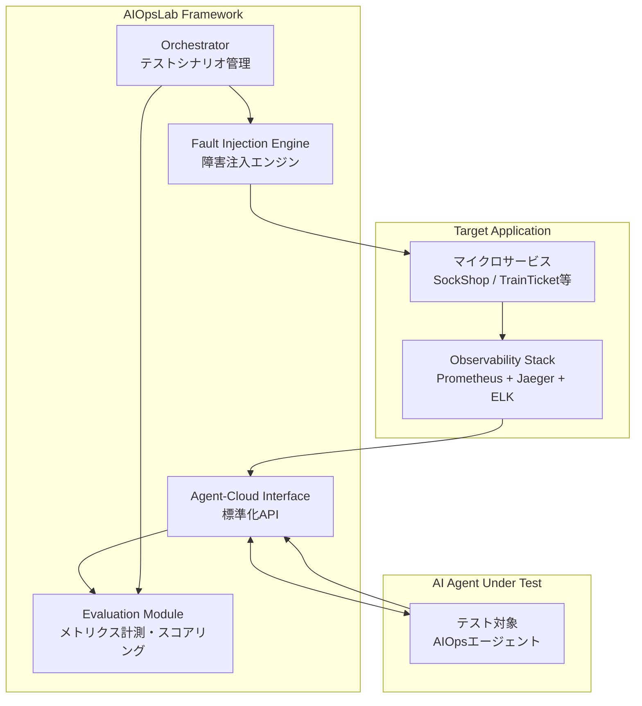

本記事は [Microsoft Research AIOpsLab](https://www.microsoft.com/en-us/research/project/aiopslab/) の技術解説記事です。

## ブログ概要（Summary）

AIOpsLabは、Microsoft Researchが開発したAIOps（Artificial Intelligence for IT Operations）手法の標準化されたベンチマーク評価フレームワークである。クラウドインシデント対応を自動化するAIエージェントを、再現可能な条件下で公平に評価するための統一的なインターフェース（Agent-Cloud Interface, ACI）と、障害注入（Fault Injection）メカニズムを提供する。MITライセンスでオープンソース公開されており、研究者・実務者が自身のAIOps手法をベンチマーク可能である。

この記事は [Zenn記事: AIエージェントで運用保守を変革する：Agentic SREの実装と4段階導入戦略](https://zenn.dev/0h_n0/articles/699355af9f8dab) の深掘りです。

## 情報源

- **種別**: 企業テックブログ / 研究プロジェクト
- **URL**: [https://www.microsoft.com/en-us/research/project/aiopslab/](https://www.microsoft.com/en-us/research/project/aiopslab/)
- **組織**: Microsoft Research
- **GitHub**: [https://github.com/microsoft/AIOpsLab](https://github.com/microsoft/AIOpsLab)
- **ライセンス**: MIT License

## 技術的背景（Technical Background）

AIOps分野では、異常検知、根本原因分析（RCA）、自動修復などの手法が多数提案されているが、各手法の評価条件が統一されていないという課題がある。具体的には以下の問題がある：

1. **評価環境の非再現性**: 各研究が独自のテストベッド上で評価しており、結果の直接比較が困難
2. **障害シナリオの多様性不足**: 特定の障害タイプのみで評価し、汎化性能が検証されていない
3. **エンドツーエンド評価の欠如**: 異常検知・RCA・修復を個別に評価するのみで、パイプライン全体の性能が測定されていない
4. **実運用環境との乖離**: 合成データやシミュレーションのみの評価で、実際のマイクロサービス環境での性能が不明

AIOpsLabは、これらの課題を解決するために、実際のマイクロサービスアプリケーション上で障害を注入し、AIエージェントの対応性能を統一的に評価する仕組みを提供する。

## 実装アーキテクチャ（Architecture）

### システム構成



**Orchestrator**: テストシナリオの定義・実行を管理する。障害注入のタイミング、評価期間、成功条件を設定する。

**Agent-Cloud Interface（ACI）**: AIエージェントがクラウド環境と対話するための標準化されたAPIインターフェース。以下の操作を提供する：

- `observe()`: メトリクス・ログ・トレースの取得
- `diagnose()`: 根本原因分析の実行と結果提出
- `remediate()`: 修復アクションの実行
- `get_alert()`: アラート情報の取得

**Fault Injection Engine**: テスト対象のマイクロサービスに対して、制御された障害を注入する。注入可能な障害タイプは以下の通りである：

| 障害タイプ | 注入方法 | 例 |
|----------|---------|-----|
| CPU負荷 | stress-ng | CPU使用率90%固定 |
| メモリリーク | メモリ割当てプロセス | 漸増メモリ消費 |
| ネットワーク遅延 | tc（traffic control） | 200ms追加レイテンシ |
| パケットロス | tc | 10%パケットドロップ |
| ディスクI/O | fio | ディスクI/Oスロットリング |
| サービス停止 | Kill signal | Pod/コンテナ停止 |
| 設定変更 | ConfigMap変更 | 不正な環境変数設定 |

**Evaluation Module**: AIエージェントの対応性能を以下のメトリクスで評価する：

$$
\text{Score} = w_d \cdot S_{\text{detection}} + w_r \cdot S_{\text{RCA}} + w_m \cdot S_{\text{remediation}} + w_t \cdot S_{\text{time}}
$$

ここで、
- $S_{\text{detection}}$: 異常検知の正確性（Precision, Recall, F1）
- $S_{\text{RCA}}$: 根本原因分析の正確性（Top-K精度）
- $S_{\text{remediation}}$: 修復の成功率
- $S_{\text{time}}$: 対応時間（MTTD + MTTR）
- $w_d, w_r, w_m, w_t$: 各メトリクスの重み

### テスト対象アプリケーション

AIOpsLabは以下のマイクロサービスアプリケーションを同梱している：

- **SockShop**: Weaveworks製のデモマイクロサービス（EC通販）。13サービスで構成
- **TrainTicket**: 大規模マイクロサービスベンチマーク。40+サービスで構成
- **カスタムアプリケーション**: ユーザーが独自のKubernetes上のアプリケーションを登録可能

### ACIの実装例

```python
from dataclasses import dataclass
from typing import Any

@dataclass
class Observation:
    """ACIから取得するオブザーバビリティデータ"""
    metrics: dict[str, list[float]]  # Prometheusメトリクス
    logs: list[dict[str, Any]]       # 構造化ログ
    traces: list[dict[str, Any]]     # 分散トレース
    alerts: list[dict[str, str]]     # 発火中のアラート

class AgentCloudInterface:
    """AIOpsLabのAgent-Cloud Interface"""

    def observe(self, time_range: tuple[str, str]) -> Observation:
        """指定時間範囲のオブザーバビリティデータを取得"""
        ...

    def diagnose(self, root_cause: str, confidence: float) -> dict:
        """根本原因分析結果を提出"""
        return {
            "root_cause": root_cause,
            "confidence": confidence,
            "submitted_at": "2026-03-03T12:00:00Z",
        }

    def remediate(self, action: str, target: str) -> dict:
        """修復アクションを実行"""
        return {
            "action": action,
            "target": target,
            "status": "executed",
        }

    def get_alert(self) -> dict:
        """現在のアラート情報を取得"""
        ...

# エージェント実装例
def simple_sre_agent(aci: AgentCloudInterface) -> None:
    """AIOpsLabで評価されるシンプルなSREエージェントの例"""
    # Step 1: アラート取得
    alert = aci.get_alert()

    # Step 2: オブザーバビリティデータ収集
    obs = aci.observe(time_range=("now-15m", "now"))

    # Step 3: 根本原因分析（実際にはLLMやMLモデルを使用）
    root_cause = analyze_root_cause(obs)
    aci.diagnose(root_cause=root_cause, confidence=0.85)

    # Step 4: 修復アクション実行
    aci.remediate(action="restart_pod", target=root_cause)
```

## Production Deployment Guide

### AWS実装パターン（コスト最適化重視）

AIOpsLabの評価環境をAWS上に構築する場合の推奨構成は以下の通りである。

| 構成 | 用途 | 主要サービス | 月額概算 |
|------|-----|-------------|---------|
| Small | 開発・研究 | EKS (t3.medium) + Prometheus | $200-400 |
| Medium | CI/CD統合テスト | EKS (m7g.large) + Managed Prometheus | $600-1,200 |
| Large | 大規模ベンチマーク | EKS (m7g.xlarge) + OpenSearch + Jaeger | $2,000-4,000 |

**Small構成（開発・研究用）**: EKS上にSockShopとAIOpsLabをデプロイ。t3.mediumインスタンス3台程度。Prometheus/Grafanaをクラスタ内で運用。月額$200-400程度。

**Medium構成（CI/CD統合テスト）**: Amazon Managed Service for Prometheus（AMP）を使用し、メトリクスの永続化と高可用性を確保。Graviton3ベースのm7g.largeインスタンスでコスト効率を向上。月額$600-1,200程度。

**Large構成（大規模ベンチマーク）**: TrainTicket（40+サービス）を含む大規模マイクロサービスのベンチマーク環境。OpenSearchでログ分析、Jaegerで分散トレーシングを本格運用。月額$2,000-4,000程度。

※ 上記コストは2026年3月時点のAWS ap-northeast-1（東京）リージョン料金に基づく概算値。実際のコストはベンチマーク実行頻度により変動する。最新料金はAWS料金計算ツールで確認を推奨。

**コスト削減テクニック**:
- Spot Instances活用（EKSワーカーノード）で最大90%削減
- ベンチマーク非実行時のクラスタスケールダウン（Karpenter）
- Amazon Managed Prometheus（AMP）の無料枠活用（2億サンプル/月）
- Graviton3インスタンス（m7g系）で20%の価格対性能改善

### Terraformインフラコード

**Small構成（開発・研究用）**:

```hcl
module "eks" {
  source  = "terraform-aws-modules/eks/aws"
  version = "~> 20.0"

  cluster_name    = "aiopslab-dev"
  cluster_version = "1.31"

  vpc_id     = module.vpc.vpc_id
  subnet_ids = module.vpc.private_subnets

  eks_managed_node_groups = {
    aiopslab = {
      instance_types = ["t3.medium"]
      min_size       = 2
      max_size       = 5
      desired_size   = 3

      labels = { workload = "aiopslab" }
    }
  }
}

# Helm: Prometheus + Grafana
resource "helm_release" "prometheus" {
  name       = "prometheus"
  repository = "https://prometheus-community.github.io/helm-charts"
  chart      = "kube-prometheus-stack"
  namespace  = "monitoring"

  create_namespace = true

  set {
    name  = "prometheus.prometheusSpec.retention"
    value = "7d"
  }

  set {
    name  = "grafana.enabled"
    value = "true"
  }
}

# AIOpsLab名前空間
resource "kubernetes_namespace" "aiopslab" {
  metadata { name = "aiopslab" }
}

# Budgets
resource "aws_budgets_budget" "aiopslab" {
  name         = "aiopslab-monthly"
  budget_type  = "COST"
  limit_amount = "400"
  limit_unit   = "USD"
  time_unit    = "MONTHLY"

  notification {
    comparison_operator       = "GREATER_THAN"
    threshold                 = 80
    threshold_type            = "PERCENTAGE"
    notification_type         = "ACTUAL"
    subscriber_email_addresses = ["dev-team@example.com"]
  }
}
```

**Large構成（大規模ベンチマーク）**:

```hcl
module "eks_benchmark" {
  source  = "terraform-aws-modules/eks/aws"
  version = "~> 20.0"

  cluster_name    = "aiopslab-benchmark"
  cluster_version = "1.31"

  vpc_id     = module.vpc.vpc_id
  subnet_ids = module.vpc.private_subnets

  cluster_endpoint_public_access = false
}

# Karpenter（Spot優先、ベンチマーク完了後自動縮退）
resource "kubectl_manifest" "benchmark_nodepool" {
  yaml_body = yamlencode({
    apiVersion = "karpenter.sh/v1"
    kind       = "NodePool"
    metadata   = { name = "benchmark-workers" }
    spec = {
      template = {
        spec = {
          requirements = [
            { key = "karpenter.sh/capacity-type", operator = "In", values = ["spot", "on-demand"] },
            { key = "node.kubernetes.io/instance-type", operator = "In",
              values = ["m7g.xlarge", "m7g.2xlarge"] }
          ]
        }
      }
      limits = { cpu = "128", memory = "512Gi" }
      disruption = {
        consolidationPolicy = "WhenEmptyOrUnderutilized"
        consolidateAfter    = "60s"
      }
    }
  })
}

# Amazon Managed Prometheus
resource "aws_prometheus_workspace" "aiopslab" {
  alias = "aiopslab-benchmark"
}

# OpenSearch（ログ分析）
resource "aws_opensearch_domain" "aiopslab_logs" {
  domain_name    = "aiopslab-logs"
  engine_version = "OpenSearch_2.17"

  cluster_config {
    instance_type  = "r7g.large.search"
    instance_count = 2
  }

  ebs_options {
    ebs_enabled = true
    volume_size = 200
    volume_type = "gp3"
  }

  encrypt_at_rest { enabled = true }
  node_to_node_encryption { enabled = true }
}
```

### 運用・監視設定

**CloudWatch Logs Insights（ベンチマーク結果分析）**:

```
fields @timestamp, agent_name, scenario, detection_score, rca_score, remediation_score, total_score
| filter scenario like /cpu_stress/
| stats avg(total_score) as avg_score, max(total_score) as best_score by agent_name
| sort avg_score desc
```

**Cost Explorer自動レポート**:

```python
import boto3
from datetime import datetime, timedelta

ce = boto3.client("ce")

def get_daily_cost_report() -> dict:
    """日次コストレポートを取得"""
    end = datetime.utcnow().strftime("%Y-%m-%d")
    start = (datetime.utcnow() - timedelta(days=1)).strftime("%Y-%m-%d")

    response = ce.get_cost_and_usage(
        TimePeriod={"Start": start, "End": end},
        Granularity="DAILY",
        Metrics=["UnblendedCost"],
        Filter={
            "Tags": {
                "Key": "Project",
                "Values": ["aiopslab"],
            }
        },
        GroupBy=[{"Type": "DIMENSION", "Key": "SERVICE"}],
    )
    return response
```

### コスト最適化チェックリスト

**アーキテクチャ選択**:
- [ ] 開発・研究用 → Small（EKS t3.medium + Prometheus）
- [ ] CI/CD統合テスト → Medium（EKS m7g + AMP）
- [ ] 大規模ベンチマーク → Large（EKS m7g.xlarge + OpenSearch）

**リソース最適化**:
- [ ] EC2/EKS: Spot Instances優先（最大90%削減）
- [ ] Graviton3インスタンス（m7g系）で20%改善
- [ ] Karpenter自動スケーリング（ベンチマーク非実行時縮退）
- [ ] Reserved Instances: 常時稼働ノード
- [ ] EBS gp3ボリューム（gp2比20%安価）

**監視・アラート**:
- [ ] AWS Budgets設定（月額上限アラート）
- [ ] Cost Anomaly Detection有効化
- [ ] 日次コストレポート
- [ ] Prometheus retention期間の最適化

**リソース管理**:
- [ ] 未使用リソース定期削除
- [ ] タグ戦略（Project/Environment/Experiment-ID）
- [ ] ベンチマーク完了後の自動クリーンアップスクリプト
- [ ] 開発環境の夜間・週末停止
- [ ] S3 Intelligent-Tieringでベンチマーク結果アーカイブ

## パフォーマンス最適化（Performance）

AIOpsLabのベンチマーク実行パフォーマンスに関する情報は以下の通りである：

- **SockShop環境の起動時間**: 約2-3分（13サービスのPod起動完了まで）
- **障害注入から検知可能状態まで**: 約10-30秒（障害タイプにより異なる）
- **1シナリオの評価所要時間**: 約5-15分（エージェントの対応速度に依存）
- **SockShop全シナリオ完了**: 約2-4時間（20+シナリオ）

障害注入エンジンはKubernetesのChaos Mesh/LitmusChaoを活用しており、Pod単位の細粒度な障害制御が可能である。

## 運用での学び（Production Lessons）

Microsoft ResearchチームがAIOpsLabの開発・運用を通じて得た知見を以下にまとめる：

1. **ACIの抽象度設計**: APIが抽象的すぎるとエージェントの自由度が制限され、具体的すぎると特定の実装に依存する。AIOpsLabは`observe/diagnose/remediate`の3操作に集約することでバランスを取っている
2. **障害注入の再現性**: 同一シナリオでも環境のゆらぎ（ネットワーク遅延、リソース競合）により結果が変動する。複数回実行の統計的評価が必要
3. **エージェント間の公平性**: 異なるLLMバックエンド（GPT-4、Claude、Llama等）を使用するエージェント間で、LLMの能力差を制御変数として扱う必要がある

## 学術研究との関連（Academic Connection）

AIOpsLabは以下の論文と関連している：

- **AIOpsLab: A Holistic Framework to Evaluate AI Agents for Enabling Autonomous Cloud** (arXiv:2407.12165): AIOpsLabの設計論文。ACI、Fault Injection Engine、Evaluation Moduleの詳細設計が記載されている
- **ARES (arXiv:2410.17033)**: IBM ResearchのARESはAIOpsLabと類似の評価フレームワーク上でテストされている
- **SRE-Agent (arXiv:2503.00455)**: SRE-Agentの独自ベンチマーク（SRE-bench）はAIOpsLabの設計思想と類似点が多い

## まとめと実践への示唆

AIOpsLabは、AIOps手法の標準化ベンチマーク評価を実現するMicrosoft Researchのオープンソースフレームワークである。ACIによる統一インターフェース、Fault Injection Engineによる制御された障害注入、Evaluation Moduleによる定量的評価の3つの機能により、異なるAIOps手法の公平な比較が可能になる。

Zenn記事で紹介されているAgentic SRE手法を導入する際には、AIOpsLabを活用したベンチマーク評価をPoC段階で実施することで、手法の選定根拠を定量的に示すことが可能である。MITライセンスのため商用利用も可能で、社内評価環境として構築するハードルは低い。

## 参考文献

- **Project URL**: [https://www.microsoft.com/en-us/research/project/aiopslab/](https://www.microsoft.com/en-us/research/project/aiopslab/)
- **GitHub**: [https://github.com/microsoft/AIOpsLab](https://github.com/microsoft/AIOpsLab)
- **Related Paper**: [arXiv:2407.12165](https://arxiv.org/abs/2407.12165)
- **Related Zenn article**: [https://zenn.dev/0h_n0/articles/699355af9f8dab](https://zenn.dev/0h_n0/articles/699355af9f8dab)
