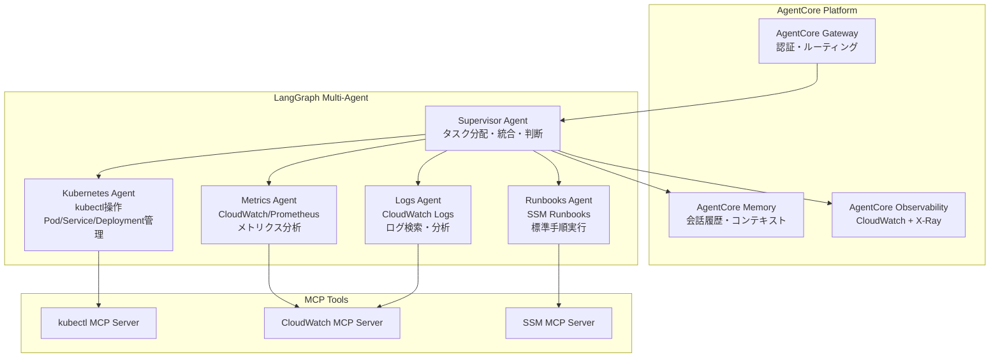

本記事は [AWS Bedrock AgentCore SRE Agent](https://github.com/awslabs/amazon-bedrock-agentcore-samples/tree/main/02-use-cases/SRE-agent) の技術解説記事です。

## ブログ概要（Summary）

Amazon Bedrock AgentCoreのSREエージェントは、AWSが公開するオープンソースのリファレンス実装であり、LangGraphフレームワークを用いたSupervisor＋4専門エージェント（Kubernetes Agent、Metrics Agent、Logs Agent、Runbooks Agent）のマルチエージェント構成で、Kubernetesクラスタのインシデント対応を自動化する。Model Context Protocol（MCP）を活用してツール連携を標準化し、AgentCoreのGateway・Memory・Identity・Observability機能と統合されている。Python 3.12+で実装され、Amazon Cognito認証、CloudWatch統合が組み込まれている。

この記事は [Zenn記事: AIエージェントで運用保守を変革する：Agentic SREの実装と4段階導入戦略](https://zenn.dev/0h_n0/articles/699355af9f8dab) の深掘りです。

## 情報源

- **種別**: AWS公式サンプル / リファレンス実装
- **URL**: [https://github.com/awslabs/amazon-bedrock-agentcore-samples](https://github.com/awslabs/amazon-bedrock-agentcore-samples)
- **組織**: AWS Labs
- **ライセンス**: Apache License 2.0

## 技術的背景（Technical Background）

Amazon Bedrock AgentCoreは、AWSが提供するマネージドAIエージェント基盤サービスであり、以下の機能を提供する：

1. **AgentCore Gateway**: エージェントへのリクエストルーティング、レート制限、認証を管理するAPIゲートウェイ
2. **AgentCore Memory**: エージェントの会話履歴やコンテキストを永続化するストレージ層
3. **AgentCore Identity**: Amazon Cognitoベースの認証・認可メカニズム
4. **AgentCore Observability**: エージェントの動作をCloudWatch Logs/X-Rayで追跡する監視層

SREエージェントは、このAgentCore基盤上で動作するマルチエージェントシステムのリファレンス実装として公開されている。SRE領域でのAIエージェント活用の具体的なアーキテクチャパターンを示すことを目的としている。

## 実装アーキテクチャ（Architecture）

### マルチエージェント構成



**Supervisor Agent**: LangGraphのSupervisorパターンで実装される統括エージェント。インシデント通知を受けて初期分析を行い、適切な専門エージェントにタスクを委譲する。各エージェントからの報告を統合して最終判断（修復実行・エスカレーション・追加調査）を行う。

**Kubernetes Agent**: `kubectl`コマンドをMCPプロトコル経由で実行し、Pod状態確認、Deployment管理、Service設定確認、ConfigMap/Secret検証等を行う。

**Metrics Agent**: CloudWatch MetricsおよびPrometheusからメトリクスを取得し、異常パターンの分析を行う。CPU/メモリ使用率、リクエストレイテンシ、エラーレート等のSLI（Service Level Indicator）を監視する。

**Logs Agent**: CloudWatch Logsからログを検索・分析し、エラーメッセージの抽出、スタックトレースの解析、異常パターンの特定を行う。

**Runbooks Agent**: AWS Systems Manager（SSM）のRunbooksを検索・実行し、標準化された修復手順を自動適用する。

### Model Context Protocol（MCP）の活用

SREエージェントはMCPを活用して、外部ツールとの連携を標準化している。MCPは、LLMエージェントと外部ツール間の通信プロトコルであり、ツールの検出・実行・結果取得を統一的なインターフェースで行える。

```python
from dataclasses import dataclass
from typing import Any

@dataclass
class MCPTool:
    """MCP Tool定義"""
    name: str
    description: str
    input_schema: dict[str, Any]

@dataclass
class MCPResult:
    """MCP Tool実行結果"""
    tool_name: str
    output: Any
    error: str | None = None

# Kubernetes Agent用MCPツール例
kubectl_get_pods = MCPTool(
    name="kubectl_get_pods",
    description="指定ネームスペースのPod一覧を取得する",
    input_schema={
        "type": "object",
        "properties": {
            "namespace": {"type": "string", "description": "Kubernetesネームスペース"},
            "label_selector": {"type": "string", "description": "ラベルセレクタ（オプション）"},
        },
        "required": ["namespace"],
    },
)

kubectl_describe_pod = MCPTool(
    name="kubectl_describe_pod",
    description="指定Podの詳細情報を取得する",
    input_schema={
        "type": "object",
        "properties": {
            "pod_name": {"type": "string"},
            "namespace": {"type": "string"},
        },
        "required": ["pod_name", "namespace"],
    },
)
```

### LangGraphによるワークフロー実装

LangGraphのStateGraphを使用して、Supervisorパターンのマルチエージェントワークフローを構築している：

```python
from langgraph.graph import StateGraph, END
from typing import TypedDict, Literal

class SREState(TypedDict):
    """SREエージェントの状態"""
    incident_description: str
    messages: list[dict]
    current_agent: str
    k8s_findings: dict | None
    metrics_findings: dict | None
    logs_findings: dict | None
    diagnosis: str | None
    remediation_plan: str | None
    status: Literal["investigating", "diagnosed", "remediated", "escalated"]

def supervisor_node(state: SREState) -> SREState:
    """Supervisorエージェント: タスク分配と判断"""
    # LLMを使用してインシデント分析と次のアクションを決定
    ...

def kubernetes_agent_node(state: SREState) -> SREState:
    """Kubernetes Agent: kubectl操作によるクラスタ状態調査"""
    # MCPプロトコル経由でkubectl実行
    ...

def metrics_agent_node(state: SREState) -> SREState:
    """Metrics Agent: CloudWatch/Prometheusメトリクス分析"""
    ...

def logs_agent_node(state: SREState) -> SREState:
    """Logs Agent: CloudWatch Logsの検索・分析"""
    ...

def runbooks_agent_node(state: SREState) -> SREState:
    """Runbooks Agent: SSM Runbookの検索・実行"""
    ...

def should_continue(state: SREState) -> str:
    """Supervisor判断に基づくルーティング"""
    if state["status"] == "escalated":
        return END
    if state["status"] == "remediated":
        return END
    return state["current_agent"]

# StateGraph構築
workflow = StateGraph(SREState)
workflow.add_node("supervisor", supervisor_node)
workflow.add_node("kubernetes", kubernetes_agent_node)
workflow.add_node("metrics", metrics_agent_node)
workflow.add_node("logs", logs_agent_node)
workflow.add_node("runbooks", runbooks_agent_node)

workflow.set_entry_point("supervisor")
workflow.add_conditional_edges("supervisor", should_continue, {
    "kubernetes": "kubernetes",
    "metrics": "metrics",
    "logs": "logs",
    "runbooks": "runbooks",
    END: END,
})

# 各エージェントからSupervisorに戻る
for agent in ["kubernetes", "metrics", "logs", "runbooks"]:
    workflow.add_edge(agent, "supervisor")

app = workflow.compile()
```

## Production Deployment Guide

### AWS実装パターン（コスト最適化重視）

Bedrock AgentCore SREエージェントはAWSネイティブであるため、AWS上での構築が最も自然である。

| 構成 | クラスタ規模 | 主要サービス | 月額概算 |
|------|-----------|-------------|---------|
| Small | ~10ノード | Lambda + Bedrock + AgentCore | $100-250 |
| Medium | ~50ノード | ECS Fargate + Bedrock + AgentCore | $500-1,000 |
| Large | 100+ノード | EKS + Bedrock + AgentCore + SageMaker | $2,000-4,500 |

**Small構成（~10ノード）**: Lambda関数でエージェントを実装。Bedrock（Claude 3.5 Sonnet）でLLM推論。AgentCore Gatewayで認証・ルーティング。CloudWatch統合で監視。月額$100-250程度。

**Medium構成（~50ノード）**: ECS FargateでLong-Runningエージェント。Bedrock Batch APIで非リアルタイム分析。AgentCore Memoryで会話コンテキスト永続化。月額$500-1,000程度。

**Large構成（100+ノード）**: EKSでエージェントを高可用性構成。SageMakerでカスタムモデルホスティング（異常検知モデル等）。複数クラスタのフェデレーション監視。月額$2,000-4,500程度。

※ 上記コストは2026年3月時点のAWS ap-northeast-1（東京）リージョン料金に基づく概算値。実際のコストはインシデント頻度とLLM呼び出し回数により変動する。最新料金はAWS料金計算ツールで確認を推奨。

**コスト削減テクニック**:
- Bedrock Prompt Caching（類似インシデントで30-90%削減）
- Bedrock Batch API（非リアルタイム分析で50%削減）
- Lambda Arm64（Graviton2）で20%価格削減
- Spot Instances（EKSワーカー）で最大90%削減
- AgentCore Memory TTL設定で不要データの自動削除

### Terraformインフラコード

**Small構成（Serverless + AgentCore）**:

```hcl
# Bedrock AgentCore設定
resource "aws_bedrockagent_agent" "sre_supervisor" {
  agent_name              = "sre-supervisor-agent"
  foundation_model        = "anthropic.claude-3-5-sonnet-20241022-v2:0"
  idle_session_ttl_in_seconds = 600
  instruction             = file("prompts/supervisor_system_prompt.txt")

  agent_resource_role_arn = aws_iam_role.bedrock_agent_role.arn
}

# Supervisor Lambda
resource "aws_lambda_function" "sre_supervisor" {
  function_name = "sre-supervisor-agent"
  runtime       = "python3.12"
  handler       = "supervisor.handler"
  memory_size   = 1024
  timeout       = 300
  architectures = ["arm64"]

  environment {
    variables = {
      BEDROCK_MODEL_ID    = "anthropic.claude-3-5-sonnet-20241022-v2:0"
      K8S_AGENT_FUNCTION  = aws_lambda_function.k8s_agent.function_name
      METRICS_AGENT_FUNCTION = aws_lambda_function.metrics_agent.function_name
      LOGS_AGENT_FUNCTION = aws_lambda_function.logs_agent.function_name
      COGNITO_USER_POOL   = aws_cognito_user_pool.sre.id
    }
  }

  role = aws_iam_role.supervisor_role.arn
}

# Kubernetes Agent Lambda
resource "aws_lambda_function" "k8s_agent" {
  function_name = "sre-kubernetes-agent"
  runtime       = "python3.12"
  handler       = "kubernetes_agent.handler"
  memory_size   = 512
  timeout       = 120
  architectures = ["arm64"]

  vpc_config {
    subnet_ids         = module.vpc.private_subnets
    security_group_ids = [aws_security_group.lambda_sg.id]
  }

  environment {
    variables = {
      EKS_CLUSTER_NAME = module.eks.cluster_name
      BEDROCK_MODEL_ID = "anthropic.claude-3-5-sonnet-20241022-v2:0"
    }
  }

  role = aws_iam_role.k8s_agent_role.arn
}

# Cognito認証
resource "aws_cognito_user_pool" "sre" {
  name = "sre-agent-users"

  password_policy {
    minimum_length    = 12
    require_lowercase = true
    require_numbers   = true
    require_symbols   = true
    require_uppercase = true
  }
}

# IAMロール（最小権限）
resource "aws_iam_role_policy" "k8s_agent_policy" {
  name = "k8s-agent-policy"
  role = aws_iam_role.k8s_agent_role.id
  policy = jsonencode({
    Version = "2012-10-17"
    Statement = [
      {
        Effect   = "Allow"
        Action   = ["bedrock:InvokeModel"]
        Resource = "arn:aws:bedrock:ap-northeast-1::foundation-model/anthropic.claude-3-5-sonnet-*"
      },
      {
        Effect   = "Allow"
        Action   = ["eks:DescribeCluster"]
        Resource = module.eks.cluster_arn
      },
      {
        Effect   = "Allow"
        Action   = ["logs:CreateLogGroup", "logs:CreateLogStream", "logs:PutLogEvents"]
        Resource = "arn:aws:logs:*:*:*"
      }
    ]
  })
}

# CloudWatch アラーム
resource "aws_cloudwatch_metric_alarm" "agent_errors" {
  alarm_name          = "sre-agent-error-rate"
  comparison_operator = "GreaterThanThreshold"
  evaluation_periods  = 3
  metric_name         = "Errors"
  namespace           = "AWS/Lambda"
  period              = 300
  statistic           = "Sum"
  threshold           = 5

  dimensions = {
    FunctionName = aws_lambda_function.sre_supervisor.function_name
  }

  alarm_actions = [aws_sns_topic.sre_alerts.arn]
}
```

**Large構成（EKS + AgentCore）**:

```hcl
module "eks" {
  source  = "terraform-aws-modules/eks/aws"
  version = "~> 20.0"

  cluster_name    = "sre-agent-cluster"
  cluster_version = "1.31"

  vpc_id     = module.vpc.vpc_id
  subnet_ids = module.vpc.private_subnets

  cluster_endpoint_public_access = false

  eks_managed_node_groups = {
    system = {
      instance_types = ["m7g.large"]
      min_size       = 2
      max_size       = 4
      desired_size   = 2
    }
  }
}

# Karpenter（Spot優先）
resource "kubectl_manifest" "sre_nodepool" {
  yaml_body = yamlencode({
    apiVersion = "karpenter.sh/v1"
    kind       = "NodePool"
    metadata   = { name = "sre-agents" }
    spec = {
      template = {
        spec = {
          requirements = [
            { key = "karpenter.sh/capacity-type", operator = "In", values = ["spot", "on-demand"] },
            { key = "node.kubernetes.io/instance-type", operator = "In",
              values = ["m7g.xlarge", "m7g.2xlarge", "c7g.xlarge"] }
          ]
        }
      }
      limits = { cpu = "64", memory = "256Gi" }
    }
  })
}

# AWS Budgets
resource "aws_budgets_budget" "sre_agent" {
  name         = "sre-agent-monthly"
  budget_type  = "COST"
  limit_amount = "4500"
  limit_unit   = "USD"
  time_unit    = "MONTHLY"

  notification {
    comparison_operator       = "GREATER_THAN"
    threshold                 = 80
    threshold_type            = "PERCENTAGE"
    notification_type         = "ACTUAL"
    subscriber_email_addresses = ["sre-team@example.com"]
  }
}
```

### 運用・監視設定

**CloudWatch Logs Insights（エージェント動作分析）**:

```
fields @timestamp, agent_name, incident_id, action, duration_ms, status
| filter agent_name in ["supervisor", "kubernetes", "metrics", "logs", "runbooks"]
| stats avg(duration_ms) as avg_duration, count() as action_count by agent_name, status
| sort avg_duration desc
```

**X-Ray トレーシング（LangGraphワークフロー）**:

```python
from aws_xray_sdk.core import xray_recorder, patch_all

patch_all()

@xray_recorder.capture("sre_workflow")
def run_sre_workflow(incident: dict) -> dict:
    """SREエージェントワークフローのトレーシング"""
    subsegment = xray_recorder.current_subsegment()
    subsegment.put_annotation("incident_id", incident["id"])
    subsegment.put_annotation("severity", incident["severity"])

    # LangGraph実行
    result = app.invoke({"incident_description": incident["description"]})

    subsegment.put_metadata("final_status", result["status"])
    return result
```

### コスト最適化チェックリスト

**アーキテクチャ選択**:
- [ ] 10ノード以下 → Serverless（Lambda + Bedrock + AgentCore）
- [ ] 10-50ノード → Hybrid（ECS Fargate + Bedrock）
- [ ] 50ノード以上 → Container（EKS + Bedrock + AgentCore）

**リソース最適化**:
- [ ] EC2/EKS: Spot Instances優先（最大90%削減）
- [ ] Lambda: Arm64（Graviton2）使用（20%削減）
- [ ] Lambda: Power Tuningでメモリ最適化
- [ ] Reserved Instances: 常時稼働コンポーネント
- [ ] Karpenter: アイドル時スケールダウン

**LLMコスト削減**:
- [ ] Bedrock Prompt Caching有効化（30-90%削減）
- [ ] Bedrock Batch API使用（非リアルタイムで50%削減）
- [ ] モデル選択ロジック（トリアージ: Haiku、診断: Sonnet）
- [ ] トークン数制限（ログ要約で入力トークン削減）

**監視・アラート**:
- [ ] AWS Budgets設定（月額上限アラート）
- [ ] CloudWatch アラーム（エージェントエラー率監視）
- [ ] Cost Anomaly Detection有効化
- [ ] 日次コストレポート（SNS通知）
- [ ] X-Rayトレーシングでボトルネック可視化

**リソース管理**:
- [ ] 未使用Lambda関数バージョン削除
- [ ] タグ戦略（Project/Environment/Agent-Name）
- [ ] AgentCore Memory TTL設定
- [ ] CloudWatch Logs保持期間の最適化
- [ ] 開発環境の夜間停止

## パフォーマンス最適化（Performance）

AgentCore SREエージェントのパフォーマンス特性は以下の通りである：

- **初回応答時間**: Supervisorの初期分析に約3-5秒（Bedrock推論時間）
- **エージェント間遷移**: LangGraph StateGraph経由で約100-200ms
- **kubectl操作**: VPC内からのkubectl実行で約500ms-2秒
- **CloudWatch Logs検索**: Insights APIで約3-10秒（クエリ複雑度依存）
- **エンドツーエンド対応時間**: 典型的なPodクラッシュ対応で約2-5分

**最適化ポイント**:
- Bedrock Prompt Cachingでリピートクエリの推論時間を50%以上削減
- Lambda Provisioned Concurrencyでコールドスタート排除（ただしコスト増）
- CloudWatch Logs Insights結果のキャッシュ（ElastiCache）で反復クエリ高速化

## 運用での学び（Production Lessons）

AWSのリファレンス実装から読み取れる運用上の教訓を以下にまとめる：

1. **MCP標準化の恩恵**: ツール連携をMCPで標準化することで、新しいツール（Terraform操作、Helm操作等）の追加が容易になる。プラグインアーキテクチャとして機能する
2. **Cognito認証の重要性**: SREエージェントはクラスタ操作権限を持つため、認証・認可の厳密な管理が不可欠。AgentCore Identityによる統合管理が推奨される
3. **AgentCore Memoryの活用**: インシデント対応のコンテキストを永続化することで、同一インシデントの再発時に過去の対応を参照可能。RAGに近い効果を低コストで実現
4. **LangGraphの利点**: StateGraphによる明示的なワークフロー定義により、エージェント間の遷移が可視化・デバッグ可能になる。CrewAIやAutoGen比でデバッガビリティに優れる

## 学術研究との関連（Academic Connection）

- **SRE-Agent (arXiv:2503.00455)**: Orchestrator + 5 SubAgent構成。AgentCore SREのSupervisor + 4 Agent構成と類似するが、SRE-Agentは独自のShellEnv実行環境を持つ点で異なる
- **ARES (arXiv:2410.17033)**: RAGベースの知識検索を採用。AgentCore SREのRunbooks Agentが類似機能を提供するが、ARESはエンベディングベースのベクトル検索、AgentCoreはSSM Runbooks APIという実装の違いがある
- **ReAct (arXiv:2210.03629)**: LangGraphの基盤となるReasoningとActingの交互実行パターン。AgentCore SREの各エージェントはReActパターンで動作する

## まとめと実践への示唆

AWS Bedrock AgentCoreのSREエージェントは、LangGraph + MCP + AgentCoreを組み合わせたマルチエージェントSREシステムのリファレンス実装である。Supervisor + 4専門エージェント構成、MCP標準化によるツール拡張性、Cognito認証による安全な運用、CloudWatch/X-Rayによる包括的な監視が特徴である。

Zenn記事で述べられている「4段階導入戦略」の実装基盤として、AgentCoreのマネージドサービス群（Gateway/Memory/Identity/Observability）を活用することで、インフラ構築の工数を削減し、エージェントロジックの開発に集中できる。Apache License 2.0のため、リファレンス実装をベースにカスタマイズした商用利用も可能である。

## 参考文献

- **GitHub**: [https://github.com/awslabs/amazon-bedrock-agentcore-samples](https://github.com/awslabs/amazon-bedrock-agentcore-samples)
- **AgentCore Documentation**: [https://docs.aws.amazon.com/bedrock/latest/userguide/agentcore.html](https://docs.aws.amazon.com/bedrock/latest/userguide/agentcore.html)
- **LangGraph**: [https://langchain-ai.github.io/langgraph/](https://langchain-ai.github.io/langgraph/)
- **MCP**: [https://modelcontextprotocol.io/](https://modelcontextprotocol.io/)
- **Related Zenn article**: [https://zenn.dev/0h_n0/articles/699355af9f8dab](https://zenn.dev/0h_n0/articles/699355af9f8dab)
