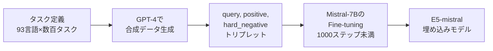

本記事は [ACL 2024: Improving Text Embeddings with Large Language Models](https://aclanthology.org/2024.acl-long.642/)（arXiv: [2401.00368](https://arxiv.org/abs/2401.00368)）の解説記事です。

## 論文概要（Abstract）

Wang et al.（Microsoft Research）は、GPT-4を用いて93言語・数百種類の埋め込みタスクに対応する合成データを生成し、デコーダー専用LLM（Mistral-7B）を1000ステップ未満でFine-tuningすることで、テキスト埋め込みモデルのSOTAを達成する手法を提案している。著者らが報告した主要モデルE5-mistral-7b-instructは、MTEB English（56タスク）で66.63、BEIR（18データセット）で56.9（nDCG@10）のスコアを記録し、従来の多段階事前学習を必要とするアプローチを上回ったとしている。

この記事は [Zenn記事: Embedding Fine-tuning実践：合成データと評価ループでRAG検索精度を改善する](https://zenn.dev/0h_n0/articles/3a80f7fd58cc8e) の深掘りです。

## 情報源

- **会議名**: ACL 2024（62nd Annual Meeting of the Association for Computational Linguistics）
- **年**: 2024
- **URL**: [https://aclanthology.org/2024.acl-long.642/](https://aclanthology.org/2024.acl-long.642/)
- **著者**: Liang Wang, Nan Yang, Xiaolong Huang, Luo Fang, Minghui Song, Ping Liu, Haifeng Wang, Tingting Liu, Furu Wei（Microsoft Research）
- **arXiv**: [2401.00368](https://arxiv.org/abs/2401.00368)

## カンファレンス情報

ACLは自然言語処理（NLP）分野における最高峰の国際会議の1つであり、計算言語学全般を対象としている。2024年のACL Long Paperとして採択された本論文は、テキスト埋め込みの訓練手法に関する研究である。

## 技術的詳細（Technical Details）

### 合成データ生成パイプライン

本手法の核心は、LLM（GPT-4）を用いて多様な合成訓練データを生成する点にある。従来手法が大規模ウェブコーパスでの多段階事前学習と、キュレーション済みラベル付きデータセットでのFine-tuningを必要としたのに対し、本手法は合成データのみで競争力のある性能を実現している。



著者らは以下のタスクタイプに対応する合成データを生成したと報告している。

- **非対称タスク**: 短いクエリ → 長いドキュメントの検索
- **対称タスク**: 文類似度、言い換え検出
- **分類タスク**: テキスト分類、感情分析
- **クラスタリングタスク**: テキストのグループ化

各タスクについて、GPT-4に（query, positive, hard_negative）のトリプレットを生成させている。合計約50万件の訓練例が生成されたと報告されている。

### デコーダー専用LLMからの埋め込み抽出

従来のテキスト埋め込みモデルはエンコーダーアーキテクチャ（BERT等）の`[CLS]`トークンを使用するが、E5-mistralはデコーダー専用LLM（Mistral-7B）の**EOSトークンの最終層表現**を埋め込みとして使用する。

デコーダー専用LLMでは左から右への注意機構により、後方のトークンが前方の全トークンに注意を向けるため、EOSトークンの表現は文全体の情報を集約する。

入力フォーマットは以下のとおりである。

```
Instruct: {task_description}
Query: {text}
```

クエリ側のみにタスク記述（instruction）を付加し、ドキュメント側はインストラクションなしでエンコードする。著者らによると、このインストラクション付与によりMTEBスコアが+1.5〜2.0ポイント向上したと報告されている。

### 損失関数

標準的なInfoNCE損失（コントラスト損失）を使用している。

$$
\mathcal{L} = -\log \frac{\exp(\text{sim}(q, p^+) / \tau)}{\exp(\text{sim}(q, p^+) / \tau) + \sum_{\text{neg}} \exp(\text{sim}(q, \text{neg}) / \tau)}
$$

ここで、
- $q$: クエリの埋め込み
- $p^+$: ポジティブドキュメントの埋め込み
- $\text{neg}$: ネガティブサンプルの埋め込み（バッチ内ネガティブ + マイニングされたハードネガティブ）
- $\tau$: 温度パラメータ（$\tau = 0.02$）
- $\text{sim}(\cdot, \cdot)$: コサイン類似度

### タスク固有インストラクションの例

```python
TASK_INSTRUCTIONS: dict[str, str] = {
    "retrieval": "Given a web search query, retrieve relevant passages that answer the query",
    "semantic_similarity": "Retrieve semantically similar text",
    "classification": "Classify the sentiment of a given movie review",
    "clustering": "Identify the topic or theme of the given text",
}


def format_query(text: str, task: str) -> str:
    """タスク固有インストラクションを付加したクエリを生成する

    Args:
        text: 入力テキスト
        task: タスクタイプ（retrieval, semantic_similarity等）

    Returns:
        インストラクション付きクエリ文字列
    """
    instruction = TASK_INSTRUCTIONS.get(task, "")
    return f"Instruct: {instruction}\nQuery: {text}"
```

## 実装のポイント（Implementation）

### 訓練セットアップ

論文で報告されている訓練設定は以下のとおりである。

| パラメータ | 値 | 備考 |
|-----------|-----|------|
| ベースモデル | Mistral-7B-v0.1 | 7.1Bパラメータ |
| Fine-tuningステップ数 | < 1000 | 逓減収益あり |
| バッチサイズ | 1024 | gradient accumulation使用 |
| 学習率 | 1e-4 | linear warmup + decay |
| 最大系列長 | 4096トークン | Mistralのスライディングウィンドウ注意を活用 |
| 温度 $\tau$ | 0.02 | — |
| ハードウェア | 8× NVIDIA A100 80GB | 混合精度（bf16） |
| オプティマイザ | AdamW | — |

### 実装時の注意点

1. **推論コスト**: 7.1Bパラメータのデコーダーモデルは、109M〜335Mパラメータのエンコーダーモデルと比較して推論コストが大幅に高い。本番環境での使用には、量子化やモデル蒸留を検討する必要がある

2. **合成データ生成コスト**: GPT-4 APIによるデータ生成は非自明なコストが発生する。Zenn記事で紹介されている手法では、Claude Sonnet等のAPIコストが比較的低いモデルを使用することでコストを抑えている

3. **BitextMiningの低性能**: E5-mistralのBitextMiningカテゴリのスコアは10.95と他カテゴリに比べ著しく低い。対訳ペアの検索タスクにはデコーダー専用LLMの注意機構が適さない可能性がある

4. **ステップ数と性能の関係**: 著者らの報告によると、500ステップで約65.5、1000ステップで66.63、2000ステップで66.7と、1000ステップ以降は逓減収益が顕著になる

## Production Deployment Guide

### AWS実装パターン（コスト最適化重視）

LLMベースの埋め込みモデルは推論コストが高いため、コスト最適化が特に重要になる。

| 規模 | 月間リクエスト | 推奨構成 | 月額コスト | 主要サービス |
|------|--------------|---------|-----------|------------|
| **Small** | ~3,000 (100/日) | Serverless | $100-300 | Lambda + SageMaker Serverless |
| **Medium** | ~30,000 (1,000/日) | Hybrid | $500-1,500 | SageMaker Real-time + ElastiCache |
| **Large** | 300,000+ (10,000/日) | Container | $3,000-8,000 | EKS + GPU Spot + Karpenter |

**LLMベース埋め込みモデル固有のコスト考慮**:
- 7Bモデルの推論にはGPU（最低16GB VRAM）が必要
- 量子化（INT8/INT4）により推論コストを50-75%削減可能
- SageMaker Serverless Inferenceは低トラフィック時にコールドスタートが発生（15-30秒）
- Bedrock等のマネージドサービスでの提供は2026年3月時点で限定的

**コスト削減テクニック**:
- 知識蒸留: 7Bモデルの知識を小規模モデル（335M）に蒸留して推論コストを削減
- バッチ推論: リアルタイム性が不要な場合、SageMaker Batch Transformで50%削減
- 結果キャッシュ: 同一テキストの埋め込みをElastiCache/DynamoDBにキャッシュ
- Spot GPU: g5.xlarge（A10G）のSpotインスタンスで最大70%削減

**コスト試算の注意事項**: 上記は2026年3月時点のAWS ap-northeast-1リージョン料金に基づく概算値である。7Bモデルの推論コストは量子化の有無とバッチサイズにより大きく変動するため、実環境での検証を推奨する。

### Terraformインフラコード

**Small構成（SageMaker Serverless Inference）**:

```hcl
resource "aws_sagemaker_model" "embedding_model" {
  name               = "e5-mistral-embedding"
  execution_role_arn = aws_iam_role.sagemaker.arn

  primary_container {
    image          = "763104351884.dkr.ecr.ap-northeast-1.amazonaws.com/huggingface-pytorch-inference:2.1-transformers4.37-gpu-py310-cu121-ubuntu22.04"
    model_data_url = "s3://${aws_s3_bucket.models.bucket}/e5-mistral-7b/model.tar.gz"

    environment = {
      HF_MODEL_ID           = "intfloat/e5-mistral-7b-instruct"
      HF_TASK                = "feature-extraction"
      SM_NUM_GPUS            = "1"
      MAX_INPUT_LENGTH       = "4096"
      QUANTIZE               = "bitsandbytes"
    }
  }
}

resource "aws_sagemaker_endpoint_configuration" "serverless" {
  name = "e5-mistral-serverless-config"

  production_variants {
    model_name             = aws_sagemaker_model.embedding_model.name
    variant_name           = "default"
    serverless_config {
      max_concurrency = 5
      memory_size_in_mb = 6144
    }
  }
}
```

### コスト最適化チェックリスト

- [ ] ~100 req/日 → SageMaker Serverless（$100-300/月）
- [ ] ~1000 req/日 → SageMaker Real-time ml.g5.xlarge（$500-1,500/月）
- [ ] 10000+ req/日 → EKS + g5.xlarge Spot × 2-4台（$3,000-8,000/月）
- [ ] INT8量子化で推論メモリ50%削減
- [ ] 埋め込み結果のキャッシュ戦略（同一テキスト再計算防止）
- [ ] 知識蒸留の検討（7B→335Mへの蒸留）
- [ ] SageMaker Savings Plans（最大64%削減）
- [ ] GPU Spot Instances（最大70%削減）
- [ ] AWS Budgets設定（80%警告、100%アラート）
- [ ] CloudWatch メトリクス（推論レイテンシ、GPU使用率）

## 実験結果（Results）

### MTEB English Benchmark（56タスク）

著者らが報告しているMTEBの結果は以下のとおりである（論文Table 1より）。

| モデル | パラメータ | MTEBスコア |
|--------|----------|-----------|
| E5-mistral-7b-instruct | 7.1B | 66.63 |
| UAE-Large-V1 | 335M | 64.64 |
| bge-large-en-v1.5 | 335M | 64.23 |
| GTE-large | 335M | 63.13 |
| text-embedding-ada-002 | 非公開 | 60.99 |

E5-mistralのタスク別内訳（論文Table 2より）:

| カテゴリ | スコア |
|---------|--------|
| Retrieval | 56.90 |
| STS | 84.67 |
| Classification | 78.47 |
| PairClassification | 88.27 |
| Reranking | 60.16 |
| Clustering | 49.25 |
| Summarization | 31.40 |
| BitextMining | 10.95 |

### BEIR Benchmark（18データセット、nDCG@10）

検索タスクに特化したBEIRベンチマークでの結果は以下のとおりである（論文Table 3より）。

| モデル | BEIRスコア（nDCG@10） |
|--------|---------------------|
| E5-mistral-7b-instruct | 56.9 |
| bge-large-en-v1.5 | 54.3 |
| GTE-large | 53.1 |
| e5-large-v2 | 50.6 |

BEIRデータセット別の結果では、FEVER（95.5）やTREC-COVID（85.5）で特に高いスコアを示す一方、SCIDOCS（19.0）やTouché（26.5）では比較的低い結果となっている。

### アブレーション実験

著者らが報告しているアブレーション結果（論文Section 4より）:

| 条件 | MTEBスコア |
|------|-----------|
| 合成データのみ（提案手法） | 66.63 |
| ラベル付きデータのみ | ~63-64 |
| 500ステップ | ~65.5 |
| 1000ステップ | 66.63 |
| 2000ステップ | ~66.7（逓減収益） |
| インストラクションあり | 66.63 |
| インストラクションなし | ~64.6-65.1 |

## 実運用への応用（Practical Applications）

本論文のアプローチは、RAGシステムの構築において以下の実務的な示唆を提供する。

**合成データの有効性**: Zenn記事で紹介されている合成クエリ生成の手法と共通するアプローチであり、LLMによる合成データ生成が高品質な埋め込みモデルの訓練に有効であることを示している。約50万件の合成データで、数十億トークンの事前学習に匹敵する性能が得られたという報告は、ドメイン特化Fine-tuningのコスト効率を裏付けている。

**モデルサイズと推論コストのトレードオフ**: E5-mistralは7.1Bパラメータであり、本番環境での推論コストが課題となる。Zenn記事で紹介されているBAAI/bge-base-en-v1.5（109M）のFine-tuningの方が、推論コストの面では実用的である。ただし、E5-mistralの知識蒸留により小規模モデルの性能を向上させるアプローチも検討に値する。

**タスク固有インストラクションの効果**: クエリ側にタスク記述を付加することで+1.5〜2.0ポイントの向上が得られる点は、RAGシステムのクエリ処理パイプラインに直接適用できる。

## まとめ

著者らは、GPT-4による合成データ生成とデコーダー専用LLMのFine-tuningを組み合わせることで、従来の多段階事前学習を必要としない効率的なテキスト埋め込みモデルの訓練手法を提案している。E5-mistral-7b-instructはMTEB 66.63、BEIR 56.9（nDCG@10）を達成したと報告されているが、7.1Bパラメータに起因する推論コストの高さは実務上のトレードオフとなる。Zenn記事で紹介されている合成データ生成の手法と組み合わせることで、ドメイン特化型の埋め込みモデル開発に応用可能である。

## 参考文献

- **Conference URL**: [https://aclanthology.org/2024.acl-long.642/](https://aclanthology.org/2024.acl-long.642/)
- **arXiv**: [https://arxiv.org/abs/2401.00368](https://arxiv.org/abs/2401.00368)
- **Code**: [https://github.com/microsoft/unilm/tree/master/e5](https://github.com/microsoft/unilm/tree/master/e5)
- **Model**: [intfloat/e5-mistral-7b-instruct](https://huggingface.co/intfloat/e5-mistral-7b-instruct)（HuggingFace Hub、MIT License）
- **Related Zenn article**: [https://zenn.dev/0h_n0/articles/3a80f7fd58cc8e](https://zenn.dev/0h_n0/articles/3a80f7fd58cc8e)

---

:::message
この記事はAI（Claude Code）により自動生成されました。内容の正確性については論文の原文で検証していますが、実際の利用時は公式ドキュメントもご確認ください。
:::
