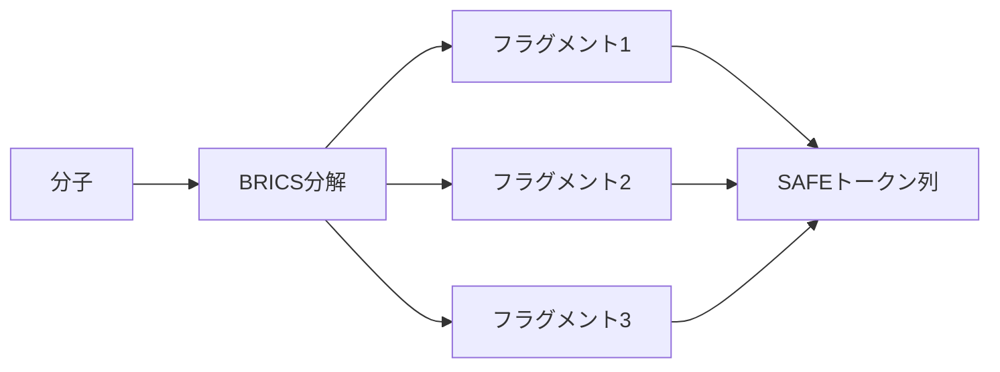

本記事は [GenMol: A Drug Discovery Generalist with Discrete Diffusion](https://arxiv.org/abs/2501.06158)（Lee et al., ICML 2025）の解説記事です。

## 論文概要（Abstract）

GenMolは、NVIDIAが開発した離散拡散モデルベースの汎用分子生成フレームワークである。SAFE（Sequential Attachment-based Fragment Embedding）表現とマスク離散拡散を組み合わせ、de novo生成・フラグメント制約付き生成・ゴール指向ヒット生成・リード最適化を単一モデルで処理する。著者らは、PMO（Practical Molecular Optimization）ベンチマークの23タスク中18タスクで最高性能を達成し、28以上のベースライン手法を上回ったと報告している。

この記事は [Zenn記事: 生成AIで創薬はどう変わるか：AlphaFold3からIsoDDEまで2026年最前線](https://zenn.dev/0h_n0/articles/244adaf3ac915e) の深掘りです。

## 情報源

- **会議名**: ICML 2025（International Conference on Machine Learning）
- **arXiv ID**: 2501.06158
- **URL**: [https://arxiv.org/abs/2501.06158](https://arxiv.org/abs/2501.06158)
- **著者**: Seul Lee, Karsten Kreis, Srimukh Prasad Veccham, Meng Liu et al.（NVIDIA）
- **コード**: [https://github.com/NVIDIA-Digital-Bio/genmol](https://github.com/NVIDIA-Digital-Bio/genmol)

## カンファレンス情報

**ICMLについて**:
ICMLは機械学習分野の最高峰会議の一つであり、NeurIPS・ICLRとともにMLのトップ3カンファレンスに位置づけられる。GenMolはICML 2025に採択されており、離散拡散モデルの創薬応用として学術的に高い評価を受けている。

## 技術的詳細（Technical Details）

### SAFE表現（Sequential Attachment-based Fragment Embedding）

従来のSMILES表現は分子を文字列として線形にエンコードするが、原子レベルの操作しかできず、フラグメント単位の操作が困難であった。SAFE表現はBRICS分解に基づき、分子を**フラグメントブロックの順序非依存な列**として表現する。



SAFE表現の特徴：
- フラグメント間の順序に依存しない（順序不変性）
- フラグメント単位での制約付き生成が自然に実現可能
- SMILES互換（相互変換可能）

### マスク離散拡散フレームワーク

GenMolはマスク離散拡散モデル（Masked Discrete Diffusion Model）を採用している。連続空間の拡散モデルとは異なり、離散トークン空間で動作する。

**フォワードプロセス（マスキング）**:

トークン列 $\mathbf{x}_0$ に対し、マスク比率 $\alpha_t$（$t$ の増加とともに1→0に単調減少）に従ってトークンをマスクトークン $[\text{MASK}]$ に置換する：

$$
q(\mathbf{x}_t | \mathbf{x}_0) = \prod_{i=1}^{L} \left[\alpha_t \cdot \delta(\mathbf{x}_t^{(i)}, \mathbf{x}_0^{(i)}) + (1-\alpha_t) \cdot \delta(\mathbf{x}_t^{(i)}, [\text{MASK}])\right]
$$

ここで、
- $L$: トークン列の長さ
- $\alpha_t$: 時刻 $t$ でのマスク比率（非マスク確率）
- $\delta(a, b)$: クロネッカーのデルタ（$a=b$ で1、それ以外0）
- $\mathbf{x}_t^{(i)}$: 時刻 $t$ での $i$ 番目のトークン

**リバースプロセス（デノイジング）**:

BERTベースのデノイジングネットワーク $f_\theta$ がマスクされたトークンを予測する。学習損失はNELBO（Negative Evidence Lower Bound）であり、各タイムステップでのマスク言語モデリング損失の加重平均として定式化される：

$$
\mathcal{L}_{\text{NELBO}} = \mathbb{E}_{t \sim \mathcal{U}(0,1)} \left[ \sum_{i: \mathbf{x}_t^{(i)} = [\text{MASK}]} -\log f_\theta(\mathbf{x}_0^{(i)} | \mathbf{x}_t, t) \right]
$$

### フラグメント再マスク戦略（Fragment Remasking）

GenMolの最大の技術的革新は**フラグメント再マスク**である。個々のトークンではなく、SAFEフラグメント全体をマスクチャンクとして置換し再生成する。

```python
def fragment_remasking(
    molecule_safe: list[str],
    model: GenMolModel,
    target_fragments: list[int],
    n_iterations: int = 5,
) -> list[str]:
    """フラグメント再マスク戦略による分子最適化。

    Args:
        molecule_safe: SAFE表現のフラグメントリスト
        model: 学習済みGenMolモデル
        target_fragments: 再マスク対象のフラグメントインデックス
        n_iterations: 再マスク反復回数

    Returns:
        最適化された分子のSAFE表現
    """
    current = molecule_safe.copy()

    for iteration in range(n_iterations):
        # 対象フラグメントをマスクチャンクに置換
        masked = current.copy()
        for idx in target_fragments:
            masked[idx] = "[MASK_CHUNK]"

        # モデルによるフラグメント再生成
        regenerated = model.denoise(masked)

        # 品質評価（結合親和性、薬剤らしさ等）
        if evaluate(regenerated) > evaluate(current):
            current = regenerated

    return current
```

この戦略は構造活性相関（SAR）に基づく直感に合致している。メディシナルケミストは分子の特定のフラグメントを置換して活性を最適化するが、フラグメント再マスクはこの操作をAIで自動化している。

### 信頼度サンプリング（Confidence Sampling）

推論時のトークンアンマスキングは信頼度スコアに基づいて行われる。温度パラメータ $\tau$ とランダム性パラメータ $r$ により品質と多様性のトレードオフを制御する：

$$
p_i = \text{softmax}(f_\theta(\mathbf{x}_t)^{(i)} / \tau) + r \cdot \text{Gumbel}(0, 1)
$$

ここで、
- $\tau$: Softmax温度（低いほど高品質、高いほど多様）
- $r$: Gumbelノイズの強度（サンプリングステップに伴い減少）

### 分子コンテキストガイダンス（MCG）

ゴール指向生成のため、MCG（Molecular Context Guidance）が導入されている。これはマスク離散拡散に特化したガイダンス手法であり、目的関数（結合親和性、薬剤らしさ等）の勾配情報をデノイジングプロセスに注入する。

## 実装のポイント（Implementation）

### 学習設定

著者らが報告した学習設定：

| パラメータ | 値 |
|-----------|-----|
| アーキテクチャ | BERT（最大256ポジション） |
| 語彙サイズ | 1,880トークン |
| データセット | SAFE（ZINC + UniChem） |
| バッチサイズ | 2,048 |
| 学習率 | 3×10⁻⁴ |
| オプティマイザ | AdamW |
| 学習ステップ | 50,000 |
| GPU | NVIDIA A100 × 8 |
| 学習時間 | 約6時間 |

### 実装上の注意点

- **SAFE変換**: RDKitのBRICS分解を使用。変換時にフラグメント境界のアタッチメントポイントの扱いに注意が必要
- **トークナイゼーション**: SAFEフラグメントをBPE（Byte Pair Encoding）でトークン化。語彙サイズの選択が生成品質に影響する
- **推論速度**: 非自己回帰型デコーディングにより、1,000分子の生成に約21秒（著者ら報告、A100 GPU使用）。自己回帰型SAFE-GPTの27.7秒と比較して高速

## Production Deployment Guide

### AWS実装パターン（コスト最適化重視）

| 規模 | 月間リクエスト | 推奨構成 | 月額コスト | 主要サービス |
|------|--------------|---------|-----------|------------|
| **Small** | ~3,000 (100/日) | GPU Serverless | $100-300 | Lambda + SageMaker Serverless + S3 |
| **Medium** | ~30,000 (1,000/日) | GPU Dedicated | $800-1,500 | SageMaker (g5.xlarge) + ElastiCache |
| **Large** | 300,000+ (10,000/日) | GPU Cluster | $3,000-6,000 | EKS + g5.xlarge×2-4 Spot |

GenMolはBERTベースの軽量モデルであり、AF3/IsoDDEと比較して推論コストが低い。

**Small構成の詳細**（月額$100-300）：
- **SageMaker Serverless**: GenMol推論（A10G GPU、メモリ6GB）
- **Lambda**: リクエスト処理・SAFE変換（$10/月）
- **S3**: モデルウェイト・生成分子保存（$5/月）
- **DynamoDB**: 生成結果キャッシュ（$10/月）

**コスト削減テクニック**：
- バッチ生成（1回のリクエストで1,000分子を同時生成）
- Spot Instances活用で最大70%削減
- モデル量子化（FP16）でメモリ使用量半減

**コスト試算の注意事項**：
- 上記は2026年3月時点のAWS ap-northeast-1料金に基づく概算値です
- 最新料金は [AWS料金計算ツール](https://calculator.aws/) で確認してください

### Terraformインフラコード

**Small構成（Serverless）**:

```hcl
resource "aws_iam_role" "sagemaker_genmol" {
  name = "genmol-sagemaker-role"

  assume_role_policy = jsonencode({
    Version = "2012-10-17"
    Statement = [{
      Action = "sts:AssumeRole"
      Effect = "Allow"
      Principal = { Service = "sagemaker.amazonaws.com" }
    }]
  })
}

resource "aws_sagemaker_endpoint_configuration" "genmol" {
  name = "genmol-serverless"

  production_variants {
    variant_name = "default"
    model_name   = aws_sagemaker_model.genmol.name
    serverless_config {
      max_concurrency   = 4
      memory_size_in_mb = 6144
    }
  }
}

resource "aws_dynamodb_table" "molecule_cache" {
  name         = "genmol-molecule-cache"
  billing_mode = "PAY_PER_REQUEST"
  hash_key     = "task_id"

  attribute {
    name = "task_id"
    type = "S"
  }

  ttl {
    attribute_name = "expire_at"
    enabled        = true
  }
}
```

### 運用・監視設定

```python
import boto3

cloudwatch = boto3.client('cloudwatch')

# 分子生成スループット監視
cloudwatch.put_metric_alarm(
    AlarmName='genmol-throughput-low',
    ComparisonOperator='LessThanThreshold',
    EvaluationPeriods=2,
    MetricName='MoleculesGenerated',
    Namespace='Custom/GenMol',
    Period=300,
    Statistic='Sum',
    Threshold=100,
    AlarmDescription='5分間の分子生成数が100未満'
)
```

### コスト最適化チェックリスト

- [ ] ~100 req/日 → SageMaker Serverless - $100-300/月
- [ ] ~1000 req/日 → SageMaker Dedicated - $800-1,500/月
- [ ] 10000+ req/日 → EKS + Spot - $3,000-6,000/月
- [ ] バッチ生成でリクエスト数削減
- [ ] FP16量子化でメモリ使用量半減
- [ ] Spot Instances優先（70%削減）
- [ ] 生成結果キャッシュ（同一条件の再生成回避）
- [ ] AWS Budgets月額予算設定
- [ ] Cost Anomaly Detection有効化

## 実験結果（Results）

### De Novo生成（1,000分子）

著者らが報告した結果（論文Table 1より）：

| 手法 | Validity | Uniqueness | Quality | 生成時間 |
|------|----------|------------|---------|---------|
| GenMol | **100%** | **99.7%** | **84.6%** | **21.1秒** |
| SAFE-GPT | 94% | 99.8% | 54.7% | 27.7秒 |

GenMolは有効性100%を達成しつつ、品質指標でSAFE-GPTを30ポイント上回っている。

### PMOベンチマーク（ゴール指向ヒット生成）

著者らが報告したSum AUC top-10の結果（論文Table 3より）：

| 手法 | Sum AUC top-10 | 最高性能タスク数（/23） |
|------|---------------|---------------------|
| **GenMol** | **18.208** | **18** |
| f-RAG | 16.928 | - |
| Genetic GFN | 16.213 | - |
| Mol GA | 14.708 | - |

GenMolは28以上のベースライン手法と比較して、23タスク中18タスクで最高性能を達成している。

### リード最適化

5つのターゲットタンパク質（parp1, fa7, 5ht1b, braf, jak2）に対するリード最適化実験では、類似度制約 $\delta=0.4, 0.6$ の条件下でGenMolがGraph GAおよびRetMolを上回る結合親和性改善を達成したと報告されている。

### アブレーション研究

著者らのアブレーション実験（論文Section 5.5より）：
- **GenMol-NR**（再マスクなし）: リード最適化で頻繁に失敗
- **GenMol-TR**（トークン再マスク）: フラグメント再マスクより劣る性能
- **フラグメント再マスクの優位性**: 化学的に意味のある単位での操作が性能向上に寄与

## 実運用への応用（Practical Applications）

GenMolの創薬パイプラインへの適用は以下のシナリオで有効である。

**ヒット-to-リード最適化**: フラグメント再マスクにより、既知ヒット化合物の特定部分を置換して結合親和性・ADMET特性を同時に最適化。メディシナルケミストの作業を加速。

**フラグメント制約付き設計**: リンカー設計、スキャフォールドモーフィング、モチーフ拡張など、既存の部分構造を保持しつつ新規分子を設計。

**バーチャルスクリーニング前の化合物ライブラリ拡充**: de novo生成により、既存ライブラリにない新規化学空間の分子を効率的に生成。

**制約**: 著者らも指摘しているように、GenMolは2D分子グラフ（SAFE表現）で動作するため、3D構造の直接生成には対応していない。ターゲットタンパク質との3D適合性評価にはAF3/IsoDDEやFlowDockとの組み合わせが必要である。

## 関連研究（Related Work）

- **SAFE-GPT**（Noutahi et al., 2024）: SAFE表現を用いた自己回帰型分子生成。GenMolの直接の比較対象であり、GenMolはSAFE-GPTの品質を大幅に上回っている
- **DiGress**（Vignac et al., NeurIPS 2022）: 離散拡散による分子グラフ生成。GenMolは離散拡散をSAFE表現に適用した点で異なる
- **DiffLinker**（Igashov et al., 2024）: 拡散モデルによるリンカー設計。フラグメント制約付き生成の先行研究
- **f-RAG**（Chen et al., 2024）: フラグメントベースのRetrieval-Augmented Generation。PMOベンチマークでGenMolに次ぐ2位

## まとめと今後の展望

GenMolは離散拡散モデルとSAFE表現の組み合わせにより、創薬の複数フェーズ（de novo生成、フラグメント制約付き生成、ゴール指向最適化、リード最適化）を単一モデルで処理する汎用フレームワークを実現した。フラグメント再マスク戦略はメディシナルケミストの操作を模倣しており、化学的に解釈可能な最適化を可能にしている。

今後の課題として、3D構造の直接生成、合成可能性の保証、マルチオブジェクティブ最適化の高度化が挙げられる。コードがApache 2.0ライセンスで公開されている点は、学術・産業界での広範な利用を促進する。

## 参考文献

- **arXiv**: [https://arxiv.org/abs/2501.06158](https://arxiv.org/abs/2501.06158)
- **Code**: [https://github.com/NVIDIA-Digital-Bio/genmol](https://github.com/NVIDIA-Digital-Bio/genmol)
- **ICML 2025**: [https://openreview.net/forum?id=KM7pXWG1xj](https://openreview.net/forum?id=KM7pXWG1xj)
- **Related Zenn article**: [https://zenn.dev/0h_n0/articles/244adaf3ac915e](https://zenn.dev/0h_n0/articles/244adaf3ac915e)
