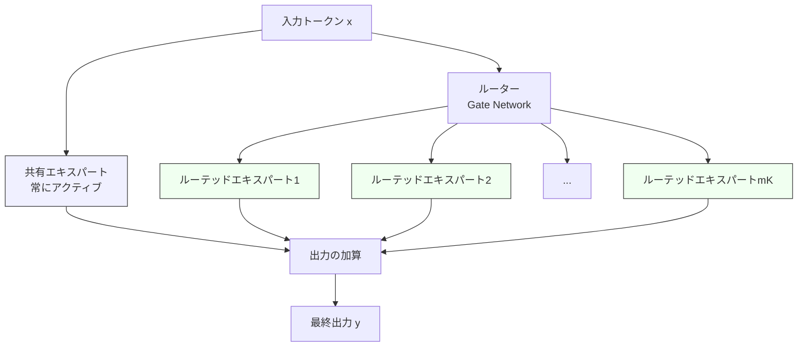

本記事は [DeepSeekMoE: Towards Ultimate Expert Specialization in Mixture-of-Experts Language Models (arXiv:2401.06066)](https://arxiv.org/abs/2401.06066) の解説記事です。

## 論文概要（Abstract）

DeepSeekMoEは、MoEアーキテクチャにおけるエキスパートの専門化（specialization）を極限まで追求することを目的とした研究である。著者らは2つの主要な設計原則を提案している：(1) **Fine-grained Expert Segmentation**（細粒度エキスパート分割）と (2) **Shared Expert Isolation**（共有エキスパート分離）。これらの手法により、DeepSeekMoE 2BがGShard 2.9Bの性能に匹敵し、DeepSeekMoE 16BがLlama 2 7Bに約40%の計算量で匹敵すると報告されている。

この記事は [Zenn記事: LLM MoEアーキテクチャの発展とスケーリング戦略を体系的に理解する](https://zenn.dev/0h_n0/articles/5713e817b39187) の深掘りです。

## 情報源

- **arXiv ID**: 2401.06066
- **URL**: [https://arxiv.org/abs/2401.06066](https://arxiv.org/abs/2401.06066)
- **著者**: Damai Dai, Chengqi Deng, Chenggang Zhao et al.（DeepSeek-AI）
- **発表年**: 2024年（2024-01-11）
- **分野**: cs.CL, cs.LG

## 背景と動機（Background & Motivation）

従来のMoEアーキテクチャ（GShard、Switch Transformer等）では、FFN層を比較的少数の大きなエキスパート（例：8個や16個）に分割し、TopKルーティングで一部を選択する設計が主流であった。しかし、この設計にはいくつかの根本的な課題がある。

**知識の冗長性**: 複数のエキスパートが同じ共通知識（文法規則、一般常識等）を重複して学習する。これはパラメータの浪費であり、エキスパートの専門化を阻害する。

**組み合わせの柔軟性の不足**: 例えばTopK=2で8エキスパートの場合、組み合わせは ${8 \choose 2} = 28$ 通りしかない。入力の多様性に対して表現力が不足する可能性がある。

**ルーティング崩壊**: 一部のエキスパートにトークンが集中し、他のエキスパートがほとんど使われなくなる現象。補助損失で対処するが、モデル性能とのトレードオフがある。

DeepSeekMoEは、これらの課題に対して**エキスパートを細かく分割して数を増やし**、同時に**共通知識を専用エキスパートに分離する**というアプローチで解決を図る。

## 主要な貢献（Key Contributions）

著者らが報告する主要な貢献：

- **Fine-grained Expert Segmentation**: FFNの中間次元を $m$ 分割し、エキスパート数を $N$ から $mN$ に増加。アクティブ数も $K$ から $mK$ に増加させることで、組み合わせの柔軟性を大幅に向上
- **Shared Expert Isolation**: $K_s$ 個のエキスパートを「共有エキスパート」として全トークンでアクティブにし、共通知識の学習を分離。ルーテッドエキスパートの専門化を促進
- **スケーラビリティの実証**: 2B、16B、145Bの各スケールで、同等計算量の密なモデルやGShardベースのMoEと比較して優位な性能を報告

## 技術的詳細（Technical Details）

### Fine-grained Expert Segmentation

従来のMoEでは、FFN層の中間次元 $d_{\text{ff}}$ を持つ $N$ 個のエキスパートから $K$ 個を選択する。DeepSeekMoEでは、各エキスパートの中間次元を $d_{\text{ff}} / m$ に縮小し、代わりにエキスパート数を $mN$ に増やす。アクティブなエキスパート数も $mK$ に増やすことで、**総計算量を変えずに**組み合わせの多様性を向上させる。

$$
\text{組み合わせ数}: {mN \choose mK} \gg {N \choose K}
$$

具体例として、$N = 16, K = 2, m = 4$ の場合：

$$
{16 \choose 2} = 120 \quad \text{vs} \quad {64 \choose 8} = 4,426,165,368
$$

組み合わせ数が約3700万倍に増加する。これにより、各トークンに対してより適切なエキスパートの組み合わせを選択できる可能性が高まる。

```python
import torch
import torch.nn as nn
import torch.nn.functional as F

class FineGrainedMoELayer(nn.Module):
    """DeepSeekMoEの細粒度エキスパート分割

    従来のMoEと比較して、エキスパートを細かく分割することで
    組み合わせの柔軟性を向上させる。

    Args:
        d_model: モデルの隠れ次元
        d_ff: FFNの中間次元（元のサイズ）
        num_experts: 元のエキスパート数
        granularity: 分割数（m）
        top_k: 元のTopK値
    """

    def __init__(
        self,
        d_model: int,
        d_ff: int,
        num_experts: int = 16,
        granularity: int = 4,
        top_k: int = 2,
    ):
        super().__init__()
        self.num_fine_experts = num_experts * granularity  # mN
        self.top_k_fine = top_k * granularity  # mK
        self.d_ff_fine = d_ff // granularity  # d_ff / m

        # 細粒度エキスパート
        self.experts = nn.ModuleList([
            nn.Sequential(
                nn.Linear(d_model, self.d_ff_fine),
                nn.SiLU(),
                nn.Linear(self.d_ff_fine, d_model),
            )
            for _ in range(self.num_fine_experts)
        ])

        # ルーター
        self.gate = nn.Linear(d_model, self.num_fine_experts, bias=False)

    def forward(self, x: torch.Tensor) -> torch.Tensor:
        """Forward pass

        Args:
            x: 入力テンソル (batch, seq, d_model)

        Returns:
            出力テンソル (batch, seq, d_model)
        """
        batch, seq, d = x.shape
        x_flat = x.view(-1, d)  # (batch*seq, d_model)

        # ルーティングスコア計算
        gate_logits = self.gate(x_flat)
        gate_scores = F.softmax(gate_logits, dim=-1)

        # TopK選択
        top_k_scores, top_k_indices = gate_scores.topk(
            self.top_k_fine, dim=-1
        )
        # 正規化
        top_k_scores = top_k_scores / top_k_scores.sum(dim=-1, keepdim=True)

        # エキスパート出力の重み付き和
        output = torch.zeros_like(x_flat)
        for k in range(self.top_k_fine):
            for i in range(self.num_fine_experts):
                mask = (top_k_indices[:, k] == i)
                if mask.any():
                    expert_out = self.experts[i](x_flat[mask])
                    output[mask] += top_k_scores[mask, k:k+1] * expert_out

        return output.view(batch, seq, d)
```

### Shared Expert Isolation

共有エキスパートは、全トークンに対して常にアクティブとなるエキスパートであり、言語の文法、一般的な世界知識など、タスクに依存しない共通知識を学習する役割を持つ。

$$
y = \sum_{s=1}^{K_s} E_s^{\text{shared}}(x) + \sum_{i \in \text{TopK}} g_i \cdot E_i^{\text{routed}}(x)
$$

ここで、
- $K_s$: 共有エキスパートの数
- $E_s^{\text{shared}}$: 共有エキスパート（常にアクティブ）
- $E_i^{\text{routed}}$: ルーテッドエキスパート（TopKで選択）
- $g_i$: ルーティングスコア

共有エキスパートの分離により得られる効果を著者らは以下のように整理している：

**冗長性の削減**: 共通知識を共有エキスパートに集約することで、各ルーテッドエキスパートが同じ知識を重複して学習する必要がなくなる。

**専門化の促進**: ルーテッドエキスパートは共通知識の学習から解放され、特定のドメインやパターンに特化できる。

**安定性の向上**: 共有エキスパートが常にアクティブであるため、ルーティング決定が不安定な場合でも出力の品質が一定水準に保たれる。



### エキスパート特化度の分析

著者らは、エキスパートの専門化度合いを定量的に評価するためにRID（Routing Instruction Distribution）分析を行っている。具体的には、各エキスパートがどのようなトークンを処理する傾向があるかを可視化し、以下の傾向を報告している：

- **共有エキスパートなしの場合**: 複数のエキスパートが類似したトークン分布を処理し、冗長性が高い
- **共有エキスパートありの場合**: ルーテッドエキスパートがより明確に異なるドメイン（コード、数学、自然言語の各サブドメイン等）に特化

## 実験結果（Results）

著者らが報告する主要なベンチマーク結果（論文Table 1, Table 3より）：

### 2Bスケールでの比較

| モデル | エキスパート構成 | 計算量比 | Pile Loss ↓ |
|--------|---------------|---------|------------|
| Dense 2B | - (密なFFN) | 1.0x | 基準 |
| GShard 2.9B | 16E, Top2 | 1.0x | Dense 2Bと同等 |
| DeepSeekMoE 2B | 64E, Top8 + 2共有 | 1.0x | **GShard 2.9B以上** |

### 16Bスケールでの比較

| モデル | 総パラメータ | アクティブ | 計算量比 | 性能 |
|--------|-----------|---------|---------|------|
| Llama 2 7B | 7B | 7B | 1.0x | 基準 |
| DeepSeekMoE 16B | 16.4B | 2.8B | 0.4x | **Llama 2 7Bに匹敵** |

### 145Bスケールでの比較

著者らによれば、DeepSeekMoE 145Bは、DeepSeek 67B（密なモデル）と同等の性能を**約28.5%の計算量**で達成している。さらに、一部のパラメータを共有エキスパートに集約した構成では、計算量を**18.2%**にまで削減可能であると報告されている。

## 実装のポイント（Implementation）

**エキスパートの粒度選択**: 分割数 $m$ の選択は重要な設計判断である。著者らの実験では $m = 4$ が良好なバランスを示しているが、$m$ が大きすぎると各エキスパートの容量が小さくなりすぎ、小さすぎると組み合わせの柔軟性が不足する。

**共有エキスパートの数**: 論文では $K_s = 2$（16Bモデル）を使用。共有エキスパートが多すぎるとルーテッドエキスパートの計算予算が減少し、少なすぎると共通知識の学習が不十分になる。

**ルーティングの負荷分散**: DeepSeekMoEでは従来の補助損失（Auxiliary Loss）を使用。ただし、後続のDeepSeek-V3ではAuxiliary-Loss-Free方式に進化している。

**Expert Parallelismの実装**: エキスパート数が多い（64個以上）ため、GPU間でのエキスパート配置と通信の最適化が特に重要になる。具体的には、通信量を最小化するためにルーティングパターンに基づくエキスパート配置の最適化が有効である。

## Production Deployment Guide

### AWS実装パターン（コスト最適化重視）

DeepSeekMoE 16Bは比較的小規模なMoEモデルであり、単一GPUまたは少数GPUでのデプロイが可能である。

| 規模 | 月間リクエスト | 推奨構成 | 月額コスト | 主要サービス |
|------|--------------|---------|-----------|------------|
| **Small** | ~3,000 (100/日) | Serverless | $50-150 | Lambda + Bedrock |
| **Medium** | ~30,000 (1,000/日) | Single GPU | $500-1,200 | ECS + g5.xlarge |
| **Large** | 300,000+ (10,000/日) | Multi-GPU | $2,000-4,000 | EKS + g5.2xlarge × 2 |

**コスト試算の注意事項**:
- 2026年3月時点のAWS ap-northeast-1料金に基づく概算値
- DeepSeekMoE 16BはFP16で約33GBのVRAMを必要とし、g5.xlarge（A10G 24GB）ではFP8またはINT8量子化が必要
- 最新料金は [AWS料金計算ツール](https://calculator.aws/) で確認推奨

### Terraformインフラコード

**Small構成 (Serverless): Lambda + Bedrock**

```hcl
module "vpc" {
  source  = "terraform-aws-modules/vpc/aws"
  version = "~> 5.0"

  name = "moe-vpc"
  cidr = "10.0.0.0/16"
  azs  = ["ap-northeast-1a", "ap-northeast-1c"]
  private_subnets = ["10.0.1.0/24", "10.0.2.0/24"]

  enable_nat_gateway = false
  enable_dns_hostnames = true
}

resource "aws_iam_role" "lambda_moe" {
  name = "lambda-moe-role"
  assume_role_policy = jsonencode({
    Version = "2012-10-17"
    Statement = [{
      Action = "sts:AssumeRole"
      Effect = "Allow"
      Principal = { Service = "lambda.amazonaws.com" }
    }]
  })
}

resource "aws_iam_role_policy" "bedrock_invoke" {
  role = aws_iam_role.lambda_moe.id
  policy = jsonencode({
    Version = "2012-10-17"
    Statement = [{
      Effect   = "Allow"
      Action   = ["bedrock:InvokeModel"]
      Resource = "arn:aws:bedrock:ap-northeast-1::foundation-model/*"
    }]
  })
}

resource "aws_lambda_function" "moe_handler" {
  filename      = "lambda.zip"
  function_name = "moe-inference"
  role          = aws_iam_role.lambda_moe.arn
  handler       = "index.handler"
  runtime       = "python3.12"
  timeout       = 60
  memory_size   = 1024
}

resource "aws_cloudwatch_metric_alarm" "cost_alert" {
  alarm_name          = "moe-cost-spike"
  comparison_operator = "GreaterThanThreshold"
  evaluation_periods  = 1
  metric_name         = "Duration"
  namespace           = "AWS/Lambda"
  period              = 3600
  statistic           = "Sum"
  threshold           = 100000
  alarm_description   = "Lambda実行時間異常検知"
}
```

### 運用・監視設定

```python
import boto3

cloudwatch = boto3.client('cloudwatch')

# エキスパート利用率モニタリング
cloudwatch.put_metric_alarm(
    AlarmName='moe-expert-imbalance',
    ComparisonOperator='GreaterThanThreshold',
    EvaluationPeriods=2,
    MetricName='ExpertLoadVariance',
    Namespace='Custom/MoE',
    Period=300,
    Statistic='Average',
    Threshold=0.5,
    AlarmDescription='エキスパート負荷分散の偏り検知'
)
```

### コスト最適化チェックリスト

- [ ] DeepSeekMoE 16B: g5.xlarge 単一GPUでINT8量子化デプロイ
- [ ] Bedrock API: 小規模利用はServerless推奨
- [ ] vLLM: MoE対応のContinuous Batching有効化
- [ ] Spot Instances: g5シリーズで最大90%削減
- [ ] Reserved Instances: 1年コミットで72%削減
- [ ] CloudWatch: GPU利用率・推論レイテンシ監視
- [ ] AWS Budgets: 月額予算設定
- [ ] 量子化: GPTQ/AWQでメモリ削減

## 実運用への応用（Practical Applications）

DeepSeekMoEの設計原則は、カスタムMoEモデルの構築やファインチューニングに応用可能である。

**Fine-grained Expert設計の応用**: 自社ドメインに特化したMoEモデルを構築する際、エキスパートの粒度を細かくすることで、ドメイン知識のより細密な分離が期待できる。例えば、法律・医療・金融の各ドメインに対応するエキスパートグループを設計する場合、各ドメインをさらにサブドメインに分割してエキスパートを配置できる。

**共有エキスパートの活用**: マルチタスク学習において、タスク共通の知識を共有エキスパートに集約し、タスク固有の知識をルーテッドエキスパートに割り当てることで、効率的なマルチタスクモデルを構築できる可能性がある。

## 関連研究（Related Work）

- **GShard** (Lepikhin et al., 2021): 大規模MoEの分散学習フレームワーク。DeepSeekMoEはGShardのエキスパート構成を細粒度化した拡張
- **Switch Transformer** (Fedus et al., 2021): TopK=1のルーティングを提案。DeepSeekMoEはTopK>1で細粒度エキスパートの組み合わせを活用
- **ST-MoE** (Zoph et al., 2022): MoEの安定学習手法を体系化。DeepSeekMoEの学習安定性はこの知見を踏まえている
- **DeepSeek-V3** (DeepSeek-AI, 2024): DeepSeekMoEの設計原則を671Bモデルに適用した発展形

## まとめと今後の展望

DeepSeekMoEは、Fine-grained Expert SegmentationとShared Expert Isolationという2つの設計原則により、MoEアーキテクチャのパラメータ効率を大幅に向上させた。著者らの実験では、同等計算量のGShardベースMoEに対して約1.5倍のパラメータ効率を達成したと報告されている。

この研究の意義は、DeepSeek-V3やKimi K2など後続のフロンティアMoEモデルが同様の設計原則を採用していることからも明らかである。今後は、エキスパートの粒度と数の最適バランスの理論的解明、および動的な粒度調整（入力に応じてエキスパートの粒度を変える）が研究課題として考えられる。

## 参考文献

- **arXiv**: [https://arxiv.org/abs/2401.06066](https://arxiv.org/abs/2401.06066)
- **Related Zenn article**: [https://zenn.dev/0h_n0/articles/5713e817b39187](https://zenn.dev/0h_n0/articles/5713e817b39187)
- **DeepSeek-V3**: [https://arxiv.org/abs/2412.19437](https://arxiv.org/abs/2412.19437)
- **GShard**: [https://arxiv.org/abs/2006.16668](https://arxiv.org/abs/2006.16668)

---

:::message
この記事はAI（Claude Code）により自動生成されました。論文の主張と著者の見解を正確に伝えることを目指していますが、解釈の正確性については原論文もご確認ください。
:::
