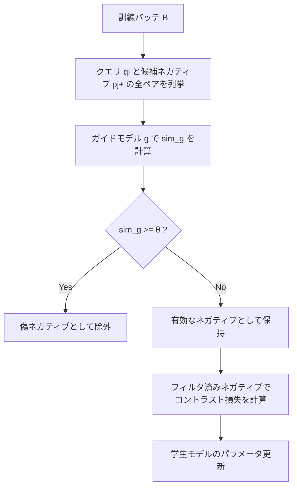

本記事は [arXiv:2402.16829 GISTEmbed](https://arxiv.org/abs/2402.16829) の解説記事です。

## 論文概要（Abstract）

GISTEmbedは、テキスト埋め込みのコントラスト学習において、ガイドモデルを用いてバッチ内ネガティブサンプルから偽ネガティブ（false negative）を除去する手法である。著者らは、既存の学習済み埋め込みモデルをガイドとして再利用し、追加のハードネガティブマイニングなしに高品質なネガティブ選択を実現した。単一GPU（NVIDIA A100 40GB）、約50万ペアの比較的小規模なデータセットで訓練したにもかかわらず、パラメータクラス内でMTEBベンチマーク上の当時のSOTAを達成したと報告されている。

この記事は [Zenn記事: Embedding Fine-tuning実践：合成データと評価ループでRAG検索精度を改善する](https://zenn.dev/0h_n0/articles/3a80f7fd58cc8e) の深掘りです。

## 情報源

- **arXiv ID**: 2402.16829
- **URL**: [https://arxiv.org/abs/2402.16829](https://arxiv.org/abs/2402.16829)
- **著者**: Lazaros Toumanidis, Evangelos Bougalis, Pavlos Kefalas, Marios Krestenitis
- **発表年**: 2024
- **分野**: cs.CL, cs.IR

## 背景と動機（Background & Motivation）

テキスト埋め込みモデルの学習では、コントラスト学習（contrastive learning）が広く使われている。標準的な手法では、訓練バッチ内の他のポジティブ文書をネガティブサンプルとして再利用する「in-batch negative」方式が用いられる（Karpukhin et al., 2020のDense Passage Retrieval等）。

しかし、このバッチ内ネガティブには本質的な問題がある。バッチ内に意味的にクエリと類似したドキュメントが存在する場合、それらが誤ってネガティブとしてラベル付けされてしまう。これが**偽ネガティブ（false negative）**問題であり、学習シグナルの質を低下させ、モデルの精度劣化を引き起こす。

従来の対策として、ハードネガティブマイニング（Hofstätter et al., 2021）やCross-Encoderによるリランキング（Qu et al., 2021）があるが、追加のデータ収集や計算コストが必要になる。GISTEmbedは、**既存の学習済みモデルをガイドとして再利用する**ことで、追加データなしにこの問題を解決するアプローチを提案している。

## 主要な貢献（Key Contributions）

著者らが報告している主要な貢献は以下の3点である。

- **貢献1**: ガイドモデルを用いたバッチ内偽ネガティブのフィルタリング手法（Guided In-sample Selection）の提案
- **貢献2**: 追加のハードネガティブデータ収集が不要であり、単一GPUで訓練可能な効率的なFine-tuningパイプライン
- **貢献3**: 33M〜335Mパラメータの各モデルサイズクラスにおいて、MTEBベンチマークで当時の同クラスモデルを上回る性能の達成

## 技術的詳細（Technical Details）

### コントラスト学習の標準的な損失関数

訓練バッチ $B$ が $n$ 個のペア $\{(q_i, p_i^+)\}$ で構成されるとき、クエリ $q_i$ に対するバッチ内ネガティブは $\{p_j^+ : j \neq i, j \in B\}$ となる。標準的なコントラスト損失は以下のとおりである。

$$
\mathcal{L}(q_i, p_i^+, \{p_j^+\}_{j \neq i}) = -\log \frac{\exp(\text{sim}(q_i, p_i^+) / \tau)}{\exp(\text{sim}(q_i, p_i^+) / \tau) + \sum_{j \neq i} \exp(\text{sim}(q_i, p_j^+) / \tau)}
$$

ここで、
- $q_i$: $i$ 番目のクエリ
- $p_i^+$: $q_i$ に対応するポジティブドキュメント
- $\text{sim}(\cdot, \cdot)$: コサイン類似度
- $\tau$: 温度パラメータ（本論文では $\tau = 0.01$）

### Guided In-sample Selection（GISTの核心）

GISTEmbedの核心は、ガイドモデル $g$ を用いて各候補ネガティブを評価し、偽ネガティブを除外する点にある。候補ネガティブ $p_j^+$ がクエリ $q_i$ に対して保持される条件は以下のとおりである。

$$
p_j^+ \text{ をネガティブとして保持} \iff \text{sim}_g(q_i, p_j^+) < \theta
$$

ここで、
- $\text{sim}_g(\cdot, \cdot)$: ガイドモデル $g$ によるコサイン類似度
- $\theta$: 偽ネガティブ判定の閾値（著者らの実験では $\theta = 0.0$ が最良と報告）

$\theta = 0.0$ は、ガイドモデルがクエリと候補ネガティブの類似度を正と判定した場合（つまり意味的に類似していると推定される場合）に、そのネガティブを除外することを意味する。

### アルゴリズム

```python
import torch
from sentence_transformers import SentenceTransformer


def gist_filter_negatives(
    guide_model: SentenceTransformer,
    queries: list[str],
    positives: list[str],
    threshold: float = 0.0,
) -> list[list[int]]:
    """ガイドモデルを用いてバッチ内偽ネガティブをフィルタリングする

    Args:
        guide_model: 偽ネガティブ判定に使用するガイドモデル
        queries: クエリテキストのリスト
        positives: ポジティブドキュメントのリスト
        threshold: 偽ネガティブ判定の閾値

    Returns:
        各クエリに対する有効なネガティブインデックスのリスト
    """
    with torch.no_grad():
        q_embs = guide_model.encode(queries, convert_to_tensor=True)
        p_embs = guide_model.encode(positives, convert_to_tensor=True)

    # コサイン類似度行列を計算
    q_norm = torch.nn.functional.normalize(q_embs, p=2, dim=1)
    p_norm = torch.nn.functional.normalize(p_embs, p=2, dim=1)
    sim_matrix = torch.mm(q_norm, p_norm.T)

    valid_negatives = []
    for i in range(len(queries)):
        neg_indices = []
        for j in range(len(positives)):
            if i == j:
                continue  # ポジティブペア自身は除外
            if sim_matrix[i, j].item() < threshold:
                neg_indices.append(j)
        valid_negatives.append(neg_indices)

    return valid_negatives
```

処理の流れを図示すると以下のようになる。



### ガイドモデルの選択

著者らはBAAI/bge-base-en-v1.5をガイドモデルとして使用している。ガイドモデルは以下の特徴を持つ。

- **eval mode**で実行され、勾配計算は不要
- パラメータ更新は訓練対象の学生モデルのみ
- ガイドモデルと学生モデルのベースモデルは異なるものでもよい

## 実装のポイント（Implementation）

### 訓練ハイパーパラメータ

論文で報告されている訓練設定は以下のとおりである。

| パラメータ | 値 | 備考 |
|-----------|-----|------|
| バッチサイズ | 512 | gradient accumulation使用 |
| 学習率 | 1e-5 | — |
| ウォームアップ | 100ステップ | — |
| 最大系列長 | 512トークン | — |
| 温度 $\tau$ | 0.01 | — |
| 閾値 $\theta$ | 0.0 | アブレーションで最良 |
| エポック数 | 25（small）/ 35（base）/ 40（large） | — |
| ハードウェア | NVIDIA A100 40GB × 1 | シングルGPU |
| 訓練時間 | 約7〜10時間 | モデルサイズ依存 |

### ハマりポイント

1. **ガイドモデルの推論オーバーヘッド**: 訓練ステップごとにガイドモデルの推論が発生するため、訓練時間が約30〜50%増加する。GPUメモリに余裕がある場合、ガイドモデルの推論をバッチ化することで緩和できる

2. **閾値 $\theta$ の選択**: 著者らは $\theta = 0.0$ を推奨しているが、ドメインによっては異なる閾値が適切な場合がある。Zenn記事で紹介されているsentence-transformersの`GISTEmbedLoss`は、この閾値を自動で設定する

3. **バッチサイズとネガティブの多様性**: バッチサイズが小さいとバッチ内ネガティブの数が減り、フィルタリング後に有効なネガティブが不足する場合がある。最低256以上のバッチサイズが推奨される

## Production Deployment Guide

### AWS実装パターン（コスト最適化重視）

Embedding Fine-tuningパイプラインをAWS上に構築する場合のトラフィック量別推奨構成を示す。

| 規模 | 月間リクエスト | 推奨構成 | 月額コスト | 主要サービス |
|------|--------------|---------|-----------|------------|
| **Small** | ~3,000 (100/日) | Serverless | $50-150 | Lambda + Bedrock + DynamoDB |
| **Medium** | ~30,000 (1,000/日) | Hybrid | $300-800 | Lambda + ECS Fargate + ElastiCache |
| **Large** | 300,000+ (10,000/日) | Container | $2,000-5,000 | EKS + Karpenter + EC2 Spot |

**Small構成の詳細**（月額$50-150）:
- **Lambda**: 1GB RAM, 30秒タイムアウト（$20/月）
- **Bedrock**: Claude 3.5 Haiku, Prompt Caching有効（$80/月）
- **DynamoDB**: On-Demand（$10/月）
- **CloudWatch**: 基本監視（$5/月）

**コスト削減テクニック**:
- Spot Instances使用で最大90%削減（EKS + Karpenter）
- Bedrock Batch API使用で50%削減
- Prompt Caching有効化で30-90%削減

**コスト試算の注意事項**: 上記は2026年3月時点のAWS ap-northeast-1（東京）リージョン料金に基づく概算値である。実際のコストはトラフィックパターンにより変動するため、最新料金は[AWS料金計算ツール](https://calculator.aws/)で確認されたい。

### Terraformインフラコード

**Small構成（Serverless）**:

```hcl
module "vpc" {
  source  = "terraform-aws-modules/vpc/aws"
  version = "~> 5.0"

  name = "embedding-finetune-vpc"
  cidr = "10.0.0.0/16"
  azs  = ["ap-northeast-1a", "ap-northeast-1c"]
  private_subnets = ["10.0.1.0/24", "10.0.2.0/24"]

  enable_nat_gateway   = false
  enable_dns_hostnames = true
}

resource "aws_iam_role" "lambda_embedding" {
  name = "lambda-embedding-role"

  assume_role_policy = jsonencode({
    Version = "2012-10-17"
    Statement = [{
      Action    = "sts:AssumeRole"
      Effect    = "Allow"
      Principal = { Service = "lambda.amazonaws.com" }
    }]
  })
}

resource "aws_lambda_function" "embedding_handler" {
  filename      = "lambda.zip"
  function_name = "embedding-inference-handler"
  role          = aws_iam_role.lambda_embedding.arn
  handler       = "index.handler"
  runtime       = "python3.12"
  timeout       = 60
  memory_size   = 1024

  environment {
    variables = {
      MODEL_NAME     = "BAAI/bge-base-en-v1.5"
      DYNAMODB_TABLE = aws_dynamodb_table.cache.name
    }
  }
}

resource "aws_dynamodb_table" "cache" {
  name         = "embedding-cache"
  billing_mode = "PAY_PER_REQUEST"
  hash_key     = "embedding_hash"

  attribute {
    name = "embedding_hash"
    type = "S"
  }

  ttl {
    attribute_name = "expire_at"
    enabled        = true
  }
}
```

### 運用・監視設定

```python
import boto3

cloudwatch = boto3.client('cloudwatch')

cloudwatch.put_metric_alarm(
    AlarmName='embedding-latency-p99',
    ComparisonOperator='GreaterThanThreshold',
    EvaluationPeriods=2,
    MetricName='Duration',
    Namespace='AWS/Lambda',
    Period=300,
    Statistic='p99',
    Threshold=30000,
    AlarmDescription='Embedding推論レイテンシP99が30秒超過'
)
```

### コスト最適化チェックリスト

- [ ] ~100 req/日 → Lambda + SageMaker Serverless Inference（$50-150/月）
- [ ] ~1000 req/日 → ECS Fargate + SageMaker Real-time（$300-800/月）
- [ ] 10000+ req/日 → EKS + Spot + SageMaker Batch Transform（$2,000-5,000/月）
- [ ] Spot Instances優先（最大90%削減）
- [ ] SageMaker Savings Plans検討（最大64%削減）
- [ ] 推論結果キャッシュ（DynamoDB/ElastiCache）
- [ ] バッチ推論でリアルタイム推論を補完
- [ ] AWS Budgets設定（80%で警告、100%でアラート）
- [ ] CloudWatch アラーム（レイテンシ、エラー率）
- [ ] Cost Anomaly Detection有効化

## 実験結果（Results）

### MTEB Benchmark

著者らはMTEB（Massive Text Embedding Benchmark）の56タスクで評価を行い、以下の結果を報告している（論文Table 1より）。

| モデル | パラメータ | MTEBスコア | Retrieval | STS | Classification |
|--------|----------|-----------|-----------|-----|----------------|
| GIST-large-Embedding-v0 | 335M | 61.36 | 46.22 | 85.10 | 76.95 |
| GIST-Embedding-v0 | 109M | 61.36 | 45.57 | 84.99 | 76.47 |
| GIST-small-Embedding-v0 | 33M | 59.15 | 44.07 | 84.47 | 74.09 |
| e5-large-v2 | 335M | 59.89 | — | — | — |
| text-embedding-ada-002 | 非公開 | 60.99 | — | — | — |

注目すべき点として、GIST-Embedding-v0（109Mパラメータ）がGIST-large（335M）と同等のMTEBスコアを達成しており、パラメータ効率の高さが確認できる。

### 閾値 $\theta$ のアブレーション

著者らが報告している閾値 $\theta$ の影響は以下のとおりである（論文Section 3.4より）。

| 閾値 $\theta$ | MTEBスコア | ベースラインとの差 |
|---------------|-----------|-----------------|
| 0.0 | 61.36 | 最良 |
| 0.1 | ~60.9 | 約-0.5pt |
| 0.2 | ~60.2 | 約-1.2pt |
| フィルタなし（∞） | ベースライン | 顕著な低下 |

$\theta = 0.0$ が最良であることは、ガイドモデルが「少しでも類似」と判定したペアを除外するのが最も効果的であることを示唆している。

## 実運用への応用（Practical Applications）

GISTEmbedの手法は、RAGシステムのEmbedding Fine-tuningにおいて以下のように応用できる。

**ドメイン特化データでのFine-tuning**: Zenn記事で紹介されているsentence-transformersの`GISTEmbedLoss`は、この論文の手法をそのまま実装したものである。合成データでFine-tuningする際にfalse negativeが混入するリスクを低減でき、特に医療・法律などの専門用語が多いドメインで有効である。

**コスト効率**: 単一GPU（A100 40GB）で7〜10時間の訓練が可能であり、Philschmid氏の実験（Zenn記事参照）ではg5.2xlarge（A10G GPU）で約3分、コスト約$0.07で完了したと報告されている。企業のRAGシステム改善に必要な計算コストが低く抑えられる。

**段階的な改善**: まずMultipleNegativesRankingLossで試し、精度が不十分な場合にGISTEmbedLossに切り替えるという段階的アプローチが推奨される。GISTEmbedLossはガイドモデルの推論コストが追加されるため、訓練時間が約1.5〜2倍になるトレードオフがある。

## 関連研究（Related Work）

- **DPR（Dense Passage Retrieval）**（Karpukhin et al., 2020）: バッチ内ネガティブを用いたコントラスト学習の基礎手法。GISTEmbedはDPRのバッチ内ネガティブ戦略を改善する位置付けである
- **E5-mistral**（Wang et al., 2024, arXiv:2401.00368）: GPT-4による合成データとLLMのFine-tuningでMTEB 66.63を達成。GISTEmbedとは異なり7.1Bパラメータの大規模モデルを使用するが、合成データ＋コントラスト学習という点で共通する
- **SimCSE**（Gao et al., 2021）: ドロップアウトをノイズとして使う自己教師ありコントラスト学習。GISTEmbedのガイドモデルによるフィルタリングは、SimCSEの偽ネガティブ問題を直接解決するアプローチである

## まとめと今後の展望

GISTEmbedは、既存の学習済み埋め込みモデルをガイドとして再利用し、コントラスト学習時の偽ネガティブ問題を効率的に解決する手法である。著者らは、単一GPU・約50万ペアの比較的小規模なセットアップで、パラメータクラス内のMTEBベンチマークで当時のSOTAを達成したと報告している。

実務への示唆として、RAGシステムのEmbedding Fine-tuningにおいて、合成データ生成時に混入するfalse negativeの問題を低コストで軽減できる点が挙げられる。sentence-transformersの`GISTEmbedLoss`として既に実装されており、Zenn記事で紹介されている改善ループに直接組み込むことが可能である。

今後の研究方向としては、ハードネガティブマイニングとの組み合わせ効果、多言語への拡張、およびガイドモデルの最適な選択基準の体系化が挙げられる。

## 参考文献

- **arXiv**: [https://arxiv.org/abs/2402.16829](https://arxiv.org/abs/2402.16829)
- **Code**: [https://github.com/avsolatorio/GISTEmbed](https://github.com/avsolatorio/GISTEmbed)
- **Models**: [avsolatorio/GIST-Embedding-v0](https://huggingface.co/avsolatorio/GIST-Embedding-v0)（HuggingFace Hub、MIT License）
- **Related Zenn article**: [https://zenn.dev/0h_n0/articles/3a80f7fd58cc8e](https://zenn.dev/0h_n0/articles/3a80f7fd58cc8e)

---

:::message
この記事はAI（Claude Code）により自動生成されました。内容の正確性については論文の原文で検証していますが、実際の利用時は公式ドキュメントもご確認ください。
:::
