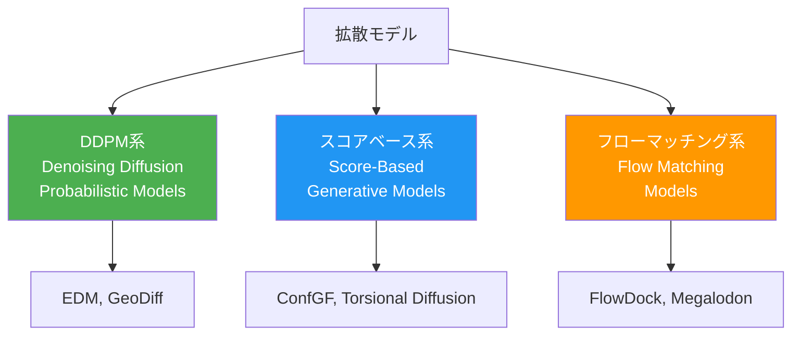

本記事は [Diffusion Models in De Novo Drug Design](https://arxiv.org/abs/2406.08511)（Alakhdar, Poczos & Washburn, Journal of Chemical Information and Modeling, 2024）の解説記事です。

## 論文概要（Abstract）

本論文は、de novo創薬における拡散モデルの適用を体系的にレビューしたサーベイ論文である。著者らは、非平衡統計物理学に着想を得た拡散モデルが3D分子構造の生成にどのように応用されているかを整理し、原子・結合表現の戦略、逆拡散デノイジングネットワークのアーキテクチャ、安定な3D分子構造生成の課題を網羅的に解説している。JCIM（Journal of Chemical Information and Modeling）に2024年に掲載された。

この記事は [Zenn記事: 生成AIで創薬はどう変わるか：AlphaFold3からIsoDDEまで2026年最前線](https://zenn.dev/0h_n0/articles/244adaf3ac915e) の深掘りです。

## 情報源

- **arXiv ID**: 2406.08511
- **URL**: [https://arxiv.org/abs/2406.08511](https://arxiv.org/abs/2406.08511)
- **著者**: Amira Alakhdar, Barnabas Poczos, Newell Washburn
- **掲載誌**: Journal of Chemical Information and Modeling, 2024, 64(19), 7238-7256
- **発表年**: 2024年6月（arXiv）、2024年9月（JCIM）
- **分野**: q-bio.BM, cs.LG

## 背景と動機（Background & Motivation）

2020年以降、拡散モデルは画像生成（DALL·E 2、Stable Diffusion）で大きな成功を収めた。この成功が分子生成の分野にも波及し、2022年以降に多数のモデルが提案されている。しかし、分子生成における拡散モデルの体系的な比較・分類は十分に行われていなかった。

本論文は以下の問いに答えることを目的としている：
1. 拡散モデルの各変種（DDPM、スコアベース、フローマッチング）は分子生成にどのように適用されるか
2. 3D分子構造の生成に特有の課題（SE(3)等変性、化学的妥当性）はどのように解決されているか
3. 創薬の各フェーズ（de novo設計、構造ベース設計、リンカー設計等）でどのモデルが有効か

## 主要な貢献（Key Contributions）

- **貢献1**: 創薬における拡散モデルの分類体系（DDPM系、スコアベース系、フローマッチング系）を確立
- **貢献2**: 3D分子生成に必要な技術要素（SE(3)等変性、原子・結合表現、ノイズスケジュール）を体系的に整理
- **貢献3**: 応用領域別（de novo設計、構造ベース設計、リンカー設計、コンフォメーション生成等）のモデル比較

## 技術的詳細（Technical Details）

### 拡散モデルの3つの系統

著者らは創薬における拡散モデルを以下の3系統に分類している。



#### 1. DDPM系（Denoising Diffusion Probabilistic Models）

DDPMは離散的なタイムステップでノイズを付加・除去する。分子生成では原子座標と原子タイプを同時に拡散させる。

フォワードプロセス：

$$
q(\mathbf{x}_t | \mathbf{x}_{t-1}) = \mathcal{N}(\mathbf{x}_t; \sqrt{1-\beta_t}\mathbf{x}_{t-1}, \beta_t\mathbf{I})
$$

リバースプロセス：

$$
p_\theta(\mathbf{x}_{t-1} | \mathbf{x}_t) = \mathcal{N}(\mathbf{x}_{t-1}; \mu_\theta(\mathbf{x}_t, t), \sigma_t^2\mathbf{I})
$$

**代表的モデル**: EDM（Equivariant Diffusion Model）、GeoDiff

#### 2. スコアベース系（Score-Based Generative Models）

スコア関数 $\nabla_{\mathbf{x}} \log p_t(\mathbf{x})$ を学習し、Langevin dynamicsでサンプリングする。

$$
\mathbf{x}_{t+1} = \mathbf{x}_t + \frac{\epsilon}{2} \nabla_{\mathbf{x}} \log p_t(\mathbf{x}_t) + \sqrt{\epsilon} \mathbf{z}, \quad \mathbf{z} \sim \mathcal{N}(0, \mathbf{I})
$$

ここで $\epsilon$ はステップサイズ、$\nabla_{\mathbf{x}} \log p_t(\mathbf{x})$ はデータ分布の対数密度の勾配（スコア関数）である。

**代表的モデル**: ConfGF（コンフォメーション生成）、Torsional Diffusion（ねじれ角拡散）

#### 3. フローマッチング系（Flow Matching Models）

ノイズ分布から目標分布への連続的な常微分方程式（ODE）フローを学習する。著者らの整理によると、フローマッチングは拡散モデルの一般化であり、直線的な最適輸送パスを学習できるため、サンプリングが高速である。

$$
\frac{d\mathbf{x}}{dt} = v_\theta(\mathbf{x}_t, t)
$$

$$
\mathcal{L}_{\text{FM}}(\theta) = \mathbb{E}_{t, \mathbf{x}_0, \mathbf{x}_1} \left\| v_\theta(\mathbf{x}_t, t) - (\mathbf{x}_1 - \mathbf{x}_0) \right\|^2
$$

ここで、
- $v_\theta$: パラメータ $\theta$ を持つベクトル場
- $\mathbf{x}_t = (1-t)\mathbf{x}_0 + t\mathbf{x}_1$: 直線補間
- $\mathbf{x}_0$: ノイズサンプル
- $\mathbf{x}_1$: 目標分子構造

**代表的モデル**: FlowDock、Megalodon、MolFlow

### SE(3)等変性の重要性

3D分子構造の生成において最も重要な技術的要件は**SE(3)等変性**である。分子は3D空間での回転・並進に対して同一の物理的性質を持つため、ネットワークの出力もこれらの変換に対して等変でなければならない。

SE(3)等変性の定式化：

$$
f(\mathbf{R}\mathbf{x} + \mathbf{t}) = \mathbf{R}f(\mathbf{x}) + \mathbf{t}
$$

ここで $\mathbf{R} \in SO(3)$（回転行列）、$\mathbf{t} \in \mathbb{R}^3$（並進ベクトル）である。

著者らの整理によると、SE(3)等変性の実装には主に以下の3つのアプローチがある：

1. **EGNN（E(n) Equivariant Graph Neural Networks）**: 距離不変性を利用。計算効率が高いが表現力に制限がある
2. **SchNet/DimeNet系**: 原子間距離と角度の不変特徴量を使用
3. **e3nn（Tensor Field Networks）**: 球面調和関数に基づく高次テンソル表現。表現力が最も高いが計算コストも高い

### 原子・結合表現の戦略

著者らは分子の表現方法を以下のように分類している。

| 表現方法 | 座標 | 原子タイプ | 結合 | 代表的モデル |
|---------|------|-----------|------|------------|
| 原子座標のみ | 連続拡散 | 離散拡散 | 後処理で推定 | EDM |
| 原子＋結合 | 連続拡散 | 離散拡散 | 離散拡散 | DiffSBDD |
| ねじれ角 | 角度空間拡散 | 固定 | 固定 | Torsional Diffusion |
| SAFE/SMILES | 離散トークン拡散 | 暗黙的 | 暗黙的 | GenMol |

### 創薬応用領域の分類

本レビューでカバーされている応用領域：

1. **De novo分子設計**: ゼロから新規分子を生成
2. **構造ベース創薬（SBDD）**: ターゲットタンパク質のポケットに適合する分子を設計
3. **リンカー設計**: 2つのフラグメントを結合するリンカー部分を生成
4. **スキャフォールドホッピング**: 核となる骨格構造を置換
5. **コンフォメーション生成**: 同一分子の異なる3D配座を生成
6. **タンパク質-リガンド複合体のダイナミクス**: 分子動力学シミュレーションの代替・補完

## 実装のポイント（Implementation）

### 3D分子生成の最小実装パターン

著者らのレビューに基づく、DDPM系3D分子生成の概念実装：

```python
import torch
import torch.nn as nn
from torch_geometric.data import Data
from typing import Optional


class MolecularDiffusion(nn.Module):
    """3D分子生成用DDPMの概念実装。

    原子座標（連続拡散）と原子タイプ（離散拡散）を
    同時にデノイジングする。

    Args:
        n_atom_types: 原子タイプ数（C, N, O, S, etc.）
        d_hidden: 隠れ層次元数
        n_steps: 拡散ステップ数
    """

    def __init__(
        self,
        n_atom_types: int = 10,
        d_hidden: int = 256,
        n_steps: int = 1000,
    ):
        super().__init__()
        self.n_atom_types = n_atom_types
        self.n_steps = n_steps

        # SE(3)等変性を持つGNN（簡略化）
        self.coord_predictor = EquivariantGNN(d_hidden)
        self.type_predictor = nn.Linear(d_hidden, n_atom_types)

        # ノイズスケジュール
        betas = torch.linspace(1e-4, 0.02, n_steps)
        alphas = 1.0 - betas
        self.register_buffer("alphas_cumprod", torch.cumprod(alphas, dim=0))

    def forward_diffusion(
        self,
        coords: torch.Tensor,
        atom_types: torch.Tensor,
        t: int,
    ) -> tuple[torch.Tensor, torch.Tensor]:
        """フォワードプロセス: ノイズ付加。

        Args:
            coords: 原子座標 (n_atoms, 3)
            atom_types: 原子タイプ (n_atoms,)
            t: タイムステップ

        Returns:
            ノイズ付き座標とマスク付き原子タイプ
        """
        # 座標にガウスノイズ付加
        alpha_t = self.alphas_cumprod[t]
        noise = torch.randn_like(coords)
        noisy_coords = torch.sqrt(alpha_t) * coords + torch.sqrt(1 - alpha_t) * noise

        # 原子タイプにマスクノイズ付加
        mask_prob = 1 - alpha_t.item()
        mask = torch.rand(atom_types.shape) < mask_prob
        noisy_types = atom_types.clone()
        noisy_types[mask] = self.n_atom_types  # MASKトークン

        return noisy_coords, noisy_types

    def reverse_step(
        self,
        noisy_coords: torch.Tensor,
        noisy_types: torch.Tensor,
        edge_index: torch.Tensor,
        t: int,
    ) -> tuple[torch.Tensor, torch.Tensor]:
        """リバースステップ: 1ステップのデノイジング。

        Args:
            noisy_coords: ノイズ付き座標 (n_atoms, 3)
            noisy_types: マスク付き原子タイプ (n_atoms,)
            edge_index: グラフのエッジ (2, n_edges)
            t: タイムステップ

        Returns:
            デノイズされた座標と原子タイプ
        """
        # GNNでノイズ/タイプを予測
        # predicted_noise = self.coord_predictor(noisy_coords, edge_index, t)
        # predicted_types = self.type_predictor(node_features)
        raise NotImplementedError("Full EGNN implementation required")


class EquivariantGNN(nn.Module):
    """E(n)等変GNNのスタブ。

    実装にはe3nnまたはtorch_geometricのEGNN実装を使用。
    """

    def __init__(self, d_hidden: int):
        super().__init__()
        self.d_hidden = d_hidden

    def forward(
        self,
        coords: torch.Tensor,
        edge_index: torch.Tensor,
        t: int,
    ) -> torch.Tensor:
        raise NotImplementedError("Use e3nn or EGNN implementation")
```

### ベンチマークデータセット

著者らが整理した主要ベンチマーク：

| データセット | タスク | 分子数 | 主な評価指標 |
|------------|-------|--------|------------|
| QM9 | De novo生成 | 134K | Validity, Uniqueness, Novelty |
| GEOM-Drugs | コンフォメーション | 37K | COV, MAT（RMSD） |
| CrossDocked2020 | SBDD | 22M pairs | Vina Score, QED, SA |
| PDBBind | ドッキング | 19K | RMSD, 成功率 |
| ZINC250K | De novo生成 | 250K | FCD, Novelty |

## 実験結果（Results）

本論文はサーベイ論文であるため独自の実験結果はないが、著者らは既存手法の性能を横断的に比較している。

### De novo分子生成（QM9ベンチマーク、著者らの整理に基づく）

| 手法 | カテゴリ | Validity | Uniqueness | 特徴 |
|------|---------|----------|------------|------|
| EDM | DDPM | 97-99% | ~90% | SE(3)等変、原子座標のみ |
| GeoDiff | DDPM | 95% | ~85% | 幾何学的拡散 |
| ConfGF | スコアベース | 91% | - | コンフォメーション特化 |
| Torsional Diffusion | スコアベース | 92% | - | ねじれ角空間 |

### 構造ベース創薬（CrossDocked2020、著者らの整理に基づく）

著者らの比較によると、DDPM系の手法（DiffSBDD、TargetDiff等）がSBDDタスクで有力な成果を上げている。特にSE(3)等変性を持つモデルが、ターゲットポケットへの適合性が高い分子を生成する傾向にある。

### 課題と今後の方向性

著者らが指摘する主な課題：

1. **合成可能性**: 生成分子の多くが実際には合成困難。SAスコアは近似に過ぎない
2. **評価指標の限界**: Vina Score、QED等の既存指標はプロダクション創薬の成功を十分に予測しない
3. **スケーラビリティ**: 大規模な化合物ライブラリ生成における計算コスト
4. **タンパク質柔軟性**: ほとんどのモデルが剛体タンパク質を仮定

## 実運用への応用（Practical Applications）

本レビューから導出される実運用へのガイドライン：

**タスク別のモデル選択**:
- De novo設計 → EDM系（高いValidity）またはGenMol（離散拡散、SAFEベース）
- 構造ベース設計 → DiffSBDD/TargetDiff（ポケット条件付き）
- ドッキング → FlowDock/DiffDock（フローマッチング/拡散）
- コンフォメーション生成 → Torsional Diffusion（ねじれ角空間）

**実務上の考慮事項**:
- SE(3)等変性は必須。不変性のないモデルはデータ拡張で補えるが非効率
- 生成後のフィルタリング（Lipinski's Rule of Five、PAINS除外）は依然重要
- 実験検証とのフィードバックループ（AI生成→合成→アッセイ→再学習）の構築が鍵

## 関連研究（Related Work）

- **Generative AI for the Design of Molecules**（JCIM, 2025）: 拡散モデルに限らず、VAE・GAN・RL・LLMを含む広範な分子生成AIレビュー
- **Diffusion Models at the Drug Discovery Frontier**（Biology, 2025）: 低分子と治療用ペプチドに焦点を当てたレビュー
- **Graph Neural Networks in Modern AI-aided Drug Discovery**（arXiv 2506.06915）: GNNベースの創薬AI全般をカバーするサーベイ
- **Small Molecule Drug Discovery Through Deep Learning**（arXiv 2502.08975）: 深層学習全般の創薬応用レビュー

## まとめと今後の展望

本レビュー論文は、創薬における拡散モデルの適用を3系統（DDPM、スコアベース、フローマッチング）に分類し、それぞれの技術的特性と適用領域を体系的に整理した。SE(3)等変性、原子・結合表現、ノイズスケジュールなどの設計選択が生成品質に大きく影響することが示されている。

2024年以降、フローマッチング系の手法（FlowDock、Megalodon等）が台頭しており、拡散モデルよりサンプリング効率が高い。一方で、合成可能性の保証、評価指標の改善、実験フィードバックの統合が今後の重要な研究課題である。

## 参考文献

- **arXiv**: [https://arxiv.org/abs/2406.08511](https://arxiv.org/abs/2406.08511)
- **JCIM掲載版**: [https://pubs.acs.org/doi/10.1021/acs.jcim.4c01107](https://pubs.acs.org/doi/10.1021/acs.jcim.4c01107)
- **Related Zenn article**: [https://zenn.dev/0h_n0/articles/244adaf3ac915e](https://zenn.dev/0h_n0/articles/244adaf3ac915e)
