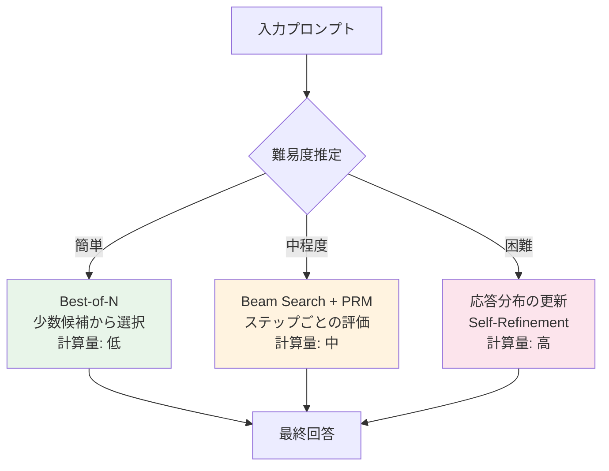

本記事は [Scaling LLM Test-Time Compute Optimally can be More Effective than Scaling Model Parameters (arXiv:2408.03314)](https://arxiv.org/abs/2408.03314) の解説記事です。

## 論文概要（Abstract）

この研究は、LLMの推論時（test-time）に追加の計算量を投入することで性能を向上させる手法を体系的に分析したものである。著者らであるCharlie Snell, Jaehoon Lee, Kelvin Xu, Aviral Kumarは、「固定的だが非自明な推論時計算量を使える場合、困難なプロンプトに対してどれだけ性能を向上できるか」という問題を設定し、プロセスベース報酬モデル（Process Reward Model）による探索と応答分布の適応的更新という2つのメカニズムを分析している。ICLR 2025にOral論文として採択された。

この記事は [Zenn記事: LLM MoEアーキテクチャの発展とスケーリング戦略を体系的に理解する](https://zenn.dev/0h_n0/articles/5713e817b39187) の深掘りです。

## 情報源

- **arXiv ID**: 2408.03314
- **URL**: [https://arxiv.org/abs/2408.03314](https://arxiv.org/abs/2408.03314)
- **著者**: Charlie Snell, Jaehoon Lee, Kelvin Xu, Aviral Kumar
- **発表年**: 2024年（初稿: 2024-08-06）
- **分野**: cs.LG, cs.CL
- **採択**: ICLR 2025 Oral

## 背景と動機（Background & Motivation）

従来のLLMスケーリング則（Kaplan則、Chinchilla則）は、**学習時の計算量**（事前学習FLOPs）に焦点を当てていた。モデルの性能は学習時の計算量のべき乗則に従うとされ、性能向上のためにはより大きなモデルをより多くのデータで学習する必要があった。

$$
L(C_{\text{train}}) \propto C_{\text{train}}^{-\alpha}
$$

しかし、この枠組みには重要な限界がある。学習が完了した後、モデルの性能は固定されてしまい、推論時に動的に性能を調整することができない。一方で、OpenAI o1/o3の登場により、**推論時の計算量を増やすことで性能を向上させる**アプローチが実用化され始めた。

この研究は、「推論時の計算量をどのように最適配分すれば、最も効率的に性能を向上できるか」という問題に理論的・実験的に取り組んでいる。

## 主要な貢献（Key Contributions）

著者らが報告する主要な貢献：

- **Compute-Optimal戦略の提案**: プロンプトの難易度に応じて推論時計算量の配分方法を動的に切り替えることで、Best-of-Nベースラインと比較して**4倍以上の効率改善**を達成
- **小さなモデル vs 大きなモデルの比較**: FLOPs等価の条件下で、推論時計算量を最適配分した小さなモデルが**14倍大きなモデル**の即答性能を上回るケースがあることを実証
- **2つのスケーリングメカニズムの分析**: プロセスベース報酬モデルによる探索と応答分布の更新という2つのアプローチの特性を詳細に分析

## 技術的詳細（Technical Details）

### 推論時計算量のスケーリングフレームワーク

著者らは、推論時に計算量を投入する方法を大きく2つに分類している。

**方法1: Search against a Verifier（検証器に対する探索）**

複数の候補回答を生成し、プロセスベース報酬モデル（PRM: Process Reward Model）で各推論ステップを評価して最良の回答を選択する。

$$
\hat{y} = \arg\max_{y \in \mathcal{Y}_N} V(y | x)
$$

ここで、
- $\mathcal{Y}_N$: $N$個の候補回答の集合
- $V(y | x)$: 検証器（PRM）による回答 $y$ のスコア
- $x$: 入力プロンプト

PRMの特徴は、最終回答だけでなく**中間の推論ステップ**も評価できる点にある。Beam Searchの各ステップでPRMスコアに基づいてビームを選択することで、より精度の高い探索が可能となる。

**方法2: Adaptive Response Distribution Updates（応答分布の適応的更新）**

モデルの応答分布を、プロンプトに応じて動的に修正する。具体的には、以下の最適化問題を近似的に解く：

$$
p^*(y | x) = \arg\min_{q} D_{\text{KL}}(q(y|x) \| p_0(y|x)) - \beta \cdot \mathbb{E}_{q}[R(y, x)]
$$

ここで、
- $p_0(y|x)$: ベースモデルの応答分布
- $R(y, x)$: 報酬関数
- $\beta$: KLダイバージェンスと報酬のトレードオフ係数

この最適化の解は：

$$
p^*(y | x) \propto p_0(y|x) \cdot \exp\left(\beta \cdot R(y, x)\right)
$$

実装上は、Sequential Revisionやself-refinementなどの手法でこの分布更新を近似する。

```python
import torch
import torch.nn.functional as F
from dataclasses import dataclass

@dataclass
class SearchConfig:
    """推論時探索の設定"""
    num_candidates: int = 64
    beam_width: int = 8
    max_steps: int = 16
    temperature: float = 0.7

def compute_optimal_inference(
    model,
    prm: "ProcessRewardModel",
    prompt: str,
    config: SearchConfig,
    difficulty: float,
) -> str:
    """Compute-Optimal推論

    プロンプトの難易度に応じて最適な推論戦略を選択する。

    Args:
        model: ベースLLM
        prm: プロセスベース報酬モデル
        prompt: 入力プロンプト
        config: 探索設定
        difficulty: プロンプトの推定難易度 (0.0-1.0)

    Returns:
        最良の回答文字列
    """
    if difficulty < 0.3:
        # 簡単な問題: Best-of-N（少数候補）
        candidates = [
            model.generate(prompt, temperature=config.temperature)
            for _ in range(min(4, config.num_candidates))
        ]
        scores = [prm.score(prompt, c) for c in candidates]
        return candidates[torch.argmax(torch.tensor(scores))]

    elif difficulty < 0.7:
        # 中程度の問題: Beam Search with PRM
        return beam_search_with_prm(
            model, prm, prompt,
            beam_width=config.beam_width,
            max_steps=config.max_steps,
        )

    else:
        # 難しい問題: 応答分布の更新（Self-Refinement）
        response = model.generate(prompt, temperature=config.temperature)
        for _ in range(3):  # 最大3回修正
            score = prm.score(prompt, response)
            if score > 0.9:
                break
            critique = model.generate(
                f"Review this answer and suggest improvements:\n"
                f"Question: {prompt}\nAnswer: {response}"
            )
            response = model.generate(
                f"Improve this answer based on the review:\n"
                f"Question: {prompt}\nAnswer: {response}\n"
                f"Review: {critique}"
            )
        return response
```

### Compute-Optimal戦略

著者らの最も重要な発見は、**最適な推論時スケーリング戦略はプロンプトの難易度に依存する**ことである。



**簡単な問題**: ベースモデルがある程度正解できる問題に対しては、少数の候補を生成してPRMで選択するだけで十分。大量の計算量を投入しても追加の利益は限定的。

**中程度の問題**: Beam SearchをPRMで誘導することで、推論ステップレベルでの探索が有効。計算量の増加に対して対数的な性能向上が見られる。

**困難な問題**: ベースモデルがほぼ正解できない問題に対しては、推論時計算量を増やしても改善が限定的な場合がある。著者らはこれを「推論時スケーリングの限界」として注意を促している。

### モデルサイズ vs 推論時計算量のトレードオフ

著者らの実験で最も注目すべき結果は、FLOPs等価の条件下での比較である。

$$
\text{Total FLOPs} = \text{FLOPs}_{\text{single}}(N) \times \text{num\_samples}
$$

ここで$N$はモデルのパラメータ数、$\text{num\_samples}$は生成する候補数である。

著者らの報告によれば、Llama 2系列のモデルを用いた実験において：

- **8Bモデル + 推論時計算量最適化** が、**70Bモデルの即答**（1回の生成）と同等またはそれ以上の性能を達成するケースがあった
- ただしこれは**ベースモデルが一定以上の基礎能力を持つ問題**に限定される
- ベースモデルが全く解けない問題（正答率 ≈ 0%）では、推論時計算量を増やしても改善されない

$$
\text{Performance}(N_{\text{small}}, C_{\text{inference}}) \geq \text{Performance}(N_{\text{large}}, 1)
$$

が成り立つ条件: $N_{\text{small}}$ のベースモデルが当該問題に対してある程度の正答率を持つこと。

## 実験結果（Results）

著者らが報告する主要な実験結果（論文Figure 3, Table 1より）：

| 手法 | MATH ベンチマーク | 計算量（相対） |
|------|---------------|-------------|
| Llama 2 70B (即答) | 基準 | 1.0x |
| Llama 2 8B + Best-of-N (N=256) | 基準以下 | 0.5x |
| Llama 2 8B + Compute-Optimal | **基準以上** | 0.5x |

**Compute-Optimal戦略 vs Best-of-N**: 著者らは、Compute-Optimal戦略がBest-of-Nと比較して4倍以上の効率改善を達成したと報告している。これは、問題の難易度に応じて計算量の配分を動的に切り替えることの重要性を示している。

**スケーリングの限界**: 著者らは同時に、推論時計算量のスケーリングには限界があることも報告している。特に、ベースモデルの能力を大幅に超える問題（例：8Bモデルでは全く解けない高度な数学問題）に対しては、推論時計算量をいくら増やしても性能向上が見られない。

## 実装のポイント（Implementation）

**PRM（プロセスベース報酬モデル）の学習**: PRMの品質が推論時スケーリングの効果を大きく左右する。著者らは、MATHデータセットのステップごとの正誤ラベルを用いてPRMを学習している。実務でPRMを構築する場合、高品質なステップレベルのアノテーションが必要となるが、これは高コストである。

**難易度推定の実装**: Compute-Optimal戦略では、プロンプトの難易度を推定する機構が必要。著者らは、ベースモデルの初回生成の確信度（log probability）を難易度の代理指標として使用している。

**レイテンシとスループットのトレードオフ**: 推論時計算量の増加は直接的にレイテンシの増大を意味する。リアルタイム応答が求められるアプリケーションでは、計算量の上限を設定する必要がある。o3-miniのAdaptive Thinking（Low/Medium/High）はこの問題に対する実用的な解決策の一例である。

**MoEモデルとの組み合わせ**: MoEモデルは1トークンあたりの推論コストが密なモデルより低いため、推論時スケーリングとの組み合わせが特に有効である。MoEで削減されたコストの一部を追加の候補生成やBeam Searchに再配分することで、同一総コストでより高い性能を実現できる可能性がある。

## Production Deployment Guide

### AWS実装パターン（コスト最適化重視）

推論時スケーリングは計算量の増大を伴うため、コスト管理が特に重要である。

| 規模 | 月間リクエスト | 推奨構成 | 月額コスト | 主要サービス |
|------|--------------|---------|-----------|------------|
| **Small** | ~3,000 (100/日) | Serverless | $100-300 | Lambda + Bedrock |
| **Medium** | ~30,000 (1,000/日) | Hybrid | $500-1,500 | Lambda + ECS Fargate |
| **Large** | 300,000+ (10,000/日) | Container | $3,000-8,000 | EKS + GPU Instances |

**推論時スケーリング固有のコスト考慮**:
- Best-of-N: 候補数に比例してコスト増大（N=64で64倍）
- Beam Search: ビーム幅×ステップ数に比例
- Compute-Optimal: 難易度に応じて動的に調整（平均2-5倍）

**コスト試算の注意事項**:
- 2026年3月時点のAWS ap-northeast-1料金に基づく概算値
- 推論時スケーリングの候補数により大幅に変動
- 最新料金は [AWS料金計算ツール](https://calculator.aws/) で確認推奨

### Terraformインフラコード

```hcl
# --- Compute-Optimal推論パイプライン ---
module "vpc" {
  source  = "terraform-aws-modules/vpc/aws"
  version = "~> 5.0"

  name = "test-time-compute-vpc"
  cidr = "10.0.0.0/16"
  azs  = ["ap-northeast-1a", "ap-northeast-1c"]
  private_subnets = ["10.0.1.0/24", "10.0.2.0/24"]
  enable_nat_gateway = false
}

# 難易度推定Lambda
resource "aws_lambda_function" "difficulty_estimator" {
  function_name = "prompt-difficulty-estimator"
  runtime       = "python3.12"
  handler       = "index.handler"
  timeout       = 30
  memory_size   = 512
  filename      = "difficulty_estimator.zip"

  role = aws_iam_role.lambda_role.arn

  environment {
    variables = {
      BEDROCK_MODEL = "anthropic.claude-3-5-haiku-20241022-v1:0"
      STRATEGY      = "compute-optimal"
    }
  }
}

# 推論結果キャッシュ（同一プロンプトの再計算防止）
resource "aws_dynamodb_table" "inference_cache" {
  name         = "test-time-compute-cache"
  billing_mode = "PAY_PER_REQUEST"
  hash_key     = "prompt_hash"

  attribute {
    name = "prompt_hash"
    type = "S"
  }

  ttl {
    attribute_name = "expire_at"
    enabled        = true
  }
}
```

### 運用・監視設定

```python
import boto3

cloudwatch = boto3.client('cloudwatch')

# 推論時計算量のモニタリング
cloudwatch.put_metric_alarm(
    AlarmName='test-time-compute-cost',
    ComparisonOperator='GreaterThanThreshold',
    EvaluationPeriods=1,
    MetricName='InferenceComputeMultiplier',
    Namespace='Custom/TestTimeCompute',
    Period=3600,
    Statistic='Average',
    Threshold=10.0,  # 平均10倍以上の計算量でアラート
    AlarmDescription='推論時計算量が異常に高い'
)
```

### コスト最適化チェックリスト

- [ ] 難易度推定の精度を監視（過剰な計算量配分を防止）
- [ ] 推論キャッシュの有効化（同一プロンプトの再計算防止）
- [ ] 候補数の上限設定（Best-of-N: N ≤ 64推奨）
- [ ] タイムアウト設定（長時間推論の打ち切り）
- [ ] Bedrock Batch API: 非リアルタイム処理は50%割引
- [ ] Prompt Caching: PRMプロンプトのキャッシュ
- [ ] AWS Budgets: 月額予算設定
- [ ] Cost Anomaly Detection有効化

## 実運用への応用（Practical Applications）

**推論時スケーリングの適用判断**: すべてのタスクに推論時スケーリングが有効なわけではない。著者らの研究が示すように、ベースモデルがある程度の正答率を持つ問題（中程度の難易度）で最も効果が高い。リアルタイム性が求められるチャットボット等では、レイテンシの増大がユーザー体験を損なう可能性がある。

**MoEとの統合**: Zenn記事で議論されているように、MoEモデルの推論コスト削減と推論時スケーリングの組み合わせは有力なアプローチである。例えば、DeepSeek-V3（37Bアクティブ）で削減された計算量を、追加のBeam SearchやSelf-Refinementに投入することで、密な70Bモデルの即答を上回る性能を目指せる。

**Adaptive Thinking**: OpenAI o3-miniが実装しているLow/Medium/Highの計算量設定は、この研究のCompute-Optimal戦略の実用化例と見なせる。ユーザーまたはシステムがタスクの難易度に応じて推論深度を選択できる仕組みは、コスト管理の観点からも重要である。

## 関連研究（Related Work）

- **Kaplan et al. (2020)**: ニューラルスケーリング則。学習時計算量のスケーリングを体系化。本研究はこれを推論時に拡張
- **Chinchilla (Hoffmann et al., 2022)**: 学習時の計算量最適配分を確立。本研究は推論時の最適配分を追求
- **OpenAI o1/o3**: 推論時スケーリングの商用実装。Chain-of-Thoughtの強化学習により「考えてから答える」能力を実現
- **Self-Consistency (Wang et al., 2022)**: 複数の推論パスからの多数決。本研究のBest-of-Nの基盤的手法

## まとめと今後の展望

この研究は、推論時計算量の最適配分が、モデルパラメータのスケーリングよりも効率的になり得ることを示した。特に、プロンプトの難易度に応じて推論戦略を動的に切り替えるCompute-Optimal戦略が、Best-of-Nと比較して4倍以上の効率改善を達成したことは注目に値する。

今後の方向性として、著者らはPRMの自動学習（人手アノテーションなし）、MoEモデルとの統合、およびリアルタイムアプリケーションにおける推論時計算量の効率的管理を挙げている。LLMの性能向上が学習時の計算量だけでなく推論時の計算量にも依存するという認識は、今後のモデル設計とデプロイ戦略に大きな影響を与えると考えられる。

## 参考文献

- **arXiv**: [https://arxiv.org/abs/2408.03314](https://arxiv.org/abs/2408.03314)
- **Related Zenn article**: [https://zenn.dev/0h_n0/articles/5713e817b39187](https://zenn.dev/0h_n0/articles/5713e817b39187)
- **Kaplan Scaling Laws**: [https://arxiv.org/abs/2001.08361](https://arxiv.org/abs/2001.08361)
- **Chinchilla**: [https://arxiv.org/abs/2203.15556](https://arxiv.org/abs/2203.15556)

---

:::message
この記事はAI（Claude Code）により自動生成されました。論文の主張と著者の見解を正確に伝えることを目指していますが、解釈の正確性については原論文もご確認ください。
:::
