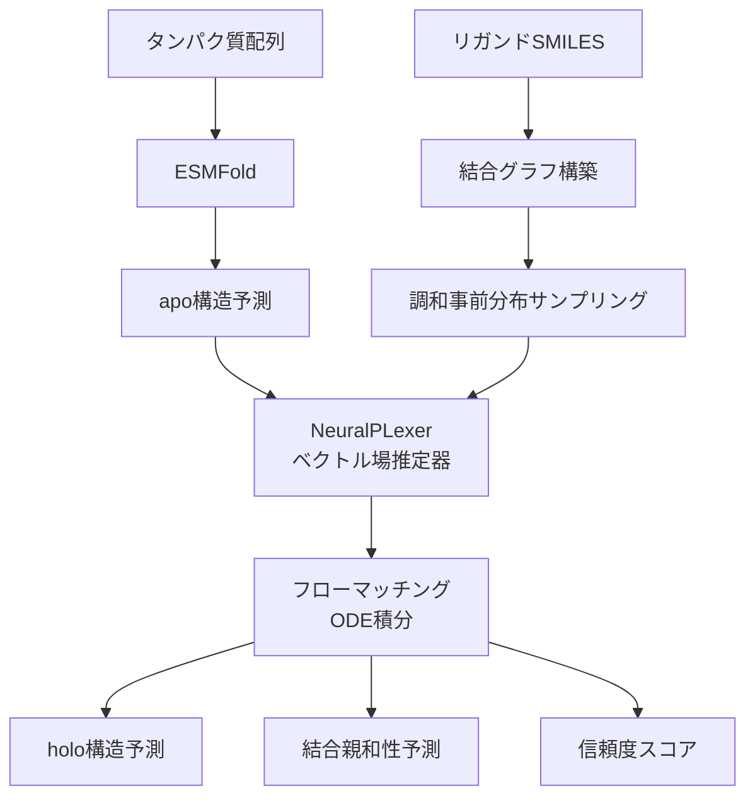

本記事は [FlowDock: Geometric Flow Matching for Generative Protein-Ligand Docking and Affinity Prediction](https://arxiv.org/abs/2412.10966)（Morehead & Cheng, 2024）の解説記事です。

## 論文概要（Abstract）

FlowDockは、条件付きフローマッチング（Conditional Flow Matching）を用いた初の深層幾何生成モデルであり、非結合状態（apo）のタンパク質構造から結合状態（holo）の複合体構造を予測する。著者らは、PoseBustersベンチマークで51%のブラインドドッキング成功率を達成し、CASP16コンペティションにおいて140の薬理学的に関連するターゲットに対してトップ5の結合親和性予測手法にランクインしたと報告している。

この記事は [Zenn記事: 生成AIで創薬はどう変わるか：AlphaFold3からIsoDDEまで2026年最前線](https://zenn.dev/0h_n0/articles/244adaf3ac915e) の深掘りです。

## 情報源

- **arXiv ID**: 2412.10966
- **URL**: [https://arxiv.org/abs/2412.10966](https://arxiv.org/abs/2412.10966)
- **著者**: Alex Morehead, Jianlin Cheng
- **発表年**: 2024年12月
- **分野**: cs.LG, q-bio.BM
- **コード**: [https://github.com/BioinfoMachineLearning/FlowDock](https://github.com/BioinfoMachineLearning/FlowDock)

## 背景と動機（Background & Motivation）

タンパク質-リガンドドッキング（分子ドッキング）は創薬の中核技術であり、候補化合物がターゲットタンパク質にどのように結合するかを予測する。従来のドッキングツール（AutoDock Vina、Glide等）は物理ベースのスコアリング関数を使用するが、計算コストが高く、タンパク質の柔軟性を十分に扱えない。

深層学習ベースのドッキング手法として、DiffDock（拡散モデル）、NeuralPLexer（SE(3)等変性GNN）、AlphaFold3（拡散モジュール）が提案されてきた。しかし、これらには以下の課題が残されていた。

1. **構造予測と親和性予測の分離**: ドッキングポーズ予測と結合強度予測が別モデルで行われ、統合が困難
2. **マルチリガンド非対応**: 複数のリガンドが同時に結合するケースに対応できない
3. **MSA依存**: AlphaFold3はMSA（Multiple Sequence Alignment）情報を必要とし、処理が重い

FlowDockはこれら3つの課題すべてに対応する。

## 主要な貢献（Key Contributions）

- **貢献1**: 条件付きフローマッチングに基づく初の深層幾何生成モデル。apo構造からholo構造への直接マッピングを学習
- **貢献2**: 複数のリガンドが同時結合するケースに対応（multi-ligand docking）
- **貢献3**: 構造予測と結合親和性予測を統合し、バーチャルスクリーニングに必要な情報を一度の推論で出力

## 技術的詳細（Technical Details）

### 条件付きフローマッチング（Conditional Flow Matching）の定式化

FlowDockはリーマン多様体上の条件付きフローマッチング（Riemannian CFM）を採用している。学習目標は以下の通り。

$$
\mathcal{L}_{\text{RCFM}}(\theta) = \mathbb{E}_{t, q(\mathbf{z}), \rho_t(\mathbf{x}_t | \mathbf{z})} \left\| v_\theta(\mathbf{x}_t, t) - u_t(\mathbf{x}_t | \mathbf{z}) \right\|_g^2
$$

ここで、
- $v_\theta$: パラメータ $\theta$ を持つベクトル場（ニューラルネットワーク）
- $u_t$: 条件付き目標ベクトル場
- $\rho_t(\mathbf{x}_t | \mathbf{z})$: 時刻 $t$ での条件付き確率パス
- $\|\cdot\|_g$: リーマン計量 $g$ によるノルム

$\mathbb{R}^3$ 空間（原子座標）の場合、直線補間パスを用いて簡略化される：

$$
\mathcal{L}_{\mathbb{R}^3}(\theta) = \mathbb{E}_{t, q(\mathbf{z}), \rho_t(\mathbf{x}_t | \mathbf{z})} \left\| v_\theta(\mathbf{x}_t, t) - \mathbf{x}_1 \right\|^2
$$

$$
\rho_t(\mathbf{x} | \mathbf{z}) = (1-t) \cdot \mathbf{x}_0 + t \cdot \mathbf{x}_1
$$

ここで $\mathbf{x}_0$ はノイズ分布からのサンプル、$\mathbf{x}_1$ は目標構造（holo状態）である。

### 事前分布の設計

FlowDockの重要な設計要素は、タンパク質とリガンドに異なる事前分布を使用する点である。

**タンパク質事前分布（ESMFold）**:

$$
\rho_0^P(\mathbf{x}_0^P) \propto \text{ESMFold}(s^P) + \epsilon, \quad \epsilon \sim \mathcal{N}(0, \sigma=10^{-4})
$$

ESMFoldは配列情報のみからタンパク質構造を予測するモデルであり、MSAを必要としない。これにより計算効率が向上する。

**リガンド事前分布（調和事前分布）**:

$$
\rho_0^L(\mathbf{x}_0^L) \propto \exp\left(-\frac{1}{2} \mathbf{x}_0^{L\top} \mathbf{L} \mathbf{x}_0^L\right)
$$

$$
\mathbf{L} = \mathbf{D} - \mathbf{A}
$$

ここで $\mathbf{L}$ はリガンドの結合グラフのラプラシアン行列、$\mathbf{D}$ は次数行列、$\mathbf{A}$ は隣接行列である。この調和事前分布により、リガンドの初期配置がその結合トポロジーに基づく物理的に妥当な分布から開始される。

### 一般化非均衡フローマッチング

FlowDockは学習データのフィルタリングに構造類似度閾値を使用する：

$$
q(\mathbf{x}_0, \mathbf{x}_1) \propto q_0(\mathbf{x}_0) q_1(\mathbf{x}_1) \mathbb{1}_{c(\mathbf{x}_0, \mathbf{x}_1) \in c_\mathbb{A}}
$$

具体的には、TM-score > 0.7 かつ RMSD < 5Å の条件を満たすapo-holoペアのみを学習に使用する。

### アーキテクチャ

FlowDockのベクトル場推定器はNeuralPLexerアーキテクチャを微調整したものであり、以下の修正が加えられている。

1. **スコアヘッドの再学習**: 拡散スコアマッチングからフローマッチング目的関数への変更
2. **信頼度ヘッドの再設計**: 構造信頼度に加え、結合親和性を予測するよう改変
3. **全原子グラフ処理**: タンパク質-リガンド複合体を属性付き幾何グラフとして処理



## 実装のポイント（Implementation）

### 推論パイプラインの概要

```python
import torch
from typing import NamedTuple


class FlowDockInput(NamedTuple):
    """FlowDock推論の入力データ。"""
    protein_sequence: str        # アミノ酸配列
    ligand_smiles: list[str]     # リガンドSMILES（複数対応）


class FlowDockOutput(NamedTuple):
    """FlowDock推論の出力データ。"""
    complex_coords: torch.Tensor   # 複合体座標 (n_atoms, 3)
    binding_affinity: float        # 結合親和性予測値
    confidence_score: float        # 構造信頼度


def predict_docking(
    input_data: FlowDockInput,
    n_steps: int = 50,
    device: str = "cuda",
) -> FlowDockOutput:
    """FlowDockによるドッキング予測の概念実装。

    Args:
        input_data: タンパク質配列とリガンドSMILES
        n_steps: ODE積分ステップ数
        device: 計算デバイス

    Returns:
        複合体構造、結合親和性、信頼度スコア
    """
    # 1. ESMFoldでapo構造予測
    # apo_structure = esmfold.predict(input_data.protein_sequence)

    # 2. 調和事前分布からリガンド初期配置をサンプリング
    # ligand_init = sample_harmonic_prior(input_data.ligand_smiles)

    # 3. フローマッチングODE積分
    # for t in torch.linspace(0, 1, n_steps):
    #     velocity = model.predict_velocity(x_t, t)
    #     x_t = x_t + velocity * dt

    # 4. 結合親和性予測
    # affinity = model.predict_affinity(x_final)

    raise NotImplementedError("Full implementation requires FlowDock weights")
```

### 実装上の注意点

- **GPU要件**: 推論にはNVIDIA GPU（25.6GB VRAM）が必要。A100 40GB推奨
- **推論時間**: 著者らの報告では1複合体あたり約39秒（論文Table 1より）。DynamicBind（147秒）より高速で、NeuralPLexer（29秒）とほぼ同等
- **ESMFold依存**: タンパク質構造予測にESMFoldを使用するため、ESMFoldのモデルウェイト（約3.5GB）も必要
- **複数リガンド対応**: 単一のリガンドだけでなく、複数のリガンドが同時に結合するケースにも対応。これは薬物間相互作用の予測に有用

## 実験結果（Results）

### PoseBustersベンチマーク（n=308）

著者らが報告した結果（論文Table 2より）：

| 手法 | 成功率（RMSD < 2Å） | エネルギー最小化後 |
|------|---------------------|-----------------|
| FlowDock | 41% | **51%** |
| NeuralPLexer | ~31% | - |
| Chai-1 | - | 68% |
| DynamicBind | ~35% | - |

FlowDockはエネルギー最小化後にNeuralPLexerを約10ポイント上回っている。Chai-1がさらに高い成功率を達成しているが、これはより大規模なモデルと学習データを使用している。

### PDBBind結合親和性予測（n=363）

著者らが報告した結果（論文Table 3より）：

| 指標 | FlowDock | DynamicBind |
|------|----------|-------------|
| Pearson相関 | **0.705±0.001** | 0.665 |
| Spearman相関 | **0.674±0.002** | 0.634 |
| RMSE | 1.363±0.003 | **1.301** |

FlowDockは相関指標でDynamicBindを上回り、RMSE（Root Mean Square Error）ではDynamicBindがわずかに優れている。

### CASP16コンペティション

著者らによると、FlowDockはCASP16において「140の薬理学的に関連するタンパク質-リガンド複合体に対して、構造予測と親和性予測の両方を行うハイブリッドML手法としてトップ5にランクインした唯一の手法」である。

### 計算効率

著者らが報告した推論時間の比較（論文Table 1より）：

| 手法 | 推論時間（秒） | GPUメモリ（GB） |
|------|-------------|---------------|
| FlowDock | 39.34 | 25.61 |
| NeuralPLexer | 29.10 | - |
| DynamicBind | 146.99 | - |

## 実運用への応用（Practical Applications）

FlowDockの実運用での適用シナリオは以下の通りである。

**バーチャルスクリーニング**: 構造予測と親和性予測を統合しているため、大規模化合物ライブラリのスクリーニングを単一パイプラインで実行可能。MSA不要のためスループットが高い。

**マルチリガンドドッキング**: アロステリック阻害剤の設計や、薬物間相互作用の評価において、複数リガンドの同時結合を考慮できる点が有用。

**構造未知ターゲットへの適用**: ESMFoldによるapo構造予測を組み込んでいるため、X線結晶構造が未解決のターゲットに対しても適用可能。

**制約**: DockGen-Eデータセット（新規結合ポケット）での成功率は約4%と低く、既知のポケットとは大きく異なる結合部位への汎化能力には限界がある。この点はChai-1を含む全手法に共通する課題である。

## Production Deployment Guide

### AWS実装パターン（コスト最適化重視）

| 規模 | 月間リクエスト | 推奨構成 | 月額コスト | 主要サービス |
|------|--------------|---------|-----------|------------|
| **Small** | ~3,000 (100/日) | GPU Serverless | $200-500 | SageMaker Serverless + S3 |
| **Medium** | ~30,000 (1,000/日) | GPU Dedicated | $1,200-2,500 | SageMaker (g5.xlarge) + ElastiCache |
| **Large** | 300,000+ (10,000/日) | GPU Cluster | $5,000-10,000 | EKS + g5.xlarge×2-4 Spot |

FlowDockの推論時間（39秒/複合体）はAF3より短く、コスト効率が良い。

**Small構成の詳細**（月額$200-500）：
- **SageMaker Serverless**: FlowDock推論（GPU必須、A10G 24GB）
- **S3**: ESMFoldウェイト・結果保存（$5/月）
- **Lambda**: リクエスト管理・SMILES前処理（$10/月）

**コスト試算の注意事項**：
- 上記は2026年3月時点のAWS ap-northeast-1料金に基づく概算値です
- 最新料金は [AWS料金計算ツール](https://calculator.aws/) で確認してください

### Terraformインフラコード

```hcl
resource "aws_sagemaker_endpoint_configuration" "flowdock" {
  name = "flowdock-inference"

  production_variants {
    variant_name = "default"
    model_name   = aws_sagemaker_model.flowdock.name
    serverless_config {
      max_concurrency   = 2
      memory_size_in_mb = 6144
    }
  }
}

resource "aws_cloudwatch_metric_alarm" "docking_latency" {
  alarm_name          = "flowdock-latency"
  comparison_operator = "GreaterThanThreshold"
  evaluation_periods  = 2
  metric_name         = "ModelLatency"
  namespace           = "AWS/SageMaker"
  period              = 300
  statistic           = "p95"
  threshold           = 60000
  alarm_description   = "FlowDockドッキングP95レイテンシ60秒超過"
}
```

### コスト最適化チェックリスト

- [ ] ~100 req/日 → SageMaker Serverless - $200-500/月
- [ ] ~1000 req/日 → SageMaker Dedicated - $1,200-2,500/月
- [ ] 10000+ req/日 → EKS + Spot - $5,000-10,000/月
- [ ] ESMFold結果のキャッシュ（同一配列の再予測回避）
- [ ] バッチドッキングで複数リガンドを一括処理
- [ ] Spot Instances優先（70%削減）
- [ ] AWS Budgets月額予算設定
- [ ] Cost Anomaly Detection有効化

## 関連研究（Related Work）

- **DiffDock**（Corso et al., ICLR 2023）: 拡散モデルによるブラインドドッキングの先駆的研究。FlowDockはフローマッチングによる改良版
- **NeuralPLexer**（Qiao et al., 2024）: FlowDockのベースアーキテクチャ。SE(3)等変性GNNによるタンパク質-リガンド構造予測
- **DynamicBind**（Lu et al., 2024）: タンパク質の柔軟性を考慮したドッキング手法。FlowDockは親和性予測精度で上回る
- **Chai-1**（Chai Discovery, 2024）: 大規模モデルによる高精度ドッキング。PoseBustersで68%の成功率を達成

## まとめと今後の展望

FlowDockは条件付きフローマッチングをタンパク質-リガンドドッキングに適用した初の手法であり、構造予測と結合親和性予測を統合している。PoseBustersでの51%成功率とCASP16でのトップ5ランクインは、フローマッチングベースのドッキング手法の有効性を示している。

MSA不要のESMFold事前分布、調和事前分布によるリガンド初期化、マルチリガンド対応など、実用的な設計上の工夫が多い。今後は新規結合ポケットへの汎化能力の向上と、大規模化合物ライブラリのスクリーニング効率化が課題である。

## 参考文献

- **arXiv**: [https://arxiv.org/abs/2412.10966](https://arxiv.org/abs/2412.10966)
- **Code**: [https://github.com/BioinfoMachineLearning/FlowDock](https://github.com/BioinfoMachineLearning/FlowDock)
- **Related Zenn article**: [https://zenn.dev/0h_n0/articles/244adaf3ac915e](https://zenn.dev/0h_n0/articles/244adaf3ac915e)
