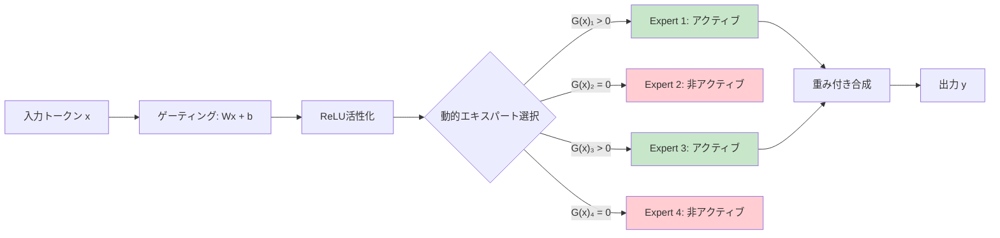

本記事は [ReMoE: Fully Differentiable Mixture-of-Experts with ReLU Routing (arXiv:2412.14711)](https://arxiv.org/abs/2412.14711) の解説記事です。ICLR 2025に採択されている。

## 論文概要（Abstract）

ReMoEは、従来のTopK+SoftmaxルーティングをReLUベースのルーティングに置き換えることで、MoEアーキテクチャの学習を完全微分可能にする手法である。著者らであるZiteng Wang, Jun Zhu, Jianfei Chenは、TopKルーティングの不連続性が最適化の障壁となっていることを指摘し、ReLUによる連続的なルーティングにより「トークンやレイヤー間での計算の動的割り当て」と「ドメイン特化」が効率的に実現されると報告している。

この記事は [Zenn記事: LLM MoEアーキテクチャの発展とスケーリング戦略を体系的に理解する](https://zenn.dev/0h_n0/articles/5713e817b39187) の深掘りです。

## 情報源

- **会議名**: ICLR 2025（International Conference on Learning Representations）
- **年**: 2025
- **URL**: [https://arxiv.org/abs/2412.14711](https://arxiv.org/abs/2412.14711)
- **著者**: Ziteng Wang, Jun Zhu, Jianfei Chen
- **初稿**: 2024-12-19、改訂: 2025-02-27

## カンファレンス情報

**ICLRについて**: ICLR（International Conference on Learning Representations）は、表現学習と深層学習の分野における最高峰の学術会議の1つである。2025年のICLRは特にMoEアーキテクチャに関する研究が多数採択されており、Auxiliary-Loss-Free Load Balancing（DeepSeek系）やMOE++など、MoEの学習安定性と効率に関する研究が注目を集めている。

## 技術的詳細（Technical Details）

### TopKルーティングの問題点

従来のMoEルーティングでは、ゲーティングネットワークの出力にSoftmaxを適用した後、TopK選択を行う：

$$
G(x) = \text{TopK}(\text{Softmax}(W_g \cdot x), K)
$$

このTopK演算は**不連続な関数**であり、以下の問題を引き起こす：

1. **勾配の不連続性**: TopKで選択されなかったエキスパートに対する勾配がゼロになり、学習信号が伝播しない
2. **固定的な活性化数**: 入力の複雑さに関わらず、常に$K$個のエキスパートが活性化される。簡単なトークンでも$K$個、複雑なトークンでも$K$個
3. **離散的なルーティング決定**: ルーティングの微小な変化が、エキスパートの完全な切り替えを引き起こす可能性がある

### ReLUルーティングのメカニズム

ReMoEは、TopK+SoftmaxをReLUに置き換えることでこれらの問題を解決する：

$$
G(x)_i = \text{ReLU}(W_g \cdot x + b_i) = \max(0, w_i^T x + b_i)
$$

ここで、
- $W_g \in \mathbb{R}^{N \times d}$: ゲーティング重み行列（$N$: エキスパート数、$d$: モデル次元）
- $b_i$: エキスパート$i$のバイアス項
- $G(x)_i$: エキスパート$i$のゲーティング値（0以上）

ReLUの特性により：
- $w_i^T x + b_i > 0$ の場合: エキスパート$i$はアクティブ（ゲーティング値 = $w_i^T x + b_i$）
- $w_i^T x + b_i \leq 0$ の場合: エキスパート$i$は非アクティブ（ゲーティング値 = 0）

**重要な違い**: TopKでは活性化エキスパート数が固定的（常に$K$個）だが、ReLUでは**入力に応じて動的に変化**する。

$$
K_{\text{effective}}(x) = |\{i : w_i^T x + b_i > 0\}|
$$

```python
import torch
import torch.nn as nn

class ReMoERouter(nn.Module):
    """ReMoEのReLUベースルーター

    TopK+Softmaxの代わりにReLUを使用し、
    完全微分可能なルーティングを実現する。

    Args:
        d_model: モデルの隠れ次元
        num_experts: エキスパート数
        l1_coeff: L1正則化係数（スパース性制御）
    """

    def __init__(
        self,
        d_model: int,
        num_experts: int,
        l1_coeff: float = 0.01,
    ):
        super().__init__()
        self.num_experts = num_experts
        self.l1_coeff = l1_coeff

        # ゲーティングネットワーク（バイアスあり）
        self.gate = nn.Linear(d_model, num_experts, bias=True)

    def forward(
        self, x: torch.Tensor
    ) -> tuple[torch.Tensor, torch.Tensor]:
        """ReLUルーティングを計算

        Args:
            x: 入力テンソル (batch, seq, d_model)

        Returns:
            gate_values: ゲーティング値 (batch, seq, num_experts)
            l1_loss: スパース性制御のためのL1正則化損失
        """
        # ゲーティングスコア計算
        logits = self.gate(x)  # (batch, seq, num_experts)

        # ReLU活性化（0以下はカット）
        gate_values = torch.relu(logits)

        # 正規化（アクティブなエキスパートのスコア合計 = 1）
        gate_sum = gate_values.sum(dim=-1, keepdim=True)
        gate_sum = gate_sum.clamp(min=1e-8)  # ゼロ除算防止
        gate_values_normalized = gate_values / gate_sum

        # L1正則化（スパース性の制御）
        l1_loss = self.l1_coeff * gate_values.mean()

        return gate_values_normalized, l1_loss


class ReMoELayer(nn.Module):
    """ReMoE層の完全な実装

    Args:
        d_model: モデルの隠れ次元
        d_ff: FFNの中間次元
        num_experts: エキスパート数
        l1_coeff: L1正則化係数
    """

    def __init__(
        self,
        d_model: int,
        d_ff: int,
        num_experts: int,
        l1_coeff: float = 0.01,
    ):
        super().__init__()
        self.router = ReMoERouter(d_model, num_experts, l1_coeff)

        self.experts = nn.ModuleList([
            nn.Sequential(
                nn.Linear(d_model, d_ff),
                nn.SiLU(),
                nn.Linear(d_ff, d_model),
            )
            for _ in range(num_experts)
        ])

    def forward(self, x: torch.Tensor) -> tuple[torch.Tensor, torch.Tensor]:
        """Forward pass

        Args:
            x: 入力テンソル (batch, seq, d_model)

        Returns:
            output: 出力テンソル (batch, seq, d_model)
            aux_loss: L1正則化損失
        """
        gate_values, l1_loss = self.router(x)

        # アクティブなエキスパートのみ計算
        output = torch.zeros_like(x)
        for i, expert in enumerate(self.experts):
            gate_i = gate_values[..., i]  # (batch, seq)
            mask = gate_i > 0  # アクティブなトークンのみ
            if mask.any():
                expert_input = x[mask]
                expert_output = expert(expert_input)
                output[mask] += gate_i[mask].unsqueeze(-1) * expert_output

        return output, l1_loss
```

### スパース性の制御と負荷分散

ReLUルーティングの課題は、**すべてのエキスパートが常にアクティブになる**可能性がある点である。スパース性を確保するため、著者らは以下の2つの正則化を組み合わせている。

**L1正則化（Refined版）**:

$$
L_{\text{L1}} = \lambda \cdot \frac{1}{T} \sum_{t=1}^{T} \sum_{i=1}^{N} G(x_t)_i
$$

ゲーティング値全体のL1ノルムを最小化することで、不要なエキスパートの活性化を抑制する。$\lambda$は適応的に調整される。

**負荷分散正則化**:

$$
L_{\text{balance}} = \gamma \cdot N \sum_{i=1}^{N} f_i \cdot \bar{G}_i
$$

ここで、$f_i$はエキスパート$i$にルーティングされたトークンの割合、$\bar{G}_i$はエキスパート$i$のゲーティング値の平均。この正則化により、特定のエキスパートへの過度な集中を防ぐ。



### TopKルーティングとの比較分析

| 特性 | TopK + Softmax | ReLU (ReMoE) |
|------|--------------|-------------|
| 微分可能性 | 不連続（TopK演算） | 完全微分可能 |
| アクティブ数 | 固定（$K$個） | 動的（入力依存） |
| 勾配の伝播 | 選択されたKエキスパートのみ | すべてのエキスパートに伝播可能 |
| 負荷分散 | 補助損失が必要 | L1 + 負荷分散正則化 |
| 計算量の予測 | 容易（固定$K$） | 困難（動的に変動） |
| スケーラビリティ | 検証済み（671B+） | エキスパート数増加に対して優位と報告 |

## 査読者の評価（Peer Review Insights）

ICLR 2025の公開レビューに基づくと、査読者は以下の点を評価している：

- **強み**: TopKの不連続性問題に対するシンプルかつ効果的な解決策。ReLUへの置き換えは実装が容易でドロップイン代替可能
- **強み**: エキスパート数のスケーリングに対して一貫した性能向上を実証
- **懸念**: 計算量の動的変動がハードウェア効率（GPU利用率）に与える影響の分析が限定的

## 実装のポイント（Implementation）

**L1係数$\lambda$の調整**: $\lambda$が大きすぎるとほとんどのエキスパートが非アクティブになり（過度なスパース化）、小さすぎると全エキスパートがアクティブになる（密なモデルと同等の計算量）。著者らは学習中に$\lambda$を適応的に調整する手法を提案しており、目標スパース率に基づいてPID制御のような更新を行う。

**動的計算量のハードウェア対応**: ReLUルーティングではトークンごとにアクティブなエキスパート数が異なるため、バッチ処理の効率が低下する可能性がある。実装上は、バッチ内のトークンをアクティブエキスパートごとにグループ化し、各エキスパートにまとめてdispatchする方式が推奨される。

**Megatron-LMでの実装**: 著者らはMegatron-LMベースの実装を公開している。既存のTopKルーティングをReLUルーティングに置き換えるだけで適用可能であり、ドロップイン代替として設計されている。

**既存モデルへの適用**: 事前学習済みのTopK MoEモデルをReLUルーティングにファインチューニングで変換することも可能だが、著者らによれば最初からReLUルーティングで学習した方が性能が高い。

## 実験結果（Results）

著者らが報告する主要な実験結果：

| 構成 | モデルサイズ | エキスパート数 | 手法 | Pile Perplexity ↓ |
|------|-----------|-----------|------|-----------------|
| Base | 350M | 32 | TopK (K=2) | 基準 |
| Base | 350M | 32 | ReMoE | **基準より改善** |
| Scale | 350M | 64 | TopK (K=2) | 微改善 |
| Scale | 350M | 64 | ReMoE | **TopKよりさらに改善** |
| Scale | 350M | 128 | TopK (K=2) | 飽和傾向 |
| Scale | 350M | 128 | ReMoE | **スケーリング維持** |

著者らの報告の要点：
1. ReMoEはエキスパート数の増加に対して**一貫したスケーリング**を示す（TopKは飽和傾向）
2. 各モデルサイズ・エキスパート数の構成でTopKを上回る性能を報告
3. ドメイン特化が自然に発生し、コード・数学・自然言語の各ドメインで異なるエキスパートが活性化される

## 実運用への応用（Practical Applications）

**動的計算量の活用**: ReMoEの「入力に応じてアクティブエキスパート数が変わる」特性は、推論時のコスト最適化に直接活用できる。簡単なトークン（句読点、冠詞等）では少数のエキスパートで処理し、複雑なトークン（専門用語、推論が必要な箇所）ではより多くのエキスパートを活性化する。

**MoEモデルのファインチューニング**: 既存のTopK MoEモデルのルーティング層のみをReLUに置き換えてファインチューニングすることで、モデル全体の再学習なしにルーティングの改善が期待できる。

**推論時スケーリングとの統合**: ReMoEの動的活性化は、Snellらの推論時スケーリング研究と自然に統合できる。難しいプロンプトでは自動的に多くのエキスパートが活性化され、簡単なプロンプトでは少数のエキスパートで済むため、人手による難易度推定なしにCompute-Optimal的な挙動が実現される可能性がある。

## まとめと今後の展望

ReMoEは、TopK+Softmaxルーティングの根本的な問題（不連続性）に対して、ReLU活性化というシンプルかつ効果的な解決策を提案している。完全微分可能なルーティングにより、学習の安定性と性能が向上し、特にエキスパート数のスケーリングにおいてTopKを上回るスケーラビリティを示している。

今後の課題として、大規模モデル（100B+）での検証、動的計算量のハードウェア効率の最適化、およびMoE+推論時スケーリングの統合的な設計が挙げられる。ReLUルーティングが将来のフロンティアMoEモデル（DeepSeek後継、Llama次世代等）に採用されるかどうかは、大規模での実証結果に依存すると考えられる。

## 参考文献

- **Conference URL**: [https://arxiv.org/abs/2412.14711](https://arxiv.org/abs/2412.14711)
- **Code**: Megatron-LMベース実装（論文内にリポジトリリンクあり）
- **Related Zenn article**: [https://zenn.dev/0h_n0/articles/5713e817b39187](https://zenn.dev/0h_n0/articles/5713e817b39187)
- **DeepSeek-V3 Auxiliary-Loss-Free**: [https://arxiv.org/abs/2412.19437](https://arxiv.org/abs/2412.19437)

---

:::message
この記事はAI（Claude Code）により自動生成されました。論文の主張と著者の見解を正確に伝えることを目指していますが、解釈の正確性については原論文もご確認ください。
:::
