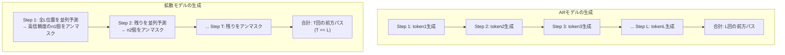

本記事は [arXiv:2506.17298 "Mercury: Ultra-Fast Language Models Based on Diffusion"](https://arxiv.org/abs/2506.17298) の解説記事です。

## 論文概要（Abstract）

Mercury は、Inception Labs が開発した商用拡散言語モデルであり、自己回帰（AR）モデルと比較して推論速度を大幅に高速化することを目的としている。著者らは、マスク拡散モデルに独自の並列デコーディング戦略を組み合わせ、NVIDIA H100 GPU上でMercury Coder Miniが1,109 tokens/sec、Mercury Coder Smallが737 tokens/secのスループットを達成したと報告している。後継モデルのMercury 2ではNVIDIA Blackwell GPU上で約1,009 tokens/sec、エンドツーエンド遅延1.7秒を達成し、推論（Reasoning）機能を備えた初の拡散言語モデルとなった。

この記事は [Zenn記事: 拡散言語モデル2026年動向：Mercury・LLaDA・MoE統合の実装と展望](https://zenn.dev/0h_n0/articles/82a9ebe3d96a89) の深掘りです。

## 情報源

- **arXiv ID**: 2506.17298
- **URL**: [https://arxiv.org/abs/2506.17298](https://arxiv.org/abs/2506.17298)
- **著者**: Inception Labs チーム
- **発表年**: 2025年6月（初代Mercury論文）/ 2026年2月（Mercury 2リリース）
- **分野**: cs.CL, cs.LG
- **商用API**: [https://www.inceptionlabs.ai](https://www.inceptionlabs.ai)

## 背景と動機（Background & Motivation）

自己回帰（AR）モデルの推論速度は、シーケンス長に対して線形にスケールする構造的制約を持つ。$L$トークンの生成に$L$回の前方パス（forward pass）が必要であり、各パスではTransformerの全層を通過する。近年のSpeculative Decodingや量子化技術により高速化が進んでいるが、ARモデルの逐次的な生成構造は並列化の根本的な障壁となっている。

一方、拡散モデルは各ステップで複数トークンを同時に予測できるため、理論的にはGPUの並列性を効率的に活用できる。しかし、拡散モデルは複数回の反復的な前方パス（拡散ステップ）を必要とするため、単純な実装ではARモデルより遅くなる。Mercury の研究目標は、拡散モデルの並列性を最大限に活用しつつ、反復ステップの計算コストを最小化することで、ARモデルを大幅に上回る推論速度を実現することであった。

著者らは、拡散モデルの推論速度改善には以下の3つの技術革新が必要であると指摘している：(1) 各ステップで確定できるトークン数の最大化、(2) ステップ数自体の削減、(3) GPU演算の効率的なスケジューリングである。

## 主要な貢献（Key Contributions）

- **貢献1**: Coarse-to-Fine Diffusionにより、拡散ステップの各段階で適切な粒度の予測を行い、ステップ効率を最大化した
- **貢献2**: Adaptive Step Schedulingにより、入力の複雑度に応じて拡散ステップ数を動的に調整し、不要な計算を削減した
- **貢献3**: 商用展開レベルの品質を維持しつつ1,000+ tokens/secの推論速度を達成し、拡散言語モデルの実用性を実証した

## 技術的詳細（Technical Details）

### Coarse-to-Fine Diffusion

Mercury の核心技術の一つは、拡散プロセスを「粗い予測→細かい予測」の階層的な構造にしたCoarse-to-Fine Diffusionである。

標準的なマスク拡散では、各ステップで全マスク位置を均等に扱う。しかし、著者らは初期ステップ（マスク比率が高い段階）では「大まかな文の構造」を決定し、後期ステップ（マスク比率が低い段階）では「細かい表現の調整」を行うべきだと主張している。

**形式化**: 拡散ステップ$s \in \{T, T-1, \ldots, 1\}$において、ステップ$s$でアンマスクするトークンの集合$\mathcal{U}_s$を以下のように決定する：

$$
\mathcal{U}_s = \arg\max_{|\mathcal{U}| = n_s} \sum_{i \in \mathcal{U}} c_\theta(x_s, i)
$$

ここで、
- $c_\theta(x_s, i)$: 位置$i$における予測信頼度（softmax確率の最大値）
- $n_s$: ステップ$s$でアンマスクするトークン数

$n_s$は以下の非線形スケジュールで決定される：

$$
n_s = \left\lfloor N_{\text{mask}} \cdot \left(\frac{s}{T}\right)^\gamma \right\rfloor - \left\lfloor N_{\text{mask}} \cdot \left(\frac{s-1}{T}\right)^\gamma \right\rfloor
$$

ここで、
- $N_{\text{mask}}$: 初期のマスクトークン総数
- $\gamma$: スケジュールの形状パラメータ（$\gamma > 1$で初期ステップにトークンを集中）

$\gamma = 2$の場合、初期ステップで多くのトークンをアンマスクし（粗い構造決定）、後期ステップでは少数のトークンを慎重にアンマスクする（細かい調整）。

### Adaptive Step Scheduling

2つ目の核心技術は、入力の複雑度に応じて拡散ステップ数$T$を動的に調整するAdaptive Step Schedulingである。

**直感**: 簡単な入力（定型的な挨拶文など）は少ないステップで高品質な出力が得られるが、複雑な入力（数学的推論、コード生成など）はより多くのステップが必要である。

**実装アプローチ**: 各ステップ後にアンマスク済みトークンの信頼度分布を評価し、全トークンの信頼度が閾値$\tau$を超えた時点でステップを打ち切る。

```python
import torch
from typing import Optional

def adaptive_diffusion_generate(
    model: torch.nn.Module,
    prompt_ids: torch.Tensor,
    gen_length: int,
    max_steps: int = 128,
    min_steps: int = 4,
    confidence_threshold: float = 0.95,
    gamma: float = 2.0,
    mask_token_id: int = 32000,
) -> tuple[torch.Tensor, int]:
    """適応的ステップスケジューリング付き拡散生成

    Args:
        model: 学習済みMercuryモデル
        prompt_ids: プロンプトのトークンID列
        gen_length: 生成トークン数
        max_steps: 最大拡散ステップ数
        min_steps: 最小拡散ステップ数
        confidence_threshold: 早期停止の信頼度閾値
        gamma: Coarse-to-Fine スケジュールパラメータ
        mask_token_id: マスクトークンID

    Returns:
        (生成トークン列, 使用ステップ数) のタプル
    """
    device = prompt_ids.device

    # 全マスクで初期化
    masked = torch.full(
        (1, gen_length), mask_token_id,
        dtype=torch.long, device=device
    )
    x_t = torch.cat([prompt_ids, masked], dim=1)
    prompt_len = prompt_ids.shape[1]

    actual_steps = 0

    for step in range(max_steps, 0, -1):
        t = step / max_steps
        actual_steps += 1

        # モデル予測
        logits = model(x_t, timestep=t)
        probs = torch.softmax(logits, dim=-1)

        # マスク位置の特定
        mask_positions = (x_t == mask_token_id)
        num_masked = mask_positions.sum().item()

        if num_masked == 0:
            break

        # Coarse-to-Fine: 非線形スケジュールでアンマスク数を計算
        ratio_current = (step / max_steps) ** gamma
        ratio_prev = ((step - 1) / max_steps) ** gamma
        num_to_unmask = max(1, int(num_masked * (ratio_current - ratio_prev) / ratio_current))
        num_to_unmask = min(num_to_unmask, num_masked)

        # 信頼度ベースでアンマスク位置を選択
        confidence = probs.max(dim=-1).values
        confidence[~mask_positions] = -float("inf")

        _, top_indices = confidence[0].topk(num_to_unmask)
        predicted = probs[0].argmax(dim=-1)

        for idx in top_indices:
            if idx >= prompt_len:
                x_t[0, idx] = predicted[idx]

        # 適応的早期停止: 最小ステップ数に到達し、
        # 全アンマスク済みトークンの信頼度が閾値を超えた場合
        if actual_steps >= min_steps:
            unmasked_gen = (x_t[0, prompt_len:] != mask_token_id)
            if unmasked_gen.any():
                unmasked_conf = probs[0, prompt_len:].max(dim=-1).values
                min_conf = unmasked_conf[unmasked_gen].min().item()
                if min_conf >= confidence_threshold and num_masked <= gen_length * 0.05:
                    break

    return x_t, actual_steps
```

### Mercury 2の推論性能

Mercury 2は2026年2月にリリースされ、初代Mercuryの技術をベースに推論（Reasoning）機能を追加した。Inception Labsのプレスリリース（[BusinessWire, 2026年2月](https://www.businesswire.com/news/home/20260224034496/en/)）によると、以下の性能を報告している。

**速度性能**:

| 指標 | Mercury 2 | Gemini 3 Flash | Claude 4.5 Haiku Reasoning | GPT-5 Mini |
|------|-----------|---------------|---------------------------|-----------|
| エンドツーエンド遅延 | 1.7秒 | 14.4秒 | 23.4秒 | 22.8秒 |
| 出力速度 | ~1,009 tok/s | - | - | - |

**品質性能**（Mercury 2、Inception Labs報告値）:

| ベンチマーク | スコア |
|-------------|--------|
| AIME 2025 | 91 |
| GPQA Diamond | 74 |
| IFBench | 71 |
| LiveCodeBench | 67 |
| SciCode | 38 |
| Tau2 | 53 |

**注意**: これらの数値はInception Labs自身の報告に基づいており、独立した第三者による完全な再現検証は2026年3月時点で限定的である。Copilot Arenaでの品質評価では2位にランクされているが、特定タスクカテゴリでの詳細な比較は公開情報からは限定的である。

### なぜ拡散モデルが高速化を実現できるか

拡散モデルの速度優位性は、以下のメカニズムに基づく：



ARモデルでは$L$トークンの生成に$L$回の前方パスが必要だが、Mercuryの拡散モデルでは$T$回（$T \ll L$、典型的に$T = 10\text{-}30$）の前方パスで$L$トークンを生成する。各前方パスでは全$L$位置を並列に処理するため、GPUの演算ユニットを高い利用率で稼働できる。

**FLOPs比較**（著者らの分析）: 初代Mercury論文によると、Mercury Coderは同等品質のARモデルと比較して約40%のFLOPs削減を報告している。ただし、この削減は並列生成による効果であり、バッチサイズ1でのレイテンシ改善幅はバッチ推論時ほど大きくない。Mercuryの速度優位性はスループット（単位時間あたりの総トークン数）で特に発揮される。

## 実装のポイント（Implementation）

**KVキャッシュの代替**: ARモデルの推論高速化で重要なKVキャッシュは、拡散モデルでは直接使用できない。著者らはKVキャッシュに相当するキャッシュ機構を拡散モデル向けに設計したと述べているが、詳細は非公開である。

**GPU利用率の最適化**: 拡散モデルの各ステップでは全トークン位置を処理するため、バッチサイズが小さくてもGPU演算ユニットの利用率が高い。これはARモデルのデコード時（バッチサイズ1で1トークンずつ生成）と比較した際の利点である。

**推論パイプライン**: Mercury 2は128Kコンテキストウィンドウ、ツール使用、JSON出力に対応しており、商用APIとして提供されている。自前でのモデルホスティングは現時点では不可（重みは非公開）。

**ハードウェア要件**: 初代MercuryのベンチマークはNVIDIA H100 GPU上で測定され、Mercury 2はNVIDIA Blackwell GPU上で測定されている。Mercury 2の1,009 tokens/secはBlackwellの高いメモリ帯域幅（HBM3e 8.0TB/s）を活用した結果である。

## Production Deployment Guide

### AWS実装パターン（コスト最適化重視）

Mercury は商用API経由での利用が主であるため、AWS実装は「Mercury API連携」または「同等の拡散モデル推論サービス構築」の2パターンとなる。

**トラフィック量別の推奨構成**:

| 規模 | 月間リクエスト | 推奨構成 | 月額コスト概算 | 主要サービス |
|------|--------------|---------|-----------|------------|
| **Small** | ~3,000 (100/日) | API連携 | $50-200 | Lambda + Mercury API + DynamoDB |
| **Medium** | ~30,000 (1,000/日) | API連携+キャッシュ | $500-1,500 | Lambda + Mercury API + ElastiCache |
| **Large** | 300,000+ (10,000/日) | GPU推論（OSS拡散モデル） | $3,000-8,000 | EKS + GPU + dLLM |

**Small構成の詳細**（月額$50-200）:
- **Lambda**: Mercury APIへのプロキシ ($20/月)
- **Mercury API費用**: トークン従量課金 ($30-150/月、推論タスクの複雑度による)
- **DynamoDB**: レスポンスキャッシュ ($10/月)
- **API Gateway**: REST API ($5/月)

**Large構成の詳細**（月額$3,000-8,000）:
Mercury重みは非公開のため、Large規模ではOSSの拡散モデル（LLaDA等）を代替として使用
- **EKS**: コントロールプレーン ($72/月)
- **EC2 Spot**: g5.xlarge × 2-4台 ($800-1,600/月)
- **dLLMフレームワーク**: OSS拡散モデル推論エンジン
- **Karpenter**: 自動スケーリング

**コスト試算の注意事項**: 上記は2026年3月時点の概算値です。Mercury APIの料金体系は変更される可能性があります。最新料金は [Inception Labs](https://www.inceptionlabs.ai) で確認してください。

### Terraformインフラコード

**Small構成 (API連携): Lambda + Mercury API**

```hcl
resource "aws_lambda_function" "mercury_proxy" {
  filename      = "lambda.zip"
  function_name = "mercury-api-proxy"
  role          = aws_iam_role.lambda_role.arn
  handler       = "index.handler"
  runtime       = "python3.12"
  timeout       = 30
  memory_size   = 256

  environment {
    variables = {
      MERCURY_API_KEY = "{{resolve:secretsmanager:mercury-api-key}}"
      CACHE_TABLE     = aws_dynamodb_table.mercury_cache.name
    }
  }
}

resource "aws_dynamodb_table" "mercury_cache" {
  name         = "mercury-response-cache"
  billing_mode = "PAY_PER_REQUEST"
  hash_key     = "request_hash"

  attribute {
    name = "request_hash"
    type = "S"
  }

  ttl {
    attribute_name = "expire_at"
    enabled        = true
  }
}

resource "aws_secretsmanager_secret" "mercury_api" {
  name = "mercury-api-key"
}
```

**Large構成 (OSS拡散モデル推論): EKS + dLLM**

```hcl
module "eks" {
  source  = "terraform-aws-modules/eks/aws"
  version = "~> 20.0"

  cluster_name    = "diffusion-inference"
  cluster_version = "1.31"
  vpc_id          = module.vpc.vpc_id
  subnet_ids      = module.vpc.private_subnets

  cluster_endpoint_public_access = true
  enable_cluster_creator_admin_permissions = true
}

resource "kubectl_manifest" "gpu_nodepool" {
  yaml_body = <<-YAML
    apiVersion: karpenter.sh/v1
    kind: NodePool
    metadata:
      name: diffusion-gpu-pool
    spec:
      template:
        spec:
          requirements:
            - key: karpenter.sh/capacity-type
              operator: In
              values: ["spot"]
            - key: node.kubernetes.io/instance-type
              operator: In
              values: ["g5.xlarge", "g5.2xlarge"]
          limits:
            cpu: "32"
            memory: "128Gi"
      disruption:
        consolidateAfter: 30s
  YAML
}

resource "aws_budgets_budget" "diffusion_budget" {
  name         = "diffusion-inference-monthly"
  budget_type  = "COST"
  limit_amount = "8000"
  limit_unit   = "USD"
  time_unit    = "MONTHLY"

  notification {
    comparison_operator       = "GREATER_THAN"
    threshold                 = 80
    threshold_type            = "PERCENTAGE"
    notification_type         = "ACTUAL"
    subscriber_email_addresses = ["ops@example.com"]
  }
}
```

### 運用・監視設定

```python
import boto3

cloudwatch = boto3.client('cloudwatch')

# Mercury API レイテンシ監視
cloudwatch.put_metric_alarm(
    AlarmName='mercury-api-latency',
    ComparisonOperator='GreaterThanThreshold',
    EvaluationPeriods=2,
    MetricName='APILatency',
    Namespace='Mercury/Inference',
    Period=300,
    Statistic='p99',
    Threshold=5000,  # 5秒超過でアラート
    AlarmDescription='Mercury API P99レイテンシ異常'
)

# API利用量コスト監視
cloudwatch.put_metric_alarm(
    AlarmName='mercury-api-cost',
    ComparisonOperator='GreaterThanThreshold',
    EvaluationPeriods=1,
    MetricName='APITokensUsed',
    Namespace='Mercury/Usage',
    Period=3600,
    Statistic='Sum',
    Threshold=1000000,  # 100万トークン/時間超過
    AlarmDescription='Mercury APIトークン使用量異常'
)
```

### コスト最適化チェックリスト

**アーキテクチャ選択**:
- [ ] ~100 req/日 → Mercury API直接連携 - $50-200/月
- [ ] ~1000 req/日 → API + ElastiCacheキャッシュ - $500-1,500/月
- [ ] 10000+ req/日 → OSS拡散モデル自前ホスト - $3,000-8,000/月

**API利用最適化**:
- [ ] レスポンスキャッシュ: DynamoDB/ElastiCacheで同一プロンプトの結果を再利用
- [ ] バッチリクエスト: 複数リクエストを集約しAPIコール数を削減
- [ ] max_tokens設定: 過剰生成を防止
- [ ] タスク別モデル選択: 簡易タスクはMini、複雑タスクはFull

**拡散モデル固有の最適化**:
- [ ] 拡散モデルの高速推論を活用: 1,009 tok/secの速度はレイテンシ敏感なアプリに適合
- [ ] 並列リクエスト処理: 拡散モデルのバッチ効率を活用
- [ ] 適応的ステップ数: 簡易タスクは少ステップで高速完了

**監視・アラート**:
- [ ] AWS Budgets: 月額予算設定
- [ ] CloudWatch: APIレイテンシ・エラー率の監視
- [ ] Cost Anomaly Detection有効化
- [ ] 日次利用量レポートのSlack通知

**リソース管理**:
- [ ] タグ戦略: プロジェクト・環境別コスト可視化
- [ ] DynamoDB TTL: キャッシュの自動期限切れ設定
- [ ] Lambda Insights: 実行パフォーマンスの詳細分析
- [ ] 未使用リソースの定期クリーンアップ

## 実験結果（Results）

初代Mercury論文のベンチマーク結果（論文より）：

| モデル | HumanEval | 推論速度 (tok/s) | GPU |
|--------|-----------|-----------------|-----|
| Mercury Coder Mini | ~78% | 1,109 | H100 |
| Mercury Coder Small | ~88% | 737 | H100 |
| GPT-4o-mini | 87.2% | ~100 | - |

**分析**: 著者らは、Mercury Coder Smallが品質面でGPT-4o-miniと同等（HumanEval ~88% vs 87.2%）でありながら、推論速度で約7倍の高速化を達成したと報告している。Mercury Coder Miniは品質で劣るが、速度は1,109 tokens/secと最速である。

著者らはまた、Copilot Arenaにおける盲検評価でMercury Coder Miniが品質面2位にランクされたことを報告しており、速度だけでなく生成品質でも競争力があることを主張している。

**FLOPs効率**: 初代Mercury論文によると、同等品質のARモデルと比較して約40%のFLOPs削減を達成している。著者らはこの効率改善が並列デコーディングと適応的ステップスケジューリングの組み合わせによるものだと分析している。

## 実運用への応用（Practical Applications）

**レイテンシ敏感なアプリケーション**: Mercury 2のエンドツーエンド遅延1.7秒は、音声アシスタント、リアルタイムコーディング支援、検索システムなどに適している。Inception Labs自身も、これらのレイテンシ敏感なユースケースをターゲットとしている。

**コード生成ツール**: JetBrainsが公式ブログで「2026年の開発ワークフローを変える可能性」と言及しており（[JetBrains AI Blog](https://blog.jetbrains.com/ai/2025/11/why-diffusion-models-could-change-developer-workflows-in-2026/)）、IDE統合型のコード補完ツールでの採用が想定される。

**制約**: Mercury のモデル重みは非公開（商用）であり、自前ホスティングは不可能である。API経由での利用が唯一のアクセス方法であり、データの機密性要件が厳しい用途では採用が困難な場合がある。また、2026年3月時点ではAPIの提供地域やSLAの詳細は限定的な情報しか公開されていない。

## 関連研究（Related Work）

- **LLaDA**（Nie et al., 2025）: マスク拡散言語モデルの基盤研究。Mercuryと同じマスク拡散フレームワークを使用するが、速度よりも品質とスケーリングに焦点を当てている
- **Speculative Decoding**（Leviathan et al., 2023）: ARモデルの推論高速化手法。小型モデルで草案を生成し大型モデルで検証する。Mercuryの並列デコーディングとは異なるアプローチだが、目的は同じく推論速度の改善
- **Medusa**（Cai et al., 2024）: ARモデルに複数の予測ヘッドを追加し並列トークン生成を行う手法。拡散モデルとは異なりARフレームワーク内での高速化
- **dLLM**（arXiv:2602.22661）: OSSの拡散言語モデル推論フレームワーク。Mercuryと同じ拡散ベースだがOSS提供である点が異なる

## まとめと今後の展望

Mercury は、拡散モデルの並列デコーディングを活用してARモデルを大幅に上回る推論速度を達成した商用拡散言語モデルである。Mercury 2では推論機能を追加し、NVIDIA Blackwell GPU上で1,009 tokens/sec、エンドツーエンド遅延1.7秒を報告している。

今後の方向性として、Mercury APIの提供拡大（対応言語・タスクの増加）、第三者評価の蓄積による品質検証、そして拡散モデル推論に特化した次世代GPU（Blackwell、Rubin世代）の活用が挙げられる。重みが非公開であるため、学術研究での再現は困難だが、商用APIとしての利用は拡大傾向にある。

## 参考文献

- **arXiv**: [https://arxiv.org/abs/2506.17298](https://arxiv.org/abs/2506.17298)
- **Mercury 2 プレスリリース**: [BusinessWire, 2026年2月](https://www.businesswire.com/news/home/20260224034496/en/)
- **Inception Labs**: [https://www.inceptionlabs.ai](https://www.inceptionlabs.ai)
- **JetBrains AI Blog**: [Why Diffusion Models Could Change Developer Workflows in 2026](https://blog.jetbrains.com/ai/2025/11/why-diffusion-models-could-change-developer-workflows-in-2026/)
- **Related Zenn article**: [https://zenn.dev/0h_n0/articles/82a9ebe3d96a89](https://zenn.dev/0h_n0/articles/82a9ebe3d96a89)
