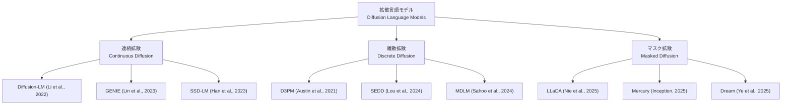

本記事は [arXiv:2508.10875 "A Survey on Diffusion Language Models"](https://arxiv.org/abs/2508.10875) の解説記事です。

## 論文概要（Abstract）

本サーベイ論文は、VILA Lab（Georgia Tech）のチームが2025年8月に発表した拡散言語モデル（Diffusion Language Model, DLM）の包括的な調査である。著者らは、テキスト生成に拡散モデルを適用する研究を体系的に分類し、連続拡散・離散拡散・マスク拡散の3つの主要アプローチを整理している。さらに、ARモデルとの性能比較、推論効率化の手法、応用分野ごとの採用状況を網羅的にレビューし、今後の研究方向として適応的並列デコーディング、長文生成、マルチモーダル統合などを提示している。

この記事は [Zenn記事: 拡散言語モデル2026年動向：Mercury・LLaDA・MoE統合の実装と展望](https://zenn.dev/0h_n0/articles/82a9ebe3d96a89) の深掘りです。

## 情報源

- **arXiv ID**: 2508.10875
- **URL**: [https://arxiv.org/abs/2508.10875](https://arxiv.org/abs/2508.10875)
- **著者**: VILA Lab, Georgia Tech
- **発表年**: 2025年8月
- **分野**: cs.CL, cs.LG

## 背景と動機（Background & Motivation）

拡散モデルは画像生成（Stable Diffusion, DALL-E 3）、動画生成（Sora）、音声合成などの連続データ生成で大きな成功を収めてきた。しかし、テキストは離散トークンで構成されるため、連続空間で定義された拡散プロセスの直接適用が困難であった。

2022年以降、この課題に対する多様なアプローチが提案されてきた。テキストを連続埋め込み空間にマッピングする方法（連続拡散）、離散空間で直接拡散を定義する方法（離散拡散）、マスキングを拡散プロセスとして解釈する方法（マスク拡散）など、アプローチが多岐にわたるため、研究の全体像を把握することが困難になっていた。

著者らは、2022年から2025年にかけての拡散言語モデル研究を体系的に分類・整理し、各アプローチの理論的基盤、実装上の課題、ベンチマーク結果を横断的に比較するサーベイの必要性を認識し、本論文を執筆した。

## 主要な貢献（Key Contributions）

- **貢献1**: 拡散言語モデルを「連続拡散」「離散拡散」「マスク拡散」の3カテゴリに体系的に分類し、各アプローチの理論的関係を明らかにした
- **貢献2**: 2022〜2025年の主要モデル（D3PM, SEDD, MDLM, LLaDA, Mercury等）を統一的なフレームワークで比較分析した
- **貢献3**: 今後の研究方向として、適応的並列デコーディング、長文生成、マルチモーダル統合、推論インフラ整備を具体的に提示した

## 技術的詳細（Technical Details）

### 拡散言語モデルの3分類

著者らは、拡散言語モデルを前方過程（ノイズ付加方法）に基づいて3つのカテゴリに分類している。

#### 1. 連続拡散（Continuous Diffusion）

テキストトークンを連続埋め込み空間にマッピングし、ガウスノイズを付加する標準的な拡散プロセスを適用する。

**前方過程**:

$$
q(z_t \mid z_0) = \mathcal{N}(z_t; \sqrt{\bar{\alpha}_t} z_0, (1 - \bar{\alpha}_t) \mathbf{I})
$$

ここで、$z_0 = \text{Embed}(x_0)$ はテキストの連続埋め込みである。

**利点**: 画像拡散モデルの理論・実装をほぼそのまま転用可能
**課題**: 埋め込み空間からの離散トークンへの復元（rounding）でエラーが蓄積する

**代表的モデル**: Diffusion-LM（Li et al., 2022）、GENIE（Lin et al., 2023）

#### 2. 離散拡散（Discrete Diffusion）

トークン空間で直接遷移行列を定義し、離散的なノイズ付加を行う。

**前方過程**:

$$
q(x_t \mid x_{t-1}) = \text{Cat}(x_t; \mathbf{Q}_t x_{t-1})
$$

ここで、$\mathbf{Q}_t \in \mathbb{R}^{V \times V}$ は時刻 $t$ における遷移行列、$V$ は語彙サイズである。

**遷移行列の設計**:
- **一様遷移**: $\mathbf{Q}_t = (1-\beta_t)\mathbf{I} + \beta_t/V \cdot \mathbf{1}\mathbf{1}^T$（全トークンへの一様遷移）
- **吸収遷移**: マスクトークンへの遷移のみ許容（マスク拡散の一般化）

**代表的モデル**: D3PM（Austin et al., 2021）、SEDD（Lou et al., 2024）

#### 3. マスク拡散（Masked Diffusion）

離散拡散の特殊ケースとして、トークンをマスクトークン $[M]$ に置換する操作のみを前方過程とする。

**前方過程**:

$$
q(x_t^i \mid x_0^i) = \begin{cases} [M] & \text{確率 } t \\ x_0^i & \text{確率 } 1-t \end{cases}
$$

**利点**: 実装が単純、BERT のマスク言語モデル（MLM）と密接に関連、スケーリングの実績がある（LLaDA 8B, LLaDA 2.0 100B）
**課題**: 遷移がマスク→元トークンの一方向のみであり、表現力が制限される

**代表的モデル**: MDLM（Sahoo et al., 2024）、LLaDA（Nie et al., 2025）、Mercury（Inception Labs, 2025）

### 3アプローチの理論的関係

著者らは、マスク拡散が離散拡散の特殊ケースであり、離散拡散がある条件下で連続拡散の離散化と見なせることを示している。

$$
\text{連続拡散} \xrightarrow{\text{離散化}} \text{離散拡散} \xrightarrow{\text{吸収遷移}} \text{マスク拡散}
$$

この関係は、マスク拡散の理論的な正当性を裏付けるとともに、より一般的な遷移行列を用いた離散拡散が将来的に有望であることを示唆している。

### 推論効率化の手法

著者らは、拡散言語モデルの推論効率化について以下の手法を分類している：

| 手法 | 概要 | 代表例 |
|------|------|--------|
| **Adaptive Step Scheduling** | 入力の複雑度に応じてステップ数を動的調整 | Mercury |
| **Confidence-based Unmasking** | 信頼度の高いトークンを優先的にアンマスク | LLaDA 2.0-CAP |
| **Semi-autoregressive** | ブロック単位でAR、ブロック内で拡散 | Block Diffusion |
| **Knowledge Distillation** | 多ステップモデルを少ステップモデルに蒸留 | Progressive Distillation |
| **Adaptive Parallel Decoding** | トークン間の依存関係を分析し独立トークンのみ並列化 | NeurIPS 2025 Oral |

**適応的並列デコーディング**（Adaptive Parallel Decoding）は、サーベイで特に有望とされている手法である。マスクトークン間の依存関係をグラフとして分析し、独立なトークン群のみを並列に生成する。これにより、品質を犠牲にせずに推論速度を向上させることが可能であると著者らは述べている。

### 応用分野別の分析

著者らは、拡散言語モデルの応用分野を以下のように整理している：

**テキスト生成（汎用）**:
- LLaDA 8B: in-context learningでLLaMA3 8Bと同等
- Mercury 2: 推論機能付きdLLM、1,009 tok/s
- 長文生成は課題として残存

**コード生成**:
- LLaDA 2.0-flash: HumanEval 94.51%
- Mercury Coder: Copilot Arena品質2位
- 双方向コンテキストがコードの構造的依存関係のモデル化に有利

**科学分野**:
- タンパク質設計: DiMA（ICML 2025）、RFdiffusion3
- 分子生成: 離散拡散ベースの分子設計
- 構造予測: 拡散モデルによる3D構造生成

**制御可能なテキスト生成**:
- Classifier-guided generation
- 拡散モデルの反復的改善プロセスが制約適用に適している

### ARモデルとDLMの比較分析

著者らは、ARモデルと拡散言語モデルの本質的な違いを以下のように整理している：

| 特性 | AR モデル | 拡散言語モデル |
|------|----------|--------------|
| 生成方向 | 左→右（一方向） | 全方向（双方向） |
| 理論基盤 | 自己回帰分解 $p(x) = \prod p(x_i \mid x_{<i})$ | 拡散過程のELBO |
| 推論ステップ | $L$（シーケンス長） | $T$（固定、$T \ll L$ 可能） |
| 並列性 | 低（逐次生成） | 高（各ステップで全位置処理） |
| KVキャッシュ | 利用可能 | 直接適用不可 |
| 生成の柔軟性 | 限定的（左→右固定） | 高い（任意の順序で確定可能） |
| エコシステム | 成熟（vLLM, TGI等） | 発展途上（dLLM等） |
| 反転の呪い | 影響を受ける | 影響を受けにくい |

**重要な指摘**: 著者らは、ARモデルの優位性の多くがアーキテクチャ自体ではなく、推論インフラ（KVキャッシュ、FlashAttention、PagedAttention、Speculative Decoding等）の最適化によるものであると分析している。拡散モデル向けの同等の推論最適化が開発されれば、速度面でのギャップはさらに縮小すると著者らは予想している。

## 実装のポイント（Implementation）

**フレームワークの選択**: サーベイで言及されている拡散言語モデルの実装フレームワークは以下の通り：
- **dLLM** ([GitHub: ZHZisZZ/dllm](https://github.com/ZHZisZZ/dllm)): LLaDA、MDLMなど複数の拡散モデルを統一インターフェースで推論できるOSSフレームワーク
- **HuggingFace Transformers**: LLaDAの公式実装が対応
- **MegaBlocks / DeepSpeed MoE**: MoE統合時のExpert Parallelism向け

**実験の再現**: サーベイ論文自体は実験を含まないが、著者らは各論文の公開コードとベンチマーク結果を体系的にまとめている。再現性の観点では、LLaDA（Apache 2.0、コード・重み公開）が最も再現しやすく、Mercury（商用、重み非公開）が最も再現困難である。

**評価指標の注意点**: ARモデルとDLMでは適切な評価指標が異なる場合がある。著者らは、Perplexityはベースの確率モデルが異なるため直接比較が困難であり、タスク固有のベンチマーク（HumanEval、MMLU等）での比較が推奨されると述べている。

## 実験結果（Results）

サーベイ論文であるため独自の実験結果はないが、著者らは以下の横断的な比較を提示している（各論文の報告値に基づく）：

**拡散言語モデルのスケーリング推移**:

| モデル | 年 | パラメータ | 活性化パラメータ | HumanEval | 方式 |
|--------|-----|----------|----------------|-----------|------|
| Diffusion-LM | 2022 | ~100M | ~100M | - | 連続 |
| MDLM | 2024 | ~1B | ~1B | - | マスク |
| LLaDA | 2025.2 | 8B | 8B | 26.2% | マスク |
| Mercury Coder | 2025.6 | 非公開 | 非公開 | ~88% | マスク |
| LLaDA-MoE | 2025.9 | 7B | 1.4B | - | マスク+MoE |
| LLaDA 2.0 | 2025.12 | 100B | 6.1B | 94.51% | マスク+MoE |

著者らは、2022年の100Mスケールから2025年末の100Bスケールまで、約3年で1000倍のスケーリングが達成されたと指摘している。特に2025年はLLaDA、Mercury、LLaDA-MoE、LLaDA 2.0と複数のモデルが発表され、拡散言語モデルの研究が急加速した年であった。

**推論速度の比較**（各論文の報告値）:

| モデル | 推論速度 (tok/s) | GPU | 備考 |
|--------|-----------------|-----|------|
| Mercury Coder Mini | 1,109 | H100 | 初代Mercury |
| Mercury 2 | ~1,009 | Blackwell | 推論機能付き |
| LLaDA 2.0-flash-CAP | 535 | 不明 | CAP付き |
| 標準ARモデル | 50-100 | H100 | 一般的な推論速度 |

## 実運用への応用（Practical Applications）

**研究者向けのロードマップ**: 著者らは、拡散言語モデルの研究に参入する研究者向けに以下のステップを推奨している：
1. dLLMフレームワークでLLaDA/MDLMの推論を試す
2. 自分の専門分野（コード生成、タンパク質設計等）でARモデルとの比較実験を行う
3. 推論効率化（適応的ステップ数、並列デコーディング）の改善に取り組む

**実務者向けの示唆**: 2026年3月時点では、プロダクション利用可能な拡散言語モデルはMercury API（商用）が唯一の選択肢である。OSSモデル（LLaDA系列）は研究・実験用途に適しているが、推論インフラの未成熟さから本番環境での利用にはカスタム実装が必要である。

**制約と注意点**: サーベイ論文の性質上、各モデルの報告値を横断的に比較しているが、実験条件（GPU、バッチサイズ、評価設定）が統一されていないため、直接的な数値比較には注意が必要である。著者らもこの点を論文中で言及している。

## 関連研究（Related Work）

- **拡散モデルの基礎理論**: DDPM（Ho et al., 2020）、Score Matching（Song & Ermon, 2019）が拡散モデルの理論的基盤。DLMはこれらの理論を離散トークンに拡張している
- **ARモデルの推論最適化**: Speculative Decoding、Medusa、Eagle等。DLMの並列デコーディングと目的は同じだが、アプローチが根本的に異なる
- **BERT / MLM**: マスク言語モデル（Devlin et al., 2019）はマスク拡散の思想的前身。ただしBERTは判別モデルであり、生成モデルとしてのDLMとは位置づけが異なる
- **画像拡散モデルのサーベイ**: Yang et al. (2023) "Diffusion Models: A Comprehensive Survey of Methods and Applications" が画像領域の包括的サーベイ。本論文は言語領域に特化した初の包括的サーベイ

## まとめと今後の展望

本サーベイ論文は、拡散言語モデルの研究を体系的に分類・整理し、3つの主要アプローチ（連続・離散・マスク拡散）の理論的関係を明らかにした。2022年から2025年にかけて、パラメータ規模は100Mから100Bへと1000倍に成長し、品質面でもARモデルと同等レベルに到達しつつある。

著者らが挙げる今後の研究方向は以下の通りである：

1. **適応的並列デコーディング**: トークン間の依存関係を分析し、独立トークンのみを並列生成。品質を維持しつつ推論速度を向上
2. **長文生成**: 現在のDLMは短〜中程度のテキストが得意だが、長文（10K+トークン）生成では品質低下が課題
3. **マルチモーダル統合**: LLaDA-Vのようなビジョン+拡散言語モデルの発展。画像とテキストの統合的な拡散プロセス
4. **推論インフラの整備**: KVキャッシュに相当する拡散モデル専用のキャッシュ機構、FlashAttentionの双方向版最適化
5. **ARモデルとのハイブリッド**: HART（Hybrid Autoregressive Transformer）のように、ARと拡散を組み合わせるアプローチ

拡散言語モデルの分野は急速に発展しており、本サーベイは2025年8月時点のスナップショットである。2026年以降もLLaDA 2.1のToken Editing、Mercury 2の推論機能拡張など新しい研究が続いており、定期的な更新が必要な領域である。

## 参考文献

- **arXiv**: [https://arxiv.org/abs/2508.10875](https://arxiv.org/abs/2508.10875)
- **Related papers**:
  - LLaDA: [arXiv:2502.09992](https://arxiv.org/abs/2502.09992)
  - Mercury: [arXiv:2506.17298](https://arxiv.org/abs/2506.17298)
  - MDLM: [arXiv:2406.07524](https://arxiv.org/abs/2406.07524)
  - SEDD: [arXiv:2310.16834](https://arxiv.org/abs/2310.16834)
  - D3PM: [arXiv:2107.03006](https://arxiv.org/abs/2107.03006)
- **dLLM Framework**: [https://github.com/ZHZisZZ/dllm](https://github.com/ZHZisZZ/dllm)
- **Related Zenn article**: [https://zenn.dev/0h_n0/articles/82a9ebe3d96a89](https://zenn.dev/0h_n0/articles/82a9ebe3d96a89)
