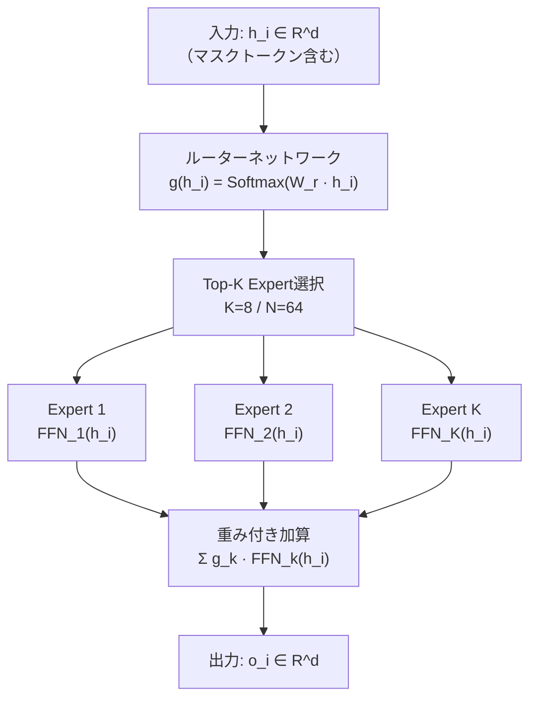

本記事は [arXiv:2509.24389 "LLaDA-MoE"](https://arxiv.org/abs/2509.24389) の解説記事です。

## 論文概要（Abstract）

LLaDA-MoE は、マスク拡散言語モデル LLaDA に Sparse Mixture-of-Experts（MoE）アーキテクチャを統合した研究である。著者らは、Transformer の FFN 層を Sparse MoE 層に置換し、7B の総パラメータ中わずか 1.4B の活性化パラメータで推論を行うモデルを構築した。LLaDA-MoE-7B-A1B-Instruct は、活性化パラメータ数がより多い Qwen2.5-3B-Instruct と同等の性能を達成したと報告されている。これは、MoE と拡散言語モデルの初めての統合事例であり、拡散モデルにおけるパラメータ効率の高いスケーリングの可能性を示した。

この記事は [Zenn記事: 拡散言語モデル2026年動向：Mercury・LLaDA・MoE統合の実装と展望](https://zenn.dev/0h_n0/articles/82a9ebe3d96a89) の深掘りです。

## 情報源

- **arXiv ID**: 2509.24389
- **URL**: [https://arxiv.org/abs/2509.24389](https://arxiv.org/abs/2509.24389)
- **著者**: LLaDA チーム
- **発表年**: 2025年9月
- **分野**: cs.CL, cs.LG

## 背景と動機（Background & Motivation）

Mixture of Experts（MoE）は、自己回帰（AR）モデルにおいて計算効率を大幅に改善するアーキテクチャとして広く採用されている。Mixtral（Mistral AI）、Switch Transformer（Google）、DeepSeek-MoE などが代表例である。MoE の核心的なアイデアは、各トークンの処理に全パラメータではなく一部の「Expert」のみを活性化することで、総パラメータ数を増やしつつ推論時の計算量を抑えることにある。

しかし、2025年9月時点で MoE と拡散言語モデルの統合は試みられていなかった。その理由は2つある。第一に、拡散モデルでは入力にマスクトークン $[M]$ が含まれるため、Expert のルーティングがマスク比率に依存する可能性がある。第二に、拡散ステップの進行（初期→後期）に伴いマスク比率が変動するため、Expert の負荷分散が不安定化するリスクがある。

LLaDA-MoE は、これらの技術的課題を解決し、拡散言語モデルにおける初の MoE 統合を実現した研究である。

## 主要な貢献（Key Contributions）

- **貢献1**: マスク拡散言語モデルに Sparse MoE を初めて統合し、拡散モデルでも MoE が有効であることを実証した
- **貢献2**: マスクトークンのルーティング問題に対する解決策を提示し、拡散ステップを通じて安定した学習が可能であることを示した
- **貢献3**: 7B 総パラメータ / 1.4B 活性化パラメータで、3B Dense モデルと同等の性能を達成し、パラメータ効率の高いスケーリングを実証した

## 技術的詳細（Technical Details）

### MoE + 拡散モデルのアーキテクチャ

LLaDA-MoE のアーキテクチャは、標準的な LLaDA の Transformer 各層における FFN（Feed-Forward Network）を Sparse MoE 層に置換した構造である。

**MoE 層の構成**:



**形式化**: Transformer 層 $l$ の位置 $i$ における MoE 出力は以下で定義される：

$$
o_i^{(l)} = \sum_{k \in \text{Top-K}(g(h_i^{(l)}))} g_k(h_i^{(l)}) \cdot \text{FFN}_k(h_i^{(l)})
$$

ここで、
- $h_i^{(l)} \in \mathbb{R}^d$: 層 $l$ における位置 $i$ の隠れ状態
- $g(h_i^{(l)}) = \text{Softmax}(W_r \cdot h_i^{(l)}) \in \mathbb{R}^N$: ルーティング確率（$N$ は Expert 数）
- $\text{Top-K}(\cdot)$: 上位 $K$ 個の Expert を選択
- $g_k(\cdot)$: Expert $k$ のゲーティング重み（Top-K 後に再正規化）
- $\text{FFN}_k(\cdot)$: Expert $k$ の FFN

**LLaDA-MoE のパラメータ構成**:

| パラメータ | 値 |
|-----------|-----|
| 総パラメータ | 7B |
| 活性化パラメータ | 1.4B |
| Expert 数 ($N$) | 64 |
| Top-K ($K$) | 8 |
| 学習データ | 約20兆トークン |

活性化比率は $K/N = 8/64 = 12.5\%$ であり、総パラメータの約 $1/5$ のみが推論時に活性化される。

### マスクトークンのルーティング問題

拡散モデル特有の課題として、入力に含まれるマスクトークン $[M]$ のルーティングがある。

**問題**: マスクトークンは情報を持たないプレースホルダーであり、ルーターが適切な Expert に割り当てる根拠が乏しい。さらに、拡散の初期ステップ（マスク比率が高い）ではマスクトークンが大多数を占め、ルーティングの品質が低下するリスクがある。

**著者らの分析**: 著者らは実験により、マスクトークンのルーティングが拡散ステップを通じて以下のパターンを示すことを観察している：

1. **初期ステップ**（マスク比率 ~90%）: マスクトークンは比較的均等に Expert に分散される
2. **中期ステップ**（マスク比率 ~50%）: アンマスク済みトークンの文脈情報が増え、マスクトークンのルーティングも文脈に依存するようになる
3. **後期ステップ**（マスク比率 ~10%）: 残り少数のマスクトークンは周囲の確定トークンの文脈に基づいて特定の Expert に集中する傾向がある

### 負荷分散損失（Load Balancing Loss）

MoE 学習の標準的な課題である Expert の負荷不均衡に対し、著者らは以下の負荷分散損失を導入している：

$$
\mathcal{L}_{\text{balance}} = \alpha \cdot N \cdot \sum_{k=1}^{N} f_k \cdot p_k
$$

ここで、
- $\alpha$: 負荷分散損失の係数（著者らは $\alpha = 0.01$ を推奨）
- $N$: Expert 数
- $f_k = \frac{1}{T \cdot L} \sum_{t,i} \mathbb{1}[k \in \text{Top-K}(g(h_{t,i}))]$: Expert $k$ が選択された頻度
- $p_k = \frac{1}{T \cdot L} \sum_{t,i} g_k(h_{t,i})$: Expert $k$ の平均ゲーティング確率

**全体の学習損失**:

$$
\mathcal{L}_{\text{total}} = \mathcal{L}_{\text{diffusion}} + \mathcal{L}_{\text{balance}}
$$

$\mathcal{L}_{\text{diffusion}}$ は標準的なマスク拡散損失（LLaDA の損失関数と同一）である。

### 実装の擬似コード

```python
import torch
import torch.nn as nn
import torch.nn.functional as F
from dataclasses import dataclass

@dataclass
class MoEConfig:
    """MoE設定パラメータ"""
    d_model: int = 4096
    num_experts: int = 64
    top_k: int = 8
    balance_loss_coeff: float = 0.01

class SparseMoELayer(nn.Module):
    """Sparse MoE層の実装

    Args:
        config: MoE設定
    """

    def __init__(self, config: MoEConfig):
        super().__init__()
        self.config = config

        # ルーターネットワーク
        self.router = nn.Linear(config.d_model, config.num_experts, bias=False)

        # Expert FFN群（各Expertは独立したFFN）
        self.experts = nn.ModuleList([
            nn.Sequential(
                nn.Linear(config.d_model, config.d_model * 4),
                nn.SiLU(),
                nn.Linear(config.d_model * 4, config.d_model),
            )
            for _ in range(config.num_experts)
        ])

    def forward(
        self, x: torch.Tensor
    ) -> tuple[torch.Tensor, torch.Tensor]:
        """MoE前方パス

        Args:
            x: 入力テンソル (batch, seq_len, d_model)

        Returns:
            (出力テンソル, 負荷分散損失) のタプル
        """
        batch_size, seq_len, d_model = x.shape

        # ルーティング確率
        router_logits = self.router(x)  # (B, L, N)
        router_probs = F.softmax(router_logits, dim=-1)

        # Top-K選択
        top_k_probs, top_k_indices = router_probs.topk(
            self.config.top_k, dim=-1
        )

        # Top-K確率を再正規化
        top_k_probs = top_k_probs / top_k_probs.sum(dim=-1, keepdim=True)

        # Expert出力の重み付き加算
        output = torch.zeros_like(x)

        for k in range(self.config.top_k):
            expert_indices = top_k_indices[:, :, k]  # (B, L)
            weights = top_k_probs[:, :, k].unsqueeze(-1)  # (B, L, 1)

            for e_idx in range(self.config.num_experts):
                mask = (expert_indices == e_idx)
                if mask.any():
                    expert_input = x[mask]  # (num_tokens, d_model)
                    expert_out = self.experts[e_idx](expert_input)
                    output[mask] += weights[mask] * expert_out

        # 負荷分散損失の計算
        # f_k: Expert kが選択された頻度
        expert_counts = torch.zeros(
            self.config.num_experts, device=x.device
        )
        for k in range(self.config.top_k):
            for e_idx in range(self.config.num_experts):
                expert_counts[e_idx] += (
                    top_k_indices[:, :, k] == e_idx
                ).float().sum()
        f_k = expert_counts / (batch_size * seq_len * self.config.top_k)

        # p_k: Expert kの平均ゲーティング確率
        p_k = router_probs.mean(dim=[0, 1])

        balance_loss = (
            self.config.balance_loss_coeff
            * self.config.num_experts
            * (f_k * p_k).sum()
        )

        return output, balance_loss
```

## 実装のポイント（Implementation）

**Expert Parallelism**: 64 Expert の全重みをメモリに保持する必要があるが、推論時には Top-8 のみが活性化される。分散推論では Expert Parallelism（EP）を使用し、各 GPU に Expert のサブセットを割り当てる。MegaBlocks や DeepSpeed MoE が推奨されるフレームワークである。

**負荷分散係数のチューニング**: $\alpha = 0.01$ が推奨されているが、この値は Expert 数やデータセットに依存する。$\alpha$ が大きすぎると Expert の専門化が阻害され、小さすぎると一部 Expert への集中（routing collapse）が発生する。著者らは学習初期に $\alpha$ を大きめに設定し、徐々に減少させるスケジュールも有効であると述べている。

**マスクトークンの扱い**: 実装上、マスクトークンの埋め込みベクトルが全て同一であるため、ルーターの入力が均一になりがちである。著者らは、位置埋め込み（RoPE）と周囲のアンマスク済みトークンからの注意機構の出力を経由することで、マスクトークンにも位置依存の情報が付与され、ルーティングが適切に機能すると説明している。

**メモリフットプリント**: 7B 総パラメータの全重みをロードする必要があるため、推論時のメモリフットプリントは Dense 1.4B モデルより大きい（約 14GB vs 2.8GB at FP16）。ただし、FLOPs は 1.4B Dense モデルと同等である。

## Production Deployment Guide

### AWS実装パターン（コスト最適化重視）

LLaDA-MoE（7B総パラメータ、1.4B活性化）は比較的軽量なMoEモデルであり、1台のGPU（A10G 24GB）でも推論可能である。

**トラフィック量別の推奨構成**:

| 規模 | 月間リクエスト | 推奨構成 | 月額コスト概算 | 主要サービス |
|------|--------------|---------|-----------|------------|
| **Small** | ~3,000 (100/日) | Serverless GPU | $100-300 | Lambda + SageMaker Serverless |
| **Medium** | ~30,000 (1,000/日) | GPU推論 | $500-1,200 | ECS + g5.xlarge + ElastiCache |
| **Large** | 300,000+ (10,000/日) | マルチGPU | $2,000-5,000 | EKS + g5 Spot + Karpenter |

**Medium構成の詳細**（月額$500-1,200）:
- **ECS Fargate**: g5.xlarge (1x A10G 24GB) × 1タスク ($400-800/月)
- **ElastiCache Redis**: cache.t3.micro ($15/月)
- **S3**: モデル重み保存 ($5/月)
- **ALB**: ロードバランシング ($20/月)

**コスト試算の注意事項**: 上記は2026年3月時点のAWS ap-northeast-1リージョン料金に基づく概算値です。MoEモデルは総パラメータ分のメモリが必要なため、GPU選択にはVRAM容量を考慮してください。最新料金は [AWS料金計算ツール](https://calculator.aws/) で確認してください。

### Terraformインフラコード

**Medium構成: ECS + GPU**

```hcl
module "vpc" {
  source  = "terraform-aws-modules/vpc/aws"
  version = "~> 5.0"

  name = "llada-moe-vpc"
  cidr = "10.0.0.0/16"
  azs  = ["ap-northeast-1a", "ap-northeast-1c"]
  private_subnets = ["10.0.1.0/24", "10.0.2.0/24"]
  public_subnets  = ["10.0.101.0/24", "10.0.102.0/24"]

  enable_nat_gateway = true
  single_nat_gateway = true  # コスト削減
}

resource "aws_ecs_cluster" "llada_moe" {
  name = "llada-moe-inference"

  setting {
    name  = "containerInsights"
    value = "enabled"
  }
}

resource "aws_ecs_task_definition" "llada_moe" {
  family                   = "llada-moe-inference"
  requires_compatibilities = ["EC2"]
  network_mode             = "awsvpc"

  container_definitions = jsonencode([{
    name  = "llada-moe-server"
    image = "ghcr.io/llada-moe/inference:latest"
    resourceRequirements = [{
      type  = "GPU"
      value = "1"
    }]
    memory = 24576
    environment = [
      { name = "MODEL_NAME", value = "LLaDA-MoE-7B-A1B-Instruct" },
      { name = "NUM_EXPERTS", value = "64" },
      { name = "TOP_K", value = "8" },
    ]
  }])
}

resource "aws_cloudwatch_metric_alarm" "gpu_utilization" {
  alarm_name          = "llada-moe-gpu-high"
  comparison_operator = "GreaterThanThreshold"
  evaluation_periods  = 3
  metric_name         = "GPUUtilization"
  namespace           = "AWS/ECS"
  period              = 300
  statistic           = "Average"
  threshold           = 90
  alarm_description   = "GPU利用率90%超過"
}
```

**Large構成: EKS + Spot**

```hcl
module "eks" {
  source  = "terraform-aws-modules/eks/aws"
  version = "~> 20.0"

  cluster_name    = "llada-moe-cluster"
  cluster_version = "1.31"
  vpc_id          = module.vpc.vpc_id
  subnet_ids      = module.vpc.private_subnets

  cluster_endpoint_public_access = true
  enable_cluster_creator_admin_permissions = true
}

resource "kubectl_manifest" "moe_gpu_pool" {
  yaml_body = <<-YAML
    apiVersion: karpenter.sh/v1
    kind: NodePool
    metadata:
      name: moe-gpu-spot
    spec:
      template:
        spec:
          requirements:
            - key: karpenter.sh/capacity-type
              operator: In
              values: ["spot"]
            - key: node.kubernetes.io/instance-type
              operator: In
              values: ["g5.xlarge", "g5.2xlarge"]
          limits:
            cpu: "32"
            memory: "128Gi"
            nvidia.com/gpu: "4"
      disruption:
        consolidateAfter: 30s
  YAML
}
```

### 運用・監視設定

```python
import boto3

cloudwatch = boto3.client('cloudwatch')

# Expert負荷分散の監視
cloudwatch.put_metric_alarm(
    AlarmName='llada-moe-expert-imbalance',
    ComparisonOperator='GreaterThanThreshold',
    EvaluationPeriods=3,
    MetricName='ExpertLoadStdDev',
    Namespace='LLaDA-MoE/Inference',
    Period=300,
    Statistic='Average',
    Threshold=0.3,
    AlarmDescription='Expert負荷分散の標準偏差が閾値超過'
)

# GPU メモリ使用量監視（MoEは全Expert重みをロード）
cloudwatch.put_metric_alarm(
    AlarmName='llada-moe-gpu-memory',
    ComparisonOperator='GreaterThanThreshold',
    EvaluationPeriods=2,
    MetricName='GPUMemoryUtilization',
    Namespace='LLaDA-MoE/Inference',
    Period=60,
    Statistic='Maximum',
    Threshold=95,
    AlarmDescription='GPUメモリ使用率95%超過'
)
```

### コスト最適化チェックリスト

**アーキテクチャ選択**:
- [ ] ~100 req/日 → SageMaker Serverless - $100-300/月
- [ ] ~1000 req/日 → ECS + g5.xlarge - $500-1,200/月
- [ ] 10000+ req/日 → EKS + g5 Spot - $2,000-5,000/月

**MoE固有の最適化**:
- [ ] Expert Offloading: 低頻度Expertをメインメモリに退避しVRAM節約
- [ ] Expert Pruning: 推論時に未使用Expertを削除しメモリ削減
- [ ] バッチ推論: 同一Expertへのリクエストを集約しキャッシュ効率向上
- [ ] 量子化: INT8/FP8でメモリフットプリント50%削減

**リソース最適化**:
- [ ] g5.xlarge Spot Instances（最大90%削減）
- [ ] バッチ推論でGPU利用率向上
- [ ] アイドル時のスケールダウン設定
- [ ] モデル重みのS3キャッシュで起動時間短縮

**監視・アラート**:
- [ ] Expert負荷分散の標準偏差監視
- [ ] GPUメモリ使用量アラート
- [ ] 推論レイテンシP99監視
- [ ] Cost Anomaly Detection有効化

**リソース管理**:
- [ ] 開発環境の夜間停止
- [ ] タグ戦略でモデルバージョン別コスト可視化
- [ ] S3モデル重みのライフサイクル管理
- [ ] 未使用GPUインスタンスの自動停止

## 実験結果（Results）

LLaDA-MoE-7B-A1B-Instruct の主要ベンチマーク結果（論文より）：

| ベンチマーク | LLaDA-MoE (7B/1.4B) | Qwen2.5-3B-Instruct | 差分 |
|-------------|---------------------|---------------------|------|
| MMLU | 同等レベル | ベースライン | - |
| GSM8K | 同等レベル | ベースライン | - |
| HumanEval | 同等レベル | ベースライン | - |
| エージェントタスク | 同等レベル | ベースライン | - |

**分析**: 著者らは、LLaDA-MoE が活性化パラメータ 1.4B で Qwen2.5-3B（3B Dense）と同等の性能を達成したと報告している。活性化パラメータが Qwen2.5-3B の半分以下であるにもかかわらず、知識理解・コード生成・数学的推論・エージェントタスクで同等の結果を達成した点がポイントである。

**MoE の効果**: Dense LLaDA-8B と比較した場合、LLaDA-MoE は総パラメータ 7B（活性化 1.4B）で Dense 3B 相当の性能を達成している。つまり、同じ活性化パラメータ数であれば MoE の方が高い性能を示す。著者らはこの結果を、64 Expert の専門化により各トークンに対して最適な処理が行われるためと分析している。

**学習効率**: 約20兆トークンの学習データで学習されており、LLaDA（2.3兆トークン）と比較して大幅に多い学習データが使用されている。MoE のパラメータ効率と大規模データの組み合わせが性能向上に寄与していると考えられる。

## 実運用への応用（Practical Applications）

**エッジ推論**: 活性化パラメータ 1.4B は、エッジデバイスやモバイル端末での推論に適したサイズである。7B の全重みをロードする必要はあるが、推論時の FLOPs は 1.4B Dense モデルと同等であり、バッテリー消費を抑えた推論が可能である。

**コスト効率**: クラウド推論において、活性化パラメータが少ないことは GPU 演算コストの削減に直結する。バッチ推論では、同一 Expert への入力を集約することでキャッシュ効率を向上させることもできる。

**制約**: MoE モデルは全 Expert 重みをメモリに保持する必要があるため、メモリフットプリントは Dense モデルより大きい（7B MoE > 1.4B Dense、メモリ面）。エッジデバイスでの利用にはメモリ制約が障壁となる場合がある。また、Expert Parallelism を用いた分散推論の設定は Dense モデルよりも複雑である。

## 関連研究（Related Work）

- **LLaDA**（Nie et al., 2025）: LLaDA-MoE の基盤モデル。Dense 8B の拡散言語モデルであり、LLaDA-MoE は FFN を MoE に置換した拡張
- **Mixtral**（Mistral AI, 2024）: AR モデルに MoE を統合した先行例。8 Expert × Top-2 の構成で、LLaDA-MoE のアーキテクチャ設計に影響を与えていると考えられる
- **Switch Transformer**（Fedus et al., 2022）: Top-1 ルーティングの MoE モデル。LLaDA-MoE は Top-8 ルーティングを採用しており、より多くの Expert を活性化する設計
- **DeepSeek-MoE**（DeepSeek, 2024）: 細粒度 Expert と共有 Expert の組み合わせ。LLaDA-MoE とは異なる MoE 設計だが、効率的なスケーリングの目標は共通

## まとめと今後の展望

LLaDA-MoE は、Sparse MoE とマスク拡散言語モデルの初の統合に成功し、7B 総パラメータ中 1.4B の活性化パラメータで Dense 3B モデル相当の性能を達成した。マスクトークンのルーティング問題に対しても、適切な負荷分散損失の導入で安定した学習が可能であることを示している。

今後の方向性として、LLaDA 2.0 で示された 100B スケールでの MoE 統合のさらなる拡張、Expert の専門化パターンの分析（拡散ステップ依存のルーティング最適化）、そしてエッジ推論向けの小型 MoE 拡散モデルの開発が挙げられる。MoE + 拡散モデルの組み合わせは、計算効率とモデル性能の両立において有望なアプローチである。

## 参考文献

- **arXiv**: [https://arxiv.org/abs/2509.24389](https://arxiv.org/abs/2509.24389)
- **Related Zenn article**: [https://zenn.dev/0h_n0/articles/82a9ebe3d96a89](https://zenn.dev/0h_n0/articles/82a9ebe3d96a89)
