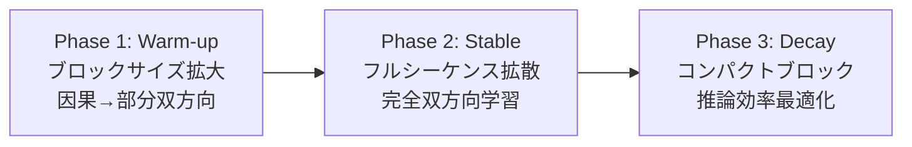

本記事は [arXiv:2512.15745 "LLaDA2.0: Scaling Up Diffusion Language Models to 100B"](https://arxiv.org/abs/2512.15745) の解説記事です。

## 論文概要（Abstract）

LLaDA 2.0は、Ant GroupのInclusionAIチームが2025年12月に発表した拡散言語モデルである。著者らは、事前学習済みの自己回帰（AR）モデルをマスク拡散モデルに変換する手法を提案し、100Bパラメータ（MoE構成）までのスケーリングに成功した。LLaDA 2.0-flash（100B総パラメータ、6.1B活性化パラメータ）は、コーディングベンチマークでHumanEval 94.51%を達成し、同規模のARモデル（Qwen3-30B-A3B-Instruct: 93.29%）を上回るスコアを報告している。

この記事は [Zenn記事: 拡散言語モデル2026年動向：Mercury・LLaDA・MoE統合の実装と展望](https://zenn.dev/0h_n0/articles/82a9ebe3d96a89) の深掘りです。

## 情報源

- **arXiv ID**: 2512.15745
- **URL**: [https://arxiv.org/abs/2512.15745](https://arxiv.org/abs/2512.15745)
- **著者**: InclusionAI チーム（Ant Group）
- **発表年**: 2025年12月
- **分野**: cs.CL, cs.LG
- **コード**: [https://github.com/inclusionAI/LLaDA2.X](https://github.com/inclusionAI/LLaDA2.X)

## 背景と動機（Background & Motivation）

初代LLaDA（arXiv:2502.09992）は8Bパラメータのマスク拡散言語モデルをスクラッチから学習し、拡散モデルでもLLMの中核能力が獲得できることを実証した。しかし、8Bスケールでは商用ARモデル（GPT-4o、Claude 3.5等）との性能差が大きく、実用的な競争力には疑問が残っていた。

一方、スクラッチ学習は膨大なGPUリソースを必要とする。初代LLaDAの8B学習にはH800 GPU 13万時間を要しており、100Bスケールへの単純な拡大は非現実的である。著者らは、この課題を**事前学習済みARモデルからの知識継承（Knowledge Inheritance）**で解決するアプローチを提案した。すでに学習済みのAR重みを拡散モデルの初期値として利用し、比較的少量の追加学習で拡散モデルに変換する戦略である。

さらに、LLaDA 2.0ではMoE（Mixture of Experts）アーキテクチャを採用することで、総パラメータ100Bでありながら推論時の活性化パラメータを6.1Bに抑え、計算効率と性能の両立を図っている。

## 主要な貢献（Key Contributions）

- **貢献1**: 事前学習済みARモデルから拡散モデルへの変換手法を提案し、スクラッチ学習の100倍以上のコスト削減を実現した
- **貢献2**: 3フェーズのブロックレベルWSD（Warm-up, Stable, Decay）学習スキームにより、ARモデルの知識を効率的に拡散モデルに移転する手法を確立した
- **貢献3**: MoEとの統合により100Bパラメータにスケーリングし、コーディングベンチマークでARモデルと同等以上の性能を達成した

## 技術的詳細（Technical Details）

### ARモデルから拡散モデルへの変換

LLaDA 2.0の核心的な技術は、ARモデルの知識をマスク拡散モデルに移転する変換手法である。

**問題設定**: 事前学習済みARモデル $f_{\phi}^{AR}$（因果マスク使用、一方向注意）を、マスク拡散モデル $f_{\theta}^{DM}$（双方向注意）に変換したい。

**変換の難しさ**: ARモデルは因果マスクにより「過去のトークンのみを参照」する構造であり、拡散モデルは「全トークンを参照」する構造である。このため、AR重みをそのまま拡散モデルに流用すると、未知の双方向依存関係を正しく学習できない。

**解決策: ブロック拡散（Block Diffusion）による段階的変換**

著者らは、ARモデルの因果的な知識構造を段階的に双方向構造に変換するため、ブロック拡散を導入した。テキストを固定サイズのブロックに分割し、ブロック内ではマスク拡散を適用し、ブロック間では因果的な依存関係を保持する。

$$
\mathcal{L}_{\text{block}}(\theta) = -\mathbb{E}_{t, x_0} \left[ \sum_{b=1}^{B} \sum_{i \in \text{block}_b: x_t^i = [M]} \log p_\theta(x_0^i \mid x_t^{\leq b}) \right]
$$

ここで、
- $B$: ブロック数
- $\text{block}_b$: $b$番目のブロックに属するトークン集合
- $x_t^{\leq b}$: 第$b$ブロック以前の全トークン（因果的依存を保持）

### 3フェーズWSD学習スキーム

変換は3つのフェーズで段階的に行われる：



**Phase 1（Warm-up）**: ブロックサイズを小（例: 64トークン）から大（例: 512トークン）へ段階的に拡大する。初期は因果的な依存関係を多く保持し、徐々に双方向の文脈利用を増やす。学習率は線形にウォームアップする。

**Phase 2（Stable）**: ブロックサイズをシーケンス全体に拡大し、フルシーケンスのマスク拡散学習を行う。この段階で完全な双方向Transformerとして機能するよう学習される。

**Phase 3（Decay）**: 推論効率を最適化するため、ブロックサイズをコンパクトに戻す。学習率を余弦スケジュールで減衰させ、最終的なモデルを安定化させる。

### MoE統合アーキテクチャ

LLaDA 2.0-flashではMoEを採用し、各Transformer層のFFN部分をSparsely-gated MoE層に置換している。

**構成パラメータ**:
- 総パラメータ: 100B
- 活性化パラメータ: 6.1B（推論時）
- Expert数: 記載なし（推定64）
- Top-k: 記載なし（推定2-8）

```python
import torch
import torch.nn as nn

class MoEDiffusionLayer(nn.Module):
    """MoE拡散モデル層の概念的な実装

    Args:
        d_model: モデル次元
        num_experts: Expert数
        top_k: 各トークンで選択するExpert数
    """

    def __init__(self, d_model: int, num_experts: int = 64, top_k: int = 8):
        super().__init__()
        self.num_experts = num_experts
        self.top_k = top_k

        # ルーターネットワーク
        self.router = nn.Linear(d_model, num_experts, bias=False)

        # Expert FFN群
        self.experts = nn.ModuleList([
            nn.Sequential(
                nn.Linear(d_model, d_model * 4),
                nn.GELU(),
                nn.Linear(d_model * 4, d_model),
            )
            for _ in range(num_experts)
        ])

    def forward(self, x: torch.Tensor) -> torch.Tensor:
        """MoE前方パス

        Args:
            x: 入力テンソル (batch_size, seq_len, d_model)

        Returns:
            出力テンソル (batch_size, seq_len, d_model)
        """
        batch_size, seq_len, d_model = x.shape

        # ルーティング確率を計算
        router_logits = self.router(x)  # (B, L, num_experts)
        router_probs = torch.softmax(router_logits, dim=-1)

        # Top-k Expert を選択
        top_k_probs, top_k_indices = router_probs.topk(
            self.top_k, dim=-1
        )  # (B, L, top_k)

        # 正規化
        top_k_probs = top_k_probs / top_k_probs.sum(dim=-1, keepdim=True)

        # 各Expertの出力を重み付き加算
        output = torch.zeros_like(x)
        for k in range(self.top_k):
            expert_idx = top_k_indices[:, :, k]  # (B, L)
            weight = top_k_probs[:, :, k].unsqueeze(-1)  # (B, L, 1)

            for e_idx in range(self.num_experts):
                mask = (expert_idx == e_idx)
                if mask.any():
                    expert_input = x[mask]
                    expert_output = self.experts[e_idx](expert_input)
                    output[mask] += weight[mask] * expert_output

        return output
```

### LLaDA 2.0-flash-CAP（Confidence-Aware Parallel decoding）

LLaDA 2.0-flash-CAPは推論高速化のための手法であり、各拡散ステップで予測信頼度に基づいてアンマスクするトークン数を動的に決定する。信頼度の高いトークンを優先的にアンマスクし、低信頼度のトークンは後のステップに残すことで、不要な再計算を削減する。著者らはこの手法により535 tokens/secの推論速度を達成したと報告している。

## 実装のポイント（Implementation）

**ARモデルからの変換**: 実装上の重要な点として、因果マスクの除去だけでなく、注意機構の重み初期化戦略がある。著者らの手法ではAR重みをそのまま双方向Transformerの初期値として使用するが、因果マスクにより上三角部分が学習されていないため、Phase 1で徐々に双方向の依存関係を学習させる段階的アプローチが不可欠である。

**メモリ効率**: 100Bパラメータの全重みをGPU上に保持する必要があるが、MoEにより推論時の活性化パラメータは6.1Bに抑えられる。ただし、Expert Parallelismを用いたマルチGPU推論が前提となる。

**学習安定性**: ブロックサイズの変更時に学習が不安定化する場合がある。著者らは各フェーズ間で学習率をリセットし、短いウォームアップ期間を設けることで対処している。

## Production Deployment Guide

### AWS実装パターン（コスト最適化重視）

LLaDA 2.0-flash（100B総パラメータ、6.1B活性化）はMoE構成のため、全Expert重みをメモリに保持しつつ推論時には一部のみ活性化される。H200（141GB HBM3e）であれば1台でモデル全体を保持可能だが、複数GPUでのExpert Parallelismが推奨される。

**トラフィック量別の推奨構成**:

| 規模 | 月間リクエスト | 推奨構成 | 月額コスト概算 | 主要サービス |
|------|--------------|---------|-----------|------------|
| **Small** | ~3,000 (100/日) | API連携 | $100-300 | Lambda + 外部API + DynamoDB |
| **Medium** | ~30,000 (1,000/日) | GPU推論 | $2,000-4,000 | ECS + g5.12xlarge + ElastiCache |
| **Large** | 300,000+ (10,000/日) | マルチGPU | $8,000-15,000 | EKS + p4d/p5 + Karpenter |

**Small構成の詳細**（月額$100-300）:
- 100Bモデルの自前ホスティングはSmall規模では非効率。外部APIまたはBedrock Custom Modelインポートを推奨
- **Lambda**: リクエストルーティング ($20/月)
- **外部API費用**: トークン従量課金 ($80-200/月)
- **DynamoDB**: キャッシュ ($10/月)

**Large構成の詳細**（月額$8,000-15,000）:
- **EKS**: コントロールプレーン ($72/月)
- **EC2 Spot**: p4d.24xlarge (8x A100 80GB) × 1-2台 ($4,000-8,000/月、Spot利用時)
- **Expert Parallelism**: 8GPU間で64 Expertを分散配置
- **Karpenter**: 自動スケーリング

**コスト試算の注意事項**: 上記は2026年3月時点のAWS ap-northeast-1リージョン料金に基づく概算値です。100BモデルのGPU推論はコストが高く、バッチ推論やキャッシュ戦略によるコスト最適化が重要です。最新料金は [AWS料金計算ツール](https://calculator.aws/) で確認してください。

### Terraformインフラコード

**Small構成 (API連携): Lambda + DynamoDB**

```hcl
resource "aws_lambda_function" "llada2_proxy" {
  filename      = "lambda.zip"
  function_name = "llada2-api-proxy"
  role          = aws_iam_role.lambda_role.arn
  handler       = "index.handler"
  runtime       = "python3.12"
  timeout       = 300
  memory_size   = 512

  environment {
    variables = {
      CACHE_TABLE = aws_dynamodb_table.cache.name
      API_SECRET  = "{{resolve:secretsmanager:llada2-api-key}}"
    }
  }
}

resource "aws_dynamodb_table" "cache" {
  name         = "llada2-response-cache"
  billing_mode = "PAY_PER_REQUEST"
  hash_key     = "request_hash"

  attribute {
    name = "request_hash"
    type = "S"
  }

  ttl {
    attribute_name = "expire_at"
    enabled        = true
  }
}
```

**Large構成 (Container): EKS + Multi-GPU**

```hcl
module "eks" {
  source  = "terraform-aws-modules/eks/aws"
  version = "~> 20.0"

  cluster_name    = "llada2-inference"
  cluster_version = "1.31"
  vpc_id          = module.vpc.vpc_id
  subnet_ids      = module.vpc.private_subnets

  cluster_endpoint_public_access = true
  enable_cluster_creator_admin_permissions = true
}

resource "kubectl_manifest" "gpu_nodepool" {
  yaml_body = <<-YAML
    apiVersion: karpenter.sh/v1
    kind: NodePool
    metadata:
      name: llada2-gpu-pool
    spec:
      template:
        spec:
          requirements:
            - key: karpenter.sh/capacity-type
              operator: In
              values: ["spot", "on-demand"]
            - key: node.kubernetes.io/instance-type
              operator: In
              values: ["p4d.24xlarge", "p5.48xlarge"]
          limits:
            cpu: "192"
            memory: "1536Gi"
            nvidia.com/gpu: "16"
      disruption:
        consolidateAfter: 60s
  YAML
}

resource "aws_budgets_budget" "llada2_budget" {
  name         = "llada2-monthly"
  budget_type  = "COST"
  limit_amount = "15000"
  limit_unit   = "USD"
  time_unit    = "MONTHLY"

  notification {
    comparison_operator       = "GREATER_THAN"
    threshold                 = 80
    threshold_type            = "PERCENTAGE"
    notification_type         = "ACTUAL"
    subscriber_email_addresses = ["ops@example.com"]
  }
}
```

### 運用・監視設定

```python
import boto3

cloudwatch = boto3.client('cloudwatch')

# Expert利用率の監視
cloudwatch.put_metric_alarm(
    AlarmName='llada2-expert-imbalance',
    ComparisonOperator='GreaterThanThreshold',
    EvaluationPeriods=3,
    MetricName='ExpertLoadImbalance',
    Namespace='LLaDA2/Inference',
    Period=300,
    Statistic='Average',
    Threshold=0.8,
    AlarmDescription='MoE Expert負荷不均衡検知'
)
```

### コスト最適化チェックリスト

**アーキテクチャ選択**:
- [ ] ~100 req/日 → API連携 (Serverless) - $100-300/月
- [ ] ~1000 req/日 → GPU推論 (ECS) - $2,000-4,000/月
- [ ] 10000+ req/日 → マルチGPU (EKS) - $8,000-15,000/月

**リソース最適化**:
- [ ] p4d.24xlarge Spot Instances（最大90%削減）
- [ ] Expert Parallelism: 8GPU間で効率分散
- [ ] バッチ推論: リクエスト集約でGPU利用率向上
- [ ] アイドル時のスケールダウン設定

**拡散モデル固有の最適化**:
- [ ] CAP（Confidence-Aware Parallel decoding）で推論ステップ削減
- [ ] 535 tokens/secの推論速度を活用したバッチ最適化
- [ ] プロンプトキャッシュによる重複計算の削減
- [ ] モデル量子化（INT8/FP8）の検討

**監視・アラート**:
- [ ] AWS Budgets: 月額予算設定
- [ ] CloudWatch: Expert負荷分散の監視
- [ ] GPU利用率・メモリ使用量のモニタリング
- [ ] Cost Anomaly Detection有効化

**リソース管理**:
- [ ] 未使用GPUインスタンスの自動停止
- [ ] タグ戦略: モデルバージョン別コスト可視化
- [ ] S3モデル重みのライフサイクルポリシー
- [ ] 開発環境の夜間停止設定

## 実験結果（Results）

LLaDA 2.0-flashの主要ベンチマーク結果を以下に示す（論文より）。

| ベンチマーク | LLaDA 2.0-flash (100B/6.1B) | Qwen3-30B-A3B-Instruct | 差分 |
|-------------|---------------------------|----------------------|------|
| 平均スコア | 73.18 | 73.60 | -0.42 |
| HumanEval | 94.51 | 93.29 | +1.22 |
| MBPP | 88.29 | 86.65 | +1.64 |
| MultiPL-E | 74.87 | - | - |

**分析**: 著者らは、LLaDA 2.0-flashが平均スコアでQwen3-30B-A3Bとほぼ同等（73.18 vs 73.60）であると報告している。特にコーディングベンチマーク（HumanEval, MBPP）では拡散モデルがARモデルを上回っている点が注目される。著者らはこの優位性について、拡散モデルの双方向コンテキスト利用がコードの構造的依存関係の把握に有利であると分析している。

**モデルバリアント比較**:

| モデル | 総パラメータ | 活性化パラメータ | 推論速度 |
|--------|------------|----------------|---------|
| LLaDA 2.0-mini | 16B | 1.4B | - |
| LLaDA 2.0-flash | 100B (MoE) | 6.1B | 535 tokens/sec |
| LLaDA 2.0-flash-CAP | 100B (MoE) | 6.1B | 535 tokens/sec |

LLaDA 2.0-flash-CAPは推論時の適応的並列デコーディングにより、信頼度ベースのトークンスケジューリングを行う。著者らは535 tokens/secの推論速度を報告しているが、これはARモデルの一般的な推論速度（50-100 tokens/sec）と比較して大幅に高速である。

## 実運用への応用（Practical Applications）

**コード生成**: LLaDA 2.0-flashはHumanEval 94.51%を達成しており、コード生成タスクでの実用性が高い。特に、関数の引数と戻り値の型を同時に推論する必要があるTypeScriptやRustのコード生成で、双方向コンテキストが有利に働く可能性がある。

**AR→拡散変換パイプライン**: LLaDA 2.0の変換手法は、既存のARモデル資産を拡散モデルに転用するためのパイプラインとして一般化できる。企業が保有する独自学習済みARモデルを拡散モデルに変換し、推論速度を向上させるユースケースが想定される。

**制約**: 100BモデルのGPU推論にはマルチGPU環境が必須であり、個人や小規模チームでの利用は現実的ではない。また、ARモデルからの変換品質は元モデルの品質に依存するため、低品質なARモデルからの変換では期待した性能が得られない可能性がある。

## 関連研究（Related Work）

- **LLaDA**（Nie et al., 2025）: 8Bパラメータのマスク拡散言語モデル。LLaDA 2.0の直接的な前身であり、スクラッチ学習の限界を克服するためにLLaDA 2.0ではAR変換手法が採用された
- **Qwen3-30B-A3B**（Alibaba, 2025）: LLaDA 2.0-flashの主要比較対象。MoE構成のARモデルであり、同等の活性化パラメータ数での比較が行われている
- **Mercury**（Inception Labs, 2025-2026）: 商用拡散言語モデル。LLaDA 2.0とは異なるアプローチ（Coarse-to-Fine Diffusion）で高速推論を実現
- **Mixtral**（Mistral AI, 2024）: ARモデルにMoEを統合した先行例。LLaDA 2.0はこのMoE統合アプローチを拡散モデルに応用した

## まとめと今後の展望

LLaDA 2.0は、事前学習済みARモデルからの変換手法と3フェーズWSD学習スキームにより、拡散言語モデルの100Bスケーリングに成功した。MoE統合により推論効率を維持しつつ、コーディングタスクではARモデルを上回る性能を報告している。

著者らは今後の方向性として、Token Editing（LLaDA 2.1で実装済み）による推論高速化、より大規模なMoE構成（1T+パラメータ）への拡張、および拡散モデル専用の推論エンジン開発を挙げている。AR→拡散変換パイプラインの標準化が進めば、既存のARモデル資産を活用した拡散モデルのエコシステム拡大が期待される。

## 参考文献

- **arXiv**: [https://arxiv.org/abs/2512.15745](https://arxiv.org/abs/2512.15745)
- **Code**: [https://github.com/inclusionAI/LLaDA2.X](https://github.com/inclusionAI/LLaDA2.X)
- **Related Zenn article**: [https://zenn.dev/0h_n0/articles/82a9ebe3d96a89](https://zenn.dev/0h_n0/articles/82a9ebe3d96a89)
