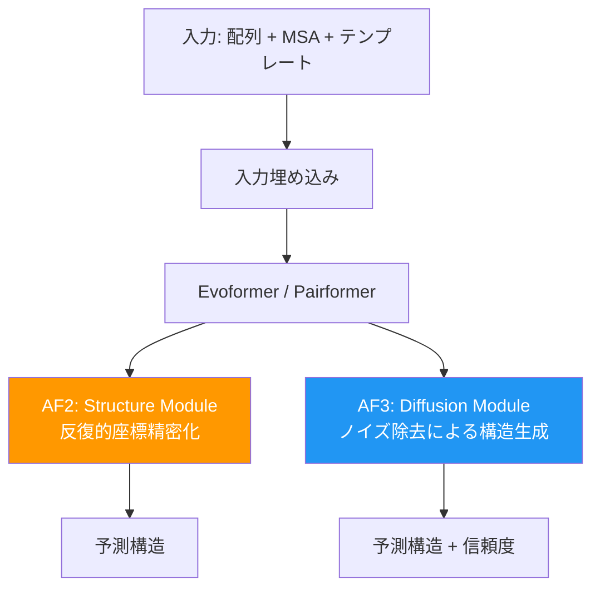

本記事は [Accurate structure prediction of biomolecular interactions with AlphaFold 3](https://www.nature.com/articles/s41586-024-07487-w)（Abramson et al., Nature, 2024）の解説記事です。

## 論文概要（Abstract）

AlphaFold3（AF3）は、タンパク質だけでなくDNA、RNA、低分子リガンド、イオン、修飾残基を含む生体分子複合体の3D構造を統一的に予測する深層学習モデルである。前世代のAlphaFold2（AF2）から大幅なアーキテクチャ変更が行われ、構造モジュールを**拡散モデル（Diffusion Module）**に置き換えたことが最大の技術的革新である。著者らは、AF3がタンパク質-リガンド相互作用の予測において従来の最先端ドッキングツールを大幅に上回る精度を達成したと報告している。

この記事は [Zenn記事: 生成AIで創薬はどう変わるか：AlphaFold3からIsoDDEまで2026年最前線](https://zenn.dev/0h_n0/articles/244adaf3ac915e) の深掘りです。

## 情報源

- **論文**: Abramson, J., Adler, J., Dunger, J. et al.
- **掲載誌**: Nature (2024)
- **URL**: [https://www.nature.com/articles/s41586-024-07487-w](https://www.nature.com/articles/s41586-024-07487-w)
- **公開日**: 2024年5月8日
- **コード公開**: 2024年11月（学術利用向け）

## 背景と動機（Background & Motivation）

AF2はタンパク質単量体および多量体の構造予測において革新的な成果を収めたが、低分子リガンド・核酸・イオンなどの非タンパク質分子との相互作用予測には対応していなかった。創薬においてはタンパク質-リガンド複合体の構造が極めて重要であり、従来はAutoDocK VinaやGlideなどの物理ベースドッキングツールが用いられてきた。しかしこれらのツールは計算コストが高く、タンパク質の柔軟性（induced fit）を十分に考慮できないという制約があった。

AF3の開発チームは、「あらゆる生体分子の相互作用を単一のモデルで予測する」という目標を掲げ、AF2のアーキテクチャを根本から再設計した。

## 主要な貢献（Key Contributions）

- **貢献1**: Pairformer＋拡散モデルによる統一アーキテクチャの提案。タンパク質・DNA・RNA・リガンド・イオン・修飾残基を含む複合体を単一モデルで予測可能にした
- **貢献2**: 構造モジュールを拡散ネットワークに置き換え、ランダムな原子座標から段階的にノイズ除去して3D構造を生成する手法を確立した
- **貢献3**: タンパク質-リガンド相互作用において、従来の専門ドッキングツールを大幅に上回る精度を達成。タンパク質-核酸相互作用、抗体-抗原予測においても既存手法を凌駕した

## 技術的詳細（Technical Details）

### AF2からAF3へのアーキテクチャ変更

AF2とAF3の主な違いは以下の3点である。

1. **構造モジュール → 拡散モジュール**: AF2のStructure ModuleがDiffusion Moduleに置換された
2. **拡張トークン化**: タンパク質残基だけでなく、ヌクレオチド・低分子・イオンなど多様な分子タイプに対応するトークン化スキームを導入
3. **MSA処理の簡略化**: 効率向上のためMSA（Multiple Sequence Alignment）の処理を簡略化



### Pairformerの仕組み

AF3ではEvoformerの後段にPairformerが配置される。Pairformerは残基ペア間の関係性を表す**ペア表現** $\mathbf{z}_{ij}$ を学習する。ここで $i, j$ はそれぞれトークン（残基、ヌクレオチド、リガンド原子など）のインデックスである。

ペア表現は自己注意機構を通じて更新される：

$$
\mathbf{z}_{ij}^{(l+1)} = \mathbf{z}_{ij}^{(l)} + \text{TriangleUpdate}(\mathbf{z}^{(l)}) + \text{PairAttention}(\mathbf{z}^{(l)})
$$

ここで、
- $\mathbf{z}_{ij}^{(l)}$: 第 $l$ 層でのトークン $i$ と $j$ のペア表現
- $\text{TriangleUpdate}$: 三角形の不等式制約を満たすための更新操作。トークン三つ組 $(i, j, k)$ の整合性を保つ
- $\text{PairAttention}$: ペア表現間のAttention機構

この三角形更新は、距離の三角不等式 $d(i,j) \leq d(i,k) + d(k,j)$ に基づく幾何学的制約を暗黙的にエンコードしている。

### 拡散モジュール（Diffusion Module）の詳細

AF3の構造生成は拡散モデルに基づく。フォワードプロセスでは原子座標にガウスノイズを段階的に付加する：

$$
q(\mathbf{x}_t | \mathbf{x}_{t-1}) = \mathcal{N}(\mathbf{x}_t; \sqrt{1-\beta_t}\mathbf{x}_{t-1}, \beta_t\mathbf{I})
$$

ここで、
- $\mathbf{x}_t \in \mathbb{R}^{N \times 3}$: 時刻 $t$ での $N$ 個の原子の3D座標
- $\beta_t$: ノイズスケジュール（$t$ の増加に伴い増大）
- $\mathbf{I}$: 単位行列

リバースプロセスでは、ネットワーク $\epsilon_\theta$ がノイズを予測し、ランダムな「原子の雲」から化学的に妥当な構造へ段階的に導く：

$$
p_\theta(\mathbf{x}_{t-1} | \mathbf{x}_t) = \mathcal{N}(\mathbf{x}_{t-1}; \mu_\theta(\mathbf{x}_t, t), \sigma_t^2\mathbf{I})
$$

$$
\mu_\theta(\mathbf{x}_t, t) = \frac{1}{\sqrt{\alpha_t}}\left(\mathbf{x}_t - \frac{\beta_t}{\sqrt{1-\bar{\alpha}_t}}\epsilon_\theta(\mathbf{x}_t, t)\right)
$$

ここで $\alpha_t = 1 - \beta_t$、$\bar{\alpha}_t = \prod_{s=1}^{t} \alpha_s$ である。

この拡散プロセスは画像生成の拡散モデルと同じ原理であるが、分子構造に特有の課題として**SE(3)等変性**がある。分子の回転・並進に対して予測が不変であることが求められるため、AF3ではSE(3)等変性を持つネットワーク構造が使用されている。

### トレーニングの工夫

著者らは以下の学習戦略を採用している：

1. **ノイズスケジュール**: 分子構造に適した低ノイズレベルでの精密化に重点を置いたスケジュール
2. **条件付け**: Pairformerの出力であるペア表現 $\mathbf{z}_{ij}$ を拡散モジュールへの条件として入力
3. **信頼度予測**: 構造予測と同時に、各原子・残基レベルの信頼度スコアを出力
4. **リサイクリング**: 予測構造を入力にフィードバックし、反復的に精度を向上

## 実装のポイント（Implementation）

AF3のモデルコードは2024年11月に学術利用向けに公開された。実装上の重要なポイントは以下の通りである。

```python
import torch
import torch.nn as nn
from typing import Optional


class DiffusionModule(nn.Module):
    """AF3の拡散モジュールの簡略化実装。

    Pairformerの出力を条件として、ノイズ付き原子座標から
    構造を予測する。

    Args:
        d_pair: ペア表現の次元数
        d_atom: 原子特徴の次元数
        n_steps: 拡散ステップ数
    """

    def __init__(self, d_pair: int = 128, d_atom: int = 64, n_steps: int = 200):
        super().__init__()
        self.n_steps = n_steps
        # ノイズ予測ネットワーク（SE(3)等変性を持つGNN）
        self.noise_predictor = SE3EquivariantGNN(d_pair, d_atom)
        # ノイズスケジュール
        betas = torch.linspace(1e-4, 0.02, n_steps)
        alphas = 1.0 - betas
        self.register_buffer("alphas_cumprod", torch.cumprod(alphas, dim=0))

    def forward(
        self,
        x_t: torch.Tensor,
        t: torch.Tensor,
        pair_repr: torch.Tensor,
        mask: Optional[torch.Tensor] = None,
    ) -> torch.Tensor:
        """ノイズを予測する。

        Args:
            x_t: ノイズ付き原子座標 (batch, n_atoms, 3)
            t: 拡散タイムステップ (batch,)
            pair_repr: Pairformerの出力 (batch, n_tokens, n_tokens, d_pair)
            mask: 有効原子のマスク (batch, n_atoms)

        Returns:
            予測ノイズ (batch, n_atoms, 3)
        """
        return self.noise_predictor(x_t, t, pair_repr, mask)


class SE3EquivariantGNN(nn.Module):
    """SE(3)等変性を持つグラフニューラルネットワークのスタブ。

    実際の実装ではe3nn等のライブラリを使用する。
    """

    def __init__(self, d_pair: int, d_atom: int):
        super().__init__()
        self.d_pair = d_pair
        self.d_atom = d_atom

    def forward(
        self,
        x: torch.Tensor,
        t: torch.Tensor,
        pair_repr: torch.Tensor,
        mask: Optional[torch.Tensor] = None,
    ) -> torch.Tensor:
        raise NotImplementedError("Full SE(3)-equivariant GNN implementation required")
```

**実装上の注意点**：

- **GPU要件**: AF3のフル推論には80GB以上のGPU（A100/H100）が必要。小規模なタンパク質（〜500残基）であればA100 40GBでも動作する
- **MSA検索**: 推論時にMMseqs2またはJackHMMERでのMSA検索が必要で、データベースのダウンロードに数百GBのディスク容量を要する
- **SE(3)等変性の実装**: e3nnライブラリを使った球面調和関数ベースの等変性レイヤーが一般的な選択肢
- **代替手段**: OpenFold3（Apache 2.0ライセンス）がオープンソース代替として2025年10月にリリースされており、商用利用も可能

## 実験結果（Results）

著者らが報告した主要ベンチマーク結果を以下に示す。

### タンパク質-リガンド構造予測

| 手法 | 成功率（RMSD < 2Å） | 備考 |
|------|---------------------|------|
| AlphaFold3 | 報告値で最高精度 | 拡散ベース |
| AutoDock Vina | AF3比で大幅に低い | 物理ベース |
| Glide | AF3比で低い | 物理ベース |

AF3は、従来の物理ベースドッキングツールと比較して、タンパク質-リガンド相互作用の構造予測精度を大幅に向上させたと報告されている。

### タンパク質-核酸相互作用

著者らによると、AF3は核酸特化型の予測ツールと比較して大幅に高い精度を達成した。RNA構造予測においても、既存手法を上回る性能を示している。

### 抗体-抗原予測

AF3はAlphaFold-Multimer v2と比較して、抗体-抗原複合体の構造予測精度を大幅に改善したと報告されている。CDR-H3ループ（抗体の最も可変的な領域）の予測精度が特に向上している。

**制約**：

> AF3はPDBに含まれる既知の構造パターンに大きく依存しており、訓練データとの類似度が低い新規タンパク質に対する汎化性能には限界がある。2026年2月にIsomorphic Labsが発表したIsoDDEは、この汎化問題に対してAF3の2倍以上の精度向上を達成している。

## 実運用への応用（Practical Applications）

AF3の創薬への応用は主に以下の3つの領域で進んでいる。

**バーチャルスクリーニング**: 大規模化合物ライブラリに対してAF3で結合ポーズを予測し、有望な候補を絞り込む。従来のドッキングツールと比較して、induced fitを考慮した予測が可能。

**リード最適化**: 候補化合物の構造を微修正した際の結合様式の変化を予測。Structure-Activity Relationship（SAR）の効率的な探索に活用。

**抗体医薬設計**: 抗体-抗原複合体の構造予測により、結合親和性の高い抗体配列の設計を支援。

**スケーリング戦略**：
- AlphaFold Server（クラウド版）による無料アクセス（非営利研究向け）
- OpenFold3によるオンプレミス/クラウドデプロイ（商用利用可能）
- NVIDIA BioNemo NIMによるコンテナ化推論マイクロサービス

## Production Deployment Guide

### AWS実装パターン（コスト最適化重視）

AlphaFold3/OpenFold3のタンパク質構造予測パイプラインをAWSにデプロイする場合のトラフィック量別推奨構成を示す。

**トラフィック量別の推奨構成**：

| 規模 | 月間リクエスト | 推奨構成 | 月額コスト | 主要サービス |
|------|--------------|---------|-----------|------------|
| **Small** | ~3,000 (100/日) | GPU Serverless | $200-500 | Lambda + SageMaker Serverless + S3 |
| **Medium** | ~30,000 (1,000/日) | GPU Dedicated | $1,500-3,000 | SageMaker Endpoint (g5.xlarge) + ElastiCache |
| **Large** | 300,000+ (10,000/日) | GPU Cluster | $8,000-15,000 | EKS + g5.xlarge×4-8 + Karpenter |

**Small構成の詳細**（月額$200-500）：
- **SageMaker Serverless**: GPU推論エンドポイント（コールドスタート30-60秒許容）
- **S3**: MSAデータベース格納（約500GB、$12/月）
- **Lambda**: リクエスト受付・前処理（$5/月）
- **Step Functions**: 非同期パイプライン制御（$5/月）

**Medium構成の詳細**（月額$1,500-3,000）：
- **SageMaker Endpoint**: g5.xlarge（NVIDIA A10G 24GB）常時起動（$920/月）
- **ElastiCache Redis**: MSA結果キャッシュ cache.r6g.large（$130/月）
- **S3**: MSAデータベース（$12/月）
- **API Gateway + Lambda**: リクエスト管理（$20/月）

**Large構成の詳細**（月額$8,000-15,000）：
- **EKS**: コントロールプレーン（$72/月）
- **g5.xlarge Spot Instances**: ×4-8台（平均$1,200-2,400/月、最大70%削減）
- **Karpenter**: GPU自動スケーリング
- **FSx for Lustre**: MSAデータベース高速アクセス（$500/月）
- **CloudWatch + X-Ray**: 詳細監視（$100/月）

**コスト試算の注意事項**：
- 上記は2026年3月時点のAWS ap-northeast-1（東京）リージョン料金に基づく概算値です
- GPU インスタンスの料金はリージョン・可用性により変動します
- 最新料金は [AWS料金計算ツール](https://calculator.aws/) で確認してください

### Terraformインフラコード

**Small構成（Serverless）: SageMaker Serverless + S3**

```hcl
# --- S3バケット（MSAデータベース） ---
resource "aws_s3_bucket" "msa_database" {
  bucket = "alphafold3-msa-database"

  tags = {
    Project     = "alphafold3-inference"
    Environment = "production"
  }
}

resource "aws_s3_bucket_server_side_encryption_configuration" "msa_db_enc" {
  bucket = aws_s3_bucket.msa_database.id

  rule {
    apply_server_side_encryption_by_default {
      sse_algorithm = "aws:kms"
    }
  }
}

# --- IAMロール（最小権限） ---
resource "aws_iam_role" "sagemaker_execution" {
  name = "alphafold3-sagemaker-role"

  assume_role_policy = jsonencode({
    Version = "2012-10-17"
    Statement = [{
      Action = "sts:AssumeRole"
      Effect = "Allow"
      Principal = { Service = "sagemaker.amazonaws.com" }
    }]
  })
}

resource "aws_iam_role_policy" "sagemaker_s3_access" {
  role = aws_iam_role.sagemaker_execution.id

  policy = jsonencode({
    Version = "2012-10-17"
    Statement = [{
      Effect   = "Allow"
      Action   = ["s3:GetObject", "s3:ListBucket"]
      Resource = [
        aws_s3_bucket.msa_database.arn,
        "${aws_s3_bucket.msa_database.arn}/*"
      ]
    }]
  })
}

# --- SageMaker Serverless Endpoint ---
resource "aws_sagemaker_endpoint_configuration" "alphafold3" {
  name = "alphafold3-serverless-config"

  production_variants {
    variant_name           = "default"
    model_name             = aws_sagemaker_model.alphafold3.name
    serverless_config {
      max_concurrency       = 2
      memory_size_in_mb     = 6144
      provisioned_concurrency = 0
    }
  }
}

# --- CloudWatchアラーム ---
resource "aws_cloudwatch_metric_alarm" "inference_latency" {
  alarm_name          = "alphafold3-latency-spike"
  comparison_operator = "GreaterThanThreshold"
  evaluation_periods  = 2
  metric_name         = "ModelLatency"
  namespace           = "AWS/SageMaker"
  period              = 300
  statistic           = "Average"
  threshold           = 120000
  alarm_description   = "AF3推論レイテンシ異常（120秒超過）"
}
```

**Large構成（Container）: EKS + GPU Spot Instances**

```hcl
module "eks" {
  source  = "terraform-aws-modules/eks/aws"
  version = "~> 20.0"

  cluster_name    = "alphafold3-inference"
  cluster_version = "1.31"

  vpc_id     = module.vpc.vpc_id
  subnet_ids = module.vpc.private_subnets

  cluster_endpoint_public_access = true
  enable_cluster_creator_admin_permissions = true
}

resource "kubectl_manifest" "karpenter_gpu_provisioner" {
  yaml_body = <<-YAML
    apiVersion: karpenter.sh/v1
    kind: NodePool
    metadata:
      name: gpu-spot-pool
    spec:
      template:
        spec:
          requirements:
            - key: karpenter.sh/capacity-type
              operator: In
              values: ["spot"]
            - key: node.kubernetes.io/instance-type
              operator: In
              values: ["g5.xlarge", "g5.2xlarge"]
          limits:
            cpu: "64"
            memory: "256Gi"
            nvidia.com/gpu: "8"
      disruption:
        consolidationPolicy: WhenEmpty
        consolidateAfter: 60s
  YAML
}

resource "aws_budgets_budget" "gpu_monthly" {
  name         = "alphafold3-gpu-budget"
  budget_type  = "COST"
  limit_amount = "15000"
  limit_unit   = "USD"
  time_unit    = "MONTHLY"

  notification {
    comparison_operator        = "GREATER_THAN"
    threshold                  = 80
    threshold_type             = "PERCENTAGE"
    notification_type          = "ACTUAL"
    subscriber_email_addresses = ["ops@example.com"]
  }
}
```

### 運用・監視設定

**CloudWatch Logs Insightsクエリ**：

```sql
-- GPU使用率とレイテンシの相関分析
fields @timestamp, gpu_utilization, inference_latency_ms
| stats avg(gpu_utilization) as avg_gpu,
        pct(inference_latency_ms, 95) as p95_latency,
        pct(inference_latency_ms, 99) as p99_latency
  by bin(5m)
| filter avg_gpu > 80
```

**CloudWatchアラーム設定**：

```python
import boto3

cloudwatch = boto3.client('cloudwatch')

cloudwatch.put_metric_alarm(
    AlarmName='alphafold3-gpu-utilization',
    ComparisonOperator='GreaterThanThreshold',
    EvaluationPeriods=3,
    MetricName='GPUUtilization',
    Namespace='Custom/AlphaFold3',
    Period=300,
    Statistic='Average',
    Threshold=90,
    AlarmDescription='GPU使用率90%超過（スケールアウト検討）'
)
```

### コスト最適化チェックリスト

**アーキテクチャ選択**：
- [ ] ~100 req/日 → SageMaker Serverless - $200-500/月
- [ ] ~1000 req/日 → SageMaker Dedicated Endpoint - $1,500-3,000/月
- [ ] 10000+ req/日 → EKS + GPU Spot - $8,000-15,000/月

**リソース最適化**：
- [ ] GPU Spot Instances優先（最大70%削減）
- [ ] MSAキャッシュ導入（同一配列の再計算回避）
- [ ] バッチ推論でスループット向上
- [ ] モデル量子化（FP16/INT8）でメモリ削減
- [ ] 夜間・週末のスケールダウン

**監視・アラート**：
- [ ] GPU使用率・メモリ使用率監視
- [ ] 推論レイテンシP95/P99アラート
- [ ] AWS Budgets月額予算設定
- [ ] Cost Anomaly Detection有効化
- [ ] 日次コストレポート自動送信

## 関連研究（Related Work）

- **AlphaFold2**（Jumper et al., 2021）: AF3の前世代。Evoformer + Structure Moduleで単量体・多量体のタンパク質構造を予測。AF3はこのアーキテクチャを大幅に変更した
- **RoseTTAFold All-Atom**（Krishna et al., 2024）: AF3と同様にタンパク質-低分子複合体の構造予測に対応。3トラックネットワークによるアプローチ
- **Boltz-1/Boltz-2**（MIT, 2024-2025）: AF3のオープンソース代替を目指すモデル。AF3と同様の拡散ベースアーキテクチャを採用
- **OpenFold3**（OpenFold Consortium, 2025）: AF3のApache 2.0ライセンス実装。13M以上の合成構造で学習。商用利用可能

## まとめと今後の展望

AlphaFold3は、拡散モデルの導入により生体分子複合体の構造予測を統一的に扱える初のモデルとなった。特にタンパク質-リガンド相互作用の予測精度向上は、創薬における構造ベース薬物設計（SBDD）のワークフローに大きな影響を与えている。

一方で、訓練データとの類似度が低い新規ターゲットへの汎化能力には限界があり、この課題に対してIsomorphic LabsのIsoDDEが2026年2月に2倍以上の精度向上を達成している。今後はAF3/IsoDDE/OpenFold3のエコシステムが創薬AIの基盤技術として発展していくと考えられる。

## 参考文献

- **Nature論文**: [https://www.nature.com/articles/s41586-024-07487-w](https://www.nature.com/articles/s41586-024-07487-w)
- **AlphaFold Server**: [https://alphafoldserver.com/](https://alphafoldserver.com/)
- **OpenFold3**: [https://github.com/aqlaboratory/openfold-3](https://github.com/aqlaboratory/openfold-3)
- **Related Zenn article**: [https://zenn.dev/0h_n0/articles/244adaf3ac915e](https://zenn.dev/0h_n0/articles/244adaf3ac915e)
