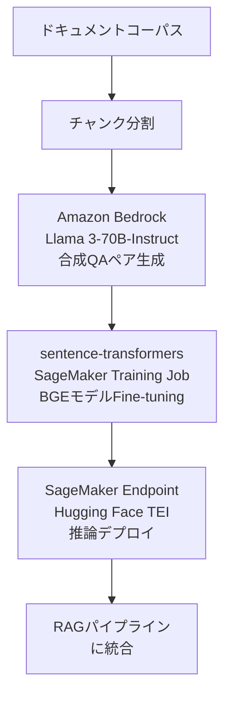

本記事は [AWS Machine Learning Blog: Fine-tune a BGE embedding model using synthetic data from Amazon Bedrock](https://aws.amazon.com/blogs/machine-learning/fine-tune-a-bge-embedding-model-using-synthetic-data-from-amazon-bedrock/)（2024年10月23日公開）の解説記事です。

## ブログ概要（Summary）

AWSのMachine Learning Blogで公開された本記事は、Amazon Bedrockを用いて合成データを生成し、BAAI General Embeddings（BGE）モデルをFine-tuningし、Amazon SageMakerでデプロイするエンドツーエンドのパイプラインを紹介している。Meta Llama 3-70B-Instructモデルを使用してドキュメントチャンクから質問-回答ペアを生成し、ドメイン特化型の埋め込みモデルを構築するワークフローが詳細に解説されている。

この記事は [Zenn記事: Embedding Fine-tuning実践：合成データと評価ループでRAG検索精度を改善する](https://zenn.dev/0h_n0/articles/3a80f7fd58cc8e) の深掘りです。

## 情報源

- **種別**: 企業テックブログ（AWS公式）
- **URL**: [https://aws.amazon.com/blogs/machine-learning/fine-tune-a-bge-embedding-model-using-synthetic-data-from-amazon-bedrock/](https://aws.amazon.com/blogs/machine-learning/fine-tune-a-bge-embedding-model-using-synthetic-data-from-amazon-bedrock/)
- **組織**: AWS Machine Learning Team
- **発表日**: 2024年10月23日
- **GitHub**: [aws-samples/finetune-bge-embeddings-blog](https://github.com/aws-samples/finetune-bge-embeddings-blog)

## 技術的背景（Technical Background）

RAGシステムにおいて、検索精度はEmbeddingモデルの品質に大きく依存する。汎用の埋め込みモデルは公開ベンチマーク（MTEB等）では高いスコアを示すが、特定のドメイン（法律、医療、社内文書等）では期待どおりの精度が出ないケースがある。

この精度ギャップの主な原因は以下のとおりである。

1. **ドメイン語彙の乖離**: 専門用語、社内略語がベースモデルの学習データに含まれていない
2. **クエリ特性の違い**: 実際のユーザークエリの分布がベンチマークのクエリ分布と異なる
3. **文書構造の違い**: 長い技術マニュアルやFAQ形式など、ベンチマークにない文書形式

AWSブログでは、Amazon Bedrockで利用可能なLLM（Llama 3-70B-Instruct）を使って合成データを生成し、この精度ギャップを埋めるアプローチを紹介している。この手法はZenn記事で紹介されている合成クエリ生成の手法と本質的に同じアプローチであり、AWS公式のベストプラクティスとして位置付けられている。

## 実装アーキテクチャ（Architecture）

### エンドツーエンドのパイプライン

AWSブログで紹介されているパイプラインは以下の4段階で構成されている。



### ステップ1: 合成データ生成

Amazon Bedrockを通じてMeta Llama 3-70B-Instructを呼び出し、各ドキュメントチャンクに対して検索クエリ（質問文）を生成する。生成される合成データの形式は（query, positive_document）のペアである。

```python
import boto3
import json


def generate_synthetic_queries(
    chunk: str,
    num_queries: int = 3,
    model_id: str = "meta.llama3-70b-instruct-v1:0",
) -> list[str]:
    """Amazon Bedrockを使用して合成クエリを生成する

    Args:
        chunk: ドキュメントチャンク
        num_queries: 生成するクエリ数
        model_id: Bedrockモデル ID

    Returns:
        生成されたクエリのリスト
    """
    bedrock = boto3.client("bedrock-runtime", region_name="ap-northeast-1")

    prompt = f"""以下のドキュメントに基づいて、ユーザーが検索エンジンに入力しそうな
クエリを{num_queries}個生成してください。

ドキュメント:
{chunk}

JSON形式で出力: {{"queries": ["クエリ1", "クエリ2", ...]}}"""

    response = bedrock.invoke_model(
        modelId=model_id,
        body=json.dumps({
            "prompt": prompt,
            "max_gen_len": 512,
            "temperature": 0.7,
        }),
    )

    result = json.loads(response["body"].read())
    return json.loads(result["generation"])["queries"]
```

### ステップ2: BGEモデルのFine-tuning

合成データを用いて、BAAI/bge-base-en-v1.5等のBGEモデルをsentence-transformersのTrainer APIでFine-tuningする。AWSブログでは、SageMaker Training Jobとしてこの処理を実行する方法が紹介されている。

### ステップ3: SageMakerへのデプロイ

Fine-tuning済みモデルをSageMaker Endpointにデプロイする。推論コンテナとしてHugging Face Text Embeddings Inference（TEI）を使用している。

### ステップ4: RAGパイプラインへの統合

デプロイされたEndpointをRAGパイプラインの検索コンポーネントとして統合する。

## Production Deployment Guide

### AWS実装パターン（コスト最適化重視）

AWSブログの構成をベースに、トラフィック量別の推奨構成を示す。

| 規模 | 月間リクエスト | 推奨構成 | 月額コスト | 主要サービス |
|------|--------------|---------|-----------|------------|
| **Small** | ~3,000 (100/日) | Serverless | $80-200 | SageMaker Serverless + Bedrock |
| **Medium** | ~30,000 (1,000/日) | Real-time | $400-1,000 | SageMaker ml.g5.xlarge + ElastiCache |
| **Large** | 300,000+ (10,000/日) | Multi-endpoint | $2,500-6,000 | SageMaker ml.g5.xlarge × 2-4 + Auto Scaling |

**Small構成の詳細**（月額$80-200）:
- **SageMaker Serverless Inference**: memory 4GB（BGE-baseは約500MB）、$20-50/月
- **Bedrock**: 合成データ生成はFine-tuning時のみ発生、$30-80（初回のみ）
- **S3**: モデルアーティファクト保存、$5/月
- **CloudWatch**: 基本監視、$5/月

**Medium構成の詳細**（月額$400-1,000）:
- **SageMaker Real-time**: ml.g5.xlarge（A10G GPU）、$300-500/月
- **ElastiCache Redis**: cache.t3.micro（埋め込みキャッシュ）、$15/月
- **Application Load Balancer**: $20/月
- **SageMaker Training Job**: Fine-tuning用（月1回程度）、$10-20/回

**コスト削減テクニック**:
- SageMaker Savings Plans: 最大64%削減（1年コミット）
- BGE-base（109M）はCPU推論も可能: ml.c5.xlarge（$100/月）で十分な場合あり
- 埋め込みキャッシュで重複計算を排除
- SageMaker Multi-Model Endpoint: 複数モデル共有で固定費削減

**コスト試算の注意事項**: 上記は2026年3月時点のAWS ap-northeast-1リージョン料金に基づく概算値である。SageMakerインスタンスの料金はオンデマンド価格であり、Savings Plans適用で大幅に削減できる。最新料金は[AWS料金計算ツール](https://calculator.aws/)で確認されたい。

### Terraformインフラコード

**SageMaker Real-time Endpoint構成**:

```hcl
resource "aws_sagemaker_model" "bge_finetuned" {
  name               = "bge-finetuned-domain"
  execution_role_arn = aws_iam_role.sagemaker_execution.arn

  primary_container {
    image          = "763104351884.dkr.ecr.ap-northeast-1.amazonaws.com/huggingface-pytorch-tei:2.0-gpu-py310-cu121-ubuntu22.04"
    model_data_url = "s3://${aws_s3_bucket.models.bucket}/bge-finetuned/model.tar.gz"
  }
}

resource "aws_sagemaker_endpoint_configuration" "bge_config" {
  name = "bge-finetuned-config"

  production_variants {
    model_name             = aws_sagemaker_model.bge_finetuned.name
    variant_name           = "primary"
    instance_type          = "ml.g5.xlarge"
    initial_instance_count = 1
  }
}

resource "aws_sagemaker_endpoint" "bge_endpoint" {
  name                 = "bge-finetuned-endpoint"
  endpoint_config_name = aws_sagemaker_endpoint_configuration.bge_config.name
}

resource "aws_appautoscaling_target" "sagemaker_target" {
  max_capacity       = 4
  min_capacity       = 1
  resource_id        = "endpoint/${aws_sagemaker_endpoint.bge_endpoint.name}/variant/primary"
  scalable_dimension = "sagemaker:variant:DesiredInstanceCount"
  service_namespace  = "sagemaker"
}

resource "aws_appautoscaling_policy" "sagemaker_policy" {
  name               = "bge-scaling-policy"
  policy_type        = "TargetTrackingScaling"
  resource_id        = aws_appautoscaling_target.sagemaker_target.resource_id
  scalable_dimension = aws_appautoscaling_target.sagemaker_target.scalable_dimension
  service_namespace  = aws_appautoscaling_target.sagemaker_target.service_namespace

  target_tracking_scaling_policy_configuration {
    predefined_metric_specification {
      predefined_metric_type = "SageMakerVariantInvocationsPerInstance"
    }
    target_value = 100.0
  }
}
```

### 運用・監視設定

```python
import boto3

cloudwatch = boto3.client('cloudwatch')

# SageMaker Endpoint レイテンシ監視
cloudwatch.put_metric_alarm(
    AlarmName='bge-endpoint-latency-p99',
    ComparisonOperator='GreaterThanThreshold',
    EvaluationPeriods=2,
    MetricName='ModelLatency',
    Namespace='AWS/SageMaker',
    Period=300,
    ExtendedStatistic='p99',
    Threshold=500000,  # 500ms (マイクロ秒単位)
    AlarmDescription='BGE推論レイテンシP99が500ms超過',
    Dimensions=[
        {'Name': 'EndpointName', 'Value': 'bge-finetuned-endpoint'},
        {'Name': 'VariantName', 'Value': 'primary'},
    ],
)
```

### コスト最適化チェックリスト

- [ ] BGE-base（109M）: CPU推論可能、GPU不要の場合あり
- [ ] SageMaker Savings Plans: 1年コミットで最大64%削減
- [ ] Multi-Model Endpoint: 複数ドメインモデル共有
- [ ] Auto Scaling設定: 最小1、最大4インスタンス
- [ ] 埋め込みキャッシュ: ElastiCache/DynamoDBで重複計算排除
- [ ] Bedrock合成データ生成: Batch API使用で50%削減
- [ ] SageMaker Training Job: Spot Training使用で最大90%削減
- [ ] AWS Budgets設定（80%警告、100%アラート）
- [ ] CloudWatch Endpoint監視（レイテンシ、エラー率、呼び出し数）
- [ ] Cost Anomaly Detection有効化

## パフォーマンス最適化（Performance）

### BGEモデルの推論特性

BGE-base-en-v1.5（109Mパラメータ）の推論特性は以下のとおりである。

| 指標 | GPU（A10G） | CPU（c5.xlarge） |
|------|-----------|-----------------|
| レイテンシ（バッチ1） | ~5ms | ~50ms |
| レイテンシ（バッチ32） | ~15ms | ~200ms |
| スループット | ~2,000 req/s | ~200 req/s |

AWSブログでは、Hugging Face Text Embeddings Inference（TEI）を推論コンテナとして使用することで、バッチ処理とトークン管理の最適化が行われている。

### Fine-tuning時のコスト

AWSブログで紹介されている構成でのFine-tuningコストの概算:
- **インスタンス**: ml.g5.xlarge（A10G GPU）
- **訓練時間**: 約30分〜2時間（データ量に依存）
- **コスト**: $1-5/回
- **合成データ生成**: Bedrock Llama 3-70B、約$10-30（1万チャンクの場合）

## 運用での学び（Production Lessons）

AWSブログから読み取れる実運用上のポイントを以下にまとめる。

**段階的な改善**: ベースモデル（Fine-tuning前）でまず評価し、NDCG@10の目標値に達しない場合にFine-tuningを実施するというアプローチが推奨されている。これはZenn記事の「Fine-tuningの判断チャート」と同じ考え方である。

**合成データの品質管理**: LLMで生成した合成データの品質が直接Fine-tuningの効果に影響する。生成されたクエリの多様性（質問文、キーワード、口語的表現の混在）を確認し、低品質なペアを除去するフィルタリングステップが重要である。

**SageMaker Training Jobの活用**: ローカルGPUがなくても、SageMaker Training Jobを使うことでオンデマンドにGPUリソースを確保してFine-tuningを実行できる。Spot Training（最大90%割引）との組み合わせで、コストを大幅に削減できる。

## 学術研究との関連（Academic Connection）

AWSブログの手法は、以下の学術研究をベースとしている。

- **BGEモデル**: BAAI（Beijing Academy of Artificial Intelligence）が開発した汎用テキスト埋め込みモデル。RetroMAE事前学習と対照学習によるFine-tuningで構築されている
- **合成データ生成**: Wang et al.（2024, arXiv:2401.00368）のE5-mistral論文で、LLMによる合成データがテキスト埋め込みの訓練に有効であることが示されている
- **MultipleNegativesRankingLoss**: Henderson et al.（2017）が提案したバッチ内ネガティブを活用する損失関数。AWSブログでもsentence-transformersの同損失関数を使用している

## まとめと実践への示唆

AWSブログで紹介されているパイプラインは、Zenn記事で解説されている合成データ生成→Fine-tuning→評価のワークフローを、AWSのマネージドサービス上で実装する具体例として位置付けられる。BGE-base-en-v1.5のFine-tuningは単一GPU（A10G）で数分〜数時間で完了し、コストも$1-5程度と低いため、PoC段階から実験的に試みやすい。

本番環境への展開では、SageMaker Endpointのオートスケーリング設定、埋め込みキャッシュ戦略、および定期的なFine-tuningの自動化（新規ドキュメント追加時）が重要なポイントとなる。

## 参考文献

- **Blog URL**: [https://aws.amazon.com/blogs/machine-learning/fine-tune-a-bge-embedding-model-using-synthetic-data-from-amazon-bedrock/](https://aws.amazon.com/blogs/machine-learning/fine-tune-a-bge-embedding-model-using-synthetic-data-from-amazon-bedrock/)
- **GitHub**: [https://github.com/aws-samples/finetune-bge-embeddings-blog](https://github.com/aws-samples/finetune-bge-embeddings-blog)
- **Related**: [Improve RAG accuracy with fine-tuned embedding models on Amazon SageMaker](https://aws.amazon.com/blogs/machine-learning/improve-rag-accuracy-with-fine-tuned-embedding-models-on-amazon-sagemaker/)
- **Related Zenn article**: [https://zenn.dev/0h_n0/articles/3a80f7fd58cc8e](https://zenn.dev/0h_n0/articles/3a80f7fd58cc8e)

---

:::message
この記事はAI（Claude Code）により自動生成されました。内容の正確性についてはAWS公式ブログの原文で検証していますが、実際の利用時は公式ドキュメントもご確認ください。
:::
