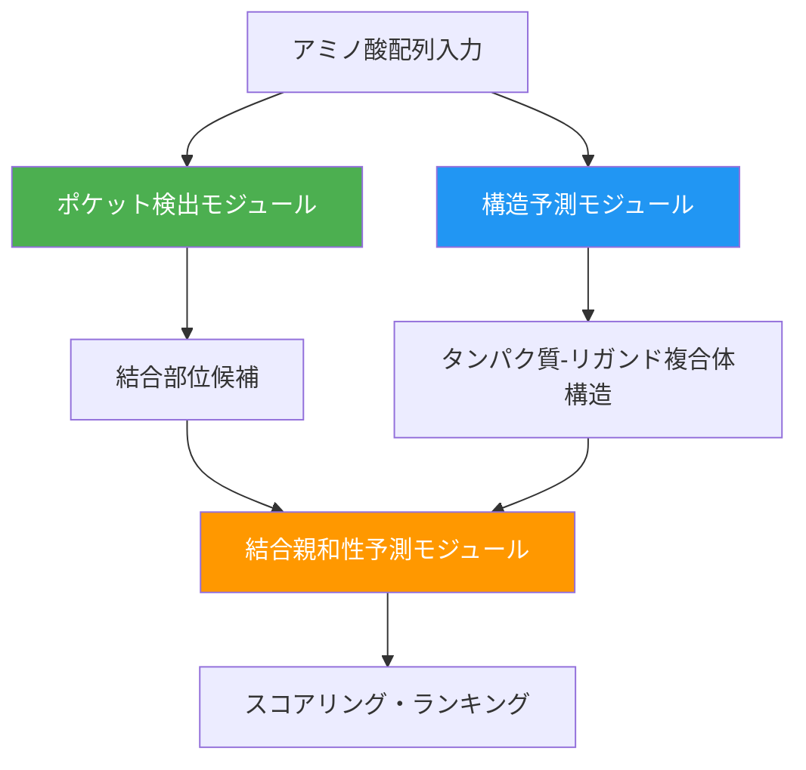

本記事は [The Isomorphic Labs Drug Design Engine unlocks a new frontier beyond AlphaFold](https://www.isomorphiclabs.com/articles/the-isomorphic-labs-drug-design-engine-unlocks-a-new-frontier)（Isomorphic Labs, 2026年2月）の解説記事です。

## ブログ概要（Summary）

IsoDDE（Isomorphic Labs Drug Design Engine）は、2026年2月にIsomorphic Labsが発表した統合的な計算創薬設計システムである。AlphaFold3（AF3）の構造予測能力を基盤としつつ、タンパク質-リガンド構造予測の精度をAF3比で2倍以上に向上させ、結合親和性予測では物理ベースの手法（FEP+）を時間・コストの面で凌駕し、アミノ酸配列のみからリガンド結合ポケットを秒単位で同定する機能を備えている。Isomorphic Labsの報告によると、IsoDDEは2026年3月時点で公開されている最も高精度なAI創薬設計システムである。

この記事は [Zenn記事: 生成AIで創薬はどう変わるか：AlphaFold3からIsoDDEまで2026年最前線](https://zenn.dev/0h_n0/articles/244adaf3ac915e) の深掘りです。

## 情報源

- **種別**: 企業テックブログ
- **URL**: [https://www.isomorphiclabs.com/articles/the-isomorphic-labs-drug-design-engine-unlocks-a-new-frontier](https://www.isomorphiclabs.com/articles/the-isomorphic-labs-drug-design-engine-unlocks-a-new-frontier)
- **組織**: Isomorphic Labs（Google DeepMindスピンオフ）
- **発表日**: 2026年2月11日

## 技術的背景（Technical Background）

AlphaFold3は2024年5月に発表され、タンパク質-リガンド複合体の構造予測において革新的な成果を収めた。しかし、創薬の実務においては以下の課題が残されていた。

1. **汎化性能の限界**: 訓練データとの類似度が低い新規ターゲットに対する精度低下。特にinduced fit（誘導適合）やcryptic pocket（隠れ結合部位）の予測が困難
2. **結合親和性予測の欠如**: AF3は構造予測に特化しており、リガンドの結合強度を直接予測する機能がない
3. **ポケット同定の非対応**: 結合部位の同定は別のツール（fpocket、SiteMap等）に依存

IsoDDEはこれらの課題すべてに対応する統合システムとして設計されている。

## 実装アーキテクチャ（Architecture）

IsoDDEは「予測から設計へ」の転換を目指したシステムであり、3つの主要コンポーネントから構成されている。



### コンポーネント1: 構造予測

AF3の拡散モデルアーキテクチャを発展させ、特にout-of-distribution（OOD）ケースへの汎化能力を強化している。Isomorphic Labsの報告によると、以下の構造変化を予測できる。

- **Induced fit（誘導適合）**: リガンド結合によるタンパク質構造の変化
- **Cryptic pocket opening**: 結合前には露出していない隠れ結合部位の開口

### コンポーネント2: 結合親和性予測

構造予測とは独立に、リガンドの結合自由エネルギー（$\Delta G_{\text{bind}}$）を予測する。従来のFEP+（Free Energy Perturbation）は以下の計算を必要とする。

$$
\Delta G_{\text{bind}} = -k_BT \ln K_d
$$

$$
\Delta\Delta G = \Delta G_{\text{mutant}} - \Delta G_{\text{reference}}
$$

ここで、
- $k_B$: ボルツマン定数
- $T$: 温度（K）
- $K_d$: 解離定数
- $\Delta\Delta G$: 参照化合物に対する結合自由エネルギーの差分

FEP+による計算はGPUで数時間から数日を要するが、IsoDDEはこの予測を秒単位で実行できるとIsomorphic Labsは報告している。

### コンポーネント3: ポケット検出

アミノ酸配列のみを入力として、タンパク質上のリガンド結合可能部位を同定する。既知のリガンドや実験構造テンプレートを必要としない点が従来手法との差別化ポイントである。

## ベンチマーク結果の詳細

### 構造予測精度（Runs N' Poses ベンチマーク）

Runs N' Posesは、訓練データとの類似度に基づいてテストケースを分類するベンチマークである。Isomorphic Labsの報告に基づく結果は以下の通り。

| 類似度ビン | AF3精度 | IsoDDE精度 | 改善率 |
|-----------|---------|-----------|--------|
| 0-20%（最難関） | 基準 | AF3の2倍以上 | >100% |
| 20-40% | 基準 | 大幅改善 | - |
| 全体 | 基準 | 2倍以上 | >100% |

**注目すべき点**: 類似度0-20%のビンはinduced fitやcryptic pocket openingを含む最も困難なケースであり、IsoDDEがこのカテゴリで特に高い改善を示したことは、新規ターゲットに対する実用性を示唆している。

### 抗体-抗原構造予測

| 手法 | DockQ > 0.8の達成率 | AF3比 |
|------|-------------------|-------|
| AlphaFold3 | 基準 | 1.0x |
| IsoDDE | AF3の2.3倍 | 2.3x |
| Boltz-2 | IsoDDEの1/19.8 | - |

Isomorphic Labsの報告では、特にCDR-H3ループ（抗体の最も可変的で予測困難な領域）の予測精度が顕著に向上している。

### 結合親和性予測

IsoDDEは3つの公開ベンチマークでの評価結果が報告されている。

| ベンチマーク | IsoDDEの位置付け |
|-------------|----------------|
| FEP+ 4 | FEP+手法を凌駕 |
| OpenFE | 全深層学習手法で最高精度 |
| CASP16 ブラインド親和性タスク | 全深層学習手法で最高精度 |

**特筆すべき点**: FEP+は1化合物あたり数時間のGPU計算を要する物理ベースの手法であり、IsoDDEがこれを上回る精度を秒単位の計算で達成したことは、創薬リード最適化の効率化に大きなインパクトを持つ。ただし、実験結晶構造を入力とするFEP+と、予測構造を用いるIsoDDEの比較条件が異なる点には注意が必要である。

### セレブロン（Cereblon）でのポケット検出

IsoDDEは、配列情報のみからセレブロン（免疫調節薬のターゲットタンパク質）の結合部位を予測する検証を行っている。Isomorphic Labsの報告では、Dippon et al.（2026）が実験的に発見した新規cryptic siteを含め、既知の結合部位と新規の隠れ結合部位の両方を正確に予測できたとしている。

## パフォーマンス最適化（Performance）

Isomorphic Labsの報告に基づく性能指標：

| 指標 | 値 |
|------|-----|
| 構造予測時間 | 秒単位 |
| 結合親和性予測時間 | 秒単位 |
| ポケット検出時間 | 秒単位（配列のみ入力） |

AF3が推論に数分を要するのに対し、IsoDDEは全コンポーネントが秒単位で動作するとされているが、具体的なハードウェア要件や推論条件の詳細は公開されていない。

## 運用での学び（Production Lessons）

IsoDDEの発表から得られる創薬AI実装への示唆は以下の通りである。

**構造予測と親和性予測の統合**: AF3以前は構造予測とドッキングスコアリングが分離されていたが、IsoDDEはこれらを単一パイプラインに統合した。これにより、構造予測の誤差が親和性予測に伝播する問題を軽減している可能性がある。

**配列からのエンドツーエンド予測**: IsoDDEのポケット検出は配列入力のみで動作するため、実験構造が未解決のターゲットに対しても適用可能である。これは特にorphan targetやcryptic siteの探索において価値がある。

**制約と利用可能性**：

> IsoDDEは2026年3月時点で一般公開されておらず、Isomorphic Labsの製薬パートナー企業との協業でのみ利用可能である。研究者がアクセスできるオープンソース代替としてはOpenFold3やBoltz-2があるが、IsoDDEと同等の精度は報告されていない。CEOのDemis Hassabisは2026年末までにIsoDDE設計の医薬品が臨床試験に入る見込みであると述べている。

## 学術研究との関連（Academic Connection）

IsoDDEはAF3の拡散モデルアーキテクチャを基盤としているが、具体的なモデルアーキテクチャの詳細は論文として公開されていない。学術的に関連する主要な研究は以下の通り。

- **AlphaFold3**（Abramson et al., Nature 2024）: IsoDDEの直接の前身。Pairformer＋拡散モジュールによる統一的な構造予測
- **Boltz-2**（MIT, 2025）: AF3のオープンソース再実装。IsoDDEとの精度比較が報告されている
- **FlowDock**（Morehead & Cheng, 2024）: フローマッチングによるタンパク質-リガンドドッキング。CASP16でトップ5の結合親和性予測を達成
- **FEP+**（Schrödinger）: IsoDDEが比較対象とした物理ベースの自由エネルギー摂動法

## Production Deployment Guide

IsoDDEは現時点で公開されていないため、本セクションではIsoDDEの機能を代替する**OpenFold3 + 結合親和性予測パイプライン**のAWSデプロイメントを示す。

### AWS実装パターン（コスト最適化重視）

| 規模 | 月間リクエスト | 推奨構成 | 月額コスト | 主要サービス |
|------|--------------|---------|-----------|------------|
| **Small** | ~3,000 (100/日) | GPU Serverless | $300-600 | SageMaker Serverless + S3 + DynamoDB |
| **Medium** | ~30,000 (1,000/日) | GPU Dedicated | $2,000-4,000 | SageMaker (g5.2xlarge) + ElastiCache + Step Functions |
| **Large** | 300,000+ (10,000/日) | GPU Cluster | $10,000-20,000 | EKS + g5.2xlarge×4-8 Spot + FSx |

**Small構成の詳細**（月額$300-600）：
- **SageMaker Serverless**: OpenFold3推論（GPU必須、コールドスタート許容）
- **DynamoDB**: 予測結果キャッシュ（On-Demand、$10/月）
- **S3**: MSAデータベース + 構造データ（$15/月）
- **Step Functions**: 構造予測→親和性予測のパイプライン制御（$5/月）

**コスト削減テクニック**：
- Spot Instances使用で最大70%削減（g5系インスタンス）
- 予測結果のDynamoDBキャッシュで再計算回避
- バッチ推論（SageMaker Batch Transform）で大量予測時のコスト最適化
- MSA結果のElastiCacheキャッシュで前処理時間削減

**コスト試算の注意事項**：
- 上記は2026年3月時点のAWS ap-northeast-1料金に基づく概算値です
- GPU インスタンスの可用性・料金はリージョンにより変動します
- 最新料金は [AWS料金計算ツール](https://calculator.aws/) で確認してください

### Terraformインフラコード

**Small構成（Serverless）: SageMaker + DynamoDB**

```hcl
# --- DynamoDB（予測結果キャッシュ） ---
resource "aws_dynamodb_table" "prediction_cache" {
  name         = "isodde-prediction-cache"
  billing_mode = "PAY_PER_REQUEST"
  hash_key     = "sequence_hash"
  range_key    = "ligand_smiles"

  attribute {
    name = "sequence_hash"
    type = "S"
  }

  attribute {
    name = "ligand_smiles"
    type = "S"
  }

  ttl {
    attribute_name = "expire_at"
    enabled        = true
  }
}

# --- Step Functions（パイプライン制御） ---
resource "aws_sfn_state_machine" "prediction_pipeline" {
  name     = "isodde-prediction-pipeline"
  role_arn = aws_iam_role.step_functions.arn

  definition = jsonencode({
    StartAt = "CheckCache"
    States = {
      CheckCache = {
        Type     = "Task"
        Resource = aws_lambda_function.check_cache.arn
        Next     = "CacheHit?"
      }
      "CacheHit?" = {
        Type    = "Choice"
        Choices = [{
          Variable     = "$.cache_hit"
          BooleanEquals = true
          Next         = "ReturnCached"
        }]
        Default = "PredictStructure"
      }
      PredictStructure = {
        Type     = "Task"
        Resource = "arn:aws:states:::sagemaker:createTransformJob.sync"
        Next     = "PredictAffinity"
      }
      PredictAffinity = {
        Type     = "Task"
        Resource = aws_lambda_function.predict_affinity.arn
        Next     = "SaveToCache"
      }
      SaveToCache   = { Type = "Task", Resource = aws_lambda_function.save_cache.arn, End = true }
      ReturnCached  = { Type = "Pass", End = true }
    }
  })
}
```

**Large構成（Container）: EKS + Spot**

```hcl
module "eks" {
  source  = "terraform-aws-modules/eks/aws"
  version = "~> 20.0"

  cluster_name    = "drug-design-cluster"
  cluster_version = "1.31"
  vpc_id          = module.vpc.vpc_id
  subnet_ids      = module.vpc.private_subnets

  cluster_endpoint_public_access = true
  enable_cluster_creator_admin_permissions = true
}

resource "kubectl_manifest" "gpu_node_pool" {
  yaml_body = <<-YAML
    apiVersion: karpenter.sh/v1
    kind: NodePool
    metadata:
      name: gpu-inference
    spec:
      template:
        spec:
          requirements:
            - key: karpenter.sh/capacity-type
              operator: In
              values: ["spot"]
            - key: node.kubernetes.io/instance-type
              operator: In
              values: ["g5.2xlarge", "g5.4xlarge"]
          limits:
            nvidia.com/gpu: "16"
      disruption:
        consolidationPolicy: WhenEmpty
        consolidateAfter: 120s
  YAML
}
```

### 運用・監視設定

```python
import boto3

cloudwatch = boto3.client('cloudwatch')

# 構造予測レイテンシ監視
cloudwatch.put_metric_alarm(
    AlarmName='structure-prediction-latency',
    ComparisonOperator='GreaterThanThreshold',
    EvaluationPeriods=2,
    MetricName='PredictionLatency',
    Namespace='Custom/DrugDesign',
    Period=300,
    Statistic='p95',
    Threshold=60000,
    AlarmDescription='構造予測P95レイテンシ60秒超過'
)

# GPU使用率監視
cloudwatch.put_metric_alarm(
    AlarmName='gpu-memory-utilization',
    ComparisonOperator='GreaterThanThreshold',
    EvaluationPeriods=3,
    MetricName='GPUMemoryUtilization',
    Namespace='Custom/DrugDesign',
    Period=300,
    Statistic='Average',
    Threshold=85,
    AlarmDescription='GPUメモリ使用率85%超過'
)
```

### コスト最適化チェックリスト

**アーキテクチャ選択**：
- [ ] ~100 req/日 → SageMaker Serverless - $300-600/月
- [ ] ~1000 req/日 → SageMaker Dedicated - $2,000-4,000/月
- [ ] 10000+ req/日 → EKS + Spot - $10,000-20,000/月

**リソース最適化**：
- [ ] GPU Spot Instances優先（最大70%削減）
- [ ] 予測結果キャッシュ（DynamoDB TTL付き）
- [ ] MSA結果キャッシュ（ElastiCache Redis）
- [ ] バッチ推論でスループット向上
- [ ] 夜間・週末のスケールダウン

**監視・アラート**：
- [ ] GPU使用率・メモリ監視
- [ ] 推論レイテンシP95/P99アラート
- [ ] AWS Budgets月額予算設定
- [ ] Cost Anomaly Detection有効化
- [ ] 日次コストレポート自動送信

## まとめと実践への示唆

IsoDDEはAlphaFold3からの大幅な精度向上を実現し、構造予測・結合親和性予測・ポケット検出を統合した創薬設計システムとして報告されている。特にout-of-distributionケースでの2倍以上の精度向上は、新規ターゲットに対するAI創薬の実用性を拡大する可能性がある。

一方で、IsoDDEは一般公開されておらず、ベンチマーク結果も自社報告のみである点に留意が必要である。第三者による独立検証や、より広範なベンチマークでの評価結果が待たれる。現時点でアクセス可能な代替として、OpenFold3（Apache 2.0）やBoltz-2がオープンソースで利用可能である。

## 参考文献

- **Blog URL**: [https://www.isomorphiclabs.com/articles/the-isomorphic-labs-drug-design-engine-unlocks-a-new-frontier](https://www.isomorphiclabs.com/articles/the-isomorphic-labs-drug-design-engine-unlocks-a-new-frontier)
- **AlphaFold3**: [https://www.nature.com/articles/s41586-024-07487-w](https://www.nature.com/articles/s41586-024-07487-w)
- **OpenFold3**: [https://github.com/aqlaboratory/openfold-3](https://github.com/aqlaboratory/openfold-3)
- **Related Zenn article**: [https://zenn.dev/0h_n0/articles/244adaf3ac915e](https://zenn.dev/0h_n0/articles/244adaf3ac915e)
